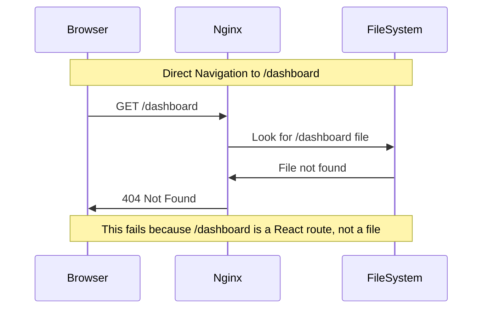
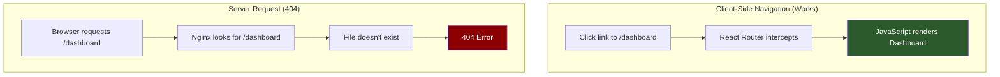
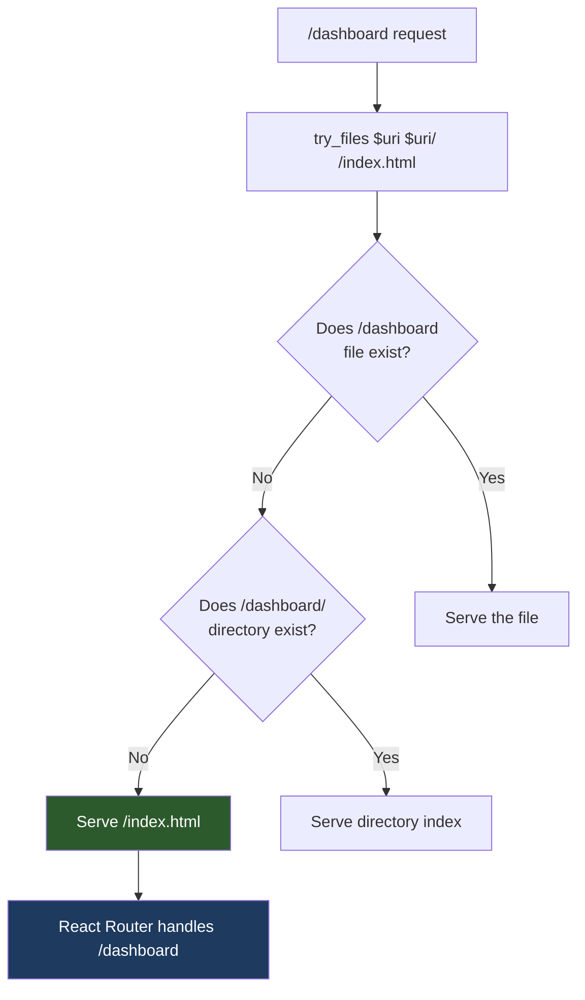
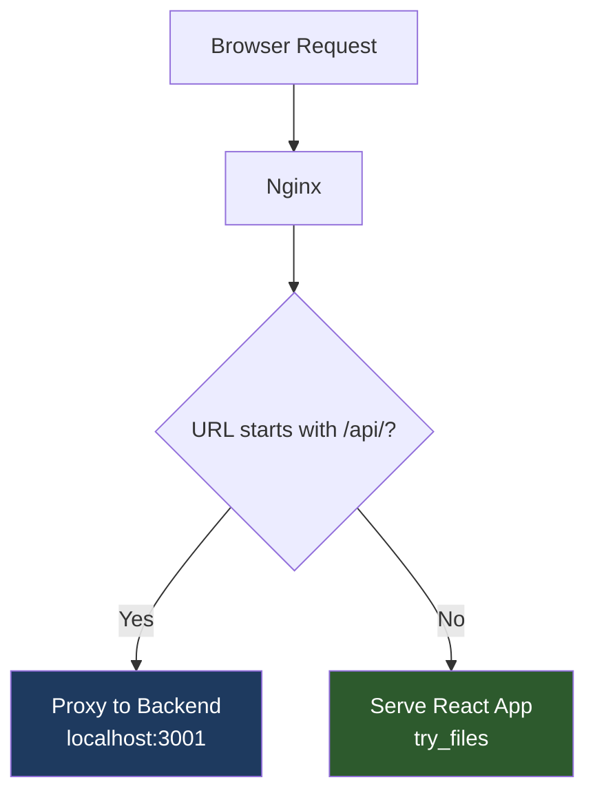

# How to Fix React Router 404 Errors in Nginx

Author: [nawazdhandala](https://www.github.com/nawazdhandala)

Tags: React, Nginx, React Router, SPA, Single Page Application, DevOps

Description: Learn how to configure Nginx to properly serve React applications with client-side routing, fixing 404 errors when refreshing or directly accessing routes.

---

A common issue when deploying React applications with React Router to Nginx is receiving 404 errors when refreshing the page or directly accessing a route. This happens because Nginx tries to find a physical file for the URL path instead of serving the React application. This guide explains the problem and provides complete solutions.

## Understanding the Problem



### Why This Happens

React Router uses client-side routing. When you navigate within the app, JavaScript handles the routing without making server requests. But when you:

- Refresh the page
- Directly type a URL
- Share a link

The browser makes a request to the server for that URL, and Nginx looks for a corresponding file.



## The Solution: try_files Directive

The fix is to configure Nginx to serve `index.html` for all routes that do not match static files:

```nginx
server {
    listen 80;
    server_name example.com;
    root /var/www/react-app;
    index index.html;

    location / {
        try_files $uri $uri/ /index.html;
    }
}
```

### How try_files Works



The `try_files` directive:

1. First tries to serve `$uri` - the exact file path
2. Then tries `$uri/` - as a directory
3. Finally falls back to `/index.html` - letting React handle routing

## Complete Nginx Configuration

### Basic Configuration

```nginx
server {
    listen 80;
    server_name example.com;
    root /var/www/react-app/build;
    index index.html;

    # Handle React Router
    location / {
        try_files $uri $uri/ /index.html;
    }

    # Cache static assets
    location /static/ {
        expires 1y;
        add_header Cache-Control "public, immutable";
    }

    # Error pages
    error_page 500 502 503 504 /50x.html;
    location = /50x.html {
        root /usr/share/nginx/html;
    }
}
```

### Production Configuration with HTTPS

```nginx
server {
    listen 80;
    server_name example.com;
    return 301 https://$server_name$request_uri;
}

server {
    listen 443 ssl http2;
    server_name example.com;

    ssl_certificate /etc/letsencrypt/live/example.com/fullchain.pem;
    ssl_certificate_key /etc/letsencrypt/live/example.com/privkey.pem;

    root /var/www/react-app/build;
    index index.html;

    # Security headers
    add_header X-Frame-Options "SAMEORIGIN" always;
    add_header X-Content-Type-Options "nosniff" always;
    add_header X-XSS-Protection "1; mode=block" always;
    add_header Referrer-Policy "strict-origin-when-cross-origin" always;

    # Gzip compression
    gzip on;
    gzip_vary on;
    gzip_min_length 1024;
    gzip_types text/plain text/css text/xml application/json application/javascript
               application/xml application/rss+xml application/atom+xml image/svg+xml;

    # Handle React Router - all routes serve index.html
    location / {
        try_files $uri $uri/ /index.html;
    }

    # Static files from Create React App build
    location /static/ {
        expires 1y;
        add_header Cache-Control "public, immutable";
        access_log off;
    }

    # Favicon and other root files
    location ~* ^/(favicon\.ico|manifest\.json|robots\.txt)$ {
        expires 1d;
        access_log off;
    }

    # Media files
    location ~* \.(jpg|jpeg|gif|png|ico|svg|webp)$ {
        expires 30d;
        add_header Cache-Control "public";
    }

    # JavaScript and CSS
    location ~* \.(js|css)$ {
        expires 1y;
        add_header Cache-Control "public, immutable";
    }
}
```

### Configuration with API Proxy

When your React app needs to communicate with a backend API:

```nginx
server {
    listen 80;
    server_name example.com;
    root /var/www/react-app/build;
    index index.html;

    # Proxy API requests to backend
    location /api/ {
        proxy_pass http://localhost:3001/api/;
        proxy_http_version 1.1;
        proxy_set_header Upgrade $http_upgrade;
        proxy_set_header Connection 'upgrade';
        proxy_set_header Host $host;
        proxy_set_header X-Real-IP $remote_addr;
        proxy_set_header X-Forwarded-For $proxy_add_x_forwarded_for;
        proxy_set_header X-Forwarded-Proto $scheme;
        proxy_cache_bypass $http_upgrade;
    }

    # React app - must come after API location
    location / {
        try_files $uri $uri/ /index.html;
    }
}
```



## Docker Configuration

### Dockerfile for React with Nginx

```dockerfile
# Build stage
FROM node:18-alpine AS build
WORKDIR /app
COPY package*.json ./
RUN npm ci
COPY . .
RUN npm run build

# Production stage
FROM nginx:alpine

# Copy custom nginx config
COPY nginx.conf /etc/nginx/conf.d/default.conf

# Copy built React app
COPY --from=build /app/build /usr/share/nginx/html

# Expose port
EXPOSE 80

# Start Nginx
CMD ["nginx", "-g", "daemon off;"]
```

### nginx.conf for Docker

```nginx
server {
    listen 80;
    server_name localhost;
    root /usr/share/nginx/html;
    index index.html;

    # React Router support
    location / {
        try_files $uri $uri/ /index.html;
    }

    # Cache static assets
    location /static/ {
        expires 1y;
        add_header Cache-Control "public, immutable";
    }

    # Health check endpoint
    location /health {
        access_log off;
        return 200 "healthy\n";
        add_header Content-Type text/plain;
    }
}
```

## Handling Different Routing Scenarios

### With basename (Sub-directory Deployment)

When deploying React to a sub-directory:

```javascript
// In your React app
import { BrowserRouter } from 'react-router-dom';

function App() {
  return (
    <BrowserRouter basename="/myapp">
      {/* Routes */}
    </BrowserRouter>
  );
}
```

Nginx configuration:

```nginx
server {
    listen 80;
    server_name example.com;

    # React app in subdirectory
    location /myapp {
        alias /var/www/react-app/build;
        index index.html;
        try_files $uri $uri/ /myapp/index.html;
    }

    # Main site
    location / {
        root /var/www/main-site;
        index index.html;
    }
}
```

### With Hash Router (No Server Config Needed)

If you use HashRouter, no Nginx configuration is needed because the route is after the # symbol:

```javascript
import { HashRouter } from 'react-router-dom';

function App() {
  return (
    <HashRouter>
      {/* Routes */}
    </HashRouter>
  );
}
```

URLs look like: `example.com/#/dashboard`

### Multiple React Apps

```nginx
server {
    listen 80;
    server_name example.com;

    # Admin app
    location /admin {
        alias /var/www/admin-app/build;
        try_files $uri $uri/ /admin/index.html;
    }

    # Main app
    location / {
        root /var/www/main-app/build;
        try_files $uri $uri/ /index.html;
    }
}
```

## Common Issues and Fixes

### Issue 1: Static Files Return index.html

```nginx
# Wrong - static files will return index.html if not found
location / {
    try_files $uri /index.html;
}

# Correct - only fallback for non-file requests
location / {
    try_files $uri $uri/ /index.html;
}

# Even better - explicit static file handling
location /static/ {
    try_files $uri =404;  # Return 404 for missing static files
}

location / {
    try_files $uri $uri/ /index.html;
}
```

### Issue 2: API Routes Getting index.html

```nginx
# Wrong order - React catches everything
location / {
    try_files $uri $uri/ /index.html;
}

location /api/ {
    proxy_pass http://backend;
}

# Correct order - API checked first
location /api/ {
    proxy_pass http://backend;
}

location / {
    try_files $uri $uri/ /index.html;
}
```

### Issue 3: Nested Routes Not Working

```nginx
# Make sure the fallback is the full path to index.html
location / {
    root /var/www/app/build;
    try_files $uri $uri/ /index.html;  # Relative to root
}

# Or with alias
location /app/ {
    alias /var/www/app/build/;
    try_files $uri $uri/ /app/index.html;  # Must include location prefix
}
```

## Testing Your Configuration

### Test with curl

```bash
# Test the main page
curl -I http://example.com/

# Test a React route (should return 200, not 404)
curl -I http://example.com/dashboard

# Verify the content is index.html
curl http://example.com/dashboard | head -20

# Test static files
curl -I http://example.com/static/js/main.abc123.js
```

### Verify Nginx Configuration

```bash
# Test configuration syntax
sudo nginx -t

# Reload after changes
sudo nginx -s reload

# Check error logs
tail -f /var/log/nginx/error.log
```

## Complete Example with All Features

```nginx
# /etc/nginx/sites-available/react-app

server {
    listen 80;
    server_name example.com;
    return 301 https://$server_name$request_uri;
}

server {
    listen 443 ssl http2;
    server_name example.com;

    ssl_certificate /etc/letsencrypt/live/example.com/fullchain.pem;
    ssl_certificate_key /etc/letsencrypt/live/example.com/privkey.pem;

    root /var/www/react-app/build;
    index index.html;

    # Security
    add_header X-Frame-Options "SAMEORIGIN" always;
    add_header X-Content-Type-Options "nosniff" always;
    add_header Content-Security-Policy "default-src 'self';" always;

    # Compression
    gzip on;
    gzip_types text/plain text/css application/json application/javascript text/xml;

    # API proxy
    location /api/ {
        proxy_pass http://127.0.0.1:3001;
        proxy_http_version 1.1;
        proxy_set_header Host $host;
        proxy_set_header X-Real-IP $remote_addr;
    }

    # Static assets - long cache
    location /static/ {
        expires 1y;
        add_header Cache-Control "public, immutable";
    }

    # Service worker - no cache
    location /service-worker.js {
        add_header Cache-Control "no-cache";
        expires 0;
    }

    # React Router fallback
    location / {
        try_files $uri $uri/ /index.html;
    }
}
```

## Summary

React Router 404 errors in Nginx occur because the server does not understand client-side routing. The solution is:

1. **Use `try_files`** to fallback to `index.html` for routes that do not match files
2. **Order locations correctly** - API routes before the catch-all
3. **Handle static files explicitly** to avoid caching issues
4. **Test thoroughly** with curl and browser refresh

The key configuration line is:

```nginx
try_files $uri $uri/ /index.html;
```

This tells Nginx: "Try to serve the file, then try a directory, and if neither exists, serve index.html and let React Router handle the URL."
