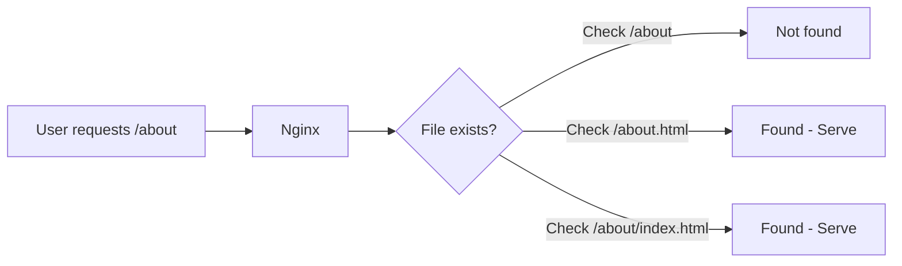

# How to Remove File Extensions (.php/.html) from URLs in Nginx

Author: [nawazdhandala](https://github.com/nawazdhandala)

Tags: Nginx, SEO, Clean URLs, Web Server, Configuration

Description: Learn how to configure Nginx to serve clean URLs without file extensions, including try_files configurations, redirects for SEO, and handling both .php and .html files.

---

Clean URLs without file extensions look more professional and are better for SEO. Instead of `example.com/about.html` or `example.com/contact.php`, users see `example.com/about` and `example.com/contact`. This guide shows you how to configure Nginx to serve content without exposing file extensions.

## Understanding the Goal



We want Nginx to:
1. Accept requests without extensions
2. Find and serve the correct file
3. Optionally redirect old URLs with extensions

## Solution 1: HTML Files with try_files

### Basic Clean URLs for HTML

```nginx
server {
    listen 80;
    server_name example.com;
    root /var/www/html;
    index index.html;

    location / {
        # Try: exact file, then with .html, then directory, then 404
        try_files $uri $uri.html $uri/ =404;
    }
}
```

This handles:
- `/about` serves `/about.html`
- `/contact` serves `/contact.html`
- `/blog` serves `/blog/index.html` (if directory exists)
- `/` serves `/index.html`

### Redirect Old URLs with Extensions

For SEO, redirect requests with `.html` to clean URLs:

```nginx
server {
    listen 80;
    server_name example.com;
    root /var/www/html;
    index index.html;

    # Redirect .html URLs to clean URLs
    location ~ ^(.+)\.html$ {
        return 301 $scheme://$host$1;
    }

    location / {
        try_files $uri $uri.html $uri/ =404;
    }
}
```

Now:
- `/about.html` redirects to `/about` (301)
- `/about` serves the content

## Solution 2: PHP Files with FastCGI

### Basic Clean URLs for PHP

```nginx
server {
    listen 80;
    server_name example.com;
    root /var/www/html;
    index index.php index.html;

    location / {
        try_files $uri $uri.php $uri/ =404;
    }

    # Handle PHP files
    location ~ \.php$ {
        # Security: only process existing files
        try_files $uri =404;

        fastcgi_pass unix:/run/php/php-fpm.sock;
        fastcgi_index index.php;
        fastcgi_param SCRIPT_FILENAME $document_root$fastcgi_script_name;
        include fastcgi_params;
    }
}
```

### Clean URLs with PHP and Redirects

```nginx
server {
    listen 80;
    server_name example.com;
    root /var/www/html;
    index index.php index.html;

    # Redirect .php URLs to clean URLs (except for direct PHP processing)
    if ($request_uri ~ ^(.+)\.php$) {
        return 301 $scheme://$host$1;
    }

    location / {
        # Try without extension first, then with .php
        try_files $uri $uri/ @php;
    }

    location @php {
        # Check if .php file exists
        try_files $uri.php =404;

        fastcgi_pass unix:/run/php/php-fpm.sock;
        fastcgi_param SCRIPT_FILENAME $document_root$uri.php;
        include fastcgi_params;
    }

    # Block direct .php access (after redirect)
    location ~ \.php$ {
        internal;
        fastcgi_pass unix:/run/php/php-fpm.sock;
        fastcgi_param SCRIPT_FILENAME $document_root$fastcgi_script_name;
        include fastcgi_params;
    }
}
```

## Solution 3: Mixed HTML and PHP

Handle both file types:

```nginx
server {
    listen 80;
    server_name example.com;
    root /var/www/html;
    index index.php index.html;

    # Redirect both .html and .php to clean URLs
    location ~ ^(.+)\.(html|php)$ {
        return 301 $scheme://$host$1;
    }

    location / {
        # Try: exact, .html, .php, directory, 404
        try_files $uri $uri.html $uri.php $uri/ =404;
    }

    location ~ \.php$ {
        internal;  # Only accessible via try_files
        fastcgi_pass unix:/run/php/php-fpm.sock;
        fastcgi_param SCRIPT_FILENAME $document_root$fastcgi_script_name;
        include fastcgi_params;
    }
}
```

## Solution 4: Using rewrite Rules

For more complex URL patterns:

```nginx
server {
    listen 80;
    server_name example.com;
    root /var/www/html;

    # Remove .html extension
    rewrite ^(/.*)\.html(\?.*)?$ $1$2 permanent;

    # Remove .php extension
    rewrite ^(/.*)\.php(\?.*)?$ $1$2 permanent;

    location / {
        # Internal rewrite to add extension back
        try_files $uri $uri.html $uri.php $uri/ =404;
    }

    location ~ \.php$ {
        internal;
        fastcgi_pass unix:/run/php/php-fpm.sock;
        fastcgi_param SCRIPT_FILENAME $document_root$fastcgi_script_name;
        include fastcgi_params;
    }
}
```

## Handling Query Strings

Preserve query strings during redirects:

```nginx
# With query string preservation
location ~ ^(.+)\.html$ {
    return 301 $scheme://$host$1$is_args$args;
}

# Example: /search.html?q=test -> /search?q=test
```

## Handling Index Files in Directories

```nginx
server {
    listen 80;
    server_name example.com;
    root /var/www/html;

    location / {
        # Check for index files in directories
        try_files $uri $uri.html $uri/ $uri/index.html $uri/index.php =404;
    }

    # Redirect /dir/index to /dir/
    location ~ /index\.(html|php)$ {
        rewrite ^(.*)/index\.(html|php)$ $1/ permanent;
    }

    location ~ \.php$ {
        internal;
        fastcgi_pass unix:/run/php/php-fpm.sock;
        fastcgi_param SCRIPT_FILENAME $document_root$fastcgi_script_name;
        include fastcgi_params;
    }
}
```

## Complete Production Configuration

### For Static Sites (HTML)

```nginx
server {
    listen 80;
    listen 443 ssl http2;
    server_name example.com;
    root /var/www/html;

    # SSL configuration
    ssl_certificate /etc/ssl/certs/example.com.crt;
    ssl_certificate_key /etc/ssl/private/example.com.key;

    # Redirect HTTP to HTTPS
    if ($scheme = http) {
        return 301 https://$host$request_uri;
    }

    # Remove .html extension (301 redirect)
    location ~ ^(.+)\.html$ {
        return 301 $scheme://$host$1$is_args$args;
    }

    # Remove trailing slash (except root)
    rewrite ^/(.*)/$ /$1 permanent;

    # Main location
    location / {
        try_files $uri $uri.html $uri/ =404;
    }

    # Caching for assets
    location ~* \.(css|js|jpg|jpeg|png|gif|ico|svg|woff|woff2)$ {
        expires 1y;
        add_header Cache-Control "public, immutable";
    }

    # Custom 404 page
    error_page 404 /404.html;
    location = /404.html {
        internal;
    }
}
```

### For PHP Applications

```nginx
server {
    listen 80;
    listen 443 ssl http2;
    server_name example.com;
    root /var/www/html;
    index index.php index.html;

    ssl_certificate /etc/ssl/certs/example.com.crt;
    ssl_certificate_key /etc/ssl/private/example.com.key;

    # Redirect .php to clean URL
    location ~ ^(.+)\.php$ {
        return 301 $scheme://$host$1$is_args$args;
    }

    # Redirect .html to clean URL
    location ~ ^(.+)\.html$ {
        return 301 $scheme://$host$1$is_args$args;
    }

    location / {
        try_files $uri $uri.html @php;
    }

    location @php {
        try_files $uri.php $uri/ =404;

        fastcgi_pass unix:/run/php/php-fpm.sock;
        fastcgi_index index.php;
        fastcgi_param SCRIPT_FILENAME $document_root$uri.php;
        include fastcgi_params;

        # Security headers
        fastcgi_param HTTP_PROXY "";
    }

    # Handle directory index.php
    location ~ /$ {
        try_files $uri/index.html @directory_php;
    }

    location @directory_php {
        fastcgi_pass unix:/run/php/php-fpm.sock;
        fastcgi_param SCRIPT_FILENAME $document_root$uri/index.php;
        include fastcgi_params;
    }

    # Block direct PHP access
    location ~ \.php$ {
        internal;
    }

    # Static assets
    location ~* \.(css|js|jpg|jpeg|png|gif|ico|svg)$ {
        expires 1y;
        try_files $uri =404;
    }

    error_page 404 /404.php;
}
```

## Testing Your Configuration

### Test Cases

```bash
# Test clean URL works
curl -I http://example.com/about
# Should return 200

# Test extension redirects
curl -I http://example.com/about.html
# Should return 301 -> /about

# Test with query string
curl -I "http://example.com/search.php?q=test"
# Should return 301 -> /search?q=test

# Test directory index
curl -I http://example.com/blog/
# Should return 200 (serving index.html or index.php)
```

### Common Issues

| Problem | Cause | Solution |
|---------|-------|----------|
| Redirect loop | try_files includes .html in redirect block | Use `internal` directive |
| 404 on clean URLs | try_files order wrong | Check file exists, order matters |
| PHP not executing | Missing fastcgi block | Add proper PHP handler |
| Assets not loading | Relative paths broken | Use absolute paths or `<base>` tag |

## SEO Considerations

When implementing clean URLs:

1. **Use 301 redirects**: Permanent redirects pass link equity
2. **Update internal links**: Change all links to clean URLs
3. **Update sitemap**: Use clean URLs in sitemap.xml
4. **Canonical tags**: Add `<link rel="canonical">` to prevent duplicates

```html
<!-- In your HTML head -->
<link rel="canonical" href="https://example.com/about">
```

## Summary

Removing file extensions from URLs in Nginx requires:

1. **try_files directive**: Maps clean URLs to actual files
2. **Redirect rules**: Send old URLs to clean versions with 301
3. **PHP handling**: Use internal locations for FastCGI
4. **Query string preservation**: Use `$is_args$args` in redirects

The key is understanding the order of operations: redirect first, then use `try_files` to find the actual file. This gives you clean, SEO-friendly URLs while maintaining full functionality.
