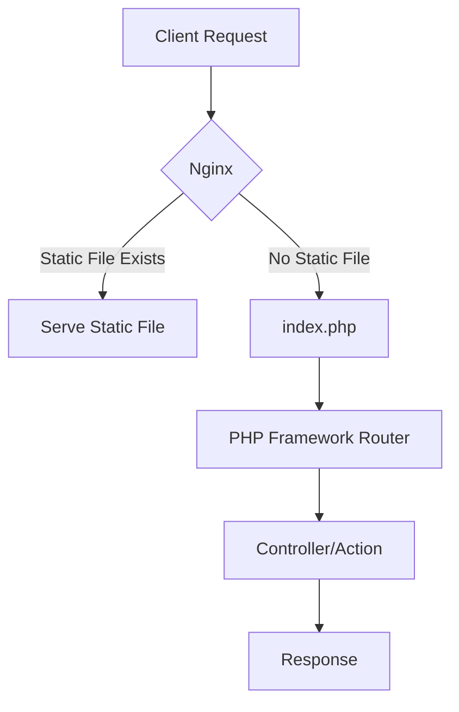

# How to Rewrite All Requests to index.php in Nginx

Author: [nawazdhandala](https://www.github.com/nawazdhandala)

Tags: Nginx, PHP, URL Rewriting, Front Controller, Laravel, WordPress, Symfony

Description: Learn how to configure Nginx to route all requests through index.php for PHP frameworks using the front controller pattern, including configurations for Laravel, WordPress, and Symfony.

---

## Understanding the Front Controller Pattern

Modern PHP frameworks like Laravel, Symfony, and WordPress use a "front controller" pattern where a single entry point (index.php) handles all requests. The framework then routes the request internally based on the URL path.



## Basic Configuration

The simplest way to route all requests to index.php:

```nginx
server {
    listen 80;
    server_name example.com;
    root /var/www/html/public;
    index index.php;

    location / {
        try_files $uri $uri/ /index.php?$query_string;
    }

    location ~ \.php$ {
        fastcgi_pass unix:/var/run/php/php8.2-fpm.sock;
        fastcgi_param SCRIPT_FILENAME $realpath_root$fastcgi_script_name;
        include fastcgi_params;
    }
}
```

### How try_files Works

The `try_files` directive checks in order:

1. `$uri` - Does the exact file exist?
2. `$uri/` - Does a directory with index file exist?
3. `/index.php?$query_string` - Fall back to index.php with query string

## Framework-Specific Configurations

### Laravel Configuration

```nginx
server {
    listen 80;
    server_name laravel.example.com;
    root /var/www/laravel/public;
    index index.php;

    charset utf-8;

    # Serve static files directly
    location / {
        try_files $uri $uri/ /index.php?$query_string;
    }

    # Handle PHP files
    location ~ \.php$ {
        fastcgi_pass unix:/var/run/php/php8.2-fpm.sock;
        fastcgi_param SCRIPT_FILENAME $realpath_root$fastcgi_script_name;
        include fastcgi_params;
        fastcgi_hide_header X-Powered-By;
    }

    # Deny access to sensitive files
    location ~ /\.(?!well-known).* {
        deny all;
    }

    # Deny access to sensitive directories
    location ~ ^/(storage|bootstrap/cache) {
        deny all;
    }

    # Static file caching
    location ~* \.(jpg|jpeg|png|gif|ico|css|js|woff|woff2)$ {
        expires 1y;
        add_header Cache-Control "public, immutable";
    }
}
```

### WordPress Configuration

```nginx
server {
    listen 80;
    server_name wordpress.example.com;
    root /var/www/wordpress;
    index index.php;

    # WordPress permalinks
    location / {
        try_files $uri $uri/ /index.php?$args;
    }

    # Pass PHP scripts to FastCGI server
    location ~ \.php$ {
        # Prevent PHP execution in uploads
        location ~ /uploads/ {
            deny all;
        }

        fastcgi_split_path_info ^(.+\.php)(/.+)$;
        fastcgi_pass unix:/var/run/php/php8.2-fpm.sock;
        fastcgi_index index.php;
        fastcgi_param SCRIPT_FILENAME $document_root$fastcgi_script_name;
        include fastcgi_params;
    }

    # Deny access to sensitive files
    location ~* /(?:uploads|files)/.*\.php$ {
        deny all;
    }

    location ~ /\.ht {
        deny all;
    }

    location = /wp-config.php {
        deny all;
    }

    # WordPress admin
    location /wp-admin/ {
        try_files $uri $uri/ /wp-admin/index.php?$args;
    }

    # Static file caching
    location ~* \.(js|css|png|jpg|jpeg|gif|ico|svg|woff|woff2)$ {
        expires 1y;
        add_header Cache-Control "public, immutable";
        log_not_found off;
    }
}
```

### Symfony Configuration

```nginx
server {
    listen 80;
    server_name symfony.example.com;
    root /var/www/symfony/public;
    index index.php;

    location / {
        try_files $uri /index.php$is_args$args;
    }

    # DEV environment - allow access to index_dev.php
    location ~ ^/index\.php(/|$) {
        fastcgi_pass unix:/var/run/php/php8.2-fpm.sock;
        fastcgi_split_path_info ^(.+\.php)(/.*)$;
        include fastcgi_params;

        fastcgi_param SCRIPT_FILENAME $realpath_root$fastcgi_script_name;
        fastcgi_param DOCUMENT_ROOT $realpath_root;

        # Prevents URIs that include the front controller
        internal;
    }

    # Return 404 for all other PHP files
    location ~ \.php$ {
        return 404;
    }

    # Deny access to sensitive directories
    location ~ ^/(config|var|src|templates)/ {
        deny all;
    }
}
```

### CodeIgniter Configuration

```nginx
server {
    listen 80;
    server_name ci.example.com;
    root /var/www/codeigniter/public;
    index index.php;

    location / {
        try_files $uri $uri/ /index.php?/$request_uri;
    }

    location ~ \.php$ {
        fastcgi_pass unix:/var/run/php/php8.2-fpm.sock;
        fastcgi_param SCRIPT_FILENAME $document_root$fastcgi_script_name;
        include fastcgi_params;
    }

    # Deny access to system folder
    location /app/ {
        deny all;
    }

    location /system/ {
        deny all;
    }
}
```

## Advanced Configurations

### Multi-Site Setup

Run multiple PHP applications from one server:

```nginx
server {
    listen 80;
    server_name example.com;

    # Main site - Laravel
    location / {
        alias /var/www/main/public/;
        try_files $uri $uri/ @main_php;
    }

    location @main_php {
        fastcgi_pass unix:/var/run/php/php8.2-fpm.sock;
        fastcgi_param SCRIPT_FILENAME /var/www/main/public/index.php;
        fastcgi_param SCRIPT_NAME /index.php;
        include fastcgi_params;
    }

    # Blog - WordPress
    location /blog/ {
        alias /var/www/blog/;
        try_files $uri $uri/ @blog_php;
    }

    location @blog_php {
        fastcgi_pass unix:/var/run/php/php8.2-fpm.sock;
        fastcgi_param SCRIPT_FILENAME /var/www/blog/index.php;
        include fastcgi_params;
    }

    # API - Symfony
    location /api/ {
        alias /var/www/api/public/;
        try_files $uri $uri/ @api_php;
    }

    location @api_php {
        fastcgi_pass unix:/var/run/php/php8.2-fpm.sock;
        fastcgi_param SCRIPT_FILENAME /var/www/api/public/index.php;
        include fastcgi_params;
    }
}
```

### With PATH_INFO Support

Some applications need PATH_INFO for routing:

```nginx
server {
    listen 80;
    server_name example.com;
    root /var/www/html;
    index index.php;

    location / {
        try_files $uri $uri/ /index.php$is_args$args;
    }

    location ~ ^(.+\.php)(.*)$ {
        fastcgi_split_path_info ^(.+\.php)(.*)$;
        fastcgi_pass unix:/var/run/php/php8.2-fpm.sock;
        fastcgi_index index.php;

        fastcgi_param SCRIPT_FILENAME $document_root$fastcgi_script_name;
        fastcgi_param PATH_INFO $fastcgi_path_info;
        fastcgi_param PATH_TRANSLATED $document_root$fastcgi_path_info;

        include fastcgi_params;
    }
}
```

### Excluding Specific Paths

Route everything to index.php except certain paths:

```nginx
server {
    listen 80;
    server_name example.com;
    root /var/www/html/public;
    index index.php;

    # Static files served directly
    location /static/ {
        alias /var/www/html/static/;
        expires 1y;
    }

    # File downloads - bypass PHP
    location /downloads/ {
        alias /var/www/html/downloads/;
        add_header Content-Disposition "attachment";
    }

    # Health check - simple response
    location /health {
        return 200 "OK";
        add_header Content-Type text/plain;
    }

    # Everything else goes to PHP
    location / {
        try_files $uri $uri/ /index.php?$query_string;
    }

    location ~ \.php$ {
        fastcgi_pass unix:/var/run/php/php8.2-fpm.sock;
        fastcgi_param SCRIPT_FILENAME $realpath_root$fastcgi_script_name;
        include fastcgi_params;
    }
}
```

### API with Versioning

```nginx
server {
    listen 80;
    server_name api.example.com;
    root /var/www/api/public;
    index index.php;

    # API versioning
    location ~ ^/v(\d+)/ {
        try_files $uri $uri/ /index.php?$query_string;
    }

    # Default version
    location / {
        try_files $uri $uri/ /index.php?$query_string;
    }

    location ~ \.php$ {
        fastcgi_pass unix:/var/run/php/php8.2-fpm.sock;
        fastcgi_param SCRIPT_FILENAME $realpath_root$fastcgi_script_name;
        include fastcgi_params;

        # CORS headers
        add_header Access-Control-Allow-Origin * always;
        add_header Access-Control-Allow-Methods "GET, POST, PUT, DELETE, OPTIONS" always;
        add_header Access-Control-Allow-Headers "Authorization, Content-Type" always;
    }
}
```

## Security Considerations

### Prevent Direct PHP File Access

Only allow index.php to be executed:

```nginx
server {
    listen 80;
    server_name example.com;
    root /var/www/html/public;

    location / {
        try_files $uri $uri/ /index.php?$query_string;
    }

    # Only allow index.php
    location = /index.php {
        fastcgi_pass unix:/var/run/php/php8.2-fpm.sock;
        fastcgi_param SCRIPT_FILENAME $realpath_root$fastcgi_script_name;
        include fastcgi_params;
    }

    # Deny all other PHP files
    location ~ \.php$ {
        return 404;
    }
}
```

### Hide Sensitive Files

```nginx
server {
    listen 80;
    server_name example.com;
    root /var/www/html/public;

    # Block hidden files
    location ~ /\. {
        deny all;
    }

    # Block backup files
    location ~ ~$ {
        deny all;
    }

    # Block config files
    location ~* \.(env|ini|log|conf|config)$ {
        deny all;
    }

    # Block composer files
    location ~ composer\.(json|lock)$ {
        deny all;
    }

    location / {
        try_files $uri $uri/ /index.php?$query_string;
    }

    location ~ \.php$ {
        fastcgi_pass unix:/var/run/php/php8.2-fpm.sock;
        fastcgi_param SCRIPT_FILENAME $realpath_root$fastcgi_script_name;
        include fastcgi_params;
    }
}
```

## Complete Production Configuration

```nginx
server {
    listen 80;
    server_name example.com;
    return 301 https://$server_name$request_uri;
}

server {
    listen 443 ssl http2;
    server_name example.com;
    root /var/www/html/public;
    index index.php;

    # SSL configuration
    ssl_certificate /etc/nginx/ssl/cert.pem;
    ssl_certificate_key /etc/nginx/ssl/key.pem;
    ssl_protocols TLSv1.2 TLSv1.3;

    # Security headers
    add_header X-Frame-Options "SAMEORIGIN" always;
    add_header X-Content-Type-Options "nosniff" always;
    add_header X-XSS-Protection "1; mode=block" always;

    # Gzip compression
    gzip on;
    gzip_types text/plain text/css application/json application/javascript text/xml application/xml;

    # Logging
    access_log /var/log/nginx/example.access.log;
    error_log /var/log/nginx/example.error.log;

    # Block sensitive files
    location ~ /\. {
        deny all;
    }

    location ~ \.(env|ini|log)$ {
        deny all;
    }

    # Static files with caching
    location ~* \.(jpg|jpeg|png|gif|ico|css|js|woff|woff2|svg)$ {
        expires 1y;
        add_header Cache-Control "public, immutable";
        access_log off;
        try_files $uri =404;
    }

    # Health check
    location /health {
        access_log off;
        return 200 "healthy\n";
        add_header Content-Type text/plain;
    }

    # Main application
    location / {
        try_files $uri $uri/ /index.php?$query_string;
    }

    # PHP handling
    location ~ \.php$ {
        try_files $uri =404;
        fastcgi_pass unix:/var/run/php/php8.2-fpm.sock;
        fastcgi_index index.php;
        fastcgi_param SCRIPT_FILENAME $realpath_root$fastcgi_script_name;
        include fastcgi_params;

        fastcgi_hide_header X-Powered-By;
        fastcgi_read_timeout 60s;
        fastcgi_buffer_size 128k;
        fastcgi_buffers 4 256k;
    }
}
```

## Debugging

### Test Configuration

```bash
# Check syntax
nginx -t

# Test URL rewriting
curl -I http://example.com/some/path
curl -I http://example.com/api/users
```

### Check PHP Processing

```bash
# Verify PHP-FPM is running
systemctl status php8.2-fpm

# Check FastCGI socket
ls -la /var/run/php/php8.2-fpm.sock

# Test PHP directly
php -r "echo 'PHP works';"
```

## Key Takeaways

1. Use `try_files $uri $uri/ /index.php?$query_string` for front controller routing
2. Always include query string preservation (`$query_string` or `$args`)
3. Serve static files directly without PHP processing
4. Block access to sensitive files and directories
5. Use `$realpath_root` instead of `$document_root` for better symlink handling
6. Configure appropriate timeouts and buffer sizes for PHP
7. Monitor PHP-FPM and Nginx performance with OneUptime to catch issues early

The front controller pattern combined with proper Nginx configuration gives you clean URLs, centralized routing, and optimal performance for PHP applications.
