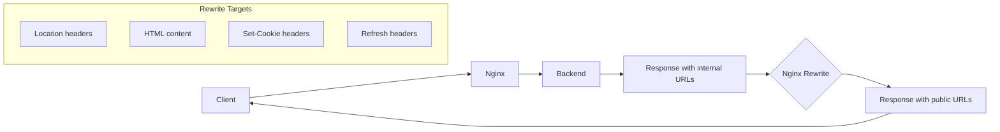

# How to Rewrite URLs in Proxy Responses in Nginx

Author: [nawazdhandala](https://www.github.com/nawazdhandala)

Tags: Nginx, Reverse Proxy, URL Rewriting, sub_filter, proxy_redirect, Response Modification

Description: Learn how to rewrite URLs in proxy responses using Nginx, including modifying redirect headers, HTML content, and handling absolute URLs in backend responses.

---

## Understanding Response URL Rewriting

When Nginx proxies requests to a backend server, the backend might return responses containing URLs that reference its internal address rather than the public-facing domain. This is common with redirect headers, HTML links, and API responses. Nginx provides several mechanisms to rewrite these URLs in the response.



## Method 1: proxy_redirect for Location Headers

The `proxy_redirect` directive rewrites the `Location` and `Refresh` headers in backend responses:

### Basic Usage

```nginx
server {
    listen 80;
    server_name public.example.com;

    location / {
        proxy_pass http://internal-backend:8080;

        # Rewrite redirect headers
        proxy_redirect http://internal-backend:8080/ http://public.example.com/;
    }
}
```

### Multiple Rewrites

```nginx
location / {
    proxy_pass http://backend:8080;

    # Multiple redirect rules
    proxy_redirect http://backend:8080/ /;
    proxy_redirect http://localhost:8080/ /;
    proxy_redirect http://127.0.0.1:8080/ /;
}
```

### Using Default

```nginx
location /app/ {
    proxy_pass http://backend:8080/;

    # 'default' rewrites based on proxy_pass and location
    proxy_redirect default;
}
```

### Protocol-Relative Rewrites

```nginx
location / {
    proxy_pass http://backend:8080;

    # Handle both HTTP and HTTPS
    proxy_redirect http://backend:8080/ $scheme://$host/;
    proxy_redirect https://backend:8080/ $scheme://$host/;
}
```

### Disable Redirect Rewriting

```nginx
location / {
    proxy_pass http://backend:8080;

    # Pass redirects through unchanged
    proxy_redirect off;
}
```

## Method 2: sub_filter for Response Body

The `sub_filter` directive modifies the response body content. This requires the `ngx_http_sub_module` module.

### Basic Content Replacement

```nginx
location / {
    proxy_pass http://backend:8080;

    # Enable sub_filter for this location
    sub_filter_once off;  # Replace all occurrences, not just first
    sub_filter_types text/html text/css application/javascript application/json;

    # Replace URLs in response body
    sub_filter 'http://internal-backend:8080' 'https://public.example.com';
    sub_filter 'internal-backend:8080' 'public.example.com';
}
```

### Multiple Replacements

```nginx
location / {
    proxy_pass http://backend:8080;

    sub_filter_once off;
    sub_filter_types text/html text/css application/javascript;

    # Multiple replacement rules
    sub_filter 'http://backend:8080' '$scheme://$host';
    sub_filter 'href="/' 'href="https://public.example.com/';
    sub_filter 'src="/' 'src="https://public.example.com/';
    sub_filter 'action="/' 'action="https://public.example.com/';
}
```

### Handle Compressed Responses

Backend responses might be gzip compressed. You need to decompress before filtering:

```nginx
location / {
    proxy_pass http://backend:8080;

    # Decompress backend response for filtering
    proxy_set_header Accept-Encoding "";

    # Or use gunzip module
    # gunzip on;

    sub_filter_once off;
    sub_filter_types text/html;
    sub_filter 'http://backend:8080' 'https://public.example.com';
}
```

## Method 3: proxy_cookie_domain and proxy_cookie_path

Rewrite cookies set by the backend:

```nginx
location / {
    proxy_pass http://backend:8080;

    # Rewrite cookie domain
    proxy_cookie_domain backend.internal public.example.com;
    proxy_cookie_domain ~\.internal\.local$ .example.com;

    # Rewrite cookie path
    proxy_cookie_path /internal/ /;
    proxy_cookie_path ~^/app/(.+)$ /$1;
}
```

### Complete Cookie Handling

```nginx
location / {
    proxy_pass http://backend:8080;

    # Cookie domain rewrite
    proxy_cookie_domain backend.internal public.example.com;

    # Cookie path rewrite
    proxy_cookie_path /backend/ /;

    # Cookie flags (Nginx 1.19.3+)
    proxy_cookie_flags ~ secure samesite=strict;
}
```

## Method 4: Using Headers More Module

For advanced header manipulation, use the `headers-more-nginx-module`:

```nginx
location / {
    proxy_pass http://backend:8080;

    # Modify response headers
    more_set_headers "X-Backend: hidden";
    more_clear_headers "X-Powered-By";

    # Conditional header replacement
    more_set_headers -s '301 302' 'Location: https://public.example.com$upstream_http_location';
}
```

## Complete Configuration Examples

### API Gateway with URL Rewriting

```nginx
upstream api_backend {
    server 192.168.1.10:8080;
    server 192.168.1.11:8080;
}

server {
    listen 443 ssl;
    server_name api.example.com;

    ssl_certificate /etc/nginx/ssl/cert.pem;
    ssl_certificate_key /etc/nginx/ssl/key.pem;

    location / {
        proxy_pass http://api_backend;
        proxy_http_version 1.1;
        proxy_set_header Host $host;
        proxy_set_header X-Real-IP $remote_addr;
        proxy_set_header X-Forwarded-For $proxy_add_x_forwarded_for;
        proxy_set_header X-Forwarded-Proto $scheme;

        # Rewrite Location headers
        proxy_redirect http://192.168.1.10:8080/ https://api.example.com/;
        proxy_redirect http://192.168.1.11:8080/ https://api.example.com/;
        proxy_redirect http://localhost:8080/ https://api.example.com/;

        # Rewrite cookies
        proxy_cookie_domain ~^(.+)\.internal$ .example.com;
        proxy_cookie_path /api/ /;

        # Rewrite JSON response body (for absolute URLs in API responses)
        sub_filter_once off;
        sub_filter_types application/json;
        sub_filter '"http://192.168.1' '"https://api.example.com';
        sub_filter '"http://localhost:8080' '"https://api.example.com';
    }
}
```

### Legacy Application Proxy

```nginx
server {
    listen 80;
    server_name app.example.com;

    location / {
        proxy_pass http://legacy-app:8080/webapp/;
        proxy_http_version 1.1;
        proxy_set_header Host $host;
        proxy_set_header X-Real-IP $remote_addr;

        # Handle redirects from /webapp/* to /*
        proxy_redirect http://legacy-app:8080/webapp/ http://app.example.com/;
        proxy_redirect /webapp/ /;

        # Disable compression for sub_filter to work
        proxy_set_header Accept-Encoding "";

        # Rewrite absolute URLs in HTML
        sub_filter_once off;
        sub_filter_types text/html text/css application/javascript;
        sub_filter '/webapp/' '/';
        sub_filter 'http://legacy-app:8080' 'http://app.example.com';
        sub_filter 'href="/webapp' 'href="';
        sub_filter 'src="/webapp' 'src="';
        sub_filter 'action="/webapp' 'action="';

        # Cookie handling
        proxy_cookie_path /webapp/ /;
    }
}
```

### Microservices Gateway

```nginx
map $uri $backend_service {
    ~^/users    http://user-service:8080;
    ~^/orders   http://order-service:8080;
    ~^/products http://product-service:8080;
    default     http://default-service:8080;
}

server {
    listen 443 ssl;
    server_name gateway.example.com;

    ssl_certificate /etc/nginx/ssl/cert.pem;
    ssl_certificate_key /etc/nginx/ssl/key.pem;

    location / {
        proxy_pass $backend_service;
        proxy_http_version 1.1;
        proxy_set_header Host $host;
        proxy_set_header X-Real-IP $remote_addr;
        proxy_set_header X-Forwarded-Proto $scheme;

        # Generic redirect rewriting
        proxy_redirect ~^http://[^/]+/(.*)$ https://gateway.example.com/$1;

        # Rewrite internal service names in JSON responses
        sub_filter_once off;
        sub_filter_types application/json;
        sub_filter 'user-service:8080' 'gateway.example.com';
        sub_filter 'order-service:8080' 'gateway.example.com';
        sub_filter 'product-service:8080' 'gateway.example.com';
    }
}
```

### WordPress Behind Proxy

```nginx
server {
    listen 443 ssl;
    server_name blog.example.com;

    ssl_certificate /etc/nginx/ssl/cert.pem;
    ssl_certificate_key /etc/nginx/ssl/key.pem;

    location / {
        proxy_pass http://wordpress:80;
        proxy_http_version 1.1;
        proxy_set_header Host $host;
        proxy_set_header X-Real-IP $remote_addr;
        proxy_set_header X-Forwarded-For $proxy_add_x_forwarded_for;
        proxy_set_header X-Forwarded-Proto $scheme;

        # WordPress-specific redirects
        proxy_redirect http://wordpress/ https://blog.example.com/;
        proxy_redirect http://localhost/ https://blog.example.com/;

        # Disable compression for sub_filter
        proxy_set_header Accept-Encoding "";

        # Rewrite WordPress URLs in content
        sub_filter_once off;
        sub_filter_types text/html text/css application/javascript application/json;
        sub_filter 'http://wordpress' 'https://blog.example.com';
        sub_filter 'http://localhost' 'https://blog.example.com';

        # Cookie handling
        proxy_cookie_domain wordpress blog.example.com;
        proxy_cookie_domain localhost blog.example.com;
    }
}
```

## Debugging URL Rewriting

### Check Response Headers

```bash
# View original backend response headers
curl -I http://backend:8080/api/resource

# View proxied response headers
curl -I http://nginx-server/api/resource

# Compare Location headers
curl -sI http://nginx-server/login | grep -i location
```

### Enable Debug Logging

```nginx
error_log /var/log/nginx/error.log debug;

server {
    listen 80;

    location / {
        proxy_pass http://backend:8080;
        proxy_redirect http://backend:8080/ /;

        # Log upstream response headers
        # Check error.log with debug level
    }
}
```

### Test sub_filter

```bash
# Get raw response from backend
curl http://backend:8080/page.html | grep -o 'http://[^"]*'

# Get proxied response
curl http://nginx-server/page.html | grep -o 'http://[^"]*'

# Compare to see if URLs were rewritten
```

## Performance Considerations

1. **sub_filter impact**: Body rewriting requires buffering the entire response, which uses memory
2. **Disable gzip from backend**: `proxy_set_header Accept-Encoding ""` to avoid decompression overhead
3. **Be specific with sub_filter_types**: Only process content types that need rewriting
4. **Use proxy_redirect first**: It is more efficient than sub_filter for header rewrites

## Key Takeaways

1. Use `proxy_redirect` for rewriting Location and Refresh headers
2. Use `sub_filter` for rewriting URLs in response bodies
3. Use `proxy_cookie_domain` and `proxy_cookie_path` for cookie handling
4. Disable backend compression when using `sub_filter`
5. Be specific about content types with `sub_filter_types`
6. Use `sub_filter_once off` to replace all occurrences
7. Test thoroughly with actual backend responses
8. Monitor response times with OneUptime to detect performance impacts from response rewriting

Proper URL rewriting ensures your reverse proxy presents a consistent public interface while allowing backend services to use internal addresses and paths.
