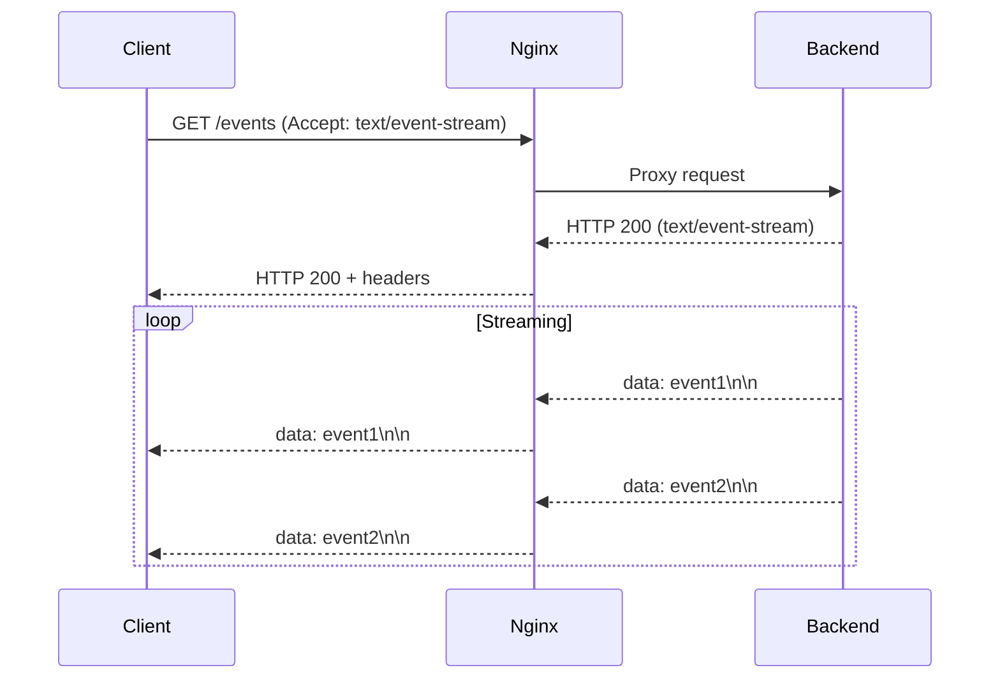

# How to Configure Server-Sent Events Through Nginx

Author: [nawazdhandala](https://github.com/nawazdhandala)

Tags: Nginx, SSE, Real-time, Streaming, DevOps

Description: Learn how to properly configure Nginx for Server-Sent Events (SSE), including proxy settings, buffering, timeouts, and connection management for reliable real-time streaming.

---

Server-Sent Events (SSE) provide a simple way to push real-time updates from server to client over HTTP. Unlike WebSockets, SSE uses standard HTTP and works over existing infrastructure. However, Nginx's default proxy settings can break SSE connections. This guide shows you how to configure Nginx for reliable SSE streaming.

## Understanding SSE

SSE establishes a long-lived HTTP connection where the server sends events to the client:



The key characteristics of SSE:
- Uses standard HTTP GET request
- Server sends `Content-Type: text/event-stream`
- Connection stays open for streaming
- Messages are text-based with specific format

## The Problem with Default Nginx Settings

Out of the box, Nginx can break SSE in several ways:

| Setting | Default Behavior | Problem |
|---------|------------------|---------|
| `proxy_buffering` | on | Events batched instead of streamed |
| `proxy_read_timeout` | 60s | Connection closes after idle time |
| `gzip` | on (sometimes) | Compresses stream, breaking chunks |
| `proxy_cache` | varies | May cache streaming response |

## Basic SSE Configuration

Here is the minimal configuration to make SSE work:

```nginx
location /events {
    proxy_pass http://backend:3000;

    # Disable buffering - critical for SSE
    proxy_buffering off;

    # Disable caching
    proxy_cache off;

    # Required headers
    proxy_set_header Host $host;
    proxy_set_header X-Real-IP $remote_addr;
    proxy_set_header Connection '';
    proxy_http_version 1.1;

    # Disable chunked encoding transform
    chunked_transfer_encoding off;

    # Long timeout for the SSE connection
    proxy_read_timeout 86400s;
}
```

## Complete Production Configuration

### Nginx Configuration

```nginx
upstream sse_backend {
    server 127.0.0.1:3000;
    keepalive 32;
}

server {
    listen 80;
    server_name example.com;

    # Regular API endpoints
    location /api/ {
        proxy_pass http://sse_backend/api/;
        proxy_http_version 1.1;
        proxy_set_header Host $host;
        proxy_set_header X-Real-IP $remote_addr;
        proxy_set_header X-Forwarded-For $proxy_add_x_forwarded_for;
    }

    # SSE endpoint
    location /events {
        proxy_pass http://sse_backend;

        # HTTP/1.1 required for chunked transfer
        proxy_http_version 1.1;

        # Disable all buffering
        proxy_buffering off;
        proxy_cache off;

        # No compression for event stream
        gzip off;

        # Headers
        proxy_set_header Host $host;
        proxy_set_header X-Real-IP $remote_addr;
        proxy_set_header X-Forwarded-For $proxy_add_x_forwarded_for;
        proxy_set_header Connection '';

        # Long read timeout - 24 hours
        proxy_read_timeout 86400s;
        proxy_send_timeout 86400s;

        # Disable chunked transfer encoding transformation
        chunked_transfer_encoding off;

        # Pass through the event-stream content type
        proxy_set_header Accept "text/event-stream";

        # Do not limit response size
        proxy_max_temp_file_size 0;
    }

    # Multiple SSE channels
    location ~ ^/events/(.+)$ {
        proxy_pass http://sse_backend/events/$1$is_args$args;

        proxy_http_version 1.1;
        proxy_buffering off;
        proxy_cache off;
        gzip off;

        proxy_set_header Host $host;
        proxy_set_header X-Real-IP $remote_addr;
        proxy_set_header Connection '';

        proxy_read_timeout 86400s;
        chunked_transfer_encoding off;
    }
}
```

### Node.js SSE Backend

```javascript
const express = require('express');
const app = express();

// Store connected clients
const clients = new Map();

// SSE endpoint
app.get('/events', (req, res) => {
    const clientId = Date.now();

    // Set SSE headers
    res.setHeader('Content-Type', 'text/event-stream');
    res.setHeader('Cache-Control', 'no-cache');
    res.setHeader('Connection', 'keep-alive');
    res.setHeader('X-Accel-Buffering', 'no');  // Nginx-specific

    // Prevent compression
    res.setHeader('Content-Encoding', 'identity');

    // Send initial connection event
    res.write(`data: {"type":"connected","clientId":"${clientId}"}\n\n`);

    // Store client connection
    clients.set(clientId, res);

    // Keep connection alive with heartbeat
    const heartbeat = setInterval(() => {
        res.write(': heartbeat\n\n');
    }, 30000);

    // Handle client disconnect
    req.on('close', () => {
        clearInterval(heartbeat);
        clients.delete(clientId);
        console.log(`Client ${clientId} disconnected`);
    });
});

// Broadcast to all clients
function broadcast(event, data) {
    const message = `event: ${event}\ndata: ${JSON.stringify(data)}\n\n`;

    for (const [clientId, res] of clients) {
        res.write(message);
    }
}

// API to trigger events
app.post('/api/notify', express.json(), (req, res) => {
    broadcast('notification', req.body);
    res.json({ sent: clients.size });
});

app.listen(3000, () => {
    console.log('SSE server running on port 3000');
});
```

### Client-Side JavaScript

```javascript
class SSEClient {
    constructor(url, options = {}) {
        this.url = url;
        this.options = options;
        this.eventSource = null;
        this.reconnectAttempts = 0;
        this.maxReconnectAttempts = options.maxReconnectAttempts || 10;
        this.reconnectDelay = options.reconnectDelay || 1000;
    }

    connect() {
        this.eventSource = new EventSource(this.url);

        this.eventSource.onopen = () => {
            console.log('SSE connected');
            this.reconnectAttempts = 0;
        };

        this.eventSource.onerror = (error) => {
            console.error('SSE error:', error);
            this.eventSource.close();
            this.reconnect();
        };

        // Listen for specific events
        this.eventSource.addEventListener('notification', (event) => {
            const data = JSON.parse(event.data);
            console.log('Notification:', data);
        });

        // Default message handler
        this.eventSource.onmessage = (event) => {
            const data = JSON.parse(event.data);
            console.log('Message:', data);
        };
    }

    reconnect() {
        if (this.reconnectAttempts >= this.maxReconnectAttempts) {
            console.error('Max reconnect attempts reached');
            return;
        }

        this.reconnectAttempts++;
        const delay = this.reconnectDelay * Math.pow(2, this.reconnectAttempts - 1);

        console.log(`Reconnecting in ${delay}ms (attempt ${this.reconnectAttempts})`);
        setTimeout(() => this.connect(), delay);
    }

    disconnect() {
        if (this.eventSource) {
            this.eventSource.close();
            this.eventSource = null;
        }
    }
}

// Usage
const sse = new SSEClient('/events');
sse.connect();
```

## Handling Connection Limits

### Configure Worker Connections

SSE keeps connections open, so you need sufficient worker connections:

```nginx
events {
    worker_connections 4096;  # Increase from default 1024
}
```

### Monitor Active Connections

```nginx
# Enable status endpoint
location /nginx_status {
    stub_status on;
    allow 127.0.0.1;
    deny all;
}
```

Check with:

```bash
curl http://localhost/nginx_status
```

## SSE with Authentication

Pass authentication tokens through SSE connections:

```nginx
location /events {
    proxy_pass http://sse_backend;

    # Pass authentication headers
    proxy_set_header Authorization $http_authorization;

    # Or use query parameter
    # Client connects with: /events?token=xxx

    proxy_buffering off;
    proxy_cache off;
    proxy_http_version 1.1;
    proxy_set_header Connection '';
    proxy_read_timeout 86400s;
}
```

Backend authentication:

```javascript
app.get('/events', (req, res) => {
    // Check authorization header
    const authHeader = req.headers.authorization;
    if (!authHeader || !validateToken(authHeader)) {
        res.status(401).json({ error: 'Unauthorized' });
        return;
    }

    // Set up SSE...
});
```

## Load Balancing SSE Connections

When running multiple backend instances:

```nginx
upstream sse_backend {
    # Sticky sessions - important for SSE
    ip_hash;

    server backend1:3000;
    server backend2:3000;
    server backend3:3000;

    keepalive 64;
}
```

For dynamic environments, consider using Redis for pub/sub:

```javascript
const Redis = require('ioredis');
const subscriber = new Redis();
const publisher = new Redis();

// Subscribe to channel
subscriber.subscribe('events');
subscriber.on('message', (channel, message) => {
    // Broadcast to all local clients
    for (const [_, res] of clients) {
        res.write(`data: ${message}\n\n`);
    }
});

// Publish from any instance
app.post('/api/broadcast', express.json(), (req, res) => {
    publisher.publish('events', JSON.stringify(req.body));
    res.json({ success: true });
});
```

## Debugging SSE Issues

### Check Response Headers

```bash
curl -N -H "Accept: text/event-stream" http://localhost/events
```

Expected headers:
```
Content-Type: text/event-stream
Cache-Control: no-cache
Connection: keep-alive
```

### Verify No Buffering

Events should appear immediately, not batched. If events come in groups, check:

1. `proxy_buffering` is `off`
2. `X-Accel-Buffering: no` header is set by backend
3. No upstream proxy (CDN) is buffering

### Test Timeout Behavior

```bash
# Connect and wait
curl -N --max-time 120 http://localhost/events
```

The connection should stay open beyond 60 seconds if `proxy_read_timeout` is configured correctly.

## Summary

Key settings for SSE through Nginx:

| Setting | Value | Purpose |
|---------|-------|---------|
| `proxy_buffering` | off | Stream events immediately |
| `proxy_cache` | off | Prevent caching stream |
| `gzip` | off | Prevent compression |
| `proxy_read_timeout` | 86400s | Keep connection open |
| `chunked_transfer_encoding` | off | Clean chunk handling |
| `proxy_http_version` | 1.1 | Required for streaming |

SSE is simpler than WebSockets for one-way server-to-client communication. With proper Nginx configuration, it provides reliable real-time updates without the complexity of WebSocket protocols.
