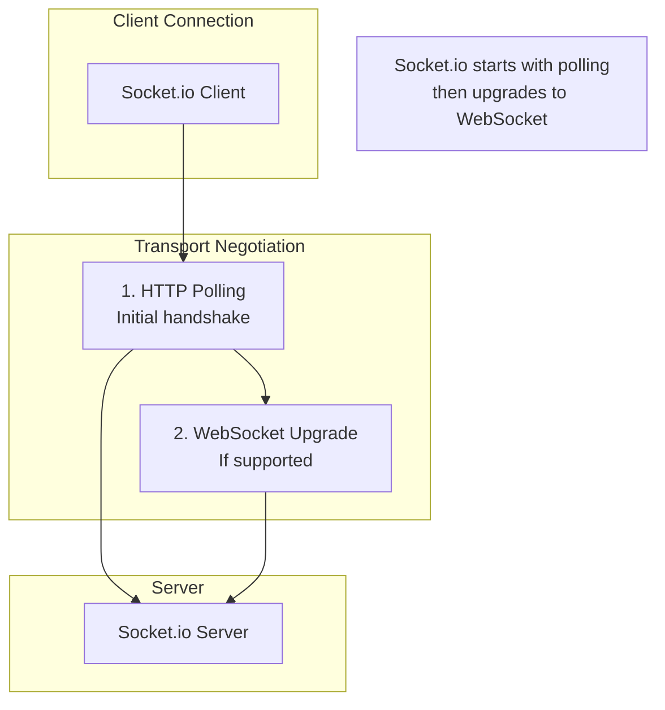
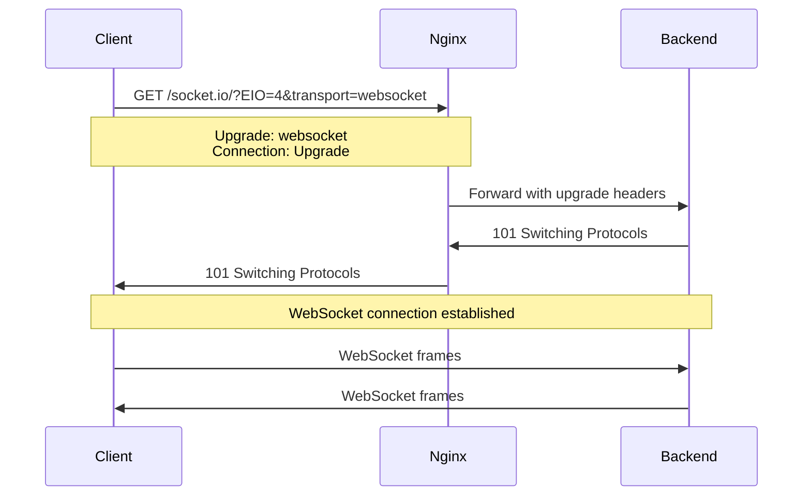
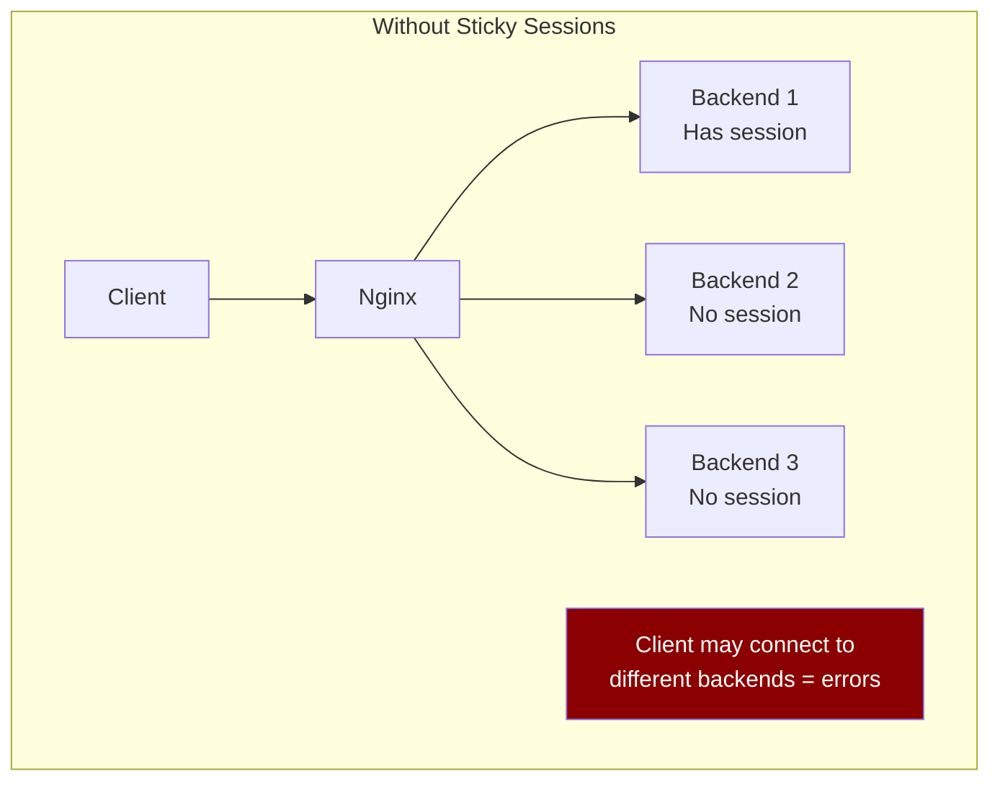
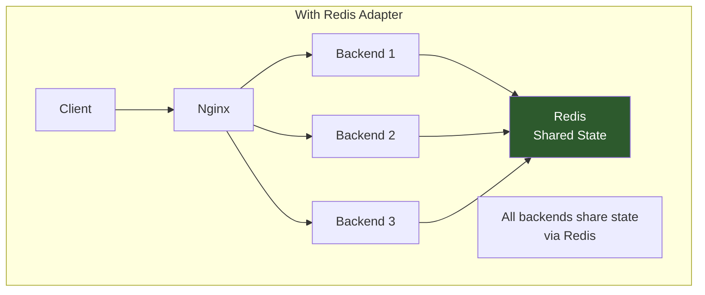

# How to Configure Socket.io with Nginx

Author: [nawazdhandala](https://www.github.com/nawazdhandala)

Tags: Socket.io, Nginx, WebSocket, Real-time, Proxy, DevOps

Description: Learn how to properly configure Nginx as a reverse proxy for Socket.io applications, including WebSocket support, sticky sessions, and troubleshooting common connection issues.

---

Socket.io enables real-time bidirectional communication between clients and servers. When deploying Socket.io applications behind Nginx, special configuration is required to handle WebSocket connections and long-polling fallbacks. This guide covers everything you need for a production-ready setup.

## Understanding Socket.io Transport



Socket.io uses two transport mechanisms:

1. **HTTP Long-Polling** - Initial connection and fallback
2. **WebSocket** - Upgraded connection for better performance

Both must be properly configured in Nginx.

## Basic Nginx Configuration

### Minimum Working Configuration

```nginx
upstream socketio_backend {
    server 127.0.0.1:3000;
}

server {
    listen 80;
    server_name example.com;

    location /socket.io/ {
        proxy_pass http://socketio_backend;

        # WebSocket support
        proxy_http_version 1.1;
        proxy_set_header Upgrade $http_upgrade;
        proxy_set_header Connection "upgrade";

        # Headers
        proxy_set_header Host $host;
        proxy_set_header X-Real-IP $remote_addr;
        proxy_set_header X-Forwarded-For $proxy_add_x_forwarded_for;
        proxy_set_header X-Forwarded-Proto $scheme;
    }

    location / {
        proxy_pass http://socketio_backend;
        proxy_set_header Host $host;
        proxy_set_header X-Real-IP $remote_addr;
    }
}
```

### Understanding WebSocket Headers



The critical headers are:

```nginx
# Required for WebSocket upgrade
proxy_http_version 1.1;                    # HTTP/1.1 required for upgrade
proxy_set_header Upgrade $http_upgrade;     # Pass the Upgrade header
proxy_set_header Connection "upgrade";      # Set Connection to "upgrade"
```

## Production Configuration

### Complete Configuration with SSL

```nginx
upstream socketio_nodes {
    # IP hash ensures clients connect to same backend
    ip_hash;

    server 127.0.0.1:3000;
    server 127.0.0.1:3001;
    server 127.0.0.1:3002;

    keepalive 64;
}

server {
    listen 80;
    server_name example.com;
    return 301 https://$server_name$request_uri;
}

server {
    listen 443 ssl http2;
    server_name example.com;

    ssl_certificate /etc/letsencrypt/live/example.com/fullchain.pem;
    ssl_certificate_key /etc/letsencrypt/live/example.com/privkey.pem;

    # SSL settings
    ssl_protocols TLSv1.2 TLSv1.3;
    ssl_prefer_server_ciphers on;

    # Socket.io endpoint
    location /socket.io/ {
        proxy_pass http://socketio_nodes;

        # WebSocket support
        proxy_http_version 1.1;
        proxy_set_header Upgrade $http_upgrade;
        proxy_set_header Connection "upgrade";

        # Timeouts for WebSocket
        proxy_connect_timeout 60s;
        proxy_send_timeout 60s;
        proxy_read_timeout 60s;

        # Disable buffering for real-time
        proxy_buffering off;

        # Headers
        proxy_set_header Host $host;
        proxy_set_header X-Real-IP $remote_addr;
        proxy_set_header X-Forwarded-For $proxy_add_x_forwarded_for;
        proxy_set_header X-Forwarded-Proto $scheme;
        proxy_set_header X-NginX-Proxy true;

        # Cache settings for polling
        proxy_cache_bypass $http_upgrade;
    }

    # Static files and API
    location / {
        proxy_pass http://socketio_nodes;
        proxy_http_version 1.1;
        proxy_set_header Connection "";
        proxy_set_header Host $host;
        proxy_set_header X-Real-IP $remote_addr;
        proxy_set_header X-Forwarded-For $proxy_add_x_forwarded_for;
        proxy_set_header X-Forwarded-Proto $scheme;
    }
}
```

## Handling Multiple Backend Instances

### The Sticky Session Problem



Socket.io requires clients to connect to the same backend instance for the duration of their session. This is critical when:

- Using multiple backend servers
- HTTP polling (before WebSocket upgrade)
- Reconnection scenarios

### Solution 1: IP Hash Load Balancing

```nginx
upstream socketio_nodes {
    ip_hash;  # Same IP always goes to same backend

    server 127.0.0.1:3000;
    server 127.0.0.1:3001;
    server 127.0.0.1:3002;
}
```

### Solution 2: Cookie-Based Sticky Sessions (Recommended)

```nginx
upstream socketio_nodes {
    server 127.0.0.1:3000;
    server 127.0.0.1:3001;
    server 127.0.0.1:3002;

    # Sticky cookie
    sticky cookie srv_id expires=1h domain=.example.com path=/;
}

# Note: sticky module requires nginx-plus or compiling with nginx-sticky-module
```

### Solution 3: Redis Adapter (Backend Solution)

Configure Socket.io to use Redis for session sharing:

```javascript
// Node.js Socket.io server
const { Server } = require('socket.io');
const { createAdapter } = require('@socket.io/redis-adapter');
const { createClient } = require('redis');

const io = new Server(server);

const pubClient = createClient({ url: 'redis://localhost:6379' });
const subClient = pubClient.duplicate();

Promise.all([pubClient.connect(), subClient.connect()]).then(() => {
  io.adapter(createAdapter(pubClient, subClient));
});
```



## Timeout Configuration

### Preventing Disconnections

Long-polling and WebSocket connections require extended timeouts:

```nginx
location /socket.io/ {
    proxy_pass http://socketio_nodes;

    proxy_http_version 1.1;
    proxy_set_header Upgrade $http_upgrade;
    proxy_set_header Connection "upgrade";

    # Extended timeouts for long-lived connections
    proxy_connect_timeout 7d;
    proxy_send_timeout 7d;
    proxy_read_timeout 7d;

    # Alternative: Set reasonable timeout with heartbeat
    # proxy_read_timeout 86400s;  # 24 hours
}
```

### Heartbeat Configuration

Socket.io sends periodic pings. Configure timeouts to accommodate:

```javascript
// Socket.io server configuration
const io = new Server(server, {
  pingTimeout: 60000,    // 60 seconds
  pingInterval: 25000,   // 25 seconds
  upgradeTimeout: 30000, // 30 seconds
  transports: ['websocket', 'polling']
});
```

```nginx
# Nginx timeout should be greater than pingTimeout + pingInterval
proxy_read_timeout 120s;  # > 60s + 25s
```

## Custom Path Configuration

### Using a Custom Path

```javascript
// Server
const io = new Server(server, {
  path: '/my-app/socket/'
});

// Client
const socket = io('https://example.com', {
  path: '/my-app/socket/'
});
```

```nginx
# Nginx for custom path
location /my-app/socket/ {
    proxy_pass http://socketio_backend;

    proxy_http_version 1.1;
    proxy_set_header Upgrade $http_upgrade;
    proxy_set_header Connection "upgrade";

    proxy_set_header Host $host;
    proxy_set_header X-Real-IP $remote_addr;
    proxy_set_header X-Forwarded-For $proxy_add_x_forwarded_for;
    proxy_set_header X-Forwarded-Proto $scheme;
}
```

### Multiple Socket.io Applications

```nginx
# App 1
location /app1/socket.io/ {
    proxy_pass http://127.0.0.1:3001/socket.io/;

    proxy_http_version 1.1;
    proxy_set_header Upgrade $http_upgrade;
    proxy_set_header Connection "upgrade";
    proxy_set_header Host $host;
}

# App 2
location /app2/socket.io/ {
    proxy_pass http://127.0.0.1:3002/socket.io/;

    proxy_http_version 1.1;
    proxy_set_header Upgrade $http_upgrade;
    proxy_set_header Connection "upgrade";
    proxy_set_header Host $host;
}
```

## Troubleshooting Common Issues

### Issue 1: WebSocket Connection Failed

```
WebSocket connection to 'wss://example.com/socket.io/' failed
```

Check these settings:

```nginx
location /socket.io/ {
    proxy_pass http://backend;

    # These three lines are REQUIRED
    proxy_http_version 1.1;
    proxy_set_header Upgrade $http_upgrade;
    proxy_set_header Connection "upgrade";
}
```

### Issue 2: 400 Bad Request

Ensure proper WebSocket upgrade response:

```nginx
# Map to handle Connection header
map $http_upgrade $connection_upgrade {
    default upgrade;
    '' close;
}

location /socket.io/ {
    proxy_pass http://backend;

    proxy_http_version 1.1;
    proxy_set_header Upgrade $http_upgrade;
    proxy_set_header Connection $connection_upgrade;  # Use mapped value
}
```

### Issue 3: Polling Works but WebSocket Fails

```nginx
# Disable proxy buffering
location /socket.io/ {
    proxy_pass http://backend;

    proxy_http_version 1.1;
    proxy_set_header Upgrade $http_upgrade;
    proxy_set_header Connection "upgrade";

    # Disable buffering
    proxy_buffering off;
    proxy_cache off;
}
```

### Issue 4: Connection Drops After Timeout

```nginx
# Increase read timeout
location /socket.io/ {
    proxy_pass http://backend;

    proxy_http_version 1.1;
    proxy_set_header Upgrade $http_upgrade;
    proxy_set_header Connection "upgrade";

    proxy_read_timeout 86400s;  # 24 hours
    proxy_send_timeout 86400s;
}
```

### Issue 5: Cross-Origin Issues

```nginx
location /socket.io/ {
    proxy_pass http://backend;

    proxy_http_version 1.1;
    proxy_set_header Upgrade $http_upgrade;
    proxy_set_header Connection "upgrade";

    # CORS headers
    add_header Access-Control-Allow-Origin $http_origin always;
    add_header Access-Control-Allow-Credentials true always;
    add_header Access-Control-Allow-Methods "GET, POST, OPTIONS" always;
    add_header Access-Control-Allow-Headers "DNT,X-CustomHeader,Keep-Alive,User-Agent,X-Requested-With,If-Modified-Since,Cache-Control,Content-Type" always;

    if ($request_method = OPTIONS) {
        return 204;
    }
}
```

## Testing Your Configuration

### Test WebSocket Connection

```bash
# Using wscat
npm install -g wscat
wscat -c "wss://example.com/socket.io/?EIO=4&transport=websocket"

# Using curl to test polling
curl -v "https://example.com/socket.io/?EIO=4&transport=polling"
```

### Debug Script

```bash
#!/bin/bash
# test_socketio.sh

URL="${1:-https://example.com}"

echo "=== Testing Socket.io Configuration ==="
echo ""

# Test polling transport
echo "1. Testing polling transport..."
POLL_RESPONSE=$(curl -s -o /dev/null -w "%{http_code}" "$URL/socket.io/?EIO=4&transport=polling")
if [ "$POLL_RESPONSE" = "200" ]; then
    echo "   Polling: OK (HTTP $POLL_RESPONSE)"
else
    echo "   Polling: FAILED (HTTP $POLL_RESPONSE)"
fi

# Test WebSocket upgrade headers
echo ""
echo "2. Testing WebSocket upgrade..."
WS_RESPONSE=$(curl -s -I -H "Upgrade: websocket" -H "Connection: Upgrade" "$URL/socket.io/?EIO=4&transport=websocket" | head -1)
echo "   Response: $WS_RESPONSE"

# Check Nginx configuration
echo ""
echo "3. Nginx configuration test..."
nginx -t 2>&1
```

## Complete Production Configuration

```nginx
# /etc/nginx/sites-available/socketio-app

# Upstream with sticky sessions via IP hash
upstream socketio_cluster {
    ip_hash;
    server 127.0.0.1:3000 weight=5;
    server 127.0.0.1:3001 weight=5;
    server 127.0.0.1:3002 weight=5 backup;
    keepalive 64;
}

# Connection upgrade mapping
map $http_upgrade $connection_upgrade {
    default upgrade;
    '' close;
}

# Rate limiting for connections
limit_conn_zone $binary_remote_addr zone=ws_conn:10m;

server {
    listen 80;
    server_name example.com;
    return 301 https://$server_name$request_uri;
}

server {
    listen 443 ssl http2;
    server_name example.com;

    ssl_certificate /etc/letsencrypt/live/example.com/fullchain.pem;
    ssl_certificate_key /etc/letsencrypt/live/example.com/privkey.pem;
    ssl_protocols TLSv1.2 TLSv1.3;

    # Socket.io with WebSocket support
    location /socket.io/ {
        limit_conn ws_conn 10;  # Limit connections per IP

        proxy_pass http://socketio_cluster;

        # WebSocket support
        proxy_http_version 1.1;
        proxy_set_header Upgrade $http_upgrade;
        proxy_set_header Connection $connection_upgrade;

        # Extended timeouts
        proxy_connect_timeout 60s;
        proxy_send_timeout 86400s;
        proxy_read_timeout 86400s;

        # Disable buffering
        proxy_buffering off;
        proxy_cache off;

        # Headers
        proxy_set_header Host $host;
        proxy_set_header X-Real-IP $remote_addr;
        proxy_set_header X-Forwarded-For $proxy_add_x_forwarded_for;
        proxy_set_header X-Forwarded-Proto $scheme;
        proxy_set_header X-NginX-Proxy true;

        proxy_redirect off;
    }

    # Regular HTTP requests
    location / {
        proxy_pass http://socketio_cluster;
        proxy_http_version 1.1;
        proxy_set_header Connection "";
        proxy_set_header Host $host;
        proxy_set_header X-Real-IP $remote_addr;
        proxy_set_header X-Forwarded-For $proxy_add_x_forwarded_for;
        proxy_set_header X-Forwarded-Proto $scheme;
    }
}
```

## Summary

Configuring Nginx for Socket.io requires:

1. **WebSocket headers** - `proxy_http_version 1.1`, `Upgrade`, and `Connection` headers
2. **Extended timeouts** - Long-lived connections need longer timeouts than default
3. **Sticky sessions** - Multiple backends require session affinity
4. **Disabled buffering** - Real-time communication should not be buffered
5. **Proper upstream configuration** - Use `ip_hash` or Redis adapter for scaling

The essential configuration is:

```nginx
proxy_http_version 1.1;
proxy_set_header Upgrade $http_upgrade;
proxy_set_header Connection "upgrade";
```

With these settings properly configured, your Socket.io application will work reliably behind Nginx.
