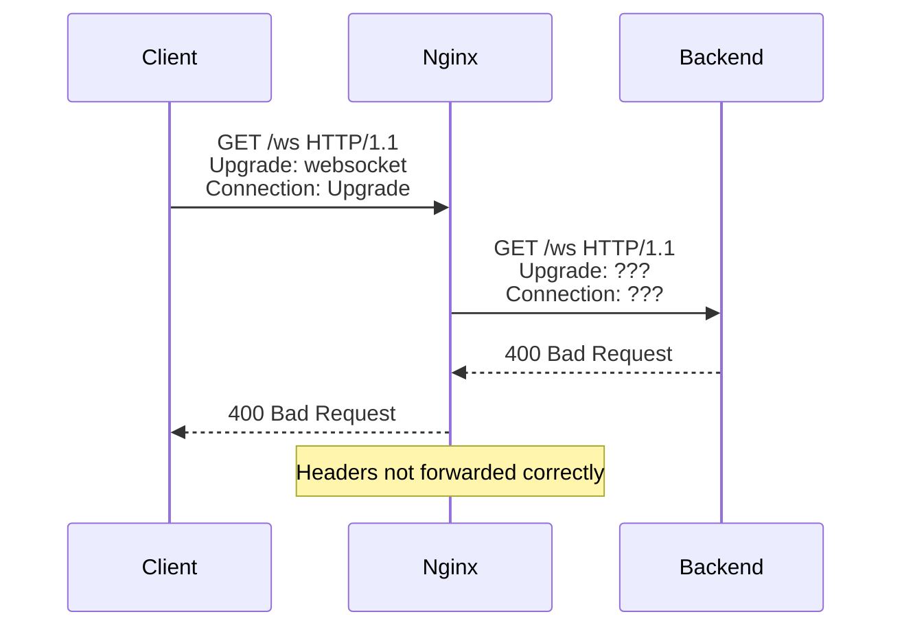

# How to Fix WebSocket 400 Bad Request with Nginx

Author: [nawazdhandala](https://github.com/nawazdhandala)

Tags: Nginx, WebSocket, Troubleshooting, Real-time, DevOps

Description: Learn how to diagnose and fix WebSocket 400 Bad Request errors when using Nginx as a reverse proxy, including proper upgrade headers, timeouts, and connection handling.

---

WebSocket connections failing with a 400 Bad Request error through Nginx is one of the most common issues when setting up real-time applications. The root cause is almost always missing or incorrect headers needed for the WebSocket upgrade handshake. This guide walks you through the diagnosis and fix.

## Understanding WebSocket Handshake

The WebSocket protocol starts with an HTTP upgrade request:



The 400 error occurs because Nginx, by default, does not forward the `Upgrade` and `Connection` headers needed for WebSocket.

## The Quick Fix

Add these directives to your WebSocket location:

```nginx
location /ws {
    proxy_pass http://backend:3000;
    proxy_http_version 1.1;
    proxy_set_header Upgrade $http_upgrade;
    proxy_set_header Connection "upgrade";
    proxy_set_header Host $host;
}
```

## Complete WebSocket Configuration

### Basic Working Configuration

```nginx
upstream websocket_backend {
    server 127.0.0.1:3000;
    keepalive 32;
}

server {
    listen 80;
    server_name example.com;

    # Regular HTTP traffic
    location / {
        proxy_pass http://websocket_backend;
        proxy_http_version 1.1;
        proxy_set_header Host $host;
        proxy_set_header X-Real-IP $remote_addr;
    }

    # WebSocket endpoint
    location /ws {
        proxy_pass http://websocket_backend;

        # Required for WebSocket
        proxy_http_version 1.1;
        proxy_set_header Upgrade $http_upgrade;
        proxy_set_header Connection "upgrade";

        # Standard proxy headers
        proxy_set_header Host $host;
        proxy_set_header X-Real-IP $remote_addr;
        proxy_set_header X-Forwarded-For $proxy_add_x_forwarded_for;
        proxy_set_header X-Forwarded-Proto $scheme;

        # WebSocket-specific timeouts
        proxy_read_timeout 86400s;
        proxy_send_timeout 86400s;
    }
}
```

### Supporting Both HTTP and WebSocket on Same Path

Some applications (like Socket.IO) use the same path for HTTP polling and WebSocket:

```nginx
map $http_upgrade $connection_upgrade {
    default upgrade;
    ''      close;
}

server {
    listen 80;
    server_name example.com;

    location /socket.io/ {
        proxy_pass http://127.0.0.1:3000;

        proxy_http_version 1.1;
        proxy_set_header Upgrade $http_upgrade;
        proxy_set_header Connection $connection_upgrade;
        proxy_set_header Host $host;
        proxy_set_header X-Real-IP $remote_addr;
        proxy_set_header X-Forwarded-For $proxy_add_x_forwarded_for;

        # Timeouts
        proxy_connect_timeout 60s;
        proxy_read_timeout 86400s;
        proxy_send_timeout 86400s;

        # Buffering
        proxy_buffering off;
    }
}
```

The `map` directive handles both cases:
- WebSocket requests: `Connection: upgrade`
- Regular HTTP requests: `Connection: close`

## Common Causes of 400 Errors

### Cause 1: Missing Upgrade Headers

**Problem:**
```nginx
# WRONG - missing upgrade headers
location /ws {
    proxy_pass http://backend:3000;
}
```

**Fix:**
```nginx
location /ws {
    proxy_pass http://backend:3000;
    proxy_http_version 1.1;
    proxy_set_header Upgrade $http_upgrade;
    proxy_set_header Connection "upgrade";
}
```

### Cause 2: Wrong HTTP Version

**Problem:**
```nginx
# WRONG - HTTP/1.0 doesn't support upgrade
location /ws {
    proxy_pass http://backend:3000;
    proxy_set_header Upgrade $http_upgrade;
    proxy_set_header Connection "upgrade";
    # proxy_http_version defaults to 1.0
}
```

**Fix:**
```nginx
location /ws {
    proxy_pass http://backend:3000;
    proxy_http_version 1.1;  # Required for WebSocket
    proxy_set_header Upgrade $http_upgrade;
    proxy_set_header Connection "upgrade";
}
```

### Cause 3: Upstream Keepalive Breaking Connection Header

**Problem:**
```nginx
upstream backend {
    server 127.0.0.1:3000;
    keepalive 32;
}

location /ws {
    proxy_pass http://backend;
    proxy_http_version 1.1;
    proxy_set_header Connection "";  # Breaks WebSocket!
}
```

**Fix:**
```nginx
upstream websocket_backend {
    server 127.0.0.1:3000;
    # Note: keepalive is not recommended for WebSocket upstreams
}

location /ws {
    proxy_pass http://websocket_backend;
    proxy_http_version 1.1;
    proxy_set_header Upgrade $http_upgrade;
    proxy_set_header Connection "upgrade";
}
```

### Cause 4: Buffering Interference

**Problem:** Large WebSocket messages get stuck in proxy buffers.

**Fix:**
```nginx
location /ws {
    proxy_pass http://backend:3000;
    proxy_http_version 1.1;
    proxy_set_header Upgrade $http_upgrade;
    proxy_set_header Connection "upgrade";

    # Disable buffering for WebSocket
    proxy_buffering off;
    proxy_cache off;
}
```

### Cause 5: Timeout Too Short

**Problem:** Connection drops after 60 seconds of inactivity.

**Fix:**
```nginx
location /ws {
    proxy_pass http://backend:3000;
    proxy_http_version 1.1;
    proxy_set_header Upgrade $http_upgrade;
    proxy_set_header Connection "upgrade";

    # Keep connection open for 24 hours
    proxy_read_timeout 86400s;
    proxy_send_timeout 86400s;
}
```

## Debugging WebSocket Issues

### Check Request Headers

```bash
# Test WebSocket handshake with curl
curl -i -N \
    -H "Connection: Upgrade" \
    -H "Upgrade: websocket" \
    -H "Sec-WebSocket-Version: 13" \
    -H "Sec-WebSocket-Key: $(openssl rand -base64 16)" \
    http://example.com/ws
```

Expected response for successful upgrade:
```
HTTP/1.1 101 Switching Protocols
Upgrade: websocket
Connection: Upgrade
Sec-WebSocket-Accept: ...
```

400 response indicates the handshake failed.

### Enable Nginx Debug Logging

```nginx
error_log /var/log/nginx/error.log debug;

server {
    # ...
    location /ws {
        # Add debug header
        add_header X-Debug-Upgrade $http_upgrade always;
        add_header X-Debug-Connection $http_connection always;

        proxy_pass http://backend:3000;
        # ...
    }
}
```

### Check Backend Directly

Bypass Nginx to verify backend works:

```bash
# Direct connection to backend
curl -i -N \
    -H "Connection: Upgrade" \
    -H "Upgrade: websocket" \
    -H "Sec-WebSocket-Version: 13" \
    -H "Sec-WebSocket-Key: $(openssl rand -base64 16)" \
    http://localhost:3000/ws
```

If this works but Nginx doesn't, the issue is in Nginx configuration.

### Using wscat for Testing

```bash
# Install wscat
npm install -g wscat

# Test WebSocket through Nginx
wscat -c ws://example.com/ws

# Test directly to backend
wscat -c ws://localhost:3000/ws
```

## Production Configuration with SSL

```nginx
upstream websocket_backend {
    server 127.0.0.1:3000;
}

map $http_upgrade $connection_upgrade {
    default upgrade;
    '' close;
}

server {
    listen 80;
    server_name example.com;
    return 301 https://$host$request_uri;
}

server {
    listen 443 ssl http2;
    server_name example.com;

    ssl_certificate /etc/ssl/certs/example.com.crt;
    ssl_certificate_key /etc/ssl/private/example.com.key;
    ssl_protocols TLSv1.2 TLSv1.3;

    # Regular traffic
    location / {
        proxy_pass http://websocket_backend;
        proxy_http_version 1.1;
        proxy_set_header Host $host;
        proxy_set_header X-Real-IP $remote_addr;
        proxy_set_header X-Forwarded-For $proxy_add_x_forwarded_for;
        proxy_set_header X-Forwarded-Proto $scheme;
        proxy_set_header Connection "";
    }

    # WebSocket traffic
    location /ws {
        proxy_pass http://websocket_backend;

        proxy_http_version 1.1;
        proxy_set_header Upgrade $http_upgrade;
        proxy_set_header Connection $connection_upgrade;
        proxy_set_header Host $host;
        proxy_set_header X-Real-IP $remote_addr;
        proxy_set_header X-Forwarded-For $proxy_add_x_forwarded_for;
        proxy_set_header X-Forwarded-Proto $scheme;

        proxy_read_timeout 86400s;
        proxy_send_timeout 86400s;
        proxy_buffering off;
    }

    # Socket.IO specific
    location /socket.io/ {
        proxy_pass http://websocket_backend;

        proxy_http_version 1.1;
        proxy_set_header Upgrade $http_upgrade;
        proxy_set_header Connection $connection_upgrade;
        proxy_set_header Host $host;
        proxy_set_header X-Real-IP $remote_addr;
        proxy_set_header X-Forwarded-For $proxy_add_x_forwarded_for;
        proxy_set_header X-Forwarded-Proto $scheme;

        proxy_read_timeout 86400s;
        proxy_send_timeout 86400s;
        proxy_buffering off;
    }
}
```

## Troubleshooting Checklist

| Symptom | Check | Fix |
|---------|-------|-----|
| 400 Bad Request | Upgrade headers | Add `proxy_set_header Upgrade/Connection` |
| 400 Bad Request | HTTP version | Add `proxy_http_version 1.1` |
| Connection drops at 60s | Timeout | Increase `proxy_read_timeout` |
| Messages delayed | Buffering | Add `proxy_buffering off` |
| Works locally, fails in prod | SSL | Check wss:// protocol and certs |
| Intermittent failures | Load balancer | Check sticky sessions |

## Summary

The 400 Bad Request error for WebSocket through Nginx is almost always fixed by adding:

```nginx
proxy_http_version 1.1;
proxy_set_header Upgrade $http_upgrade;
proxy_set_header Connection "upgrade";
```

For production, also add appropriate timeouts and disable buffering. Use the `map` directive if your application uses the same path for both HTTP polling and WebSocket upgrades. Test with curl or wscat to verify the handshake works correctly.
