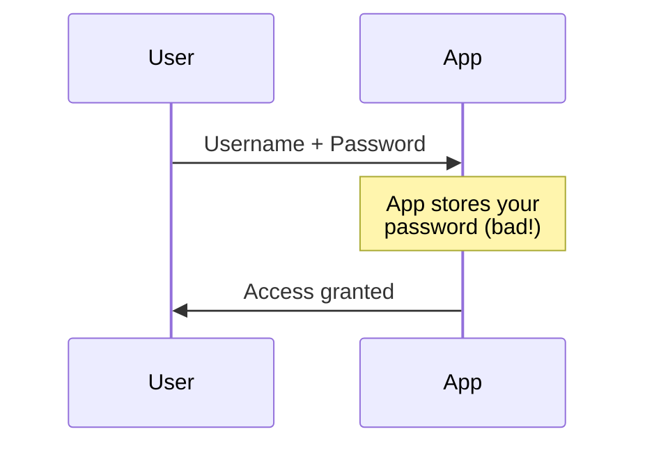
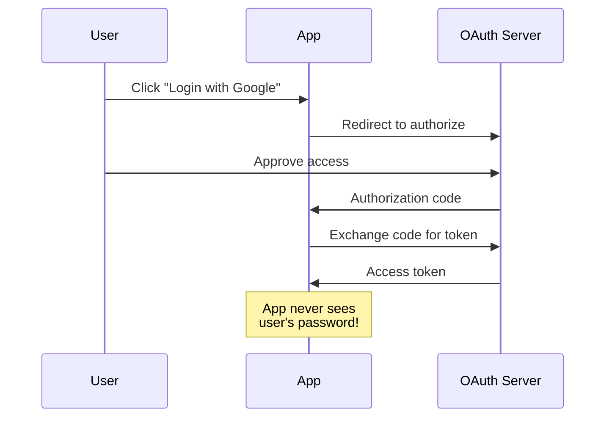
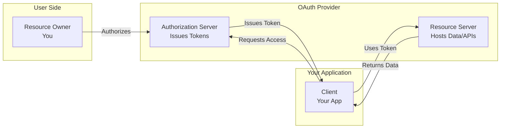
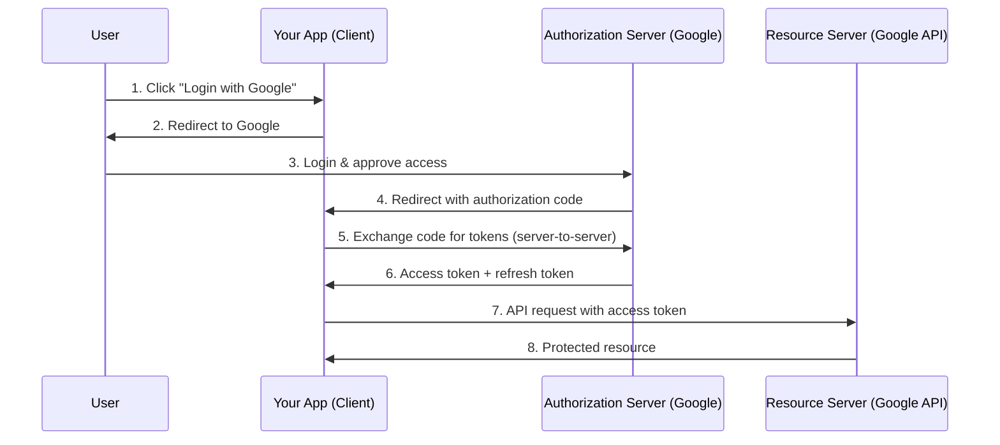
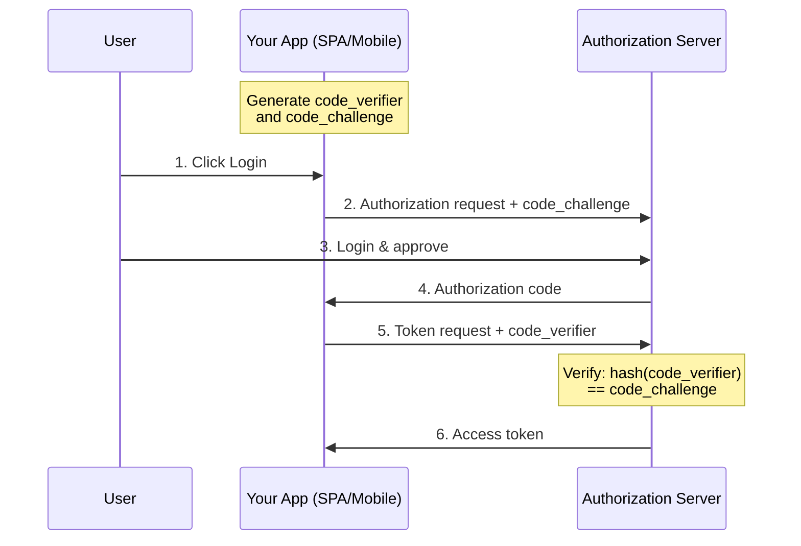
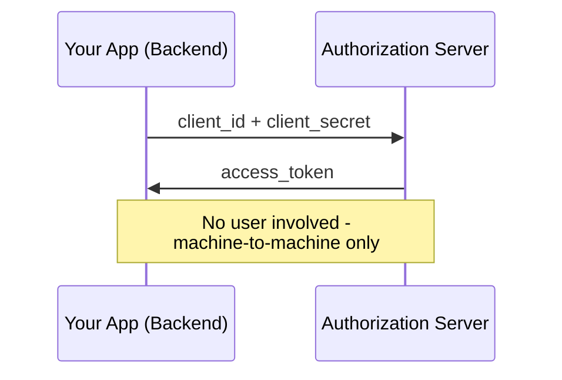
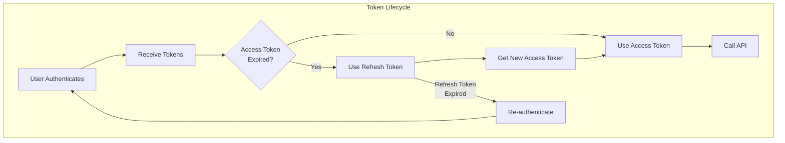

# What is OAuth and How Does It Work?

Author: [nawazdhandala](https://www.github.com/nawazdhandala)

Tags: OAuth, Authentication, Security, NodeJS, API

Description: Learn what OAuth 2.0 is, how it works under the hood, and how to implement it in a Node.js application with a practical example.

---

You've seen "Sign in with Google" or "Login with GitHub" buttons everywhere. Ever wondered how they work without your app ever seeing the user's password? That's OAuth in action.

## What is OAuth?

**OAuth 2.0** is an authorization framework that allows third-party applications to access a user's resources without exposing their credentials. It's the industry standard for secure delegated access.

When you click "Sign in with Google," you're not giving the application your Google password. Instead, Google gives the application a limited-access token that proves you authorized it.

**Traditional Login (Dangerous):**



**OAuth 2.0 (Secure):**



## Why OAuth Was Created

Before OAuth, if an app needed to access your data from another service (like importing your email contacts), you had two terrible options:

1. **Give the app your password** - Now the app has full access to your account forever
2. **Don't use the feature** - Poor user experience

OAuth solves this by introducing **limited, revocable access tokens**. The app gets just enough access to do its job, and you can revoke that access anytime.

## OAuth 2.0 Terminology

Before diving into the flows, let's understand the key players:

| Term | Description | Example |
|------|-------------|---------|
| **Resource Owner** | The user who owns the data | You |
| **Client** | The application requesting access | Your web app |
| **Authorization Server** | Issues tokens after authenticating the user | Google's OAuth server |
| **Resource Server** | Hosts the protected resources | Google's API |
| **Access Token** | Credential to access protected resources | JWT or opaque string |
| **Refresh Token** | Long-lived token to get new access tokens | Used to stay logged in |
| **Scope** | Defines what access the token grants | `read:email`, `write:profile` |

Here's how these components interact:



## OAuth 2.0 Flows

OAuth 2.0 defines several flows for different use cases:

### 1. Authorization Code Flow (Most Common)

Best for server-side web applications. This is the most secure flow.



### 2. Authorization Code Flow with PKCE

Required for mobile and single-page applications. Adds a code verifier to prevent authorization code interception.



### 3. Client Credentials Flow

For server-to-server communication without user involvement.



### 4. Implicit Flow (Deprecated)

Was used for SPAs but is now considered insecure. Use Authorization Code + PKCE instead.

## How OAuth 2.0 Works: Step by Step

Let's trace through the Authorization Code flow:

**Step 1: Initiate Authorization**

Your app redirects the user to the authorization server:

```
https://accounts.google.com/o/oauth2/v2/auth?
  client_id=YOUR_CLIENT_ID&
  redirect_uri=https://yourapp.com/callback&
  response_type=code&
  scope=openid%20email%20profile&
  state=random_string_for_csrf_protection
```

**Step 2: User Authenticates**

The user logs into Google (if not already) and sees a consent screen asking to grant your app access.

**Step 3: Authorization Code Returned**

After approval, Google redirects back to your app:

```
https://yourapp.com/callback?
  code=AUTHORIZATION_CODE&
  state=random_string_for_csrf_protection
```

**Step 4: Exchange Code for Tokens**

Your server exchanges the code for tokens (this happens server-to-server):

```http
POST https://oauth2.googleapis.com/token
Content-Type: application/x-www-form-urlencoded

grant_type=authorization_code&
code=AUTHORIZATION_CODE&
redirect_uri=https://yourapp.com/callback&
client_id=YOUR_CLIENT_ID&
client_secret=YOUR_CLIENT_SECRET
```

**Step 5: Receive Tokens**

```json
{
  "access_token": "ya29.a0AfH6SMBx...",
  "expires_in": 3600,
  "refresh_token": "1//0g...",
  "scope": "openid email profile",
  "token_type": "Bearer",
  "id_token": "eyJhbGciOiJSUzI1NiIs..."
}
```

**Step 6: Access Protected Resources**

Use the access token to call APIs:

```http
GET https://www.googleapis.com/oauth2/v2/userinfo
Authorization: Bearer ya29.a0AfH6SMBx...
```

## Node.js Implementation Example

Let's build a complete OAuth 2.0 implementation with Google. We'll use Express and handle the entire flow manually to understand how it works.

### Project Setup

```bash
mkdir oauth-demo && cd oauth-demo
npm init -y
npm install express axios dotenv
```

### Environment Variables

Create a `.env` file:

```env
GOOGLE_CLIENT_ID=your_client_id_here
GOOGLE_CLIENT_SECRET=your_client_secret_here
REDIRECT_URI=http://localhost:3000/callback
SESSION_SECRET=your_random_session_secret
```

### The Complete Implementation

```javascript
// server.js
const express = require('express');
const axios = require('axios');
const crypto = require('crypto');
require('dotenv').config();

const app = express();

// In-memory session store (use Redis in production)
const sessions = new Map();

// Google OAuth endpoints
const GOOGLE_AUTH_URL = 'https://accounts.google.com/o/oauth2/v2/auth';
const GOOGLE_TOKEN_URL = 'https://oauth2.googleapis.com/token';
const GOOGLE_USERINFO_URL = 'https://www.googleapis.com/oauth2/v2/userinfo';

// Middleware to parse cookies
app.use((req, res, next) => {
  req.cookies = {};
  const cookieHeader = req.headers.cookie;
  if (cookieHeader) {
    cookieHeader.split(';').forEach(cookie => {
      const [name, value] = cookie.trim().split('=');
      req.cookies[name] = value;
    });
  }
  next();
});

// Home page
app.get('/', (req, res) => {
  const sessionId = req.cookies.session_id;
  const session = sessions.get(sessionId);

  if (session && session.user) {
    res.send(`
      <h1>Welcome, ${session.user.name}!</h1>
      
      <p>Email: ${session.user.email}</p>
      <a href="/logout">Logout</a>
    `);
  } else {
    res.send(`
      <h1>OAuth 2.0 Demo</h1>
      <a href="/login">Login with Google</a>
    `);
  }
});

// Step 1: Initiate OAuth flow
app.get('/login', (req, res) => {
  // Generate state for CSRF protection
  const state = crypto.randomBytes(32).toString('hex');

  // Create session to store state
  const sessionId = crypto.randomBytes(32).toString('hex');
  sessions.set(sessionId, { state, createdAt: Date.now() });

  // Set session cookie
  res.setHeader('Set-Cookie', `session_id=${sessionId}; HttpOnly; Path=/`);

  // Build authorization URL
  const params = new URLSearchParams({
    client_id: process.env.GOOGLE_CLIENT_ID,
    redirect_uri: process.env.REDIRECT_URI,
    response_type: 'code',
    scope: 'openid email profile',
    state: state,
    access_type: 'offline',  // Request refresh token
    prompt: 'consent'        // Force consent screen
  });

  const authUrl = `${GOOGLE_AUTH_URL}?${params.toString()}`;
  res.redirect(authUrl);
});

// Step 3 & 4: Handle callback and exchange code for tokens
app.get('/callback', async (req, res) => {
  const { code, state, error } = req.query;

  // Handle errors from Google
  if (error) {
    return res.status(400).send(`OAuth error: ${error}`);
  }

  // Validate state to prevent CSRF
  const sessionId = req.cookies.session_id;
  const session = sessions.get(sessionId);

  if (!session || session.state !== state) {
    return res.status(403).send('Invalid state parameter. Possible CSRF attack.');
  }

  try {
    // Step 4: Exchange authorization code for tokens
    const tokenResponse = await axios.post(GOOGLE_TOKEN_URL,
      new URLSearchParams({
        grant_type: 'authorization_code',
        code: code,
        redirect_uri: process.env.REDIRECT_URI,
        client_id: process.env.GOOGLE_CLIENT_ID,
        client_secret: process.env.GOOGLE_CLIENT_SECRET
      }),
      {
        headers: {
          'Content-Type': 'application/x-www-form-urlencoded'
        }
      }
    );

    const { access_token, refresh_token, expires_in } = tokenResponse.data;

    // Step 6: Use access token to get user info
    const userResponse = await axios.get(GOOGLE_USERINFO_URL, {
      headers: {
        Authorization: `Bearer ${access_token}`
      }
    });

    // Store tokens and user info in session
    session.accessToken = access_token;
    session.refreshToken = refresh_token;
    session.tokenExpiry = Date.now() + (expires_in * 1000);
    session.user = userResponse.data;

    // Clean up state (one-time use)
    delete session.state;

    res.redirect('/');

  } catch (error) {
    console.error('Token exchange error:', error.response?.data || error.message);
    res.status(500).send('Failed to authenticate with Google');
  }
});

// Logout
app.get('/logout', (req, res) => {
  const sessionId = req.cookies.session_id;
  sessions.delete(sessionId);
  res.setHeader('Set-Cookie', 'session_id=; HttpOnly; Path=/; Max-Age=0');
  res.redirect('/');
});

// Protected API endpoint example
app.get('/api/profile', async (req, res) => {
  const sessionId = req.cookies.session_id;
  const session = sessions.get(sessionId);

  if (!session || !session.accessToken) {
    return res.status(401).json({ error: 'Not authenticated' });
  }

  // Check if token is expired
  if (Date.now() > session.tokenExpiry) {
    // Refresh the token
    try {
      const refreshResponse = await axios.post(GOOGLE_TOKEN_URL,
        new URLSearchParams({
          grant_type: 'refresh_token',
          refresh_token: session.refreshToken,
          client_id: process.env.GOOGLE_CLIENT_ID,
          client_secret: process.env.GOOGLE_CLIENT_SECRET
        }),
        {
          headers: {
            'Content-Type': 'application/x-www-form-urlencoded'
          }
        }
      );

      session.accessToken = refreshResponse.data.access_token;
      session.tokenExpiry = Date.now() + (refreshResponse.data.expires_in * 1000);
    } catch (error) {
      return res.status(401).json({ error: 'Token refresh failed' });
    }
  }

  res.json(session.user);
});

const PORT = process.env.PORT || 3000;
app.listen(PORT, () => {
  console.log(`Server running on http://localhost:${PORT}`);
});
```

### Setting Up Google OAuth Credentials

1. Go to the [Google Cloud Console](https://console.cloud.google.com/)
2. Create a new project or select an existing one
3. Navigate to **APIs & Services** > **Credentials**
4. Click **Create Credentials** > **OAuth 2.0 Client IDs**
5. Select **Web application**
6. Add `http://localhost:3000/callback` to Authorized redirect URIs
7. Copy the Client ID and Client Secret to your `.env` file

### Running the Example

```bash
node server.js
```

Visit `http://localhost:3000` and click "Login with Google" to test the flow.

## Access Tokens vs ID Tokens

OAuth 2.0 issues **access tokens** for API authorization. When combined with OpenID Connect (OIDC), you also get **ID tokens** for authentication.



| Token Type | Purpose | Contents |
|------------|---------|----------|
| Access Token | API authorization | Opaque or JWT, short-lived |
| Refresh Token | Get new access tokens | Opaque, long-lived |
| ID Token | User identity (OIDC) | JWT with user claims |

The ID token is a JWT containing user information:

```javascript
// Decode ID token (header.payload.signature)
const idToken = tokenResponse.data.id_token;
const payload = JSON.parse(
  Buffer.from(idToken.split('.')[1], 'base64').toString()
);

console.log(payload);
// {
//   "iss": "https://accounts.google.com",
//   "sub": "110248495921238986420",
//   "email": "user@gmail.com",
//   "email_verified": true,
//   "name": "John Doe",
//   "picture": "https://lh3.googleusercontent.com/...",
//   "iat": 1702723456,
//   "exp": 1702727056
// }
```

## Security Best Practices

### 1. Always Use HTTPS

OAuth tokens are bearer tokens - anyone with the token can use it. Never transmit tokens over unencrypted connections.

### 2. Validate the State Parameter

Always generate a random state and validate it on callback to prevent CSRF attacks:

```javascript
// Generate
const state = crypto.randomBytes(32).toString('hex');
sessions.set(sessionId, { state });

// Validate
if (session.state !== req.query.state) {
  throw new Error('State mismatch - possible CSRF');
}
```

### 3. Use PKCE for Public Clients

For mobile apps and SPAs, use PKCE (Proof Key for Code Exchange):

```javascript
const crypto = require('crypto');

// Generate code verifier (43-128 characters)
const codeVerifier = crypto.randomBytes(32).toString('base64url');

// Generate code challenge
const codeChallenge = crypto
  .createHash('sha256')
  .update(codeVerifier)
  .digest('base64url');

// Include in authorization request
const params = new URLSearchParams({
  // ... other params
  code_challenge: codeChallenge,
  code_challenge_method: 'S256'
});

// Include verifier in token request
const tokenParams = new URLSearchParams({
  // ... other params
  code_verifier: codeVerifier
});
```

### 4. Store Tokens Securely

- **Server-side**: Use encrypted session storage or a secure database
- **Client-side**: Use `HttpOnly` cookies, never localStorage for access tokens
- **Never log tokens**: Treat them like passwords

### 5. Implement Token Refresh

Access tokens expire quickly (usually 1 hour). Implement refresh token rotation:

```javascript
async function getValidAccessToken(session) {
  if (Date.now() < session.tokenExpiry - 60000) {
    return session.accessToken;  // Still valid
  }

  // Refresh the token
  const response = await axios.post(GOOGLE_TOKEN_URL, {
    grant_type: 'refresh_token',
    refresh_token: session.refreshToken,
    client_id: process.env.GOOGLE_CLIENT_ID,
    client_secret: process.env.GOOGLE_CLIENT_SECRET
  });

  session.accessToken = response.data.access_token;
  session.tokenExpiry = Date.now() + (response.data.expires_in * 1000);

  return session.accessToken;
}
```

### 6. Request Minimal Scopes

Only request the permissions you actually need:

```javascript
// Bad - requesting everything
scope: 'openid email profile calendar drive gmail'

// Good - minimal permissions
scope: 'openid email profile'
```

## Common Pitfalls

### Pitfall 1: Storing Client Secrets in Frontend Code

Client secrets must never be exposed in browser JavaScript or mobile app code. Use the Authorization Code flow with PKCE for public clients.

### Pitfall 2: Not Validating Tokens

Always validate tokens server-side. Don't trust token contents without verification:

```javascript
// For ID tokens, verify the signature
const { OAuth2Client } = require('google-auth-library');
const client = new OAuth2Client(process.env.GOOGLE_CLIENT_ID);

async function verifyIdToken(idToken) {
  const ticket = await client.verifyIdToken({
    idToken: idToken,
    audience: process.env.GOOGLE_CLIENT_ID
  });
  return ticket.getPayload();
}
```

### Pitfall 3: Using Implicit Flow

The Implicit flow returns tokens directly in the URL fragment, making them vulnerable to interception. Always use Authorization Code + PKCE.

### Pitfall 4: Ignoring Token Expiration

Access tokens expire. Always check expiration and refresh proactively:

```javascript
// Check expiration before making API calls
if (Date.now() >= session.tokenExpiry) {
  await refreshAccessToken(session);
}
```

## Using OAuth Libraries

While understanding the manual implementation is valuable, use battle-tested libraries in production:

### Passport.js

```javascript
const passport = require('passport');
const GoogleStrategy = require('passport-google-oauth20').Strategy;

passport.use(new GoogleStrategy({
    clientID: process.env.GOOGLE_CLIENT_ID,
    clientSecret: process.env.GOOGLE_CLIENT_SECRET,
    callbackURL: "/auth/google/callback"
  },
  function(accessToken, refreshToken, profile, cb) {
    // Find or create user
    return cb(null, profile);
  }
));

app.get('/auth/google',
  passport.authenticate('google', { scope: ['profile', 'email'] })
);

app.get('/auth/google/callback',
  passport.authenticate('google', { failureRedirect: '/login' }),
  function(req, res) {
    res.redirect('/');
  }
);
```

### Auth.js (NextAuth.js)

```javascript
// pages/api/auth/[...nextauth].js
import NextAuth from 'next-auth';
import GoogleProvider from 'next-auth/providers/google';

export default NextAuth({
  providers: [
    GoogleProvider({
      clientId: process.env.GOOGLE_CLIENT_ID,
      clientSecret: process.env.GOOGLE_CLIENT_SECRET
    })
  ]
});
```

## OAuth 2.0 vs OAuth 1.0

OAuth 2.0 replaced OAuth 1.0 with significant changes:

| Feature | OAuth 1.0 | OAuth 2.0 |
|---------|-----------|-----------|
| Token handling | Signed requests | Bearer tokens |
| Security | Built-in signatures | Relies on HTTPS |
| Complexity | High | Lower |
| Mobile support | Poor | Excellent |
| Token types | One type | Access + Refresh |

OAuth 2.0 is simpler but requires HTTPS for security.

## TL;DR

- **OAuth 2.0** lets apps access user resources without passwords
- **Authorization Code flow** is the most secure for web apps
- **PKCE** is mandatory for mobile and single-page applications
- **Access tokens** authorize API calls; **refresh tokens** get new access tokens
- **Always validate state** to prevent CSRF attacks
- **Use HTTPS** everywhere - tokens are bearer credentials
- Use established libraries like Passport.js in production

---

**Related Reading:**

- [PKCE Explained: Securing OAuth for Mobile and SPAs](https://oneuptime.com/blog/post/2024-06-23-pkce-explained/view)
- [SSO is a Security Basic, Not an Enterprise Perk](https://oneuptime.com/blog/post/2025-08-19-sso-is-a-security-basic-not-an-enterprise-perk/view)
