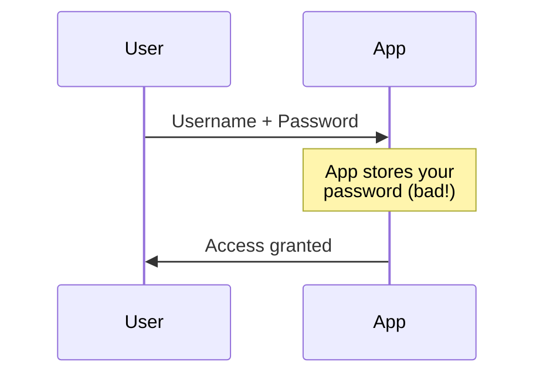
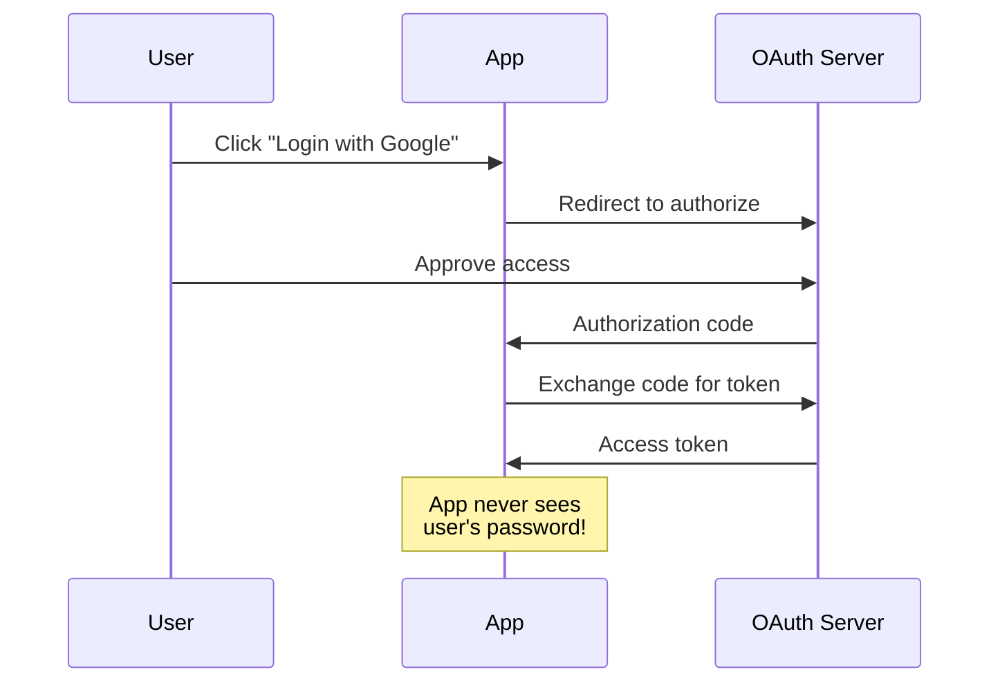
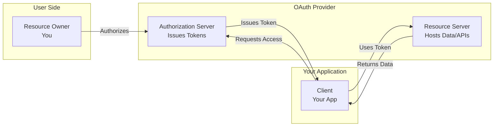
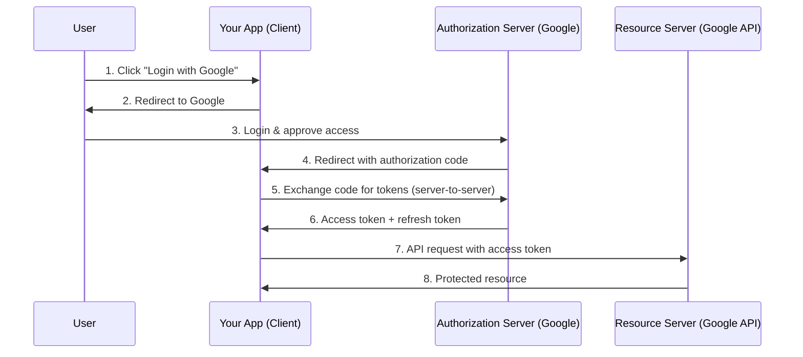
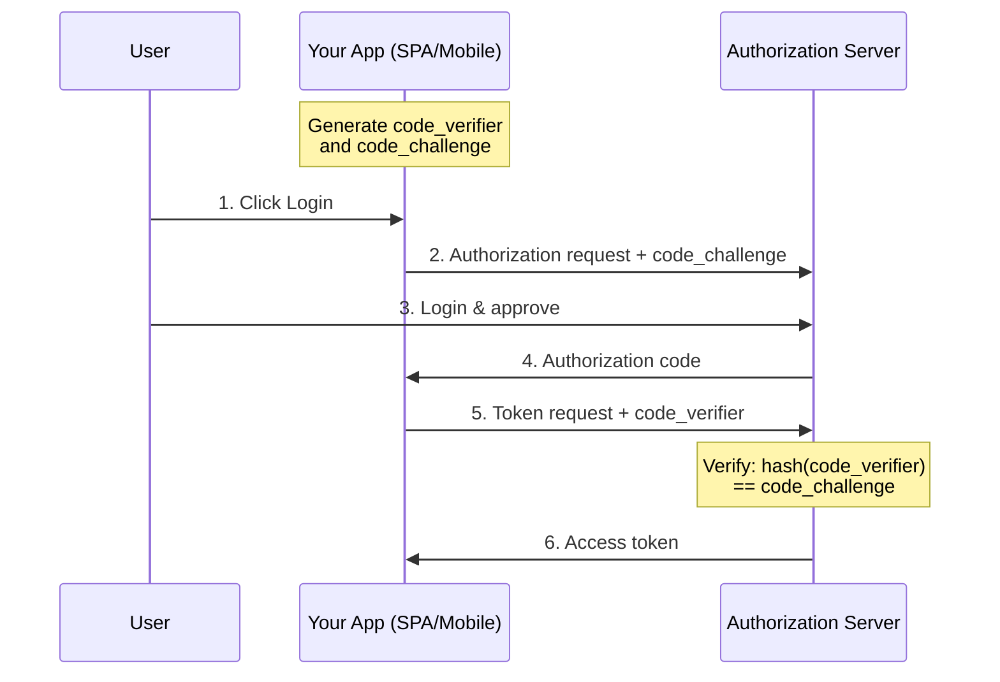
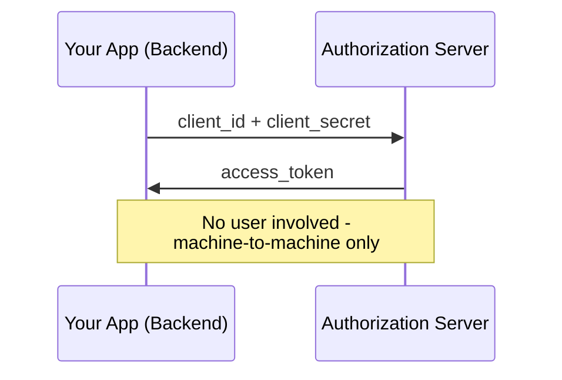
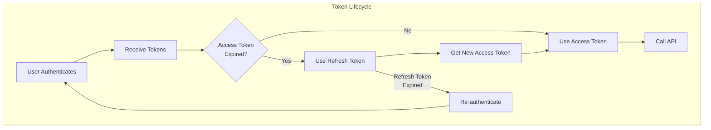

# What is OAuth and How Does It Work?

Author: [nawazdhandala](https://www.github.com/nawazdhandala)

Tags: OAuth, Authentication, Security, NodeJS, API

Description: Learn what OAuth 2.0 is, how it works under the hood, and how to implement it in a Node.js application with a practical example.

---

You've seen "Sign in with Google" or "Login with GitHub" buttons everywhere. Ever wondered how they work without your app ever seeing the user's password? That's OAuth in action.

## What is OAuth?

**OAuth 2.0** is an authorization framework that allows third-party applications to access a user's resources without exposing their credentials. It's the industry standard for secure delegated access.

When you click "Sign in with Google," you're not giving the application your Google password. Instead, Google gives the application a limited-access token that proves you authorized it.

**Traditional Login (Dangerous):**



**OAuth 2.0 (Secure):**



## Why OAuth Was Created

Before OAuth, if an app needed to access your data from another service (like importing your email contacts), you had two terrible options:

1. **Give the app your password** - Now the app has full access to your account forever
2. **Don't use the feature** - Poor user experience

OAuth solves this by introducing **limited, revocable access tokens**. The app gets just enough access to do its job, and you can revoke that access anytime.

## OAuth 2.0 Terminology

Before diving into the flows, let's understand the key players:

| Term | Description | Example |
|------|-------------|---------|
| **Resource Owner** | The user who owns the data | You |
| **Client** | The application requesting access | Your web app |
| **Authorization Server** | Issues tokens after authenticating the user | Google's OAuth server |
| **Resource Server** | Hosts the protected resources | Google's API |
| **Access Token** | Credential to access protected resources | JWT or opaque string |
| **Refresh Token** | Long-lived token to get new access tokens | Used to stay logged in |
| **Scope** | Defines what access the token grants | `read:email`, `write:profile` |

Here's how these components interact:



## OAuth 2.0 Flows

OAuth 2.0 defines several flows for different use cases:

### 1. Authorization Code Flow (Most Common)

Best for server-side web applications. This is the most secure flow.



### 2. Authorization Code Flow with PKCE

Required for mobile and single-page applications. Adds a code verifier to prevent authorization code interception.



### 3. Client Credentials Flow

For server-to-server communication without user involvement.



### 4. Implicit Flow (Deprecated)

Was used for SPAs but is now considered insecure. Use Authorization Code + PKCE instead.

## How OAuth 2.0 Works: Step by Step

Let's trace through the Authorization Code flow:

**Step 1: Initiate Authorization**

Your app redirects the user to the authorization server.

This URL initiates the OAuth flow by directing the user to Google's login page. Each parameter serves a specific purpose in identifying your application and securing the flow. The state parameter is particularly important as it prevents cross-site request forgery attacks.

```
https://accounts.google.com/o/oauth2/v2/auth?
  client_id=YOUR_CLIENT_ID&                         # Identifies your registered application
  redirect_uri=https://yourapp.com/callback&        # Where Google sends user after auth
  response_type=code&                               # Requests an authorization code
  scope=openid%20email%20profile&                   # Permissions being requested (URL encoded)
  state=random_string_for_csrf_protection           # Random value to prevent CSRF attacks
```

**Step 2: User Authenticates**

The user logs into Google (if not already) and sees a consent screen asking to grant your app access.

**Step 3: Authorization Code Returned**

After approval, Google redirects back to your app.

The authorization server sends the user back to your redirect_uri with a short-lived authorization code. Always verify the state parameter matches what you originally sent to prevent CSRF attacks. The code itself is only valid for a few minutes and can only be used once.

```
https://yourapp.com/callback?
  code=AUTHORIZATION_CODE&                    # Short-lived code to exchange for tokens
  state=random_string_for_csrf_protection     # Must match the state you sent (verify this!)
```

**Step 4: Exchange Code for Tokens**

Your server exchanges the code for tokens (this happens server-to-server).

This critical step happens on your backend server, not in the browser. By making this request server-side, your client_secret remains confidential. The authorization code can only be exchanged once and expires quickly, providing defense against replay attacks.

```http
POST https://oauth2.googleapis.com/token
Content-Type: application/x-www-form-urlencoded

grant_type=authorization_code&           # Specifies we're exchanging an auth code
code=AUTHORIZATION_CODE&                 # The code received from the callback
redirect_uri=https://yourapp.com/callback&  # Must match the original request exactly
client_id=YOUR_CLIENT_ID&                # Your application's public identifier
client_secret=YOUR_CLIENT_SECRET         # Secret proving your server's identity (never expose this!)
```

**Step 5: Receive Tokens**

The token response contains everything you need to access protected resources and maintain the user's session. Store these tokens securely on your server and never expose them to the client-side.

```json
{
  "access_token": "ya29.a0AfH6SMBx...",  // Use this to call Google APIs (short-lived, ~1 hour)
  "expires_in": 3600,                     // Token lifetime in seconds (3600 = 1 hour)
  "refresh_token": "1//0g...",            // Use to get new access tokens (long-lived, store securely)
  "scope": "openid email profile",        // Confirmed permissions granted by the user
  "token_type": "Bearer",                 // How to use the token (include in Authorization header)
  "id_token": "eyJhbGciOiJSUzI1NiIs..."   // JWT containing user identity info (OpenID Connect)
}
```

**Step 6: Access Protected Resources**

Use the access token to call APIs.

Include the access token in the Authorization header using the Bearer scheme. The API will validate the token and return the requested data only if the token is valid and has the necessary scopes.

```http
GET https://www.googleapis.com/oauth2/v2/userinfo
Authorization: Bearer ya29.a0AfH6SMBx...   # Include access token with "Bearer " prefix
```

## Node.js Implementation Example

Let's build a complete OAuth 2.0 implementation with Google. We'll use Express and handle the entire flow manually to understand how it works.

### Project Setup

These commands create a new Node.js project and install the essential dependencies: Express for the web server, Axios for making HTTP requests to OAuth endpoints, and dotenv for managing environment variables securely.

```bash
mkdir oauth-demo && cd oauth-demo   # Create and enter project directory
npm init -y                          # Initialize package.json with defaults
npm install express axios dotenv     # Install web framework, HTTP client, and env config
```

### Environment Variables

Create a `.env` file.

Store your OAuth credentials in environment variables to keep them out of source control. Never commit this file to git - add it to your .gitignore immediately.

```env
GOOGLE_CLIENT_ID=your_client_id_here       # From Google Cloud Console OAuth credentials
GOOGLE_CLIENT_SECRET=your_client_secret_here   # Keep this secret! Never expose client-side
REDIRECT_URI=http://localhost:3000/callback    # Must match Google Console configuration
SESSION_SECRET=your_random_session_secret      # Random string for session encryption
```

### The Complete Implementation

This server demonstrates a complete OAuth 2.0 Authorization Code flow with Google. It handles the entire lifecycle: initiating authorization, handling the callback, exchanging codes for tokens, refreshing expired tokens, and accessing protected user data. In production, replace the in-memory session store with Redis or a database.

```javascript
// server.js - Complete OAuth 2.0 implementation with Google
const express = require('express');   // Web framework for handling HTTP requests
const axios = require('axios');       // HTTP client for making OAuth API calls
const crypto = require('crypto');     // Node's crypto module for secure random generation
require('dotenv').config();           // Load environment variables from .env file

const app = express();

// In-memory session store - WARNING: Use Redis or database in production
// This Map stores session data including OAuth state, tokens, and user info
const sessions = new Map();

// Google OAuth 2.0 endpoint URLs - these are standardized for Google
const GOOGLE_AUTH_URL = 'https://accounts.google.com/o/oauth2/v2/auth';  // Authorization endpoint
const GOOGLE_TOKEN_URL = 'https://oauth2.googleapis.com/token';          // Token exchange endpoint
const GOOGLE_USERINFO_URL = 'https://www.googleapis.com/oauth2/v2/userinfo';  // User profile endpoint

// Custom middleware to parse cookies (lightweight alternative to cookie-parser)
// Extracts cookies from the Cookie header and attaches them to req.cookies
app.use((req, res, next) => {
  req.cookies = {};
  const cookieHeader = req.headers.cookie;
  if (cookieHeader) {
    // Split cookie header by semicolon and parse each name=value pair
    cookieHeader.split(';').forEach(cookie => {
      const [name, value] = cookie.trim().split('=');
      req.cookies[name] = value;
    });
  }
  next();
});

// Home page - displays user info if logged in, or login button if not
app.get('/', (req, res) => {
  // Look up session using the session_id cookie
  const sessionId = req.cookies.session_id;
  const session = sessions.get(sessionId);

  // Check if user is authenticated (session exists and has user data)
  if (session && session.user) {
    // Display personalized welcome with user's profile data from Google
    res.send(`
      <h1>Welcome, ${session.user.name}!</h1>
      
      <p>Email: ${session.user.email}</p>
      <a href="/logout">Logout</a>
    `);
  } else {
    // Display login prompt for unauthenticated users
    res.send(`
      <h1>OAuth 2.0 Demo</h1>
      <a href="/login">Login with Google</a>
    `);
  }
});

// Step 1: Initiate OAuth flow - generates state and redirects to Google
app.get('/login', (req, res) => {
  // Generate cryptographically secure random state for CSRF protection
  // This value will be verified when Google redirects back
  const state = crypto.randomBytes(32).toString('hex');

  // Create new session to store the state before redirect
  const sessionId = crypto.randomBytes(32).toString('hex');
  sessions.set(sessionId, { state, createdAt: Date.now() });

  // Set HttpOnly cookie to track this session (HttpOnly prevents XSS attacks)
  res.setHeader('Set-Cookie', `session_id=${sessionId}; HttpOnly; Path=/`);

  // Build the authorization URL with all required OAuth parameters
  const params = new URLSearchParams({
    client_id: process.env.GOOGLE_CLIENT_ID,  // Your app's identifier
    redirect_uri: process.env.REDIRECT_URI,   // Where Google sends the user back
    response_type: 'code',                    // Request authorization code (not token)
    scope: 'openid email profile',            // Permissions to request from user
    state: state,                             // CSRF protection token
    access_type: 'offline',                   // Request refresh_token for long-lived access
    prompt: 'consent'                         // Always show consent screen (ensures refresh token)
  });

  // Redirect user to Google's authorization page
  const authUrl = `${GOOGLE_AUTH_URL}?${params.toString()}`;
  res.redirect(authUrl);
});

// Steps 3 & 4: Handle callback from Google and exchange code for tokens
app.get('/callback', async (req, res) => {
  // Extract parameters from the callback URL
  const { code, state, error } = req.query;

  // Handle errors returned by Google (user denied access, etc.)
  if (error) {
    return res.status(400).send(`OAuth error: ${error}`);
  }

  // CRITICAL: Validate state parameter to prevent CSRF attacks
  // If state doesn't match, someone may be trying to hijack the flow
  const sessionId = req.cookies.session_id;
  const session = sessions.get(sessionId);

  if (!session || session.state !== state) {
    return res.status(403).send('Invalid state parameter. Possible CSRF attack.');
  }

  try {
    // Step 4: Exchange the authorization code for access and refresh tokens
    // This is a server-to-server request - client_secret stays secure
    const tokenResponse = await axios.post(GOOGLE_TOKEN_URL,
      new URLSearchParams({
        grant_type: 'authorization_code',     // Indicate we're exchanging an auth code
        code: code,                           // The authorization code from callback
        redirect_uri: process.env.REDIRECT_URI,  // Must match original request
        client_id: process.env.GOOGLE_CLIENT_ID,
        client_secret: process.env.GOOGLE_CLIENT_SECRET  // Server secret - never expose
      }),
      {
        headers: {
          'Content-Type': 'application/x-www-form-urlencoded'  // OAuth requires form encoding
        }
      }
    );

    // Destructure the tokens from Google's response
    const { access_token, refresh_token, expires_in } = tokenResponse.data;

    // Step 6: Use access token to fetch user profile information
    const userResponse = await axios.get(GOOGLE_USERINFO_URL, {
      headers: {
        Authorization: `Bearer ${access_token}`  // Bearer token authentication
      }
    });

    // Store all authentication data in the session
    session.accessToken = access_token;
    session.refreshToken = refresh_token;
    // Calculate absolute expiration time (current time + expires_in seconds)
    session.tokenExpiry = Date.now() + (expires_in * 1000);
    session.user = userResponse.data;  // Store user profile (name, email, picture)

    // Clean up state - it's one-time use and no longer needed
    delete session.state;

    // Redirect to home page where user will see their profile
    res.redirect('/');

  } catch (error) {
    // Log detailed error for debugging (check Google's error response)
    console.error('Token exchange error:', error.response?.data || error.message);
    res.status(500).send('Failed to authenticate with Google');
  }
});

// Logout endpoint - clears session and removes cookie
app.get('/logout', (req, res) => {
  const sessionId = req.cookies.session_id;
  // Delete session data from server
  sessions.delete(sessionId);
  // Clear the cookie by setting Max-Age=0 (immediate expiration)
  res.setHeader('Set-Cookie', 'session_id=; HttpOnly; Path=/; Max-Age=0');
  res.redirect('/');
});

// Protected API endpoint - demonstrates token refresh and API access
app.get('/api/profile', async (req, res) => {
  const sessionId = req.cookies.session_id;
  const session = sessions.get(sessionId);

  // Check if user is authenticated
  if (!session || !session.accessToken) {
    return res.status(401).json({ error: 'Not authenticated' });
  }

  // Check if access token has expired
  if (Date.now() > session.tokenExpiry) {
    // Token expired - use refresh token to get a new access token
    try {
      const refreshResponse = await axios.post(GOOGLE_TOKEN_URL,
        new URLSearchParams({
          grant_type: 'refresh_token',        // Indicate we're using refresh flow
          refresh_token: session.refreshToken,  // The long-lived refresh token
          client_id: process.env.GOOGLE_CLIENT_ID,
          client_secret: process.env.GOOGLE_CLIENT_SECRET
        }),
        {
          headers: {
            'Content-Type': 'application/x-www-form-urlencoded'
          }
        }
      );

      // Update session with new access token and expiry time
      session.accessToken = refreshResponse.data.access_token;
      session.tokenExpiry = Date.now() + (refreshResponse.data.expires_in * 1000);
    } catch (error) {
      // Refresh failed - user needs to re-authenticate
      return res.status(401).json({ error: 'Token refresh failed' });
    }
  }

  // Return the cached user profile data
  res.json(session.user);
});

// Start the server on configured port (default 3000 for local development)
const PORT = process.env.PORT || 3000;
app.listen(PORT, () => {
  console.log(`Server running on http://localhost:${PORT}`);
});
```

### Setting Up Google OAuth Credentials

1. Go to the [Google Cloud Console](https://console.cloud.google.com/)
2. Create a new project or select an existing one
3. Navigate to **APIs & Services** > **Credentials**
4. Click **Create Credentials** > **OAuth 2.0 Client IDs**
5. Select **Web application**
6. Add `http://localhost:3000/callback` to Authorized redirect URIs
7. Copy the Client ID and Client Secret to your `.env` file

### Running the Example

Start the server and navigate to the URL in your browser to begin testing the OAuth flow.

```bash
node server.js   # Starts the Express server on port 3000
```

Visit `http://localhost:3000` and click "Login with Google" to test the flow.

## Access Tokens vs ID Tokens

OAuth 2.0 issues **access tokens** for API authorization. When combined with OpenID Connect (OIDC), you also get **ID tokens** for authentication.



| Token Type | Purpose | Contents |
|------------|---------|----------|
| Access Token | API authorization | Opaque or JWT, short-lived |
| Refresh Token | Get new access tokens | Opaque, long-lived |
| ID Token | User identity (OIDC) | JWT with user claims |

The ID token is a JWT containing user information.

This code demonstrates how to decode and inspect the ID token's payload. Note that this is simplified decoding - in production, you must also verify the token's signature using Google's public keys to ensure the token hasn't been tampered with.

```javascript
// Decode ID token (header.payload.signature) - a JWT has 3 base64-encoded parts
const idToken = tokenResponse.data.id_token;
// Extract the payload (middle part) and decode from base64 to JSON
const payload = JSON.parse(
  Buffer.from(idToken.split('.')[1], 'base64').toString()
);

console.log(payload);
// {
//   "iss": "https://accounts.google.com",  // Issuer - who created this token
//   "sub": "110248495921238986420",         // Subject - unique user ID (stable across logins)
//   "email": "user@gmail.com",              // User's email address
//   "email_verified": true,                 // Whether Google has verified this email
//   "name": "John Doe",                     // User's display name
//   "picture": "https://lh3.googleusercontent.com/...",  // Profile picture URL
//   "iat": 1702723456,                      // Issued At - when token was created (Unix timestamp)
//   "exp": 1702727056                       // Expiration - when token expires (Unix timestamp)
// }
```

## Security Best Practices

### 1. Always Use HTTPS

OAuth tokens are bearer tokens - anyone with the token can use it. Never transmit tokens over unencrypted connections.

### 2. Validate the State Parameter

Always generate a random state and validate it on callback to prevent CSRF attacks.

The state parameter acts as a CSRF token. By storing it before the redirect and comparing it on callback, you ensure that only requests you initiated can complete the OAuth flow. Without this check, an attacker could trick users into authorizing malicious requests.

```javascript
// Generate a cryptographically random state before initiating OAuth
const state = crypto.randomBytes(32).toString('hex');  // 64 hex characters
sessions.set(sessionId, { state });  // Store in session for later comparison

// Validate on callback - this MUST match or reject the request
if (session.state !== req.query.state) {
  throw new Error('State mismatch - possible CSRF');  // Someone may be attacking
}
```

### 3. Use PKCE for Public Clients

For mobile apps and SPAs, use PKCE (Proof Key for Code Exchange).

PKCE adds an extra layer of security for applications that cannot securely store a client secret. It works by creating a one-time proof that the same application that started the OAuth flow is the one completing it, preventing authorization code interception attacks.

```javascript
const crypto = require('crypto');

// Generate code verifier (43-128 characters) - this is your secret
const codeVerifier = crypto.randomBytes(32).toString('base64url');  // URL-safe random string

// Generate code challenge by hashing the verifier with SHA-256
const codeChallenge = crypto
  .createHash('sha256')        // Use SHA-256 algorithm
  .update(codeVerifier)        // Hash the verifier
  .digest('base64url');        // Output as URL-safe base64

// Include the CHALLENGE (not verifier) in authorization request
const params = new URLSearchParams({
  // ... other params
  code_challenge: codeChallenge,      // Send the hash to the auth server
  code_challenge_method: 'S256'       // Indicate SHA-256 was used
});

// Include the original VERIFIER in token exchange request
const tokenParams = new URLSearchParams({
  // ... other params
  code_verifier: codeVerifier  // Auth server will hash this and compare to challenge
});
```

### 4. Store Tokens Securely

- **Server-side**: Use encrypted session storage or a secure database
- **Client-side**: Use `HttpOnly` cookies, never localStorage for access tokens
- **Never log tokens**: Treat them like passwords

### 5. Implement Token Refresh

Access tokens expire quickly (usually 1 hour). Implement refresh token rotation.

This helper function ensures you always have a valid access token before making API calls. It proactively refreshes the token 60 seconds before expiration to avoid failed requests. In production, consider adding retry logic for network failures during refresh.

```javascript
// Helper function to get a valid access token, refreshing if necessary
async function getValidAccessToken(session) {
  // Check if token is still valid (with 60 second buffer for safety)
  if (Date.now() < session.tokenExpiry - 60000) {
    return session.accessToken;  // Token still valid, use it
  }

  // Token expired or expiring soon - refresh it
  const response = await axios.post(GOOGLE_TOKEN_URL, {
    grant_type: 'refresh_token',           // Use refresh token flow
    refresh_token: session.refreshToken,   // The long-lived refresh token
    client_id: process.env.GOOGLE_CLIENT_ID,
    client_secret: process.env.GOOGLE_CLIENT_SECRET  // Required for confidential clients
  });

  // Update session with new access token
  session.accessToken = response.data.access_token;
  // Calculate new expiry time (expires_in is in seconds, convert to milliseconds)
  session.tokenExpiry = Date.now() + (response.data.expires_in * 1000);

  return session.accessToken;  // Return the fresh token
}
```

### 6. Request Minimal Scopes

Only request the permissions you actually need.

Following the principle of least privilege improves security and user trust. Users are more likely to approve OAuth requests that ask for minimal, sensible permissions. Requesting excessive scopes may cause users to deny authorization entirely.

```javascript
// Bad - requesting everything (users may reject this, creates security risk)
scope: 'openid email profile calendar drive gmail'  // Way more access than needed

// Good - minimal permissions (only what your app actually needs)
scope: 'openid email profile'  // Just basic identity information
```

## Common Pitfalls

### Pitfall 1: Storing Client Secrets in Frontend Code

Client secrets must never be exposed in browser JavaScript or mobile app code. Use the Authorization Code flow with PKCE for public clients.

### Pitfall 2: Not Validating Tokens

Always validate tokens server-side. Don't trust token contents without verification.

ID tokens are JWTs signed by Google. Before trusting the user information in an ID token, you must verify its cryptographic signature to ensure it hasn't been forged or tampered with. Google's library handles fetching the public keys and verification.

```javascript
// For ID tokens, verify the signature using Google's official library
const { OAuth2Client } = require('google-auth-library');
// Create client with your app's client ID (used for audience verification)
const client = new OAuth2Client(process.env.GOOGLE_CLIENT_ID);

// Verify an ID token and extract its payload
async function verifyIdToken(idToken) {
  // This verifies: signature, expiration, issuer, and audience
  const ticket = await client.verifyIdToken({
    idToken: idToken,                        // The JWT to verify
    audience: process.env.GOOGLE_CLIENT_ID   // Ensure token was issued for your app
  });
  // Return the verified user information payload
  return ticket.getPayload();  // Safe to trust this data now
}
```

### Pitfall 3: Using Implicit Flow

The Implicit flow returns tokens directly in the URL fragment, making them vulnerable to interception. Always use Authorization Code + PKCE.

### Pitfall 4: Ignoring Token Expiration

Access tokens expire. Always check expiration and refresh proactively.

Attempting to use an expired access token will result in 401 Unauthorized errors from the API. Always check token validity before making API calls and refresh when needed.

```javascript
// Check expiration before making API calls - prevents failed requests
if (Date.now() >= session.tokenExpiry) {
  // Token has expired, get a new one using the refresh token
  await refreshAccessToken(session);  // Updates session.accessToken
}
// Now safe to make API calls with session.accessToken
```

## Using OAuth Libraries

While understanding the manual implementation is valuable, use battle-tested libraries in production:

### Passport.js

Passport.js is a popular authentication middleware for Node.js. It abstracts away the complexity of OAuth flows with a strategy-based architecture. This example shows how to set up Google OAuth with just a few lines of code.

```javascript
const passport = require('passport');  // Authentication middleware
const GoogleStrategy = require('passport-google-oauth20').Strategy;  // Google OAuth strategy

// Configure Passport to use Google OAuth 2.0
passport.use(new GoogleStrategy({
    clientID: process.env.GOOGLE_CLIENT_ID,        // Your Google OAuth client ID
    clientSecret: process.env.GOOGLE_CLIENT_SECRET, // Your client secret
    callbackURL: "/auth/google/callback"           // Must match Google Console config
  },
  // Verification callback - called after successful authentication
  function(accessToken, refreshToken, profile, cb) {
    // Here you would typically find or create user in your database
    // profile contains the user's Google profile information
    return cb(null, profile);  // Pass profile to Passport for session serialization
  }
));

// Route to initiate Google OAuth flow
app.get('/auth/google',
  passport.authenticate('google', { scope: ['profile', 'email'] })  // Request profile and email
);

// OAuth callback route - Google redirects here after user authorization
app.get('/auth/google/callback',
  passport.authenticate('google', { failureRedirect: '/login' }),  // Handle auth failure
  function(req, res) {
    res.redirect('/');  // Success - redirect to home page
  }
);
```

### Auth.js (NextAuth.js)

Auth.js (formerly NextAuth.js) provides the simplest OAuth integration for Next.js applications. With just a few lines of configuration, you get complete authentication with sessions, JWT handling, and multiple provider support built-in.

```javascript
// pages/api/auth/[...nextauth].js - Catch-all API route for auth endpoints
import NextAuth from 'next-auth';            // The core auth library
import GoogleProvider from 'next-auth/providers/google';  // Google-specific provider

// Export configured NextAuth handler - handles all /api/auth/* routes automatically
export default NextAuth({
  providers: [
    // Configure Google as an authentication provider
    GoogleProvider({
      clientId: process.env.GOOGLE_CLIENT_ID,      // From environment variables
      clientSecret: process.env.GOOGLE_CLIENT_SECRET
      // NextAuth handles all OAuth flow, callbacks, and token management
    })
  ]
  // Additional options available: session config, callbacks, database adapters, etc.
});
```

## OAuth 2.0 vs OAuth 1.0

OAuth 2.0 replaced OAuth 1.0 with significant changes:

| Feature | OAuth 1.0 | OAuth 2.0 |
|---------|-----------|-----------|
| Token handling | Signed requests | Bearer tokens |
| Security | Built-in signatures | Relies on HTTPS |
| Complexity | High | Lower |
| Mobile support | Poor | Excellent |
| Token types | One type | Access + Refresh |

OAuth 2.0 is simpler but requires HTTPS for security.

## TL;DR

- **OAuth 2.0** lets apps access user resources without passwords
- **Authorization Code flow** is the most secure for web apps
- **PKCE** is mandatory for mobile and single-page applications
- **Access tokens** authorize API calls; **refresh tokens** get new access tokens
- **Always validate state** to prevent CSRF attacks
- **Use HTTPS** everywhere - tokens are bearer credentials
- Use established libraries like Passport.js in production

---

**Related Reading:**

- [PKCE Explained: Securing OAuth for Mobile and SPAs](https://oneuptime.com/blog/post/2024-06-23-pkce-explained/view)
- [SSO is a Security Basic, Not an Enterprise Perk](https://oneuptime.com/blog/post/2025-08-19-sso-is-a-security-basic-not-an-enterprise-perk/view)
