# What is PKCE and Why Your OAuth Implementation Needs It

Author: [nawazdhandala](https://www.github.com/nawazdhandala)

Tags: Security, OAuth, Authentication, PKCE, API

Description: Learn what PKCE (Proof Key for Code Exchange) is, how it protects OAuth 2.0 authorization flows from interception attacks, and why modern applications should implement it.

---

If you have ever implemented OAuth 2.0 authentication in a mobile app, single-page application, or any public client, you have likely encountered PKCE. But what exactly is it, and why has it become an essential security layer for modern authentication?

## The Problem: Authorization Code Interception

The OAuth 2.0 authorization code flow was designed with web servers in mind. In this flow, when a user authenticates, the authorization server redirects them back to your application with an authorization code. Your server then exchanges this code for an access token using a client secret.

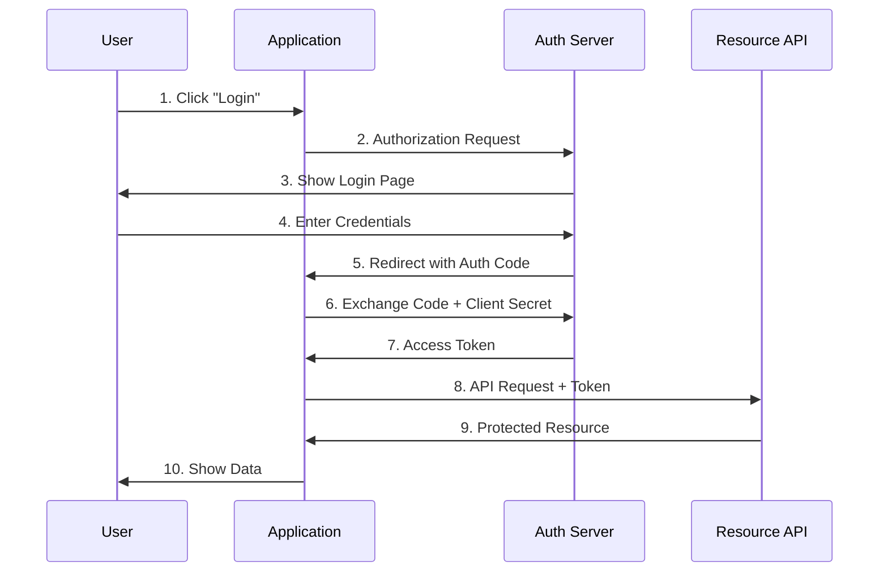

This works well for confidential clients (server-side applications) because the client secret never leaves the server. But what about public clients like mobile apps or browser-based applications?

### The Client Type Problem

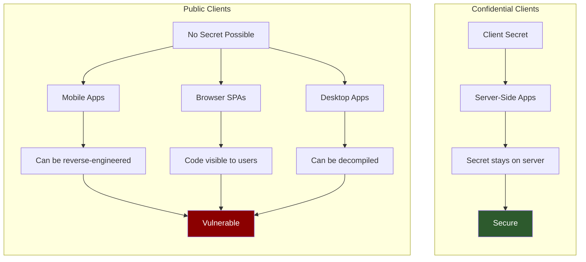

Public clients cannot securely store a client secret. Any secret embedded in a mobile app can be extracted through reverse engineering. Browser-based apps cannot hide secrets at all since all code is visible to users.

### The Authorization Code Interception Attack

This creates a vulnerability: if an attacker can intercept the authorization code during the redirect, they could exchange it for an access token.

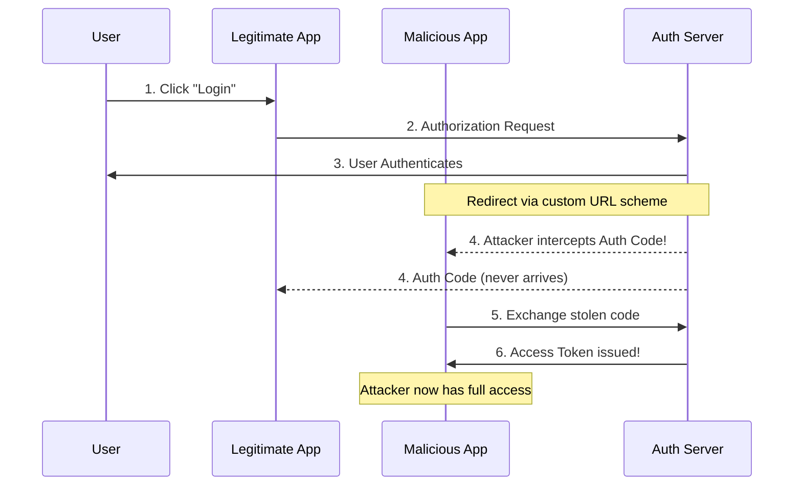

Common interception vectors include:

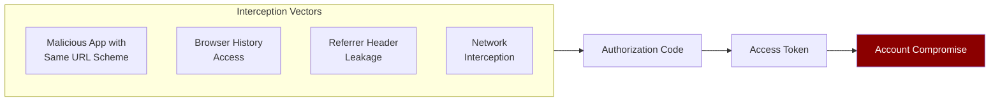

## Enter PKCE: Proof Key for Code Exchange

PKCE (pronounced "pixy") was introduced in RFC 7636 to solve this exact problem. It provides a way to prove that the application requesting the token exchange is the same one that initiated the authorization request, without requiring a static client secret.

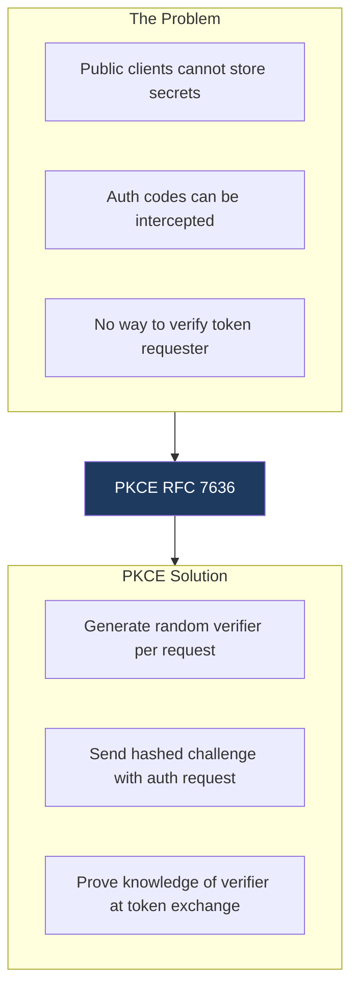

### How PKCE Works

The mechanism is elegantly simple and relies on cryptographic hashing:

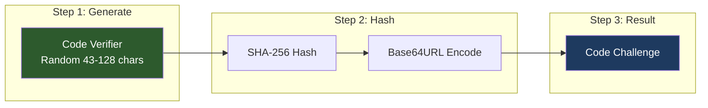

**Step 1: Generate a Code Verifier**

When starting the authorization flow, your application generates a random string called the `code_verifier`. This should be a cryptographically random string between 43 and 128 characters.

```javascript
// Generate a code verifier
function generateCodeVerifier() {
  const array = new Uint8Array(32);
  crypto.getRandomValues(array);
  return base64URLEncode(array);
}

const codeVerifier = generateCodeVerifier();
// Example: "dBjftJeZ4CVP-mB92K27uhbUJU1p1r_wW1gFWFOEjXk"
```

**Step 2: Create a Code Challenge**

Next, create a `code_challenge` by hashing the verifier using SHA-256 and encoding it with base64url.

```javascript
// Create a code challenge from the verifier
async function generateCodeChallenge(verifier) {
  const encoder = new TextEncoder();
  const data = encoder.encode(verifier);
  const hash = await crypto.subtle.digest('SHA-256', data);
  return base64URLEncode(new Uint8Array(hash));
}

const codeChallenge = await generateCodeChallenge(codeVerifier);
// Example: "E9Melhoa2OwvFrEMTJguCHaoeK1t8URWbuGJSstw-cM"
```

### The Transformation Process

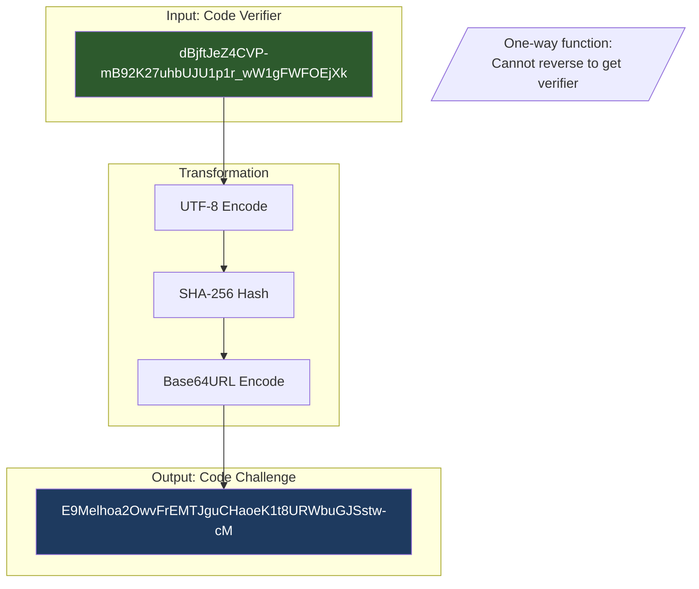

**Step 3: Include the Challenge in the Authorization Request**

Send the code challenge (not the verifier) along with your authorization request:

```
GET /authorize?
  response_type=code&
  client_id=your-client-id&
  redirect_uri=https://your-app.com/callback&
  scope=openid profile&
  code_challenge=E9Melhoa2OwvFrEMTJguCHaoeK1t8URWbuGJSstw-cM&
  code_challenge_method=S256
```

**Step 4: Exchange the Code with the Verifier**

When exchanging the authorization code for tokens, include the original `code_verifier`:

```
POST /token
Content-Type: application/x-www-form-urlencoded

grant_type=authorization_code&
code=SplxlOBeZQQYbYS6WxSbIA&
redirect_uri=https://your-app.com/callback&
client_id=your-client-id&
code_verifier=dBjftJeZ4CVP-mB92K27uhbUJU1p1r_wW1gFWFOEjXk
```

### Complete PKCE Flow

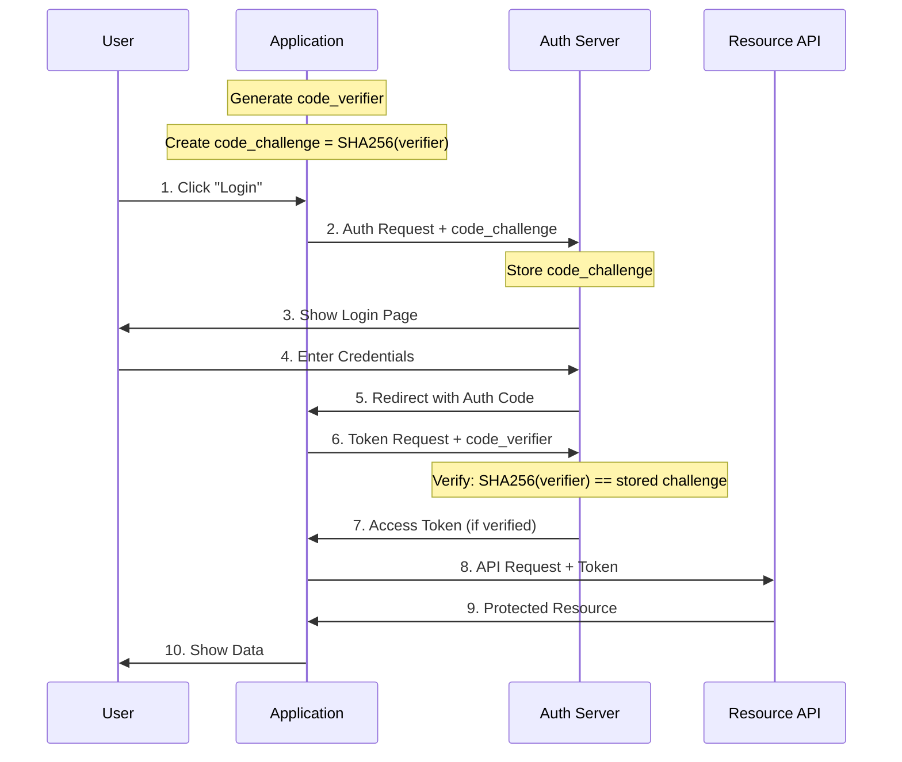

The authorization server then hashes the received `code_verifier` and compares it to the stored `code_challenge`. If they match, the token is issued.

### Server-Side Verification

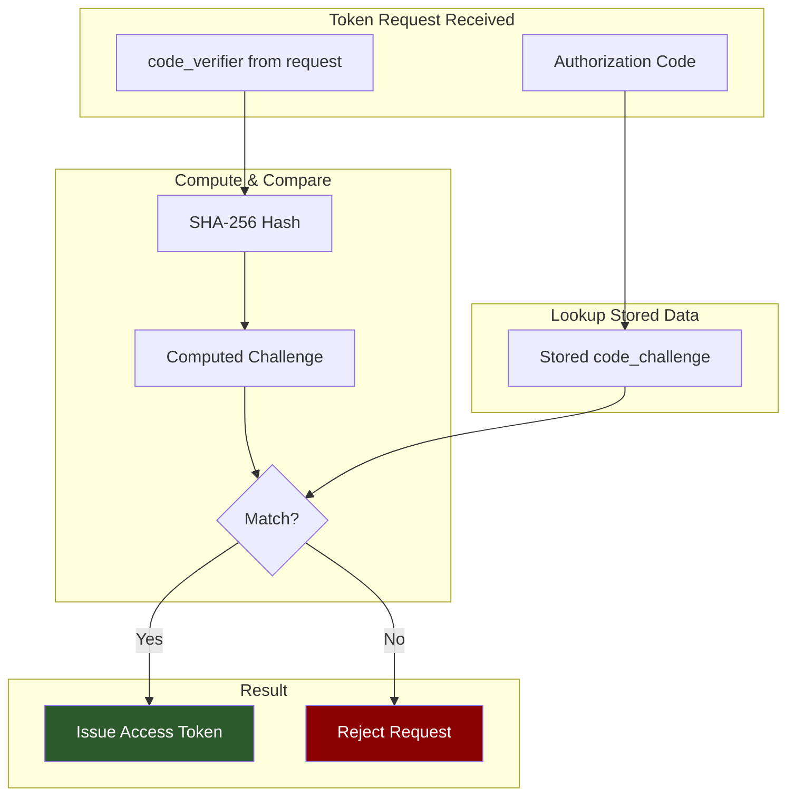

### Why PKCE Stops the Attack

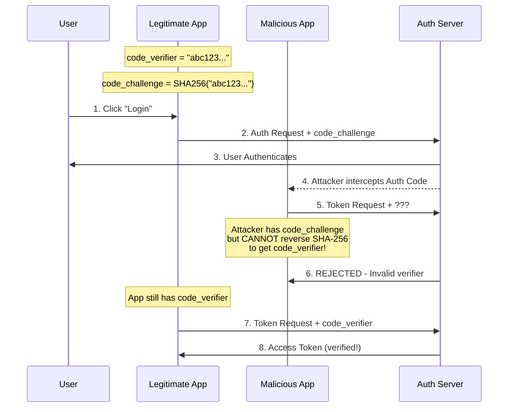

### Why This Works

The security of PKCE relies on two properties:

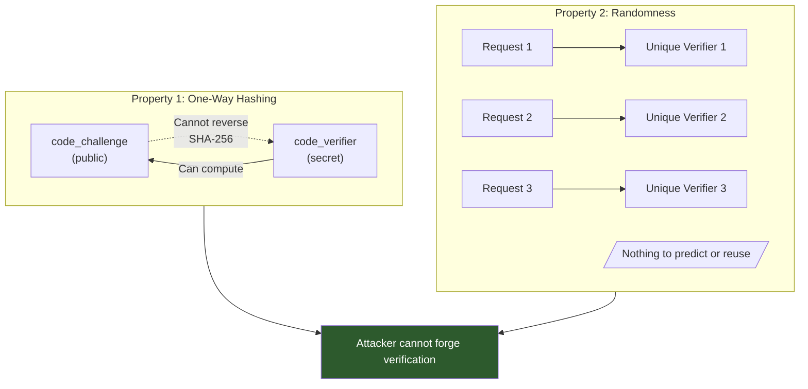

1. **One-way hashing**: An attacker who intercepts the authorization code only sees the `code_challenge` (which was sent in the initial request). They cannot reverse the SHA-256 hash to obtain the `code_verifier` needed for the token exchange.

2. **Randomness**: Each authorization flow uses a fresh, random `code_verifier`, so there is nothing to reuse or predict.

Even if an attacker intercepts the authorization code, they cannot complete the token exchange without the `code_verifier` that only exists in your application's memory.

## When Should You Use PKCE?

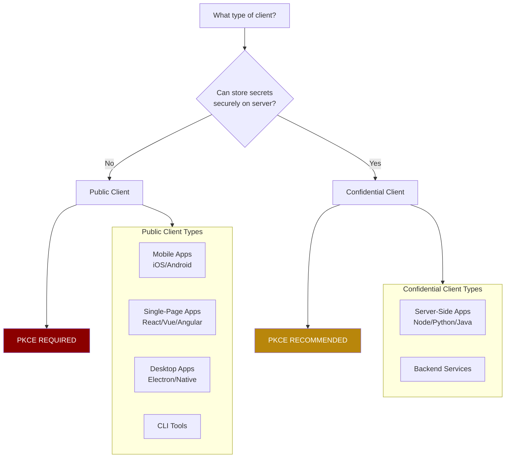

### Always Required

- **Mobile applications** (iOS, Android): These are public clients that cannot securely store secrets.
- **Single-page applications**: Browser-based apps have no way to protect static credentials.
- **Desktop applications**: Native apps can be decompiled and secrets extracted.
- **CLI tools**: Command-line applications face the same secret storage challenges.

### Strongly Recommended

- **Server-side applications**: OAuth 2.1 (the upcoming revision) recommends PKCE for all clients, including confidential ones. It provides defense-in-depth against authorization code injection attacks.

The OAuth 2.0 Security Best Current Practice document (RFC 6819) and the newer OAuth 2.1 draft both recommend using PKCE universally.

## Code Challenge Methods

PKCE supports two methods for creating the code challenge:

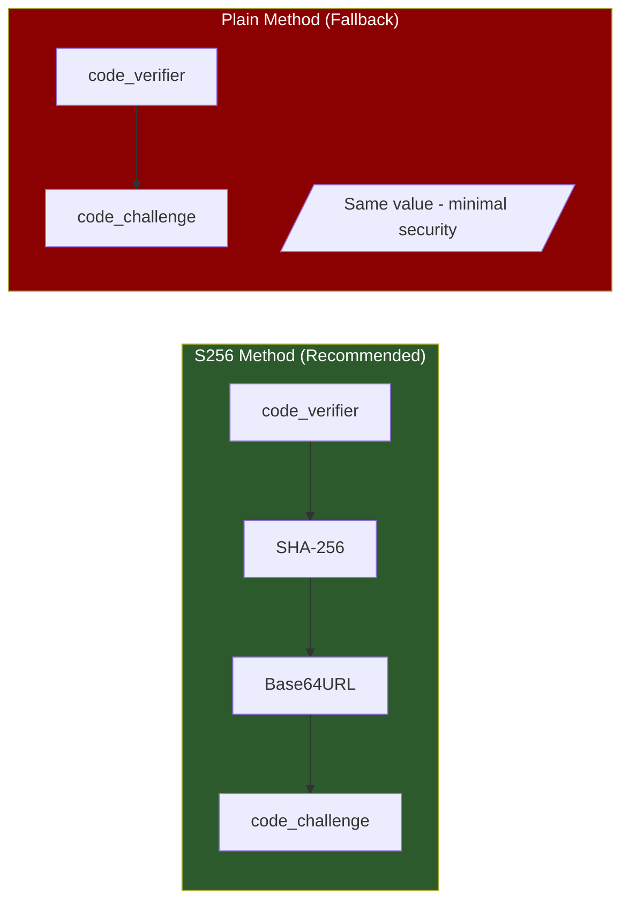

### S256 (Recommended)

The `S256` method uses SHA-256 hashing:

```
code_challenge = BASE64URL(SHA256(code_verifier))
```

This is the recommended and most secure method. Always use this unless the client cannot perform SHA-256 hashing.

### Plain (Fallback Only)

The `plain` method sends the verifier as-is:

```
code_challenge = code_verifier
```

This provides minimal security improvement and should only be used when the client genuinely cannot perform cryptographic operations (which is rare in modern environments).

### Method Comparison

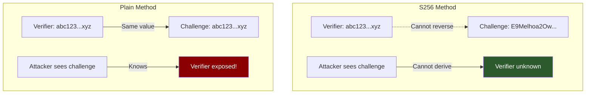

## PKCE State Lifecycle

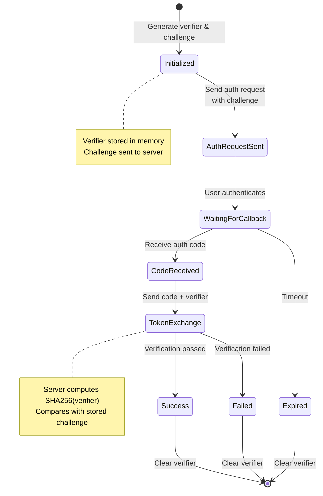

## Implementation Example: Complete Flow

Here is a complete implementation example for a browser-based application:

```javascript
class PKCEAuth {
  constructor(config) {
    this.clientId = config.clientId;
    this.redirectUri = config.redirectUri;
    this.authEndpoint = config.authEndpoint;
    this.tokenEndpoint = config.tokenEndpoint;
  }

  // Generate cryptographically random string
  generateRandomString(length) {
    const array = new Uint8Array(length);
    crypto.getRandomValues(array);
    return this.base64URLEncode(array);
  }

  // Base64 URL encode
  base64URLEncode(buffer) {
    return btoa(String.fromCharCode(...buffer))
      .replace(/\+/g, '-')
      .replace(/\//g, '_')
      .replace(/=+$/, '');
  }

  // Generate code challenge from verifier
  async generateCodeChallenge(verifier) {
    const encoder = new TextEncoder();
    const data = encoder.encode(verifier);
    const hash = await crypto.subtle.digest('SHA-256', data);
    return this.base64URLEncode(new Uint8Array(hash));
  }

  // Start the authorization flow
  async startAuthFlow() {
    const codeVerifier = this.generateRandomString(32);
    const codeChallenge = await this.generateCodeChallenge(codeVerifier);

    // Store verifier for later use
    sessionStorage.setItem('pkce_verifier', codeVerifier);

    const params = new URLSearchParams({
      response_type: 'code',
      client_id: this.clientId,
      redirect_uri: this.redirectUri,
      scope: 'openid profile email',
      code_challenge: codeChallenge,
      code_challenge_method: 'S256',
      state: this.generateRandomString(16)
    });

    window.location.href = `${this.authEndpoint}?${params}`;
  }

  // Exchange authorization code for tokens
  async exchangeCodeForTokens(authorizationCode) {
    const codeVerifier = sessionStorage.getItem('pkce_verifier');

    if (!codeVerifier) {
      throw new Error('No code verifier found');
    }

    const response = await fetch(this.tokenEndpoint, {
      method: 'POST',
      headers: {
        'Content-Type': 'application/x-www-form-urlencoded',
      },
      body: new URLSearchParams({
        grant_type: 'authorization_code',
        code: authorizationCode,
        redirect_uri: this.redirectUri,
        client_id: this.clientId,
        code_verifier: codeVerifier
      })
    });

    // Clear the verifier after use
    sessionStorage.removeItem('pkce_verifier');

    if (!response.ok) {
      throw new Error('Token exchange failed');
    }

    return response.json();
  }
}
```

## Common Pitfalls to Avoid

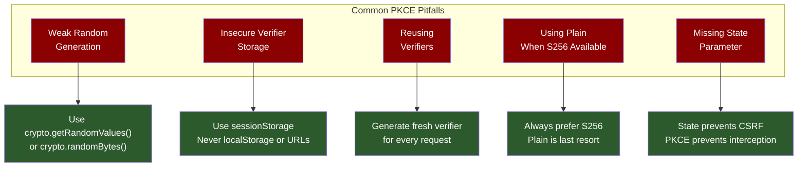

### 1. Weak Code Verifier Generation

Do not use predictable random number generators. Always use cryptographically secure random sources like `crypto.getRandomValues()` in browsers or `crypto.randomBytes()` in Node.js.

### 2. Storing the Verifier Insecurely

The code verifier should be stored temporarily and securely. In browsers, `sessionStorage` is acceptable. Avoid localStorage as it persists across sessions. Never store it in URLs or cookies.

### 3. Reusing Verifiers

Generate a new code verifier for every authorization request. Reusing verifiers defeats the purpose of PKCE.

### 4. Using Plain Method When S256 is Available

The `plain` method should only be used as a last resort. Modern platforms all support SHA-256 hashing.

### 5. Not Validating State Parameter

While PKCE protects against authorization code interception, you should still use the `state` parameter to prevent CSRF attacks on the authorization endpoint.

## PKCE vs Other Security Measures

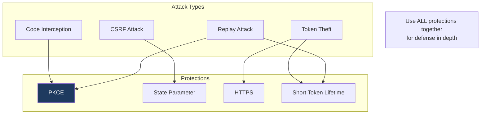

## PKCE in Popular Identity Providers

Most major identity providers now support and recommend PKCE:

| Provider | PKCE Support | Documentation |
|----------|--------------|---------------|
| Auth0 | Full support, required for SPAs | auth0.com/docs |
| Okta | Full support, recommended for all clients | developer.okta.com |
| Google | Full support | developers.google.com |
| Microsoft Identity | Full support, required for public clients | docs.microsoft.com |
| AWS Cognito | Full support | docs.aws.amazon.com |
| Keycloak | Full support | keycloak.org |

## OAuth Evolution: PKCE Becoming Mandatory

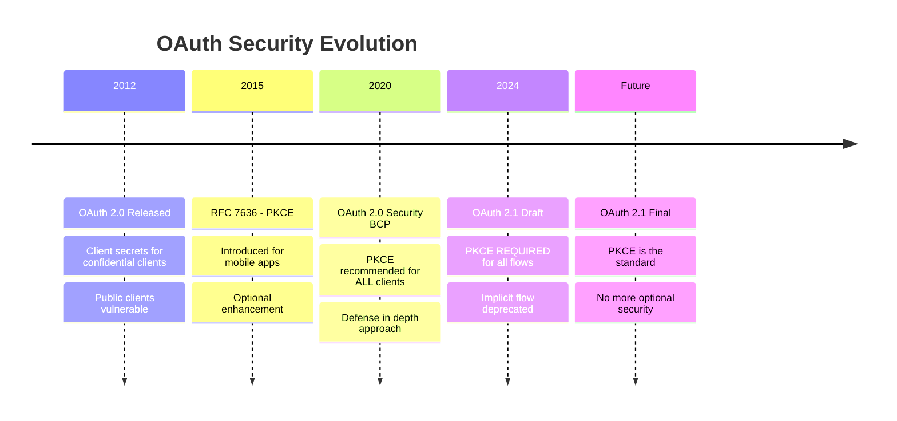

## Summary

PKCE is a critical security enhancement for OAuth 2.0 that protects authorization code flows from interception attacks. By using a dynamically generated code verifier and its hashed challenge, PKCE ensures that only the application that initiated the authorization request can complete the token exchange.

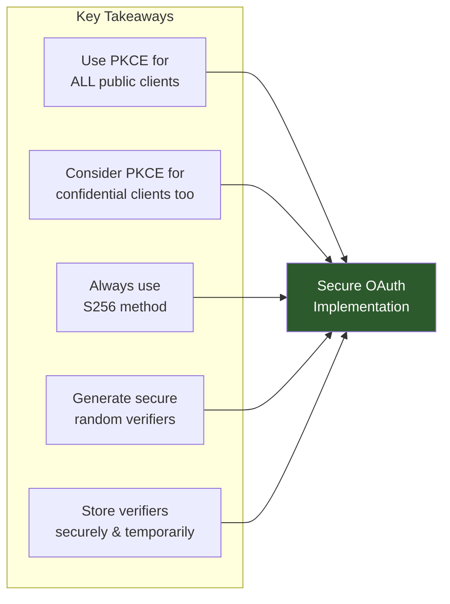

Key takeaways:

- **Use PKCE for all public clients**: Mobile apps, SPAs, desktop apps, and CLI tools must use PKCE.
- **Consider PKCE for confidential clients too**: Defense-in-depth is always valuable.
- **Always use S256**: The SHA-256 method provides strong security.
- **Generate cryptographically secure verifiers**: Use proper random number generators.
- **Store verifiers securely and temporarily**: Clear them after use.

As OAuth 2.1 becomes the standard, PKCE will transition from a recommendation to a requirement. Implementing it now ensures your authentication flows are secure and future-proof.
