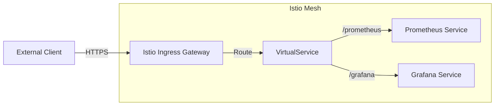

# How to Access Prometheus and Grafana via Istio Gateway

Author: [nawazdhandala](https://www.github.com/nawazdhandala)

Tags: Istio, Prometheus, Grafana, Service Mesh, Kubernetes

Description: Configure Istio Gateway and VirtualService resources to expose Prometheus and Grafana externally with proper routing, authentication, and TLS termination.

---

Istio service mesh provides ingress capabilities through Gateway and VirtualService resources. Exposing Prometheus and Grafana through Istio Gateway offers centralized traffic management, mTLS, and observability. This guide covers the complete configuration.

## Understanding Istio Ingress Architecture

Istio Gateway handles external traffic, while VirtualService defines routing rules to backend services.



## 1. Verify Istio Ingress Gateway

Ensure the Istio ingress gateway is deployed and has an external IP.

```bash
# Check ingress gateway deployment
kubectl get pods -n istio-system -l istio=ingressgateway

# Get external IP or hostname
kubectl get svc istio-ingressgateway -n istio-system

# Verify it can accept traffic
kubectl get gateway -A
```

## 2. Create Gateway Resource

Define a Gateway to accept traffic on specific hosts and ports.

`monitoring-gateway.yaml`

```yaml
apiVersion: networking.istio.io/v1beta1
kind: Gateway
metadata:
  name: monitoring-gateway
  namespace: monitoring
spec:
  selector:
    istio: ingressgateway
  servers:
    - port:
        number: 80
        name: http
        protocol: HTTP
      hosts:
        - monitoring.example.com
      # Redirect HTTP to HTTPS
      tls:
        httpsRedirect: true
    - port:
        number: 443
        name: https
        protocol: HTTPS
      hosts:
        - monitoring.example.com
      tls:
        mode: SIMPLE
        credentialName: monitoring-tls-cert
```

Create the TLS secret for the Gateway:

```bash
# Create secret from certificate files
kubectl create secret tls monitoring-tls-cert \
  --cert=cert.pem \
  --key=key.pem \
  -n istio-system

# Or use cert-manager
```

## 3. Configure VirtualService for Prometheus

Route traffic to Prometheus based on path prefix.

`prometheus-virtualservice.yaml`

```yaml
apiVersion: networking.istio.io/v1beta1
kind: VirtualService
metadata:
  name: prometheus
  namespace: monitoring
spec:
  hosts:
    - monitoring.example.com
  gateways:
    - monitoring-gateway
  http:
    - match:
        - uri:
            prefix: /prometheus
      rewrite:
        uri: /
      route:
        - destination:
            host: prometheus-server
            port:
              number: 80
      timeout: 30s
      retries:
        attempts: 3
        perTryTimeout: 10s
```

Configure Prometheus to serve from subpath:

```yaml
# prometheus values.yaml for Helm
server:
  prefixURL: ""
  baseURL: "/prometheus"
  extraFlags:
    - web.external-url=https://monitoring.example.com/prometheus
    - web.route-prefix=/
```

## 4. Configure VirtualService for Grafana

Route Grafana traffic with proper URL handling.

`grafana-virtualservice.yaml`

```yaml
apiVersion: networking.istio.io/v1beta1
kind: VirtualService
metadata:
  name: grafana
  namespace: monitoring
spec:
  hosts:
    - monitoring.example.com
  gateways:
    - monitoring-gateway
  http:
    - match:
        - uri:
            prefix: /grafana
      rewrite:
        uri: /
      route:
        - destination:
            host: grafana
            port:
              number: 80
      timeout: 60s
```

Configure Grafana to know its public URL:

```ini
# grafana.ini
[server]
root_url = https://monitoring.example.com/grafana/
serve_from_sub_path = true
```

## 5. Combined VirtualService

Combine multiple routes in a single VirtualService.

`monitoring-virtualservice.yaml`

```yaml
apiVersion: networking.istio.io/v1beta1
kind: VirtualService
metadata:
  name: monitoring
  namespace: monitoring
spec:
  hosts:
    - monitoring.example.com
  gateways:
    - monitoring-gateway
  http:
    # Grafana routes
    - match:
        - uri:
            prefix: /grafana
      rewrite:
        uri: /
      route:
        - destination:
            host: grafana
            port:
              number: 80
      corsPolicy:
        allowOrigins:
          - exact: https://monitoring.example.com
        allowMethods:
          - GET
          - POST
          - OPTIONS
        allowHeaders:
          - authorization
          - content-type
        maxAge: "24h"

    # Prometheus routes
    - match:
        - uri:
            prefix: /prometheus
      rewrite:
        uri: /
      route:
        - destination:
            host: prometheus-server
            port:
              number: 80

    # Alertmanager routes
    - match:
        - uri:
            prefix: /alertmanager
      rewrite:
        uri: /
      route:
        - destination:
            host: alertmanager
            port:
              number: 9093
```

## 6. Add Authentication with AuthorizationPolicy

Secure access using Istio AuthorizationPolicy with JWT validation.

`monitoring-authz.yaml`

```yaml
apiVersion: security.istio.io/v1beta1
kind: RequestAuthentication
metadata:
  name: monitoring-jwt
  namespace: monitoring
spec:
  selector:
    matchLabels:
      app: prometheus
  jwtRules:
    - issuer: https://auth.example.com
      jwksUri: https://auth.example.com/.well-known/jwks.json
      audiences:
        - monitoring-api
---
apiVersion: security.istio.io/v1beta1
kind: AuthorizationPolicy
metadata:
  name: monitoring-require-auth
  namespace: monitoring
spec:
  selector:
    matchLabels:
      app: prometheus
  action: ALLOW
  rules:
    - from:
        - source:
            requestPrincipals:
              - https://auth.example.com/*
      when:
        - key: request.auth.claims[groups]
          values:
            - monitoring-users
            - sre-team
```

## 7. Configure mTLS for Internal Traffic

Enable strict mTLS for monitoring namespace.

`monitoring-mtls.yaml`

```yaml
apiVersion: security.istio.io/v1beta1
kind: PeerAuthentication
metadata:
  name: monitoring-mtls
  namespace: monitoring
spec:
  mtls:
    mode: STRICT
---
apiVersion: networking.istio.io/v1beta1
kind: DestinationRule
metadata:
  name: monitoring-mtls
  namespace: monitoring
spec:
  host: "*.monitoring.svc.cluster.local"
  trafficPolicy:
    tls:
      mode: ISTIO_MUTUAL
```

## 8. Rate Limiting

Apply rate limiting to prevent abuse.

`monitoring-ratelimit.yaml`

```yaml
apiVersion: networking.istio.io/v1alpha3
kind: EnvoyFilter
metadata:
  name: monitoring-ratelimit
  namespace: istio-system
spec:
  workloadSelector:
    labels:
      istio: ingressgateway
  configPatches:
    - applyTo: HTTP_FILTER
      match:
        context: GATEWAY
        listener:
          filterChain:
            filter:
              name: envoy.filters.network.http_connection_manager
              subFilter:
                name: envoy.filters.http.router
      patch:
        operation: INSERT_BEFORE
        value:
          name: envoy.filters.http.local_ratelimit
          typed_config:
            "@type": type.googleapis.com/udpa.type.v1.TypedStruct
            type_url: type.googleapis.com/envoy.extensions.filters.http.local_ratelimit.v3.LocalRateLimit
            value:
              stat_prefix: http_local_rate_limiter
              token_bucket:
                max_tokens: 100
                tokens_per_fill: 10
                fill_interval: 1s
              filter_enabled:
                runtime_key: local_rate_limit_enabled
                default_value:
                  numerator: 100
                  denominator: HUNDRED
              filter_enforced:
                runtime_key: local_rate_limit_enforced
                default_value:
                  numerator: 100
                  denominator: HUNDRED
```

## 9. Separate Subdomains

Use different subdomains instead of path-based routing.

`monitoring-gateway-subdomains.yaml`

```yaml
apiVersion: networking.istio.io/v1beta1
kind: Gateway
metadata:
  name: monitoring-gateway
  namespace: monitoring
spec:
  selector:
    istio: ingressgateway
  servers:
    - port:
        number: 443
        name: https
        protocol: HTTPS
      hosts:
        - prometheus.example.com
        - grafana.example.com
      tls:
        mode: SIMPLE
        credentialName: monitoring-wildcard-cert
---
apiVersion: networking.istio.io/v1beta1
kind: VirtualService
metadata:
  name: prometheus
  namespace: monitoring
spec:
  hosts:
    - prometheus.example.com
  gateways:
    - monitoring-gateway
  http:
    - route:
        - destination:
            host: prometheus-server
            port:
              number: 80
---
apiVersion: networking.istio.io/v1beta1
kind: VirtualService
metadata:
  name: grafana
  namespace: monitoring
spec:
  hosts:
    - grafana.example.com
  gateways:
    - monitoring-gateway
  http:
    - route:
        - destination:
            host: grafana
            port:
              number: 80
```

## 10. WebSocket Support for Grafana

Ensure WebSocket connections work for Grafana Live.

```yaml
apiVersion: networking.istio.io/v1beta1
kind: VirtualService
metadata:
  name: grafana
  namespace: monitoring
spec:
  hosts:
    - monitoring.example.com
  gateways:
    - monitoring-gateway
  http:
    # WebSocket route for Grafana Live
    - match:
        - uri:
            prefix: /grafana/api/live/ws
          headers:
            upgrade:
              exact: websocket
      route:
        - destination:
            host: grafana
            port:
              number: 80
      timeout: 0s  # Disable timeout for WebSocket

    # Regular Grafana routes
    - match:
        - uri:
            prefix: /grafana
      rewrite:
        uri: /
      route:
        - destination:
            host: grafana
            port:
              number: 80
```

## 11. Debugging Istio Routing

Troubleshoot routing issues with Istio tools.

```bash
# Check VirtualService configuration
istioctl analyze -n monitoring

# Verify routes are applied
istioctl proxy-config routes deploy/istio-ingressgateway -n istio-system

# Check listener configuration
istioctl proxy-config listeners deploy/istio-ingressgateway -n istio-system

# Test routing with debug headers
curl -v -H "Host: monitoring.example.com" \
  https://INGRESS_GATEWAY_IP/prometheus/-/healthy

# Check Envoy access logs
kubectl logs -n istio-system -l istio=ingressgateway -c istio-proxy --tail=100
```

## 12. Complete Deployment Example

Full monitoring stack exposed via Istio.

```yaml
---
apiVersion: networking.istio.io/v1beta1
kind: Gateway
metadata:
  name: monitoring-gateway
  namespace: monitoring
spec:
  selector:
    istio: ingressgateway
  servers:
    - port:
        number: 443
        name: https
        protocol: HTTPS
      hosts:
        - monitoring.example.com
      tls:
        mode: SIMPLE
        credentialName: monitoring-tls
---
apiVersion: networking.istio.io/v1beta1
kind: VirtualService
metadata:
  name: monitoring
  namespace: monitoring
spec:
  hosts:
    - monitoring.example.com
  gateways:
    - monitoring-gateway
  http:
    - match:
        - uri:
            prefix: /grafana
      rewrite:
        uri: /
      route:
        - destination:
            host: grafana
            port:
              number: 80
    - match:
        - uri:
            prefix: /prometheus
      rewrite:
        uri: /
      route:
        - destination:
            host: prometheus-server
            port:
              number: 80
---
apiVersion: security.istio.io/v1beta1
kind: PeerAuthentication
metadata:
  name: monitoring-mtls
  namespace: monitoring
spec:
  mtls:
    mode: STRICT
```

---

Istio Gateway provides enterprise-grade ingress for Prometheus and Grafana with built-in mTLS, traffic management, and observability. The key is correctly configuring VirtualService routing and ensuring both services know their public URLs for generating correct links and callbacks.
