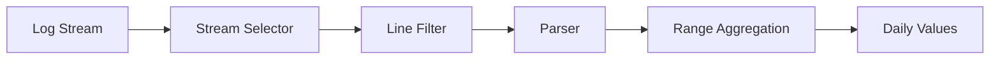

# How to Aggregate Loki Logs by Day in Grafana

Author: [nawazdhandala](https://www.github.com/nawazdhandala)

Tags: Grafana, Loki, LogQL, Log Aggregation, Observability

Description: Learn how to aggregate Loki logs by day in Grafana for trend analysis, daily reports, and capacity planning. This guide covers LogQL aggregation functions, time bucketing, and visualization techniques.

---

Aggregating logs by day is essential for understanding trends, generating reports, and capacity planning. Grafana Loki provides powerful LogQL functions that make daily aggregation straightforward. This guide shows you how to aggregate Loki logs by day for various use cases.

## Understanding LogQL Metric Queries

LogQL supports two types of queries:

1. **Log queries** - Return log lines
2. **Metric queries** - Return calculated values

For daily aggregation, we use metric queries with range aggregation functions.



## Basic Daily Aggregation

### Counting Logs Per Day

To count all logs by day, use `count_over_time` with a 24-hour range:

```logql
sum(count_over_time({job="myapp"}[24h]))
```

However, this gives a rolling 24-hour count. For calendar-day aggregation, use the `$__interval` variable with appropriate time range settings.

### Setting Up Time Bucketing

In your Grafana panel:

1. Set **Time range** to Last 7 days (or desired period)
2. Set **Query options** > **Interval** to `1d`

```logql
sum(count_over_time({job="myapp"}[$__interval]))
```

## Aggregating by Label

### Daily Error Count by Service

```logql
sum by (service) (count_over_time({job="myapp"} |= "error" [$__interval]))
```

### Daily Logs by Log Level

```logql
sum by (level) (count_over_time({job="myapp"} | json | level != "" [$__interval]))
```

### Daily Logs by Namespace

```logql
sum by (namespace) (count_over_time({namespace=~".+"} [$__interval]))
```

## Advanced Aggregation Patterns

### Parsing JSON Logs Before Aggregation

When logs contain structured data:

```json
{"timestamp":"2024-01-15T10:30:00Z","level":"error","service":"api","message":"Connection timeout","duration_ms":5000}
```

Aggregate by parsed fields:

```logql
# Count errors by service
sum by (service) (
  count_over_time(
    {job="myapp"}
    | json
    | level = "error"
    [$__interval]
  )
)
```

### Extracting Values with Pattern Matching

For semi-structured logs:

```
2024-01-15 10:30:00 INFO [api-service] Request processed in 150ms
```

```logql
# Average duration per day
avg_over_time(
  {job="myapp"}
  | pattern "<timestamp> <level> [<service>] Request processed in <duration>ms"
  | unwrap duration
  [$__interval]
)
```

### Sum of Extracted Values

```logql
# Total bytes transferred per day
sum(
  sum_over_time(
    {job="nginx"}
    | pattern `<ip> - - <_> "<method> <path> <_>" <status> <bytes>`
    | unwrap bytes
    [$__interval]
  )
)
```

## Visualization Configuration

### Time Series Panel Settings

For daily aggregation visualization:

```json
{
  "type": "timeseries",
  "options": {
    "tooltip": {
      "mode": "single"
    },
    "legend": {
      "displayMode": "table",
      "placement": "bottom",
      "calcs": ["sum", "mean", "max"]
    }
  },
  "fieldConfig": {
    "defaults": {
      "custom": {
        "drawStyle": "bars",
        "barAlignment": 0,
        "fillOpacity": 80
      }
    }
  }
}
```

### Bar Chart Panel

For cleaner daily visualization:

1. Choose **Bar chart** visualization
2. Set **X Axis** to **Time**
3. Enable **Show values** for exact counts

## Practical Dashboard Examples

### Daily Error Summary Dashboard

Create a dashboard with multiple daily aggregation panels:

**Panel 1: Total Errors by Day**
```logql
sum(count_over_time({job=~".+"} |= "error" [$__interval]))
```

**Panel 2: Errors by Service**
```logql
sum by (job) (count_over_time({job=~".+"} |= "error" [$__interval]))
```

**Panel 3: Error Rate (percentage)**
```logql
sum(count_over_time({job=~".+"} |= "error" [$__interval]))
/
sum(count_over_time({job=~".+"} [$__interval]))
* 100
```

### Weekly Comparison

Compare this week to last week:

```logql
# This week's daily count
sum(count_over_time({job="myapp"} [$__interval]))

# Last week (use time shift in query options)
sum(count_over_time({job="myapp"} [$__interval] offset 7d))
```

## Recording Rules for Performance

For frequently accessed daily aggregations, create recording rules:

```yaml
groups:
  - name: daily-log-metrics
    interval: 1h
    rules:
      - record: job:log_count:daily
        expr: |
          sum by (job) (count_over_time({job=~".+"}[24h]))

      - record: job:error_count:daily
        expr: |
          sum by (job) (count_over_time({job=~".+"} |= "error" [24h]))

      - record: namespace:log_bytes:daily
        expr: |
          sum by (namespace) (bytes_over_time({namespace=~".+"}[24h]))
```

Query the recorded metrics:

```promql
job:error_count:daily{job="api-server"}
```

## Data Volume Analysis

### Daily Log Volume by Namespace

```logql
sum by (namespace) (bytes_over_time({namespace=~".+"} [$__interval])) / 1024 / 1024
```

This returns megabytes of logs per day per namespace.

### Log Ingestion Rate Trend

```logql
# Logs per second, averaged over each day
sum(rate({job=~".+"} [$__interval]))
```

## Table Visualization for Reports

For report-style daily summaries, use a Table panel:

```logql
sum by (job, level) (count_over_time({job=~".+"} | json [$__interval]))
```

Configure table transformations:

1. **Transform** > **Organize fields** - Rename columns
2. **Transform** > **Sort by** - Sort by date descending
3. **Transform** > **Group by** - Group by day

## Handling Time Zones

Grafana and Loki use UTC by default. For local time zone daily aggregation:

### Dashboard Time Zone Setting

1. Go to **Dashboard settings**
2. Under **Time options**, set **Timezone** to your local time zone

### Query-Level Time Shift

If your logs use a different time zone:

```logql
# Shift by hours to align with your time zone
sum(count_over_time({job="myapp"} [$__interval] offset -5h))
```

## Complete Example: API Daily Report

```logql
# Total API calls per day
sum(count_over_time(
  {job="api-gateway"}
  | json
  [$__interval]
))

# Successful calls (2xx status)
sum(count_over_time(
  {job="api-gateway"}
  | json
  | status_code >= 200
  | status_code < 300
  [$__interval]
))

# Failed calls (4xx and 5xx)
sum(count_over_time(
  {job="api-gateway"}
  | json
  | status_code >= 400
  [$__interval]
))

# Average response time per day
avg_over_time(
  {job="api-gateway"}
  | json
  | unwrap response_time_ms
  [$__interval]
)
```

## Query Optimization Tips

### 1. Use Specific Stream Selectors

```logql
# Good - specific selector
sum(count_over_time({job="api", namespace="production"} [$__interval]))

# Bad - broad selector
sum(count_over_time({job=~".+"} [$__interval]))
```

### 2. Filter Before Parsing

```logql
# Good - filter first
sum(count_over_time({job="api"} |= "error" | json [$__interval]))

# Bad - parse everything
sum(count_over_time({job="api"} | json | level = "error" [$__interval]))
```

### 3. Use Line Filters for Performance

```logql
# Fast - line filter
{job="api"} |= "error"

# Slower - label filter after parse
{job="api"} | json | level = "error"
```

## Summary

Aggregating Loki logs by day in Grafana involves:

1. **Using `count_over_time`** with 24h ranges or `$__interval`
2. **Setting the query interval** to `1d` in panel settings
3. **Grouping by labels** with `sum by (label)`
4. **Parsing logs** with `json` or `pattern` before aggregation
5. **Creating recording rules** for frequently accessed aggregations
6. **Using bar chart or table** visualizations for daily data

With these techniques, you can build comprehensive daily log reports, track error trends, and analyze log volume patterns effectively.
