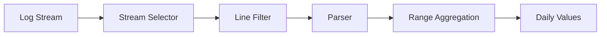

# How to Aggregate Loki Logs by Day in Grafana

Author: [nawazdhandala](https://www.github.com/nawazdhandala)

Tags: Grafana, Loki, LogQL, Log Aggregation, Observability

Description: Learn how to aggregate Loki logs by day in Grafana for trend analysis, daily reports, and capacity planning.

---

Aggregating logs by day is essential for understanding trends, generating reports, and capacity planning. Grafana Loki provides powerful LogQL functions that make daily aggregation straightforward. This guide shows you how to aggregate Loki logs by day for various use cases.

## Understanding LogQL Metric Queries

LogQL supports two types of queries:

1. **Log queries** - Return log lines
2. **Metric queries** - Return calculated values

For daily aggregation, we use metric queries with range aggregation functions.


```mermaid
flowchart LR
    A[Log Stream] --> B[Stream Selector]
    B --> C[Line Filter]
    C --> D[Parser]
    D --> E[Range Aggregation]
    E --> F[Daily Values]
```

## Basic Daily Aggregation

### Counting Logs Per Day

To count all logs by day, use `count_over_time` with a 24-hour range:

```logql
sum(count_over_time({job="myapp"}[24h]))
```

However, this gives a rolling 24-hour count at each evaluation timestamp. For day-sized buckets in Grafana, use the `$__interval` variable with a 1-day query interval and align the dashboard time range to day boundaries.

### Setting Up Time Bucketing

In your Grafana panel:

1. Set **Time range** to Last 7 days (or desired period)
2. Set **Query options** > **Min interval** to `1d`
3. Align the time range to day boundaries when you need calendar-day buckets

```logql
sum(count_over_time({job="myapp"}[$__interval]))
```

## Aggregating by Label

### Daily Error Count by Service

```logql
sum by (service) (count_over_time({job="myapp"} |= "error" [$__interval]))
```

### Daily Logs by Log Level

```logql
sum by (level) (count_over_time({job="myapp"} | json | level != "" [$__interval]))
```

### Daily Logs by Namespace

```logql
sum by (namespace) (count_over_time({namespace=~".+"} [$__interval]))
```

## Advanced Aggregation Patterns

### Parsing JSON Logs Before Aggregation

When logs contain structured data:

```json
{"timestamp":"2024-01-15T10:30:00Z","level":"error","service":"api","message":"Connection timeout","duration_ms":5000}
```

Aggregate by parsed fields:

Count errors by service:

```logql
sum by (service) (
  count_over_time(
    {job="myapp"}
    | json
    | level = "error"
    [$__interval]
  )
)
```

### Extracting Values with Pattern Matching

For semi-structured logs:

```text
2024-01-15 10:30:00 INFO [api-service] Request processed in 150ms
```

Average duration per day:

```logql
avg_over_time(
  {job="myapp"}
  | pattern "<date> <time> <level> [<service>] Request processed in <duration>ms"
  | unwrap duration
  [$__interval]
)
```

### Sum of Extracted Values

Total bytes transferred per day:

```logql
sum(
  sum_over_time(
    {job="nginx"}
    | pattern `<ip> - - <_> "<method> <path> <_>" <status> <bytes>`
    | unwrap bytes
    [$__interval]
  )
)
```

## Visualization Configuration

### Time Series Panel Settings

For daily aggregation visualization:

```json
{
  "type": "timeseries",
  "options": {
    "tooltip": {
      "mode": "single"
    },
    "legend": {
      "displayMode": "table",
      "placement": "bottom",
      "calcs": ["sum", "mean", "max"]
    }
  },
  "fieldConfig": {
    "defaults": {
      "custom": {
        "drawStyle": "bars",
        "barAlignment": 0,
        "fillOpacity": 80
      }
    }
  }
}
```

### Bar Chart Panel

For cleaner daily visualization:

1. Choose **Bar chart** visualization
2. Set **X Axis** to **Time**
3. Enable **Show values** for exact counts

## Practical Dashboard Examples

### Daily Error Summary Dashboard

Create a dashboard with multiple daily aggregation panels:

**Panel 1: Total Errors by Day**
```logql
sum(count_over_time({job=~".+"} |= "error" [$__interval]))
```

**Panel 2: Errors by Service**
```logql
sum by (job) (count_over_time({job=~".+"} |= "error" [$__interval]))
```

**Panel 3: Error Rate (percentage)**
```logql
sum(count_over_time({job=~".+"} |= "error" [$__interval]))
/
sum(count_over_time({job=~".+"} [$__interval]))
* 100
```

### Weekly Comparison

Compare this week to last week:

This week's daily count:

```logql
sum(count_over_time({job="myapp"} [$__interval]))
```

Last week:

```logql
sum(count_over_time({job="myapp"} [$__interval] offset 7d))
```

## Recording Rules for Performance

For frequently accessed daily aggregations, create recording rules:

```yaml
groups:
  - name: daily-log-metrics
    interval: 1h
    rules:
      - record: job:log_count:daily
        expr: |
          sum by (job) (count_over_time({job=~".+"}[24h]))

      - record: job:error_count:daily
        expr: |
          sum by (job) (count_over_time({job=~".+"} |= "error" [24h]))

      - record: namespace:log_bytes:daily
        expr: |
          sum by (namespace) (bytes_over_time({namespace=~".+"}[24h]))
```

Query the recorded metrics:

```promql
job:error_count:daily{job="api-server"}
```

## Data Volume Analysis

### Daily Log Volume by Namespace

```logql
sum by (namespace) (bytes_over_time({namespace=~".+"} [$__interval])) / 1024 / 1024
```

This returns megabytes of logs per day per namespace.

### Log Ingestion Rate Trend

Logs per second, averaged over each query interval:

```logql
sum(rate({job=~".+"} [$__interval]))
```

## Table Visualization for Reports

For report-style daily summaries, use a Table panel:

```logql
sum by (job, level) (count_over_time({job=~".+"} | json [$__interval]))
```

Configure table transformations:

1. **Transform** > **Organize fields** - Rename columns
2. **Transform** > **Sort by** - Sort by date descending
3. **Transform** > **Group by** - Group by the time field if you need additional table calculations

## Handling Time Zones

Loki stores and queries log timestamps as instants in time, while Grafana controls how those timestamps are displayed and how dashboard time ranges are selected. For local time zone daily aggregation:

### Dashboard Time Zone Setting

1. Go to **Dashboard settings**
2. Under **Time options**, set **Timezone** to your local time zone

### Query-Level Time Shift

Use LogQL `offset` to compare with a previous time window. The `offset` modifier shifts the range vector used by the query; it does not change the dashboard time zone.

```logql
sum(count_over_time({job="myapp"} [$__interval] offset 5h))
```

## Complete Example: API Daily Report

Total API calls per day:

```logql
sum(count_over_time(
  {job="api-gateway"}
  | json
  [$__interval]
))
```

Successful calls (2xx status):

```logql
sum(count_over_time(
  {job="api-gateway"}
  | json
  | status_code >= 200
  | status_code < 300
  [$__interval]
))
```

Failed calls (4xx and 5xx):

```logql
sum(count_over_time(
  {job="api-gateway"}
  | json
  | status_code >= 400
  [$__interval]
))
```

Average response time per day:

```logql
avg_over_time(
  {job="api-gateway"}
  | json
  | unwrap response_time_ms
  [$__interval]
)
```

## Query Optimization Tips

### 1. Use Specific Stream Selectors

Good - specific selector:

```logql
sum(count_over_time({job="api", namespace="production"} [$__interval]))
```

Bad - broad selector:

```logql
sum(count_over_time({job=~".+"} [$__interval]))
```

### 2. Filter Before Parsing

Good - filter first:

```logql
sum(count_over_time({job="api"} |= "error" | json [$__interval]))
```

Bad - parse everything:

```logql
sum(count_over_time({job="api"} | json | level = "error" [$__interval]))
```

### 3. Use Line Filters for Performance

Fast - line filter:

```logql
{job="api"} |= "error"
```

Slower - label filter after parse:

```logql
{job="api"} | json | level = "error"
```

## Summary

Aggregating Loki logs by day in Grafana involves:

1. **Using `count_over_time`** with 24h ranges or `$__interval`
2. **Setting the minimum query interval** to `1d` in panel settings
3. **Grouping by labels** with `sum by (label)`
4. **Parsing logs** with `json` or `pattern` before aggregation
5. **Creating recording rules** for frequently accessed aggregations
6. **Using bar chart or table** visualizations for daily data

With these techniques, you can build comprehensive daily log reports, track error trends, and analyze log volume patterns effectively.
