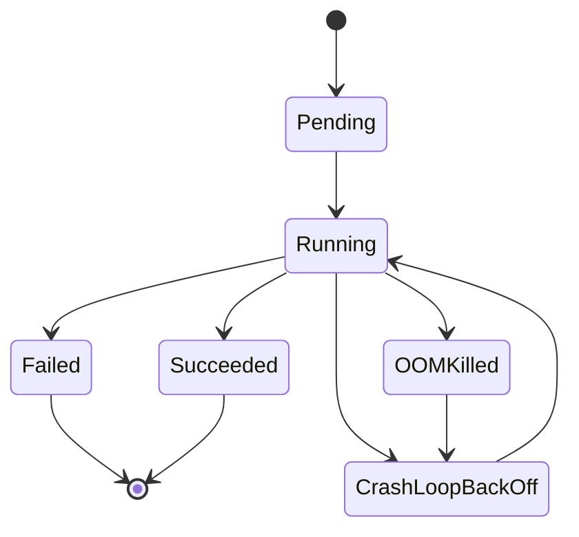
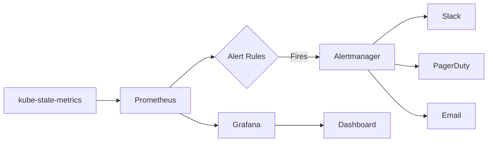

# How to Set Up Alerts for Pod Failures in Kubernetes

Author: [nawazdhandala](https://www.github.com/nawazdhandala)

Tags: Kubernetes, Prometheus, Alerting, Grafana, Pod Monitoring, SRE

Description: Learn how to configure effective alerts for Kubernetes pod failures using Prometheus and Grafana. This guide covers CrashLoopBackOff detection, OOMKilled alerts, and best practices for pod health monitoring.

---

Pod failures in Kubernetes can indicate critical issues that affect application availability. Setting up proper alerting ensures you catch these problems early and respond quickly. This guide shows you how to configure comprehensive pod failure alerts using Prometheus and Grafana.

## Understanding Pod Failure States

Before setting up alerts, understand the different ways pods can fail:



### Key Failure Types

| State | Description | Severity |
|-------|-------------|----------|
| CrashLoopBackOff | Container repeatedly crashing | High |
| OOMKilled | Container killed due to memory limit | High |
| ImagePullBackOff | Cannot pull container image | Medium |
| Pending (stuck) | Pod cannot be scheduled | Medium |
| Evicted | Pod removed due to node pressure | Medium |

## Prerequisites

Ensure you have these components installed:

- **kube-state-metrics**: Exposes Kubernetes object metrics
- **Prometheus**: Scrapes and stores metrics
- **Alertmanager**: Handles alert routing and notifications

```bash
# Install kube-state-metrics via Helm
helm repo add prometheus-community https://prometheus-community.github.io/helm-charts
helm install kube-state-metrics prometheus-community/kube-state-metrics
```

## Essential Pod Failure Alert Rules

### 1. CrashLoopBackOff Detection

This alert fires when a pod enters the CrashLoopBackOff state:

```yaml
groups:
  - name: pod-failures
    rules:
      - alert: PodCrashLoopBackOff
        expr: |
          max_over_time(kube_pod_container_status_waiting_reason{reason="CrashLoopBackOff"}[5m]) == 1
        for: 5m
        labels:
          severity: critical
        annotations:
          summary: "Pod {{ $labels.namespace }}/{{ $labels.pod }} is in CrashLoopBackOff"
          description: "Container {{ $labels.container }} in pod {{ $labels.pod }} has been in CrashLoopBackOff for more than 5 minutes."
          runbook_url: "https://runbooks.example.com/pod-crashloop"
```

### 2. OOMKilled Alert

Detect containers being killed due to memory exhaustion:

```yaml
      - alert: PodOOMKilled
        expr: |
          kube_pod_container_status_last_terminated_reason{reason="OOMKilled"} == 1
        for: 0m
        labels:
          severity: warning
        annotations:
          summary: "Container {{ $labels.container }} OOMKilled in {{ $labels.namespace }}/{{ $labels.pod }}"
          description: "Container was killed due to out of memory. Consider increasing memory limits."
```

### 3. Pod Not Ready

Alert when pods remain not ready for extended periods:

```yaml
      - alert: PodNotReady
        expr: |
          sum by (namespace, pod) (
            max by (namespace, pod) (kube_pod_status_phase{phase=~"Pending|Unknown"}) *
            on(namespace, pod) group_left(owner_kind)
            topk by(namespace, pod) (1, max by(namespace, pod, owner_kind) (kube_pod_owner{owner_kind!="Job"}))
          ) > 0
        for: 15m
        labels:
          severity: warning
        annotations:
          summary: "Pod {{ $labels.namespace }}/{{ $labels.pod }} not ready"
          description: "Pod has been in a non-ready state for more than 15 minutes."
```

### 4. High Pod Restart Rate

Detect pods that are restarting frequently:

```yaml
      - alert: PodHighRestartRate
        expr: |
          increase(kube_pod_container_status_restarts_total[1h]) > 5
        for: 10m
        labels:
          severity: warning
        annotations:
          summary: "High restart rate for {{ $labels.namespace }}/{{ $labels.pod }}"
          description: "Container {{ $labels.container }} has restarted {{ $value }} times in the last hour."
```

### 5. ImagePullBackOff

Alert on image pull failures:

```yaml
      - alert: PodImagePullBackOff
        expr: |
          kube_pod_container_status_waiting_reason{reason="ImagePullBackOff"} == 1
        for: 5m
        labels:
          severity: warning
        annotations:
          summary: "Image pull failing for {{ $labels.namespace }}/{{ $labels.pod }}"
          description: "Container {{ $labels.container }} cannot pull its image. Check image name and registry credentials."
```

## Complete Prometheus Rules File

Save this as `pod-alerts.yaml`:

```yaml
apiVersion: monitoring.coreos.com/v1
kind: PrometheusRule
metadata:
  name: pod-failure-alerts
  namespace: monitoring
  labels:
    release: prometheus
spec:
  groups:
    - name: pod-failures
      interval: 30s
      rules:
        - alert: PodCrashLoopBackOff
          expr: |
            max_over_time(kube_pod_container_status_waiting_reason{reason="CrashLoopBackOff"}[5m]) == 1
          for: 5m
          labels:
            severity: critical
          annotations:
            summary: "Pod in CrashLoopBackOff"
            description: "{{ $labels.namespace }}/{{ $labels.pod }} container {{ $labels.container }}"

        - alert: PodOOMKilled
          expr: |
            kube_pod_container_status_last_terminated_reason{reason="OOMKilled"} == 1
          for: 0m
          labels:
            severity: warning
          annotations:
            summary: "Container OOMKilled"
            description: "{{ $labels.namespace }}/{{ $labels.pod }} needs more memory"

        - alert: PodNotReady
          expr: |
            min_over_time(sum by (namespace, pod) (kube_pod_status_phase{phase=~"Pending|Unknown"})[15m:1m]) > 0
          for: 0m
          labels:
            severity: warning
          annotations:
            summary: "Pod stuck in Pending/Unknown"
            description: "{{ $labels.namespace }}/{{ $labels.pod }} not running for 15+ minutes"

        - alert: PodFrequentRestart
          expr: |
            increase(kube_pod_container_status_restarts_total[1h]) > 5
          for: 5m
          labels:
            severity: warning
          annotations:
            summary: "Pod restarting frequently"
            description: "{{ $labels.namespace }}/{{ $labels.pod }} restarted {{ $value }} times"

        - alert: ContainerWaiting
          expr: |
            kube_pod_container_status_waiting_reason{reason!=""} == 1
          for: 10m
          labels:
            severity: warning
          annotations:
            summary: "Container stuck waiting"
            description: "{{ $labels.namespace }}/{{ $labels.pod }} waiting: {{ $labels.reason }}"
```

Apply the rules:

```bash
kubectl apply -f pod-alerts.yaml
```

## Configuring Alertmanager Routes

Set up routing to send pod alerts to the right channels:

```yaml
apiVersion: v1
kind: Secret
metadata:
  name: alertmanager-config
  namespace: monitoring
stringData:
  alertmanager.yaml: |
    global:
      resolve_timeout: 5m
      slack_api_url: 'https://hooks.slack.com/services/xxx/yyy/zzz'

    route:
      group_by: ['alertname', 'namespace']
      group_wait: 30s
      group_interval: 5m
      repeat_interval: 4h
      receiver: 'default'
      routes:
        - match:
            severity: critical
          receiver: 'pagerduty-critical'
        - match:
            severity: warning
          receiver: 'slack-warnings'

    receivers:
      - name: 'default'
        slack_configs:
          - channel: '#alerts'

      - name: 'pagerduty-critical'
        pagerduty_configs:
          - service_key: 'your-pagerduty-key'
            severity: critical

      - name: 'slack-warnings'
        slack_configs:
          - channel: '#k8s-warnings'
            title: '{{ .GroupLabels.alertname }}'
            text: '{{ range .Alerts }}{{ .Annotations.description }}{{ end }}'
```

## Grafana Dashboard for Pod Health

Create a dashboard to visualize pod health alongside alerts:

### Panel 1: Pod Status Overview

```promql
# Pods by phase
sum by (phase) (kube_pod_status_phase)
```

### Panel 2: Container Restarts (24h)

```promql
# Top 10 restarting containers
topk(10,
  sum by (namespace, pod, container) (
    increase(kube_pod_container_status_restarts_total[24h])
  ) > 0
)
```

### Panel 3: OOMKilled Events

```promql
# OOMKilled containers
sum by (namespace, pod, container) (
  kube_pod_container_status_last_terminated_reason{reason="OOMKilled"}
)
```

### Panel 4: Waiting Containers

```promql
# Containers in waiting state with reason
sum by (namespace, pod, reason) (
  kube_pod_container_status_waiting_reason
) > 0
```

## Alert Flow Architecture



## Best Practices

### 1. Use Appropriate For Durations

```yaml
# CrashLoop - wait 5m to avoid transient issues
for: 5m

# OOMKilled - alert immediately
for: 0m

# Pending pods - wait longer for scheduling
for: 15m
```

### 2. Exclude Job Pods

Jobs are expected to terminate. Exclude them from not-ready alerts:

```promql
kube_pod_status_phase{phase!="Running"}
* on(namespace, pod) group_left(owner_kind)
kube_pod_owner{owner_kind!="Job"}
```

### 3. Namespace-Based Routing

Route alerts based on namespace importance:

```yaml
routes:
  - match:
      namespace: production
      severity: critical
    receiver: 'pagerduty-prod'
  - match:
      namespace: staging
    receiver: 'slack-staging'
```

### 4. Include Useful Labels

Add labels that help with alert routing and investigation:

```yaml
labels:
  team: "{{ $labels.namespace }}"
  cluster: "production-us-east"
```

## Testing Your Alerts

Create a test pod that will crash:

```yaml
apiVersion: v1
kind: Pod
metadata:
  name: crash-test
  namespace: default
spec:
  containers:
    - name: crasher
      image: busybox
      command: ["/bin/sh", "-c", "exit 1"]
```

```bash
# Deploy and watch for alerts
kubectl apply -f crash-test.yaml

# Check alert status in Prometheus
kubectl port-forward svc/prometheus 9090:9090 -n monitoring
# Visit http://localhost:9090/alerts
```

## Summary

Effective pod failure alerting requires:

1. **Comprehensive coverage** - Monitor CrashLoopBackOff, OOMKilled, ImagePullBackOff, and Pending states
2. **Appropriate thresholds** - Use sensible `for` durations to avoid alert fatigue
3. **Smart routing** - Send critical alerts to PagerDuty, warnings to Slack
4. **Context in annotations** - Include namespace, pod, and container information
5. **Visual dashboards** - Complement alerts with Grafana dashboards for investigation

With these alerts in place, you will be notified quickly when pods fail, allowing your team to respond before users are impacted.
