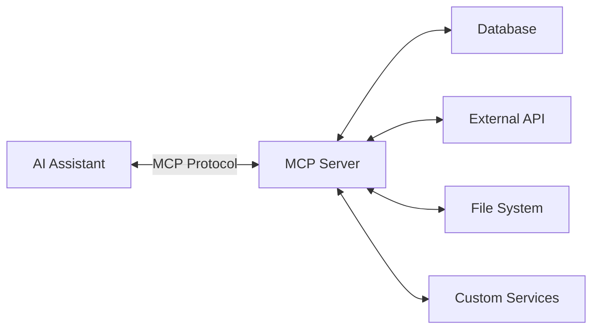

# How to Build an MCP Server in Node.js: A Complete Guide with Best Practices

Author: [nawazdhandala](https://www.github.com/nawazdhandala)

Tags: MCP, Model Context Protocol, NodeJS, TypeScript, AI, Open Source, Tutorial

Description: Learn how to build a production-ready Model Context Protocol (MCP) server in Node.js from scratch. This comprehensive guide covers everything from basic setup to advanced patterns, with extensive code examples and best practices for building robust AI tool integrations.

The Model Context Protocol (MCP) is revolutionizing how AI assistants interact with external systems. Instead of relying solely on their training data, AI models can now securely connect to databases, APIs, and services through MCP servers. In this guide, we'll build a complete MCP server in Node.js from scratch, covering everything you need to know to create production-ready integrations.

## What is the Model Context Protocol?

MCP is an open standard that defines how AI assistants communicate with external tools and data sources. Think of it as a universal adapter that lets AI models:

- **Execute tools**: Perform actions like creating files, querying databases, or calling APIs
- **Access resources**: Read data from files, databases, or external services
- **Receive prompts**: Get context-specific instructions and templates



## Prerequisites

Before we start, ensure you have:

- Node.js 18+ installed
- npm or yarn package manager
- Basic TypeScript knowledge
- An AI assistant that supports MCP (Claude Desktop, VS Code with Claude, etc.)

## Project Setup

Let's create a new MCP server project from scratch.

### Initialize the Project

Start by creating a new directory and installing the required packages. The MCP SDK provides the server framework, while Zod handles input validation with TypeScript-friendly schemas.

```bash
# Create project directory
mkdir my-mcp-server
cd my-mcp-server

# Initialize npm project
npm init -y

# Install dependencies
npm install @modelcontextprotocol/sdk zod

# Install dev dependencies
npm install -D typescript @types/node tsx
```

### Configure TypeScript

Create a `tsconfig.json` file. The Node16 module settings ensure compatibility with ES modules, while strict mode catches potential type errors at compile time.

```json
{
  "compilerOptions": {
    "target": "ES2022",
    "module": "Node16",
    "moduleResolution": "Node16",
    "outDir": "./dist",
    "rootDir": "./src",
    "strict": true,
    "esModuleInterop": true,
    "skipLibCheck": true,
    "forceConsistentCasingInFileNames": true,
    "declaration": true,
    "declarationMap": true,
    "sourceMap": true
  },
  "include": ["src/**/*"],
  "exclude": ["node_modules", "dist"]
}
```

### Update package.json

Configure the package.json with the correct module type and entry points. The `bin` field allows the server to be run as a CLI command after npm installation.

```json
{
  "name": "my-mcp-server",
  "version": "1.0.0",
  "type": "module",
  "main": "dist/index.js",
  "bin": {
    "my-mcp-server": "dist/index.js"
  },
  "scripts": {
    "build": "tsc",
    "start": "node dist/index.js",
    "dev": "tsx src/index.ts",
    "watch": "tsc --watch"
  },
  "dependencies": {
    "@modelcontextprotocol/sdk": "^1.0.0",
    "zod": "^3.22.0"
  },
  "devDependencies": {
    "@types/node": "^20.10.0",
    "tsx": "^4.7.0",
    "typescript": "^5.3.0"
  }
}
```

## Building Your First MCP Server

Let's start with a basic MCP server structure and progressively add features.

### Basic Server Structure

Create `src/index.ts`. This minimal server sets up the MCP protocol with stdio transport (communication via stdin/stdout). The shebang line allows direct execution as a CLI tool.

```typescript
#!/usr/bin/env node
// Shebang for CLI execution - the server communicates via stdin/stdout

import { Server } from "@modelcontextprotocol/sdk/server/index.js";
import { StdioServerTransport } from "@modelcontextprotocol/sdk/server/stdio.js";
import {
  CallToolRequestSchema,
  ListToolsRequestSchema,
  ListResourcesRequestSchema,
  ReadResourceRequestSchema,
  ListPromptsRequestSchema,
  GetPromptRequestSchema,
} from "@modelcontextprotocol/sdk/types.js";

// Create the MCP server instance
const server = new Server(
  {
    name: "my-mcp-server",
    version: "1.0.0",
  },
  {
    capabilities: {
      tools: {},
      resources: {},
      prompts: {},
    },
  }
);

// Initialize and start the server
async function main(): Promise<void> {
  const transport = new StdioServerTransport();
  await server.connect(transport);
  console.error("MCP Server running on stdio");
}

main().catch((error) => {
  console.error("Fatal error:", error);
  process.exit(1);
});
```

## Implementing Tools

Tools are functions that AI assistants can call. Let's implement several practical tools.

### Define Tool Schemas with Zod

Create `src/schemas.ts`. Zod schemas define the expected input format for each tool. The `.describe()` method provides documentation that AI assistants can use to understand how to call each tool correctly.

```typescript
import { z } from "zod";

// Each schema defines the expected input for a tool
// .describe() adds documentation visible to AI assistants

// Schema for a greeting tool
export const GreetingSchema = z.object({
  name: z.string().describe("The name of the person to greet"),
  language: z
    .enum(["en", "es", "fr", "de", "ja"])
    .optional()
    .default("en")
    .describe("The language for the greeting"),
});

// Schema for a calculator tool
export const CalculatorSchema = z.object({
  operation: z
    .enum(["add", "subtract", "multiply", "divide"])
    .describe("The mathematical operation to perform"),
  a: z.number().describe("First number"),
  b: z.number().describe("Second number"),
});

// Schema for HTTP request tool
export const HttpRequestSchema = z.object({
  url: z.string().url().describe("The URL to make the request to"),
  method: z
    .enum(["GET", "POST", "PUT", "DELETE", "PATCH"])
    .optional()
    .default("GET")
    .describe("HTTP method"),
  headers: z
    .record(z.string())
    .optional()
    .describe("HTTP headers as key-value pairs"),
  body: z.string().optional().describe("Request body for POST/PUT/PATCH"),
});

// Schema for file operations
export const FileOperationSchema = z.object({
  operation: z
    .enum(["read", "write", "append", "delete", "exists"])
    .describe("The file operation to perform"),
  path: z.string().describe("Path to the file"),
  content: z
    .string()
    .optional()
    .describe("Content to write (for write/append operations)"),
});

// Schema for database query (example)
export const DatabaseQuerySchema = z.object({
  query: z.string().describe("SQL query to execute"),
  params: z
    .array(z.union([z.string(), z.number(), z.boolean(), z.null()]))
    .optional()
    .describe("Query parameters for prepared statements"),
});

export type Greeting = z.infer<typeof GreetingSchema>;
export type Calculator = z.infer<typeof CalculatorSchema>;
export type HttpRequest = z.infer<typeof HttpRequestSchema>;
export type FileOperation = z.infer<typeof FileOperationSchema>;
export type DatabaseQuery = z.infer<typeof DatabaseQuerySchema>;
```

### Implement Tool Handlers

Create `src/tools.ts`. This file contains both the tool definitions (metadata for AI assistants) and the handler implementations. Each handler validates input using Zod schemas before executing the operation.

```typescript
import { z } from "zod";
import * as fs from "fs/promises";
import * as path from "path";
import {
  GreetingSchema,
  CalculatorSchema,
  HttpRequestSchema,
  FileOperationSchema,
  type Greeting,
  type Calculator,
  type HttpRequest,
  type FileOperation,
} from "./schemas.js";

// Tool definitions for MCP
export const toolDefinitions = [
  {
    name: "greet",
    description:
      "Generate a greeting message in the specified language",
    inputSchema: {
      type: "object" as const,
      properties: {
        name: {
          type: "string",
          description: "The name of the person to greet",
        },
        language: {
          type: "string",
          enum: ["en", "es", "fr", "de", "ja"],
          default: "en",
          description: "The language for the greeting",
        },
      },
      required: ["name"],
    },
  },
  {
    name: "calculate",
    description: "Perform basic mathematical operations",
    inputSchema: {
      type: "object" as const,
      properties: {
        operation: {
          type: "string",
          enum: ["add", "subtract", "multiply", "divide"],
          description: "The mathematical operation to perform",
        },
        a: {
          type: "number",
          description: "First number",
        },
        b: {
          type: "number",
          description: "Second number",
        },
      },
      required: ["operation", "a", "b"],
    },
  },
  {
    name: "http_request",
    description: "Make HTTP requests to external APIs",
    inputSchema: {
      type: "object" as const,
      properties: {
        url: {
          type: "string",
          description: "The URL to make the request to",
        },
        method: {
          type: "string",
          enum: ["GET", "POST", "PUT", "DELETE", "PATCH"],
          default: "GET",
          description: "HTTP method",
        },
        headers: {
          type: "object",
          additionalProperties: { type: "string" },
          description: "HTTP headers as key-value pairs",
        },
        body: {
          type: "string",
          description: "Request body for POST/PUT/PATCH",
        },
      },
      required: ["url"],
    },
  },
  {
    name: "file_operation",
    description: "Perform file system operations",
    inputSchema: {
      type: "object" as const,
      properties: {
        operation: {
          type: "string",
          enum: ["read", "write", "append", "delete", "exists"],
          description: "The file operation to perform",
        },
        path: {
          type: "string",
          description: "Path to the file",
        },
        content: {
          type: "string",
          description: "Content to write (for write/append operations)",
        },
      },
      required: ["operation", "path"],
    },
  },
];

// Greeting implementations for different languages
const greetings: Record<string, (name: string) => string> = {
  en: (name) => `Hello, ${name}! Welcome!`,
  es: (name) => `¡Hola, ${name}! ¡Bienvenido!`,
  fr: (name) => `Bonjour, ${name}! Bienvenue!`,
  de: (name) => `Hallo, ${name}! Willkommen!`,
  ja: (name) => `こんにちは、${name}さん！ようこそ！`,
};

// Tool handler implementations
export async function handleGreet(args: unknown): Promise<string> {
  const validated = GreetingSchema.parse(args);
  const greetFn = greetings[validated.language] || greetings.en;
  return greetFn(validated.name);
}

export async function handleCalculate(args: unknown): Promise<string> {
  const validated = CalculatorSchema.parse(args);
  let result: number;

  switch (validated.operation) {
    case "add":
      result = validated.a + validated.b;
      break;
    case "subtract":
      result = validated.a - validated.b;
      break;
    case "multiply":
      result = validated.a * validated.b;
      break;
    case "divide":
      if (validated.b === 0) {
        throw new Error("Division by zero is not allowed");
      }
      result = validated.a / validated.b;
      break;
    default:
      throw new Error(`Unknown operation: ${validated.operation}`);
  }

  return `${validated.a} ${validated.operation} ${validated.b} = ${result}`;
}

export async function handleHttpRequest(args: unknown): Promise<string> {
  const validated = HttpRequestSchema.parse(args);

  const fetchOptions: RequestInit = {
    method: validated.method,
    headers: validated.headers,
  };

  if (validated.body && ["POST", "PUT", "PATCH"].includes(validated.method)) {
    fetchOptions.body = validated.body;
  }

  try {
    const response = await fetch(validated.url, fetchOptions);
    const contentType = response.headers.get("content-type") || "";

    let body: string;
    if (contentType.includes("application/json")) {
      const json = await response.json();
      body = JSON.stringify(json, null, 2);
    } else {
      body = await response.text();
    }

    return JSON.stringify(
      {
        status: response.status,
        statusText: response.statusText,
        headers: Object.fromEntries(response.headers.entries()),
        body: body,
      },
      null,
      2
    );
  } catch (error) {
    throw new Error(
      `HTTP request failed: ${error instanceof Error ? error.message : String(error)}`
    );
  }
}

export async function handleFileOperation(args: unknown): Promise<string> {
  const validated = FileOperationSchema.parse(args);
  const filePath = path.resolve(validated.path);

  // Security: Prevent directory traversal
  const allowedBasePath = process.cwd();
  if (!filePath.startsWith(allowedBasePath)) {
    throw new Error("Access denied: Path is outside allowed directory");
  }

  switch (validated.operation) {
    case "read": {
      const content = await fs.readFile(filePath, "utf-8");
      return content;
    }
    case "write": {
      if (!validated.content) {
        throw new Error("Content is required for write operation");
      }
      await fs.writeFile(filePath, validated.content, "utf-8");
      return `Successfully wrote ${validated.content.length} characters to ${validated.path}`;
    }
    case "append": {
      if (!validated.content) {
        throw new Error("Content is required for append operation");
      }
      await fs.appendFile(filePath, validated.content, "utf-8");
      return `Successfully appended ${validated.content.length} characters to ${validated.path}`;
    }
    case "delete": {
      await fs.unlink(filePath);
      return `Successfully deleted ${validated.path}`;
    }
    case "exists": {
      try {
        await fs.access(filePath);
        return `File exists: ${validated.path}`;
      } catch {
        return `File does not exist: ${validated.path}`;
      }
    }
    default:
      throw new Error(`Unknown operation: ${validated.operation}`);
  }
}

// Main tool dispatcher
export async function handleTool(
  name: string,
  args: unknown
): Promise<string> {
  switch (name) {
    case "greet":
      return handleGreet(args);
    case "calculate":
      return handleCalculate(args);
    case "http_request":
      return handleHttpRequest(args);
    case "file_operation":
      return handleFileOperation(args);
    default:
      throw new Error(`Unknown tool: ${name}`);
  }
}
```

### Register Tools with the Server

Update `src/index.ts` to register the tool handlers. The `setRequestHandler` method maps MCP protocol requests to your handler functions. Tool errors are returned as results (not thrown) so the AI can understand what went wrong.

```typescript
#!/usr/bin/env node
// Register tool handlers with the MCP server
// Errors are returned as results so AI assistants can handle them gracefully

import { Server } from "@modelcontextprotocol/sdk/server/index.js";
import { StdioServerTransport } from "@modelcontextprotocol/sdk/server/stdio.js";
import {
  CallToolRequestSchema,
  ListToolsRequestSchema,
  ErrorCode,
  McpError,
} from "@modelcontextprotocol/sdk/types.js";
import { toolDefinitions, handleTool } from "./tools.js";

const server = new Server(
  {
    name: "my-mcp-server",
    version: "1.0.0",
  },
  {
    capabilities: {
      tools: {},
    },
  }
);

// Handler: List available tools
server.setRequestHandler(ListToolsRequestSchema, async () => {
  return {
    tools: toolDefinitions,
  };
});

// Handler: Execute a tool
server.setRequestHandler(CallToolRequestSchema, async (request) => {
  const { name, arguments: args } = request.params;

  try {
    const result = await handleTool(name, args);
    return {
      content: [
        {
          type: "text",
          text: result,
        },
      ],
    };
  } catch (error) {
    const message = error instanceof Error ? error.message : String(error);

    // Return error as tool result (not throwing)
    return {
      content: [
        {
          type: "text",
          text: `Error: ${message}`,
        },
      ],
      isError: true,
    };
  }
});

async function main(): Promise<void> {
  const transport = new StdioServerTransport();
  await server.connect(transport);
  console.error("MCP Server running on stdio");
}

main().catch((error) => {
  console.error("Fatal error:", error);
  process.exit(1);
});
```

## Implementing Resources

Resources allow AI assistants to read data from your server. Let's add resource support.

### Create Resource Handlers

Create `src/resources.ts`. Resources are read-only data sources that AI assistants can query. Unlike tools, resources don't perform actions - they just return data. The URI scheme (config://, data://, file://) helps categorize different resource types.

```typescript
import * as fs from "fs/promises";
import * as path from "path";

// Define available resources
export interface ResourceDefinition {
  uri: string;
  name: string;
  description: string;
  mimeType: string;
}

// Static resource definitions
export const resourceDefinitions: ResourceDefinition[] = [
  {
    uri: "config://app/settings",
    name: "Application Settings",
    description: "Current application configuration settings",
    mimeType: "application/json",
  },
  {
    uri: "data://users/list",
    name: "User List",
    description: "List of all registered users",
    mimeType: "application/json",
  },
  {
    uri: "file://readme",
    name: "README",
    description: "Project README file",
    mimeType: "text/markdown",
  },
];

// Mock data for demonstration
const mockSettings = {
  appName: "My MCP Server",
  version: "1.0.0",
  environment: "development",
  features: {
    logging: true,
    metrics: true,
    rateLimit: {
      enabled: true,
      maxRequests: 100,
      windowMs: 60000,
    },
  },
  database: {
    host: "localhost",
    port: 5432,
    name: "myapp",
  },
};

const mockUsers = [
  { id: 1, name: "Alice", email: "alice@example.com", role: "admin" },
  { id: 2, name: "Bob", email: "bob@example.com", role: "user" },
  { id: 3, name: "Charlie", email: "charlie@example.com", role: "user" },
];

// Resource content handlers
export async function getResourceContent(uri: string): Promise<string> {
  switch (uri) {
    case "config://app/settings":
      return JSON.stringify(mockSettings, null, 2);

    case "data://users/list":
      return JSON.stringify(mockUsers, null, 2);

    case "file://readme": {
      try {
        const readmePath = path.join(process.cwd(), "README.md");
        return await fs.readFile(readmePath, "utf-8");
      } catch {
        return "# My MCP Server\n\nNo README file found.";
      }
    }

    default:
      throw new Error(`Resource not found: ${uri}`);
  }
}

// Dynamic resource listing (for file-based resources)
export async function listDynamicResources(): Promise<ResourceDefinition[]> {
  const dynamicResources: ResourceDefinition[] = [];

  try {
    const dataDir = path.join(process.cwd(), "data");
    const files = await fs.readdir(dataDir);

    for (const file of files) {
      if (file.endsWith(".json")) {
        dynamicResources.push({
          uri: `file://data/${file}`,
          name: file,
          description: `Data file: ${file}`,
          mimeType: "application/json",
        });
      }
    }
  } catch {
    // Data directory doesn't exist, that's okay
  }

  return dynamicResources;
}
```

### Register Resources with the Server

Update `src/index.ts` to include resources. Resources can be static (predefined) or dynamic (discovered at runtime, like files in a directory). The server combines both types when listing available resources.

```typescript
#!/usr/bin/env node
// Add resource handlers for read-only data access
// Resources are listed and read separately from tools

import { Server } from "@modelcontextprotocol/sdk/server/index.js";
import { StdioServerTransport } from "@modelcontextprotocol/sdk/server/stdio.js";
import {
  CallToolRequestSchema,
  ListToolsRequestSchema,
  ListResourcesRequestSchema,
  ReadResourceRequestSchema,
  ErrorCode,
  McpError,
} from "@modelcontextprotocol/sdk/types.js";
import { toolDefinitions, handleTool } from "./tools.js";
import {
  resourceDefinitions,
  getResourceContent,
  listDynamicResources,
} from "./resources.js";

const server = new Server(
  {
    name: "my-mcp-server",
    version: "1.0.0",
  },
  {
    capabilities: {
      tools: {},
      resources: {},
    },
  }
);

// Tool handlers (from before)
server.setRequestHandler(ListToolsRequestSchema, async () => ({
  tools: toolDefinitions,
}));

server.setRequestHandler(CallToolRequestSchema, async (request) => {
  const { name, arguments: args } = request.params;
  try {
    const result = await handleTool(name, args);
    return {
      content: [{ type: "text", text: result }],
    };
  } catch (error) {
    return {
      content: [
        { type: "text", text: `Error: ${error instanceof Error ? error.message : String(error)}` },
      ],
      isError: true,
    };
  }
});

// Resource handlers
server.setRequestHandler(ListResourcesRequestSchema, async () => {
  const dynamicResources = await listDynamicResources();
  return {
    resources: [...resourceDefinitions, ...dynamicResources],
  };
});

server.setRequestHandler(ReadResourceRequestSchema, async (request) => {
  const { uri } = request.params;

  try {
    const content = await getResourceContent(uri);
    const resource = resourceDefinitions.find((r) => r.uri === uri);

    return {
      contents: [
        {
          uri,
          mimeType: resource?.mimeType || "text/plain",
          text: content,
        },
      ],
    };
  } catch (error) {
    throw new McpError(
      ErrorCode.InvalidRequest,
      `Failed to read resource: ${error instanceof Error ? error.message : String(error)}`
    );
  }
});

async function main(): Promise<void> {
  const transport = new StdioServerTransport();
  await server.connect(transport);
  console.error("MCP Server running on stdio");
}

main().catch((error) => {
  console.error("Fatal error:", error);
  process.exit(1);
});
```

## Implementing Prompts

Prompts provide reusable templates that AI assistants can use. Let's add prompt support.

### Create Prompt Handlers

Create `src/prompts.ts`. Prompts are reusable templates that AI assistants can invoke with arguments. They're useful for standardizing complex tasks like code reviews, bug reports, or incident response workflows.

```typescript
// Prompts provide reusable templates for common tasks
// The AI fills in the arguments and receives a formatted prompt

export interface PromptDefinition {
  name: string;
  description: string;
  arguments?: Array<{
    name: string;
    description: string;
    required?: boolean;
  }>;
}

export const promptDefinitions: PromptDefinition[] = [
  {
    name: "code_review",
    description: "Generate a code review prompt for the given code",
    arguments: [
      {
        name: "language",
        description: "Programming language of the code",
        required: true,
      },
      {
        name: "code",
        description: "The code to review",
        required: true,
      },
    ],
  },
  {
    name: "bug_report",
    description: "Generate a structured bug report template",
    arguments: [
      {
        name: "title",
        description: "Brief title of the bug",
        required: true,
      },
      {
        name: "severity",
        description: "Bug severity (low, medium, high, critical)",
        required: false,
      },
    ],
  },
  {
    name: "api_documentation",
    description: "Generate API documentation template",
    arguments: [
      {
        name: "endpoint",
        description: "API endpoint path",
        required: true,
      },
      {
        name: "method",
        description: "HTTP method (GET, POST, PUT, DELETE)",
        required: true,
      },
    ],
  },
  {
    name: "incident_response",
    description: "Generate an incident response checklist",
    arguments: [
      {
        name: "severity",
        description: "Incident severity level",
        required: true,
      },
      {
        name: "service",
        description: "Affected service name",
        required: true,
      },
    ],
  },
];

export interface PromptMessage {
  role: "user" | "assistant";
  content: {
    type: "text";
    text: string;
  };
}

export function generatePrompt(
  name: string,
  args: Record<string, string>
): PromptMessage[] {
  switch (name) {
    case "code_review":
      return [
        {
          role: "user",
          content: {
            type: "text",
            text: `Please review the following ${args.language} code for:

1. **Code Quality**: Is the code clean, readable, and well-structured?
2. **Best Practices**: Does it follow ${args.language} best practices and conventions?
3. **Performance**: Are there any performance concerns or optimizations needed?
4. **Security**: Are there any security vulnerabilities or concerns?
5. **Error Handling**: Is error handling comprehensive and appropriate?
6. **Testing**: Is the code testable? What tests would you recommend?

Code to review:
\`\`\`${args.language}
${args.code}
\`\`\`

Please provide specific, actionable feedback with code examples where appropriate.`,
          },
        },
      ];

    case "bug_report":
      return [
        {
          role: "user",
          content: {
            type: "text",
            text: `Please help me create a detailed bug report with the following structure:

## Bug Report: ${args.title}

### Severity
${args.severity || "To be determined"}

### Description
[Provide a clear, concise description of the bug]

### Steps to Reproduce
1. [First step]
2. [Second step]
3. [Third step]

### Expected Behavior
[What should happen]

### Actual Behavior
[What actually happens]

### Environment
- OS: [Operating System]
- Browser/Runtime: [Version]
- App Version: [Version]

### Screenshots/Logs
[Attach relevant screenshots or log output]

### Additional Context
[Any other relevant information]

Please fill in the bracketed sections with appropriate information.`,
          },
        },
      ];

    case "api_documentation":
      return [
        {
          role: "user",
          content: {
            type: "text",
            text: `Please help me document the following API endpoint:

## ${args.method} ${args.endpoint}

### Description
[Brief description of what this endpoint does]

### Authentication
[Required authentication method]

### Request

#### Headers
| Header | Type | Required | Description |
|--------|------|----------|-------------|
| Authorization | string | Yes | Bearer token |

#### Parameters
| Parameter | Type | Required | Description |
|-----------|------|----------|-------------|
| [param] | [type] | [yes/no] | [description] |

#### Request Body
\`\`\`json
{
  "example": "value"
}
\`\`\`

### Response

#### Success Response (200)
\`\`\`json
{
  "success": true,
  "data": {}
}
\`\`\`

#### Error Responses
| Status | Description |
|--------|-------------|
| 400 | Bad Request |
| 401 | Unauthorized |
| 404 | Not Found |
| 500 | Internal Server Error |

### Examples

#### cURL
\`\`\`bash
curl -X ${args.method} "${args.endpoint}" \\
  -H "Authorization: Bearer <token>"
\`\`\`

Please fill in the template with specific details for this endpoint.`,
          },
        },
      ];

    case "incident_response":
      return [
        {
          role: "user",
          content: {
            type: "text",
            text: `## Incident Response Checklist

**Service:** ${args.service}
**Severity:** ${args.severity}
**Time Detected:** [Current timestamp]

### Immediate Actions (First 15 minutes)

- [ ] Acknowledge the incident
- [ ] Assess impact scope
- [ ] Notify on-call team
- [ ] Create incident channel/war room
- [ ] Begin investigation

### Communication

- [ ] Post initial status update
- [ ] Notify affected stakeholders
- [ ] Update status page (if public-facing)
- [ ] Schedule regular update intervals

### Investigation

- [ ] Check monitoring dashboards
- [ ] Review recent deployments
- [ ] Examine logs for errors
- [ ] Check infrastructure metrics
- [ ] Identify root cause

### Mitigation

- [ ] Implement temporary fix if available
- [ ] Consider rollback if deployment-related
- [ ] Scale resources if capacity issue
- [ ] Engage additional teams if needed

### Resolution

- [ ] Confirm service restoration
- [ ] Verify with affected users
- [ ] Document timeline of events
- [ ] Schedule post-mortem

### Post-Incident

- [ ] Complete post-mortem document
- [ ] Identify action items
- [ ] Update runbooks
- [ ] Share learnings with team

Please use this checklist to guide the incident response for the ${args.service} ${args.severity} incident.`,
          },
        },
      ];

    default:
      throw new Error(`Unknown prompt: ${name}`);
  }
}
```

### Register Prompts with the Server

Update `src/index.ts` to include prompts. This final version includes all three MCP capabilities: tools, resources, and prompts. The capabilities object tells AI assistants what features this server supports.

```typescript
#!/usr/bin/env node
// Complete MCP server with tools, resources, and prompts
// Each capability is enabled in the server configuration

import { Server } from "@modelcontextprotocol/sdk/server/index.js";
import { StdioServerTransport } from "@modelcontextprotocol/sdk/server/stdio.js";
import {
  CallToolRequestSchema,
  ListToolsRequestSchema,
  ListResourcesRequestSchema,
  ReadResourceRequestSchema,
  ListPromptsRequestSchema,
  GetPromptRequestSchema,
  ErrorCode,
  McpError,
} from "@modelcontextprotocol/sdk/types.js";
import { toolDefinitions, handleTool } from "./tools.js";
import {
  resourceDefinitions,
  getResourceContent,
  listDynamicResources,
} from "./resources.js";
import { promptDefinitions, generatePrompt } from "./prompts.js";

const server = new Server(
  {
    name: "my-mcp-server",
    version: "1.0.0",
  },
  {
    capabilities: {
      tools: {},
      resources: {},
      prompts: {},
    },
  }
);

// Tool handlers
server.setRequestHandler(ListToolsRequestSchema, async () => ({
  tools: toolDefinitions,
}));

server.setRequestHandler(CallToolRequestSchema, async (request) => {
  const { name, arguments: args } = request.params;
  try {
    const result = await handleTool(name, args);
    return {
      content: [{ type: "text", text: result }],
    };
  } catch (error) {
    return {
      content: [
        {
          type: "text",
          text: `Error: ${error instanceof Error ? error.message : String(error)}`,
        },
      ],
      isError: true,
    };
  }
});

// Resource handlers
server.setRequestHandler(ListResourcesRequestSchema, async () => {
  const dynamicResources = await listDynamicResources();
  return {
    resources: [...resourceDefinitions, ...dynamicResources],
  };
});

server.setRequestHandler(ReadResourceRequestSchema, async (request) => {
  const { uri } = request.params;
  try {
    const content = await getResourceContent(uri);
    const resource = resourceDefinitions.find((r) => r.uri === uri);
    return {
      contents: [
        {
          uri,
          mimeType: resource?.mimeType || "text/plain",
          text: content,
        },
      ],
    };
  } catch (error) {
    throw new McpError(
      ErrorCode.InvalidRequest,
      `Failed to read resource: ${error instanceof Error ? error.message : String(error)}`
    );
  }
});

// Prompt handlers
server.setRequestHandler(ListPromptsRequestSchema, async () => ({
  prompts: promptDefinitions,
}));

server.setRequestHandler(GetPromptRequestSchema, async (request) => {
  const { name, arguments: args } = request.params;

  try {
    const messages = generatePrompt(name, args || {});
    return {
      description: promptDefinitions.find((p) => p.name === name)?.description,
      messages,
    };
  } catch (error) {
    throw new McpError(
      ErrorCode.InvalidRequest,
      `Failed to generate prompt: ${error instanceof Error ? error.message : String(error)}`
    );
  }
});

async function main(): Promise<void> {
  const transport = new StdioServerTransport();
  await server.connect(transport);
  console.error("MCP Server running on stdio");
}

main().catch((error) => {
  console.error("Fatal error:", error);
  process.exit(1);
});
```

## Best Practices

### 1. Input Validation

Always validate inputs using a schema library like Zod. This prevents malformed data from causing errors and provides clear error messages to AI assistants when they call tools with invalid arguments.

```typescript
import { z } from "zod";

// Define strict schemas
const CreateUserSchema = z.object({
  email: z.string().email("Invalid email format"),
  name: z.string().min(1, "Name is required").max(100, "Name too long"),
  age: z.number().int().min(0).max(150).optional(),
  role: z.enum(["admin", "user", "guest"]).default("user"),
});

// Validate before processing
export async function handleCreateUser(args: unknown): Promise<string> {
  const validated = CreateUserSchema.parse(args);
  // Now `validated` is fully typed and safe to use
  return `Created user: ${validated.email}`;
}
```

### 2. Error Handling

Implement comprehensive error handling with meaningful messages. Custom error classes help categorize failures, and the wrapper function ensures errors are logged for debugging while returning user-friendly messages to the AI.

```typescript
import { McpError, ErrorCode } from "@modelcontextprotocol/sdk/types.js";

// Custom error classes for different scenarios
class ValidationError extends Error {
  constructor(message: string) {
    super(message);
    this.name = "ValidationError";
  }
}

class NotFoundError extends Error {
  constructor(resource: string) {
    super(`Resource not found: ${resource}`);
    this.name = "NotFoundError";
  }
}

class RateLimitError extends Error {
  constructor(retryAfter: number) {
    super(`Rate limit exceeded. Retry after ${retryAfter} seconds`);
    this.name = "RateLimitError";
  }
}

// Error handler wrapper
async function safeToolHandler(
  handler: () => Promise<string>
): Promise<{ content: Array<{ type: string; text: string }>; isError?: boolean }> {
  try {
    const result = await handler();
    return {
      content: [{ type: "text", text: result }],
    };
  } catch (error) {
    let message: string;
    let isError = true;

    if (error instanceof z.ZodError) {
      message = `Validation error: ${error.errors.map((e) => e.message).join(", ")}`;
    } else if (error instanceof NotFoundError) {
      message = error.message;
    } else if (error instanceof RateLimitError) {
      message = error.message;
    } else if (error instanceof Error) {
      message = error.message;
    } else {
      message = "An unexpected error occurred";
    }

    // Log error for debugging (goes to stderr, not to AI)
    console.error(`Tool error: ${message}`, error);

    return {
      content: [{ type: "text", text: `Error: ${message}` }],
      isError,
    };
  }
}
```

### 3. Security Considerations

Implement security measures to protect your MCP server. Path traversal prevention stops directory escape attacks, rate limiting prevents abuse, and input sanitization protects against injection attacks.

```typescript
import * as path from "path";
import * as crypto from "crypto";

// Prevent path traversal attacks
function sanitizePath(userPath: string, basePath: string): string {
  const resolved = path.resolve(basePath, userPath);
  if (!resolved.startsWith(basePath)) {
    throw new Error("Access denied: Path traversal detected");
  }
  return resolved;
}

// Rate limiting implementation
class RateLimiter {
  private requests: Map<string, number[]> = new Map();
  private readonly maxRequests: number;
  private readonly windowMs: number;

  constructor(maxRequests: number = 100, windowMs: number = 60000) {
    this.maxRequests = maxRequests;
    this.windowMs = windowMs;
  }

  check(identifier: string): boolean {
    const now = Date.now();
    const windowStart = now - this.windowMs;

    const requests = this.requests.get(identifier) || [];
    const recentRequests = requests.filter((time) => time > windowStart);

    if (recentRequests.length >= this.maxRequests) {
      return false;
    }

    recentRequests.push(now);
    this.requests.set(identifier, recentRequests);
    return true;
  }
}

// Input sanitization for SQL-like operations
function sanitizeInput(input: string): string {
  // Remove or escape potentially dangerous characters
  return input
    .replace(/['";\\]/g, "")
    .replace(/--/g, "")
    .trim();
}

// API key validation
function validateApiKey(key: string | undefined): boolean {
  if (!key) return false;
  // Check key format and length
  return /^[a-zA-Z0-9_-]{32,64}$/.test(key);
}
```

### 4. Logging and Observability

Add structured logging for debugging and monitoring. Logs go to stderr (not stdout) because the MCP protocol uses stdout for communication. Structured JSON logs make it easy to search and analyze issues.

```typescript
// Structured logging for MCP servers
// IMPORTANT: Use stderr for logs - stdout is reserved for MCP protocol messages

enum LogLevel {
  DEBUG = 0,
  INFO = 1,
  WARN = 2,
  ERROR = 3,
}

interface LogEntry {
  timestamp: string;
  level: string;
  message: string;
  context?: Record<string, unknown>;
}

class Logger {
  private minLevel: LogLevel;

  constructor(minLevel: LogLevel = LogLevel.INFO) {
    this.minLevel = minLevel;
  }

  private log(level: LogLevel, levelName: string, message: string, context?: Record<string, unknown>): void {
    if (level < this.minLevel) return;

    const entry: LogEntry = {
      timestamp: new Date().toISOString(),
      level: levelName,
      message,
      context,
    };

    // Output to stderr so it doesn't interfere with MCP protocol on stdout
    console.error(JSON.stringify(entry));
  }

  debug(message: string, context?: Record<string, unknown>): void {
    this.log(LogLevel.DEBUG, "DEBUG", message, context);
  }

  info(message: string, context?: Record<string, unknown>): void {
    this.log(LogLevel.INFO, "INFO", message, context);
  }

  warn(message: string, context?: Record<string, unknown>): void {
    this.log(LogLevel.WARN, "WARN", message, context);
  }

  error(message: string, context?: Record<string, unknown>): void {
    this.log(LogLevel.ERROR, "ERROR", message, context);
  }
}

const logger = new Logger(LogLevel.DEBUG);

// Usage in tool handlers
export async function handleToolWithLogging(
  name: string,
  args: unknown
): Promise<string> {
  const startTime = Date.now();
  logger.info("Tool invoked", { tool: name, args });

  try {
    const result = await handleTool(name, args);
    const duration = Date.now() - startTime;
    logger.info("Tool completed", { tool: name, duration, success: true });
    return result;
  } catch (error) {
    const duration = Date.now() - startTime;
    logger.error("Tool failed", {
      tool: name,
      duration,
      error: error instanceof Error ? error.message : String(error),
    });
    throw error;
  }
}
```

### 5. Configuration Management

Use environment variables and configuration files. Zod validates configuration at startup, catching misconfiguration early. Default values ensure the server works out of the box while allowing customization.

```typescript
import { z } from "zod";

// Configuration schema with validation and defaults
// Environment variables override defaults for deployment flexibility

// Configuration schema
const ConfigSchema = z.object({
  // Server settings
  serverName: z.string().default("my-mcp-server"),
  serverVersion: z.string().default("1.0.0"),

  // Feature flags
  enableTools: z.boolean().default(true),
  enableResources: z.boolean().default(true),
  enablePrompts: z.boolean().default(true),

  // Security settings
  rateLimitMaxRequests: z.number().int().positive().default(100),
  rateLimitWindowMs: z.number().int().positive().default(60000),
  allowedPaths: z.array(z.string()).default([process.cwd()]),

  // External service settings
  apiBaseUrl: z.string().url().optional(),
  apiKey: z.string().optional(),
  apiTimeout: z.number().int().positive().default(30000),

  // Logging
  logLevel: z.enum(["debug", "info", "warn", "error"]).default("info"),
});

type Config = z.infer<typeof ConfigSchema>;

// Load configuration from environment
function loadConfig(): Config {
  const rawConfig = {
    serverName: process.env.MCP_SERVER_NAME,
    serverVersion: process.env.MCP_SERVER_VERSION,
    enableTools: process.env.MCP_ENABLE_TOOLS === "true",
    enableResources: process.env.MCP_ENABLE_RESOURCES === "true",
    enablePrompts: process.env.MCP_ENABLE_PROMPTS === "true",
    rateLimitMaxRequests: process.env.MCP_RATE_LIMIT_MAX
      ? parseInt(process.env.MCP_RATE_LIMIT_MAX)
      : undefined,
    rateLimitWindowMs: process.env.MCP_RATE_LIMIT_WINDOW
      ? parseInt(process.env.MCP_RATE_LIMIT_WINDOW)
      : undefined,
    apiBaseUrl: process.env.MCP_API_BASE_URL,
    apiKey: process.env.MCP_API_KEY,
    logLevel: process.env.MCP_LOG_LEVEL,
  };

  // Remove undefined values
  const cleanConfig = Object.fromEntries(
    Object.entries(rawConfig).filter(([_, v]) => v !== undefined)
  );

  return ConfigSchema.parse(cleanConfig);
}

export const config = loadConfig();
```

### 6. Graceful Shutdown

Handle shutdown signals properly to clean up resources and prevent data loss. SIGINT (Ctrl+C) and SIGTERM (kill command) should both trigger graceful shutdown. Uncaught exceptions and unhandled promise rejections should be logged before exiting.

```typescript
// Graceful shutdown with proper cleanup
// Handle SIGINT, SIGTERM, and uncaught errors

async function main(): Promise<void> {
  const transport = new StdioServerTransport();
  await server.connect(transport);

  logger.info("MCP Server started", {
    name: config.serverName,
    version: config.serverVersion,
  });

  // Handle graceful shutdown
  const shutdown = async (signal: string): Promise<void> => {
    logger.info("Shutdown signal received", { signal });

    try {
      // Perform cleanup
      await server.close();
      logger.info("Server closed gracefully");
      process.exit(0);
    } catch (error) {
      logger.error("Error during shutdown", {
        error: error instanceof Error ? error.message : String(error),
      });
      process.exit(1);
    }
  };

  process.on("SIGINT", () => shutdown("SIGINT"));
  process.on("SIGTERM", () => shutdown("SIGTERM"));

  // Handle uncaught errors
  process.on("uncaughtException", (error) => {
    logger.error("Uncaught exception", { error: error.message });
    process.exit(1);
  });

  process.on("unhandledRejection", (reason) => {
    logger.error("Unhandled rejection", {
      reason: reason instanceof Error ? reason.message : String(reason),
    });
    process.exit(1);
  });
}
```

## Testing Your MCP Server

### Unit Tests

Create `src/__tests__/tools.test.ts`. Unit tests verify individual tool handlers work correctly with valid and invalid inputs. Using Vitest (or Jest) makes it easy to test async handlers and verify error conditions.

```typescript
import { describe, it, expect } from "vitest";
import {
  handleGreet,
  handleCalculate,
  handleFileOperation,
} from "../tools.js";

describe("Tool Handlers", () => {
  describe("handleGreet", () => {
    it("should greet in English by default", async () => {
      const result = await handleGreet({ name: "World" });
      expect(result).toBe("Hello, World! Welcome!");
    });

    it("should greet in Spanish", async () => {
      const result = await handleGreet({ name: "Mundo", language: "es" });
      expect(result).toBe("¡Hola, Mundo! ¡Bienvenido!");
    });

    it("should throw on invalid input", async () => {
      await expect(handleGreet({})).rejects.toThrow();
    });
  });

  describe("handleCalculate", () => {
    it("should add numbers", async () => {
      const result = await handleCalculate({
        operation: "add",
        a: 5,
        b: 3,
      });
      expect(result).toBe("5 add 3 = 8");
    });

    it("should prevent division by zero", async () => {
      await expect(
        handleCalculate({ operation: "divide", a: 10, b: 0 })
      ).rejects.toThrow("Division by zero");
    });
  });
});
```

### Integration Testing

Create a test script `scripts/test-server.ts`. Integration tests spawn the actual server process and communicate via the MCP protocol, verifying end-to-end functionality including serialization and transport.

```typescript
// Integration test that spawns the server and sends MCP protocol messages
// Tests the full request/response cycle over stdio

import { spawn } from "child_process";

interface MCPRequest {
  jsonrpc: "2.0";
  id: number;
  method: string;
  params?: Record<string, unknown>;
}

interface MCPResponse {
  jsonrpc: "2.0";
  id: number;
  result?: unknown;
  error?: {
    code: number;
    message: string;
  };
}

async function testMCPServer(): Promise<void> {
  const server = spawn("npx", ["tsx", "src/index.ts"], {
    stdio: ["pipe", "pipe", "pipe"],
  });

  const sendRequest = (request: MCPRequest): Promise<MCPResponse> => {
    return new Promise((resolve, reject) => {
      const timeout = setTimeout(() => {
        reject(new Error("Request timeout"));
      }, 5000);

      const handler = (data: Buffer): void => {
        clearTimeout(timeout);
        server.stdout.off("data", handler);
        const response = JSON.parse(data.toString());
        resolve(response);
      };

      server.stdout.on("data", handler);
      server.stdin.write(JSON.stringify(request) + "\n");
    });
  };

  try {
    // Test listing tools
    console.log("Testing tools/list...");
    const toolsResponse = await sendRequest({
      jsonrpc: "2.0",
      id: 1,
      method: "tools/list",
    });
    console.log("Tools:", JSON.stringify(toolsResponse.result, null, 2));

    // Test calling a tool
    console.log("\nTesting tools/call (greet)...");
    const greetResponse = await sendRequest({
      jsonrpc: "2.0",
      id: 2,
      method: "tools/call",
      params: {
        name: "greet",
        arguments: {
          name: "MCP Tester",
          language: "en",
        },
      },
    });
    console.log("Greet result:", JSON.stringify(greetResponse.result, null, 2));

    // Test listing resources
    console.log("\nTesting resources/list...");
    const resourcesResponse = await sendRequest({
      jsonrpc: "2.0",
      id: 3,
      method: "resources/list",
    });
    console.log("Resources:", JSON.stringify(resourcesResponse.result, null, 2));

    console.log("\nAll tests passed!");
  } catch (error) {
    console.error("Test failed:", error);
  } finally {
    server.kill();
  }
}

testMCPServer();
```

## Configuring AI Assistants

### Claude Desktop Configuration

Create or edit `~/Library/Application Support/Claude/claude_desktop_config.json` (macOS) or `%APPDATA%\Claude\claude_desktop_config.json` (Windows). This tells Claude Desktop how to launch your MCP server and what environment variables to pass.

```json
{
  "mcpServers": {
    "my-mcp-server": {
      "command": "node",
      "args": ["/path/to/my-mcp-server/dist/index.js"],
      "env": {
        "MCP_LOG_LEVEL": "info",
        "MCP_API_KEY": "your-api-key-here"
      }
    }
  }
}
```

### VS Code with Claude Extension

Add to your VS Code settings. Using `npx -y` downloads and runs the server if it's published to npm, making it easy for other developers to use your server without manual installation.

```json
{
  "claude.mcpServers": {
    "my-mcp-server": {
      "command": "npx",
      "args": ["-y", "my-mcp-server"],
      "env": {
        "MCP_LOG_LEVEL": "debug"
      }
    }
  }
}
```

## Publishing Your MCP Server

### Prepare for npm Publishing

Update `package.json` with publishing metadata. The `files` array specifies which files to include in the npm package. The `prepublishOnly` script ensures the project is built before publishing.

```json
{
  "name": "@yourorg/my-mcp-server",
  "version": "1.0.0",
  "description": "A custom MCP server for AI assistants",
  "type": "module",
  "main": "dist/index.js",
  "bin": {
    "my-mcp-server": "dist/index.js"
  },
  "files": [
    "dist",
    "README.md",
    "LICENSE"
  ],
  "scripts": {
    "build": "tsc",
    "prepublishOnly": "npm run build",
    "start": "node dist/index.js"
  },
  "keywords": [
    "mcp",
    "model-context-protocol",
    "ai",
    "claude",
    "llm"
  ],
  "author": "Your Name",
  "license": "MIT",
  "repository": {
    "type": "git",
    "url": "https://github.com/yourorg/my-mcp-server"
  }
}
```

### Build and Publish

Once your server is ready, build and publish it to npm so others can use it with `npx` or by installing it globally.

```bash
# Build the project
npm run build

# Login to npm
npm login

# Publish
npm publish --access public
```

## Complete Project Structure

Here's the final project structure:

```
my-mcp-server/
├── src/
│   ├── index.ts          # Main server entry point
│   ├── tools.ts          # Tool definitions and handlers
│   ├── resources.ts      # Resource definitions and handlers
│   ├── prompts.ts        # Prompt definitions and generators
│   ├── schemas.ts        # Zod validation schemas
│   ├── config.ts         # Configuration management
│   ├── logger.ts         # Logging utilities
│   └── __tests__/
│       └── tools.test.ts # Unit tests
├── scripts/
│   └── test-server.ts    # Integration test script
├── package.json
├── tsconfig.json
├── README.md
└── LICENSE
```

## Conclusion

Building an MCP server in Node.js opens up powerful possibilities for integrating AI assistants with your systems and services. By following the patterns and best practices in this guide, you can create robust, secure, and maintainable MCP servers that enhance AI capabilities.

Key takeaways:

1. **Use TypeScript** for type safety and better developer experience
2. **Validate all inputs** with Zod or similar schema validation
3. **Implement comprehensive error handling** with meaningful messages
4. **Add security measures** like rate limiting and path sanitization
5. **Log everything** for debugging and monitoring
6. **Test thoroughly** with unit and integration tests
7. **Handle shutdown gracefully** to prevent data loss

The MCP ecosystem is rapidly evolving, and building custom servers allows you to tailor AI interactions to your specific needs. Whether you're integrating with internal APIs, databases, or custom services, the patterns shown here will help you build production-ready MCP servers.

---

**Related Reading:**

- [Introducing OneUptime MCP Server: Bringing AI-Native Observability to Your Workflow](https://oneuptime.com/blog/post/2025-07-01-oneuptime-mcp-server-ai-observability/view)
- [What are Traces and Spans in OpenTelemetry: A Practical Guide](https://oneuptime.com/blog/post/2025-08-27-traces-and-spans-in-opentelemetry/view)
- [Why 'AI content = Bad' is a flawed mindset](https://oneuptime.com/blog/post/2025-09-05-why-ai-content-bad-is-a-flawed-mindset/view)
