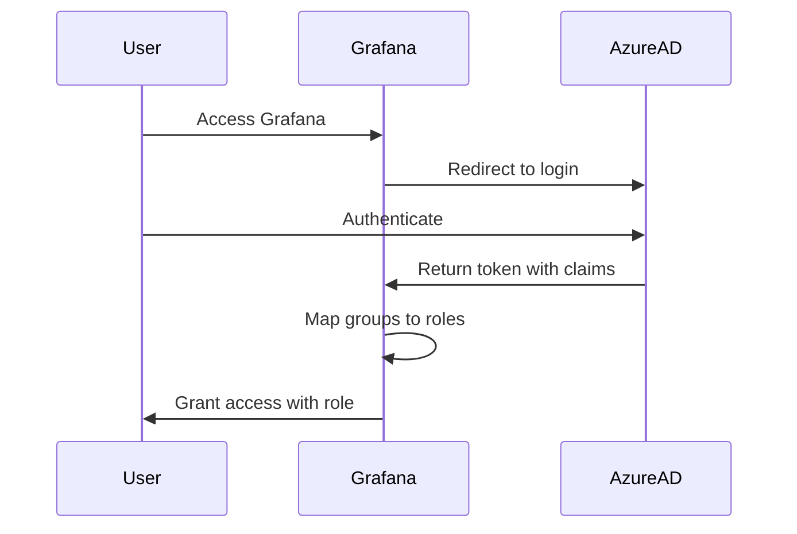

# How to Configure Azure AD OAuth Roles in Grafana

Author: [nawazdhandala](https://www.github.com/nawazdhandala)

Tags: Grafana, Azure AD, OAuth, Authentication, Security

Description: Learn how to configure Azure AD OAuth with role mapping in Grafana to enable single sign-on with automatic role assignment based on Azure AD groups.

---

Configuring Azure AD OAuth for Grafana enables enterprise single sign-on while automatically assigning Grafana roles based on Azure AD group membership. This guide walks through the complete setup from Azure app registration to Grafana configuration.

## Understanding the Authentication Flow

Before diving into configuration, understanding how the authentication flow works helps troubleshoot issues later.



## 1. Create Azure AD App Registration

Start by creating an app registration in Azure AD that Grafana will use for authentication.

Navigate to Azure Portal > Azure Active Directory > App registrations > New registration.

Configure the registration with these settings:

```
Name: Grafana SSO
Supported account types: Accounts in this organizational directory only
Redirect URI: https://grafana.example.com/login/azuread
```

After creation, note down the Application (client) ID and Directory (tenant) ID from the Overview page.

## 2. Create a Client Secret

Navigate to Certificates & secrets > New client secret.

```
Description: Grafana OAuth Secret
Expires: 24 months (or per your security policy)
```

Copy the secret value immediately - it will not be shown again.

## 3. Configure API Permissions

Grafana needs specific permissions to read user profiles and group memberships.

Navigate to API permissions > Add a permission > Microsoft Graph.

Add these delegated permissions:

```
- openid
- email
- profile
- User.Read
- GroupMember.Read.All (for group-based role mapping)
```

Click "Grant admin consent" for your organization to apply these permissions.

## 4. Configure Token Claims

To include group information in the token, configure optional claims.

Navigate to Token configuration > Add groups claim.

```yaml
# Select these options:
Group types: Security groups
ID token claims:
  - Group ID
Access token claims:
  - Group ID
```

For large organizations with many groups, use group filtering to include only relevant groups.

## 5. Create Azure AD Groups for Grafana Roles

Create security groups in Azure AD that map to Grafana roles.

```
Group Name                    | Grafana Role
-----------------------------|-------------
Grafana-Admins               | Admin
Grafana-Editors              | Editor
Grafana-Viewers              | Viewer
```

Note the Object ID of each group - you will need these for Grafana configuration.

```bash
# Using Azure CLI to list groups
az ad group list --display-name "Grafana" --query "[].{name:displayName, id:id}" -o table
```

## 6. Configure Grafana for Azure AD OAuth

Add the Azure AD OAuth configuration to your Grafana configuration file.

`/etc/grafana/grafana.ini`

```ini
[server]
root_url = https://grafana.example.com/

[auth.azuread]
enabled = true
name = Azure AD
allow_sign_up = true
auto_login = false
client_id = YOUR_APPLICATION_CLIENT_ID
client_secret = YOUR_CLIENT_SECRET
scopes = openid email profile
auth_url = https://login.microsoftonline.com/YOUR_TENANT_ID/oauth2/v2.0/authorize
token_url = https://login.microsoftonline.com/YOUR_TENANT_ID/oauth2/v2.0/token
allowed_domains = example.com
allowed_groups =
role_attribute_path = contains(groups[*], 'ADMIN_GROUP_ID') && 'Admin' || contains(groups[*], 'EDITOR_GROUP_ID') && 'Editor' || 'Viewer'
role_attribute_strict = true
allow_assign_grafana_admin = true
skip_org_role_sync = false
```

Replace the placeholder values:

```
YOUR_APPLICATION_CLIENT_ID  -> Application (client) ID from Azure
YOUR_CLIENT_SECRET          -> Client secret value
YOUR_TENANT_ID              -> Directory (tenant) ID from Azure
ADMIN_GROUP_ID              -> Object ID of Grafana-Admins group
EDITOR_GROUP_ID             -> Object ID of Grafana-Editors group
```

## 7. Understanding Role Attribute Path

The `role_attribute_path` uses JMESPath expressions to evaluate group membership and assign roles.

```ini
# Basic role mapping
role_attribute_path = contains(groups[*], 'abc123-admin-group-id') && 'Admin' || contains(groups[*], 'def456-editor-group-id') && 'Editor' || 'Viewer'
```

For more complex scenarios with organization-specific roles:

```ini
# Map to org-specific roles
role_attribute_path = contains(groups[*], 'abc123') && 'GrafanaAdmin' || contains(groups[*], 'def456') && 'Admin' || contains(groups[*], 'ghi789') && 'Editor' || 'Viewer'
```

## 8. Kubernetes Deployment with Helm

When deploying Grafana via Helm, configure Azure AD OAuth in values.yaml.

`values.yaml`

```yaml
grafana.ini:
  server:
    root_url: https://grafana.example.com/
  auth.azuread:
    enabled: true
    name: Azure AD
    allow_sign_up: true
    auto_login: false
    client_id: ${AZURE_CLIENT_ID}
    client_secret: ${AZURE_CLIENT_SECRET}
    scopes: openid email profile
    auth_url: https://login.microsoftonline.com/${AZURE_TENANT_ID}/oauth2/v2.0/authorize
    token_url: https://login.microsoftonline.com/${AZURE_TENANT_ID}/oauth2/v2.0/token
    allowed_domains: example.com
    role_attribute_path: contains(groups[*], '${GRAFANA_ADMIN_GROUP}') && 'Admin' || contains(groups[*], '${GRAFANA_EDITOR_GROUP}') && 'Editor' || 'Viewer'
    role_attribute_strict: true
    allow_assign_grafana_admin: true

envFromSecret: grafana-azure-secrets
```

Create a Kubernetes secret with the sensitive values:

```bash
kubectl create secret generic grafana-azure-secrets \
  --from-literal=AZURE_CLIENT_ID=your-client-id \
  --from-literal=AZURE_CLIENT_SECRET=your-client-secret \
  --from-literal=AZURE_TENANT_ID=your-tenant-id \
  --from-literal=GRAFANA_ADMIN_GROUP=admin-group-object-id \
  --from-literal=GRAFANA_EDITOR_GROUP=editor-group-object-id \
  -n monitoring
```

## 9. Verify the Configuration

Restart Grafana and test the authentication:

```bash
# For systemd installations
sudo systemctl restart grafana-server

# For Kubernetes
kubectl rollout restart deployment grafana -n monitoring
```

Check the Grafana logs for OAuth-related messages:

```bash
# Systemd
journalctl -u grafana-server -f | grep -i azure

# Kubernetes
kubectl logs -f deployment/grafana -n monitoring | grep -i azure
```

## 10. Troubleshooting Common Issues

### Token Does Not Contain Groups

If groups are not appearing in the token, verify:

```bash
# Check token claims using jwt.io or Azure AD token decoder
# The 'groups' claim should contain an array of group IDs
```

Ensure:
- GroupMember.Read.All permission is granted
- Admin consent was provided
- User is a member of the groups

### Invalid Redirect URI

The redirect URI must exactly match what is configured in Azure AD:

```
Azure AD: https://grafana.example.com/login/azuread
Grafana root_url: https://grafana.example.com/
```

### Role Not Assigned Correctly

Enable debug logging to see group evaluation:

```ini
[log]
level = debug
filters = auth.azuread:debug
```

Check the logs for group membership arrays:

```
logger=auth.azuread groups=[abc123 def456 ghi789]
```

### Too Many Groups

Azure AD limits the number of groups in a token. For users in many groups:

```yaml
# Use group filtering in Azure AD token configuration
# Or configure Grafana to fetch groups via API
[auth.azuread]
use_pkce = true
```

## 11. Security Best Practices

Configure these additional security settings:

```ini
[auth.azuread]
# Only allow specific domains
allowed_domains = example.com mycompany.com

# Strictly enforce role mapping
role_attribute_strict = true

# Use PKCE for enhanced security
use_pkce = true

# Set token expiry
token_expiry = 8h
```

---

With Azure AD OAuth configured, users can sign in to Grafana using their corporate credentials while Grafana automatically assigns roles based on their Azure AD group membership. This eliminates manual user management and ensures consistent access control across your organization.
