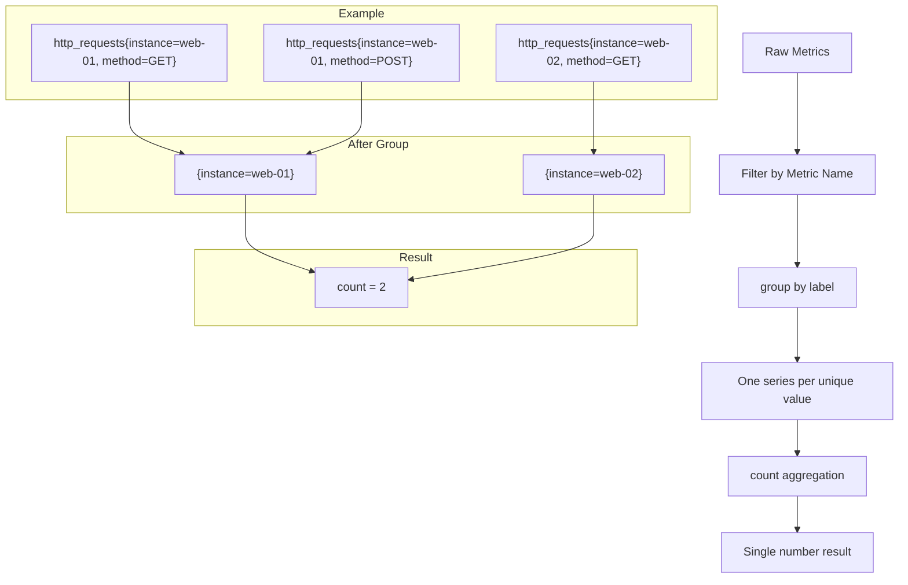

# How to Count Unique Label Values in Prometheus

Author: [nawazdhandala](https://www.github.com/nawazdhandala)

Tags: Prometheus, PromQL, Metrics, Monitoring, Labels, Cardinality, Observability

Description: Learn how to count unique label values in Prometheus using PromQL functions like count, group, and label_values. This guide covers cardinality analysis, label enumeration, and best practices for monitoring label diversity.

---

Prometheus labels provide dimensional data that makes metrics powerful and flexible. However, understanding how many unique values exist for a given label is crucial for cardinality management and query optimization. This guide shows you how to count unique label values using PromQL.

---

## TL;DR

- Use `count(group by (label_name) (metric_name))` to count unique label values
- The `group` function deduplicates time series by label combinations
- Use `label_values()` in Grafana for dropdown variable population
- Monitor cardinality to prevent memory issues in Prometheus
- High cardinality labels can degrade query performance

---

## Why Count Unique Label Values?

Understanding label cardinality helps with several critical tasks:

- **Capacity planning**: High cardinality labels consume more memory
- **Query optimization**: Knowing label distribution helps write efficient queries
- **Data validation**: Verify expected services/instances are reporting
- **Alerting**: Detect when new label values appear unexpectedly
- **Cost management**: Some monitoring platforms charge by cardinality

---

## The Core Technique: group and count

The most reliable way to count unique label values combines `group` and `count`:

```promql
# Count unique values for a specific label
count(group by (instance) (up))
```

This query:
1. Takes the `up` metric
2. Groups by the `instance` label, collapsing duplicates
3. Counts the resulting unique groups

### How group Works

The `group` function creates one time series per unique label combination:

```promql
# Original metric might have multiple series per instance
http_requests_total{instance="web-01", method="GET", status="200"}
http_requests_total{instance="web-01", method="POST", status="201"}
http_requests_total{instance="web-02", method="GET", status="200"}

# After group by (instance):
{instance="web-01"} 1
{instance="web-02"} 1

# After count:
{} 2
```

---

## Practical Examples

### Count Unique Instances

```promql
# How many instances are reporting metrics?
count(group by (instance) (up))

# How many instances per job?
count(group by (instance) (up)) by (job)
```

### Count Unique Services

```promql
# Count unique service names
count(group by (service) (http_requests_total))

# Count services with active traffic in the last hour
count(group by (service) (rate(http_requests_total[1h]) > 0))
```

### Count Unique HTTP Status Codes

```promql
# How many different status codes are being returned?
count(group by (status_code) (http_requests_total))

# Count status codes per endpoint
count(group by (status_code) (http_requests_total)) by (endpoint)
```

### Count Kubernetes Resources

```promql
# Count unique namespaces
count(group by (namespace) (kube_pod_info))

# Count unique pods per namespace
count(group by (pod) (kube_pod_info)) by (namespace)

# Count unique node names
count(group by (node) (kube_node_info))
```

---

## Flow Diagram: How Counting Works

The following diagram illustrates the process of counting unique label values:



---

## Using label_values in Grafana

Grafana provides the `label_values()` function for populating template variables:

```promql
# Get all unique instance values
label_values(up, instance)

# Get instances for a specific job
label_values(up{job="prometheus"}, instance)

# Get all namespaces with pods
label_values(kube_pod_info, namespace)
```

### Setting Up a Grafana Variable

1. Go to Dashboard Settings > Variables
2. Create a new variable with query type
3. Use `label_values(metric, label_name)` as the query
4. Enable multi-value if needed

Example variable configuration:

```
Name: instance
Label: Instance
Query: label_values(node_cpu_seconds_total, instance)
Refresh: On time range change
Sort: Alphabetical (asc)
```

---

## Advanced Counting Techniques

### Count with Conditions

```promql
# Count instances with high CPU usage
count(group by (instance) (
  rate(node_cpu_seconds_total{mode="idle"}[5m]) < 0.1
))

# Count services with error rates above threshold
count(group by (service) (
  rate(http_requests_total{status_code=~"5.."}[5m]) /
  rate(http_requests_total[5m]) > 0.01
))
```

### Count Over Time

```promql
# Track how many instances reported over the last hour
count_over_time(
  count(group by (instance) (up))[1h:5m]
)

# Maximum number of unique pods seen in 24 hours
max_over_time(
  count(group by (pod) (kube_pod_status_phase))[24h:15m]
)
```

### Count Multiple Labels

```promql
# Count unique instance-job combinations
count(group by (instance, job) (up))

# Count unique service-version pairs
count(group by (service, version) (http_requests_total))
```

---

## Cardinality Management

High cardinality can cause performance problems. Monitor it proactively:

### Check Total Cardinality

```promql
# Total number of time series (requires Prometheus 2.x)
prometheus_tsdb_head_series

# Series created per scrape
rate(prometheus_tsdb_head_series_created_total[5m])
```

### Find High Cardinality Labels

```promql
# Count unique values per label across all series
# (Run this for each label you want to analyze)
count(group by (your_label) ({__name__=~".+"}))
```

### Set Cardinality Alerts

```yaml
# Alert when cardinality exceeds threshold
groups:
  - name: cardinality
    rules:
      - alert: HighCardinality
        expr: prometheus_tsdb_head_series > 1000000
        for: 5m
        labels:
          severity: warning
        annotations:
          summary: "High time series cardinality"
          description: "Prometheus has {{ $value }} active time series"
```

---

## Common Patterns and Anti-Patterns

### Good Patterns

```promql
# Efficient: Count at query time
count(group by (instance) (up))

# Efficient: Use specific metric names
count(group by (pod) (kube_pod_info))

# Efficient: Filter before counting
count(group by (instance) (up{job="production"}))
```

### Anti-Patterns to Avoid

```promql
# Inefficient: Counting across all metrics
count(group by (instance) ({__name__=~".+"}))

# Problematic: High cardinality regex matching
count(group by (request_id) (http_requests_total))

# Memory intensive: Too many label combinations
count(group by (instance, method, path, status) (http_requests_total))
```

---

## Recording Rules for Efficiency

For frequently used cardinality queries, create recording rules:

```yaml
groups:
  - name: cardinality_metrics
    interval: 5m
    rules:
      # Count unique instances per job
      - record: job:instances:count
        expr: count(group by (instance) (up)) by (job)

      # Count unique pods per namespace
      - record: namespace:pods:count
        expr: count(group by (pod) (kube_pod_info)) by (namespace)

      # Count unique services
      - record: cluster:services:count
        expr: count(group by (service) (http_requests_total))
```

---

## Conclusion

Counting unique label values in Prometheus is essential for:

- **Cardinality management**: Understanding memory usage implications
- **Query optimization**: Writing efficient PromQL queries
- **Infrastructure visibility**: Knowing what resources are reporting
- **Alert configuration**: Detecting unexpected changes in label diversity

The `count(group by (label) (metric))` pattern is your primary tool. Combine it with recording rules for efficiency and cardinality alerts for proactive monitoring.

Start by analyzing your highest-traffic metrics and work toward a comprehensive understanding of your label landscape.

---

*For more Prometheus and Grafana tips, explore our guides on service latency measurement and histogram visualization.*
