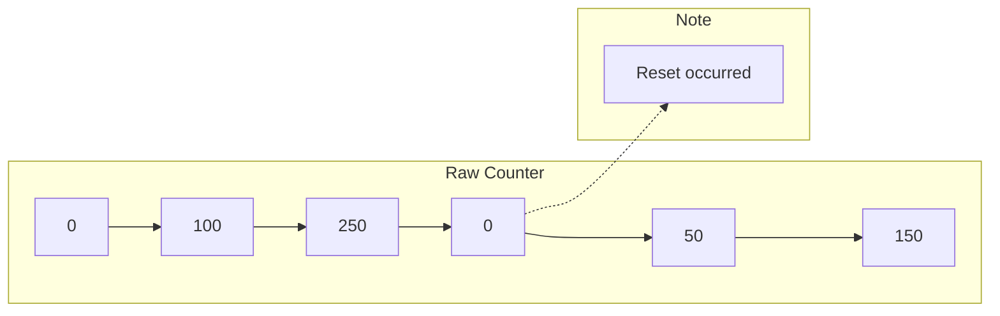
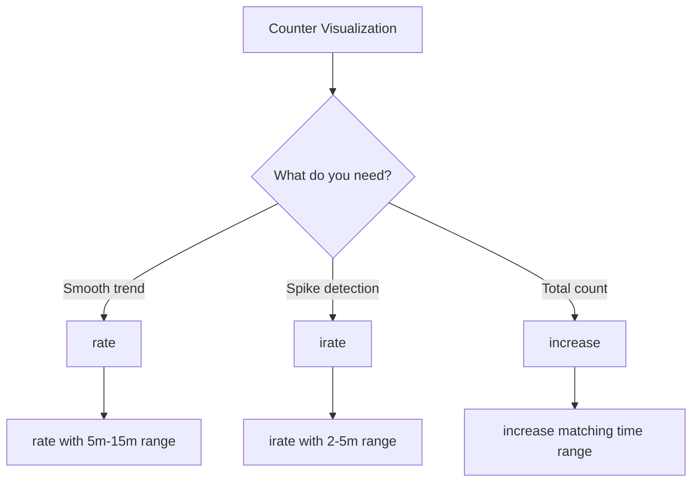

# How to Create Counter Over Time Graph in Prometheus

Author: [nawazdhandala](https://www.github.com/nawazdhandala)

Tags: Prometheus, PromQL, Grafana, Metrics, Counters, Monitoring

Description: Learn how to properly visualize Prometheus counters over time using rate(), increase(), and irate() functions. This guide covers common pitfalls and best practices for counter visualization.

---

Prometheus counters are monotonically increasing metrics that only reset to zero when the process restarts. Visualizing them correctly requires understanding how to convert raw counter values into meaningful rates and increases. This guide shows you how to create effective counter-over-time graphs.

## Understanding Prometheus Counters

Counters have specific characteristics:

- **Monotonically increasing** - Only go up (or reset to 0)
- **Reset on restart** - Drop to zero when process restarts
- **Cumulative** - Show total since process start



### Why Not Graph Raw Counters?

Graphing raw counter values produces misleading visualizations:

```promql
# DON'T DO THIS - raw counter is rarely useful
http_requests_total
```

Problems:
- Ever-increasing line
- Resets appear as dramatic drops
- Values become astronomically large
- No insight into current activity

## The Right Functions for Counters

### rate() - Per-Second Average Rate

The most common function for counters:

```promql
# Requests per second, averaged over 5 minutes
rate(http_requests_total[5m])
```

Key properties:
- Returns per-second rate
- Handles counter resets automatically
- Smooths out spikes
- Extrapolates to time boundaries

### increase() - Total Increase Over Period

Shows the total increase in the counter:

```promql
# Total requests in the last hour
increase(http_requests_total[1h])
```

Key properties:
- Returns absolute increase
- Handles counter resets
- Good for bar charts and totals
- Extrapolates for partial ranges

### irate() - Instant Rate

Calculates rate between last two samples:

```promql
# Instant rate based on last two samples
irate(http_requests_total[5m])
```

Key properties:
- More responsive to spikes
- Noisier visualization
- Good for alerting on sudden changes
- Range vector is minimum lookback

## Choosing the Right Function



| Use Case | Function | Example |
|----------|----------|---------|
| Dashboard trends | `rate()` | `rate(http_requests_total[5m])` |
| Alert on spikes | `irate()` | `irate(http_requests_total[2m])` |
| Daily totals | `increase()` | `increase(http_requests_total[24h])` |
| Error rates | `rate()` | `rate(http_errors_total[5m]) / rate(http_requests_total[5m])` |

## Practical Examples

### Example 1: Request Rate Graph

```promql
# Requests per second by endpoint
sum by (endpoint) (rate(http_requests_total[5m]))
```

Grafana panel configuration:
```json
{
  "type": "timeseries",
  "title": "Request Rate by Endpoint",
  "targets": [
    {
      "expr": "sum by (endpoint) (rate(http_requests_total[5m]))",
      "legendFormat": "{{endpoint}}"
    }
  ],
  "fieldConfig": {
    "defaults": {
      "unit": "reqps",
      "custom": {
        "drawStyle": "line",
        "lineWidth": 2
      }
    }
  }
}
```

### Example 2: Error Rate Percentage

```promql
# Error rate as percentage
100 * sum(rate(http_requests_total{status=~"5.."}[5m]))
    / sum(rate(http_requests_total[5m]))
```

### Example 3: Hourly Request Totals

For bar chart visualization:

```promql
# Total requests per hour
sum(increase(http_requests_total[1h]))
```

Configure with bar chart and align time axis to hours.

### Example 4: Comparing Current to Previous Period

```promql
# Current hour vs same hour yesterday
sum(increase(http_requests_total[1h]))
/
sum(increase(http_requests_total[1h] offset 24h))
```

## Handling Counter Resets

Prometheus automatically detects resets in `rate()`, `irate()`, and `increase()`:

```promql
# This handles resets correctly
rate(http_requests_total[5m])

# If you need to see actual resets (for debugging)
resets(http_requests_total[1h])
```

## Common Mistakes and Fixes

### Mistake 1: Using Raw Counter Values

```promql
# Wrong - shows ever-increasing line
http_requests_total

# Correct - shows rate of change
rate(http_requests_total[5m])
```

### Mistake 2: Range Too Short for rate()

```promql
# Wrong - may miss samples if scrape interval is 15s
rate(http_requests_total[15s])

# Correct - at least 4x scrape interval
rate(http_requests_total[1m])
```

Rule of thumb: Range should be at least 4 times your scrape interval.

### Mistake 3: Mixing rate() with sum() Incorrectly

```promql
# Wrong - rate of sum doesn't work
rate(sum(http_requests_total)[5m])

# Correct - sum of rate
sum(rate(http_requests_total[5m]))
```

### Mistake 4: Using increase() with Short Ranges

```promql
# Potentially wrong - may not capture full interval
increase(http_requests_total[1m])

# Better for dashboards
increase(http_requests_total[$__interval])
```

## Advanced Patterns

### Per-Second to Per-Minute Conversion

```promql
# Convert rate (per-second) to per-minute
rate(http_requests_total[5m]) * 60
```

### Stacked Area Chart for Traffic Distribution

```promql
# Requests by method, good for stacked visualization
sum by (method) (rate(http_requests_total[5m]))
```

Panel configuration:
```json
{
  "fieldConfig": {
    "defaults": {
      "custom": {
        "drawStyle": "line",
        "fillOpacity": 50,
        "stacking": {
          "mode": "normal"
        }
      }
    }
  }
}
```

### Cumulative Sum Within Time Range

Show cumulative progress throughout the day:

```promql
# Cumulative requests today (approximation)
sum_over_time(
  sum(increase(http_requests_total[1m]))[1d:1m]
)
```

### Moving Average of Counter Rate

```promql
# 1-hour moving average of request rate
avg_over_time(
  sum(rate(http_requests_total[5m]))[1h:5m]
)
```

## Recording Rules for Performance

Create recording rules for frequently used counter calculations:

```yaml
groups:
  - name: counter_rates
    interval: 30s
    rules:
      # Request rate by job
      - record: job:http_requests:rate5m
        expr: sum by (job) (rate(http_requests_total[5m]))

      # Error rate by job
      - record: job:http_errors:rate5m
        expr: sum by (job) (rate(http_requests_total{status=~"5.."}[5m]))

      # Error percentage by job
      - record: job:http_error_percentage:rate5m
        expr: |
          100 * job:http_errors:rate5m
          / job:http_requests:rate5m
```

Use in dashboards:
```promql
# Much faster than calculating on the fly
job:http_requests:rate5m{job="api-server"}
```

## Complete Dashboard Panel Examples

### Panel 1: Request Rate Time Series

```json
{
  "title": "Request Rate",
  "type": "timeseries",
  "targets": [
    {
      "expr": "sum(rate(http_requests_total{job=\"api\"}[5m]))",
      "legendFormat": "Total"
    },
    {
      "expr": "sum by (status) (rate(http_requests_total{job=\"api\"}[5m]))",
      "legendFormat": "{{status}}"
    }
  ],
  "fieldConfig": {
    "defaults": {
      "unit": "reqps",
      "decimals": 2
    }
  }
}
```

### Panel 2: Daily Request Totals (Bar Chart)

```json
{
  "title": "Daily Requests",
  "type": "barchart",
  "targets": [
    {
      "expr": "sum(increase(http_requests_total{job=\"api\"}[$__interval]))",
      "legendFormat": "Requests"
    }
  ],
  "interval": "1d",
  "fieldConfig": {
    "defaults": {
      "unit": "short",
      "decimals": 0
    }
  }
}
```

### Panel 3: Error Budget Burn

```json
{
  "title": "Error Rate",
  "type": "timeseries",
  "targets": [
    {
      "expr": "sum(rate(http_requests_total{status=~\"5..\"}[5m])) / sum(rate(http_requests_total[5m])) * 100",
      "legendFormat": "Error %"
    }
  ],
  "fieldConfig": {
    "defaults": {
      "unit": "percent",
      "thresholds": {
        "steps": [
          {"color": "green", "value": null},
          {"color": "yellow", "value": 1},
          {"color": "red", "value": 5}
        ]
      }
    }
  }
}
```

## Troubleshooting

### No Data or Gaps

1. Check scrape interval vs range:
```promql
# If scrape_interval is 15s, use at least 1m range
rate(my_counter[1m])
```

2. Verify counter exists:
```promql
# Check raw counter
my_counter
```

### Unexpected Spikes

Counter resets can cause spikes. Debug with:
```promql
# See reset count
resets(my_counter[1h])
```

### Values Seem Too Low

Check if using correct aggregation:
```promql
# Sum across all instances
sum(rate(http_requests_total[5m]))

# vs single instance
rate(http_requests_total[5m])
```

## Summary

Creating effective counter-over-time graphs in Prometheus requires:

1. **Never graph raw counters** - Use `rate()`, `increase()`, or `irate()`
2. **Choose the right function**:
   - `rate()` for smooth trends
   - `irate()` for spike detection
   - `increase()` for totals
3. **Set appropriate ranges** - At least 4x scrape interval for `rate()`
4. **Aggregate correctly** - `sum(rate())` not `rate(sum())`
5. **Use recording rules** - Pre-compute frequently used rates

With these techniques, your counter visualizations will accurately represent system behavior and provide actionable insights.
