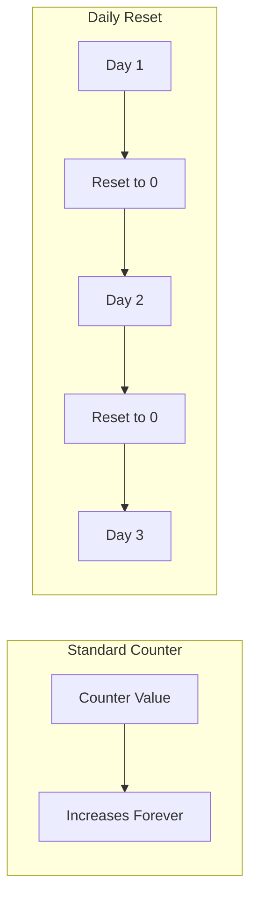

# How to Create Cumulative Function That Resets Daily in Grafana

Author: [nawazdhandala](https://www.github.com/nawazdhandala)

Tags: Grafana, Prometheus, PromQL, Metrics, Data Visualization

Description: Learn how to create cumulative sum visualizations in Grafana that reset at the start of each day. This guide covers PromQL techniques, Grafana transformations, and practical use cases for daily accumulating metrics.

---

Creating cumulative metrics that reset daily is a common requirement for tracking daily quotas, usage limits, or progress toward daily goals. While Prometheus counters are inherently cumulative, getting them to reset at midnight requires specific techniques. This guide shows you multiple approaches to achieve daily-resetting cumulative functions in Grafana.

## Use Cases for Daily Cumulative Metrics

- **API usage tracking**: Cumulative API calls resetting at midnight
- **Billing metrics**: Daily accumulated costs or resource usage
- **Quota monitoring**: Progress toward daily rate limits
- **Order counts**: Running total of daily orders
- **Error budgets**: Accumulated errors resetting each day

## Understanding the Challenge

Prometheus counters are monotonically increasing and only reset when the process restarts. There is no built-in "reset at midnight" functionality.



## Method 1: Using increase() with Time Alignment

The `increase()` function calculates the increase over a time range. By aligning to day boundaries, we can create daily cumulative sums.

### Basic Daily Increase

```promql
# Total increase since start of day
increase(http_requests_total[1d])
```

However, `increase()` gives a single value, not a running cumulative. For a running sum, combine with `sum_over_time`:

### Running Cumulative with Subqueries

```promql
# Running cumulative that effectively resets daily
# This calculates increase for each 5-minute interval and sums them
sum_over_time(
  increase(http_requests_total[5m])[1d:5m]
)
```

## Method 2: Grafana Transformations

Grafana's transformation engine provides more flexible options.

### Step 1: Query Instantaneous Rate

Create a base query that returns the rate per interval:

```promql
# Query A: Rate per minute
increase(http_requests_total[1m])
```

### Step 2: Add Cumulative Sum Transformation

1. Go to the **Transform** tab
2. Add **Add field from calculation**
3. Mode: **Cumulative functions**
4. Function: **Cumulative sum**

This creates a cumulative sum that naturally resets when a new day begins (if you set your time range to "Today so far").

### Step 3: Configure Time Range

Set the dashboard time range to "Today so far" to ensure the cumulative sum starts fresh each day.

## Method 3: Using resets() and Conditional Logic

For counters that genuinely reset, use the `resets()` function:

```promql
# Number of times the counter reset
resets(my_counter_total[1d])
```

To handle resets while maintaining a cumulative view:

```promql
# Increase accounting for resets
increase(my_counter_total[1d]) +
(resets(my_counter_total[1d]) * (my_counter_total offset 1d))
```

## Method 4: Recording Rules for Pre-computed Daily Sums

Create recording rules that compute daily running totals:

```yaml
groups:
  - name: daily_cumulative
    interval: 1m
    rules:
      # Store the value at start of day
      - record: job:http_requests:day_start
        expr: |
          http_requests_total
          and on()
          hour(vector(time())) == 0
          and on()
          minute(vector(time())) < 1

      # Calculate cumulative since start of day
      - record: job:http_requests:daily_cumulative
        expr: |
          http_requests_total -
          (job:http_requests:day_start or http_requests_total offset 1d)
```

## Method 5: Using Floor Function for Day Alignment

Align metrics to day boundaries using time functions:

```promql
# Get seconds since start of day
time() - (floor(time() / 86400) * 86400)

# Use this to calculate daily cumulative
increase(http_requests_total[
  (time() - floor(time() / 86400) * 86400)s
])
```

Note: This approach has limitations with variable time ranges in Grafana.

## Practical Implementation Example

### Dashboard Variable Setup

Create variables for flexible time handling:

```
# Variable: $day_start
# Query: floor(now() / 86400) * 86400
```

### Complete Panel Configuration

**Query:**
```promql
# Running sum of API calls today
sum(
  increase(api_requests_total{endpoint="/api/v1/users"}[5m])
) by (method)
```

**Transformations:**
1. Prepare time series > Multi-frame
2. Add field from calculation > Cumulative sum

**Panel Settings:**
```json
{
  "type": "timeseries",
  "title": "Daily API Calls (Cumulative)",
  "fieldConfig": {
    "defaults": {
      "custom": {
        "drawStyle": "line",
        "lineWidth": 2,
        "fillOpacity": 20,
        "gradientMode": "scheme"
      },
      "unit": "short",
      "decimals": 0
    }
  }
}
```

## Using Gauge Visualization for Daily Progress

For quota/limit tracking, a gauge works well:

### Query for Daily Progress

```promql
# Current daily usage vs limit
(
  sum(increase(api_requests_total[1d]))
  /
  10000  # Daily limit
) * 100
```

### Gauge Configuration

```json
{
  "type": "gauge",
  "options": {
    "reduceOptions": {
      "calcs": ["lastNotNull"]
    },
    "showThresholdLabels": true,
    "showThresholdMarkers": true
  },
  "fieldConfig": {
    "defaults": {
      "unit": "percent",
      "min": 0,
      "max": 100,
      "thresholds": {
        "steps": [
          {"color": "green", "value": null},
          {"color": "yellow", "value": 70},
          {"color": "red", "value": 90}
        ]
      }
    }
  }
}
```

## Time Zone Considerations

Daily resets should align with your business time zone:

### Dashboard Time Zone Setting

1. Dashboard Settings > Time options
2. Set Timezone to your local time zone

### Query with Time Zone Offset

```promql
# Adjust for timezone (e.g., UTC-5 for EST)
increase(http_requests_total[
  ((time() + 18000) % 86400)s
])
```

## Advanced: Multi-Day Comparison

Show cumulative progress compared to previous days:

```promql
# Today's cumulative (Query A)
sum(increase(orders_total[1d]))

# Yesterday at same time (Query B)
sum(increase(orders_total[1d] offset 1d))

# Last week same day (Query C)
sum(increase(orders_total[1d] offset 7d))
```

With transformations:
1. Outer join on time
2. Rename fields for clarity

## Dashboard Example: Daily Order Tracker

```json
{
  "dashboard": {
    "title": "Daily Order Tracker",
    "panels": [
      {
        "title": "Cumulative Orders Today",
        "type": "stat",
        "targets": [
          {
            "expr": "sum(increase(orders_total[1d]))",
            "legendFormat": "Orders"
          }
        ],
        "fieldConfig": {
          "defaults": {
            "unit": "short",
            "decimals": 0
          }
        }
      },
      {
        "title": "Order Progress",
        "type": "timeseries",
        "targets": [
          {
            "expr": "sum(increase(orders_total[5m]))",
            "legendFormat": "Orders"
          }
        ],
        "transformations": [
          {
            "id": "calculateField",
            "options": {
              "mode": "cumulativeTotal"
            }
          }
        ]
      },
      {
        "title": "Daily Target Progress",
        "type": "gauge",
        "targets": [
          {
            "expr": "sum(increase(orders_total[1d])) / 1000 * 100",
            "legendFormat": "Progress"
          }
        ]
      }
    ]
  }
}
```

## Troubleshooting Common Issues

| Issue | Cause | Solution |
|-------|-------|----------|
| Cumulative doesn't reset | Time range not set to "Today" | Set time range to "Today so far" |
| Missing data at midnight | Scrape gap during reset calculation | Use `increase()` with longer range |
| Timezone mismatch | Dashboard/server timezone different | Explicitly set dashboard timezone |
| Gaps in cumulative line | Missing samples | Use `increase()` with larger window |

## Summary

Creating daily-resetting cumulative functions in Grafana requires:

1. **Use `increase()` function** - Calculate change over time periods
2. **Apply Grafana transformations** - Cumulative sum transformation builds running totals
3. **Set appropriate time ranges** - "Today so far" ensures daily reset behavior
4. **Consider recording rules** - Pre-compute daily metrics for performance
5. **Handle time zones** - Align reset time with business requirements

These techniques enable powerful daily progress tracking for quotas, usage monitoring, and business KPIs that need to start fresh each day.
