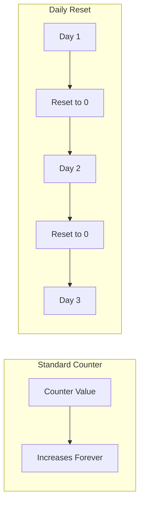

# How to Create Cumulative Function That Resets Daily in Grafana

Author: [nawazdhandala](https://www.github.com/nawazdhandala)

Tags: Grafana, Prometheus, PromQL, Metric, Data Visualization

Description: Learn how to create cumulative sum visualizations in Grafana that reset at the start of each day.

---

Creating cumulative metrics that reset daily is a common requirement for tracking daily quotas, usage limits, or progress toward daily goals. While Prometheus counters are inherently cumulative, making the visualization start again at midnight requires specific techniques. This guide shows you multiple approaches to achieve daily-resetting cumulative functions in Grafana.

## Use Cases for Daily Cumulative Metrics

- **API usage tracking**: Cumulative API calls resetting at midnight
- **Billing metrics**: Daily accumulated costs or resource usage
- **Quota monitoring**: Progress toward daily rate limits
- **Order counts**: Running total of daily orders
- **Error budgets**: Accumulated errors resetting each day

## Understanding the Challenge

Prometheus counters are monotonically increasing and only reset when the process restarts. There is no built-in "reset at midnight" functionality.


```mermaid
flowchart LR
    subgraph Standard Counter
        A[Counter Value] --> B[Increases Forever]
    end
    subgraph Daily Reset
        C[Day 1] --> D[Reset to 0]
        D --> E[Day 2] --> F[Reset to 0]
        F --> G[Day 3]
    end
```

## Method 1: Using increase() with Time Alignment

The `increase()` function calculates the increase over a time range. In Grafana, use it with a dashboard range that starts at the day boundary, such as "Today so far", to create daily totals.

### Basic Daily Increase

```promql
# Total increase over the selected Grafana time range

increase(http_requests_total[$__range])
```

With the Grafana time range set to "Today so far", `$__range` covers the current day so far. A fixed selector like `[1d]` means the last 24 hours, not necessarily the current calendar day.

However, `increase()` gives a single value for each evaluation point, not a running cumulative from the start of the panel range. For a rolling 24-hour sum, you can combine it with `sum_over_time`:

### Running Cumulative with Subqueries

```promql
# Rolling 24-hour cumulative increase
# This calculates increase for each 5-minute interval and sums them
sum_over_time(
  increase(http_requests_total[5m])[1d:5m]
)
```

## Method 2: Grafana Transformations

Grafana's transformation engine provides more flexible options.

### Step 1: Query Interval Increase

Create a base query that returns the increase per interval:

```promql
# Query A: Increase per minute
increase(http_requests_total[1m])
```

### Step 2: Add Cumulative Sum Transformation

1. Go to the **Transform** tab
2. Add **Add field from calculation**
3. Mode: **Cumulative functions**
4. Function: **Total**

This creates a cumulative sum that naturally resets when a new day begins (if you set your time range to "Today so far").

### Step 3: Configure Time Range

Set the dashboard time range to "Today so far" to ensure the cumulative sum starts fresh each day.

## Method 3: Using resets() and Conditional Logic

For counters that genuinely reset, use the `resets()` function:

```promql
# Number of times the counter reset
resets(my_counter_total[$__range])
```

To handle resets while maintaining a cumulative view, use `increase()` directly because it already adjusts for counter resets:

```promql
# Increase accounting for resets
increase(my_counter_total[$__range])
```

## Method 4: Recording Rules for Pre-computed Rates

Create recording rules that pre-compute reset-aware rates or short-window increases, then use the recorded series with Grafana's "Today so far" time range and cumulative sum transformation:

```yaml
groups:
  - name: daily_cumulative
    interval: 1m
    rules:
      # Pre-compute a reset-aware per-second rate
      - record: job:http_requests:rate1m
        expr: |
          sum by (job) (rate(http_requests_total[1m]))

      # Store the approximate increase per rule interval
      - record: job:http_requests:increase1m
        expr: |
          job:http_requests:rate1m * 60
```

## Method 5: Using Floor Function for Day Alignment

Align metrics to day boundaries using time functions:

```promql
# Get seconds since start of day
time() - (floor(time() / 86400) * 86400)
```

Note: PromQL does not allow dynamic expressions inside range vector brackets, so you cannot directly use the computed seconds-since-midnight as a range duration. Instead, use `increase()` with Grafana's `$__range` variable and the "Today so far" time range setting to achieve daily alignment.

## Practical Implementation Example

### Dashboard Time Range Setup

Configure the panel or dashboard time range so the first data point is midnight in the dashboard time zone:

```text
# From: now/d
# To: now
```

### Complete Panel Configuration

**Query:**
```promql
# Running sum of API calls today
sum(
  increase(api_requests_total{endpoint="/api/v1/users"}[5m])
) by (method)
```

**Transformations:**
1. Prepare time series > Multi-frame
2. Add field from calculation > Cumulative functions > Total

**Panel Settings:**
```json
{
  "type": "timeseries",
  "title": "Daily API Calls (Cumulative)",
  "fieldConfig": {
    "defaults": {
      "custom": {
        "drawStyle": "line",
        "lineWidth": 2,
        "fillOpacity": 20,
        "gradientMode": "scheme"
      },
      "unit": "short",
      "decimals": 0
    }
  }
}
```

## Using Gauge Visualization for Daily Progress

For quota/limit tracking, a gauge works well:

### Query for Daily Progress

```promql
# Current daily usage vs limit
(
  sum(increase(api_requests_total[$__range]))
  /
  10000  # Daily limit
) * 100
```

### Gauge Configuration

```json
{
  "type": "gauge",
  "options": {
    "reduceOptions": {
      "calcs": ["lastNotNull"]
    },
    "showThresholdLabels": true,
    "showThresholdMarkers": true
  },
  "fieldConfig": {
    "defaults": {
      "unit": "percent",
      "min": 0,
      "max": 100,
      "thresholds": {
        "steps": [
          {"color": "green", "value": null},
          {"color": "yellow", "value": 70},
          {"color": "red", "value": 90}
        ]
      }
    }
  }
}
```

## Time Zone Considerations

Daily resets should align with your business time zone:

### Dashboard Time Zone Setting

1. Dashboard Settings > Time options
2. Set Timezone to your local time zone

### Query with Time Zone Offset

```promql
# Set the Grafana dashboard timezone instead of trying to offset in PromQL.
# offset shifts the selected samples; it does not make [1d] mean "local calendar day".
increase(http_requests_total[$__range])
```

## Advanced: Multi-Day Comparison

Show cumulative progress compared to previous days:

```promql
# Today's cumulative (Query A)
sum(increase(orders_total[$__range]))

# Yesterday at same time (Query B)
sum(increase(orders_total[$__range] offset 1d))

# Last week same day (Query C)
sum(increase(orders_total[$__range] offset 7d))
```

With transformations:
1. Outer join on time
2. Rename fields for clarity

## Dashboard Example: Daily Order Tracker

```json
{
  "dashboard": {
    "title": "Daily Order Tracker",
    "panels": [
      {
        "title": "Cumulative Orders Today",
        "type": "stat",
        "targets": [
          {
            "expr": "sum(increase(orders_total[$__range]))",
            "legendFormat": "Orders"
          }
        ],
        "fieldConfig": {
          "defaults": {
            "unit": "short",
            "decimals": 0
          }
        }
      },
      {
        "title": "Order Progress",
        "type": "timeseries",
        "targets": [
          {
            "expr": "sum(increase(orders_total[5m]))",
            "legendFormat": "Orders"
          }
        ],
        "transformations": [
          {
            "id": "calculateField",
            "options": {
              "mode": "cumulativeFunctions",
              "cumulative": {
                "reducer": "sum"
              }
            }
          }
        ]
      },
      {
        "title": "Daily Target Progress",
        "type": "gauge",
        "targets": [
          {
            "expr": "sum(increase(orders_total[$__range])) / 1000 * 100",
            "legendFormat": "Progress"
          }
        ]
      }
    ]
  }
}
```

## Troubleshooting Common Issues

| Issue | Cause | Solution |
|-------|-------|----------|
| Cumulative doesn't reset | Time range not set to "Today" | Set time range to "Today so far" |
| Missing data at midnight | Scrape gap during reset calculation | Use `increase()` with longer range |
| Timezone mismatch | Dashboard/server timezone different | Explicitly set dashboard timezone |
| Gaps in cumulative line | Missing samples | Use `increase()` with larger window |

## Summary

Creating daily-resetting cumulative functions in Grafana requires:

1. **Use `increase()` function** - Calculate change over time periods
2. **Apply Grafana transformations** - Cumulative sum transformation builds running totals
3. **Set appropriate time ranges** - "Today so far" ensures daily reset behavior
4. **Consider recording rules** - Pre-compute rates or interval increases for performance
5. **Handle time zones** - Align reset time with business requirements

These techniques enable powerful daily progress tracking for quotas, usage monitoring, and business KPIs that need to start fresh each day.
