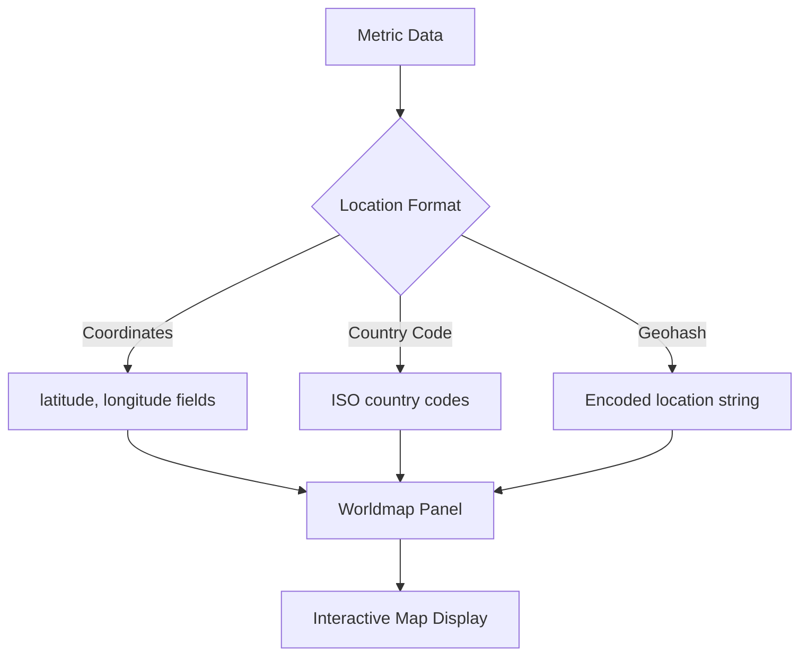

# How to Display Points on Worldmap Panel in Grafana

Author: [nawazdhandala](https://www.github.com/nawazdhandala)

Tags: Grafana, Visualization, Worldmap, Geolocation, Dashboards

Description: Learn how to display geographic data points on Grafana's Worldmap panel using coordinates, country codes, and geohash data from Prometheus, InfluxDB, and other datasources.

---

The Grafana Worldmap panel visualizes metrics geographically, showing data points on an interactive map. This guide covers configuring the panel with various data formats including latitude/longitude coordinates, country codes, and geohash values.

## Understanding Worldmap Data Requirements

The Worldmap panel needs location data paired with metric values. Location can come from coordinates, country codes, or geohash strings.



## 1. Install the Worldmap Panel Plugin

For Grafana versions before 8.0, install the legacy Worldmap panel. Grafana 8+ includes the Geomap panel natively.

```bash
# For Grafana < 8.0
grafana-cli plugins install grafana-worldmap-panel

# Restart Grafana
sudo systemctl restart grafana-server
```

For Kubernetes deployments:

```yaml
env:
  - name: GF_INSTALL_PLUGINS
    value: grafana-worldmap-panel
```

## 2. Prepare Location Data in Prometheus

Add location labels to your metrics for geographic visualization.

```yaml
# prometheus.yml - example static config with location labels
scrape_configs:
  - job_name: 'regional-services'
    static_configs:
      - targets: ['us-east.example.com:9090']
        labels:
          region: 'us-east'
          country: 'US'
          latitude: '37.7749'
          longitude: '-122.4194'
          city: 'San Francisco'
      - targets: ['eu-west.example.com:9090']
        labels:
          region: 'eu-west'
          country: 'DE'
          latitude: '52.5200'
          longitude: '13.4050'
          city: 'Berlin'
      - targets: ['ap-south.example.com:9090']
        labels:
          region: 'ap-south'
          country: 'SG'
          latitude: '1.3521'
          longitude: '103.8198'
          city: 'Singapore'
```

## 3. Query Data with Coordinates

Create a Prometheus query that returns metrics with location labels.

```promql
# Request rate by location
sum by (latitude, longitude, city) (
  rate(http_requests_total[5m])
)

# Error rate by region
sum by (latitude, longitude, region) (
  rate(http_requests_total{status=~"5.."}[5m])
) / sum by (latitude, longitude, region) (
  rate(http_requests_total[5m])
) * 100
```

## 4. Configure Worldmap Panel with Coordinates

Create a new panel and select the Worldmap visualization (or Geomap in Grafana 8+).

Panel JSON configuration for coordinate-based display:

```json
{
  "type": "grafana-worldmap-panel",
  "title": "Request Rate by Location",
  "datasource": "Prometheus",
  "targets": [
    {
      "expr": "sum by (latitude, longitude, city) (rate(http_requests_total[5m]))",
      "format": "table",
      "instant": true,
      "refId": "A"
    }
  ],
  "fieldConfig": {
    "defaults": {
      "mappings": [],
      "thresholds": {
        "mode": "absolute",
        "steps": [
          { "color": "green", "value": null },
          { "color": "yellow", "value": 100 },
          { "color": "red", "value": 500 }
        ]
      }
    }
  },
  "options": {
    "circleMaxSize": 30,
    "circleMinSize": 2,
    "colors": ["#73BF69", "#FADE2A", "#F2495C"],
    "decimals": 0,
    "esMetric": "Count",
    "hideEmpty": false,
    "hideZero": false,
    "initialZoom": 2,
    "locationData": "table",
    "mapCenter": "custom",
    "mapCenterLatitude": 30,
    "mapCenterLongitude": 0,
    "maxDataPoints": 1,
    "stickyLabels": false,
    "tableQueryOptions": {
      "geohashField": "",
      "latitudeField": "latitude",
      "longitudeField": "longitude",
      "metricField": "Value",
      "queryType": "coordinates"
    },
    "unitPlural": "requests/s",
    "unitSingle": "request/s",
    "unitSingular": "request/s"
  }
}
```

## 5. Use Country Codes for Location

When you have country-level data, use ISO country codes.

```promql
# Users by country
sum by (country_code) (
  active_users
)
```

Configure the Worldmap panel for country codes:

```json
{
  "options": {
    "locationData": "countries",
    "tableQueryOptions": {
      "queryType": "countries",
      "metricField": "Value",
      "labelField": "country_code"
    }
  }
}
```

## 6. Geohash-Based Location Data

For data stored with geohash encoding (common in InfluxDB and Elasticsearch).

InfluxDB query example:

```sql
SELECT mean("value") FROM "requests"
WHERE $timeFilter
GROUP BY time($__interval), "geohash"
```

Worldmap configuration for geohash:

```json
{
  "options": {
    "locationData": "geohash",
    "tableQueryOptions": {
      "queryType": "geohash",
      "geohashField": "geohash",
      "metricField": "Value"
    }
  }
}
```

## 7. Grafana 8+ Geomap Panel Configuration

Grafana 8 introduced the native Geomap panel with enhanced features.

```json
{
  "type": "geomap",
  "title": "Service Locations",
  "datasource": "Prometheus",
  "targets": [
    {
      "expr": "sum by (latitude, longitude, city) (up)",
      "format": "table",
      "instant": true
    }
  ],
  "options": {
    "view": {
      "id": "coords",
      "lat": 30,
      "lon": 0,
      "zoom": 2
    },
    "basemap": {
      "type": "osm-standard",
      "name": "OpenStreetMap"
    },
    "layers": [
      {
        "type": "markers",
        "name": "Services",
        "config": {
          "showLegend": true,
          "style": {
            "size": {
              "fixed": 10,
              "min": 5,
              "max": 30
            },
            "color": {
              "field": "Value",
              "fixed": "green"
            },
            "opacity": 0.8,
            "symbol": "circle"
          }
        },
        "location": {
          "mode": "coords",
          "latitude": "latitude",
          "longitude": "longitude"
        }
      }
    ]
  }
}
```

## 8. Add Custom Location Mapping

Create a JSON location mapping file for custom location resolution.

`locations.json`

```json
[
  {
    "key": "dc-us-east",
    "latitude": 39.0438,
    "longitude": -77.4874,
    "name": "US East (Virginia)"
  },
  {
    "key": "dc-us-west",
    "latitude": 45.8696,
    "longitude": -119.6880,
    "name": "US West (Oregon)"
  },
  {
    "key": "dc-eu-west",
    "latitude": 53.3498,
    "longitude": -6.2603,
    "name": "EU West (Ireland)"
  },
  {
    "key": "dc-ap-south",
    "latitude": 19.0760,
    "longitude": 72.8777,
    "name": "AP South (Mumbai)"
  }
]
```

Configure the panel to use JSON mapping:

```json
{
  "options": {
    "locationData": "json",
    "jsonUrl": "https://grafana.example.com/api/locations.json",
    "tableQueryOptions": {
      "labelField": "datacenter"
    }
  }
}
```

## 9. Dynamic Location Labels from Service Discovery

Use Prometheus relabeling to add location from service discovery.

```yaml
# prometheus.yml
scrape_configs:
  - job_name: 'kubernetes-services'
    kubernetes_sd_configs:
      - role: service
    relabel_configs:
      # Add location based on namespace or label
      - source_labels: [__meta_kubernetes_namespace]
        regex: 'prod-us-(.+)'
        target_label: region
        replacement: 'us-${1}'
      - source_labels: [__meta_kubernetes_service_label_location_lat]
        target_label: latitude
      - source_labels: [__meta_kubernetes_service_label_location_lon]
        target_label: longitude
```

## 10. Create Heatmap Overlay

Combine multiple metrics for a heatmap effect.

```promql
# Query for heatmap intensity
sum by (latitude, longitude) (
  rate(http_requests_total[5m]) *
  on(instance) group_left(latitude, longitude)
  instance_location_info
)
```

Panel configuration for heatmap style:

```json
{
  "options": {
    "layers": [
      {
        "type": "heatmap",
        "name": "Request Heatmap",
        "config": {
          "blur": 15,
          "radius": 20,
          "weight": {
            "field": "Value",
            "fixed": 1
          }
        },
        "location": {
          "mode": "coords",
          "latitude": "latitude",
          "longitude": "longitude"
        }
      }
    ]
  }
}
```

## 11. Dashboard Variables for Location Filtering

Add template variables for interactive location filtering.

```json
{
  "templating": {
    "list": [
      {
        "name": "region",
        "type": "query",
        "datasource": "Prometheus",
        "query": "label_values(http_requests_total, region)",
        "multi": true,
        "includeAll": true
      },
      {
        "name": "country",
        "type": "query",
        "datasource": "Prometheus",
        "query": "label_values(http_requests_total{region=~\"$region\"}, country)",
        "multi": true,
        "includeAll": true
      }
    ]
  }
}
```

Use variables in queries:

```promql
sum by (latitude, longitude, city) (
  rate(http_requests_total{region=~"$region", country=~"$country"}[5m])
)
```

## 12. Alerting on Geographic Anomalies

Create alerts for location-specific issues.

```yaml
groups:
  - name: geographic-alerts
    rules:
      - alert: RegionalHighErrorRate
        expr: |
          sum by (region, latitude, longitude) (
            rate(http_requests_total{status=~"5.."}[5m])
          ) / sum by (region, latitude, longitude) (
            rate(http_requests_total[5m])
          ) > 0.05
        for: 5m
        labels:
          severity: warning
        annotations:
          summary: "High error rate in {{ $labels.region }}"
          description: "Error rate is {{ $value | humanizePercentage }} at coordinates ({{ $labels.latitude }}, {{ $labels.longitude }})"
```

---

Geographic visualization in Grafana transforms abstract metrics into intuitive location-based displays. Whether tracking regional service health, user distribution, or infrastructure status, the Worldmap and Geomap panels provide powerful tools for understanding the spatial dimension of your data.
