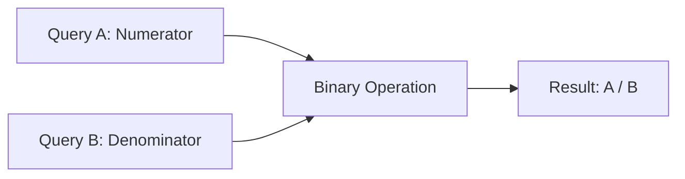
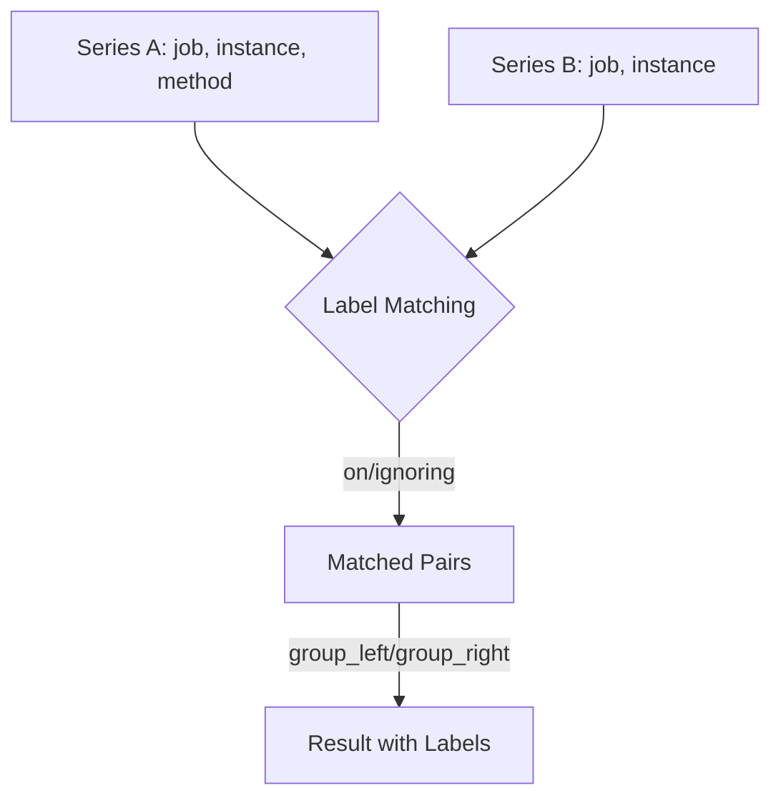

# How to Divide Two Series in Grafana

Author: [nawazdhandala](https://www.github.com/nawazdhandala)

Tags: Grafana, Prometheus, Metrics, Data Visualization, PromQL

Description: Learn how to divide two time series in Grafana using PromQL arithmetic operators and transformations. This guide covers ratio calculations, percentage metrics, and handling edge cases.

---

Dividing two time series is a common requirement when building Grafana dashboards. Whether you need to calculate error rates, resource utilization percentages, or efficiency ratios, understanding how to properly divide metrics is essential. This guide walks you through the different approaches and best practices.

## Why Divide Two Series?

Division operations in metrics are used to calculate:

- **Error rates**: errors / total_requests
- **Cache hit ratios**: cache_hits / (cache_hits + cache_misses)
- **CPU utilization**: cpu_used / cpu_total
- **Memory percentages**: memory_used / memory_total
- **Success rates**: successful_operations / total_operations

## Method 1: PromQL Arithmetic Operators

The most straightforward approach is using PromQL's built-in arithmetic operators directly in your query.

### Basic Division

```promql
# Calculate error rate
sum(rate(http_requests_total{status=~"5.."}[5m]))
/
sum(rate(http_requests_total[5m]))
```

### Division with Label Matching

When dividing series with labels, Prometheus needs to know how to match them. Use the `on()` and `group_left/group_right` modifiers:

```promql
# Divide series matching on specific labels
sum by (instance) (rate(node_cpu_seconds_total{mode="idle"}[5m]))
/
sum by (instance) (rate(node_cpu_seconds_total[5m]))
```

### Handling Many-to-One Matches

When one side has more labels than the other:

```promql
# Many-to-one matching with group_left
http_requests_total{job="api"}
/ on(instance) group_left
machine_cpu_cores{job="node"}
```

## Method 2: Grafana Transformations

For more complex scenarios or when working with multiple data sources, Grafana transformations provide flexibility.

### Step 1: Configure Two Queries

In your panel, add two queries:

**Query A** - Numerator:
```promql
sum(rate(http_requests_total{status="200"}[5m]))
```

**Query B** - Denominator:
```promql
sum(rate(http_requests_total[5m]))
```

### Step 2: Add Binary Operation Transformation

1. Click the **Transform** tab
2. Select **Add transformation**
3. Choose **Binary operation**
4. Configure the operation:
   - Operation: **Divide**
   - Query A: Select your numerator
   - Query B: Select your denominator



### Step 3: Handle Field Names

Use the **Rename by regex** transformation to clean up field names:

```
Match: (.*)
Replace: Success Rate
```

## Method 3: Using Math Expressions

Grafana's expression engine allows you to create calculated fields:

### Expression Query Setup

1. Add your base queries (A and B)
2. Add a new query of type **Expression**
3. Set the expression:

```
$A / $B
```

### Advanced Math Expression

```
# Calculate percentage with null handling
($A / $B) * 100

# With conditional logic
$A / ($B > 0 ? $B : 1)
```

## Handling Edge Cases

### Avoiding Division by Zero

Division by zero produces `NaN` or `Inf` values. Handle this in PromQL:

```promql
# Method 1: Filter out zero denominators
sum(rate(http_requests_total{status="200"}[5m]))
/
(sum(rate(http_requests_total[5m])) > 0)

# Method 2: Use clamp_min to set minimum value
sum(rate(http_requests_total{status="200"}[5m]))
/
clamp_min(sum(rate(http_requests_total[5m])), 1)

# Method 3: Use or operator with default
sum(rate(http_requests_total{status="200"}[5m]))
/
(sum(rate(http_requests_total[5m])) or vector(1))
```

### Dealing with Missing Data

When series don't exist for all time ranges:

```promql
# Fill missing values with 0
(sum(rate(http_requests_total{status="200"}[5m])) or vector(0))
/
(sum(rate(http_requests_total[5m])) or vector(1))
```

## Complete Dashboard Example

Here's a practical example for an API success rate panel:

### Panel Configuration

```json
{
  "datasource": "Prometheus",
  "targets": [
    {
      "expr": "sum(rate(http_requests_total{status=~\"2..\"}[5m])) / sum(rate(http_requests_total[5m])) * 100",
      "legendFormat": "Success Rate %"
    }
  ],
  "fieldConfig": {
    "defaults": {
      "unit": "percent",
      "min": 0,
      "max": 100,
      "thresholds": {
        "mode": "absolute",
        "steps": [
          {"color": "red", "value": null},
          {"color": "yellow", "value": 95},
          {"color": "green", "value": 99}
        ]
      }
    }
  }
}
```

### Multi-Metric Dashboard

```promql
# CPU Usage Percentage
100 - (avg by (instance) (rate(node_cpu_seconds_total{mode="idle"}[5m])) * 100)

# Memory Usage Percentage
(node_memory_MemTotal_bytes - node_memory_MemAvailable_bytes)
/
node_memory_MemTotal_bytes * 100

# Disk Usage Percentage
(node_filesystem_size_bytes - node_filesystem_avail_bytes)
/
node_filesystem_size_bytes * 100
```

## Label Matching Deep Dive

Understanding label matching is crucial for correct division:



### Ignoring Labels

```promql
# Ignore specific labels during matching
http_requests_total{method="GET"}
/ ignoring(method)
http_requests_total
```

### Grouping Results

```promql
# Keep additional labels from left side
http_requests_total
/ on(instance) group_left(job)
machine_cpu_cores
```

## Performance Considerations

1. **Pre-aggregate when possible**: Use recording rules for frequently calculated ratios
2. **Limit time ranges**: Large time ranges with high cardinality slow down division operations
3. **Use instant vectors**: For single-stat panels, use instant vectors instead of range vectors

### Recording Rule for Pre-aggregation

```yaml
groups:
  - name: ratios
    interval: 30s
    rules:
      - record: job:http_success_rate:ratio
        expr: |
          sum by (job) (rate(http_requests_total{status=~"2.."}[5m]))
          /
          sum by (job) (rate(http_requests_total[5m]))
```

## Troubleshooting Common Issues

| Issue | Cause | Solution |
|-------|-------|----------|
| No data returned | Label mismatch | Use `on()` to specify matching labels |
| NaN values | Division by zero | Add `> 0` filter or use `clamp_min` |
| Wrong values | Cardinality mismatch | Use `group_left` or `group_right` |
| Missing points | Series gaps | Fill with `or vector(0)` |

## Summary

Dividing two series in Grafana can be accomplished through:

1. **PromQL arithmetic** - Best for simple, same-datasource calculations
2. **Grafana transformations** - Ideal for cross-datasource or complex operations
3. **Math expressions** - Flexible for calculated fields

Always handle edge cases like division by zero and missing data to ensure your dashboards remain reliable. Use recording rules for frequently calculated ratios to improve performance.
