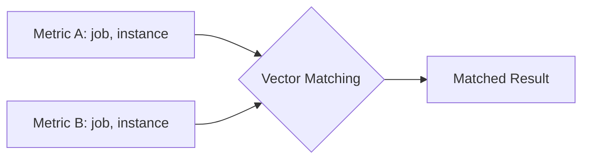

# How to Filter Prometheus Query Based on Another Metric

Author: [nawazdhandala](https://www.github.com/nawazdhandala)

Tags: Prometheus, PromQL, Metrics, Monitoring, Grafana

Description: Learn how to filter Prometheus queries based on values from another metric using vector matching, subqueries, and label joins. This guide covers common patterns for conditional metric filtering.

---

Filtering one Prometheus metric based on another is a powerful technique for creating dynamic, context-aware queries. Whether you need to show metrics only for active services, filter by deployment status, or correlate data across different metric types, PromQL provides several approaches. This guide covers the essential patterns.

## Understanding Vector Matching

Prometheus uses vector matching to combine metrics. Understanding how labels are matched is fundamental to filtering:



### Matching Operators

| Operator | Description | Use Case |
|----------|-------------|----------|
| `and` | Intersection | Filter to matching series |
| `or` | Union | Combine series |
| `unless` | Difference | Exclude matching series |

## Method 1: Using the `and` Operator

Filter metrics to only show series that exist in another metric:

### Basic Example

```promql
# Show request rates only for instances that are up
rate(http_requests_total[5m])
and
up == 1
```

### Filtering by Status

```promql
# Show CPU usage only for nodes marked as active
node_cpu_seconds_total
and on(instance)
node_active_status == 1
```

### Filtering by Label Existence

```promql
# Show metrics only for instances with a specific label
my_metric
and on(instance)
label_exists_metric
```

## Method 2: Using Comparison Operators

Filter based on metric values:

### Threshold-Based Filtering

```promql
# Show request latency only where error rate exceeds 5%
histogram_quantile(0.99, rate(http_request_duration_seconds_bucket[5m]))
and on(instance, job)
(
  rate(http_requests_total{status=~"5.."}[5m])
  /
  rate(http_requests_total[5m])
) > 0.05
```

### Memory-Based Filtering

```promql
# Show container metrics only for containers using > 1GB memory
rate(container_cpu_usage_seconds_total[5m])
and on(container, namespace, pod)
container_memory_usage_bytes > 1e9
```

## Method 3: Using `unless` for Exclusion

Exclude series that match another metric:

### Exclude Unhealthy Instances

```promql
# Show metrics excluding down instances
rate(http_requests_total[5m])
unless on(instance)
up == 0
```

### Exclude Maintenance Mode

```promql
# Show alerts excluding instances in maintenance
ALERTS{alertstate="firing"}
unless on(instance)
maintenance_mode == 1
```

## Method 4: Label Matching with `on()` and `ignoring()`

Control which labels are used for matching:

### Match on Specific Labels

```promql
# Match only on instance, ignore other labels
rate(http_requests_total[5m])
and on(instance)
up == 1
```

### Ignore Specific Labels

```promql
# Match all labels except 'method'
rate(http_requests_total[5m])
and ignoring(method)
service_healthy == 1
```

## Method 5: Using `group_left` and `group_right`

For many-to-one or one-to-many matching:

### Adding Labels from Filter Metric

```promql
# Add environment label from metadata metric
rate(http_requests_total[5m])
* on(instance) group_left(environment)
instance_metadata
```

### Filtering with Extra Labels

```promql
# Filter and bring labels from the filter metric
rate(http_requests_total[5m])
and on(instance) group_left(team, owner)
(service_metadata > 0)
```

## Practical Examples

### Example 1: Show Metrics Only for Production

```promql
# Only show metrics for production environment
rate(http_requests_total[5m])
and on(namespace)
kube_namespace_labels{label_environment="production"}
```

### Example 2: Filter by Deployment Status

```promql
# Show pod metrics only for fully available deployments
sum by (deployment) (rate(container_cpu_usage_seconds_total[5m]))
and on(deployment)
(
  kube_deployment_status_replicas_available
  ==
  kube_deployment_spec_replicas
)
```

### Example 3: Correlate with SLO Status

```promql
# Show detailed metrics only when SLO is at risk
rate(http_request_duration_seconds_bucket[5m])
and on(job)
(
  # Error budget consumption rate
  rate(slo_errors_total[1h]) / rate(slo_requests_total[1h]) > 0.001
)
```

### Example 4: Filter by Traffic Volume

```promql
# Show latency only for high-traffic endpoints
histogram_quantile(0.95, sum by (le, endpoint) (rate(http_request_duration_seconds_bucket[5m])))
and on(endpoint)
sum by (endpoint) (rate(http_requests_total[5m])) > 100
```

### Example 5: Dynamic Instance Filtering

```promql
# Show metrics for instances serving specific customers
rate(api_calls_total[5m])
and on(instance)
(
  sum by (instance) (
    rate(api_calls_total{customer="premium"}[5m])
  ) > 0
)
```

## Subqueries for Time-Based Filtering

Filter based on metric behavior over time:

### Filter by Average Value

```promql
# Show current CPU only if average over 1h exceeded 50%
node_cpu_utilization
and on(instance)
(avg_over_time(node_cpu_utilization[1h]) > 0.5)
```

### Filter by Recent Spikes

```promql
# Show metrics that had spikes in the last hour
rate(http_requests_total[5m])
and on(instance, job)
(max_over_time(rate(http_requests_total[5m])[1h:5m]) > 1000)
```

## Using Recording Rules for Complex Filters

For frequently used filters, create recording rules:

```yaml
groups:
  - name: filter_rules
    interval: 30s
    rules:
      # Active production instances
      - record: instance:active_production:filter
        expr: |
          up{environment="production"} == 1
          and on(instance)
          node_load1 > 0

      # High-traffic services
      - record: job:high_traffic:filter
        expr: |
          sum by (job) (rate(http_requests_total[5m])) > 100

      # Healthy pods
      - record: pod:healthy:filter
        expr: |
          kube_pod_status_ready{condition="true"} == 1
```

Use recording rules in queries:

```promql
# Simple filtered query using recording rule
rate(http_requests_total[5m])
and on(instance)
instance:active_production:filter
```

## Common Patterns Reference

### Pattern 1: Show if Target Up

```promql
my_metric
and on(instance, job)
up == 1
```

### Pattern 2: Show if Above Threshold

```promql
metric_a
and on(labelset)
metric_b > threshold
```

### Pattern 3: Show if Label Matches

```promql
my_metric
and on(common_label)
label_selector_metric{desired_label="value"}
```

### Pattern 4: Exclude if Condition Met

```promql
my_metric
unless on(instance)
exclusion_condition == 1
```

### Pattern 5: Multi-Condition Filter

```promql
my_metric
and on(instance) (condition_a == 1)
and on(instance) (condition_b > threshold)
unless on(instance) (exclusion_condition == 1)
```

## Grafana Variable Integration

Use Grafana variables for dynamic filtering:

### Variable Query

```promql
# Get list of active instances
label_values(up{job="$job"} == 1, instance)
```

### Panel Query with Variable Filter

```promql
rate(http_requests_total{instance=~"$instance"}[5m])
and on(instance)
up == 1
```

## Troubleshooting

### No Data Returned

1. **Label mismatch** - Check that label sets overlap
```promql
# Debug: see what labels exist
group by (__name__, job, instance) (metric_a)
group by (__name__, job, instance) (metric_b)
```

2. **Empty filter metric** - Verify filter metric has data
```promql
# Check filter metric
count(filter_metric)
```

### Wrong Series Matched

Use explicit `on()` to control matching:

```promql
# Explicit label matching
metric_a
and on(instance, job)  # Only match on these labels
metric_b
```

### Cardinality Issues

For high-cardinality metrics, aggregate before filtering:

```promql
# Aggregate first, then filter
sum by (job) (rate(http_requests_total[5m]))
and on(job)
sum by (job) (up) > 0
```

## Summary

Filtering Prometheus queries based on another metric enables:

1. **Dynamic dashboards** - Show only relevant data
2. **Conditional alerting** - Alert only when certain conditions exist
3. **Correlated analysis** - Combine data from different metrics
4. **Context-aware monitoring** - Filter by deployment state, health, or traffic

Key techniques:
- Use `and` for intersection filtering
- Use `unless` for exclusion
- Control label matching with `on()` and `ignoring()`
- Use `group_left`/`group_right` for label enrichment
- Create recording rules for complex, reusable filters

These patterns form the foundation for building sophisticated, context-aware monitoring dashboards.
