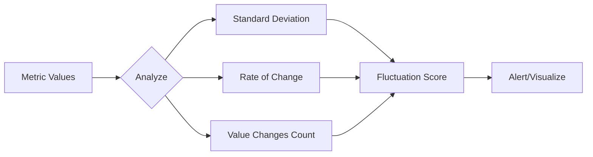

# How to Find Metric Fluctuation in Prometheus/Grafana

Author: [nawazdhandala](https://www.github.com/nawazdhandala)

Tags: Prometheus, Grafana, PromQL, Alerting, Metrics

Description: Learn how to detect and analyze metric fluctuations in Prometheus using PromQL functions like stddev, deriv, and changes, with Grafana visualization and alerting techniques.

---

Detecting metric fluctuations helps identify instability, unusual patterns, and potential issues before they become critical. This guide covers PromQL functions for measuring variability, Grafana visualization techniques, and alerting strategies for fluctuation detection.

## Understanding Metric Fluctuation

Fluctuation refers to how much a metric varies over time. High fluctuation indicates instability while low fluctuation suggests steady state behavior.



## 1. Measure Standard Deviation

Standard deviation quantifies how spread out values are from the mean.

```promql
# Standard deviation over 5 minutes
stddev_over_time(http_request_duration_seconds[5m])

# By service
stddev_over_time(http_request_duration_seconds[5m]) by (service)

# Compare stddev to mean (coefficient of variation)
stddev_over_time(http_request_duration_seconds[5m])
/ avg_over_time(http_request_duration_seconds[5m])
```

## 2. Detect Rate of Change

The `deriv` function calculates the per-second derivative, showing how fast a metric changes.

```promql
# Rate of change for gauge metrics
deriv(node_memory_MemFree_bytes[5m])

# Absolute rate of change (ignoring direction)
abs(deriv(node_memory_MemFree_bytes[5m]))

# High rate of change indicates instability
abs(deriv(process_resident_memory_bytes[5m])) > 1000000
```

For counter metrics, use rate changes:

```promql
# Second derivative - acceleration of request rate
deriv(rate(http_requests_total[1m])[5m:1m])
```

## 3. Count Value Changes

The `changes` function counts how many times a metric changed value.

```promql
# Number of value changes in 5 minutes
changes(up[5m])

# Detect flapping services (many state changes)
changes(up[10m]) > 5

# Configuration changes detection
changes(process_start_time_seconds[1h])
```

## 4. Calculate Variability Score

Combine metrics for a comprehensive fluctuation score.

```promql
# Variability score combining stddev and changes
(
  stddev_over_time(http_request_duration_seconds[5m])
  / avg_over_time(http_request_duration_seconds[5m])
) * 100

# Weighted fluctuation score
(
  0.5 * (stddev_over_time(metric[5m]) / avg_over_time(metric[5m]))
  + 0.3 * (changes(metric[5m]) / 300)
  + 0.2 * (abs(deriv(metric[5m])) / avg_over_time(metric[5m]))
)
```

## 5. Detect Spikes and Drops

Identify sudden changes from baseline.

```promql
# Current value vs average (z-score approximation)
(
  http_request_duration_seconds
  - avg_over_time(http_request_duration_seconds[1h])
) / stddev_over_time(http_request_duration_seconds[1h])

# Spike detection (more than 3 standard deviations)
(
  http_request_duration_seconds
  - avg_over_time(http_request_duration_seconds[1h])
) > 3 * stddev_over_time(http_request_duration_seconds[1h])

# Drop detection
avg_over_time(http_request_duration_seconds[1h])
- http_request_duration_seconds
> 3 * stddev_over_time(http_request_duration_seconds[1h])
```

## 6. Compare to Historical Baseline

Detect fluctuation compared to same time yesterday or last week.

```promql
# Compare to 24 hours ago
http_requests_total - http_requests_total offset 24h

# Percent change from yesterday
(
  rate(http_requests_total[5m])
  - rate(http_requests_total[5m] offset 24h)
) / rate(http_requests_total[5m] offset 24h) * 100

# Compare to same time last week
rate(http_requests_total[5m])
/ rate(http_requests_total[5m] offset 7d)
```

## 7. Grafana Panel Configuration

Create a fluctuation dashboard with multiple panels.

`fluctuation-dashboard.json`

```json
{
  "panels": [
    {
      "title": "Metric Value",
      "type": "timeseries",
      "targets": [
        {
          "expr": "http_request_duration_seconds{service=\"api\"}",
          "legendFormat": "Current Value"
        }
      ]
    },
    {
      "title": "Standard Deviation (5m)",
      "type": "timeseries",
      "targets": [
        {
          "expr": "stddev_over_time(http_request_duration_seconds{service=\"api\"}[5m])",
          "legendFormat": "StdDev"
        }
      ]
    },
    {
      "title": "Rate of Change",
      "type": "timeseries",
      "targets": [
        {
          "expr": "deriv(http_request_duration_seconds{service=\"api\"}[5m])",
          "legendFormat": "Derivative"
        }
      ],
      "fieldConfig": {
        "defaults": {
          "custom": {
            "drawStyle": "bars"
          }
        }
      }
    },
    {
      "title": "Coefficient of Variation (%)",
      "type": "stat",
      "targets": [
        {
          "expr": "stddev_over_time(http_request_duration_seconds{service=\"api\"}[5m]) / avg_over_time(http_request_duration_seconds{service=\"api\"}[5m]) * 100",
          "instant": true
        }
      ],
      "options": {
        "colorMode": "value",
        "graphMode": "none"
      },
      "fieldConfig": {
        "defaults": {
          "unit": "percent",
          "thresholds": {
            "steps": [
              {"color": "green", "value": null},
              {"color": "yellow", "value": 20},
              {"color": "red", "value": 50}
            ]
          }
        }
      }
    }
  ]
}
```

## 8. Rolling Window Analysis

Use subqueries for rolling window calculations.

```promql
# Rolling 1-hour stddev, evaluated every 5 minutes
stddev_over_time(http_request_duration_seconds[1h:5m])

# Maximum fluctuation in sliding window
max_over_time(
  stddev_over_time(http_request_duration_seconds[5m])[1h:5m]
)

# Trend of fluctuation over time
deriv(
  stddev_over_time(http_request_duration_seconds[5m])[1h:5m]
)
```

## 9. Alert on High Fluctuation

Configure alerts for unstable metrics.

```yaml
groups:
  - name: fluctuation-alerts
    rules:
      # High coefficient of variation
      - alert: HighMetricFluctuation
        expr: |
          (
            stddev_over_time(http_request_duration_seconds[5m])
            / avg_over_time(http_request_duration_seconds[5m])
          ) > 0.5
        for: 10m
        labels:
          severity: warning
        annotations:
          summary: "High fluctuation in {{ $labels.service }}"
          description: "Coefficient of variation is {{ $value | humanizePercentage }}"

      # Service flapping
      - alert: ServiceFlapping
        expr: changes(up[10m]) > 3
        for: 5m
        labels:
          severity: critical
        annotations:
          summary: "Service {{ $labels.instance }} is flapping"
          description: "Service state changed {{ $value }} times in 10 minutes"

      # Rapid memory changes
      - alert: MemoryInstability
        expr: |
          abs(deriv(process_resident_memory_bytes[5m])) > 10000000
        for: 15m
        labels:
          severity: warning
        annotations:
          summary: "Memory usage unstable for {{ $labels.instance }}"
          description: "Memory changing at {{ $value | humanize }}B/s"

      # Spike detection
      - alert: MetricSpike
        expr: |
          (
            http_request_duration_seconds
            - avg_over_time(http_request_duration_seconds[1h])
          ) > 3 * stddev_over_time(http_request_duration_seconds[1h])
        for: 5m
        labels:
          severity: warning
        annotations:
          summary: "Metric spike detected"
          description: "Value is more than 3 standard deviations above mean"
```

## 10. Recording Rules for Efficiency

Pre-compute fluctuation metrics for performance.

```yaml
groups:
  - name: fluctuation-recording
    interval: 30s
    rules:
      # Pre-computed standard deviation
      - record: service:request_duration:stddev5m
        expr: |
          stddev_over_time(http_request_duration_seconds[5m])

      # Pre-computed coefficient of variation
      - record: service:request_duration:cv5m
        expr: |
          stddev_over_time(http_request_duration_seconds[5m])
          / avg_over_time(http_request_duration_seconds[5m])

      # Pre-computed change count
      - record: instance:up:changes10m
        expr: changes(up[10m])

      # Pre-computed derivative
      - record: instance:memory:deriv5m
        expr: deriv(process_resident_memory_bytes[5m])
```

## 11. Heatmap Visualization

Display fluctuation patterns over time with heatmaps.

```json
{
  "type": "heatmap",
  "title": "Request Duration Distribution",
  "targets": [
    {
      "expr": "sum(rate(http_request_duration_seconds_bucket[5m])) by (le)",
      "format": "heatmap",
      "legendFormat": "{{le}}"
    }
  ],
  "options": {
    "calculate": false,
    "yAxis": {
      "unit": "s"
    },
    "cellGap": 1,
    "color": {
      "scheme": "Spectral",
      "fill": "dark-red"
    }
  }
}
```

## 12. Quantile Analysis

Detect fluctuation in different percentiles.

```promql
# Compare p99 to p50 - high ratio indicates outliers
histogram_quantile(0.99, rate(http_request_duration_seconds_bucket[5m]))
/ histogram_quantile(0.50, rate(http_request_duration_seconds_bucket[5m]))

# Interquartile range
histogram_quantile(0.75, rate(http_request_duration_seconds_bucket[5m]))
- histogram_quantile(0.25, rate(http_request_duration_seconds_bucket[5m]))

# Track percentile stability
stddev_over_time(
  histogram_quantile(0.95, rate(http_request_duration_seconds_bucket[5m]))[1h:5m]
)
```

## 13. Grafana Annotations for Context

Add annotations when fluctuation thresholds are crossed.

```yaml
# Grafana provisioning - annotations
apiVersion: 1
annotations:
  - name: High Fluctuation Events
    datasource: Prometheus
    enable: true
    iconColor: red
    query: |
      ALERTS{alertname="HighMetricFluctuation", alertstate="firing"}
```

## 14. Practical Fluctuation Queries

Common real-world fluctuation detection queries.

```promql
# CPU usage instability
stddev_over_time(
  rate(container_cpu_usage_seconds_total[1m])[5m:30s]
) by (container)

# Network throughput variance
stddev_over_time(
  rate(node_network_receive_bytes_total[1m])[10m:1m]
) by (device)

# Error rate stability
changes(
  ceil(rate(http_requests_total{status=~"5.."}[1m]))
[10m])

# Latency percentile stability
stddev_over_time(
  histogram_quantile(0.99, sum(rate(http_request_duration_seconds_bucket[1m])) by (le))
[30m:5m])

# Pod restart frequency (fluctuation indicator)
changes(kube_pod_container_status_restarts_total[1h])
```

---

Metric fluctuation analysis helps teams identify instability before users notice. By combining standard deviation, rate of change, and value counts with historical baselines, you can build comprehensive monitoring that catches unusual patterns early. Pre-computing these metrics via recording rules ensures dashboards and alerts perform well at scale.
