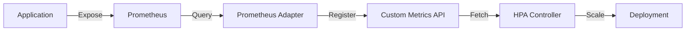

# How to Fix HPA Not Fetching Custom Metrics

Author: [nawazdhandala](https://www.github.com/nawazdhandala)

Tags: Kubernetes, HPA, Prometheus, Custom Metrics, Autoscaling

Description: Troubleshoot and fix Horizontal Pod Autoscaler issues when custom metrics from Prometheus are not being fetched, including Prometheus Adapter configuration and API registration.

---

The Horizontal Pod Autoscaler (HPA) can scale workloads based on custom metrics from Prometheus, but the setup requires multiple components working together. When HPAs fail to fetch custom metrics, the issue typically lies in the Prometheus Adapter configuration, API registration, or metric naming.

## Understanding the Custom Metrics Pipeline

Custom metrics flow through several components before reaching the HPA.



## 1. Verify the Custom Metrics API Is Registered

Check if the custom metrics API service is available.

```bash
# List API services
kubectl get apiservice | grep custom

# Expected output:
# v1beta1.custom.metrics.k8s.io   monitoring/prometheus-adapter   True    3d

# Check if metrics API responds
kubectl get --raw "/apis/custom.metrics.k8s.io/v1beta1" | jq .
```

If the API service is missing or shows False in the AVAILABLE column, the Prometheus Adapter needs attention.

## 2. Install or Fix Prometheus Adapter

Deploy Prometheus Adapter using Helm.

```bash
# Add the prometheus-community repo
helm repo add prometheus-community https://prometheus-community.github.io/helm-charts
helm repo update

# Install Prometheus Adapter
helm install prometheus-adapter prometheus-community/prometheus-adapter \
  --namespace monitoring \
  --set prometheus.url=http://prometheus-server.monitoring.svc \
  --set prometheus.port=80
```

Verify the adapter is running:

```bash
kubectl get pods -n monitoring -l app.kubernetes.io/name=prometheus-adapter
kubectl logs -n monitoring -l app.kubernetes.io/name=prometheus-adapter --tail=100
```

## 3. Configure Custom Metric Rules

The Prometheus Adapter needs rules to translate Prometheus metrics into Kubernetes custom metrics.

`prometheus-adapter-values.yaml`

```yaml
prometheus:
  url: http://prometheus-server.monitoring.svc
  port: 80

rules:
  default: false
  custom:
    # Expose http_requests_total as a custom metric
    - seriesQuery: 'http_requests_total{namespace!="",pod!=""}'
      resources:
        overrides:
          namespace:
            resource: namespace
          pod:
            resource: pod
      name:
        matches: "^(.*)_total$"
        as: "${1}_per_second"
      metricsQuery: 'sum(rate(<<.Series>>{<<.LabelMatchers>>}[2m])) by (<<.GroupBy>>)'

    # Expose custom application metric
    - seriesQuery: 'app_queue_depth{namespace!="",pod!=""}'
      resources:
        overrides:
          namespace:
            resource: namespace
          pod:
            resource: pod
      name:
        matches: "^(.*)$"
        as: "queue_depth"
      metricsQuery: 'avg(<<.Series>>{<<.LabelMatchers>>}) by (<<.GroupBy>>)'

    # Expose requests per second
    - seriesQuery: 'nginx_ingress_controller_requests{namespace!="",pod!=""}'
      resources:
        overrides:
          namespace:
            resource: namespace
          pod:
            resource: pod
      name:
        matches: "^(.*)$"
        as: "requests_per_second"
      metricsQuery: 'sum(rate(<<.Series>>{<<.LabelMatchers>>}[1m])) by (<<.GroupBy>>)'

  resource:
    cpu:
      containerQuery: 'sum(rate(container_cpu_usage_seconds_total{<<.LabelMatchers>>, container!=""}[3m])) by (<<.GroupBy>>)'
      nodeQuery: 'sum(rate(container_cpu_usage_seconds_total{<<.LabelMatchers>>, id="/"}[3m])) by (<<.GroupBy>>)'
      resources:
        overrides:
          namespace:
            resource: namespace
          pod:
            resource: pod
          node:
            resource: node
      containerLabel: container
    memory:
      containerQuery: 'sum(container_memory_working_set_bytes{<<.LabelMatchers>>, container!=""}) by (<<.GroupBy>>)'
      nodeQuery: 'sum(container_memory_working_set_bytes{<<.LabelMatchers>>, id="/"}) by (<<.GroupBy>>)'
      resources:
        overrides:
          namespace:
            resource: namespace
          pod:
            resource: pod
          node:
            resource: node
      containerLabel: container

  external: []
```

Apply the configuration:

```bash
helm upgrade prometheus-adapter prometheus-community/prometheus-adapter \
  --namespace monitoring \
  -f prometheus-adapter-values.yaml
```

## 4. Verify Metrics Are Available

Query the custom metrics API to confirm metrics are exposed.

```bash
# List all available custom metrics
kubectl get --raw "/apis/custom.metrics.k8s.io/v1beta1" | jq '.resources[].name'

# Query specific metric for all pods
kubectl get --raw "/apis/custom.metrics.k8s.io/v1beta1/namespaces/default/pods/*/http_requests_per_second" | jq .

# Query metric for specific pod
kubectl get --raw "/apis/custom.metrics.k8s.io/v1beta1/namespaces/default/pods/myapp-abc123/http_requests_per_second" | jq .
```

## 5. Check Prometheus Has the Metric

Verify the source metric exists in Prometheus.

```bash
# Port-forward to Prometheus
kubectl port-forward svc/prometheus-server -n monitoring 9090:80 &

# Query the metric
curl -s 'http://localhost:9090/api/v1/query?query=http_requests_total' | jq '.data.result | length'

# Check metric labels include required namespace and pod labels
curl -s 'http://localhost:9090/api/v1/query?query=http_requests_total' | jq '.data.result[0].metric'
```

The metric must have `namespace` and `pod` labels for the adapter to work.

## 6. Fix Missing Labels

If your metrics lack required labels, add them via relabeling in Prometheus.

```yaml
# prometheus.yml scrape config
scrape_configs:
  - job_name: 'kubernetes-pods'
    kubernetes_sd_configs:
      - role: pod
    relabel_configs:
      # Keep namespace label
      - source_labels: [__meta_kubernetes_namespace]
        target_label: namespace
      # Keep pod name label
      - source_labels: [__meta_kubernetes_pod_name]
        target_label: pod
      # Keep container name
      - source_labels: [__meta_kubernetes_pod_container_name]
        target_label: container
```

## 7. Create HPA Using Custom Metrics

With metrics available, create an HPA that uses them.

`hpa-custom-metrics.yaml`

```yaml
apiVersion: autoscaling/v2
kind: HorizontalPodAutoscaler
metadata:
  name: myapp-hpa
  namespace: default
spec:
  scaleTargetRef:
    apiVersion: apps/v1
    kind: Deployment
    name: myapp
  minReplicas: 2
  maxReplicas: 20
  metrics:
    # Scale based on custom metric
    - type: Pods
      pods:
        metric:
          name: http_requests_per_second
        target:
          type: AverageValue
          averageValue: "100"
    # Also consider CPU as backup
    - type: Resource
      resource:
        name: cpu
        target:
          type: Utilization
          averageUtilization: 70
```

Apply and verify:

```bash
kubectl apply -f hpa-custom-metrics.yaml

# Check HPA status
kubectl get hpa myapp-hpa -o wide

# Watch for changes
kubectl get hpa myapp-hpa -w
```

## 8. Debug HPA Metrics Fetching

If the HPA shows `<unknown>` for custom metrics, dig deeper.

```bash
# Describe HPA for detailed status
kubectl describe hpa myapp-hpa

# Look for events and conditions
# Common issues:
# - "unable to get metric": Adapter cannot find the metric
# - "no metrics returned": Prometheus query returns empty
# - "missing selector": HPA cannot match pods
```

Check the Prometheus Adapter logs:

```bash
kubectl logs -n monitoring deployment/prometheus-adapter --tail=200

# Look for:
# - Query errors
# - Configuration parsing issues
# - Connection problems to Prometheus
```

## 9. Test the Metrics Query Manually

Validate the exact query the adapter would run.

```bash
# The adapter runs queries like this:
# sum(rate(http_requests_total{namespace="default",pod=~"myapp-.*"}[2m])) by (pod)

# Test in Prometheus UI or via API
curl -s 'http://localhost:9090/api/v1/query' \
  --data-urlencode 'query=sum(rate(http_requests_total{namespace="default"}[2m])) by (pod)' | jq .
```

## 10. Common Issues and Solutions

### Issue: API Service Shows False

```bash
kubectl get apiservice v1beta1.custom.metrics.k8s.io -o yaml
```

Fix: Check adapter deployment health and service connectivity.

```bash
# Verify service exists
kubectl get svc -n monitoring prometheus-adapter

# Test service connectivity
kubectl run -it --rm debug --image=busybox --restart=Never -- \
  wget -qO- http://prometheus-adapter.monitoring.svc:443/apis/custom.metrics.k8s.io/v1beta1
```

### Issue: Metric Name Mismatch

The HPA metric name must exactly match what the adapter exposes.

```bash
# List exposed metrics
kubectl get --raw "/apis/custom.metrics.k8s.io/v1beta1" | jq '.resources[].name' | sort

# Use the exact name in HPA
```

### Issue: No Pods Match Selector

Ensure your pods have labels that match the metric series.

```bash
# Check pod labels
kubectl get pods -l app=myapp --show-labels

# Verify metric has matching labels in Prometheus
```

### Issue: Rate Window Too Short

If metrics are sparse, adjust the rate window.

```yaml
# In prometheus-adapter config
metricsQuery: 'sum(rate(<<.Series>>{<<.LabelMatchers>>}[5m])) by (<<.GroupBy>>)'
```

## 11. External Metrics for Non-Pod Resources

For metrics not tied to pods, use external metrics.

```yaml
# prometheus-adapter-values.yaml
rules:
  external:
    - seriesQuery: 'rabbitmq_queue_messages{queue!=""}'
      resources:
        overrides:
          queue:
            resource: queue
      name:
        matches: "^(.*)$"
        as: "queue_messages"
      metricsQuery: '<<.Series>>{<<.LabelMatchers>>}'
```

HPA using external metrics:

```yaml
apiVersion: autoscaling/v2
kind: HorizontalPodAutoscaler
metadata:
  name: worker-hpa
spec:
  scaleTargetRef:
    apiVersion: apps/v1
    kind: Deployment
    name: worker
  minReplicas: 1
  maxReplicas: 50
  metrics:
    - type: External
      external:
        metric:
          name: queue_messages
          selector:
            matchLabels:
              queue: tasks
        target:
          type: AverageValue
          averageValue: "30"
```

## 12. Monitoring HPA Behavior

Create alerts for HPA issues.

```yaml
groups:
  - name: hpa-alerts
    rules:
      - alert: HPAMaxedOut
        expr: |
          kube_horizontalpodautoscaler_status_current_replicas
          == kube_horizontalpodautoscaler_spec_max_replicas
        for: 15m
        labels:
          severity: warning
        annotations:
          summary: "HPA {{ $labels.horizontalpodautoscaler }} is at max replicas"

      - alert: HPAMetricUnavailable
        expr: |
          kube_horizontalpodautoscaler_status_condition{condition="ScalingActive", status="false"} == 1
        for: 5m
        labels:
          severity: critical
        annotations:
          summary: "HPA {{ $labels.horizontalpodautoscaler }} cannot fetch metrics"
```

---

Custom metrics-based autoscaling requires coordination between Prometheus, the Prometheus Adapter, and the HPA. When metrics fail to flow, systematic debugging through each component reveals the root cause, whether it is missing labels, incorrect query syntax, or API registration issues.
