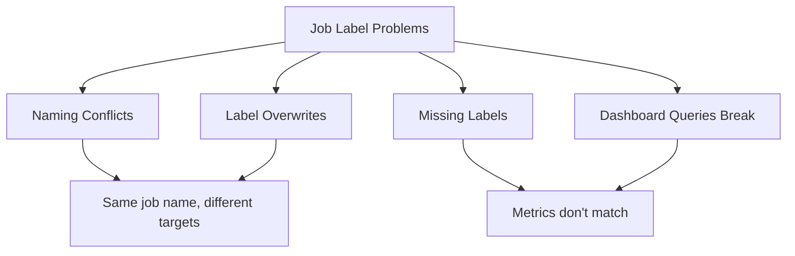

# How to Fix Prometheus Job Label Breaking Grafana Dashboards

Author: [nawazdhandala](https://www.github.com/nawazdhandala)

Tags: Prometheus, Grafana, Labels, Troubleshooting, Monitoring

Description: Learn how to diagnose and fix issues where Prometheus job labels cause problems in Grafana dashboards. This guide covers label conflicts, relabeling strategies, and query adjustments.

---

The `job` label is fundamental in Prometheus - it identifies the scrape configuration that collected a metric. However, this label can cause significant issues in Grafana dashboards when there are naming conflicts, unexpected values, or when metrics from different sources need to be combined. This guide helps you diagnose and fix job label problems.

## Common Job Label Issues



### Symptoms

- Dashboards show unexpected data or no data
- Metrics from different services appear mixed
- Queries that worked before suddenly break
- Labels in Grafana don't match expected values

## Understanding the Job Label

The `job` label comes from two sources:

1. **Prometheus configuration** - The `job_name` in `scrape_configs`
2. **Target labels** - Labels on the scraped target that include `job`

### Default Behavior

```yaml
# prometheus.yml
scrape_configs:
  - job_name: 'api-server'  # This becomes the job label
    static_configs:
      - targets: ['api1:9090', 'api2:9090']
```

Resulting metrics:
```
http_requests_total{job="api-server", instance="api1:9090"}
http_requests_total{job="api-server", instance="api2:9090"}
```

## Problem 1: Job Name Conflicts

### The Issue

Multiple services using the same job name, or a single job scraping multiple distinct services:

```yaml
scrape_configs:
  - job_name: 'kubernetes-pods'  # All pods get same job label
    kubernetes_sd_configs:
      - role: pod
```

All pods now have `job="kubernetes-pods"`, making it impossible to distinguish between services.

### The Fix: Relabel to Preserve Service Identity

```yaml
scrape_configs:
  - job_name: 'kubernetes-pods'
    kubernetes_sd_configs:
      - role: pod
    relabel_configs:
      # Use the pod's app label as the job label
      - source_labels: [__meta_kubernetes_pod_label_app]
        target_label: job
      # Or use namespace/name combination
      - source_labels: [__meta_kubernetes_namespace, __meta_kubernetes_pod_name]
        separator: '/'
        target_label: job
```

## Problem 2: Job Label Overwrites

### The Issue

A metric exposed by the target already has a `job` label, but Prometheus overwrites it:

```
# Application exposes:
custom_metric{job="my-actual-service", type="important"}

# After scrape, becomes:
custom_metric{job="prometheus-scrape-job", exported_job="my-actual-service", type="important"}
```

### The Fix: Honor Original Labels

```yaml
scrape_configs:
  - job_name: 'my-targets'
    honor_labels: true  # Keep original labels from targets
    static_configs:
      - targets: ['target:9090']
```

Or selectively preserve the job label:

```yaml
relabel_configs:
  # If target has job label, use it; otherwise use job_name
  - source_labels: [job]
    target_label: __tmp_job
  - source_labels: [__tmp_job]
    regex: (.+)
    target_label: job
```

## Problem 3: Dashboard Queries Assume Specific Job Names

### The Issue

Dashboard queries hardcode job names:

```promql
# This breaks when job label changes
rate(http_requests_total{job="api"}[5m])
```

### The Fix: Use Grafana Variables

Create a job variable in Grafana:

```
# Variable query
label_values(http_requests_total, job)
```

Update queries to use the variable:

```promql
rate(http_requests_total{job=~"$job"}[5m])
```

### Dashboard JSON Configuration

```json
{
  "templating": {
    "list": [
      {
        "name": "job",
        "type": "query",
        "query": "label_values(up, job)",
        "refresh": 2,
        "multi": true,
        "includeAll": true
      }
    ]
  }
}
```

## Problem 4: Joining Metrics with Different Job Labels

### The Issue

Trying to correlate metrics that have different job labels:

```promql
# These won't match because job labels differ
rate(http_requests_total{job="nginx"}[5m])
/
rate(http_backend_requests_total{job="api"}[5m])
```

### The Fix: Use ignoring() or on()

```promql
# Ignore the job label when matching
rate(http_requests_total{job="nginx"}[5m])
/ ignoring(job)
rate(http_backend_requests_total{job="api"}[5m])

# Or match on specific labels only
rate(http_requests_total{job="nginx"}[5m])
/ on(instance)
rate(http_backend_requests_total{job="api"}[5m])
```

## Problem 5: Federation and Remote Write Label Conflicts

### The Issue

When federating or using remote write, job labels from different Prometheus servers conflict:

```
# From Prometheus A
up{job="api", instance="server1:9090"}

# From Prometheus B (after federation)
up{job="api", instance="server2:9090"}
```

Both appear as the same job, but are from different environments.

### The Fix: Add Distinguishing Labels

Add external labels in prometheus.yml:

```yaml
global:
  external_labels:
    cluster: 'production-us-east'
    prometheus: 'prom-a'
```

Or relabel during federation:

```yaml
# On federating Prometheus
scrape_configs:
  - job_name: 'federate'
    honor_labels: true
    metrics_path: '/federate'
    static_configs:
      - targets: ['prometheus-a:9090']
        labels:
          source_prometheus: 'prom-a'
```

## Problem 6: Missing Job Label

### The Issue

Metrics appear without a job label, making queries fail:

```promql
# No results
up{job="my-service"}

# But this works
up
```

### The Fix: Verify Scrape Configuration

Check your prometheus.yml:

```yaml
scrape_configs:
  - job_name: 'my-service'  # Must be set
    static_configs:
      - targets: ['localhost:9090']
```

Verify with Prometheus targets page:
```
http://prometheus:9090/targets
```

## Relabeling Reference

### Common Relabel Patterns

```yaml
relabel_configs:
  # Rename job label
  - source_labels: [__meta_kubernetes_service_name]
    target_label: job

  # Add prefix to job
  - source_labels: [job]
    target_label: job
    replacement: 'prefix-${1}'

  # Replace job based on condition
  - source_labels: [__meta_kubernetes_namespace]
    regex: 'production'
    target_label: job
    replacement: 'prod-service'

  # Keep original job in different label
  - source_labels: [job]
    target_label: original_job
```

### Metric Relabel for Cleanup

```yaml
metric_relabel_configs:
  # Standardize job names
  - source_labels: [job]
    regex: '(.+)-[0-9]+'
    target_label: job
    replacement: '${1}'

  # Drop metrics with problematic job labels
  - source_labels: [job]
    regex: 'unwanted-job'
    action: drop
```

## Debugging Job Label Issues

### Step 1: Check Prometheus Targets

```
http://prometheus:9090/targets
```

Look for:
- Target state (up/down)
- Labels assigned to each target
- Error messages

### Step 2: Query Raw Metrics

```promql
# See all job labels
group by (job) (up)

# Check specific metric's labels
http_requests_total
```

### Step 3: Verify in Grafana Explore

Use Grafana's Explore view to:
1. Run raw PromQL queries
2. See returned labels
3. Test different label selectors

### Step 4: Check Recording Rules

Recording rules may alter job labels:

```yaml
groups:
  - name: my_rules
    rules:
      - record: job:http_requests:rate5m
        expr: sum by (job) (rate(http_requests_total[5m]))
        # This creates new metrics with job label
```

## Dashboard Migration Strategy

When job labels change, update dashboards systematically:

### 1. Create Label Mapping

```promql
# Old query
rate(http_requests_total{job="old-api"}[5m])

# New query with multiple possible values
rate(http_requests_total{job=~"old-api|new-api|api"}[5m])
```

### 2. Use Variables with Default

```json
{
  "templating": {
    "list": [
      {
        "name": "job",
        "current": {
          "text": "api",
          "value": "api"
        },
        "options": [
          {"text": "api", "value": "api"},
          {"text": "old-api", "value": "old-api"}
        ]
      }
    ]
  }
}
```

### 3. Add Label Filtering to All Panels

Replace:
```promql
rate(http_requests_total[5m])
```

With:
```promql
rate(http_requests_total{job=~"$job"}[5m])
```

## Summary

Fixing Prometheus job label issues in Grafana requires:

1. **Understanding the source** - Know where job labels come from
2. **Using relabel_configs** - Transform labels during scraping
3. **Using honor_labels** - Preserve original labels when needed
4. **Using Grafana variables** - Make dashboards flexible
5. **Using ignoring()/on()** - Handle cross-job queries properly

Key commands for debugging:
```promql
# See all jobs
group by (job) (up)

# Check specific metric labels
{__name__="http_requests_total"}
```

With proper job label management, your Grafana dashboards will be more reliable and easier to maintain across different environments and Prometheus configurations.
