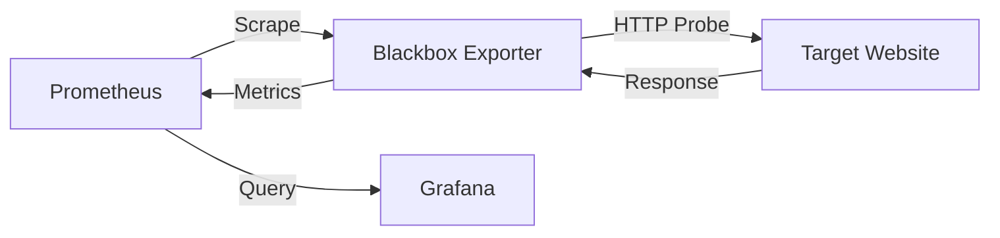

# How to Get Webpage Values with Blackbox Exporter

Author: [nawazdhandala](https://www.github.com/nawazdhandala)

Tags: Prometheus, Blackbox Exporter, Monitoring, Web Scraping, HTTP

Description: Learn how to extract specific values from webpages using Prometheus Blackbox Exporter, including HTTP response body matching, header extraction, and JSON response parsing.

---

Blackbox Exporter probes endpoints over HTTP, HTTPS, DNS, TCP, and ICMP. Beyond simple up/down checks, it can extract and expose specific values from webpage responses. This guide shows how to configure Blackbox Exporter to capture webpage content as Prometheus metrics.

## Understanding Blackbox Exporter Capabilities

Blackbox Exporter works by probing targets and exposing the results as Prometheus metrics. For HTTP probes, you can validate response bodies, check for specific strings, and extract timing information.



## 1. Basic Blackbox Exporter Setup

Start with a basic Blackbox Exporter deployment.

`blackbox.yml`

```yaml
modules:
  http_2xx:
    prober: http
    timeout: 5s
    http:
      valid_http_versions: ["HTTP/1.1", "HTTP/2.0"]
      valid_status_codes: []  # Defaults to 2xx
      method: GET
      follow_redirects: true
      fail_if_ssl: false
      fail_if_not_ssl: false
```

## 2. Match Specific Text in Response Body

To verify a webpage contains expected content, use `fail_if_body_not_matches_regexp`.

```yaml
modules:
  http_content_check:
    prober: http
    timeout: 10s
    http:
      valid_status_codes: [200]
      method: GET
      fail_if_body_not_matches_regexp:
        - "Welcome to our service"
        - "Status: OK"
```

This exposes the metric `probe_success` as 1 only if both patterns are found.

## 3. Extract Values Using Regular Expressions

While Blackbox Exporter cannot directly extract arbitrary values as metrics, you can validate expected patterns and use the probe status.

```yaml
modules:
  http_version_check:
    prober: http
    timeout: 10s
    http:
      valid_status_codes: [200]
      method: GET
      # Check for version pattern like v1.2.3
      fail_if_body_not_matches_regexp:
        - 'version":\s*"v[0-9]+\.[0-9]+\.[0-9]+"'
      fail_if_body_matches_regexp:
        - '"status":\s*"error"'
        - '"maintenance":\s*true'
```

## 4. Monitor JSON API Endpoints

For JSON APIs, validate structure and expected values.

```yaml
modules:
  api_health:
    prober: http
    timeout: 5s
    http:
      valid_status_codes: [200]
      method: GET
      headers:
        Accept: application/json
      fail_if_body_not_matches_regexp:
        - '"healthy":\s*true'
        - '"database":\s*"connected"'
        - '"cache":\s*"connected"'
```

## 5. Check Response Headers

Validate specific response headers are present or contain expected values.

```yaml
modules:
  http_header_check:
    prober: http
    timeout: 5s
    http:
      valid_status_codes: [200]
      method: GET
      fail_if_header_not_matches:
        - header: Content-Type
          regexp: 'application/json'
          allow_missing: false
        - header: X-Cache
          regexp: 'HIT'
          allow_missing: true
```

## 6. Configure Prometheus to Scrape Blackbox Exporter

Set up Prometheus to scrape Blackbox Exporter with target relabeling.

`prometheus.yml`

```yaml
scrape_configs:
  - job_name: 'blackbox-http'
    metrics_path: /probe
    params:
      module: [http_content_check]
    static_configs:
      - targets:
        - https://api.example.com/health
        - https://www.example.com
        - https://status.example.com/api/v1/status
    relabel_configs:
      - source_labels: [__address__]
        target_label: __param_target
      - source_labels: [__param_target]
        target_label: instance
      - target_label: __address__
        replacement: blackbox-exporter:9115

  - job_name: 'blackbox-api'
    metrics_path: /probe
    params:
      module: [api_health]
    static_configs:
      - targets:
        - https://api.example.com/v1/health
    relabel_configs:
      - source_labels: [__address__]
        target_label: __param_target
      - source_labels: [__param_target]
        target_label: instance
      - target_label: __address__
        replacement: blackbox-exporter:9115
```

## 7. Extract SSL Certificate Information

Blackbox Exporter automatically extracts SSL certificate details.

```yaml
modules:
  http_ssl:
    prober: http
    timeout: 5s
    http:
      valid_status_codes: [200]
      fail_if_ssl: false
      fail_if_not_ssl: true
      tls_config:
        insecure_skip_verify: false
```

This exposes metrics like:

```promql
# Days until certificate expires
probe_ssl_earliest_cert_expiry - time()

# Certificate issuer and subject info
probe_ssl_last_chain_info
```

## 8. Parse Webpage for Multiple Conditions

Create modules that check multiple conditions on a page.

```yaml
modules:
  ecommerce_check:
    prober: http
    timeout: 15s
    http:
      valid_status_codes: [200]
      method: GET
      # Must contain all of these
      fail_if_body_not_matches_regexp:
        - 'Add to Cart'
        - 'Price: \$[0-9]+\.[0-9]{2}'
        - 'In Stock'
      # Must NOT contain any of these
      fail_if_body_matches_regexp:
        - 'Out of Stock'
        - 'Service Unavailable'
        - 'Error 500'
```

## 9. Monitor API Response Times

Blackbox Exporter exposes detailed timing metrics.

```yaml
modules:
  http_timing:
    prober: http
    timeout: 10s
    http:
      valid_status_codes: [200]
      method: GET
```

Query timing metrics in Prometheus:

```promql
# Total probe duration
probe_duration_seconds{job="blackbox-http"}

# DNS lookup time
probe_dns_lookup_time_seconds{job="blackbox-http"}

# TLS handshake time
probe_http_ssl_handshake_seconds{job="blackbox-http"}

# Time to first byte
probe_http_duration_seconds{phase="processing"}

# Time to receive response
probe_http_duration_seconds{phase="transfer"}
```

## 10. Deploy with Docker Compose

`docker-compose.yml`

```yaml
version: '3.8'

services:
  blackbox-exporter:
    image: prom/blackbox-exporter:latest
    container_name: blackbox-exporter
    ports:
      - "9115:9115"
    volumes:
      - ./blackbox.yml:/etc/blackbox_exporter/config.yml:ro
    command:
      - '--config.file=/etc/blackbox_exporter/config.yml'
    restart: unless-stopped

  prometheus:
    image: prom/prometheus:latest
    container_name: prometheus
    ports:
      - "9090:9090"
    volumes:
      - ./prometheus.yml:/etc/prometheus/prometheus.yml:ro
    command:
      - '--config.file=/etc/prometheus/prometheus.yml'
    depends_on:
      - blackbox-exporter
    restart: unless-stopped
```

## 11. Kubernetes Deployment

Deploy Blackbox Exporter in Kubernetes using a ConfigMap.

`blackbox-configmap.yaml`

```yaml
apiVersion: v1
kind: ConfigMap
metadata:
  name: blackbox-exporter-config
  namespace: monitoring
data:
  blackbox.yml: |
    modules:
      http_2xx:
        prober: http
        timeout: 5s
        http:
          valid_status_codes: [200]
          method: GET
      http_content:
        prober: http
        timeout: 10s
        http:
          valid_status_codes: [200]
          fail_if_body_not_matches_regexp:
            - "healthy"
```

`blackbox-deployment.yaml`

```yaml
apiVersion: apps/v1
kind: Deployment
metadata:
  name: blackbox-exporter
  namespace: monitoring
spec:
  replicas: 1
  selector:
    matchLabels:
      app: blackbox-exporter
  template:
    metadata:
      labels:
        app: blackbox-exporter
    spec:
      containers:
        - name: blackbox-exporter
          image: prom/blackbox-exporter:v0.24.0
          args:
            - --config.file=/etc/blackbox_exporter/blackbox.yml
          ports:
            - containerPort: 9115
          volumeMounts:
            - name: config
              mountPath: /etc/blackbox_exporter
      volumes:
        - name: config
          configMap:
            name: blackbox-exporter-config
```

## 12. Create Grafana Alerts

Set up alerts based on content checks.

```yaml
# Prometheus alerting rules
groups:
  - name: blackbox
    rules:
      - alert: WebpageContentMissing
        expr: probe_success{job="blackbox-http"} == 0
        for: 5m
        labels:
          severity: critical
        annotations:
          summary: "Webpage content check failed"
          description: "Target {{ $labels.instance }} failed content validation"

      - alert: SSLCertExpiringSoon
        expr: (probe_ssl_earliest_cert_expiry - time()) / 86400 < 30
        for: 1h
        labels:
          severity: warning
        annotations:
          summary: "SSL certificate expiring soon"
          description: "Certificate for {{ $labels.instance }} expires in {{ $value }} days"
```

## 13. Advanced Pattern Matching

Use complex regex patterns for detailed validation.

```yaml
modules:
  http_advanced:
    prober: http
    timeout: 15s
    http:
      valid_status_codes: [200]
      method: GET
      # Match JSON with specific structure
      fail_if_body_not_matches_regexp:
        # Match version format
        - '"version":\s*"[0-9]+\.[0-9]+\.[0-9]+"'
        # Match timestamp within last hour (simplified)
        - '"timestamp":\s*"[0-9]{4}-[0-9]{2}-[0-9]{2}T'
        # Match specific status values
        - '"status":\s*("ok"|"healthy"|"running")'
```

---

Blackbox Exporter provides powerful webpage monitoring capabilities through pattern matching and response validation. While it cannot extract arbitrary numeric values from responses, it effectively monitors endpoint availability, content presence, response times, and SSL certificates - covering most webpage monitoring needs.
