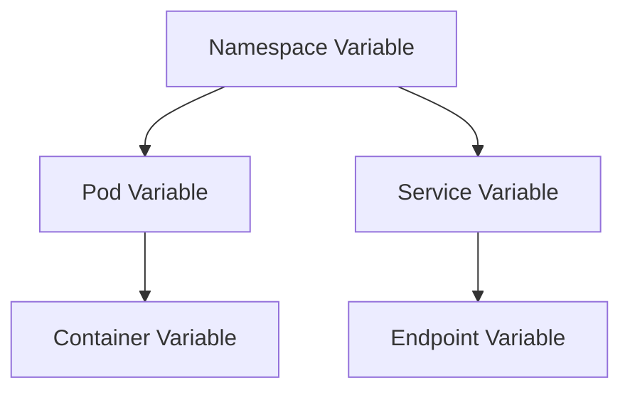

# How to Create Dashboard Variables Based on Other Variables in Grafana

Author: [nawazdhandala](https://www.github.com/nawazdhandala)

Tags: Grafana, Dashboard, Variables, Prometheus, Monitoring, PromQL

Description: Learn how to create chained and dependent dashboard variables in Grafana where one variable's options are filtered based on another variable's selection. This guide covers cascading dropdowns, dynamic filtering, and best practices for interactive dashboards.

Interactive dashboards in Grafana become significantly more powerful when variables depend on each other. Instead of showing every possible option, you can create cascading dropdowns where selecting a namespace filters the available pods, or selecting a region filters available services. This guide shows you how to build these dependent variable relationships.

## Understanding Variable Dependencies

When you reference one variable in another variable's query, Grafana automatically establishes a dependency. Changes to the parent variable trigger a refresh of the dependent variable's options.



## Basic Chained Variables

### Namespace to Pod Filtering

First, create a namespace variable:

**Variable: namespace**
- Type: Query
- Data source: Prometheus
- Query: `label_values(kube_pod_info, namespace)`

Then create a pod variable that filters by the selected namespace:

**Variable: pod**
- Type: Query
- Data source: Prometheus
- Query: `label_values(kube_pod_info{namespace="$namespace"}, pod)`

When you change the namespace selection, the pod dropdown automatically updates to show only pods in that namespace.

### Region to Service Filtering

For multi-region deployments:

**Variable: region**
```promql
label_values(up{job="api-server"}, region)
```

**Variable: service**
```promql
label_values(up{region="$region"}, job)
```

**Variable: instance**
```promql
label_values(up{region="$region", job="$service"}, instance)
```

## Multi-Level Cascading Variables

Create deeper hierarchies for complex environments:

### Environment -> Namespace -> Deployment -> Pod

**Variable: environment**
```promql
label_values(kube_namespace_labels, label_environment)
```

**Variable: namespace**
```promql
label_values(kube_namespace_labels{label_environment="$environment"}, namespace)
```

**Variable: deployment**
```promql
label_values(kube_deployment_labels{namespace="$namespace"}, deployment)
```

**Variable: pod**
```promql
label_values(kube_pod_info{namespace="$namespace"}, pod)
```

Filter pods further if they have deployment labels:

```promql
label_values(
  kube_pod_labels{
    namespace="$namespace",
    label_app="$deployment"
  },
  pod
)
```

## Advanced Filtering Techniques

### Using Regex in Dependent Variables

Filter variable options using regex patterns from another variable:

**Variable: pod_pattern**
- Type: Text box
- Default: `.*`

**Variable: pod**
```promql
label_values(kube_pod_info{namespace="$namespace", pod=~"$pod_pattern"}, pod)
```

### Metric-Based Filtering

Filter options based on metric values, not just labels:

**Variable: active_pods** - Show only pods with recent activity
```promql
label_values(
  container_cpu_usage_seconds_total{
    namespace="$namespace"
  } offset 5m,
  pod
)
```

### Query-Based Dynamic Options

Use a query result to populate options:

**Variable: high_cpu_pods**
```promql
query_result(
  topk(10,
    sum(rate(container_cpu_usage_seconds_total{
      namespace="$namespace"
    }[5m])) by (pod)
  )
)
```

With regex to extract the pod name:
- Regex: `/pod="([^"]+)"/`

## Handling Multi-Value Variables

### Parent Variable with Multi-Select

When the parent variable allows multiple selections:

**Variable: namespaces** (multi-value enabled)
```promql
label_values(kube_namespace_labels, namespace)
```

**Variable: pods**
```promql
label_values(kube_pod_info{namespace=~"$namespaces"}, pod)
```

Note the `=~` regex match operator instead of `=` for multi-value support.

### All Option Handling

When "Include All option" is enabled, handle it in dependent queries:

**Variable: namespace** with All option
- Custom all value: `.*`

**Variable: pod**
```promql
label_values(kube_pod_info{namespace=~"$namespace"}, pod)
```

The regex match works whether a single value or `.*` (all) is selected.

## Variable Refresh Strategies

### On Dashboard Load

Set dependent variables to refresh on dashboard load to ensure consistency:

- Refresh: On Dashboard Load

### On Time Range Change

For time-sensitive data:

- Refresh: On Time Range Change

This ensures the variable shows only options that have data in the selected time range.

### Chained Refresh Order

Grafana refreshes variables in definition order. Place parent variables before dependent ones:

1. `environment` (no dependencies)
2. `namespace` (depends on environment)
3. `deployment` (depends on namespace)
4. `pod` (depends on namespace, deployment)

## Practical Examples

### Kubernetes Cluster Explorer

Create a full cluster exploration hierarchy:

```yaml
# Variable definitions

# 1. Cluster
name: cluster
query: label_values(kube_node_info, cluster)

# 2. Node (filtered by cluster)
name: node
query: label_values(kube_node_info{cluster="$cluster"}, node)

# 3. Namespace (all namespaces in cluster)
name: namespace
query: label_values(kube_pod_info{cluster="$cluster"}, namespace)

# 4. Workload Type
name: workload_type
type: custom
options: Deployment,StatefulSet,DaemonSet,Job

# 5. Workload Name (filtered by namespace and type)
name: workload
query: |
  label_values(
    kube_${workload_type:raw}_labels{namespace="$namespace"},
    ${workload_type:raw}
  )

# 6. Pod (filtered by namespace and workload)
name: pod
query: |
  label_values(
    kube_pod_labels{
      namespace="$namespace",
      label_app="$workload"
    },
    pod
  )
```

### Database Monitoring Dashboard

```yaml
# 1. Database Cluster
name: db_cluster
query: label_values(pg_up, cluster)

# 2. Database Instance
name: db_instance
query: label_values(pg_up{cluster="$db_cluster"}, instance)

# 3. Database Name
name: database
query: label_values(pg_database_size_bytes{instance="$db_instance"}, datname)

# 4. Table (for specific database)
name: table
query: |
  label_values(
    pg_stat_user_tables_n_live_tup{
      instance="$db_instance",
      datname="$database"
    },
    relname
  )
```

### Application Tracing Dashboard

```yaml
# 1. Service
name: service
query: label_values(traces_spanmetrics_calls_total, service_name)

# 2. Operation (filtered by service)
name: operation
query: |
  label_values(
    traces_spanmetrics_calls_total{service_name="$service"},
    span_name
  )

# 3. Status Code (filtered by service and operation)
name: status_code
query: |
  label_values(
    traces_spanmetrics_calls_total{
      service_name="$service",
      span_name="$operation"
    },
    status_code
  )
```

## Using Variables in Panels

Reference the chained variables in your panel queries:

```promql
# CPU usage for selected pod hierarchy
sum(rate(container_cpu_usage_seconds_total{
  namespace="$namespace",
  pod="$pod"
}[5m])) by (container)

# Request rate for selected service/operation
sum(rate(traces_spanmetrics_calls_total{
  service_name="$service",
  span_name="$operation"
}[5m]))
```

## Troubleshooting Common Issues

### Variable Shows No Options

Check that:
1. The parent variable has a valid selection
2. The metric exists with the label combination
3. Data exists in the selected time range

Debug by running the query directly:
```promql
label_values(kube_pod_info{namespace="production"}, pod)
```

### Circular Dependencies

Avoid circular references where variable A depends on B and B depends on A. Grafana will fail to resolve them.

### Stale Options After Parent Change

Ensure dependent variables have refresh set appropriately:
- "On Dashboard Load" for initial consistency
- "On Time Range Change" for time-sensitive data

### Performance with Large Option Sets

For environments with thousands of pods:

1. Add regex filters to limit results
2. Use recording rules to pre-aggregate options
3. Consider custom variable types with static lists

```promql
# Limit to first 100 matching pods
label_values(kube_pod_info{namespace="$namespace", pod=~"api-.*"}[100], pod)
```

## Best Practices

1. **Order matters**: Define parent variables before dependent ones
2. **Use All option wisely**: Set custom all values that work with regex matches
3. **Provide defaults**: Set default values to ensure panels load correctly
4. **Document dependencies**: Add descriptions explaining variable relationships
5. **Test edge cases**: Verify behavior when parent has no selection or All is selected
6. **Consider caching**: Use appropriate refresh settings to balance freshness and performance

## Conclusion

Chained variables transform static dashboards into interactive exploration tools. By establishing dependencies between variables, you create intuitive drill-down experiences that help users navigate complex environments efficiently. The key is understanding how Grafana processes variable dependencies and using the right query patterns to filter options dynamically.

Start with simple two-level hierarchies and expand as needed. Well-designed variable relationships make dashboards self-service tools that users can navigate without deep knowledge of your metrics structure.
