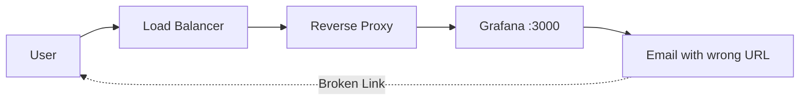
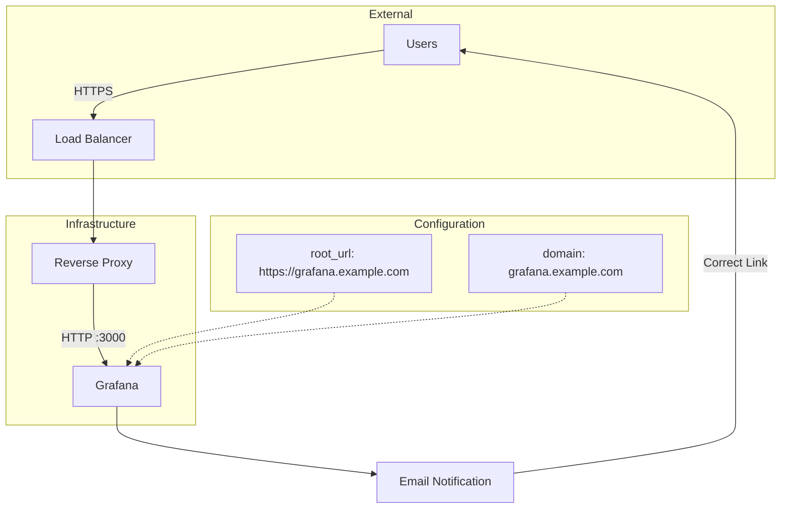

# How to Configure Grafana Email URL with root_url

Author: [nawazdhandala](https://www.github.com/nawazdhandala)

Tags: Grafana, Configuration, Email Alerts, Notifications, DevOps

Description: Learn how to properly configure Grafana's root_url setting to ensure email notifications contain correct dashboard links. This guide covers configuration options, reverse proxy setups, and troubleshooting common issues.

---

When Grafana sends alert notifications via email, the included dashboard links must point to the correct URL. If you are running Grafana behind a reverse proxy, load balancer, or using a custom domain, the default links will be broken. The `root_url` setting fixes this problem. This guide shows you how to configure it correctly.

## Understanding the Problem

By default, Grafana constructs URLs based on how it sees incoming requests. When behind a proxy, this often results in:

- Links pointing to `http://localhost:3000` instead of your public URL
- Incorrect protocol (HTTP instead of HTTPS)
- Missing path prefixes (e.g., `/grafana/`)
- Wrong domain names



## The root_url Setting

The `root_url` setting tells Grafana what URL users will use to access it. This URL is used for:

- Email notification links
- OAuth callback URLs
- Image rendering URLs
- API documentation links

### Basic Configuration

Edit your Grafana configuration file (`grafana.ini` or `custom.ini`):

```ini
[server]
# The full public facing URL
root_url = https://grafana.example.com

# Protocol (http or https)
protocol = http

# The port Grafana listens on
http_port = 3000
```

### Configuration with Subpath

If Grafana is served under a subpath:

```ini
[server]
root_url = https://example.com/grafana/
serve_from_sub_path = true
```

## Configuration Methods

### Method 1: Configuration File

Location varies by installation:

- **Linux packages**: `/etc/grafana/grafana.ini`
- **Docker**: Mount custom `grafana.ini` or use environment variables
- **Helm**: Values file under `grafana.ini`

```ini
[server]
domain = grafana.example.com
root_url = https://grafana.example.com
```

### Method 2: Environment Variables

For Docker and Kubernetes deployments:

```bash
# Docker run
docker run -d \
  -e GF_SERVER_ROOT_URL=https://grafana.example.com \
  -e GF_SERVER_DOMAIN=grafana.example.com \
  grafana/grafana:latest
```

```yaml
# Kubernetes Deployment
apiVersion: apps/v1
kind: Deployment
metadata:
  name: grafana
spec:
  template:
    spec:
      containers:
        - name: grafana
          image: grafana/grafana:latest
          env:
            - name: GF_SERVER_ROOT_URL
              value: "https://grafana.example.com"
            - name: GF_SERVER_DOMAIN
              value: "grafana.example.com"
```

### Method 3: Helm Chart Values

```yaml
# values.yaml
grafana.ini:
  server:
    domain: grafana.example.com
    root_url: https://grafana.example.com
    serve_from_sub_path: false
```

## Complete Configuration Examples

### Standard HTTPS Setup

```ini
[server]
protocol = http
http_port = 3000
domain = grafana.example.com
root_url = https://grafana.example.com
cert_file =
cert_key =
```

### Behind Nginx Reverse Proxy

Nginx configuration:

```nginx
server {
    listen 443 ssl;
    server_name grafana.example.com;

    ssl_certificate /etc/ssl/certs/grafana.crt;
    ssl_certificate_key /etc/ssl/private/grafana.key;

    location / {
        proxy_pass http://localhost:3000;
        proxy_set_header Host $host;
        proxy_set_header X-Real-IP $remote_addr;
        proxy_set_header X-Forwarded-For $proxy_add_x_forwarded_for;
        proxy_set_header X-Forwarded-Proto $scheme;
    }
}
```

Grafana configuration:

```ini
[server]
domain = grafana.example.com
root_url = https://grafana.example.com
```

### With Subpath (/grafana/)

Nginx configuration:

```nginx
server {
    listen 443 ssl;
    server_name example.com;

    location /grafana/ {
        proxy_pass http://localhost:3000/;
        proxy_set_header Host $host;
        proxy_set_header X-Real-IP $remote_addr;
        proxy_set_header X-Forwarded-For $proxy_add_x_forwarded_for;
        proxy_set_header X-Forwarded-Proto $scheme;

        # Rewrite for subpath
        rewrite ^/grafana/(.*) /$1 break;
    }
}
```

Grafana configuration:

```ini
[server]
domain = example.com
root_url = https://example.com/grafana/
serve_from_sub_path = true
```

### Kubernetes Ingress Setup

```yaml
apiVersion: networking.k8s.io/v1
kind: Ingress
metadata:
  name: grafana
  annotations:
    nginx.ingress.kubernetes.io/rewrite-target: /
spec:
  rules:
    - host: grafana.example.com
      http:
        paths:
          - path: /
            pathType: Prefix
            backend:
              service:
                name: grafana
                port:
                  number: 3000
  tls:
    - hosts:
        - grafana.example.com
      secretName: grafana-tls
```

ConfigMap for Grafana:

```yaml
apiVersion: v1
kind: ConfigMap
metadata:
  name: grafana-config
data:
  grafana.ini: |
    [server]
    domain = grafana.example.com
    root_url = https://grafana.example.com
```

## Email Notification Configuration

Once `root_url` is set, configure SMTP for email alerts:

```ini
[smtp]
enabled = true
host = smtp.example.com:587
user = alerts@example.com
password = your-smtp-password
from_address = alerts@example.com
from_name = Grafana Alerts

[alerting]
enabled = true

[unified_alerting]
enabled = true
```

### Testing Email Links

1. Create a test alert rule
2. Trigger the alert
3. Check that email links point to the correct `root_url`

Example email link should be:
```
https://grafana.example.com/alerting/list
```

Not:
```
http://localhost:3000/alerting/list
```

## Additional Related Settings

### Domain Setting

```ini
[server]
# Used for cookie domain and other internal purposes
domain = grafana.example.com
```

### Enforce Domain

```ini
[server]
# Redirect requests to the correct domain
enforce_domain = true
```

### Static Root Path

For serving static assets:

```ini
[server]
static_root_path = public
```

## Architecture Diagram



## Troubleshooting

### Links Still Show localhost

1. Verify `root_url` is set correctly:
```bash
grep -i root_url /etc/grafana/grafana.ini
```

2. Check environment variables are not overriding:
```bash
env | grep GF_SERVER
```

3. Restart Grafana after changes:
```bash
sudo systemctl restart grafana-server
```

### Mixed Protocol (HTTP/HTTPS)

Ensure proxy headers are forwarded:

```ini
[server]
root_url = https://grafana.example.com

[security]
# Allow embedding from any origin
allow_embedding = true
```

### OAuth Callback Mismatch

OAuth providers require exact URL match. Ensure `root_url` matches:

```ini
[server]
root_url = https://grafana.example.com

[auth.google]
client_id = your-client-id
client_secret = your-secret
# Callback will be root_url + /login/google
```

### Subpath Not Working

Check both settings:

```ini
[server]
root_url = https://example.com/grafana/
serve_from_sub_path = true
```

And verify Nginx/proxy rewrite rules are correct.

## Quick Reference

| Setting | Purpose | Example |
|---------|---------|---------|
| `root_url` | Full public URL | `https://grafana.example.com` |
| `domain` | Cookie domain | `grafana.example.com` |
| `protocol` | Internal protocol | `http` |
| `http_port` | Internal port | `3000` |
| `serve_from_sub_path` | Enable subpath serving | `true` |

## Docker Compose Example

Complete setup with reverse proxy:

```yaml
version: "3.8"
services:
  grafana:
    image: grafana/grafana:latest
    environment:
      - GF_SERVER_ROOT_URL=https://grafana.example.com
      - GF_SERVER_DOMAIN=grafana.example.com
      - GF_SMTP_ENABLED=true
      - GF_SMTP_HOST=smtp.example.com:587
      - GF_SMTP_USER=alerts@example.com
      - GF_SMTP_PASSWORD=secret
    volumes:
      - grafana-data:/var/lib/grafana
    networks:
      - monitoring

  nginx:
    image: nginx:alpine
    ports:
      - "443:443"
    volumes:
      - ./nginx.conf:/etc/nginx/nginx.conf
      - ./certs:/etc/ssl/certs
    networks:
      - monitoring

volumes:
  grafana-data:

networks:
  monitoring:
```

## Summary

Configuring `root_url` correctly ensures:

1. **Email links work** - Notification emails contain valid dashboard URLs
2. **OAuth functions** - Callback URLs match your configuration
3. **Image rendering** - Rendered images use correct URLs
4. **API documentation** - Links in API docs are accurate

Key steps:
1. Set `root_url` to your public-facing URL
2. Enable `serve_from_sub_path` if using a path prefix
3. Configure your reverse proxy to forward appropriate headers
4. Restart Grafana and test email notifications

With proper `root_url` configuration, your Grafana alert emails will contain clickable links that take users directly to the relevant dashboards.
