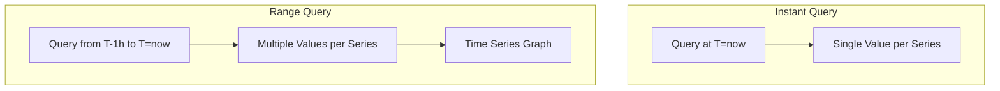

# How to Understand the "Instant" Checkbox in Grafana

Author: [nawazdhandala](https://www.github.com/nawazdhandala)

Tags: Grafana, Prometheus, PromQL, Queries, Instant, Range, Monitoring

Description: Learn what the "Instant" checkbox does in Grafana panel queries. This guide explains the difference between instant and range queries, when to use each type, and how they affect your dashboard visualizations and performance.

The "Instant" checkbox in Grafana's query editor is a small but powerful option that fundamentally changes how your query executes against Prometheus. Understanding when to use instant versus range queries is essential for building accurate and performant dashboards.

## What is an Instant Query?

An instant query returns the most recent value for each time series at a single point in time. In contrast, a range query returns values across a time window.



## The Technical Difference

### Instant Query

When "Instant" is checked, Grafana sends a request to the `/api/v1/query` endpoint:

```bash
# Instant query - single point in time
curl "http://prometheus:9090/api/v1/query?query=up&time=1704067200"

# Response: Single value per series
{
  "status": "success",
  "data": {
    "resultType": "vector",
    "result": [
      {
        "metric": {"instance": "app:8080", "job": "api"},
        "value": [1704067200, "1"]
      }
    ]
  }
}
```

### Range Query

When "Instant" is unchecked (default), Grafana sends a request to the `/api/v1/query_range` endpoint:

```bash
# Range query - multiple points over time
curl "http://prometheus:9090/api/v1/query_range?query=up&start=1704063600&end=1704067200&step=60"

# Response: Multiple values per series
{
  "status": "success",
  "data": {
    "resultType": "matrix",
    "result": [
      {
        "metric": {"instance": "app:8080", "job": "api"},
        "values": [
          [1704063600, "1"],
          [1704063660, "1"],
          [1704063720, "0"],
          ...
        ]
      }
    ]
  }
}
```

## When to Use Instant Queries

### Stat Panels

Stat panels display a single value. Instant queries are ideal:

```promql
# Current number of running pods
count(kube_pod_info{phase="Running"})

# Current memory usage
sum(container_memory_working_set_bytes{namespace="production"})

# Uptime percentage right now
avg(up{job="api-server"}) * 100
```

### Gauge Panels

Gauges show current state against thresholds:

```promql
# Current CPU usage percentage
100 - (avg(rate(node_cpu_seconds_total{mode="idle"}[5m])) * 100)

# Current disk usage percentage
100 * (1 - node_filesystem_avail_bytes / node_filesystem_size_bytes)
```

### Table Panels (Current Values)

Tables showing current state benefit from instant queries:

```promql
# Current pod status
kube_pod_status_phase == 1

# Current consumer lag
kafka_consumergroup_lag

# Current connection counts
pg_stat_activity_count
```

### Alert Status Panels

When displaying whether alerts are firing:

```promql
# Check if any alerts are firing
ALERTS{alertstate="firing"}
```

## When to Use Range Queries

### Time Series Graphs

Graphs need historical data points:

```promql
# Request rate over time
rate(http_requests_total[5m])

# Memory usage trend
container_memory_working_set_bytes

# Error rate over time
sum(rate(http_requests_total{status=~"5.."}[5m])) by (service)
```

### Heatmaps

Heatmaps visualize distributions over time:

```promql
# Request duration distribution
sum(rate(http_request_duration_seconds_bucket[5m])) by (le)
```

### Sparklines

Even small inline graphs need range data:

```promql
# Mini CPU trend
rate(container_cpu_usage_seconds_total[1m])
```

## Performance Implications

### Instant Query Performance

Instant queries are faster because they:
- Return only one data point per series
- Require less memory
- Transfer less data

```promql
# Fast - single value
count(kube_pod_info)  # Instant

# Slower - returns 1000s of points
count(kube_pod_info)  # Range over 24h with 15s step
```

### When Range Queries are Necessary

Some queries require range data even for current values:

```promql
# rate() needs range data
rate(http_requests_total[5m])  # Won't work as instant without [5m]

# increase() needs range data
increase(http_requests_total[1h])

# Aggregation over time
avg_over_time(node_load1[1h])
```

## Common Mistakes

### Mistake 1: Using Instant for Graphs

```promql
# Panel: Time Series Graph
# Query: rate(http_requests_total[5m])
# Instant: Checked  <-- WRONG

# Result: Only shows a single point, not a line
```

**Fix:** Uncheck "Instant" for time series visualizations.

### Mistake 2: Using Range for Stat Panels

```promql
# Panel: Stat
# Query: count(up)
# Instant: Unchecked  <-- Suboptimal

# Result: Works but fetches unnecessary data
```

**Fix:** Check "Instant" for stat panels to improve performance.

### Mistake 3: Instant with Functions Requiring Ranges

```promql
# Query: rate(http_requests_total)
# Instant: Checked

# Error: "bad_data" - rate requires a range selector
```

**Fix:** Include a range selector even with instant: `rate(http_requests_total[5m])`

## Query Type by Visualization

| Visualization | Recommended Query Type | Reason |
|--------------|----------------------|--------|
| Time Series | Range | Needs multiple points for graph |
| Stat | Instant | Only needs current value |
| Gauge | Instant | Shows single current value |
| Bar Gauge | Instant | Current values per category |
| Table (current) | Instant | Current state listing |
| Table (history) | Range | Historical data needed |
| Heatmap | Range | Distribution over time |
| Pie Chart | Instant | Current proportions |
| Logs | Range | Need time-based log entries |

## Grafana Configuration

### Setting Query Type per Panel

In the query editor:

1. Open the panel editor
2. Scroll to the query section
3. Find the "Instant" toggle
4. Enable for single-point queries

### Query Options

Additional settings that interact with query type:

```yaml
# Range query settings
Min interval: 15s    # Minimum step between points
Max data points: 1000  # Maximum points to request

# Instant query settings
# These are ignored when Instant is checked
```

### Mixed Mode

Some panels support both query types:

```yaml
# Query A: Range (for graph)
rate(http_requests_total[5m])
Instant: false

# Query B: Instant (for current value annotation)
sum(rate(http_requests_total[5m]))
Instant: true
```

## Advanced Usage

### Dynamic Query Type with Variables

Use variables to control query behavior:

```promql
# Variable: $query_type (custom: instant, range)

# In panel query, adjust based on panel type
# (This is handled automatically by panel type in practice)
```

### Recording Rules for Instant Queries

Pre-compute values for faster instant queries:

```yaml
groups:
  - name: precomputed
    rules:
      - record: job:http_request_rate:5m
        expr: sum(rate(http_requests_total[5m])) by (job)

      - record: namespace:pod_count:total
        expr: count(kube_pod_info) by (namespace)
```

Then query with instant:

```promql
# Fast instant query using pre-computed value
job:http_request_rate:5m{job="api-server"}
```

### Transformations with Instant Data

Grafana transformations work with instant query results:

```yaml
# Instant query returns current values
Query: kube_pod_container_resource_limits{resource="memory"}
Instant: true

# Transformation: Group by namespace, sum values
Transform: Group by (namespace) -> Calculate (sum)
```

## Debugging Query Types

### Check What Grafana Sends

Open browser developer tools:

1. Network tab
2. Filter by "query"
3. Inspect the request URL

Instant query:
```
/api/v1/query?query=up&time=1704067200
```

Range query:
```
/api/v1/query_range?query=up&start=1704063600&end=1704067200&step=60
```

### Query Inspector

Use Grafana's Query Inspector:

1. Open panel editor
2. Click "Query Inspector"
3. View "Request" tab to see query type

## Best Practices

1. **Match query type to visualization** - Use instant for single-value displays, range for graphs

2. **Optimize dashboards** - Switch stat panels to instant queries for faster load times

3. **Include range selectors** - Even instant queries need `[5m]` for rate-based functions

4. **Use recording rules** - Pre-compute frequently queried instant values

5. **Consider data resolution** - Range queries with high resolution can be slow; adjust step/interval

## Conclusion

The "Instant" checkbox is a fundamental control that determines whether Grafana fetches a single current value or a time series of values. Understanding this distinction helps you:

- Build accurate visualizations that match your data requirements
- Optimize dashboard performance by using instant queries where appropriate
- Avoid common errors with rate functions and range selectors
- Debug query issues by understanding the underlying API calls

When in doubt, match the query type to your visualization: instant for current-state displays (stats, gauges, tables) and range for time-based visualizations (graphs, heatmaps).
