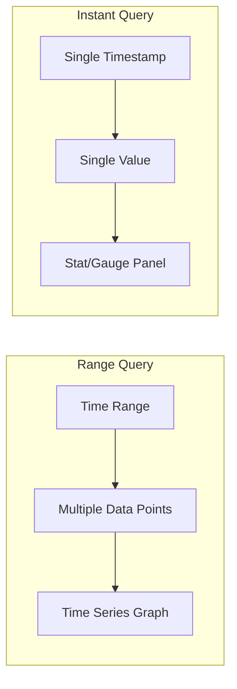

# How to Get Grafana Instant Query Working for Prometheus

Author: [nawazdhandala](https://www.github.com/nawazdhandala)

Tags: Grafana, Prometheus, PromQL, Queries, Performance

Description: Learn how to configure and troubleshoot instant queries in Grafana for Prometheus datasources, including query options, time parameters, and common issues with single-value metrics.

---

Instant queries in Prometheus return a single value at a specific point in time, unlike range queries that return values over a time window. Grafana can use instant queries for stat panels, gauges, and tables, but configuration requires understanding how the query type affects results.

## Understanding Query Types

Prometheus supports two query types with different use cases.



Range queries: `/api/v1/query_range?query=...&start=...&end=...&step=...`
Instant queries: `/api/v1/query?query=...&time=...`

## 1. Configure Instant Query in Panel

Enable instant query in the Grafana panel query options.

In the query editor, expand Query Options and enable Instant:

```
Query: up{job="prometheus"}
Options:
  - Instant: ON
  - Format: Table (or Time series)
```

For the JSON model:

```json
{
  "targets": [
    {
      "datasource": {
        "type": "prometheus",
        "uid": "prometheus"
      },
      "expr": "up{job=\"prometheus\"}",
      "instant": true,
      "range": false,
      "refId": "A"
    }
  ]
}
```

## 2. Choose the Right Panel Type

Instant queries work best with specific panel types.

| Panel Type | Query Type | Use Case |
|------------|------------|----------|
| Stat | Instant | Single current value |
| Gauge | Instant | Current value with thresholds |
| Table | Instant | Multiple current values |
| Time series | Range | Values over time |
| Bar gauge | Instant | Comparing current values |

Configure a stat panel with instant query:

```json
{
  "type": "stat",
  "title": "Current Request Rate",
  "targets": [
    {
      "expr": "sum(rate(http_requests_total[5m]))",
      "instant": true,
      "refId": "A"
    }
  ],
  "options": {
    "reduceOptions": {
      "values": false,
      "calcs": ["lastNotNull"],
      "fields": ""
    },
    "orientation": "auto",
    "textMode": "auto",
    "colorMode": "value",
    "graphMode": "area"
  }
}
```

## 3. Handle Time Parameter

Instant queries use the dashboard time range end time by default. Override with query options.

```json
{
  "targets": [
    {
      "expr": "up",
      "instant": true,
      "refId": "A"
    }
  ],
  "timeFrom": null,
  "timeShift": null
}
```

To query at a specific relative time:

```promql
# Query value from 1 hour ago
up offset 1h

# Query value from start of day
up @ start()
```

## 4. Format Results for Tables

When using instant queries with tables, configure column formatting.

```json
{
  "type": "table",
  "targets": [
    {
      "expr": "sum by (instance, job) (up)",
      "instant": true,
      "format": "table",
      "refId": "A"
    }
  ],
  "transformations": [
    {
      "id": "organize",
      "options": {
        "excludeByName": {
          "Time": true
        },
        "renameByName": {
          "Value": "Status",
          "instance": "Instance",
          "job": "Job"
        }
      }
    }
  ],
  "fieldConfig": {
    "defaults": {
      "mappings": [
        {
          "type": "value",
          "options": {
            "1": {"text": "UP", "color": "green"},
            "0": {"text": "DOWN", "color": "red"}
          }
        }
      ]
    }
  }
}
```

## 5. Troubleshoot Empty Results

When instant queries return no data, check these common issues.

### Issue: Stale Metric

If the metric has not been scraped recently, instant query returns nothing.

```promql
# Check when metric was last scraped
timestamp(up{job="myapp"})

# Use a range vector in the instant query
last_over_time(up{job="myapp"}[5m])
```

### Issue: Wrong Time Window

The instant query time might be outside the metric's existence.

```bash
# Debug by querying the API directly
curl 'http://prometheus:9090/api/v1/query?query=up&time=2024-01-01T00:00:00Z'

# Compare with current time
curl 'http://prometheus:9090/api/v1/query?query=up'
```

### Issue: Range Vector Required

Some functions require range vectors even for instant queries.

```promql
# Wrong - rate needs a range
rate(http_requests_total)

# Correct - provide range even for instant query
rate(http_requests_total[5m])
```

## 6. Mixed Range and Instant Queries

Combine both query types in a single dashboard.

```json
{
  "panels": [
    {
      "type": "timeseries",
      "title": "Request Rate Over Time",
      "targets": [
        {
          "expr": "sum(rate(http_requests_total[5m]))",
          "instant": false,
          "range": true,
          "refId": "A"
        }
      ]
    },
    {
      "type": "stat",
      "title": "Current Rate",
      "targets": [
        {
          "expr": "sum(rate(http_requests_total[5m]))",
          "instant": true,
          "range": false,
          "refId": "A"
        }
      ]
    }
  ]
}
```

## 7. Variable Queries with Instant

Use instant queries for template variable population.

```yaml
# Variable configuration
name: instances
type: query
datasource: Prometheus
query: label_values(up, instance)
refresh: On Dashboard Load
```

For metric-value based variables:

```promql
# Get current values for dropdown
query_result(sum by (service) (up))
```

## 8. Instant Query Performance

Instant queries are faster than range queries for current values.

```promql
# Fast - instant query
sum(up)

# Slower - range query processed for single value
sum_over_time(up[1h])
```

Configure query caching for frequently accessed instant queries:

```ini
# grafana.ini
[caching]
enabled = true

# For Prometheus datasource
[datasources.prometheus]
query_caching_enabled = true
query_caching_ttl = 30s
```

## 9. Alert Rule Instant Queries

Grafana alerting uses instant queries by default.

```yaml
# Alert rule definition
apiVersion: 1
groups:
  - orgId: 1
    name: availability
    folder: alerts
    interval: 1m
    rules:
      - uid: service-down
        title: Service Down
        condition: C
        data:
          - refId: A
            datasourceUid: prometheus
            model:
              expr: up{job="myapp"}
              instant: true
              intervalMs: 1000
              maxDataPoints: 43200
          - refId: C
            datasourceUid: __expr__
            model:
              conditions:
                - evaluator:
                    params: [1]
                    type: lt
                  operator:
                    type: and
                  query:
                    params: [A]
                  reducer:
                    type: last
              refId: C
              type: classic_conditions
        for: 5m
        annotations:
          summary: "Service {{ $labels.instance }} is down"
```

## 10. API Direct Query Testing

Test instant queries directly against Prometheus API.

```bash
# Instant query at current time
curl -s 'http://prometheus:9090/api/v1/query' \
  --data-urlencode 'query=sum(rate(http_requests_total[5m]))' | jq .

# Instant query at specific time
curl -s 'http://prometheus:9090/api/v1/query' \
  --data-urlencode 'query=up' \
  --data-urlencode 'time=2024-12-17T12:00:00Z' | jq .

# Compare with range query
curl -s 'http://prometheus:9090/api/v1/query_range' \
  --data-urlencode 'query=up' \
  --data-urlencode 'start=2024-12-17T11:00:00Z' \
  --data-urlencode 'end=2024-12-17T12:00:00Z' \
  --data-urlencode 'step=60s' | jq .
```

## 11. Recording Rules for Instant Queries

Pre-compute values for faster instant query access.

```yaml
# prometheus recording rules
groups:
  - name: request_rates
    interval: 15s
    rules:
      - record: job:http_requests:rate5m
        expr: sum by (job) (rate(http_requests_total[5m]))

      - record: instance:memory_usage:ratio
        expr: |
          (node_memory_MemTotal_bytes - node_memory_MemAvailable_bytes)
          / node_memory_MemTotal_bytes
```

Query the recording rule with instant query:

```promql
# Fast instant query on pre-computed metric
job:http_requests:rate5m{job="api"}
```

## 12. Grafana Query Inspector

Debug instant queries using the Query Inspector.

1. Open the panel editor
2. Click Query Inspector in the query tab
3. Check the Request tab for the exact API call
4. Verify Response tab shows expected data

Expected instant query request:

```json
{
  "queries": [
    {
      "refId": "A",
      "instant": true,
      "range": false,
      "expr": "sum(rate(http_requests_total[5m]))",
      "datasource": {
        "type": "prometheus",
        "uid": "prometheus"
      }
    }
  ],
  "from": "now-1h",
  "to": "now"
}
```

Expected response structure:

```json
{
  "results": {
    "A": {
      "frames": [
        {
          "schema": {
            "fields": [
              {"name": "Time", "type": "time"},
              {"name": "Value", "type": "number"}
            ]
          },
          "data": {
            "values": [
              [1702828800000],
              [1234.56]
            ]
          }
        }
      ]
    }
  }
}
```

---

Instant queries provide efficient single-point-in-time metric access, ideal for stat panels, gauges, and current state displays. Understanding when Grafana sends instant versus range queries, and how to configure each panel type, ensures your dashboards display accurate real-time data without unnecessary query overhead.
