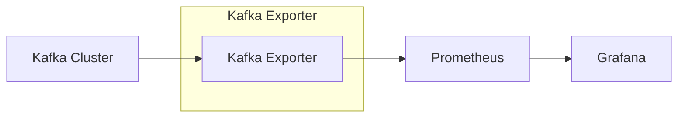

# How to Add Kafka Exporter as Data Source in Grafana

Author: [nawazdhandala](https://www.github.com/nawazdhandala)

Tags: Grafana, Kafka, Prometheus, Monitoring, Metrics, Data Source, Exporter

Description: Learn how to set up Kafka Exporter to collect Kafka metrics and add them as a data source in Grafana. This guide covers exporter deployment, Prometheus configuration, and building effective Kafka monitoring dashboards.

Monitoring Apache Kafka is essential for maintaining reliable event streaming infrastructure. The Kafka Exporter exposes Kafka metrics in Prometheus format, which can then be visualized in Grafana. This guide walks you through the complete setup process from deploying the exporter to creating monitoring dashboards.

## Architecture Overview

Kafka Exporter connects to your Kafka cluster, collects metrics about topics, partitions, consumer groups, and broker health, then exposes them on an HTTP endpoint for Prometheus to scrape.



## Deploying Kafka Exporter

### Docker Deployment

The simplest way to run Kafka Exporter:

```bash
docker run -d \
  --name kafka-exporter \
  -p 9308:9308 \
  danielqsj/kafka-exporter:latest \
  --kafka.server=kafka-broker-1:9092 \
  --kafka.server=kafka-broker-2:9092 \
  --kafka.server=kafka-broker-3:9092
```

### Kubernetes Deployment

Deploy Kafka Exporter in your Kubernetes cluster:

```yaml
apiVersion: apps/v1
kind: Deployment
metadata:
  name: kafka-exporter
  namespace: monitoring
spec:
  replicas: 1
  selector:
    matchLabels:
      app: kafka-exporter
  template:
    metadata:
      labels:
        app: kafka-exporter
      annotations:
        prometheus.io/scrape: "true"
        prometheus.io/port: "9308"
    spec:
      containers:
        - name: kafka-exporter
          image: danielqsj/kafka-exporter:latest
          args:
            - --kafka.server=kafka-0.kafka-headless.kafka.svc.cluster.local:9092
            - --kafka.server=kafka-1.kafka-headless.kafka.svc.cluster.local:9092
            - --kafka.server=kafka-2.kafka-headless.kafka.svc.cluster.local:9092
            - --topic.filter=^[^_].*
            - --group.filter=.*
          ports:
            - containerPort: 9308
              name: metrics
          resources:
            requests:
              memory: "64Mi"
              cpu: "100m"
            limits:
              memory: "128Mi"
              cpu: "200m"
---
apiVersion: v1
kind: Service
metadata:
  name: kafka-exporter
  namespace: monitoring
  labels:
    app: kafka-exporter
spec:
  ports:
    - port: 9308
      targetPort: 9308
      name: metrics
  selector:
    app: kafka-exporter
```

### Configuration Options

Key command-line flags for Kafka Exporter:

```bash
# Kafka connection
--kafka.server=broker:9092           # Kafka broker address (can specify multiple)
--kafka.version=2.8.0               # Kafka version

# Authentication
--sasl.enabled                       # Enable SASL authentication
--sasl.username=user                 # SASL username
--sasl.password=pass                 # SASL password
--sasl.mechanism=SCRAM-SHA-512      # SASL mechanism

# TLS
--tls.enabled                        # Enable TLS
--tls.ca-file=/path/to/ca.pem       # CA certificate
--tls.cert-file=/path/to/cert.pem   # Client certificate
--tls.key-file=/path/to/key.pem     # Client key

# Filtering
--topic.filter=^[^_].*              # Regex to filter topics (exclude internal)
--group.filter=.*                    # Regex to filter consumer groups

# Metrics options
--offset.show-all                    # Show all consumer group offsets
--concurrent.enable                  # Enable concurrent scraping
```

### Authenticated Kafka Clusters

For SASL/TLS secured clusters:

```yaml
# Kubernetes Secret for credentials
apiVersion: v1
kind: Secret
metadata:
  name: kafka-exporter-auth
  namespace: monitoring
type: Opaque
stringData:
  username: kafka-exporter
  password: your-secure-password
---
apiVersion: apps/v1
kind: Deployment
metadata:
  name: kafka-exporter
spec:
  template:
    spec:
      containers:
        - name: kafka-exporter
          args:
            - --kafka.server=kafka-broker:9092
            - --sasl.enabled
            - --sasl.mechanism=SCRAM-SHA-512
            - --sasl.username=$(KAFKA_USERNAME)
            - --sasl.password=$(KAFKA_PASSWORD)
            - --tls.enabled
            - --tls.insecure-skip-tls-verify
          env:
            - name: KAFKA_USERNAME
              valueFrom:
                secretKeyRef:
                  name: kafka-exporter-auth
                  key: username
            - name: KAFKA_PASSWORD
              valueFrom:
                secretKeyRef:
                  name: kafka-exporter-auth
                  key: password
```

## Configuring Prometheus

Add Kafka Exporter as a scrape target in Prometheus:

### Static Configuration

```yaml
# prometheus.yml
scrape_configs:
  - job_name: 'kafka-exporter'
    static_configs:
      - targets: ['kafka-exporter:9308']
    relabel_configs:
      - source_labels: [__address__]
        target_label: instance
        regex: '([^:]+):\d+'
        replacement: '${1}'
```

### Kubernetes Service Discovery

```yaml
scrape_configs:
  - job_name: 'kafka-exporter'
    kubernetes_sd_configs:
      - role: service
        namespaces:
          names:
            - monitoring
    relabel_configs:
      - source_labels: [__meta_kubernetes_service_name]
        action: keep
        regex: kafka-exporter
      - source_labels: [__meta_kubernetes_namespace]
        target_label: namespace
```

### ServiceMonitor (Prometheus Operator)

```yaml
apiVersion: monitoring.coreos.com/v1
kind: ServiceMonitor
metadata:
  name: kafka-exporter
  namespace: monitoring
spec:
  selector:
    matchLabels:
      app: kafka-exporter
  endpoints:
    - port: metrics
      interval: 30s
      scrapeTimeout: 10s
  namespaceSelector:
    matchNames:
      - monitoring
```

## Adding to Grafana

### Step 1: Configure Prometheus Data Source

If not already configured, add Prometheus as a data source in Grafana:

1. Go to Configuration > Data Sources
2. Click "Add data source"
3. Select "Prometheus"
4. Configure the connection:

```yaml
Name: Prometheus
URL: http://prometheus:9090
Access: Server (default)
```

5. Click "Save & Test"

### Step 2: Import Kafka Dashboard

Import a pre-built Kafka dashboard:

1. Go to Create > Import
2. Enter dashboard ID: `7589` (popular Kafka Exporter dashboard)
3. Select your Prometheus data source
4. Click "Import"

### Step 3: Create Custom Panels

Build custom panels with these useful queries:

**Consumer Lag by Group**
```promql
sum(kafka_consumergroup_lag) by (consumergroup, topic)
```

**Messages Per Second by Topic**
```promql
sum(rate(kafka_topic_partition_current_offset[5m])) by (topic) * 60
```

**Partition Count by Topic**
```promql
count(kafka_topic_partition_current_offset) by (topic)
```

## Essential Kafka Metrics

### Consumer Group Metrics

```promql
# Consumer group lag (messages behind)
kafka_consumergroup_lag{
  consumergroup="my-consumer-group",
  topic="my-topic"
}

# Consumer group current offset
kafka_consumergroup_current_offset{
  consumergroup="my-consumer-group"
}

# Total lag across all consumer groups
sum(kafka_consumergroup_lag) by (consumergroup)
```

### Topic Metrics

```promql
# Current offset (total messages) per topic
sum(kafka_topic_partition_current_offset) by (topic)

# Messages per second per topic
sum(rate(kafka_topic_partition_current_offset[5m])) by (topic)

# Partition distribution across topics
count(kafka_topic_partition_current_offset) by (topic)
```

### Broker Metrics

```promql
# Check if exporter can connect to brokers
kafka_brokers

# Topics per broker (via partition leaders)
count(kafka_topic_partition_leader) by (broker_id)
```

## Building a Kafka Dashboard

### Row 1: Overview Stats

```promql
# Panel: Total Topics
count(count(kafka_topic_partition_current_offset) by (topic))

# Panel: Total Partitions
count(kafka_topic_partition_current_offset)

# Panel: Consumer Groups
count(count(kafka_consumergroup_lag) by (consumergroup))

# Panel: Total Consumer Lag
sum(kafka_consumergroup_lag)
```

### Row 2: Consumer Lag

```promql
# Panel: Lag by Consumer Group (Graph)
sum(kafka_consumergroup_lag) by (consumergroup)

# Panel: Top 10 Lagging Consumers (Table)
topk(10, sum(kafka_consumergroup_lag) by (consumergroup, topic))
```

### Row 3: Throughput

```promql
# Panel: Messages/sec by Topic (Graph)
sum(rate(kafka_topic_partition_current_offset[5m])) by (topic) * 60

# Panel: Consumer Rate by Group (Graph)
sum(rate(kafka_consumergroup_current_offset[5m])) by (consumergroup) * 60
```

### Row 4: Partitions

```promql
# Panel: Partition Distribution (Bar Chart)
count(kafka_topic_partition_current_offset) by (topic)

# Panel: Under-Replicated Partitions
kafka_topic_partition_under_replicated_partition
```

## Alerting Rules

Set up alerts for Kafka issues:

```yaml
groups:
  - name: kafka_alerts
    rules:
      # High consumer lag alert
      - alert: KafkaConsumerLagHigh
        expr: sum(kafka_consumergroup_lag) by (consumergroup, topic) > 10000
        for: 5m
        labels:
          severity: warning
        annotations:
          summary: "High consumer lag detected"
          description: "Consumer group {{ $labels.consumergroup }} has {{ $value }} messages lag on topic {{ $labels.topic }}"

      # Consumer group not consuming
      - alert: KafkaConsumerGroupStalled
        expr: |
          sum(rate(kafka_consumergroup_current_offset[5m])) by (consumergroup) == 0
          and
          sum(kafka_consumergroup_lag) by (consumergroup) > 0
        for: 10m
        labels:
          severity: critical
        annotations:
          summary: "Consumer group stalled"
          description: "Consumer group {{ $labels.consumergroup }} has stopped consuming but has pending messages"

      # Kafka exporter down
      - alert: KafkaExporterDown
        expr: up{job="kafka-exporter"} == 0
        for: 2m
        labels:
          severity: critical
        annotations:
          summary: "Kafka Exporter is down"
          description: "Cannot scrape Kafka metrics - exporter may be disconnected from Kafka"
```

## Troubleshooting

### Exporter Not Starting

Check logs for connection issues:

```bash
docker logs kafka-exporter

# Common issues:
# - Wrong broker addresses
# - Network connectivity
# - Authentication failures
```

### Missing Metrics

Verify the exporter endpoint:

```bash
curl http://kafka-exporter:9308/metrics | grep kafka_

# Should see metrics like:
# kafka_brokers 3
# kafka_topic_partition_current_offset{...}
# kafka_consumergroup_lag{...}
```

### High Scrape Duration

If scraping is slow:

1. Enable concurrent scraping: `--concurrent.enable`
2. Filter topics: `--topic.filter=^important-.*`
3. Increase scrape timeout in Prometheus

### Lag Not Showing

Consumer lag only appears if:
- Consumer groups are active or have committed offsets
- The `--offset.show-all` flag captures all groups
- Topic filters include the relevant topics

## Conclusion

Kafka Exporter provides essential visibility into your Kafka infrastructure through Prometheus and Grafana. Key points to remember:

1. Deploy the exporter with appropriate Kafka connection settings
2. Configure Prometheus to scrape the exporter endpoint
3. Use Grafana to visualize consumer lag, throughput, and partition health
4. Set up alerts for lag thresholds and stalled consumers

With proper monitoring in place, you can proactively identify issues before they impact your event streaming applications.
