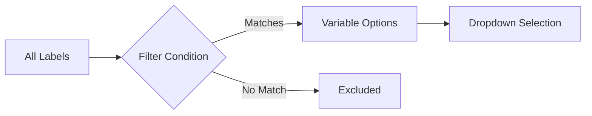

# How to Create Label Filters Based on Metric Results in Grafana

Author: [nawazdhandala](https://www.github.com/nawazdhandala)

Tags: Grafana, Prometheus, PromQL, Labels, Filters, Queries, Dashboard Variables

Description: Learn how to create dynamic label filters in Grafana that are populated based on metric query results. This guide covers advanced variable queries, subqueries, and techniques for building intelligent filtering that adapts to your data.

Standard Grafana variables show all possible label values. But what if you want to filter labels based on conditions - showing only pods with high CPU usage, or services that have errors? This guide shows how to create smart, data-driven label filters.

## The Challenge

Static label filters show all values:

```promql
# Shows ALL pods, even those without issues
label_values(kube_pod_info, pod)
```

Dynamic filters show only relevant values:

```promql
# Shows only pods with CPU > 80%
# (requires advanced techniques)
```



## Method 1: Using query_result()

The `query_result()` function in Grafana executes a PromQL query and extracts values using regex.

### Basic Syntax

```promql
# Variable query using query_result
query_result(your_promql_query)

# Regex to extract label value
/label_name="([^"]+)"/
```

### Example: Pods with High CPU

Create a variable showing only pods using more than 80% CPU:

**Variable Configuration:**
- Type: Query
- Data source: Prometheus
- Query:
```promql
query_result(
  sum(rate(container_cpu_usage_seconds_total{namespace="$namespace"}[5m])) by (pod)
  /
  sum(kube_pod_container_resource_limits{namespace="$namespace", resource="cpu"}) by (pod)
  > 0.8
)
```
- Regex: `/pod="([^"]+)"/`

### Example: Services with Errors

Show only services experiencing errors:

```promql
query_result(
  sum(rate(http_requests_total{status=~"5.."}[5m])) by (service)
  > 0
)
```
- Regex: `/service="([^"]+)"/`

### Example: Top N by Metric

Show top 10 pods by memory usage:

```promql
query_result(
  topk(10, sum(container_memory_working_set_bytes) by (namespace, pod))
)
```
- Regex: `/pod="([^"]+)"/`

## Method 2: Conditional label_values()

Use metric filters within `label_values()` to narrow results.

### Filter by Metric Existence

Show labels only where metric has recent data:

```promql
# Pods that have reported metrics in the last 5 minutes
label_values(container_cpu_usage_seconds_total{namespace="$namespace"}[5m], pod)
```

### Filter by Label Value

```promql
# Only production pods
label_values(kube_pod_info{namespace=~"prod-.*"}, pod)

# Only running pods
label_values(kube_pod_status_phase{phase="Running"}, pod)
```

### Filter by Another Metric

```promql
# Pods with memory limits set
label_values(kube_pod_container_resource_limits{resource="memory"}, pod)
```

## Method 3: Chained Variables with Filters

Create a chain where each variable filters the next.

### Step 1: Status Filter Variable

**Variable: status**
- Type: Custom
- Values: `All, Healthy, Warning, Critical`

### Step 2: Conditional Pod Variable

**Variable: pod**
```promql
# When status = "All"
label_values(kube_pod_info{namespace="$namespace"}, pod)

# When status = "Warning" - pods with high CPU
query_result(
  sum(rate(container_cpu_usage_seconds_total{namespace="$namespace"}[5m])) by (pod)
  /
  sum(kube_pod_container_resource_limits{resource="cpu", namespace="$namespace"}) by (pod)
  > 0.7 and < 0.9
)
```

Use Grafana's variable query options to switch based on another variable.

## Method 4: Recording Rules for Filter Data

Pre-compute filter conditions with recording rules.

### Create Recording Rules

```yaml
groups:
  - name: filter_helpers
    interval: 30s
    rules:
      # Pods with high CPU
      - record: pod:cpu_high:bool
        expr: |
          (
            sum(rate(container_cpu_usage_seconds_total[5m])) by (namespace, pod)
            /
            sum(kube_pod_container_resource_limits{resource="cpu"}) by (namespace, pod)
          ) > 0.8

      # Services with errors
      - record: service:has_errors:bool
        expr: |
          sum(rate(http_requests_total{status=~"5.."}[5m])) by (service) > 0

      # Pods with memory pressure
      - record: pod:memory_pressure:bool
        expr: |
          (
            sum(container_memory_working_set_bytes) by (namespace, pod)
            /
            sum(kube_pod_container_resource_limits{resource="memory"}) by (namespace, pod)
          ) > 0.85
```

### Use in Variables

```promql
# Variable: high_cpu_pods
label_values(pod:cpu_high:bool{namespace="$namespace"} == 1, pod)

# Variable: error_services
label_values(service:has_errors:bool == 1, service)
```

## Method 5: Grafana Transformations

Use transformations to filter data after query execution.

### Query with All Data

```promql
# Get all pods with their CPU percentage
sum(rate(container_cpu_usage_seconds_total{namespace="$namespace"}[5m])) by (pod)
/
sum(kube_pod_container_resource_limits{resource="cpu", namespace="$namespace"}) by (pod)
```

### Apply Filter Transformation

1. Add transformation: "Filter by value"
2. Filter type: "Number"
3. Condition: "Greater than"
4. Value: 0.8

### Extract Labels

Use "Extract fields" transformation to get pod names for a table or stat panel.

## Advanced Examples

### Anomaly-Based Filtering

Show only pods deviating from normal:

```promql
# Variable: anomalous_pods
query_result(
  (
    sum(rate(container_cpu_usage_seconds_total[5m])) by (pod)
    -
    avg_over_time(sum(rate(container_cpu_usage_seconds_total[5m])) by (pod)[1d:5m])
  )
  /
  stddev_over_time(sum(rate(container_cpu_usage_seconds_total[5m])) by (pod)[1d:5m])
  > 2
)
```
- Regex: `/pod="([^"]+)"/`

### Availability-Based Filtering

Show services below SLO:

```promql
# Variable: failing_slo_services
query_result(
  (
    sum(rate(http_requests_total{status=~"2.."}[1h])) by (service)
    /
    sum(rate(http_requests_total[1h])) by (service)
  ) < 0.995
)
```
- Regex: `/service="([^"]+)"/`

### Multi-Condition Filtering

Combine multiple conditions:

```promql
# Pods with high CPU AND high memory
query_result(
  (
    (
      sum(rate(container_cpu_usage_seconds_total[5m])) by (pod)
      /
      sum(kube_pod_container_resource_limits{resource="cpu"}) by (pod)
    ) > 0.8
  )
  and
  (
    (
      sum(container_memory_working_set_bytes) by (pod)
      /
      sum(kube_pod_container_resource_limits{resource="memory"}) by (pod)
    ) > 0.8
  )
)
```

## Complete Dashboard Example

### Variables Definition

```yaml
# Dashboard JSON - variables section
"templating": {
  "list": [
    {
      "name": "namespace",
      "type": "query",
      "query": "label_values(kube_pod_info, namespace)",
      "refresh": 2
    },
    {
      "name": "filter_type",
      "type": "custom",
      "query": "All,High CPU,High Memory,Has Errors,Unhealthy",
      "current": {"text": "All", "value": "All"}
    },
    {
      "name": "pod",
      "type": "query",
      "query": "label_values(kube_pod_info{namespace=\"$namespace\"}, pod)",
      "refresh": 2,
      "regex": "",
      "includeAll": true
    }
  ]
}
```

### Conditional Query Logic

In the panel, use different queries based on filter_type:

```promql
# Panel query with conditional logic
# Use Grafana's query variables feature

# Query A (when filter_type = "All")
sum(rate(container_cpu_usage_seconds_total{namespace="$namespace", pod=~"$pod"}[5m])) by (pod)

# Query B (when filter_type = "High CPU")
sum(rate(container_cpu_usage_seconds_total{namespace="$namespace", pod=~"$pod"}[5m])) by (pod) > 0.8
```

## Performance Considerations

### Caching Variable Queries

Set appropriate refresh intervals:

```yaml
# Variable settings
"refresh": 2,  # On time range change
"cacheTimeout": "1m"
```

### Limit Result Sets

Add limits to prevent slow queries:

```promql
# Limit to top 50 results
query_result(
  topk(50, sum(rate(http_requests_total[5m])) by (service))
)
```

### Use Recording Rules

Pre-compute expensive filter conditions:

```yaml
# Recording rule - computed every 30s
- record: pod:needs_attention:bool
  expr: |
    (pod:cpu_high:bool == 1)
    or
    (pod:memory_pressure:bool == 1)
    or
    (pod:restart_rate:bool > 0)
```

Then filter simply:
```promql
label_values(pod:needs_attention:bool == 1, pod)
```

## Troubleshooting

### Empty Variable Results

Check the query directly in Explore:

```promql
# Test the query_result expression
topk(10, sum(rate(container_cpu_usage_seconds_total[5m])) by (pod))
```

Verify regex extracts correctly:
- Test regex against actual query output
- Ensure label names match exactly

### Too Many Results

Add additional filters:

```promql
query_result(
  topk(20,  # Limit results
    sum(rate(container_cpu_usage_seconds_total{
      namespace="$namespace",
      pod!~".*-test-.*"  # Exclude test pods
    }[5m])) by (pod)
  )
)
```

### Stale Data

Ensure recording rules are up to date:

```promql
# Check recording rule freshness
timestamp(pod:cpu_high:bool)
```

## Conclusion

Creating label filters based on metric results enables intelligent, context-aware dashboards. Key techniques:

1. **query_result()** - Most flexible, works with any PromQL expression
2. **Conditional label_values()** - Simple filtering by metric existence
3. **Recording rules** - Pre-compute complex conditions for fast queries
4. **Chained variables** - Build multi-level filter hierarchies
5. **Transformations** - Post-query filtering in Grafana

These techniques help users focus on what matters - pods with issues, services with errors, or resources approaching limits - rather than scrolling through hundreds of options.
