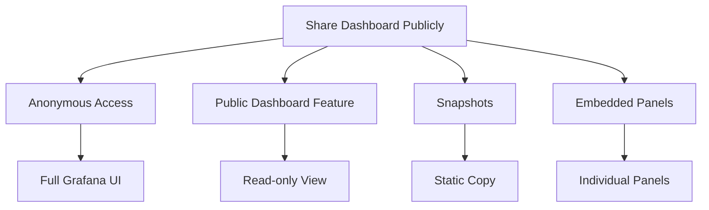

# How to Set Up Grafana Without Password for Public Dashboards

Author: [nawazdhandala](https://www.github.com/nawazdhandala)

Tags: Grafana, Public Dashboards, Authentication, Security, Anonymous Access, Configuration

Description: Learn how to configure Grafana for public dashboard access without requiring authentication. This guide covers anonymous access, public dashboard features, snapshot sharing, and security best practices for exposing dashboards publicly.

Sharing dashboards publicly can be valuable for status pages, community metrics, or open data initiatives. Grafana provides several methods to expose dashboards without requiring users to log in. This guide covers all approaches with their security implications.

## Methods Overview

Grafana offers multiple ways to share dashboards publicly:



## Method 1: Public Dashboard Feature (Recommended)

Grafana 9.1+ includes a built-in Public Dashboard feature that creates a read-only, shareable link for specific dashboards.

### Enable Public Dashboards

First, enable the feature in Grafana configuration:

```ini
# grafana.ini
[feature_toggles]
enable = publicDashboards
```

Or via environment variable:

```yaml
# Docker Compose
services:
  grafana:
    image: grafana/grafana:latest
    environment:
      - GF_FEATURE_TOGGLES_ENABLE=publicDashboards
```

### Create a Public Dashboard

1. Open the dashboard you want to share
2. Click the Share button (top right)
3. Select "Public Dashboard" tab
4. Toggle "Public Dashboard" to enabled
5. Configure options:
   - Time range picker enabled/disabled
   - Annotations visibility
6. Copy the generated public URL

### Configuration Options

```yaml
# Additional public dashboard settings
services:
  grafana:
    environment:
      - GF_FEATURE_TOGGLES_ENABLE=publicDashboards
      # Optional: custom domain for public URLs
      - GF_SERVER_ROOT_URL=https://grafana.example.com
```

### Revoking Public Access

To revoke a public dashboard:

1. Open the dashboard
2. Go to Share > Public Dashboard
3. Toggle off "Public Dashboard" or delete the configuration

## Method 2: Anonymous Access

Enable anonymous authentication to allow unauthenticated access to Grafana.

### Basic Anonymous Configuration

```ini
# grafana.ini
[auth.anonymous]
enabled = true

# Organization name to use for anonymous users
org_name = Public

# Role for anonymous users (Viewer recommended)
org_role = Viewer

# Hide login form
hide_version = true
```

### Docker Compose Configuration

```yaml
services:
  grafana:
    image: grafana/grafana:latest
    environment:
      - GF_AUTH_ANONYMOUS_ENABLED=true
      - GF_AUTH_ANONYMOUS_ORG_NAME=Public
      - GF_AUTH_ANONYMOUS_ORG_ROLE=Viewer
      - GF_AUTH_DISABLE_LOGIN_FORM=false
    volumes:
      - grafana_data:/var/lib/grafana
    ports:
      - "3000:3000"
```

### Kubernetes ConfigMap

```yaml
apiVersion: v1
kind: ConfigMap
metadata:
  name: grafana-config
data:
  grafana.ini: |
    [auth.anonymous]
    enabled = true
    org_name = Public
    org_role = Viewer

    [auth]
    disable_login_form = false
---
apiVersion: apps/v1
kind: Deployment
metadata:
  name: grafana
spec:
  template:
    spec:
      containers:
        - name: grafana
          volumeMounts:
            - name: config
              mountPath: /etc/grafana/grafana.ini
              subPath: grafana.ini
      volumes:
        - name: config
          configMap:
            name: grafana-config
```

### Restricting Anonymous Access

Limit what anonymous users can see:

```ini
# grafana.ini
[auth.anonymous]
enabled = true
org_name = Public
org_role = Viewer

# Restrict to specific organization
org_id = 2

[security]
# Disable certain features for viewers
viewers_can_edit = false
editors_can_admin = false
```

### Create a Public Organization

Set up a dedicated organization for public access:

1. Create a new organization: Configuration > Organizations > New
2. Name it "Public"
3. Add only dashboards intended for public viewing
4. Configure anonymous access to use this organization

## Method 3: Dashboard Snapshots

Snapshots create a static copy of dashboard data that can be shared.

### Create a Snapshot

**Via Grafana UI:**

1. Open the dashboard
2. Click Share > Snapshot
3. Choose snapshot settings:
   - Snapshot name
   - Expire time
   - Timeout (data query timeout)
4. Click "Local Snapshot" or "Publish to snapshot.raintank.io"

**Via API:**

```bash
curl -X POST \
  -H "Authorization: Bearer $GRAFANA_TOKEN" \
  -H "Content-Type: application/json" \
  -d '{
    "dashboard": {...},
    "name": "Public Metrics Snapshot",
    "expires": 3600
  }' \
  "http://grafana:3000/api/snapshots"
```

### Snapshot Configuration

```ini
# grafana.ini
[snapshots]
# Enable external sharing
external_enabled = true
external_snapshot_url = https://snapshots.raintank.io
external_snapshot_name = Publish to snapshot.raintank.io

# Remove sensitive data from snapshots
remove_expired = true
```

### Limitations of Snapshots

- Data is static (captured at creation time)
- No live updates
- May contain stale information
- Cannot interact with data (no drill-down)

## Method 4: Embedded Panels

Embed individual panels in external websites:

### Enable Embedding

```ini
# grafana.ini
[security]
allow_embedding = true

[auth.anonymous]
enabled = true
```

### Embed Panel Code

1. Open panel menu (three dots)
2. Select "Share"
3. Click "Embed" tab
4. Copy the iframe code

```html
<iframe
  src="http://grafana:3000/d-solo/abc123/dashboard?orgId=1&panelId=2"
  width="450"
  height="200"
  frameborder="0">
</iframe>
```

### Embedding with Time Range

```html
<iframe
  src="http://grafana:3000/d-solo/abc123/dashboard?orgId=1&panelId=2&from=now-24h&to=now&refresh=5m"
  width="100%"
  height="300"
  frameborder="0">
</iframe>
```

## Security Considerations

### Separate Public and Internal Dashboards

Create different organizations or folders:

```yaml
# Grafana provisioning - dashboards.yaml
apiVersion: 1

providers:
  - name: 'public-dashboards'
    orgId: 2  # Public organization
    folder: 'Public'
    type: file
    options:
      path: /var/lib/grafana/dashboards/public

  - name: 'internal-dashboards'
    orgId: 1  # Internal organization
    folder: 'Internal'
    type: file
    options:
      path: /var/lib/grafana/dashboards/internal
```

### Data Source Permissions

Restrict what data anonymous users can query:

```yaml
# Data source provisioning
apiVersion: 1

datasources:
  - name: PublicPrometheus
    type: prometheus
    access: proxy
    url: http://prometheus:9090
    # Read-only queries only
    jsonData:
      httpMethod: GET
      # Restrict query time range
      timeInterval: "15s"
```

### Network Isolation

Use separate Grafana instances for public access:

```yaml
services:
  grafana-internal:
    image: grafana/grafana:latest
    environment:
      - GF_AUTH_ANONYMOUS_ENABLED=false
    networks:
      - internal

  grafana-public:
    image: grafana/grafana:latest
    environment:
      - GF_AUTH_ANONYMOUS_ENABLED=true
      - GF_AUTH_ANONYMOUS_ORG_ROLE=Viewer
    networks:
      - public
    ports:
      - "3001:3000"

networks:
  internal:
    internal: true
  public:
```

### Rate Limiting

Protect public dashboards from abuse:

```ini
# grafana.ini
[security]
# Rate limit for anonymous users
rate_limit_anonymous = 100
```

Or use a reverse proxy:

```nginx
# nginx.conf
limit_req_zone $binary_remote_addr zone=grafana:10m rate=10r/s;

server {
    location /public/ {
        limit_req zone=grafana burst=20 nodelay;
        proxy_pass http://grafana-public:3000/;
    }
}
```

### Hide Sensitive Information

Remove sensitive data from public dashboards:

```ini
# grafana.ini
[auth.anonymous]
org_role = Viewer

[security]
# Hide version info
hide_version = true

[users]
# Disable signup
allow_sign_up = false

[unified_alerting]
# Hide alerting for anonymous users
enabled = false
```

## Complete Public Dashboard Setup

### Production-Ready Configuration

```yaml
# docker-compose.yml
version: '3.8'

services:
  grafana-public:
    image: grafana/grafana:latest
    environment:
      # Enable public dashboards feature
      - GF_FEATURE_TOGGLES_ENABLE=publicDashboards

      # Anonymous access as fallback
      - GF_AUTH_ANONYMOUS_ENABLED=true
      - GF_AUTH_ANONYMOUS_ORG_NAME=Public
      - GF_AUTH_ANONYMOUS_ORG_ROLE=Viewer

      # Security settings
      - GF_SECURITY_ALLOW_EMBEDDING=true
      - GF_SECURITY_HIDE_VERSION=true
      - GF_USERS_ALLOW_SIGN_UP=false

      # Disable unused features
      - GF_ALERTING_ENABLED=false
      - GF_EXPLORE_ENABLED=false

      # Server settings
      - GF_SERVER_ROOT_URL=https://status.example.com
    volumes:
      - ./provisioning:/etc/grafana/provisioning
      - ./dashboards:/var/lib/grafana/dashboards
    ports:
      - "3000:3000"
```

### Provisioning Public Dashboards

```yaml
# provisioning/dashboards/public.yaml
apiVersion: 1

providers:
  - name: 'public'
    orgId: 1
    folder: 'Status'
    type: file
    disableDeletion: true
    updateIntervalSeconds: 30
    options:
      path: /var/lib/grafana/dashboards
```

## Comparison of Methods

| Method | Live Data | Security | Ease of Setup | Best For |
|--------|-----------|----------|---------------|----------|
| Public Dashboards | Yes | High | Easy | Production status pages |
| Anonymous Access | Yes | Medium | Medium | Full dashboard access |
| Snapshots | No | High | Easy | Point-in-time sharing |
| Embedded Panels | Yes | Medium | Easy | Single metrics on websites |

## Conclusion

Grafana offers flexible options for public dashboard access:

1. **Public Dashboard feature** - Best for most use cases, provides secure read-only access
2. **Anonymous access** - Full Grafana experience without login
3. **Snapshots** - Static copies for specific point-in-time data
4. **Embedded panels** - Individual visualizations in external sites

Choose based on your security requirements and use case. For production status pages, the Public Dashboard feature provides the best balance of functionality and security.
