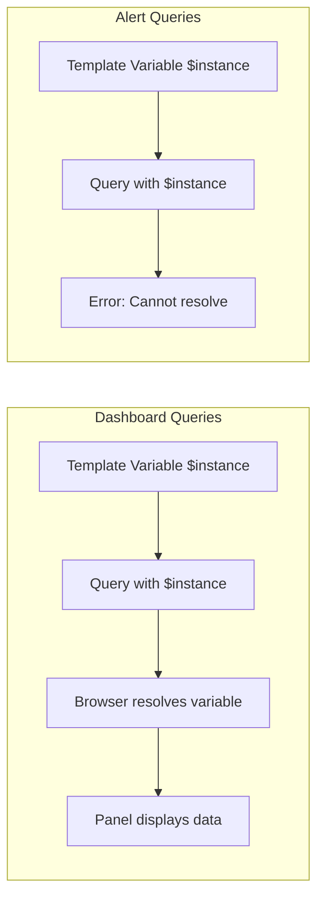

# How to Fix "Template variables not supported in alert queries"

Author: [nawazdhandala](https://www.github.com/nawazdhandala)

Tags: Grafana, Alerts, Template Variables, PromQL, Prometheus, Monitoring, Troubleshooting, Observability

Description: Learn how to fix the "Template variables not supported in alert queries" error in Grafana. This guide covers workarounds using label matchers, recording rules, and multi-dimensional alerts.

---

When creating alerts in Grafana, you might encounter the error "Template variables not supported in alert queries." This happens because alert rules are evaluated on the backend without dashboard context. This guide explains why this occurs and provides practical solutions.

## Understanding the Problem

Grafana template variables like `$instance`, `$namespace`, or `$service` work in dashboards because they're resolved at query time in the browser. Alert rules run on the Grafana server on a schedule, without any dashboard context.



### Why Variables Don't Work in Alerts

1. **No dashboard context** - Alerts run independently of dashboards
2. **No user interaction** - Variables often depend on user selection
3. **Scheduled evaluation** - Alerts evaluate on a fixed schedule
4. **Backend execution** - No browser to resolve variables

## Solution 1: Remove Variables and Use Label Matchers

The most common solution is replacing variables with explicit label matchers or regex patterns.

### Before (with variables)

```promql
# This query uses template variables - won't work in alerts
rate(http_requests_total{instance="$instance", namespace="$namespace"}[5m])
```

### After (with label matchers)

```promql
# Option 1: Monitor all instances
rate(http_requests_total[5m])

# Option 2: Use regex to match specific patterns
rate(http_requests_total{instance=~"prod-.*", namespace=~"production|staging"}[5m])

# Option 3: List specific values
rate(http_requests_total{instance=~"web-01|web-02|web-03"}[5m])
```

## Solution 2: Create Multi-Dimensional Alerts

Instead of one alert per variable value, create alerts that work across all values and use labels for routing.

### Before (one variable, one alert)

```promql
# Dashboard query with variable
sum(rate(errors_total{service="$service"}[5m])) > 10
```

### After (multi-dimensional alert)

```promql
# Alert that fires for any service with high errors
sum by (service) (rate(errors_total[5m])) > 10
```

The alert will fire with the `service` label attached, allowing you to:
- See which service triggered the alert
- Route notifications based on service
- Create separate notification policies per service

### Complete Alert Rule Example

```yaml
# Grafana alert rule (provisioned via YAML)
apiVersion: 1
groups:
  - orgId: 1
    name: service-alerts
    folder: Production
    interval: 1m
    rules:
      - uid: high-error-rate
        title: High Error Rate
        condition: C
        data:
          - refId: A
            relativeTimeRange:
              from: 300
              to: 0
            datasourceUid: prometheus
            model:
              expr: sum by (service, namespace) (rate(errors_total[5m]))
              instant: true
          - refId: C
            relativeTimeRange:
              from: 300
              to: 0
            datasourceUid: __expr__
            model:
              type: threshold
              expression: A
              conditions:
                - evaluator:
                    type: gt
                    params: [10]
        for: 5m
        labels:
          severity: warning
        annotations:
          summary: "High error rate in {{ $labels.service }}"
          description: "Service {{ $labels.service }} in {{ $labels.namespace }} has error rate {{ $values.A }}/s"
```

## Solution 3: Use Recording Rules

For complex queries with variables, create recording rules in Prometheus that pre-compute the metrics.

### Step 1: Create Recording Rule

```yaml
# prometheus-rules.yaml
groups:
  - name: service-metrics
    rules:
      # Pre-compute error rate per service
      - record: service:errors:rate5m
        expr: sum by (service, namespace, instance) (rate(errors_total[5m]))

      # Pre-compute request rate per service
      - record: service:requests:rate5m
        expr: sum by (service, namespace, instance) (rate(requests_total[5m]))

      # Pre-compute error ratio
      - record: service:error_ratio:rate5m
        expr: |
          service:errors:rate5m / service:requests:rate5m
```

### Step 2: Use Recording Rule in Alert

```promql
# Simple alert using pre-computed metric
service:error_ratio:rate5m > 0.05
```

## Solution 4: Create Separate Alerts per Value

If you truly need different thresholds or behaviors per variable value, create separate alert rules.

### Before (one query with variable)

```promql
# Tries to use $environment variable
rate(errors_total{environment="$environment"}[5m]) > 10
```

### After (separate alerts)

```yaml
# alert-rules.yaml
groups:
  - name: environment-alerts
    rules:
      - alert: HighErrorRateProduction
        expr: rate(errors_total{environment="production"}[5m]) > 5
        for: 5m
        labels:
          severity: critical
          environment: production

      - alert: HighErrorRateStaging
        expr: rate(errors_total{environment="staging"}[5m]) > 20
        for: 5m
        labels:
          severity: warning
          environment: staging

      - alert: HighErrorRateDevelopment
        expr: rate(errors_total{environment="development"}[5m]) > 50
        for: 10m
        labels:
          severity: info
          environment: development
```

## Solution 5: Use Grafana's Alert Query with Labels

In Grafana's unified alerting, you can use labels from the query result directly.

### Example: Alert Based on Query Labels

```promql
# Query that returns multiple time series with labels
sum by (instance, job) (rate(http_requests_total{status=~"5.."}[5m]))
/
sum by (instance, job) (rate(http_requests_total[5m]))
> 0.05
```

Configure the alert to:

1. Set condition on the query expression
2. Use `{{ $labels.instance }}` and `{{ $labels.job }}` in annotations
3. Route based on labels in notification policies

## Working with Notification Templates

Even though you can't use dashboard variables, you can use alert labels and values in notifications.

### Available Template Variables in Notifications

```go
// In notification templates, you can use:
{{ $labels }}              // All labels as map
{{ $labels.instance }}     // Specific label value
{{ $values }}              // All query values
{{ $values.A }}            // Specific query value
{{ $value }}               // Alert value (for simple alerts)
```

### Example Notification Template

```yaml
# Contact point message template
{{ define "alert.message" }}
Alert: {{ .CommonLabels.alertname }}
Severity: {{ .CommonLabels.severity }}
{{ range .Alerts.Firing }}
Instance: {{ .Labels.instance }}
Service: {{ .Labels.service }}
Value: {{ .Values.A }}
{{ end }}
{{ end }}
```

## Dashboard and Alert Coexistence

You can keep template variables in dashboards for interactive exploration while having separate alert queries.

### Strategy 1: Duplicate Panels

Create two versions of important panels:
1. **Dashboard panel** - Uses variables for exploration
2. **Alert panel** - Uses hardcoded or regex values for alerting

### Strategy 2: Use Variables with Default Values

Configure variables with sensible defaults that work for alerts:

```json
{
  "name": "instance",
  "type": "query",
  "query": "label_values(up, instance)",
  "current": {
    "selected": true,
    "text": "All",
    "value": "$__all"
  },
  "includeAll": true,
  "allValue": ".*"
}
```

Then in your alert query:
```promql
# This works because $__all resolves to .* regex
rate(http_requests_total{instance=~".*"}[5m])
```

## Migrating Existing Alerts

### Step 1: Identify Variable Usage

Find all alerts using variables:

```bash
# Search for variable patterns in alert definitions
grep -r '\$' /etc/grafana/provisioning/alerting/
```

### Step 2: Convert to Label Selectors

| Variable Type | Replacement Strategy |
|---------------|---------------------|
| Single value | Hardcode or regex pattern |
| Multi-value | Regex alternation `value1\|value2` |
| All values | Remove selector or use `.*` |
| Dynamic | Recording rule + label |

### Step 3: Test Thoroughly

```bash
# Validate PromQL before deploying
promtool query instant http://prometheus:9090 'your_query_here'

# Test alert rule syntax
promtool check rules alert-rules.yaml
```

## Best Practices

1. **Design alerts without variables** - Start with label-based alerts
2. **Use group by** - Let Prometheus handle multi-dimensional alerting
3. **Recording rules** - Pre-compute complex expressions
4. **Consistent labels** - Use the same labels in metrics and alerts
5. **Test locally** - Validate queries before deploying alerts

### Alert Design Pattern

```promql
# Good: Multi-dimensional alert with useful labels
sum by (service, namespace, instance) (
  rate(errors_total[5m])
) > 10

# Avoid: Alert that tries to use variables
sum(rate(errors_total{service="$service"}[5m])) > 10
```

## Summary

| Problem | Solution |
|---------|----------|
| Single variable value | Replace with explicit label matcher |
| Multiple variable values | Use regex pattern `value1\|value2` |
| All values | Remove selector or use `group by` |
| Different thresholds | Create separate alert rules |
| Complex queries | Use recording rules |

---

The "Template variables not supported" error is a design constraint, not a bug. Alerts need to be self-contained and evaluate without user interaction. By restructuring your queries to use label selectors and Prometheus's native grouping, you get more powerful multi-dimensional alerts that scale better than variable-based approaches.
