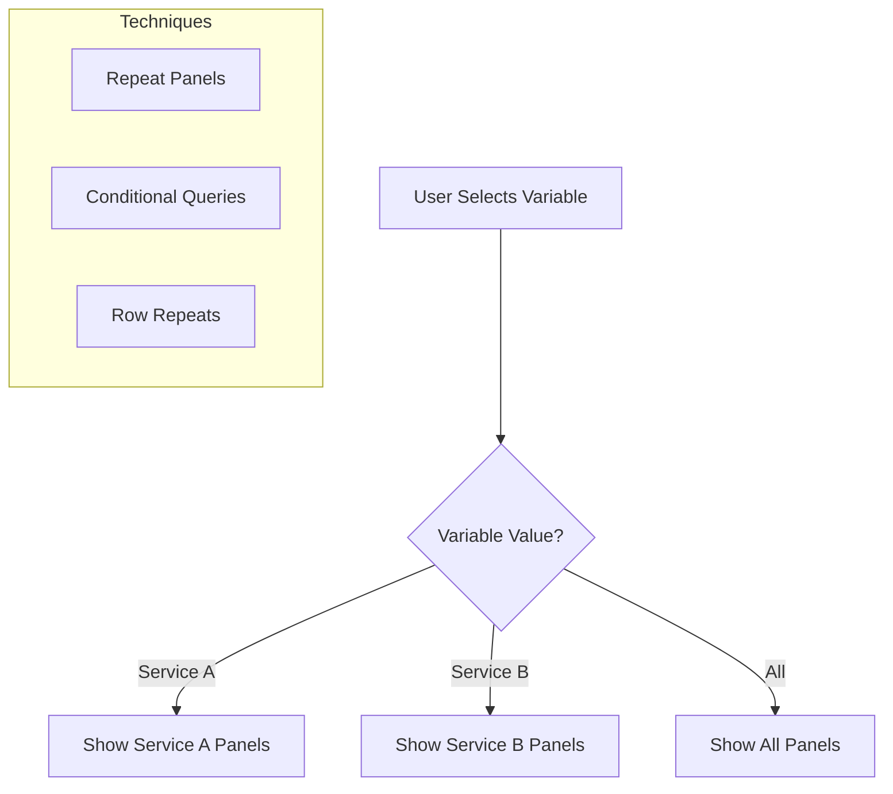

# How to Hide Grafana Panels Based on Template Variables

Author: [nawazdhandala](https://www.github.com/nawazdhandala)

Tags: Grafana, Dashboard, Template Variables, Panels, Conditional Display, UI, Monitoring, Visualization

Description: Learn how to conditionally hide or show Grafana panels based on template variable selections. This guide covers repeat panels, conditional queries, and dynamic dashboard layouts for better user experience.

---

Grafana dashboards often need to show different panels based on user selections. Maybe you want to hide database panels when viewing web server metrics, or show detailed panels only when a specific service is selected. This guide shows you how to achieve conditional panel visibility.

---

## TL;DR

- Use "Repeat for" option to show panels only when variable values exist
- Return "No Data" in queries to effectively hide panels
- Use row repeats for grouping related conditional panels
- Combine with variable options like "Include All" for flexibility
- Consider separate dashboards for very different views

---

## Understanding the Challenge

Grafana doesn't have a native "hide panel if variable equals X" feature. However, several workarounds achieve similar results:



---

## Method 1: Panel Repeat with Filtered Values

The repeat feature creates panel copies for each variable value.

### Step 1: Create Template Variable

```yaml
# Variable configuration
Name: service
Type: Query
Query: label_values(http_requests_total, service)
Multi-value: true
Include All option: true
```

### Step 2: Configure Panel Repeat

1. Edit panel
2. Go to Panel options
3. Find "Repeat options"
4. Set "Repeat by variable": `service`
5. Set "Direction": Horizontal or Vertical
6. Set "Max per row": As needed

### Step 3: Use Variable in Query

```promql
# Query automatically filtered by repeated variable value
sum(rate(http_requests_total{service="$service"}[5m]))
```

### Result

- Select "Service A" - one panel appears
- Select "Service A, Service B" - two panels appear
- Select "All" - panels for all services appear

---

## Method 2: Conditional Queries That Return No Data

Make queries return no data to effectively hide panels:

### Using Label Matching

```promql
# Only returns data if selected service is "api"
sum(rate(http_requests_total{service="$service"}[5m]))
  and on() (vector(1) and on() label_replace(vector(1), "check", "$service", "", "") == 1)
```

### Simplified Conditional

```promql
# For specific service panel - returns nothing if not selected
sum(rate(http_requests_total{service="api"}[5m]))
  * on() group_left vector("$service" == "api" or 1)
```

### Panel Configuration for No Data

```json
{
  "fieldConfig": {
    "defaults": {
      "noValue": "Not applicable"
    }
  },
  "options": {
    "showNoDataMessage": true
  }
}
```

When a panel shows "No Data", it still takes space but clearly indicates irrelevance.

---

## Method 3: Row Repeats for Grouped Panels

Group related panels in repeating rows:

### Create Row with Multiple Panels

1. Add a row to dashboard
2. Add panels inside the row
3. Collapse row to configure

### Configure Row Repeat

1. Click row title
2. Select "Row options"
3. Set "Repeat for": Your variable
4. Panels inside row repeat together

### Example Structure

```
Dashboard
├── Row: $service metrics (repeated)
│   ├── Panel: Request Rate
│   ├── Panel: Error Rate
│   └── Panel: Latency
└── Row: Global Overview (not repeated)
    ├── Panel: Total Traffic
    └── Panel: System Health
```

---

## Method 4: Using $__all Filtering

Create different panel visibility for "All" vs specific selections:

### Panel for Specific Selection Only

```promql
# Returns data only when NOT "All" is selected
sum(rate(http_requests_total{service="$service"}[5m]))
# This naturally works - selecting a specific service shows that service
```

### Panel for "All" Selection Only

```promql
# Create variable that equals 1 when All is selected
# Use in query condition
sum(rate(http_requests_total[5m])) by (service)
# This shows multiple series when All is selected
```

### Dashboard Variable for Conditional Logic

Create a hidden variable:

```yaml
Name: is_all
Type: Custom
Values: 0
Query: ${service:queryparam}
# Use regex to detect if $__all is in the selection
```

---

## Method 5: Transformations for Conditional Display

Use transforms to filter or hide data:

### Filter Data by Name Transform

```json
{
  "transformations": [
    {
      "id": "filterByName",
      "options": {
        "include": {
          "pattern": ".*${service}.*"
        }
      }
    }
  ]
}
```

### Reduce Transform with Conditions

```json
{
  "transformations": [
    {
      "id": "reduce",
      "options": {
        "reducers": ["last"],
        "includeTimeField": false,
        "mode": "reduceFields"
      }
    },
    {
      "id": "filterFieldsByName",
      "options": {
        "include": {
          "names": ["${service}"]
        }
      }
    }
  ]
}
```

---

## Practical Example: Environment-Based Dashboard

### Variables Setup

```yaml
# Environment variable
Name: environment
Type: Custom
Values: production, staging, development
Default: production

# Service variable (filtered by environment)
Name: service
Type: Query
Query: label_values(http_requests_total{environment="$environment"}, service)
```

### Production-Only Panel

```promql
# Only shows data for production
sum(rate(http_requests_total{environment="production", service="$service"}[5m]))
# When staging is selected, this returns no data
```

### Development Debug Panel (Hidden in Prod)

Create a panel with query:

```promql
# Only returns data for non-production environments
sum(rate(debug_logs_total{environment="$environment"}[5m]))
  * on() (1 * ($environment != "production"))
```

---

## Complete Dashboard JSON Example

```json
{
  "panels": [
    {
      "title": "Service: $service",
      "type": "timeseries",
      "repeat": "service",
      "repeatDirection": "h",
      "maxPerRow": 3,
      "targets": [
        {
          "expr": "sum(rate(http_requests_total{service=\"$service\"}[$__rate_interval]))",
          "legendFormat": "{{service}}"
        }
      ],
      "gridPos": {
        "h": 8,
        "w": 8,
        "x": 0,
        "y": 0
      }
    },
    {
      "title": "Overview (All Services)",
      "type": "timeseries",
      "targets": [
        {
          "expr": "sum(rate(http_requests_total[$__rate_interval])) by (service)",
          "legendFormat": "{{service}}"
        }
      ],
      "gridPos": {
        "h": 8,
        "w": 24,
        "x": 0,
        "y": 8
      }
    }
  ],
  "templating": {
    "list": [
      {
        "name": "service",
        "type": "query",
        "query": "label_values(http_requests_total, service)",
        "multi": true,
        "includeAll": true,
        "current": {
          "selected": true,
          "text": "All",
          "value": "$__all"
        }
      }
    ]
  }
}
```

---

## Alternative: Dashboard Links

For significantly different views, consider separate dashboards:

### Dashboard Links Based on Variable

```json
{
  "links": [
    {
      "title": "Detailed ${service} Dashboard",
      "url": "/d/service-detail?var-service=${service}",
      "type": "link",
      "icon": "external link"
    }
  ]
}
```

### Automatic Navigation

Create a variable with dashboard URLs:

```yaml
Name: detail_dashboard
Type: Custom
Values:
  "API": "api-dashboard"
  "Web": "web-dashboard"
  "Database": "db-dashboard"
```

---

## Best Practices

### 1. Use Meaningful "No Data" Messages

```json
{
  "fieldConfig": {
    "defaults": {
      "noValue": "Select a specific service to view details"
    }
  }
}
```

### 2. Organize with Collapsible Rows

Group conditional panels in rows that can be collapsed:

```json
{
  "type": "row",
  "title": "Service-Specific Panels ($service)",
  "collapsed": false,
  "repeat": "service"
}
```

### 3. Document Variable Dependencies

Add text panel explaining:

```markdown
## Dashboard Usage
- Select **All** to see overview metrics
- Select a specific service for detailed breakdowns
- Development metrics only appear in non-production environments
```

### 4. Consider Dashboard Performance

Repeating panels create multiple queries:

- Limit repeat to essential panels
- Use recording rules for expensive queries
- Consider pagination for many values

---

## Troubleshooting

### Repeated Panels Not Updating

- Check variable refresh settings
- Ensure "Multi-value" is enabled
- Verify query syntax includes variable

### "No Data" Shows Instead of Hiding

This is expected behavior. Options:
- Use transparent background
- Set very small panel size
- Accept "No Data" as valid state

### Panel Layout Issues

When panels repeat, layout can shift:
- Set explicit `maxPerRow`
- Use row repeats for consistent grouping
- Test with different variable selections

---

## Conclusion

While Grafana lacks native conditional panel visibility, these techniques provide effective alternatives:

- **Panel Repeat**: Best for showing one panel per variable value
- **Conditional Queries**: Return no data when conditions aren't met
- **Row Repeats**: Group related conditional panels
- **Transformations**: Filter data based on variables

Choose the approach that best fits your use case - often a combination works best for complex dashboards.

---

*For more Grafana customization, see our guides on legend sorting and time variable usage.*
