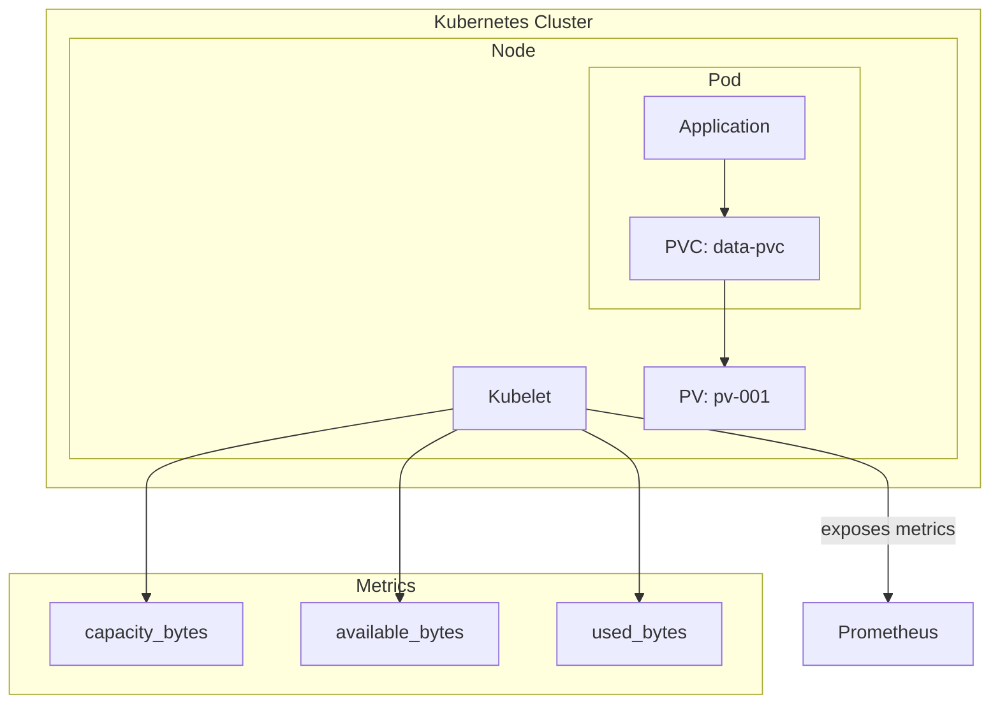

# How to Monitor Kubernetes Persistent Volume Disk Usage

Author: [nawazdhandala](https://www.github.com/nawazdhandala)

Tags: Kubernetes, Prometheus, Persistent Volumes, Disk Usage, Monitoring, Storage, PVC, Observability

Description: Learn how to monitor Kubernetes Persistent Volume disk usage with Prometheus. This guide covers kubelet metrics, PVC monitoring, capacity alerts, and Grafana dashboard queries.

---

Monitoring Persistent Volume (PV) disk usage in Kubernetes prevents data loss and application failures from full disks. This guide shows you how to query PV metrics from Prometheus and set up effective alerts.

## Understanding Kubernetes Storage Metrics

Kubernetes exposes volume metrics through the kubelet. These metrics provide visibility into PVC capacity and usage:

| Metric | Description |
|--------|-------------|
| `kubelet_volume_stats_capacity_bytes` | Total capacity of the volume |
| `kubelet_volume_stats_available_bytes` | Available space on the volume |
| `kubelet_volume_stats_used_bytes` | Used space on the volume |
| `kubelet_volume_stats_inodes` | Total inodes on the volume |
| `kubelet_volume_stats_inodes_free` | Free inodes on the volume |
| `kubelet_volume_stats_inodes_used` | Used inodes on the volume |



## Basic PVC Queries

### Get All Volume Capacities

```promql
# Total capacity of all PVCs
kubelet_volume_stats_capacity_bytes

# In GB
kubelet_volume_stats_capacity_bytes / 1024 / 1024 / 1024
```

### Get Available Space

```promql
# Available space per PVC
kubelet_volume_stats_available_bytes

# Available space in GB
kubelet_volume_stats_available_bytes / 1024 / 1024 / 1024
```

### Get Used Space

```promql
# Used space per PVC
kubelet_volume_stats_used_bytes

# Alternatively (capacity - available)
kubelet_volume_stats_capacity_bytes - kubelet_volume_stats_available_bytes
```

## Calculating Usage Percentage

### Per-Volume Usage

```promql
# Usage percentage per PVC
(
  kubelet_volume_stats_capacity_bytes - kubelet_volume_stats_available_bytes
)
/ kubelet_volume_stats_capacity_bytes
* 100

# Alternative using used_bytes
kubelet_volume_stats_used_bytes
/ kubelet_volume_stats_capacity_bytes
* 100
```

### Usage as Ratio (0-1)

```promql
# Useful for alerting
(
  kubelet_volume_stats_capacity_bytes - kubelet_volume_stats_available_bytes
)
/ kubelet_volume_stats_capacity_bytes
```

## Filtering by Namespace and PVC

### Specific Namespace

```promql
# All PVCs in production namespace
kubelet_volume_stats_used_bytes{namespace="production"}

# Usage percentage in specific namespace
(
  kubelet_volume_stats_capacity_bytes{namespace="production"}
  - kubelet_volume_stats_available_bytes{namespace="production"}
)
/ kubelet_volume_stats_capacity_bytes{namespace="production"}
* 100
```

### Specific PVC

```promql
# Specific PVC usage
kubelet_volume_stats_used_bytes{
  namespace="production",
  persistentvolumeclaim="postgres-data"
}

# Usage percentage for specific PVC
(
  kubelet_volume_stats_capacity_bytes{persistentvolumeclaim="postgres-data"}
  - kubelet_volume_stats_available_bytes{persistentvolumeclaim="postgres-data"}
)
/ kubelet_volume_stats_capacity_bytes{persistentvolumeclaim="postgres-data"}
* 100
```

## Aggregating Storage Metrics

### Total Storage per Namespace

```promql
# Total capacity per namespace
sum by (namespace) (kubelet_volume_stats_capacity_bytes)

# Total used per namespace
sum by (namespace) (kubelet_volume_stats_used_bytes)

# Usage percentage per namespace
sum by (namespace) (kubelet_volume_stats_used_bytes)
/
sum by (namespace) (kubelet_volume_stats_capacity_bytes)
* 100
```

### Cluster-Wide Storage

```promql
# Total cluster storage capacity
sum(kubelet_volume_stats_capacity_bytes)

# Total cluster storage used
sum(kubelet_volume_stats_used_bytes)

# Cluster-wide usage percentage
sum(kubelet_volume_stats_used_bytes)
/
sum(kubelet_volume_stats_capacity_bytes)
* 100
```

## Monitoring Inodes

Running out of inodes is as problematic as running out of space:

```promql
# Inode usage percentage
(kubelet_volume_stats_inodes - kubelet_volume_stats_inodes_free)
/ kubelet_volume_stats_inodes
* 100

# PVCs with low inode availability
(kubelet_volume_stats_inodes_free / kubelet_volume_stats_inodes) < 0.1
```

## Predicting Volume Full

### Linear Prediction

```promql
# Predict available space in 24 hours
predict_linear(
  kubelet_volume_stats_available_bytes[6h],
  24 * 3600
)

# PVCs predicted to fill within 24 hours
predict_linear(
  kubelet_volume_stats_available_bytes[6h],
  24 * 3600
) < 0
```

### Days Until Full

```promql
# Estimate days until PVC is full
kubelet_volume_stats_available_bytes
/
(
  (kubelet_volume_stats_available_bytes offset 1d - kubelet_volume_stats_available_bytes)
  / 86400
)
/ 86400
```

## Alert Rules for PVC Monitoring

### Basic Usage Alerts

```yaml
groups:
  - name: pvc-alerts
    rules:
      # Warning at 80% usage
      - alert: PVCUsageWarning
        expr: |
          (
            kubelet_volume_stats_capacity_bytes - kubelet_volume_stats_available_bytes
          )
          / kubelet_volume_stats_capacity_bytes
          > 0.8
        for: 5m
        labels:
          severity: warning
        annotations:
          summary: "PVC {{ $labels.persistentvolumeclaim }} is over 80% full"
          description: "PVC {{ $labels.persistentvolumeclaim }} in namespace {{ $labels.namespace }} is {{ printf \"%.1f\" $value | float64Mul 100 }}% full"

      # Critical at 90% usage
      - alert: PVCUsageCritical
        expr: |
          (
            kubelet_volume_stats_capacity_bytes - kubelet_volume_stats_available_bytes
          )
          / kubelet_volume_stats_capacity_bytes
          > 0.9
        for: 5m
        labels:
          severity: critical
        annotations:
          summary: "PVC {{ $labels.persistentvolumeclaim }} is over 90% full"
          description: "PVC {{ $labels.persistentvolumeclaim }} in namespace {{ $labels.namespace }} is {{ printf \"%.1f\" $value | float64Mul 100 }}% full. Immediate action required."
```

### Predictive Alerts

```yaml
      # Alert if PVC will fill in 24 hours
      - alert: PVCWillFillIn24Hours
        expr: |
          (
            predict_linear(kubelet_volume_stats_available_bytes[6h], 24 * 3600) < 0
          )
          and
          (
            kubelet_volume_stats_available_bytes
            / kubelet_volume_stats_capacity_bytes < 0.3
          )
        for: 1h
        labels:
          severity: warning
        annotations:
          summary: "PVC {{ $labels.persistentvolumeclaim }} will fill within 24 hours"
          description: "Based on current growth rate, PVC {{ $labels.persistentvolumeclaim }} in namespace {{ $labels.namespace }} will be full within 24 hours"

      # Alert if PVC will fill in 4 hours
      - alert: PVCWillFillIn4Hours
        expr: |
          predict_linear(kubelet_volume_stats_available_bytes[2h], 4 * 3600) < 0
        for: 30m
        labels:
          severity: critical
        annotations:
          summary: "PVC {{ $labels.persistentvolumeclaim }} will fill within 4 hours"
```

### Inode Alerts

```yaml
      # Alert on low inode availability
      - alert: PVCLowInodes
        expr: |
          kubelet_volume_stats_inodes_free
          / kubelet_volume_stats_inodes
          < 0.1
        for: 5m
        labels:
          severity: warning
        annotations:
          summary: "PVC {{ $labels.persistentvolumeclaim }} has low inode availability"
          description: "Only {{ printf \"%.1f\" $value | float64Mul 100 }}% of inodes are free"
```

## Recording Rules

Pre-compute PVC metrics for faster dashboards:

```yaml
groups:
  - name: pvc-recording-rules
    interval: 60s
    rules:
      # Usage ratio per PVC
      - record: pvc:usage:ratio
        expr: |
          (
            kubelet_volume_stats_capacity_bytes
            - kubelet_volume_stats_available_bytes
          )
          / kubelet_volume_stats_capacity_bytes

      # Total capacity per namespace
      - record: namespace:pvc_capacity_bytes:sum
        expr: |
          sum by (namespace) (kubelet_volume_stats_capacity_bytes)

      # Total used per namespace
      - record: namespace:pvc_used_bytes:sum
        expr: |
          sum by (namespace) (kubelet_volume_stats_used_bytes)

      # Namespace usage ratio
      - record: namespace:pvc_usage:ratio
        expr: |
          namespace:pvc_used_bytes:sum
          / namespace:pvc_capacity_bytes:sum

      # Inode usage ratio
      - record: pvc:inode_usage:ratio
        expr: |
          (kubelet_volume_stats_inodes - kubelet_volume_stats_inodes_free)
          / kubelet_volume_stats_inodes
```

## Grafana Dashboard Queries

### Table: All PVCs with Usage

```promql
# Shows namespace, PVC name, capacity, used, available, usage %
(
  kubelet_volume_stats_capacity_bytes
  - kubelet_volume_stats_available_bytes
)
/ kubelet_volume_stats_capacity_bytes
* 100
```

### Gauge: Specific PVC Usage

```promql
(
  kubelet_volume_stats_capacity_bytes{
    namespace="$namespace",
    persistentvolumeclaim="$pvc"
  }
  - kubelet_volume_stats_available_bytes{
    namespace="$namespace",
    persistentvolumeclaim="$pvc"
  }
)
/ kubelet_volume_stats_capacity_bytes{
  namespace="$namespace",
  persistentvolumeclaim="$pvc"
}
* 100
```

### Graph: PVC Usage Over Time

```promql
(
  kubelet_volume_stats_capacity_bytes{namespace="$namespace"}
  - kubelet_volume_stats_available_bytes{namespace="$namespace"}
)
/ kubelet_volume_stats_capacity_bytes{namespace="$namespace"}
```

### Top 10 Fullest PVCs

```promql
topk(10,
  (
    kubelet_volume_stats_capacity_bytes
    - kubelet_volume_stats_available_bytes
  )
  / kubelet_volume_stats_capacity_bytes
  * 100
)
```

### Stat: Total Cluster Storage Used

```promql
sum(kubelet_volume_stats_used_bytes) / 1024 / 1024 / 1024
# Returns value in GB
```

## Troubleshooting Missing Metrics

### Verify Kubelet Metrics

```bash
# Check if kubelet is exposing metrics
kubectl get --raw /api/v1/nodes/<node-name>/proxy/metrics | grep kubelet_volume

# Check ServiceMonitor configuration
kubectl get servicemonitor -n monitoring
```

### Check Prometheus Targets

```promql
# Verify kubelet targets are up
up{job="kubelet"}
```

### Common Issues

1. **Metrics not appearing** - Ensure kubelet metrics are being scraped
2. **Missing PVCs** - Only mounted PVCs with pods report metrics
3. **Stale metrics** - PVCs report metrics only when pods are running

## Combining with PVC Metadata

### Join with kube-state-metrics

```promql
# Add storage class info
kubelet_volume_stats_used_bytes
* on(namespace, persistentvolumeclaim) group_left(storageclass)
kube_persistentvolumeclaim_info

# Usage by storage class
sum by (storageclass) (kubelet_volume_stats_used_bytes)
* on(namespace, persistentvolumeclaim) group_left(storageclass)
kube_persistentvolumeclaim_info
```

### PVC Status Information

```promql
# PVCs in pending state
kube_persistentvolumeclaim_status_phase{phase="Pending"}

# PVCs bound but not mounted (no kubelet metrics)
kube_persistentvolumeclaim_status_phase{phase="Bound"}
unless on(namespace, persistentvolumeclaim)
kubelet_volume_stats_capacity_bytes
```

## Summary

| Metric | Query |
|--------|-------|
| Capacity | `kubelet_volume_stats_capacity_bytes` |
| Available | `kubelet_volume_stats_available_bytes` |
| Used | `kubelet_volume_stats_used_bytes` |
| Usage % | `(capacity - available) / capacity * 100` |
| Inodes used % | `(inodes - inodes_free) / inodes * 100` |
| Predict full | `predict_linear(available[6h], 86400)` |

---

Monitoring Kubernetes Persistent Volume disk usage with Prometheus helps prevent data loss and application outages. Use `kubelet_volume_stats_*` metrics for real-time visibility, set up predictive alerts to catch issues before they become critical, and create dashboards that show usage trends across your cluster. Remember that only mounted PVCs with running pods will report metrics.
