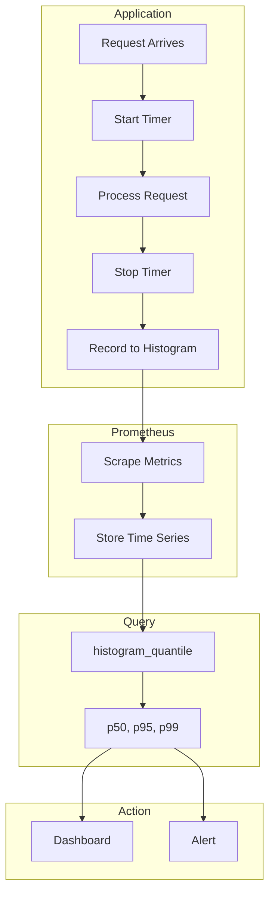

# How to Measure Service Latency with Prometheus

Author: [nawazdhandala](https://www.github.com/nawazdhandala)

Tags: Prometheus, Latency, Metrics, Monitoring, Histograms, SLO, Performance, Observability, PromQL

Description: Learn how to measure and monitor service latency with Prometheus using histograms and summaries. This guide covers instrumentation patterns, percentile calculations, SLO tracking, and alerting on latency degradation.

---

Service latency directly impacts user experience. Measuring it accurately with Prometheus enables you to track SLOs, identify performance regressions, and alert before users notice problems. This guide covers everything from instrumentation to alerting.

---

## TL;DR

- Use histograms for latency measurement - they support percentile calculations
- Instrument at service boundaries (HTTP handlers, RPC methods, database calls)
- Calculate percentiles with `histogram_quantile()`
- Set appropriate bucket boundaries for your latency profile
- Alert on SLO violations, not just absolute thresholds

---

## Choosing Between Histograms and Summaries

Prometheus offers two metric types for latency:

| Feature | Histogram | Summary |
|---------|-----------|---------|
| Aggregation | Yes | Limited |
| Quantile calculation | At query time | At scrape time |
| Accuracy | Depends on buckets | Configurable |
| Cost | Lower | Higher |
| Recommendation | Preferred | Special cases |

**Use histograms** for most latency measurements - they're more flexible and aggregatable.

---

## Instrumentation Patterns

### Python (prometheus_client)

```python
from prometheus_client import Histogram, start_http_server
import time

# Define histogram with appropriate buckets for web requests
REQUEST_LATENCY = Histogram(
    'http_request_duration_seconds',
    'HTTP request latency in seconds',
    ['method', 'endpoint', 'status'],
    buckets=[0.005, 0.01, 0.025, 0.05, 0.1, 0.25, 0.5, 1.0, 2.5, 5.0, 10.0]
)

# Use as decorator
@REQUEST_LATENCY.labels(method='GET', endpoint='/api/users', status='200').time()
def get_users():
    # ... handler logic
    pass

# Or use context manager
def process_request(method, endpoint):
    with REQUEST_LATENCY.labels(method=method, endpoint=endpoint, status='200').time():
        # ... process request
        pass

# Or manual timing
def handle_request():
    start_time = time.time()
    try:
        # ... process
        status = '200'
    except Exception:
        status = '500'
    finally:
        REQUEST_LATENCY.labels(
            method='POST',
            endpoint='/api/orders',
            status=status
        ).observe(time.time() - start_time)
```

### Go (prometheus/client_golang)

```go
package main

import (
    "net/http"
    "time"
    "github.com/prometheus/client_golang/prometheus"
    "github.com/prometheus/client_golang/prometheus/promauto"
    "github.com/prometheus/client_golang/prometheus/promhttp"
)

var requestLatency = promauto.NewHistogramVec(
    prometheus.HistogramOpts{
        Name:    "http_request_duration_seconds",
        Help:    "HTTP request latency in seconds",
        Buckets: []float64{0.005, 0.01, 0.025, 0.05, 0.1, 0.25, 0.5, 1.0, 2.5, 5.0},
    },
    []string{"method", "endpoint", "status"},
)

func instrumentHandler(next http.Handler) http.Handler {
    return http.HandlerFunc(func(w http.ResponseWriter, r *http.Request) {
        start := time.Now()

        // Wrap response writer to capture status
        wrapped := &statusRecorder{ResponseWriter: w, status: 200}
        next.ServeHTTP(wrapped, r)

        duration := time.Since(start).Seconds()
        requestLatency.WithLabelValues(
            r.Method,
            r.URL.Path,
            http.StatusText(wrapped.status),
        ).Observe(duration)
    })
}
```

### Node.js (prom-client)

```javascript
const client = require('prom-client');

const httpRequestDuration = new client.Histogram({
    name: 'http_request_duration_seconds',
    help: 'HTTP request latency in seconds',
    labelNames: ['method', 'endpoint', 'status'],
    buckets: [0.005, 0.01, 0.025, 0.05, 0.1, 0.25, 0.5, 1.0, 2.5, 5.0]
});

// Express middleware
function latencyMiddleware(req, res, next) {
    const end = httpRequestDuration.startTimer();

    res.on('finish', () => {
        end({
            method: req.method,
            endpoint: req.route?.path || req.path,
            status: res.statusCode
        });
    });

    next();
}

app.use(latencyMiddleware);
```

---

## Latency Measurement Flow



---

## Choosing Bucket Boundaries

Bucket selection significantly affects measurement accuracy:

### For Web APIs (typical 10ms-1s range)

```python
buckets = [0.005, 0.01, 0.025, 0.05, 0.075, 0.1, 0.25, 0.5, 0.75, 1.0, 2.5, 5.0, 10.0]
```

### For Database Queries (1ms-100ms range)

```python
buckets = [0.001, 0.0025, 0.005, 0.01, 0.025, 0.05, 0.1, 0.25, 0.5, 1.0]
```

### For Background Jobs (seconds to minutes)

```python
buckets = [1, 5, 10, 30, 60, 120, 300, 600, 1800, 3600]
```

### Dynamic Bucket Generation

```python
# Exponential buckets
import prometheus_client
buckets = prometheus_client.exponential_buckets(0.001, 2, 15)
# Results: 0.001, 0.002, 0.004, 0.008, ... up to 16.384
```

---

## PromQL Queries for Latency Analysis

### Basic Percentiles

```promql
# Median (p50) latency
histogram_quantile(0.5, sum(rate(http_request_duration_seconds_bucket[5m])) by (le))

# 95th percentile
histogram_quantile(0.95, sum(rate(http_request_duration_seconds_bucket[5m])) by (le))

# 99th percentile
histogram_quantile(0.99, sum(rate(http_request_duration_seconds_bucket[5m])) by (le))
```

### Percentiles by Endpoint

```promql
# P95 per endpoint
histogram_quantile(0.95,
    sum(rate(http_request_duration_seconds_bucket[5m])) by (le, endpoint)
)

# P99 per service
histogram_quantile(0.99,
    sum(rate(http_request_duration_seconds_bucket[5m])) by (le, service)
)
```

### Average Latency

```promql
# Average request duration
sum(rate(http_request_duration_seconds_sum[5m]))
/
sum(rate(http_request_duration_seconds_count[5m]))

# Average per endpoint
sum(rate(http_request_duration_seconds_sum[5m])) by (endpoint)
/
sum(rate(http_request_duration_seconds_count[5m])) by (endpoint)
```

### Request Rate

```promql
# Requests per second
sum(rate(http_request_duration_seconds_count[5m]))

# Requests per second by status
sum(rate(http_request_duration_seconds_count[5m])) by (status)
```

---

## SLO-Based Monitoring

### Define Your SLO

Example: 95% of requests should complete within 500ms

```promql
# Percentage of requests meeting SLO
sum(rate(http_request_duration_seconds_bucket{le="0.5"}[5m]))
/
sum(rate(http_request_duration_seconds_count[5m]))
* 100
```

### Error Budget Calculation

```promql
# Error budget remaining (target: 99.9% within 500ms)
# Over a 30-day window
1 - (
    sum(increase(http_request_duration_seconds_bucket{le="0.5"}[30d]))
    /
    sum(increase(http_request_duration_seconds_count[30d]))
) / 0.001  # 0.1% error budget
```

### Multi-Window SLO Query

```promql
# Check SLO across multiple windows
(
  # 5-minute window
  sum(rate(http_request_duration_seconds_bucket{le="0.5"}[5m]))
  / sum(rate(http_request_duration_seconds_count[5m]))
  > 0.99
)
and
(
  # 1-hour window
  sum(rate(http_request_duration_seconds_bucket{le="0.5"}[1h]))
  / sum(rate(http_request_duration_seconds_count[1h]))
  > 0.99
)
```

---

## Alerting Rules for Latency

### Alert on High Latency

```yaml
groups:
  - name: latency_alerts
    rules:
      # Alert when p95 latency exceeds threshold
      - alert: HighLatency
        expr: |
          histogram_quantile(0.95,
            sum(rate(http_request_duration_seconds_bucket[5m])) by (le, service)
          ) > 0.5
        for: 5m
        labels:
          severity: warning
        annotations:
          summary: "High latency detected for {{ $labels.service }}"
          description: "P95 latency is {{ $value | humanizeDuration }}"

      # Alert when p99 is critically high
      - alert: CriticalLatency
        expr: |
          histogram_quantile(0.99,
            sum(rate(http_request_duration_seconds_bucket[5m])) by (le, service)
          ) > 2.0
        for: 2m
        labels:
          severity: critical
        annotations:
          summary: "Critical latency for {{ $labels.service }}"
          description: "P99 latency is {{ $value | humanizeDuration }}"
```

### Alert on SLO Violation

```yaml
      # Alert when SLO is being violated
      - alert: LatencySLOViolation
        expr: |
          (
            sum(rate(http_request_duration_seconds_bucket{le="0.5"}[1h]))
            / sum(rate(http_request_duration_seconds_count[1h]))
          ) < 0.95
        for: 5m
        labels:
          severity: critical
        annotations:
          summary: "Latency SLO violation"
          description: "Only {{ $value | humanizePercentage }} of requests within 500ms (target: 95%)"
```

### Alert on Latency Increase

```yaml
      # Alert when latency increases significantly
      - alert: LatencyIncrease
        expr: |
          (
            histogram_quantile(0.95, sum(rate(http_request_duration_seconds_bucket[5m])) by (le))
            /
            histogram_quantile(0.95, sum(rate(http_request_duration_seconds_bucket[5m] offset 1h)) by (le))
          ) > 2
        for: 10m
        labels:
          severity: warning
        annotations:
          summary: "Latency increased significantly"
          description: "P95 latency is {{ $value }}x higher than 1 hour ago"
```

---

## Recording Rules for Efficiency

Pre-calculate common latency queries:

```yaml
groups:
  - name: latency_recording_rules
    interval: 30s
    rules:
      # P50 latency per service
      - record: service:http_request_duration_seconds:p50
        expr: |
          histogram_quantile(0.5,
            sum(rate(http_request_duration_seconds_bucket[5m])) by (le, service)
          )

      # P95 latency per service
      - record: service:http_request_duration_seconds:p95
        expr: |
          histogram_quantile(0.95,
            sum(rate(http_request_duration_seconds_bucket[5m])) by (le, service)
          )

      # P99 latency per service
      - record: service:http_request_duration_seconds:p99
        expr: |
          histogram_quantile(0.99,
            sum(rate(http_request_duration_seconds_bucket[5m])) by (le, service)
          )

      # Request rate per service
      - record: service:http_requests:rate5m
        expr: |
          sum(rate(http_request_duration_seconds_count[5m])) by (service)

      # SLO compliance per service
      - record: service:http_request_latency_slo:ratio
        expr: |
          sum(rate(http_request_duration_seconds_bucket{le="0.5"}[5m])) by (service)
          /
          sum(rate(http_request_duration_seconds_count[5m])) by (service)
```

---

## Best Practices

### 1. Measure at Service Boundaries

```python
# Good: Measure complete request handling
@REQUEST_LATENCY.time()
def handle_request():
    # includes all processing
    pass

# Also good: Measure specific operations
@DB_LATENCY.time()
def query_database():
    pass
```

### 2. Use Consistent Labels

```python
# Good: Standard labels
labels = ['method', 'endpoint', 'status']

# Avoid: High cardinality labels
labels = ['user_id', 'request_id']  # DON'T DO THIS
```

### 3. Include Error Cases

```python
def process(self):
    start = time.time()
    try:
        result = do_work()
        status = 'success'
    except TimeoutError:
        status = 'timeout'
    except Exception:
        status = 'error'
    finally:
        LATENCY.labels(status=status).observe(time.time() - start)
```

### 4. Separate Read and Write Operations

```python
READ_LATENCY = Histogram('db_read_duration_seconds', ...)
WRITE_LATENCY = Histogram('db_write_duration_seconds', ...)
```

---

## Conclusion

Effective latency measurement with Prometheus requires:

- **Proper instrumentation** at service boundaries
- **Well-chosen buckets** matching your latency profile
- **Percentile calculations** using `histogram_quantile()`
- **SLO-based alerting** rather than arbitrary thresholds
- **Recording rules** for query efficiency

With these practices, you can track latency trends, catch regressions early, and maintain reliable SLOs.

---

*For more Prometheus patterns, see our guides on histogram visualization in Grafana and counting unique label values.*
