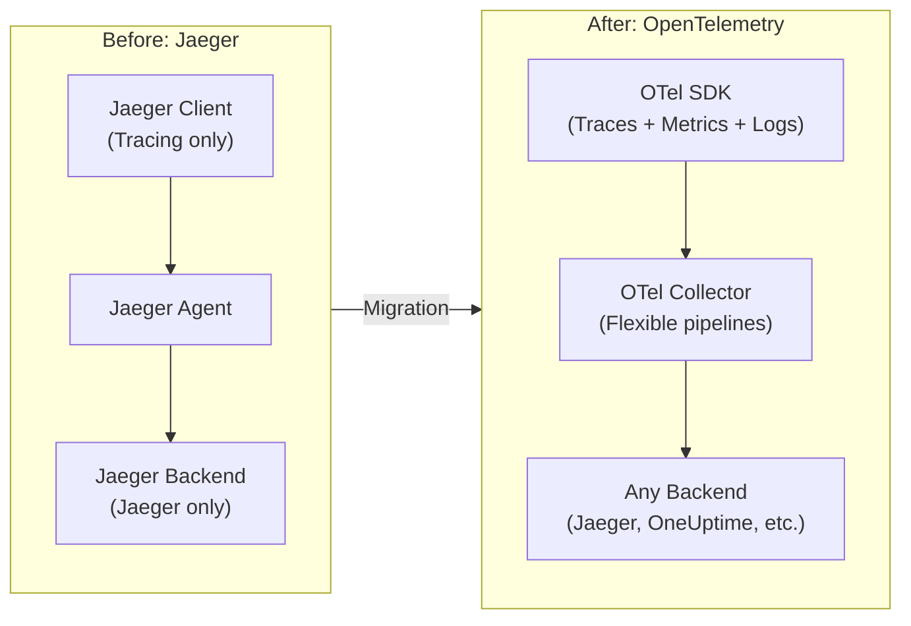
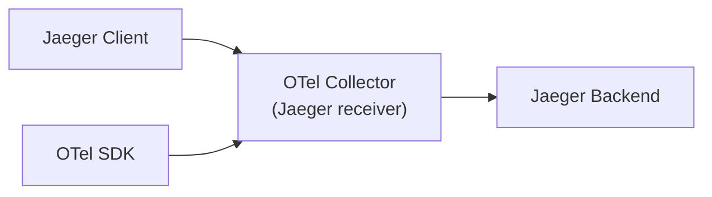

# Migrating from Jaeger to OpenTelemetry

Author: [nawazdhandala](https://www.github.com/nawazdhandala)

Tags: OpenTelemetry, Jaeger, Migration, Distributed Tracing, Observability

Description: A complete guide to migrating from Jaeger client libraries to OpenTelemetry SDKs while maintaining backward compatibility and minimizing disruption.

---

> Jaeger has been a cornerstone of distributed tracing, but OpenTelemetry is now the industry standard. The good news? Migration can be gradual and low-risk with the right approach.

Jaeger pioneered distributed tracing in the cloud-native ecosystem. As OpenTelemetry becomes the standard, organizations need to migrate their instrumentation while maintaining observability continuity. This guide provides a step-by-step migration path.

## Table of Contents

1. [Why Migrate from Jaeger to OpenTelemetry](#1-why-migrate-from-jaeger-to-opentelemetry)
2. [Migration Strategies](#2-migration-strategies)
3. [Collector-Level Migration](#3-collector-level-migration)
4. [SDK Migration by Language](#4-sdk-migration-by-language)
5. [Maintaining Backward Compatibility](#5-maintaining-backward-compatibility)
6. [Data Migration Considerations](#6-data-migration-considerations)
7. [Validation and Testing](#7-validation-and-testing)
8. [Rollback Planning](#8-rollback-planning)

## 1. Why Migrate from Jaeger to OpenTelemetry

### Comparison Overview

| Aspect | Jaeger | OpenTelemetry |
|--------|--------|---------------|
| Scope | Tracing only | Traces, metrics, logs |
| Standardization | Jaeger-specific | Industry standard |
| Vendor support | Limited | Universal |
| Active development | Maintenance mode | Active development |
| Ecosystem | Jaeger ecosystem | Vast OTel ecosystem |
| Future | Recommends OTel | Long-term standard |

### Benefits of Migration



## 2. Migration Strategies

### Strategy 1: Big Bang (Not Recommended)

Replace all instrumentation at once.
- **Risk**: High
- **Downtime**: Potential
- **Use when**: Small system, test environment

### Strategy 2: Collector-First (Recommended)

**Phase 1: Deploy OTel Collector**



**Phase 2:** Migrate SDKs gradually

**Phase 3:** Switch backend

### Strategy 3: Service-by-Service

Migrate one service at a time, validating each step.

### Migration Timeline

| Phase | Duration | Activities |
|-------|----------|------------|
| Planning | 1-2 weeks | Inventory, risk assessment |
| Collector Setup | 1 week | Deploy OTel Collector |
| Pilot Service | 1-2 weeks | Migrate one service, validate |
| Gradual Rollout | 4-8 weeks | Migrate remaining services |
| Cleanup | 1-2 weeks | Remove Jaeger dependencies |

## 3. Collector-Level Migration

### Step 1: Deploy OpenTelemetry Collector

This collector configuration is the foundation of the migration strategy. It accepts traces from both Jaeger clients (using Jaeger protocols) and OpenTelemetry clients (using OTLP), allowing you to migrate services incrementally while maintaining unified telemetry collection.

```yaml
# otel-collector-jaeger-migration.yaml
# This ConfigMap contains the collector configuration for the migration phase
apiVersion: v1
kind: ConfigMap
metadata:
  name: otel-collector-config
  namespace: observability
data:
  config.yaml: |
    # RECEIVERS: Accept data from both Jaeger and OpenTelemetry clients
    receivers:
      # Jaeger receiver - compatible with existing Jaeger clients
      # Supports all Jaeger protocols so no client changes needed initially
      jaeger:
        protocols:
          thrift_compact:            # UDP - used by most Jaeger agents
            endpoint: 0.0.0.0:6831
          thrift_binary:             # TCP - alternative to compact
            endpoint: 0.0.0.0:6832
          thrift_http:               # HTTP - for direct submission
            endpoint: 0.0.0.0:14268
          grpc:                      # gRPC - high-performance option
            endpoint: 0.0.0.0:14250

      # OTLP receiver - for migrated services using OpenTelemetry SDKs
      otlp:
        protocols:
          grpc:
            endpoint: 0.0.0.0:4317   # Standard OTLP gRPC port
          http:
            endpoint: 0.0.0.0:4318   # Standard OTLP HTTP port

    # PROCESSORS: Transform and batch data before export
    processors:
      batch:
        timeout: 1s                  # Send batches every second
        send_batch_size: 1024        # Or when 1024 spans accumulated

      # Normalize Jaeger spans to OTel semantic conventions
      # This ensures consistent data regardless of source
      transform:
        trace_statements:
          - context: span
            statements:
              # Jaeger uses "operation.name" attribute, OTel uses span name
              - set(name, attributes["operation.name"]) where attributes["operation.name"] != nil

    # EXPORTERS: Send to both old and new backends during migration
    exporters:
      # Keep Jaeger backend for comparison and rollback capability
      jaeger:
        endpoint: jaeger-collector.observability:14250
        tls:
          insecure: true             # Set to false in production with proper certs

      # Send to new OTel-native backend (OneUptime)
      otlphttp:
        endpoint: https://otlp.oneuptime.com
        headers:
          x-oneuptime-token: ${ONEUPTIME_TOKEN}  # Token from env var

    # SERVICE: Wire everything together
    service:
      pipelines:
        traces:
          # Accept from both Jaeger and OTel clients
          receivers: [jaeger, otlp]
          # Transform Jaeger format, then batch
          processors: [transform, batch]
          # Export to BOTH backends for comparison during migration
          exporters: [jaeger, otlphttp]
```

### Step 2: Update Jaeger Clients to Point to Collector

This is a low-risk change that redirects existing Jaeger client traffic to the OTel Collector without modifying any application code. The collector speaks Jaeger protocol on the same ports, so clients work unchanged.

```yaml
# Before: Direct to Jaeger Agent
# Clients send directly to jaeger-agent sidecar or service
JAEGER_AGENT_HOST: jaeger-agent
JAEGER_AGENT_PORT: 6831

# After: Point to OTel Collector (same protocol, different destination)
# The OTel Collector's Jaeger receiver accepts traffic on the same port
JAEGER_AGENT_HOST: otel-collector
JAEGER_AGENT_PORT: 6831
```

### Step 3: Verify Data Flow

Use these commands to verify that the collector is receiving spans from both Jaeger and OpenTelemetry clients. The collector exposes Prometheus metrics that show exactly how many spans each receiver has accepted.

```bash
# Check collector metrics to verify data flow
# The collector exposes metrics on port 8888 by default
curl http://otel-collector:8888/metrics | grep receiver

# Expected output shows spans received by each receiver:
# otelcol_receiver_accepted_spans{receiver="jaeger",...,transport="thrift_compact"} 1234
# otelcol_receiver_accepted_spans{receiver="otlp",...,transport="grpc"} 5678

# Check for any dropped spans (should be 0)
curl http://otel-collector:8888/metrics | grep refused

# Verify exporter success
curl http://otel-collector:8888/metrics | grep exporter_sent
```

## 4. SDK Migration by Language

### Go Migration

This side-by-side comparison shows the transformation from Jaeger client to OpenTelemetry SDK in Go. The key differences are: OTel uses context propagation explicitly, provides richer resource attributes, and supports multiple signal types beyond just tracing.

```go
// ==========================================
// BEFORE: Jaeger Client (legacy approach)
// ==========================================
import (
    "github.com/uber/jaeger-client-go"
    jaegercfg "github.com/uber/jaeger-client-go/config"
)

func initJaegerTracer() (opentracing.Tracer, io.Closer, error) {
    // Jaeger configuration is Jaeger-specific
    cfg := jaegercfg.Configuration{
        ServiceName: "my-service",
        Sampler: &jaegercfg.SamplerConfig{
            Type:  jaeger.SamplerTypeConst,  // Sample all traces
            Param: 1,                         // 1 = always sample
        },
        Reporter: &jaegercfg.ReporterConfig{
            LogSpans: true,  // Log spans for debugging
        },
    }
    // Returns OpenTracing interface (vendor-neutral but limited)
    return cfg.NewTracer()
}

// ==========================================
// AFTER: OpenTelemetry SDK (modern approach)
// ==========================================
import (
    "go.opentelemetry.io/otel"
    "go.opentelemetry.io/otel/exporters/otlp/otlptrace/otlptracegrpc"
    "go.opentelemetry.io/otel/sdk/resource"
    "go.opentelemetry.io/otel/sdk/trace"
    semconv "go.opentelemetry.io/otel/semconv/v1.17.0"
)

func initOTelTracer(ctx context.Context) (*trace.TracerProvider, error) {
    // Create OTLP exporter - sends traces via gRPC to collector
    exporter, err := otlptracegrpc.New(ctx,
        otlptracegrpc.WithEndpoint("otel-collector:4317"),
        otlptracegrpc.WithInsecure(),  // Use WithTLSCredentials in production
    )
    if err != nil {
        return nil, err
    }

    // Create tracer provider with resource attributes
    // Resources describe the entity producing telemetry (service, host, etc.)
    tp := trace.NewTracerProvider(
        trace.WithBatcher(exporter),  // Batch spans for efficiency
        trace.WithResource(resource.NewWithAttributes(
            semconv.SchemaURL,  // Use semantic conventions for consistency
            semconv.ServiceNameKey.String("my-service"),
            // Add more resource attributes as needed:
            // semconv.ServiceVersionKey.String("1.0.0"),
            // semconv.DeploymentEnvironmentKey.String("production"),
        )),
    )

    // Register as global provider so instrumentation libraries can use it
    otel.SetTracerProvider(tp)
    return tp, nil
}

// ==========================================
// USAGE CHANGE
// ==========================================
// Before (OpenTracing API - no context required):
// span := opentracing.GlobalTracer().StartSpan("operation")
// defer span.Finish()

// After (OpenTelemetry API - context is explicit and required):
// ctx, span := otel.Tracer("my-service").Start(ctx, "operation")
// defer span.End()
// Note: Always pass ctx to downstream calls for trace propagation
```

### Java Migration

Java migration is straightforward with OpenTelemetry's comprehensive SDK. The new approach provides better integration with the broader Java ecosystem, including auto-instrumentation for Spring, JDBC, and many other frameworks.

```java
// ==========================================
// BEFORE: Jaeger Client
// ==========================================
import io.jaegertracing.Configuration;
import io.opentracing.Tracer;

// Jaeger client configured via environment variables
Tracer tracer = Configuration.fromEnv("my-service")
    .withSampler(Configuration.SamplerConfiguration.fromEnv()
        .withType("const")    // Constant sampling
        .withParam(1))        // Sample everything
    .withReporter(Configuration.ReporterConfiguration.fromEnv()
        .withLogSpans(true))  // Log spans for debugging
    .getTracer();

// ==========================================
// AFTER: OpenTelemetry SDK
// ==========================================
import io.opentelemetry.api.GlobalOpenTelemetry;
import io.opentelemetry.api.trace.Tracer;
import io.opentelemetry.exporter.otlp.trace.OtlpGrpcSpanExporter;
import io.opentelemetry.sdk.OpenTelemetrySdk;
import io.opentelemetry.sdk.resources.Resource;
import io.opentelemetry.sdk.trace.SdkTracerProvider;
import io.opentelemetry.sdk.trace.export.BatchSpanProcessor;
import io.opentelemetry.semconv.resource.attributes.ResourceAttributes;

// Create OTLP exporter - sends spans via gRPC
OtlpGrpcSpanExporter exporter = OtlpGrpcSpanExporter.builder()
    .setEndpoint("http://otel-collector:4317")  // Collector gRPC endpoint
    .build();

// Build tracer provider with span processor and resource attributes
SdkTracerProvider tracerProvider = SdkTracerProvider.builder()
    // Batch processor groups spans for efficient export
    .addSpanProcessor(BatchSpanProcessor.builder(exporter).build())
    // Resource attributes identify the service
    .setResource(Resource.create(Attributes.of(
        ResourceAttributes.SERVICE_NAME, "my-service"
        // Add more attributes as needed:
        // ResourceAttributes.SERVICE_VERSION, "1.0.0"
    )))
    .build();

// Register globally so auto-instrumentation and libraries can find it
OpenTelemetrySdk.builder()
    .setTracerProvider(tracerProvider)
    .buildAndRegisterGlobal();

// Get tracer instance for manual instrumentation
Tracer tracer = GlobalOpenTelemetry.getTracer("my-service");

// Pro tip: Consider using OpenTelemetry Java Agent for auto-instrumentation
// java -javaagent:opentelemetry-javaagent.jar -jar your-app.jar
```

### Node.js Migration

Node.js migration benefits from OpenTelemetry's excellent auto-instrumentation support. The OTel SDK can automatically instrument Express, Fastify, database clients, and HTTP calls with minimal configuration.

```javascript
// ==========================================
// BEFORE: Jaeger Client
// ==========================================
const { initTracer } = require('jaeger-client');

const config = {
  serviceName: 'my-service',
  sampler: {
    type: 'const',      // Constant sampling strategy
    param: 1,           // Sample 100% of traces
  },
  reporter: {
    logSpans: true,     // Log spans to console for debugging
    agentHost: 'jaeger-agent',  // Jaeger agent hostname
    agentPort: 6831,    // UDP port for Jaeger agent
  },
};

const tracer = initTracer(config);

// ==========================================
// AFTER: OpenTelemetry SDK
// ==========================================
const { NodeTracerProvider } = require('@opentelemetry/sdk-trace-node');
const { BatchSpanProcessor } = require('@opentelemetry/sdk-trace-base');
const { OTLPTraceExporter } = require('@opentelemetry/exporter-trace-otlp-grpc');
const { Resource } = require('@opentelemetry/resources');
const { SemanticResourceAttributes } = require('@opentelemetry/semantic-conventions');

// Create provider with service identification
const provider = new NodeTracerProvider({
  resource: new Resource({
    // Semantic conventions ensure consistent attribute names
    [SemanticResourceAttributes.SERVICE_NAME]: 'my-service',
    // Add more resource attributes for better identification:
    // [SemanticResourceAttributes.SERVICE_VERSION]: '1.0.0',
    // [SemanticResourceAttributes.DEPLOYMENT_ENVIRONMENT]: 'production',
  }),
});

// Add batch processor with OTLP exporter
// Batching improves performance by grouping spans before sending
provider.addSpanProcessor(
  new BatchSpanProcessor(
    new OTLPTraceExporter({
      url: 'grpc://otel-collector:4317',  // Collector gRPC endpoint
    })
  )
);

// Register provider globally - enables auto-instrumentation libraries
provider.register();

// Get tracer for manual span creation
const tracer = provider.getTracer('my-service');

// Pro tip: Add auto-instrumentation for common libraries
// const { getNodeAutoInstrumentations } = require('@opentelemetry/auto-instrumentations-node');
// registerInstrumentations({ instrumentations: [getNodeAutoInstrumentations()] });
```

### Python Migration

Python's OpenTelemetry SDK offers powerful auto-instrumentation capabilities. The migration unlocks support for metrics and logs in addition to traces, all using the same SDK.

```python
# ==========================================
# BEFORE: Jaeger Client
# ==========================================
from jaeger_client import Config

config = Config(
    config={
        'sampler': {
            'type': 'const',     # Constant sampling
            'param': 1,          # Sample all traces
        },
        'local_agent': {
            'reporting_host': 'jaeger-agent',  # Agent hostname
            'reporting_port': '6831',          # UDP port
        },
        'logging': True,  # Enable logging
    },
    service_name='my-service',
)
tracer = config.initialize_tracer()

# ==========================================
# AFTER: OpenTelemetry SDK
# ==========================================
from opentelemetry import trace
from opentelemetry.sdk.trace import TracerProvider
from opentelemetry.sdk.trace.export import BatchSpanProcessor
from opentelemetry.exporter.otlp.proto.grpc.trace_exporter import OTLPSpanExporter
from opentelemetry.sdk.resources import Resource, SERVICE_NAME

# Define resource attributes to identify this service
resource = Resource(attributes={
    SERVICE_NAME: "my-service"
    # Add more attributes as needed:
    # "service.version": "1.0.0",
    # "deployment.environment": "production",
})

# Create tracer provider with resource
provider = TracerProvider(resource=resource)

# Create OTLP exporter and batch processor
# Batch processor groups spans for efficient network usage
processor = BatchSpanProcessor(
    OTLPSpanExporter(
        endpoint="otel-collector:4317",  # Collector gRPC endpoint
        # insecure=True,  # Uncomment for non-TLS connections
    )
)
provider.add_span_processor(processor)

# Register as global tracer provider
trace.set_tracer_provider(provider)

# Get tracer instance for creating spans
tracer = trace.get_tracer("my-service")

# Pro tip: Use auto-instrumentation for Django, Flask, requests, etc.
# pip install opentelemetry-instrumentation-flask
# from opentelemetry.instrumentation.flask import FlaskInstrumentor
# FlaskInstrumentor().instrument_app(app)
```

## 5. Maintaining Backward Compatibility

### OpenTracing Bridge

The OpenTracing bridge allows existing code using the OpenTracing API to continue working while exporting through OpenTelemetry. This is invaluable for gradual migrations where you cannot update all instrumentation at once.

Use the OpenTracing shim during migration:

```go
// Go OpenTracing Bridge
// This allows existing OpenTracing code to work without changes
import (
    "go.opentelemetry.io/otel"
    "go.opentelemetry.io/otel/bridge/opentracing"
    ot "github.com/opentracing/opentracing-go"  // OpenTracing API
)

func setupBridge() {
    // First, create your OTel tracer provider (as shown above)
    tp := initOTelTracer()

    // Create the bridge - this connects OpenTracing API to OTel SDK
    // bridge: implements OpenTracing Tracer interface
    // wrapperProvider: OTel TracerProvider that wraps OpenTracing spans
    bridge, wrapperProvider := opentracing.NewTracerPair(tp.Tracer(""))

    // Set bridge as global OpenTracing tracer
    // Now all OpenTracing API calls go through OTel
    ot.SetGlobalTracer(bridge)

    // EXISTING CODE WORKS UNCHANGED
    // OpenTracing API calls are converted to OTel spans internally
    span := ot.GlobalTracer().StartSpan("operation")
    defer span.Finish()

    // Spans are exported via OTel exporter (OTLP)
    // You get OTel features: better batching, resource attributes, etc.
}
```

```java
// Java OpenTracing Bridge
// Enables incremental migration of large Java codebases
import io.opentelemetry.opentracingshim.OpenTracingShim;
import io.opentracing.Tracer;
import io.opentracing.util.GlobalTracer;

// First, create OTel SDK (as shown in Java Migration section)
OpenTelemetrySdk otelSdk = createOTelSdk();

// Create OpenTracing shim that wraps the OTel SDK
// The shim implements OpenTracing Tracer interface
Tracer openTracingTracer = OpenTracingShim.createTracerShim(otelSdk);

// Register as global OpenTracing tracer
// registerIfAbsent() is safe to call multiple times
GlobalTracer.registerIfAbsent(openTracingTracer);

// EXISTING CODE WORKS UNCHANGED
// All OpenTracing API calls are converted to OTel spans
Span span = GlobalTracer.get().buildSpan("operation").start();
try (Scope scope = span.scope()) {
    // Your business logic
} finally {
    span.finish();  // Converted to OTel span.end()
}
```

### Dual Export During Migration

Dual export is the safest migration strategy. Send traces to both the old Jaeger backend and new OTel-native backend simultaneously. This allows you to compare data, validate the migration, and maintain a rollback path.

```yaml
# Collector config for dual export during migration
# This ensures data goes to both backends for comparison and safety
exporters:
  # Keep sending to Jaeger - maintains existing dashboards and workflows
  jaeger:
    endpoint: jaeger-collector:14250
    tls:
      insecure: true  # Configure TLS in production

  # Also send to new OTel-native backend
  otlphttp:
    endpoint: https://otlp.oneuptime.com
    headers:
      x-oneuptime-token: ${ONEUPTIME_TOKEN}

service:
  pipelines:
    traces:
      # Accept from both Jaeger clients and migrated OTel clients
      receivers: [jaeger, otlp]
      processors: [batch]
      # DUAL EXPORT: send to BOTH backends
      # Compare data between systems to validate migration
      exporters: [jaeger, otlphttp]
```

## 6. Data Migration Considerations

### Trace ID Format Compatibility

Jaeger historically supported both 64-bit and 128-bit trace IDs. OpenTelemetry uses 128-bit exclusively. The collector can automatically pad shorter trace IDs to maintain compatibility and enable trace correlation across old and new systems.

```yaml
# Collector processor to handle trace ID format differences
# Older Jaeger clients may emit 64-bit trace IDs
# OTel requires 128-bit trace IDs

processors:
  transform:
    trace_statements:
      - context: span
        statements:
          # Pad 64-bit trace IDs to 128-bit by prepending zeros
          # 64-bit = 16 hex chars, 128-bit = 32 hex chars
          # This ensures trace correlation works across systems
          - set(trace_id, Concat(["0000000000000000", trace_id]))
            where Len(trace_id) == 16
```

### Historical Data Access

During migration, you need to query both historical data (in Jaeger) and new data (in OTel backend). Keep Jaeger Query running for historical access while new traces flow to the OTel-native backend.

```yaml
# Keep Jaeger backend running for historical queries
# This provides access to traces collected before migration
# New traces go to both backends during transition

services:
  # Jaeger Query UI for historical data access
  # Keep this running until you no longer need historical traces
  jaeger-query:
    image: jaegertracing/jaeger-query:latest
    environment:
      # Configure to read from your existing storage
      SPAN_STORAGE_TYPE: elasticsearch
      ES_SERVER_URLS: http://elasticsearch:9200
    ports:
      - "16686:16686"  # Jaeger UI port

  # New OTel-based query (e.g., OneUptime)
  # Handles new traces after migration
  # Users should transition to this UI over time
```

### Baggage Migration

Baggage allows propagating arbitrary key-value pairs across service boundaries. The API differs between Jaeger/OpenTracing and OpenTelemetry, but the concept is the same. Baggage is useful for passing user IDs, tenant IDs, or feature flags through distributed traces.

```go
// ==========================================
// BEFORE: Jaeger Baggage (via OpenTracing API)
// ==========================================
// Baggage is set directly on spans
span.SetBaggageItem("user-id", "123")

// Reading baggage from span
userId := span.BaggageItem("user-id")

// ==========================================
// AFTER: OpenTelemetry Baggage
// ==========================================
import "go.opentelemetry.io/otel/baggage"

// Create baggage member with key-value pair
// Members can have metadata (properties) if needed
member, err := baggage.NewMember("user-id", "123")
if err != nil {
    // Handle invalid key/value (e.g., forbidden characters)
}

// Create baggage containing the member
bag, err := baggage.New(member)
if err != nil {
    // Handle error
}

// Add baggage to context - this is the key difference
// OTel baggage is context-based, not span-based
ctx = baggage.ContextWithBaggage(ctx, bag)

// Reading baggage from context (not from span!)
bag = baggage.FromContext(ctx)
userId := bag.Member("user-id").Value()

// Baggage is automatically propagated via W3C Baggage header
// when using OTel propagators
```

## 7. Validation and Testing

### Verification Checklist

This structured validation checklist ensures nothing falls through the cracks during migration. Run through each level: collector metrics verify data flow, application tests verify business logic traces, and compatibility tests ensure existing workflows continue working.

```yaml
# migration-validation.yaml
# Use this checklist to verify each stage of migration

validation:
  # LEVEL 1: Collector-level checks (run first)
  # These verify basic data flow through the collector
  collector_level:
    - name: Jaeger receiver accepts spans
      check: otelcol_receiver_accepted_spans{receiver="jaeger"} > 0
      why: Verifies existing Jaeger clients can still send data

    - name: OTLP receiver accepts spans
      check: otelcol_receiver_accepted_spans{receiver="otlp"} > 0
      why: Verifies migrated services using OTel SDK work

    - name: No dropped spans
      check: otelcol_processor_dropped_spans == 0
      why: Ensures all spans are processed, no data loss

  # LEVEL 2: Application-level checks
  # These verify traces capture business operations correctly
  application_level:
    - name: Traces appear in new backend
      check: Query new backend for recent traces
      why: Confirms end-to-end data flow to new system

    - name: Trace context propagates
      check: Cross-service traces show parent-child relationships
      why: Validates distributed tracing works across services

    - name: Sampling works correctly
      check: Sample rate matches configuration (within 5%)
      why: Ensures you're collecting expected data volume

  # LEVEL 3: Compatibility checks
  # These ensure existing workflows remain functional
  compatibility:
    - name: Existing dashboards work
      check: Jaeger UI shows traces from migrated services
      why: Teams can still use familiar tools during transition

    - name: Alerts still fire
      check: Test alert conditions trigger correctly
      why: Critical for maintaining incident response capability
```

### Integration Test

This integration test validates that both Jaeger and OpenTelemetry clients can send traces through the collector during migration. Run this test after deploying the collector to verify the migration infrastructure works correctly.

```go
// migration_test.go
// Integration test to verify both Jaeger and OTel traces flow correctly

func TestJaegerToOTelMigration(t *testing.T) {
    // ==========================================
    // STEP 1: Create Jaeger span (simulates legacy service)
    // ==========================================
    jaegerTracer := initJaegerTracer()
    jaegerSpan := jaegerTracer.StartSpan("jaeger-operation")
    jaegerSpan.SetTag("test", "jaeger")      // Jaeger-style tag
    jaegerSpan.SetTag("migration", "before") // Mark as pre-migration
    jaegerSpan.Finish()  // Jaeger uses Finish(), OTel uses End()

    // ==========================================
    // STEP 2: Create OTel span (simulates migrated service)
    // ==========================================
    otelTracer := initOTelTracer()
    ctx, otelSpan := otelTracer.Start(context.Background(), "otel-operation")
    otelSpan.SetAttributes(
        attribute.String("test", "otel"),       // OTel-style attribute
        attribute.String("migration", "after"), // Mark as post-migration
    )
    otelSpan.End()  // OTel uses End(), Jaeger uses Finish()

    // ==========================================
    // STEP 3: Wait for spans to be processed and exported
    // ==========================================
    // In real tests, use polling with timeout instead of fixed sleep
    time.Sleep(5 * time.Second)

    // ==========================================
    // STEP 4: Verify collector received both types
    // ==========================================
    metrics := getCollectorMetrics()

    // Both receivers should have accepted spans
    assert.True(t, metrics["receiver_accepted_spans"]["jaeger"] > 0,
        "Jaeger spans should be received by collector")
    assert.True(t, metrics["receiver_accepted_spans"]["otlp"] > 0,
        "OTel spans should be received by collector")

    // ==========================================
    // STEP 5: Verify traces appear in backend
    // ==========================================
    jaegerTraces := queryBackend("jaeger-operation")
    otelTraces := queryBackend("otel-operation")

    assert.NotEmpty(t, jaegerTraces, "Jaeger traces should appear in backend")
    assert.NotEmpty(t, otelTraces, "OTel traces should appear in backend")

    // Verify attributes were preserved
    assert.Equal(t, "before", jaegerTraces[0].Attributes["migration"])
    assert.Equal(t, "after", otelTraces[0].Attributes["migration"])
}
```

### Comparison Dashboard

These SQL queries help you build a migration comparison dashboard. Use them to verify data parity between Jaeger and OpenTelemetry sources, identify any gaps in trace collection, and monitor migration progress over time.

```sql
-- ==========================================
-- Query to compare Jaeger vs OTel traces
-- Use this to ensure parity during migration
-- ==========================================

-- QUERY 1: Trace count and latency by source
-- Shows volume and performance characteristics from each SDK type
SELECT
  CASE
    -- OTel SDK sets telemetry.sdk.name = 'opentelemetry'
    WHEN resource_attributes['telemetry.sdk.name'] = 'opentelemetry' THEN 'OTel'
    ELSE 'Jaeger'  -- Jaeger clients don't set this attribute
  END as source,
  COUNT(*) as trace_count,           -- How many traces from each source
  AVG(duration_ms) as avg_duration,  -- Average span duration
  p99(duration_ms) as p99_duration   -- 99th percentile latency
FROM traces
WHERE timestamp > NOW() - INTERVAL '1 hour'  -- Last hour
GROUP BY source;

-- ==========================================
-- QUERY 2: Find missing traces (data loss detection)
-- Identifies traces that appear in Jaeger but not OTel backend
-- Should be empty if dual-export is working correctly
-- ==========================================
SELECT j.trace_id
FROM jaeger_traces j
LEFT JOIN otel_traces o ON j.trace_id = o.trace_id
WHERE o.trace_id IS NULL  -- No matching trace in OTel backend
  AND j.timestamp > NOW() - INTERVAL '1 hour';

-- ==========================================
-- QUERY 3: Migration progress by service
-- Track which services have been migrated
-- ==========================================
SELECT
  resource_attributes['service.name'] as service,
  CASE
    WHEN resource_attributes['telemetry.sdk.name'] = 'opentelemetry' THEN 'Migrated'
    ELSE 'Legacy Jaeger'
  END as status,
  COUNT(*) as trace_count
FROM traces
WHERE timestamp > NOW() - INTERVAL '24 hours'
GROUP BY service, status
ORDER BY service;
```

## 8. Rollback Planning

### Rollback Triggers

| Issue | Severity | Rollback Action |
|-------|----------|-----------------|
| Complete data loss | Critical | Immediate rollback |
| >10% trace loss | High | Rollback within 1 hour |
| Performance degradation >50% | High | Rollback within 2 hours |
| Minor data discrepancies | Low | Continue, investigate |

### Rollback Procedure

This step-by-step rollback procedure allows you to safely revert to the previous Jaeger-only setup if issues are discovered during migration. Each step includes verification to ensure the rollback is progressing correctly.

```yaml
# rollback-procedure.yaml
# Execute these steps in order when rollback is needed
# Always verify after each step before proceeding

steps:
  1_revert_collector:
    description: Revert collector to Jaeger-only mode
    risk_level: low  # Collector change only, no app changes
    commands:
      # Apply Jaeger-only collector config (removes OTel exporter)
      - kubectl apply -f collector-jaeger-only.yaml
      # Wait for rollout to complete (with timeout)
      - kubectl rollout status deployment/otel-collector --timeout=120s
    verification:
      - kubectl get pods -l app=otel-collector -o jsonpath='{.items[*].status.phase}'
      # Should return: Running

  2_verify_jaeger:
    description: Verify Jaeger backend is receiving traces
    risk_level: verification only
    commands:
      # Query Jaeger API for recent traces
      - curl -s jaeger-query:16686/api/traces?service=my-service | jq '.data | length'
    verification:
      # Should return a number > 0 within 1-2 minutes

  3_revert_sdk:
    description: Redeploy applications with Jaeger SDK (if needed)
    risk_level: medium  # Application restarts required
    commands:
      # Roll back to previous deployment (pre-migration image)
      - kubectl rollout undo deployment/my-service
      # Wait for rollout
      - kubectl rollout status deployment/my-service --timeout=300s
    verification:
      - kubectl get pods -l app=my-service -o jsonpath='{.items[*].status.phase}'

  4_verify_full:
    description: Full system verification
    risk_level: verification only
    commands:
      # Run comprehensive verification script
      - ./scripts/verify-tracing.sh
    verification:
      # Script should exit with code 0
```

### Collector Rollback Config

This simplified collector configuration removes OpenTelemetry components and reverts to a pure Jaeger-to-Jaeger setup. Keep this file ready and tested before starting migration so rollback can be executed quickly.

```yaml
# collector-jaeger-only.yaml (rollback config)
# Use this config to revert to pre-migration state
# Keep this file tested and ready before starting migration

receivers:
  # Jaeger receiver only - matches original setup
  jaeger:
    protocols:
      thrift_compact:
        endpoint: 0.0.0.0:6831   # UDP - most common
      grpc:
        endpoint: 0.0.0.0:14250  # gRPC - high throughput
      # Add other protocols if your clients use them:
      # thrift_binary: { endpoint: 0.0.0.0:6832 }
      # thrift_http: { endpoint: 0.0.0.0:14268 }

processors:
  batch:
    timeout: 1s
    send_batch_size: 1024

exporters:
  # Export only to Jaeger backend - no OTel exporters
  jaeger:
    endpoint: jaeger-collector:14250
    tls:
      insecure: true  # Match your original TLS settings

service:
  pipelines:
    traces:
      # Simple pipeline: Jaeger in -> batch -> Jaeger out
      receivers: [jaeger]
      processors: [batch]
      exporters: [jaeger]
```

## Summary

Migrating from Jaeger to OpenTelemetry:

1. **Start with Collector**: Deploy OTel Collector with Jaeger receiver
2. **Gradual SDK migration**: Migrate services one at a time
3. **Use bridges**: OpenTracing shim for compatibility
4. **Dual export**: Send to both backends during transition
5. **Validate thoroughly**: Compare traces in both systems
6. **Plan for rollback**: Have clear rollback procedures

The migration is a journey, not a sprint. Take it step by step, validate at each stage, and maintain the ability to rollback.

## Migrate to OneUptime with OpenTelemetry

OneUptime provides native OpenTelemetry support with a migration-friendly approach. Send traces from both Jaeger and OTel SDKs during your transition.

[Start Free Trial](https://oneuptime.com/signup) - Seamless tracing migration.

## See Also

- [OpenTelemetry Collector Deep Dive](/blog/opentelemetry-collector)
- [Migrating from Zipkin to OpenTelemetry](/blog/migrating-zipkin-opentelemetry)
- [OpenTelemetry Best Practices](/blog/opentelemetry-best-practices)
