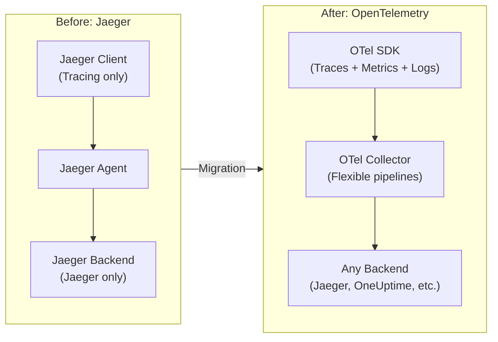
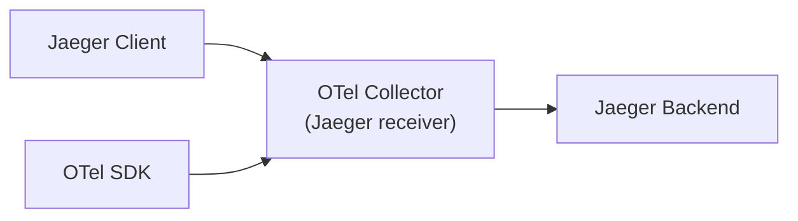

# Migrating from Jaeger to OpenTelemetry

[Nawaz Dhandala](https://github.com/nicksocial129) - December 17, 2025

**Tags:** OpenTelemetry, Jaeger, Migration, Distributed Tracing, Observability

**Description:** A complete guide to migrating from Jaeger client libraries to OpenTelemetry SDKs while maintaining backward compatibility and minimizing disruption.

---

> Jaeger has been a cornerstone of distributed tracing, but OpenTelemetry is now the industry standard. The good news? Migration can be gradual and low-risk with the right approach.

Jaeger pioneered distributed tracing in the cloud-native ecosystem. As OpenTelemetry becomes the standard, organizations need to migrate their instrumentation while maintaining observability continuity. This guide provides a step-by-step migration path.

## Table of Contents

1. [Why Migrate from Jaeger to OpenTelemetry](#1-why-migrate-from-jaeger-to-opentelemetry)
2. [Migration Strategies](#2-migration-strategies)
3. [Collector-Level Migration](#3-collector-level-migration)
4. [SDK Migration by Language](#4-sdk-migration-by-language)
5. [Maintaining Backward Compatibility](#5-maintaining-backward-compatibility)
6. [Data Migration Considerations](#6-data-migration-considerations)
7. [Validation and Testing](#7-validation-and-testing)
8. [Rollback Planning](#8-rollback-planning)

## 1. Why Migrate from Jaeger to OpenTelemetry

### Comparison Overview

| Aspect | Jaeger | OpenTelemetry |
|--------|--------|---------------|
| Scope | Tracing only | Traces, metrics, logs |
| Standardization | Jaeger-specific | Industry standard |
| Vendor support | Limited | Universal |
| Active development | Maintenance mode | Active development |
| Ecosystem | Jaeger ecosystem | Vast OTel ecosystem |
| Future | Recommends OTel | Long-term standard |

### Benefits of Migration



## 2. Migration Strategies

### Strategy 1: Big Bang (Not Recommended)

Replace all instrumentation at once.
- **Risk**: High
- **Downtime**: Potential
- **Use when**: Small system, test environment

### Strategy 2: Collector-First (Recommended)

**Phase 1: Deploy OTel Collector**



**Phase 2:** Migrate SDKs gradually

**Phase 3:** Switch backend

### Strategy 3: Service-by-Service

Migrate one service at a time, validating each step.

### Migration Timeline

| Phase | Duration | Activities |
|-------|----------|------------|
| Planning | 1-2 weeks | Inventory, risk assessment |
| Collector Setup | 1 week | Deploy OTel Collector |
| Pilot Service | 1-2 weeks | Migrate one service, validate |
| Gradual Rollout | 4-8 weeks | Migrate remaining services |
| Cleanup | 1-2 weeks | Remove Jaeger dependencies |

## 3. Collector-Level Migration

### Step 1: Deploy OpenTelemetry Collector

```yaml
# otel-collector-jaeger-migration.yaml
apiVersion: v1
kind: ConfigMap
metadata:
  name: otel-collector-config
  namespace: observability
data:
  config.yaml: |
    receivers:
      # Receive from Jaeger clients
      jaeger:
        protocols:
          thrift_compact:
            endpoint: 0.0.0.0:6831
          thrift_binary:
            endpoint: 0.0.0.0:6832
          thrift_http:
            endpoint: 0.0.0.0:14268
          grpc:
            endpoint: 0.0.0.0:14250

      # Receive from OTel clients
      otlp:
        protocols:
          grpc:
            endpoint: 0.0.0.0:4317
          http:
            endpoint: 0.0.0.0:4318

    processors:
      batch:
        timeout: 1s
        send_batch_size: 1024

      # Normalize Jaeger spans to OTel format
      transform:
        trace_statements:
          - context: span
            statements:
              # Normalize Jaeger operation name to OTel span name
              - set(name, attributes["operation.name"]) where attributes["operation.name"] != nil

    exporters:
      # Continue sending to Jaeger backend during migration
      jaeger:
        endpoint: jaeger-collector.observability:14250
        tls:
          insecure: true

      # Also send to new backend
      otlphttp:
        endpoint: https://otlp.oneuptime.com
        headers:
          x-oneuptime-token: ${ONEUPTIME_TOKEN}

    service:
      pipelines:
        traces:
          receivers: [jaeger, otlp]
          processors: [transform, batch]
          exporters: [jaeger, otlphttp]
```

### Step 2: Update Jaeger Clients to Point to Collector

```yaml
# Before: Direct to Jaeger Agent
JAEGER_AGENT_HOST: jaeger-agent
JAEGER_AGENT_PORT: 6831

# After: Point to OTel Collector
JAEGER_AGENT_HOST: otel-collector
JAEGER_AGENT_PORT: 6831
```

### Step 3: Verify Data Flow

```bash
# Check collector metrics
curl http://otel-collector:8888/metrics | grep receiver

# Expected output:
# otelcol_receiver_accepted_spans{receiver="jaeger",service_instance_id="...",transport="thrift_compact"} 1234
# otelcol_receiver_accepted_spans{receiver="otlp",service_instance_id="...",transport="grpc"} 5678
```

## 4. SDK Migration by Language

### Go Migration

```go
// Before: Jaeger Client
import (
    "github.com/uber/jaeger-client-go"
    jaegercfg "github.com/uber/jaeger-client-go/config"
)

func initJaegerTracer() (opentracing.Tracer, io.Closer, error) {
    cfg := jaegercfg.Configuration{
        ServiceName: "my-service",
        Sampler: &jaegercfg.SamplerConfig{
            Type:  jaeger.SamplerTypeConst,
            Param: 1,
        },
        Reporter: &jaegercfg.ReporterConfig{
            LogSpans: true,
        },
    }
    return cfg.NewTracer()
}

// After: OpenTelemetry SDK
import (
    "go.opentelemetry.io/otel"
    "go.opentelemetry.io/otel/exporters/otlp/otlptrace/otlptracegrpc"
    "go.opentelemetry.io/otel/sdk/trace"
)

func initOTelTracer(ctx context.Context) (*trace.TracerProvider, error) {
    exporter, err := otlptracegrpc.New(ctx,
        otlptracegrpc.WithEndpoint("otel-collector:4317"),
        otlptracegrpc.WithInsecure(),
    )
    if err != nil {
        return nil, err
    }

    tp := trace.NewTracerProvider(
        trace.WithBatcher(exporter),
        trace.WithResource(resource.NewWithAttributes(
            semconv.SchemaURL,
            semconv.ServiceNameKey.String("my-service"),
        )),
    )

    otel.SetTracerProvider(tp)
    return tp, nil
}

// Usage change
// Before: opentracing.GlobalTracer().StartSpan("operation")
// After:  otel.Tracer("my-service").Start(ctx, "operation")
```

### Java Migration

```java
// Before: Jaeger Client
import io.jaegertracing.Configuration;
import io.opentracing.Tracer;

Tracer tracer = Configuration.fromEnv("my-service")
    .withSampler(Configuration.SamplerConfiguration.fromEnv()
        .withType("const")
        .withParam(1))
    .withReporter(Configuration.ReporterConfiguration.fromEnv()
        .withLogSpans(true))
    .getTracer();

// After: OpenTelemetry SDK
import io.opentelemetry.api.GlobalOpenTelemetry;
import io.opentelemetry.api.trace.Tracer;
import io.opentelemetry.exporter.otlp.trace.OtlpGrpcSpanExporter;
import io.opentelemetry.sdk.OpenTelemetrySdk;
import io.opentelemetry.sdk.trace.SdkTracerProvider;
import io.opentelemetry.sdk.trace.export.BatchSpanProcessor;

OtlpGrpcSpanExporter exporter = OtlpGrpcSpanExporter.builder()
    .setEndpoint("http://otel-collector:4317")
    .build();

SdkTracerProvider tracerProvider = SdkTracerProvider.builder()
    .addSpanProcessor(BatchSpanProcessor.builder(exporter).build())
    .setResource(Resource.create(Attributes.of(
        ResourceAttributes.SERVICE_NAME, "my-service"
    )))
    .build();

OpenTelemetrySdk.builder()
    .setTracerProvider(tracerProvider)
    .buildAndRegisterGlobal();

Tracer tracer = GlobalOpenTelemetry.getTracer("my-service");
```

### Node.js Migration

```javascript
// Before: Jaeger Client
const { initTracer } = require('jaeger-client');

const config = {
  serviceName: 'my-service',
  sampler: {
    type: 'const',
    param: 1,
  },
  reporter: {
    logSpans: true,
    agentHost: 'jaeger-agent',
    agentPort: 6831,
  },
};

const tracer = initTracer(config);

// After: OpenTelemetry SDK
const { NodeTracerProvider } = require('@opentelemetry/sdk-trace-node');
const { BatchSpanProcessor } = require('@opentelemetry/sdk-trace-base');
const { OTLPTraceExporter } = require('@opentelemetry/exporter-trace-otlp-grpc');
const { Resource } = require('@opentelemetry/resources');
const { SemanticResourceAttributes } = require('@opentelemetry/semantic-conventions');

const provider = new NodeTracerProvider({
  resource: new Resource({
    [SemanticResourceAttributes.SERVICE_NAME]: 'my-service',
  }),
});

provider.addSpanProcessor(
  new BatchSpanProcessor(
    new OTLPTraceExporter({
      url: 'grpc://otel-collector:4317',
    })
  )
);

provider.register();

const tracer = provider.getTracer('my-service');
```

### Python Migration

```python
# Before: Jaeger Client
from jaeger_client import Config

config = Config(
    config={
        'sampler': {
            'type': 'const',
            'param': 1,
        },
        'local_agent': {
            'reporting_host': 'jaeger-agent',
            'reporting_port': '6831',
        },
        'logging': True,
    },
    service_name='my-service',
)
tracer = config.initialize_tracer()

# After: OpenTelemetry SDK
from opentelemetry import trace
from opentelemetry.sdk.trace import TracerProvider
from opentelemetry.sdk.trace.export import BatchSpanProcessor
from opentelemetry.exporter.otlp.proto.grpc.trace_exporter import OTLPSpanExporter
from opentelemetry.sdk.resources import Resource, SERVICE_NAME

resource = Resource(attributes={
    SERVICE_NAME: "my-service"
})

provider = TracerProvider(resource=resource)
processor = BatchSpanProcessor(OTLPSpanExporter(endpoint="otel-collector:4317"))
provider.add_span_processor(processor)
trace.set_tracer_provider(provider)

tracer = trace.get_tracer("my-service")
```

## 5. Maintaining Backward Compatibility

### OpenTracing Bridge

Use the OpenTracing shim during migration:

```go
// Go OpenTracing Bridge
import (
    "go.opentelemetry.io/otel"
    "go.opentelemetry.io/otel/bridge/opentracing"
)

func setupBridge() {
    // Create OTel tracer provider (as shown above)
    tp := initOTelTracer()

    // Create bridge
    bridge, wrapperProvider := opentracing.NewTracerPair(tp.Tracer(""))

    // Set as global OpenTracing tracer
    opentracing.SetGlobalTracer(bridge)

    // Existing code using OpenTracing continues to work
    span := opentracing.GlobalTracer().StartSpan("operation")
    defer span.Finish()

    // But spans are exported via OTel
}
```

```java
// Java OpenTracing Bridge
import io.opentelemetry.opentracingshim.OpenTracingShim;
import io.opentracing.Tracer;

// Create OTel SDK (as shown above)
OpenTelemetrySdk otelSdk = createOTelSdk();

// Create OpenTracing shim
Tracer openTracingTracer = OpenTracingShim.createTracerShim(otelSdk);

// Register as global tracer
io.opentracing.util.GlobalTracer.registerIfAbsent(openTracingTracer);

// Existing OpenTracing code continues to work
Span span = GlobalTracer.get().buildSpan("operation").start();
```

### Dual Export During Migration

```yaml
# Collector config for dual export
exporters:
  # Keep sending to Jaeger
  jaeger:
    endpoint: jaeger-collector:14250

  # Also send to new backend
  otlphttp:
    endpoint: https://otlp.oneuptime.com

service:
  pipelines:
    traces:
      receivers: [jaeger, otlp]
      processors: [batch]
      exporters: [jaeger, otlphttp]  # Both exporters
```

## 6. Data Migration Considerations

### Trace ID Format Compatibility

```go
// Jaeger uses 128-bit trace IDs (same as OTel)
// But older Jaeger clients might use 64-bit

// In collector, convert 64-bit to 128-bit
processors:
  transform:
    trace_statements:
      - context: span
        statements:
          # Pad 64-bit trace IDs to 128-bit
          - set(trace_id, Concat(["0000000000000000", trace_id]))
            where Len(trace_id) == 16
```

### Historical Data Access

```yaml
# Keep Jaeger backend running for historical queries
# New traces go to both backends

services:
  jaeger-query:
    image: jaegertracing/jaeger-query:latest
    environment:
      SPAN_STORAGE_TYPE: elasticsearch
      ES_SERVER_URLS: http://elasticsearch:9200

  # New OTel-based query (e.g., OneUptime)
  # Handles new traces after migration
```

### Baggage Migration

```go
// Before: Jaeger Baggage
span.SetBaggageItem("user-id", "123")
userId := span.BaggageItem("user-id")

// After: OpenTelemetry Baggage
import "go.opentelemetry.io/otel/baggage"

member, _ := baggage.NewMember("user-id", "123")
bag, _ := baggage.New(member)
ctx = baggage.ContextWithBaggage(ctx, bag)

// Reading baggage
bag = baggage.FromContext(ctx)
userId := bag.Member("user-id").Value()
```

## 7. Validation and Testing

### Verification Checklist

```yaml
# migration-validation.yaml
validation:
  collector_level:
    - name: Jaeger receiver accepts spans
      check: otelcol_receiver_accepted_spans{receiver="jaeger"} > 0
    - name: OTLP receiver accepts spans
      check: otelcol_receiver_accepted_spans{receiver="otlp"} > 0
    - name: No dropped spans
      check: otelcol_processor_dropped_spans == 0

  application_level:
    - name: Traces appear in new backend
      check: Query new backend for recent traces
    - name: Trace context propagates
      check: Cross-service traces show parent-child
    - name: Sampling works correctly
      check: Sample rate matches configuration

  compatibility:
    - name: Existing dashboards work
      check: Jaeger UI shows traces
    - name: Alerts still fire
      check: Test alert conditions
```

### Integration Test

```go
// migration_test.go
func TestJaegerToOTelMigration(t *testing.T) {
    // Create Jaeger span
    jaegerTracer := initJaegerTracer()
    jaegerSpan := jaegerTracer.StartSpan("jaeger-operation")
    jaegerSpan.SetTag("test", "jaeger")
    jaegerSpan.Finish()

    // Create OTel span
    otelTracer := initOTelTracer()
    ctx, otelSpan := otelTracer.Start(context.Background(), "otel-operation")
    otelSpan.SetAttributes(attribute.String("test", "otel"))
    otelSpan.End()

    // Verify both appear in collector
    time.Sleep(5 * time.Second)

    // Query collector metrics
    metrics := getCollectorMetrics()

    assert.True(t, metrics["receiver_accepted_spans"]["jaeger"] > 0,
        "Jaeger spans should be received")
    assert.True(t, metrics["receiver_accepted_spans"]["otlp"] > 0,
        "OTel spans should be received")

    // Verify in backend
    jaegerTraces := queryBackend("jaeger-operation")
    otelTraces := queryBackend("otel-operation")

    assert.NotEmpty(t, jaegerTraces, "Jaeger traces should appear")
    assert.NotEmpty(t, otelTraces, "OTel traces should appear")
}
```

### Comparison Dashboard

```sql
-- Query to compare Jaeger vs OTel traces
-- Ensure parity during migration

-- Trace count by source
SELECT
  CASE
    WHEN resource_attributes['telemetry.sdk.name'] = 'opentelemetry' THEN 'OTel'
    ELSE 'Jaeger'
  END as source,
  COUNT(*) as trace_count,
  AVG(duration_ms) as avg_duration
FROM traces
WHERE timestamp > NOW() - INTERVAL '1 hour'
GROUP BY source;

-- Missing traces (traces in Jaeger but not OTel)
SELECT j.trace_id
FROM jaeger_traces j
LEFT JOIN otel_traces o ON j.trace_id = o.trace_id
WHERE o.trace_id IS NULL
  AND j.timestamp > NOW() - INTERVAL '1 hour';
```

## 8. Rollback Planning

### Rollback Triggers

| Issue | Severity | Rollback Action |
|-------|----------|-----------------|
| Complete data loss | Critical | Immediate rollback |
| >10% trace loss | High | Rollback within 1 hour |
| Performance degradation >50% | High | Rollback within 2 hours |
| Minor data discrepancies | Low | Continue, investigate |

### Rollback Procedure

```yaml
# rollback-procedure.yaml
steps:
  1_revert_collector:
    description: Revert collector to Jaeger-only mode
    commands:
      - kubectl apply -f collector-jaeger-only.yaml
      - kubectl rollout status deployment/otel-collector

  2_verify_jaeger:
    description: Verify Jaeger receiving traces
    commands:
      - curl -s jaeger-query:16686/api/traces?service=my-service | jq '.data | length'

  3_revert_sdk:
    description: Redeploy applications with Jaeger SDK
    commands:
      - kubectl rollout undo deployment/my-service

  4_verify_full:
    description: Full system verification
    commands:
      - ./scripts/verify-tracing.sh
```

### Collector Rollback Config

```yaml
# collector-jaeger-only.yaml (rollback config)
receivers:
  jaeger:
    protocols:
      thrift_compact:
        endpoint: 0.0.0.0:6831
      grpc:
        endpoint: 0.0.0.0:14250

exporters:
  jaeger:
    endpoint: jaeger-collector:14250

service:
  pipelines:
    traces:
      receivers: [jaeger]
      processors: [batch]
      exporters: [jaeger]
```

## Summary

Migrating from Jaeger to OpenTelemetry:

1. **Start with Collector**: Deploy OTel Collector with Jaeger receiver
2. **Gradual SDK migration**: Migrate services one at a time
3. **Use bridges**: OpenTracing shim for compatibility
4. **Dual export**: Send to both backends during transition
5. **Validate thoroughly**: Compare traces in both systems
6. **Plan for rollback**: Have clear rollback procedures

The migration is a journey, not a sprint. Take it step by step, validate at each stage, and maintain the ability to rollback.

## Migrate to OneUptime with OpenTelemetry

OneUptime provides native OpenTelemetry support with a migration-friendly approach. Send traces from both Jaeger and OTel SDKs during your transition.

[Start Free Trial](https://oneuptime.com/signup) - Seamless tracing migration.

## See Also

- [OpenTelemetry Collector Deep Dive](/blog/opentelemetry-collector)
- [Migrating from Zipkin to OpenTelemetry](/blog/migrating-zipkin-opentelemetry)
- [OpenTelemetry Best Practices](/blog/opentelemetry-best-practices)
