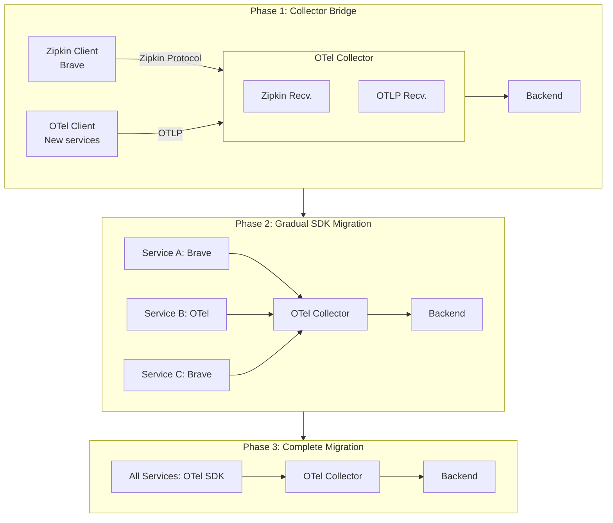

# Migrating from Zipkin to OpenTelemetry

[Nawaz Dhandala](https://github.com/nicksocial129) - December 17, 2025

**Tags:** OpenTelemetry, Zipkin, Migration, Distributed Tracing, Observability

**Description:** Step-by-step guide to migrating from Zipkin tracing to OpenTelemetry, covering Brave instrumentation replacement, collector setup, and backward compatibility.

---

> Zipkin pioneered open-source distributed tracing. As OpenTelemetry emerges as the industry standard, migrating your Zipkin instrumentation ensures long-term compatibility and access to a richer observability ecosystem.

Zipkin has been a foundational tool in the distributed tracing landscape. This guide provides a comprehensive migration path from Zipkin (and its Brave instrumentation library) to OpenTelemetry while maintaining tracing continuity.

## Table of Contents

1. [Understanding the Migration](#1-understanding-the-migration)
2. [Collector-First Approach](#2-collector-first-approach)
3. [SDK Migration by Language](#3-sdk-migration-by-language)
4. [B3 to W3C Context Migration](#4-b3-to-w3c-context-migration)
5. [Reporter and Exporter Migration](#5-reporter-and-exporter-migration)
6. [Span Model Differences](#6-span-model-differences)
7. [Testing and Validation](#7-testing-and-validation)
8. [Complete Migration Example](#8-complete-migration-example)

## 1. Understanding the Migration

### Zipkin vs OpenTelemetry Comparison

| Component | Zipkin | OpenTelemetry |
|-----------|--------|---------------|
| Client Library | Brave | OTel SDK |
| Propagation | B3 (single/multi) | W3C Trace Context |
| Wire Format | Zipkin JSON/Thrift | OTLP (Protobuf/JSON) |
| Server | Zipkin Server | OTel Collector + Backend |
| Scope | Tracing | Traces + Metrics + Logs |

### Migration Architecture



## 2. Collector-First Approach

### Deploy OpenTelemetry Collector with Zipkin Receiver

```yaml
# otel-collector-zipkin.yaml
apiVersion: v1
kind: ConfigMap
metadata:
  name: otel-collector-config
data:
  config.yaml: |
    receivers:
      # Accept Zipkin spans
      zipkin:
        endpoint: 0.0.0.0:9411

      # Accept OTLP for migrated services
      otlp:
        protocols:
          grpc:
            endpoint: 0.0.0.0:4317
          http:
            endpoint: 0.0.0.0:4318

    processors:
      batch:
        timeout: 1s
        send_batch_size: 1024

      # Convert Zipkin span model to OTel
      transform:
        trace_statements:
        - context: span
          statements:
          # Normalize Zipkin annotations to OTel events
          - set(events, zipkin_annotations) where zipkin_annotations != nil

    exporters:
      # Continue sending to Zipkin during migration
      zipkin:
        endpoint: http://zipkin-server:9411/api/v2/spans

      # Send to new observability backend
      otlphttp:
        endpoint: https://otlp.oneuptime.com
        headers:
          x-oneuptime-token: ${ONEUPTIME_TOKEN}

    service:
      pipelines:
        traces:
          receivers: [zipkin, otlp]
          processors: [transform, batch]
          exporters: [zipkin, otlphttp]
```

### Update Application Configuration

```yaml
# Before: Direct to Zipkin
ZIPKIN_ENDPOINT: http://zipkin:9411/api/v2/spans

# After: Point to OTel Collector
ZIPKIN_ENDPOINT: http://otel-collector:9411/api/v2/spans
```

## 3. SDK Migration by Language

### Java: Brave to OpenTelemetry

```java
// Before: Brave/Zipkin
import brave.Tracing;
import brave.propagation.B3Propagation;
import zipkin2.reporter.AsyncReporter;
import zipkin2.reporter.okhttp3.OkHttpSender;

Tracing tracing = Tracing.newBuilder()
    .localServiceName("my-service")
    .propagationFactory(B3Propagation.FACTORY)
    .spanReporter(AsyncReporter.create(
        OkHttpSender.create("http://zipkin:9411/api/v2/spans")
    ))
    .build();

Tracer tracer = tracing.tracer();
Span span = tracer.newTrace().name("operation").start();
// ...
span.finish();

// After: OpenTelemetry
import io.opentelemetry.api.GlobalOpenTelemetry;
import io.opentelemetry.api.trace.Tracer;
import io.opentelemetry.api.trace.Span;
import io.opentelemetry.context.Scope;
import io.opentelemetry.exporter.otlp.trace.OtlpGrpcSpanExporter;
import io.opentelemetry.sdk.OpenTelemetrySdk;
import io.opentelemetry.sdk.trace.SdkTracerProvider;
import io.opentelemetry.sdk.trace.export.BatchSpanProcessor;

OtlpGrpcSpanExporter exporter = OtlpGrpcSpanExporter.builder()
    .setEndpoint("http://otel-collector:4317")
    .build();

SdkTracerProvider tracerProvider = SdkTracerProvider.builder()
    .addSpanProcessor(BatchSpanProcessor.builder(exporter).build())
    .setResource(Resource.create(Attributes.of(
        ResourceAttributes.SERVICE_NAME, "my-service"
    )))
    .build();

OpenTelemetrySdk.builder()
    .setTracerProvider(tracerProvider)
    .buildAndRegisterGlobal();

Tracer tracer = GlobalOpenTelemetry.getTracer("my-service");
Span span = tracer.spanBuilder("operation").startSpan();
try (Scope scope = span.makeCurrent()) {
    // ...
} finally {
    span.end();
}
```

### Spring Boot Migration

```java
// Before: spring-cloud-sleuth with Zipkin
// pom.xml
/*
<dependency>
    <groupId>org.springframework.cloud</groupId>
    <artifactId>spring-cloud-starter-sleuth</artifactId>
</dependency>
<dependency>
    <groupId>org.springframework.cloud</groupId>
    <artifactId>spring-cloud-sleuth-zipkin</artifactId>
</dependency>
*/

// application.yml
/*
spring:
  sleuth:
    sampler:
      probability: 1.0
  zipkin:
    base-url: http://zipkin:9411
*/

// After: Spring Boot with OpenTelemetry
// pom.xml
/*
<dependency>
    <groupId>io.opentelemetry.instrumentation</groupId>
    <artifactId>opentelemetry-spring-boot-starter</artifactId>
</dependency>
*/

// application.yml
/*
otel:
  exporter:
    otlp:
      endpoint: http://otel-collector:4317
  resource:
    attributes:
      service.name: my-service
*/

// Or use the Java agent for zero-code instrumentation
// java -javaagent:opentelemetry-javaagent.jar -jar myapp.jar
```

### Go: OpenCensus/Zipkin to OpenTelemetry

```go
// Before: OpenCensus with Zipkin exporter
import (
    "go.opencensus.io/trace"
    "contrib.go.opencensus.io/exporter/zipkin"
    openzipkin "github.com/openzipkin/zipkin-go"
    httpreporter "github.com/openzipkin/zipkin-go/reporter/http"
)

reporter := httpreporter.NewReporter("http://zipkin:9411/api/v2/spans")
localEndpoint, _ := openzipkin.NewEndpoint("my-service", "localhost:0")
exporter := zipkin.NewExporter(reporter, localEndpoint)
trace.RegisterExporter(exporter)

// After: OpenTelemetry
import (
    "go.opentelemetry.io/otel"
    "go.opentelemetry.io/otel/exporters/otlp/otlptrace/otlptracegrpc"
    "go.opentelemetry.io/otel/sdk/trace"
    "go.opentelemetry.io/otel/sdk/resource"
    semconv "go.opentelemetry.io/otel/semconv/v1.21.0"
)

func initTracer(ctx context.Context) (*trace.TracerProvider, error) {
    exporter, err := otlptracegrpc.New(ctx,
        otlptracegrpc.WithEndpoint("otel-collector:4317"),
        otlptracegrpc.WithInsecure(),
    )
    if err != nil {
        return nil, err
    }

    tp := trace.NewTracerProvider(
        trace.WithBatcher(exporter),
        trace.WithResource(resource.NewWithAttributes(
            semconv.SchemaURL,
            semconv.ServiceName("my-service"),
        )),
    )

    otel.SetTracerProvider(tp)
    return tp, nil
}
```

### Node.js Migration

```javascript
// Before: zipkin-js
const { Tracer, ExplicitContext, BatchRecorder } = require('zipkin');
const { HttpLogger } = require('zipkin-transport-http');

const recorder = new BatchRecorder({
  logger: new HttpLogger({
    endpoint: 'http://zipkin:9411/api/v2/spans'
  })
});

const tracer = new Tracer({
  ctxImpl: new ExplicitContext(),
  recorder,
  localServiceName: 'my-service'
});

// After: OpenTelemetry
const { NodeTracerProvider } = require('@opentelemetry/sdk-trace-node');
const { BatchSpanProcessor } = require('@opentelemetry/sdk-trace-base');
const { OTLPTraceExporter } = require('@opentelemetry/exporter-trace-otlp-grpc');
const { Resource } = require('@opentelemetry/resources');
const { SemanticResourceAttributes } = require('@opentelemetry/semantic-conventions');
const { registerInstrumentations } = require('@opentelemetry/instrumentation');
const { HttpInstrumentation } = require('@opentelemetry/instrumentation-http');

const provider = new NodeTracerProvider({
  resource: new Resource({
    [SemanticResourceAttributes.SERVICE_NAME]: 'my-service',
  }),
});

provider.addSpanProcessor(
  new BatchSpanProcessor(
    new OTLPTraceExporter({
      url: 'grpc://otel-collector:4317',
    })
  )
);

provider.register();

registerInstrumentations({
  instrumentations: [new HttpInstrumentation()],
});
```

### Python Migration

```python
# Before: py_zipkin
from py_zipkin import Encoding
from py_zipkin.zipkin import zipkin_span
from py_zipkin.transport import BaseTransportHandler

class HttpTransport(BaseTransportHandler):
    def get_max_payload_bytes(self):
        return None

    def send(self, encoded_span):
        requests.post(
            'http://zipkin:9411/api/v2/spans',
            data=encoded_span,
            headers={'Content-Type': 'application/json'}
        )

with zipkin_span(
    service_name='my-service',
    span_name='operation',
    transport_handler=HttpTransport(),
    encoding=Encoding.V2_JSON,
):
    # do work
    pass

# After: OpenTelemetry
from opentelemetry import trace
from opentelemetry.sdk.trace import TracerProvider
from opentelemetry.sdk.trace.export import BatchSpanProcessor
from opentelemetry.exporter.otlp.proto.grpc.trace_exporter import OTLPSpanExporter
from opentelemetry.sdk.resources import Resource, SERVICE_NAME

resource = Resource(attributes={
    SERVICE_NAME: "my-service"
})

provider = TracerProvider(resource=resource)
processor = BatchSpanProcessor(
    OTLPSpanExporter(endpoint="otel-collector:4317", insecure=True)
)
provider.add_span_processor(processor)
trace.set_tracer_provider(provider)

tracer = trace.get_tracer("my-service")

with tracer.start_as_current_span("operation"):
    # do work
    pass
```

## 4. B3 to W3C Context Migration

### Understanding Propagation Formats

```
B3 Single Header:
X-B3-TraceId-SpanId-Sampled
b3: 80f198ee56343ba864fe8b2a57d3eff7-e457b5a2e4d86bd1-1

B3 Multi-Header:
X-B3-TraceId: 80f198ee56343ba864fe8b2a57d3eff7
X-B3-SpanId: e457b5a2e4d86bd1
X-B3-Sampled: 1

W3C Trace Context:
traceparent: 00-80f198ee56343ba864fe8b2a57d3eff7-e457b5a2e4d86bd1-01
tracestate: vendor=value
```

### Composite Propagator for Migration

```go
// Go: Support both B3 and W3C during migration
import (
    "go.opentelemetry.io/otel"
    "go.opentelemetry.io/otel/propagation"
    "go.opentelemetry.io/contrib/propagators/b3"
)

func setupPropagators() {
    // Support both B3 and W3C Trace Context
    propagator := propagation.NewCompositeTextMapPropagator(
        propagation.TraceContext{},  // W3C (primary)
        propagation.Baggage{},
        b3.New(b3.WithInjectEncoding(b3.B3MultipleHeader)), // B3 (compatibility)
    )

    otel.SetTextMapPropagator(propagator)
}
```

```java
// Java: Composite propagator
import io.opentelemetry.api.GlobalOpenTelemetry;
import io.opentelemetry.context.propagation.ContextPropagators;
import io.opentelemetry.context.propagation.TextMapPropagator;
import io.opentelemetry.extension.trace.propagation.B3Propagator;

TextMapPropagator propagator = TextMapPropagator.composite(
    W3CTraceContextPropagator.getInstance(),
    W3CBaggagePropagator.getInstance(),
    B3Propagator.injectingMultiHeaders()
);

OpenTelemetrySdk.builder()
    .setPropagators(ContextPropagators.create(propagator))
    .buildAndRegisterGlobal();
```

```javascript
// Node.js: Composite propagator
const { CompositePropagator } = require('@opentelemetry/core');
const { W3CTraceContextPropagator } = require('@opentelemetry/core');
const { B3Propagator, B3InjectEncoding } = require('@opentelemetry/propagator-b3');

const propagator = new CompositePropagator({
  propagators: [
    new W3CTraceContextPropagator(),
    new B3Propagator({ injectEncoding: B3InjectEncoding.MULTI_HEADER }),
  ],
});

provider.register({
  propagator,
});
```

### Collector-Level Propagation Handling

```yaml
# Collector config to handle both formats
receivers:
  zipkin:
    endpoint: 0.0.0.0:9411

  otlp:
    protocols:
      grpc:
        endpoint: 0.0.0.0:4317
      http:
        endpoint: 0.0.0.0:4318
        # Include B3 propagation headers
        include_metadata: true

processors:
  # Ensure trace context is preserved
  batch: {}

exporters:
  otlphttp:
    endpoint: https://otlp.oneuptime.com
```

## 5. Reporter and Exporter Migration

### Zipkin Reporter to OTel Exporter Mapping

| Zipkin Reporter | OpenTelemetry Exporter |
|-----------------|------------------------|
| URLConnectionSender | OtlpHttpSpanExporter |
| OkHttpSender | OtlpHttpSpanExporter |
| KafkaSender | KafkaSpanExporter |
| RabbitMQSender | Custom exporter |
| AsyncReporter | BatchSpanProcessor |

### Configuration Mapping

```yaml
# Zipkin configuration
zipkin:
  sender:
    type: web
    endpoint: http://zipkin:9411/api/v2/spans
  reporter:
    flush-interval: 1000
    max-queue-size: 1000

# Equivalent OpenTelemetry configuration
otel:
  exporter:
    otlp:
      endpoint: http://otel-collector:4317
      protocol: grpc
  bsp:  # BatchSpanProcessor
    schedule-delay: 1000
    max-queue-size: 2048
    max-export-batch-size: 512
```

## 6. Span Model Differences

### Zipkin vs OTel Span Models

```
Zipkin Span:
{
  "traceId": "5982fe77008310cc80f1da5e10147519",
  "id": "90394f6bcffb5d13",
  "parentId": "5982fe77008310cc",
  "name": "get /api/users",
  "kind": "SERVER",
  "timestamp": 1472470996199000,
  "duration": 207000,
  "localEndpoint": {
    "serviceName": "user-service",
    "ipv4": "127.0.0.1",
    "port": 8080
  },
  "tags": {
    "http.method": "GET",
    "http.path": "/api/users"
  },
  "annotations": [
    {"timestamp": 1472470996238000, "value": "cache.miss"}
  ]
}

OpenTelemetry Span:
{
  "traceId": "5982fe77008310cc80f1da5e10147519",
  "spanId": "90394f6bcffb5d13",
  "parentSpanId": "5982fe77008310cc",
  "name": "GET /api/users",
  "kind": "SPAN_KIND_SERVER",
  "startTimeUnixNano": 1472470996199000000,
  "endTimeUnixNano": 1472470996406000000,
  "attributes": [
    {"key": "http.method", "value": {"stringValue": "GET"}},
    {"key": "http.route", "value": {"stringValue": "/api/users"}}
  ],
  "events": [
    {"name": "cache.miss", "timeUnixNano": 1472470996238000000}
  ],
  "status": {"code": "STATUS_CODE_OK"},
  "resource": {
    "attributes": [
      {"key": "service.name", "value": {"stringValue": "user-service"}}
    ]
  }
}
```

### Key Differences

| Zipkin | OpenTelemetry | Notes |
|--------|---------------|-------|
| tags | attributes | Same concept, different name |
| annotations | events | With timestamps |
| localEndpoint | Resource | Service metadata |
| kind | SpanKind | CLIENT, SERVER, etc. |
| timestamp + duration | startTime + endTime | Nanosecond precision |

## 7. Testing and Validation

### Migration Test Suite

```go
// migration_test.go
func TestZipkinToOTelMigration(t *testing.T) {
    ctx := context.Background()

    // Create span using Zipkin
    zipkinSpan := createZipkinSpan("zipkin-operation")

    // Create span using OTel
    otelTracer := otel.Tracer("test")
    _, otelSpan := otelTracer.Start(ctx, "otel-operation")
    otelSpan.End()

    // Wait for export
    time.Sleep(5 * time.Second)

    // Verify both in backend
    zipkinTraces, _ := queryBackend("zipkin-operation")
    otelTraces, _ := queryBackend("otel-operation")

    assert.NotEmpty(t, zipkinTraces, "Zipkin traces should be present")
    assert.NotEmpty(t, otelTraces, "OTel traces should be present")
}

func TestCrossServicePropagation(t *testing.T) {
    // Service A (Zipkin) calls Service B (OTel)
    // Verify trace context propagates correctly

    // Start Zipkin span
    zipkinSpan := createZipkinSpan("service-a-call")

    // Extract B3 headers
    headers := extractB3Headers(zipkinSpan)

    // Service B receives and creates OTel span
    otelCtx := extractOTelContext(headers)
    _, otelSpan := otel.Tracer("service-b").Start(otelCtx, "service-b-handle")
    otelSpan.End()

    // Verify same trace ID
    assert.Equal(t,
        zipkinSpan.TraceID(),
        otelSpan.SpanContext().TraceID().String(),
        "Trace IDs should match",
    )
}
```

### Validation Dashboard

```sql
-- Compare Zipkin vs OTel traces
SELECT
    source,
    COUNT(*) as span_count,
    AVG(duration_ms) as avg_duration,
    COUNT(DISTINCT trace_id) as trace_count
FROM (
    SELECT
        'zipkin' as source,
        duration / 1000 as duration_ms,
        trace_id
    FROM zipkin_spans
    WHERE timestamp > NOW() - INTERVAL '1 hour'

    UNION ALL

    SELECT
        'otel' as source,
        (end_time - start_time) / 1000000 as duration_ms,
        trace_id
    FROM otel_spans
    WHERE start_time > NOW() - INTERVAL '1 hour'
) combined
GROUP BY source;
```

## 8. Complete Migration Example

### Step-by-Step Migration Script

```bash
#!/bin/bash
# migration.sh - Zipkin to OpenTelemetry Migration

set -e

echo "Phase 1: Deploy OTel Collector with Zipkin receiver"
kubectl apply -f otel-collector-zipkin.yaml
kubectl rollout status deployment/otel-collector -n observability

echo "Phase 2: Update Zipkin clients to point to collector"
kubectl set env deployment --all ZIPKIN_ENDPOINT=http://otel-collector:9411/api/v2/spans

echo "Phase 3: Verify traces flowing through collector"
sleep 30
TRACE_COUNT=$(curl -s otel-collector:8888/metrics | grep receiver_accepted_spans | grep zipkin | awk '{print $2}')
if [ "$TRACE_COUNT" -eq 0 ]; then
    echo "ERROR: No Zipkin traces received"
    exit 1
fi
echo "Zipkin traces flowing: $TRACE_COUNT"

echo "Phase 4: Migrate services one by one"
for service in service-a service-b service-c; do
    echo "Migrating $service..."

    # Deploy with OTel SDK
    kubectl apply -f deployments/$service-otel.yaml

    # Verify traces
    sleep 10
    OTEL_TRACES=$(curl -s otel-collector:8888/metrics | grep receiver_accepted_spans | grep otlp)
    echo "$service migrated, OTel traces: $OTEL_TRACES"
done

echo "Phase 5: Remove Zipkin receiver (optional)"
# kubectl apply -f otel-collector-final.yaml

echo "Migration complete!"
```

### Final Architecture

```yaml
# otel-collector-final.yaml (post-migration)
receivers:
  otlp:
    protocols:
      grpc:
        endpoint: 0.0.0.0:4317
      http:
        endpoint: 0.0.0.0:4318

processors:
  batch:
    timeout: 1s

exporters:
  otlphttp:
    endpoint: https://otlp.oneuptime.com
    headers:
      x-oneuptime-token: ${ONEUPTIME_TOKEN}

service:
  pipelines:
    traces:
      receivers: [otlp]
      processors: [batch]
      exporters: [otlphttp]
```

## Summary

Migrating from Zipkin to OpenTelemetry involves:

1. **Collector bridge**: Deploy OTel Collector with Zipkin receiver
2. **Gradual SDK migration**: Replace Brave/zipkin-js with OTel SDKs
3. **Propagation compatibility**: Use composite propagators during transition
4. **Validation**: Compare traces from both systems
5. **Cleanup**: Remove Zipkin dependencies after migration

The collector-first approach ensures zero downtime and allows gradual migration at your own pace.

## Migrate to OneUptime with OpenTelemetry

OneUptime provides native OpenTelemetry support and can receive traces from both Zipkin and OTel clients during your migration journey.

[Start Free Trial](https://oneuptime.com/signup) - Seamless Zipkin migration path.

## See Also

- [Migrating from Jaeger to OpenTelemetry](/blog/migrating-jaeger-opentelemetry)
- [OpenTelemetry Collector Configuration](/blog/opentelemetry-collector)
- [Context Propagation Deep Dive](/blog/opentelemetry-baggage-propagation)
