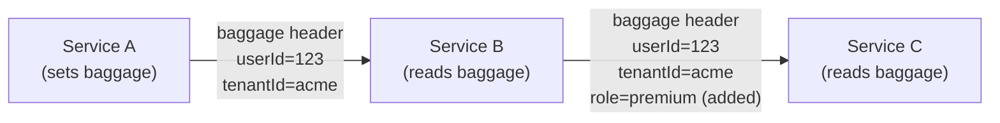

# Baggage Propagation in OpenTelemetry: Passing Custom Context Across Services

Author: [nawazdhandala](https://www.github.com/nawazdhandala)

Tags: OpenTelemetry, Baggage, Context Propagation, Distributed Systems, Observability

Description: A practical guide to OpenTelemetry Baggage- how to pass custom key-value context across service boundaries for request-scoped data like user IDs, feature flags, and tenant information.

---

> Baggage is the sidecar of distributed tracing. While trace context tells you where a request has been, baggage tells downstream services what they need to know about it.

This guide covers OpenTelemetry Baggage- what it is, how it propagates, when to use it, and how to implement it safely in production.

---

## Table of Contents

1. What is Baggage?
2. Baggage vs Span Attributes
3. How Baggage Propagates
4. Basic Usage
5. Common Use Cases
6. Implementation Examples
7. Extracting Baggage
8. Security Considerations
9. Performance Impact
10. Best Practices
11. Debugging Baggage

---

## 1. What is Baggage?

Baggage is a mechanism to **propagate user-defined key-value pairs** across service boundaries alongside trace context. It's part of the W3C Baggage specification.

### Key characteristics

| Aspect | Description |
|--------|-------------|
| Scope | Request-scoped, travels with the trace |
| Direction | Propagates downstream only |
| Mutability | Can be modified at any service |
| Transport | HTTP headers, gRPC metadata |
| Size | Small data only (< 8KB total recommended) |

### Baggage header format

```
baggage: userId=user123,tenantId=acme,featureFlag=newCheckout%3Dtrue

// Decoded:
// userId=user123
// tenantId=acme
// featureFlag=newCheckout=true (URL-encoded '=' in value)
```

---

## 2. Baggage vs Span Attributes

| Aspect | Baggage | Span Attributes |
|--------|---------|-----------------|
| Propagation | Crosses service boundaries | Local to one service |
| Visibility | All downstream services | Only the span that sets it |
| Persistence | Not stored by default | Stored with span |
| Use case | Share context downstream | Describe the current operation |

### When to use each

```typescript
// Use SPAN ATTRIBUTES for:
// - Operation-specific data (http.method, db.query)
// - Metrics you want to query later
// - Anything that describes THIS span
span.setAttribute('order.id', orderId);
span.setAttribute('http.status_code', 200);

// Use BAGGAGE for:
// - Data downstream services need
// - Request-scoped context (user, tenant)
// - Feature flags that affect behavior
Baggage.setEntry('user.id', { value: userId });
Baggage.setEntry('tenant.id', { value: tenantId });
```

---

## 3. How Baggage Propagates

### Propagation flow



### W3C Baggage header

```http
GET /api/orders HTTP/1.1
Host: orders.example.com
traceparent: 00-0af7651916cd43dd8448eb211c80319c-b7ad6b7169203331-01
baggage: userId=user123,tenantId=acme,featureFlags=newUI%3Dtrue
```

### Propagator configuration

```typescript
import { propagation } from '@opentelemetry/api';
import { W3CTraceContextPropagator } from '@opentelemetry/core';
import { W3CBaggagePropagator } from '@opentelemetry/core';
import { CompositePropagator } from '@opentelemetry/core';

// Enable both trace context and baggage propagation
propagation.setGlobalPropagator(
  new CompositePropagator({
    propagators: [
      new W3CTraceContextPropagator(),
      new W3CBaggagePropagator(),
    ],
  })
);
```

---

## 4. Basic Usage

### Setting baggage

```typescript
import { context, propagation, Baggage } from '@opentelemetry/api';

// Create baggage entries
const baggage = propagation.createBaggage({
  'user.id': { value: 'user-123' },
  'tenant.id': { value: 'acme-corp' },
  'request.priority': { value: 'high' },
});

// Set baggage in current context
const ctxWithBaggage = propagation.setBaggage(context.active(), baggage);

// Execute with baggage context
context.with(ctxWithBaggage, () => {
  // Baggage is now active and will propagate
  makeDownstreamCall();
});
```

### Reading baggage

```typescript
import { context, propagation } from '@opentelemetry/api';

function handleRequest() {
  const baggage = propagation.getBaggage(context.active());

  if (baggage) {
    const userId = baggage.getEntry('user.id')?.value;
    const tenantId = baggage.getEntry('tenant.id')?.value;

    console.log(`Processing for user ${userId} in tenant ${tenantId}`);
  }
}
```

### Modifying baggage

```typescript
import { context, propagation } from '@opentelemetry/api';

function enrichBaggage() {
  const currentBaggage = propagation.getBaggage(context.active()) || propagation.createBaggage();

  // Add new entry
  const enrichedBaggage = currentBaggage.setEntry('computed.score', {
    value: '95',
    metadata: 'trust-level=high',
  });

  // Continue with enriched baggage
  return propagation.setBaggage(context.active(), enrichedBaggage);
}
```

---

## 5. Common Use Cases

### User/tenant context

```typescript
// At API gateway
function authMiddleware(req, res, next) {
  const user = authenticateUser(req);

  const baggage = propagation.createBaggage({
    'user.id': { value: user.id },
    'user.role': { value: user.role },
    'tenant.id': { value: user.tenantId },
    'subscription.tier': { value: user.tier },
  });

  req.otelContext = propagation.setBaggage(context.active(), baggage);
  next();
}

// Downstream service reads it
function handleOrder(ctx: Context) {
  const baggage = propagation.getBaggage(ctx);
  const tier = baggage?.getEntry('subscription.tier')?.value;

  if (tier === 'enterprise') {
    return priorityProcessing();
  }
  return standardProcessing();
}
```

### Feature flags

```typescript
// Set feature flags at edge
function setFeatureFlags(req) {
  const flags = getFeatureFlagsForUser(req.user);

  const baggage = propagation.createBaggage({
    'feature.newCheckout': { value: String(flags.newCheckout) },
    'feature.betaAPI': { value: String(flags.betaAPI) },
    'experiment.priceTest': { value: flags.priceTestVariant },
  });

  return propagation.setBaggage(context.active(), baggage);
}

// Downstream checks flags
function processPayment(ctx: Context) {
  const baggage = propagation.getBaggage(ctx);
  const useNewCheckout = baggage?.getEntry('feature.newCheckout')?.value === 'true';

  if (useNewCheckout) {
    return newCheckoutFlow();
  }
  return legacyCheckoutFlow();
}
```

### Request routing hints

```typescript
// Set routing preference
const baggage = propagation.createBaggage({
  'routing.region': { value: 'eu-west-1' },
  'routing.prefer': { value: 'low-latency' },
  'routing.sticky': { value: 'session-abc123' },
});

// Load balancer/service mesh reads it
function routeRequest(ctx: Context) {
  const baggage = propagation.getBaggage(ctx);
  const preferredRegion = baggage?.getEntry('routing.region')?.value;

  return selectBackend(preferredRegion);
}
```

### Debugging context

```typescript
// Add debug info for troubleshooting
const baggage = propagation.createBaggage({
  'debug.source': { value: 'mobile-app-v2.3.1' },
  'debug.session': { value: 'sess-xyz789' },
  'debug.ab-test': { value: 'checkout-v2' },
});

// Later: correlate logs/traces with debug context
function logWithContext(message: string) {
  const baggage = propagation.getBaggage(context.active());
  logger.info(message, {
    source: baggage?.getEntry('debug.source')?.value,
    session: baggage?.getEntry('debug.session')?.value,
  });
}
```

---

## 6. Implementation Examples

### Express middleware

```typescript
import express from 'express';
import { context, propagation, trace } from '@opentelemetry/api';

const app = express();

// Extract incoming baggage and trace context
app.use((req, res, next) => {
  const extractedContext = propagation.extract(context.active(), req.headers);

  // Run handler with extracted context
  context.with(extractedContext, () => {
    // Baggage from upstream is now available
    const baggage = propagation.getBaggage(context.active());
    console.log('Incoming baggage:', baggage?.getAllEntries());

    next();
  });
});

// Set baggage for downstream calls
app.use((req, res, next) => {
  const currentBaggage = propagation.getBaggage(context.active()) || propagation.createBaggage();

  // Enrich with local context
  const enrichedBaggage = currentBaggage
    .setEntry('service.name', { value: 'order-service' })
    .setEntry('service.version', { value: '1.2.3' });

  req.otelContext = propagation.setBaggage(context.active(), enrichedBaggage);
  next();
});

// Route handler
app.get('/orders/:id', async (req, res) => {
  await context.with(req.otelContext, async () => {
    const order = await fetchOrder(req.params.id);
    res.json(order);
  });
});
```

### HTTP client with baggage

```typescript
import { context, propagation } from '@opentelemetry/api';

async function callDownstreamService(url: string, data: unknown) {
  const headers: Record<string, string> = {
    'Content-Type': 'application/json',
  };

  // Inject trace context AND baggage into headers
  propagation.inject(context.active(), headers);

  const response = await fetch(url, {
    method: 'POST',
    headers,
    body: JSON.stringify(data),
  });

  return response.json();
}

// Usage
async function processOrder(orderId: string) {
  // Set baggage
  const baggage = propagation.createBaggage({
    'order.id': { value: orderId },
    'order.priority': { value: 'high' },
  });

  const ctx = propagation.setBaggage(context.active(), baggage);

  return context.with(ctx, async () => {
    // Baggage propagates to payment service
    await callDownstreamService('https://payments.example.com/charge', { orderId });

    // And to inventory service
    await callDownstreamService('https://inventory.example.com/reserve', { orderId });
  });
}
```

### gRPC with baggage

```typescript
import { context, propagation } from '@opentelemetry/api';
import * as grpc from '@grpc/grpc-js';

// Client interceptor to inject baggage
function baggageInterceptor(options, nextCall) {
  return new grpc.InterceptingCall(nextCall(options), {
    start: (metadata, listener, next) => {
      // Inject baggage into gRPC metadata
      propagation.inject(context.active(), metadata, {
        set: (carrier, key, value) => carrier.set(key, value),
      });
      next(metadata, listener);
    },
  });
}

// Server interceptor to extract baggage
function extractBaggageInterceptor(call, callback) {
  const metadata = call.metadata.getMap();

  const extractedContext = propagation.extract(context.active(), metadata, {
    get: (carrier, key) => carrier[key],
    keys: (carrier) => Object.keys(carrier),
  });

  // Run handler with extracted context
  context.with(extractedContext, () => {
    // Original handler
    originalHandler(call, callback);
  });
}
```

---

## 7. Extracting Baggage

### From HTTP headers

```typescript
import { context, propagation } from '@opentelemetry/api';

function extractFromRequest(req: Request) {
  const extractedContext = propagation.extract(context.active(), req.headers, {
    get: (carrier, key) => carrier[key.toLowerCase()],
    keys: (carrier) => Object.keys(carrier),
  });

  return propagation.getBaggage(extractedContext);
}

// Usage
const baggage = extractFromRequest(req);
const userId = baggage?.getEntry('user.id')?.value;
```

### Listing all baggage entries

```typescript
function logAllBaggage() {
  const baggage = propagation.getBaggage(context.active());

  if (!baggage) {
    console.log('No baggage present');
    return;
  }

  const entries = baggage.getAllEntries();
  for (const [key, entry] of entries) {
    console.log(`${key}: ${entry.value}`);
    if (entry.metadata) {
      console.log(`  metadata: ${entry.metadata}`);
    }
  }
}
```

### Converting to span attributes

```typescript
import { trace, context, propagation } from '@opentelemetry/api';

function addBaggageToSpan() {
  const span = trace.getActiveSpan();
  const baggage = propagation.getBaggage(context.active());

  if (!span || !baggage) return;

  // Selectively copy baggage to span attributes
  const entriesToCopy = ['user.id', 'tenant.id', 'request.id'];

  for (const key of entriesToCopy) {
    const entry = baggage.getEntry(key);
    if (entry) {
      span.setAttribute(`baggage.${key}`, entry.value);
    }
  }
}
```

---

## 8. Security Considerations

### Sensitive data warning

```typescript
// NEVER put sensitive data in baggage
// BAD - these propagate to all downstream services!
const badBaggage = propagation.createBaggage({
  'user.password': { value: 'secret123' },      // NEVER
  'user.ssn': { value: '123-45-6789' },         // NEVER
  'api.key': { value: 'sk_live_abc123' },       // NEVER
  'auth.token': { value: 'eyJhbGci...' },       // NEVER
});

// GOOD - safe identifiers only
const goodBaggage = propagation.createBaggage({
  'user.id': { value: 'user-123' },             // OK
  'tenant.id': { value: 'acme' },               // OK
  'request.id': { value: 'req-xyz' },           // OK
  'feature.flag': { value: 'new-checkout' },    // OK
});
```

### Sanitizing incoming baggage

```typescript
const ALLOWED_BAGGAGE_KEYS = new Set([
  'user.id',
  'tenant.id',
  'request.id',
  'feature.flag',
]);

function sanitizeBaggage(ctx: Context): Context {
  const baggage = propagation.getBaggage(ctx);
  if (!baggage) return ctx;

  let sanitized = propagation.createBaggage();

  for (const [key, entry] of baggage.getAllEntries()) {
    if (ALLOWED_BAGGAGE_KEYS.has(key)) {
      sanitized = sanitized.setEntry(key, entry);
    } else {
      console.warn(`Dropped unknown baggage key: ${key}`);
    }
  }

  return propagation.setBaggage(ctx, sanitized);
}
```

### Size limits

```typescript
const MAX_BAGGAGE_SIZE = 8192; // 8KB
const MAX_ENTRIES = 64;
const MAX_KEY_LENGTH = 256;
const MAX_VALUE_LENGTH = 1024;

function validateBaggage(baggage: Baggage): boolean {
  const entries = baggage.getAllEntries();

  if (entries.length > MAX_ENTRIES) {
    console.error(`Too many baggage entries: ${entries.length}`);
    return false;
  }

  let totalSize = 0;

  for (const [key, entry] of entries) {
    if (key.length > MAX_KEY_LENGTH) {
      console.error(`Baggage key too long: ${key}`);
      return false;
    }

    if (entry.value.length > MAX_VALUE_LENGTH) {
      console.error(`Baggage value too long for key: ${key}`);
      return false;
    }

    totalSize += key.length + entry.value.length + 1; // +1 for '='
  }

  if (totalSize > MAX_BAGGAGE_SIZE) {
    console.error(`Total baggage size exceeds limit: ${totalSize}`);
    return false;
  }

  return true;
}
```

---

## 9. Performance Impact

### Overhead analysis

| Aspect | Impact |
|--------|--------|
| Header size | ~50-500 bytes typically |
| Parsing | Negligible (~1μs) |
| Memory | One Map per request context |
| Serialization | URL encoding on inject |

### Optimizing baggage usage

```typescript
// DON'T: Large values
const badBaggage = propagation.createBaggage({
  'user.permissions': { value: JSON.stringify(largePermissionsArray) }, // BAD
  'request.metadata': { value: JSON.stringify(fullMetadataObject) },   // BAD
});

// DO: Small identifiers, look up details locally
const goodBaggage = propagation.createBaggage({
  'user.id': { value: 'user-123' },           // GOOD
  'user.role': { value: 'admin' },            // GOOD
});

// Look up full details from local cache/DB
const permissions = await cache.get(`permissions:${userId}`);
```

### Lazy baggage access

```typescript
// Cache baggage lookup per request
class RequestContext {
  private _baggage: Baggage | null | undefined = undefined;

  getBaggage(): Baggage | null {
    if (this._baggage === undefined) {
      this._baggage = propagation.getBaggage(context.active()) || null;
    }
    return this._baggage;
  }

  getUserId(): string | undefined {
    return this.getBaggage()?.getEntry('user.id')?.value;
  }

  getTenantId(): string | undefined {
    return this.getBaggage()?.getEntry('tenant.id')?.value;
  }
}
```

---

## 10. Best Practices

### Naming conventions

```typescript
// Use namespaced keys
const baggage = propagation.createBaggage({
  'myapp.user.id': { value: userId },
  'myapp.tenant.id': { value: tenantId },
  'myapp.feature.new_checkout': { value: 'true' },
});

// Avoid generic names that might conflict
// BAD: 'id', 'user', 'flag'
// GOOD: 'myapp.user.id', 'myapp.feature.flag'
```

### Document your baggage schema

```typescript
/**
 * Baggage Schema
 *
 * Standard entries propagated across services:
 *
 * | Key                     | Type    | Description                    | Set by      |
 * |-------------------------|---------|--------------------------------|-------------|
 * | user.id                 | string  | Authenticated user ID          | API Gateway |
 * | tenant.id               | string  | Multi-tenant identifier        | API Gateway |
 * | request.id              | string  | Unique request correlation ID  | API Gateway |
 * | feature.new_checkout    | boolean | Feature flag for new checkout  | API Gateway |
 * | routing.prefer_region   | string  | Preferred region for routing   | Client      |
 */
```

### Copy to spans for queryability

```typescript
// Baggage doesn't get stored - copy important values to spans
function enrichSpanFromBaggage(span: Span) {
  const baggage = propagation.getBaggage(context.active());
  if (!baggage) return;

  // Copy to span so it's queryable
  const userId = baggage.getEntry('user.id')?.value;
  const tenantId = baggage.getEntry('tenant.id')?.value;

  if (userId) span.setAttribute('user.id', userId);
  if (tenantId) span.setAttribute('tenant.id', tenantId);
}
```

### Handle missing baggage gracefully

```typescript
function getUserId(): string {
  const baggage = propagation.getBaggage(context.active());
  const userId = baggage?.getEntry('user.id')?.value;

  if (!userId) {
    // Log warning, use default, or throw based on requirements
    console.warn('user.id not found in baggage');
    return 'anonymous';
  }

  return userId;
}
```

---

## 11. Debugging Baggage

### Logging baggage

```typescript
function logBaggageMiddleware(req, res, next) {
  const baggage = propagation.getBaggage(context.active());

  if (baggage) {
    const entries = Object.fromEntries(
      baggage.getAllEntries().map(([k, v]) => [k, v.value])
    );
    console.log('Request baggage:', entries);
  } else {
    console.log('No baggage in request');
  }

  next();
}
```

### Inspecting headers

```bash
# Check baggage header in curl
curl -v https://api.example.com/orders \
  -H "traceparent: 00-abc123-def456-01" \
  -H "baggage: userId=123,tenantId=acme"

# Response headers will show if baggage propagated
```

### Collector debug processor

```yaml
processors:
  # Log all baggage for debugging
  attributes:
    actions:
      - key: baggage.raw
        action: upsert
        from_context: baggage

service:
  pipelines:
    traces:
      processors: [attributes]
```

---

## Summary

| Use Case | Baggage Key Example | Notes |
|----------|---------------------|-------|
| User context | `user.id`, `user.role` | Set at auth layer |
| Multi-tenancy | `tenant.id` | Required for SaaS |
| Feature flags | `feature.X` | Dynamic behavior |
| Request routing | `routing.prefer` | Hints for load balancers |
| Debugging | `debug.source` | Troubleshooting aid |

Baggage provides powerful cross-service context propagation. Use it for small identifiers and flags, keep sensitive data out, and copy important values to spans for queryability.

---

*Ready to propagate context across your services? Send your traces to [OneUptime](https://oneuptime.com) and see the full request story.*

---

### See Also

- [What are Traces and Spans in OpenTelemetry](/blog/post/2025-08-27-traces-and-spans-in-opentelemetry/)
- [Mastering APM: End-to-End User Journey Tracing](/blog/post/2025-10-01-mastering-apm-tracing-user-journeys-in-distributed-systems/)
- [OpenTelemetry Semantic Conventions](/blog/post/2025-12-17-opentelemetry-semantic-conventions/)
