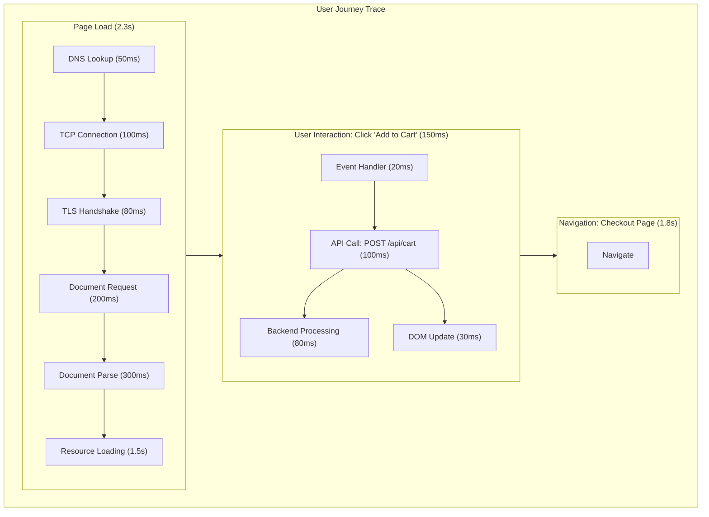

# Browser and Frontend Instrumentation with OpenTelemetry

[Nawaz Dhandala](https://github.com/nicksocial129) - December 17, 2025

**Tags:** OpenTelemetry, Browser, Frontend, JavaScript, RUM, Web Vitals, Performance

**Description:** Implement end-to-end distributed tracing from browser to backend using OpenTelemetry Web SDK, including Real User Monitoring and Core Web Vitals.

---

> True end-to-end observability starts in the browser. OpenTelemetry's Web SDK bridges the gap between frontend experience and backend performance, giving you complete visibility into user journeys.

Frontend instrumentation extends your distributed tracing from the user's browser all the way through your backend services. This guide shows you how to implement comprehensive browser instrumentation with OpenTelemetry.

## Table of Contents

1. [Why Browser Instrumentation Matters](#1-why-browser-instrumentation-matters)
2. [Setting Up OpenTelemetry Web SDK](#2-setting-up-opentelemetry-web-sdk)
3. [Automatic Instrumentation](#3-automatic-instrumentation)
4. [Custom Spans and Events](#4-custom-spans-and-events)
5. [Capturing Web Vitals](#5-capturing-web-vitals)
6. [Context Propagation to Backend](#6-context-propagation-to-backend)
7. [Error Tracking and Session Replay](#7-error-tracking-and-session-replay)
8. [Production Best Practices](#8-production-best-practices)

## 1. Why Browser Instrumentation Matters

### The Frontend Visibility Gap

| Metric | Backend Only | With Frontend |
|--------|--------------|---------------|
| Page load time | Not visible | Full visibility |
| User interactions | Partial | Complete |
| Error attribution | Server errors only | All errors |
| Performance bottlenecks | Backend only | End-to-end |
| User journey tracking | API calls only | Full path |

### What Frontend Instrumentation Captures



## 2. Setting Up OpenTelemetry Web SDK

### Installation

```bash
npm install @opentelemetry/api \
  @opentelemetry/sdk-trace-web \
  @opentelemetry/sdk-trace-base \
  @opentelemetry/resources \
  @opentelemetry/semantic-conventions \
  @opentelemetry/exporter-trace-otlp-http \
  @opentelemetry/context-zone \
  @opentelemetry/instrumentation \
  @opentelemetry/instrumentation-document-load \
  @opentelemetry/instrumentation-fetch \
  @opentelemetry/instrumentation-xml-http-request
```

### Basic Setup

```typescript
// tracing.ts
import { WebTracerProvider } from '@opentelemetry/sdk-trace-web';
import { BatchSpanProcessor } from '@opentelemetry/sdk-trace-base';
import { OTLPTraceExporter } from '@opentelemetry/exporter-trace-otlp-http';
import { ZoneContextManager } from '@opentelemetry/context-zone';
import { Resource } from '@opentelemetry/resources';
import { SemanticResourceAttributes } from '@opentelemetry/semantic-conventions';
import { registerInstrumentations } from '@opentelemetry/instrumentation';
import { DocumentLoadInstrumentation } from '@opentelemetry/instrumentation-document-load';
import { FetchInstrumentation } from '@opentelemetry/instrumentation-fetch';
import { XMLHttpRequestInstrumentation } from '@opentelemetry/instrumentation-xml-http-request';

// Create resource with application info
const resource = new Resource({
  [SemanticResourceAttributes.SERVICE_NAME]: 'frontend-app',
  [SemanticResourceAttributes.SERVICE_VERSION]: '1.0.0',
  'browser.name': navigator.userAgent,
  'browser.language': navigator.language,
});

// Create the tracer provider
const provider = new WebTracerProvider({
  resource,
});

// Configure OTLP exporter
const exporter = new OTLPTraceExporter({
  url: 'https://otlp.oneuptime.com/v1/traces',
  headers: {
    'x-oneuptime-token': 'your-token-here',
  },
});

// Use batch processor for efficiency
provider.addSpanProcessor(new BatchSpanProcessor(exporter, {
  maxQueueSize: 100,
  maxExportBatchSize: 10,
  scheduledDelayMillis: 500,
}));

// Register the provider with Zone context manager
provider.register({
  contextManager: new ZoneContextManager(),
});

// Register auto-instrumentations
registerInstrumentations({
  instrumentations: [
    new DocumentLoadInstrumentation(),
    new FetchInstrumentation({
      propagateTraceHeaderCorsUrls: [
        /https:\/\/api\.yourapp\.com\/.*/,
        /https:\/\/.*\.yourapp\.com\/.*/,
      ],
      clearTimingResources: true,
    }),
    new XMLHttpRequestInstrumentation({
      propagateTraceHeaderCorsUrls: [
        /https:\/\/api\.yourapp\.com\/.*/,
      ],
    }),
  ],
});

export const tracer = provider.getTracer('frontend-app');
```

### React Integration

```tsx
// TracingProvider.tsx
import React, { useEffect } from 'react';
import { trace, context, SpanStatusCode } from '@opentelemetry/api';

// Initialize tracing (import for side effects)
import './tracing';

interface TracingProviderProps {
  children: React.ReactNode;
}

export const TracingProvider: React.FC<TracingProviderProps> = ({ children }) => {
  useEffect(() => {
    // Add session ID to all spans
    const sessionId = getOrCreateSessionId();
    const tracer = trace.getTracer('frontend-app');

    // Track page visibility changes
    document.addEventListener('visibilitychange', () => {
      const span = tracer.startSpan('visibility-change');
      span.setAttribute('visibility.state', document.visibilityState);
      span.end();
    });

    // Track unhandled errors
    window.addEventListener('error', (event) => {
      const span = tracer.startSpan('unhandled-error');
      span.setStatus({ code: SpanStatusCode.ERROR, message: event.message });
      span.setAttribute('error.message', event.message);
      span.setAttribute('error.filename', event.filename || 'unknown');
      span.setAttribute('error.lineno', event.lineno || 0);
      span.end();
    });

    // Track unhandled promise rejections
    window.addEventListener('unhandledrejection', (event) => {
      const span = tracer.startSpan('unhandled-rejection');
      span.setStatus({ code: SpanStatusCode.ERROR });
      span.setAttribute('error.message', event.reason?.message || 'Unknown rejection');
      span.end();
    });
  }, []);

  return <>{children}</>;
};

function getOrCreateSessionId(): string {
  let sessionId = sessionStorage.getItem('trace_session_id');
  if (!sessionId) {
    sessionId = crypto.randomUUID();
    sessionStorage.setItem('trace_session_id', sessionId);
  }
  return sessionId;
}
```

### Vue.js Integration

```typescript
// plugins/tracing.ts
import { App } from 'vue';
import { trace, SpanStatusCode } from '@opentelemetry/api';
import './tracing-setup'; // Initialize OpenTelemetry

export default {
  install(app: App) {
    const tracer = trace.getTracer('vue-app');

    // Global error handler
    app.config.errorHandler = (err, instance, info) => {
      const span = tracer.startSpan('vue-error');
      span.setStatus({ code: SpanStatusCode.ERROR });
      span.setAttribute('error.message', (err as Error).message);
      span.setAttribute('error.stack', (err as Error).stack || '');
      span.setAttribute('vue.component', instance?.$options.name || 'unknown');
      span.setAttribute('vue.info', info);
      span.end();

      console.error(err);
    };

    // Provide tracer to components
    app.provide('tracer', tracer);

    // Add tracing mixin
    app.mixin({
      mounted() {
        if (this.$options.name) {
          const span = tracer.startSpan(`component-mount:${this.$options.name}`);
          span.setAttribute('component.name', this.$options.name);
          span.end();
        }
      },
    });
  },
};
```

## 3. Automatic Instrumentation

### Document Load Instrumentation

```typescript
// document-load-config.ts
import { DocumentLoadInstrumentation } from '@opentelemetry/instrumentation-document-load';

const documentLoadInstrumentation = new DocumentLoadInstrumentation({
  // Custom span name
  applyCustomAttributesOnSpan: {
    documentLoad: (span) => {
      span.setAttribute('page.url', window.location.href);
      span.setAttribute('page.title', document.title);
      span.setAttribute('page.referrer', document.referrer);
    },
    documentFetch: (span) => {
      span.setAttribute('document.size', document.documentElement.innerHTML.length);
    },
    resourceFetch: (span, resource) => {
      span.setAttribute('resource.type', resource.initiatorType);
      span.setAttribute('resource.size', resource.transferSize);
    },
  },
});
```

### Fetch Instrumentation with Custom Attributes

```typescript
// fetch-config.ts
import { FetchInstrumentation } from '@opentelemetry/instrumentation-fetch';

const fetchInstrumentation = new FetchInstrumentation({
  // URLs to propagate trace context to
  propagateTraceHeaderCorsUrls: [
    /https:\/\/api\.yourapp\.com\/.*/,
    /https:\/\/.*\.yourbackend\.com\/.*/,
  ],

  // Clear performance timeline entries
  clearTimingResources: true,

  // Custom attributes on span
  applyCustomAttributesOnSpan: (span, request, response) => {
    // Add request details
    span.setAttribute('http.request.body_size', getBodySize(request));

    // Add response details
    if (response) {
      span.setAttribute('http.response.body_size', response.headers.get('content-length') || 0);
      span.setAttribute('http.response.type', response.headers.get('content-type') || 'unknown');
    }

    // Add user context
    const userId = localStorage.getItem('user_id');
    if (userId) {
      span.setAttribute('user.id', userId);
    }
  },

  // Ignore certain URLs
  ignoreUrls: [
    /\/health/,
    /\/metrics/,
    /google-analytics\.com/,
    /segment\.io/,
  ],
});

function getBodySize(request: Request): number {
  if (request.body) {
    return new Blob([request.body]).size;
  }
  return 0;
}
```

### User Interaction Instrumentation

```typescript
// user-interaction.ts
import { UserInteractionInstrumentation } from '@opentelemetry/instrumentation-user-interaction';

const userInteractionInstrumentation = new UserInteractionInstrumentation({
  eventNames: ['click', 'submit', 'change'],

  shouldPreventSpanCreation: (eventType, element, span) => {
    // Skip instrumentation for certain elements
    if (element.classList.contains('no-trace')) {
      return true;
    }
    return false;
  },
});
```

## 4. Custom Spans and Events

### Tracing User Actions

```typescript
// useTracing.ts
import { trace, context, SpanStatusCode, Span } from '@opentelemetry/api';

const tracer = trace.getTracer('user-actions');

export function useTracing() {
  // Trace a synchronous operation
  function traceSync<T>(name: string, fn: () => T, attributes?: Record<string, string>): T {
    const span = tracer.startSpan(name);

    if (attributes) {
      Object.entries(attributes).forEach(([key, value]) => {
        span.setAttribute(key, value);
      });
    }

    try {
      const result = fn();
      span.setStatus({ code: SpanStatusCode.OK });
      return result;
    } catch (error) {
      span.setStatus({ code: SpanStatusCode.ERROR, message: (error as Error).message });
      span.recordException(error as Error);
      throw error;
    } finally {
      span.end();
    }
  }

  // Trace an async operation
  async function traceAsync<T>(
    name: string,
    fn: () => Promise<T>,
    attributes?: Record<string, string>
  ): Promise<T> {
    const span = tracer.startSpan(name);

    if (attributes) {
      Object.entries(attributes).forEach(([key, value]) => {
        span.setAttribute(key, value);
      });
    }

    try {
      const result = await context.with(trace.setSpan(context.active(), span), fn);
      span.setStatus({ code: SpanStatusCode.OK });
      return result;
    } catch (error) {
      span.setStatus({ code: SpanStatusCode.ERROR, message: (error as Error).message });
      span.recordException(error as Error);
      throw error;
    } finally {
      span.end();
    }
  }

  // Add event to current span
  function addEvent(name: string, attributes?: Record<string, string>) {
    const span = trace.getActiveSpan();
    if (span) {
      span.addEvent(name, attributes);
    }
  }

  return { traceSync, traceAsync, addEvent };
}
```

### React Component Tracing

```tsx
// TracedComponent.tsx
import React, { useEffect, useCallback } from 'react';
import { trace, context } from '@opentelemetry/api';

const tracer = trace.getTracer('react-components');

interface Props {
  productId: string;
}

export const ProductPage: React.FC<Props> = ({ productId }) => {
  useEffect(() => {
    const span = tracer.startSpan('product-page-render');
    span.setAttribute('product.id', productId);

    // Track time to interactive
    const timeToInteractive = performance.now();
    span.setAttribute('render.time_to_interactive_ms', timeToInteractive);

    return () => {
      span.end();
    };
  }, [productId]);

  const handleAddToCart = useCallback(async () => {
    const span = tracer.startSpan('add-to-cart');
    span.setAttribute('product.id', productId);

    try {
      await context.with(trace.setSpan(context.active(), span), async () => {
        // The fetch will automatically be traced and linked
        const response = await fetch('/api/cart', {
          method: 'POST',
          body: JSON.stringify({ productId }),
          headers: { 'Content-Type': 'application/json' },
        });

        if (!response.ok) {
          throw new Error(`Failed to add to cart: ${response.status}`);
        }

        span.addEvent('cart-updated', {
          'cart.action': 'add',
          'product.id': productId,
        });
      });
    } catch (error) {
      span.recordException(error as Error);
      throw error;
    } finally {
      span.end();
    }
  }, [productId]);

  return (
    <div>
      <button onClick={handleAddToCart}>Add to Cart</button>
    </div>
  );
};
```

### Tracing Form Submissions

```typescript
// form-tracing.ts
import { trace, SpanStatusCode } from '@opentelemetry/api';

const tracer = trace.getTracer('forms');

export function traceFormSubmission(formName: string, submitFn: () => Promise<void>) {
  return async (event: React.FormEvent) => {
    event.preventDefault();

    const span = tracer.startSpan(`form-submit:${formName}`);
    span.setAttribute('form.name', formName);

    const startTime = performance.now();

    try {
      await submitFn();

      const duration = performance.now() - startTime;
      span.setAttribute('form.submit_duration_ms', duration);
      span.setStatus({ code: SpanStatusCode.OK });
    } catch (error) {
      span.setStatus({ code: SpanStatusCode.ERROR });
      span.recordException(error as Error);
      throw error;
    } finally {
      span.end();
    }
  };
}
```

## 5. Capturing Web Vitals

### Core Web Vitals Integration

```typescript
// web-vitals.ts
import { onCLS, onFCP, onFID, onINP, onLCP, onTTFB, Metric } from 'web-vitals';
import { trace } from '@opentelemetry/api';

const tracer = trace.getTracer('web-vitals');

function reportWebVital(metric: Metric) {
  const span = tracer.startSpan(`web-vital:${metric.name}`);

  span.setAttribute('web_vital.name', metric.name);
  span.setAttribute('web_vital.value', metric.value);
  span.setAttribute('web_vital.rating', metric.rating); // 'good', 'needs-improvement', 'poor'
  span.setAttribute('web_vital.delta', metric.delta);
  span.setAttribute('web_vital.id', metric.id);
  span.setAttribute('page.url', window.location.href);

  // Add navigation type
  const navEntry = performance.getEntriesByType('navigation')[0] as PerformanceNavigationTiming;
  if (navEntry) {
    span.setAttribute('navigation.type', navEntry.type);
  }

  span.end();
}

// Initialize Web Vitals reporting
export function initWebVitals() {
  onCLS(reportWebVital);  // Cumulative Layout Shift
  onFCP(reportWebVital);  // First Contentful Paint
  onFID(reportWebVital);  // First Input Delay
  onINP(reportWebVital);  // Interaction to Next Paint
  onLCP(reportWebVital);  // Largest Contentful Paint
  onTTFB(reportWebVital); // Time to First Byte
}
```

### Custom Performance Metrics

```typescript
// performance-metrics.ts
import { trace } from '@opentelemetry/api';

const tracer = trace.getTracer('performance');

export function reportPerformanceMetrics() {
  // Wait for page to fully load
  window.addEventListener('load', () => {
    setTimeout(() => {
      const span = tracer.startSpan('page-performance');

      // Navigation Timing
      const navTiming = performance.getEntriesByType('navigation')[0] as PerformanceNavigationTiming;
      if (navTiming) {
        span.setAttribute('timing.dns_lookup_ms', navTiming.domainLookupEnd - navTiming.domainLookupStart);
        span.setAttribute('timing.tcp_connect_ms', navTiming.connectEnd - navTiming.connectStart);
        span.setAttribute('timing.tls_handshake_ms', navTiming.secureConnectionStart ? navTiming.connectEnd - navTiming.secureConnectionStart : 0);
        span.setAttribute('timing.request_ms', navTiming.responseStart - navTiming.requestStart);
        span.setAttribute('timing.response_ms', navTiming.responseEnd - navTiming.responseStart);
        span.setAttribute('timing.dom_processing_ms', navTiming.domComplete - navTiming.domInteractive);
        span.setAttribute('timing.total_ms', navTiming.loadEventEnd - navTiming.startTime);
      }

      // Resource count and size
      const resources = performance.getEntriesByType('resource') as PerformanceResourceTiming[];
      const resourceStats = resources.reduce(
        (acc, r) => {
          acc.count++;
          acc.totalSize += r.transferSize || 0;
          acc.types[r.initiatorType] = (acc.types[r.initiatorType] || 0) + 1;
          return acc;
        },
        { count: 0, totalSize: 0, types: {} as Record<string, number> }
      );

      span.setAttribute('resources.count', resourceStats.count);
      span.setAttribute('resources.total_size_bytes', resourceStats.totalSize);
      span.setAttribute('resources.scripts', resourceStats.types['script'] || 0);
      span.setAttribute('resources.stylesheets', resourceStats.types['link'] || 0);
      span.setAttribute('resources.images', resourceStats.types['img'] || 0);

      // Memory usage (if available)
      if ('memory' in performance) {
        const memory = (performance as any).memory;
        span.setAttribute('memory.used_js_heap_mb', memory.usedJSHeapSize / 1024 / 1024);
        span.setAttribute('memory.total_js_heap_mb', memory.totalJSHeapSize / 1024 / 1024);
      }

      span.end();
    }, 0);
  });
}
```

### Long Task Detection

```typescript
// long-tasks.ts
import { trace } from '@opentelemetry/api';

const tracer = trace.getTracer('long-tasks');

export function observeLongTasks() {
  if ('PerformanceObserver' in window) {
    const observer = new PerformanceObserver((list) => {
      for (const entry of list.getEntries()) {
        const span = tracer.startSpan('long-task');
        span.setAttribute('task.duration_ms', entry.duration);
        span.setAttribute('task.start_time', entry.startTime);
        span.setAttribute('page.url', window.location.href);

        // Try to identify the source
        if ('attribution' in entry) {
          const attribution = (entry as any).attribution[0];
          if (attribution) {
            span.setAttribute('task.container_type', attribution.containerType);
            span.setAttribute('task.container_name', attribution.containerName || 'unknown');
          }
        }

        span.end();
      }
    });

    observer.observe({ entryTypes: ['longtask'] });
  }
}
```

## 6. Context Propagation to Backend

### CORS Configuration

Backend must allow trace headers:

```typescript
// backend/cors.ts (Express example)
import cors from 'cors';

app.use(cors({
  origin: ['https://yourapp.com', 'http://localhost:3000'],
  allowedHeaders: [
    'Content-Type',
    'Authorization',
    'traceparent',
    'tracestate',
    'baggage',
  ],
  exposedHeaders: [
    'traceparent',
    'tracestate',
  ],
}));
```

### Frontend Fetch Configuration

```typescript
// api-client.ts
import { trace, context, propagation } from '@opentelemetry/api';

const tracer = trace.getTracer('api-client');

export async function apiRequest(url: string, options: RequestInit = {}): Promise<Response> {
  const span = tracer.startSpan(`api:${options.method || 'GET'} ${url}`);

  // Inject trace context into headers
  const headers = new Headers(options.headers);
  propagation.inject(context.active(), headers, {
    set: (carrier, key, value) => carrier.set(key, value),
  });

  try {
    const response = await fetch(url, {
      ...options,
      headers,
    });

    span.setAttribute('http.status_code', response.status);
    span.setAttribute('http.response_content_length', response.headers.get('content-length') || 0);

    return response;
  } catch (error) {
    span.recordException(error as Error);
    throw error;
  } finally {
    span.end();
  }
}
```

### Verifying End-to-End Traces

```typescript
// trace-verification.ts
export function logTraceId() {
  const span = trace.getActiveSpan();
  if (span) {
    const spanContext = span.spanContext();
    console.log('Trace ID:', spanContext.traceId);
    console.log('Span ID:', spanContext.spanId);

    // Add to page for debugging
    document.body.setAttribute('data-trace-id', spanContext.traceId);
  }
}
```

## 7. Error Tracking and Session Replay

### Comprehensive Error Tracking

```typescript
// error-tracking.ts
import { trace, SpanStatusCode } from '@opentelemetry/api';

const tracer = trace.getTracer('errors');

interface ErrorContext {
  componentStack?: string;
  userAction?: string;
  pageUrl?: string;
  userId?: string;
}

export function trackError(error: Error, errorContext: ErrorContext = {}) {
  const span = tracer.startSpan('error');

  span.setStatus({ code: SpanStatusCode.ERROR, message: error.message });
  span.setAttribute('error.type', error.name);
  span.setAttribute('error.message', error.message);
  span.setAttribute('error.stack', error.stack || '');

  // Context
  span.setAttribute('error.page_url', errorContext.pageUrl || window.location.href);
  span.setAttribute('error.user_action', errorContext.userAction || 'unknown');

  if (errorContext.componentStack) {
    span.setAttribute('error.component_stack', errorContext.componentStack);
  }

  if (errorContext.userId) {
    span.setAttribute('user.id', errorContext.userId);
  }

  // Browser context
  span.setAttribute('browser.user_agent', navigator.userAgent);
  span.setAttribute('browser.language', navigator.language);
  span.setAttribute('browser.viewport_width', window.innerWidth);
  span.setAttribute('browser.viewport_height', window.innerHeight);

  span.end();
}

// React Error Boundary
export class TracedErrorBoundary extends React.Component<
  { children: React.ReactNode },
  { hasError: boolean }
> {
  constructor(props: { children: React.ReactNode }) {
    super(props);
    this.state = { hasError: false };
  }

  static getDerivedStateFromError() {
    return { hasError: true };
  }

  componentDidCatch(error: Error, errorInfo: React.ErrorInfo) {
    trackError(error, {
      componentStack: errorInfo.componentStack || undefined,
    });
  }

  render() {
    if (this.state.hasError) {
      return <h1>Something went wrong.</h1>;
    }
    return this.props.children;
  }
}
```

### Session Context

```typescript
// session-context.ts
import { trace, context } from '@opentelemetry/api';

const SESSION_KEY = 'otel_session';

interface Session {
  id: string;
  startTime: number;
  pageViews: number;
}

export function getSession(): Session {
  let session = JSON.parse(sessionStorage.getItem(SESSION_KEY) || 'null');

  if (!session) {
    session = {
      id: crypto.randomUUID(),
      startTime: Date.now(),
      pageViews: 0,
    };
  }

  session.pageViews++;
  sessionStorage.setItem(SESSION_KEY, JSON.stringify(session));

  return session;
}

export function addSessionToSpan(span: any) {
  const session = getSession();
  span.setAttribute('session.id', session.id);
  span.setAttribute('session.page_views', session.pageViews);
  span.setAttribute('session.duration_ms', Date.now() - session.startTime);
}
```

## 8. Production Best Practices

### Sampling Strategy

```typescript
// sampling.ts
import { ParentBasedSampler, TraceIdRatioBasedSampler, Sampler, SamplingResult, SamplingDecision } from '@opentelemetry/sdk-trace-base';
import { Context, SpanKind, Attributes, Link } from '@opentelemetry/api';

// Custom sampler: always sample errors, rate-limit normal traffic
class FrontendSampler implements Sampler {
  private ratioSampler: TraceIdRatioBasedSampler;

  constructor(ratio: number) {
    this.ratioSampler = new TraceIdRatioBasedSampler(ratio);
  }

  shouldSample(
    ctx: Context,
    traceId: string,
    spanName: string,
    spanKind: SpanKind,
    attributes: Attributes,
    links: Link[]
  ): SamplingResult {
    // Always sample errors
    if (spanName.includes('error') || spanName.includes('exception')) {
      return { decision: SamplingDecision.RECORD_AND_SAMPLED };
    }

    // Always sample slow operations
    if (attributes['duration_ms'] && (attributes['duration_ms'] as number) > 1000) {
      return { decision: SamplingDecision.RECORD_AND_SAMPLED };
    }

    // Rate-based sampling for everything else
    return this.ratioSampler.shouldSample(ctx, traceId, spanName, spanKind, attributes, links);
  }

  toString(): string {
    return 'FrontendSampler';
  }
}

export const sampler = new ParentBasedSampler({
  root: new FrontendSampler(0.1), // 10% sampling for frontend
});
```

### Bundle Size Optimization

```typescript
// tracing-lite.ts - Minimal bundle for production
import { WebTracerProvider, BatchSpanProcessor } from '@opentelemetry/sdk-trace-web';
import { OTLPTraceExporter } from '@opentelemetry/exporter-trace-otlp-http';

// Only include what you need
const provider = new WebTracerProvider();

provider.addSpanProcessor(
  new BatchSpanProcessor(
    new OTLPTraceExporter({
      url: '/api/traces', // Proxy through your backend
    }),
    {
      maxQueueSize: 50,
      maxExportBatchSize: 10,
      scheduledDelayMillis: 1000,
    }
  )
);

provider.register();
```

### Privacy Considerations

```typescript
// privacy.ts
import { Span } from '@opentelemetry/api';

const PII_PATTERNS = [
  /email/i,
  /password/i,
  /credit.?card/i,
  /ssn/i,
  /social.?security/i,
];

export function sanitizeAttributes(span: Span, attributes: Record<string, any>) {
  for (const [key, value] of Object.entries(attributes)) {
    // Check if key contains PII
    if (PII_PATTERNS.some(pattern => pattern.test(key))) {
      span.setAttribute(key, '[REDACTED]');
    } else if (typeof value === 'string') {
      // Redact email addresses in values
      const sanitized = value.replace(/[\w.-]+@[\w.-]+\.\w+/g, '[EMAIL REDACTED]');
      span.setAttribute(key, sanitized);
    } else {
      span.setAttribute(key, value);
    }
  }
}
```

### Performance Impact

| Optimization | Impact | Recommendation |
|--------------|--------|----------------|
| Batch export | Reduces network calls | Batch size: 10-50 |
| Sampling | Reduces data volume | 1-10% for high traffic |
| Async loading | Doesn't block render | Load after page load |
| Compression | Reduces payload size | Enable gzip |
| Proxy endpoint | Avoids CORS | Use same-origin proxy |

## Summary

Browser instrumentation with OpenTelemetry provides:

- **End-to-end tracing**: Connect frontend actions to backend processing
- **Real User Monitoring**: Capture actual user experience metrics
- **Web Vitals tracking**: Monitor Core Web Vitals automatically
- **Error correlation**: Link frontend errors to specific traces
- **Performance insights**: Identify client-side bottlenecks

Combined with backend instrumentation, you get complete visibility into your application's behavior from the user's perspective.

## Monitor Your Frontend with OneUptime

OneUptime provides seamless integration with OpenTelemetry's Web SDK. Visualize end-to-end traces from browser to backend, track Web Vitals, and correlate frontend errors with backend issues.

[Start Free Trial](https://oneuptime.com/signup) - Complete frontend observability in minutes.

## See Also

- [OpenTelemetry for Node.js](/blog/opentelemetry-nodejs)
- [Context Propagation Deep Dive](/blog/opentelemetry-baggage-propagation)
- [Performance Monitoring Best Practices](/blog/opentelemetry-best-practices)
