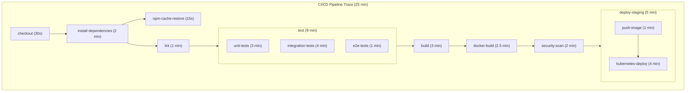

# CI/CD Pipeline Observability with OpenTelemetry

[Nawaz Dhandala](https://github.com/nicksocial129) - December 17, 2025

**Tags:** OpenTelemetry, CI/CD, DevOps, GitHub Actions, Jenkins, Pipeline Observability

**Description:** Implement observability for your CI/CD pipelines using OpenTelemetry, tracking build times, test results, deployment status, and correlating pipeline runs with production traces.

---

> Your CI/CD pipeline is as critical as your production systems, yet most teams fly blind when it comes to pipeline observability. OpenTelemetry brings the same visibility to your build and deployment processes.

CI/CD pipelines can be complex distributed systems themselves, spanning multiple tools, environments, and time zones. OpenTelemetry provides standardized instrumentation to understand, optimize, and debug your delivery pipelines.

## Table of Contents

1. [Why CI/CD Observability Matters](#1-why-cicd-observability-matters)
2. [GitHub Actions Integration](#2-github-actions-integration)
3. [Jenkins Pipeline Tracing](#3-jenkins-pipeline-tracing)
4. [GitLab CI Integration](#4-gitlab-ci-integration)
5. [Correlating Builds with Deployments](#5-correlating-builds-with-deployments)
6. [Test Result Instrumentation](#6-test-result-instrumentation)
7. [Deployment Tracking](#7-deployment-tracking)
8. [Best Practices](#8-best-practices)

## 1. Why CI/CD Observability Matters

### Pipeline as a Distributed System



### What to Measure

| Metric | Description | Goal |
|--------|-------------|------|
| Pipeline duration | Total time from trigger to complete | Minimize |
| Stage duration | Time per pipeline stage | Identify bottlenecks |
| Queue time | Time waiting for runner | Optimize resources |
| Success rate | Percentage of successful runs | Maximize |
| Flaky test rate | Tests that intermittently fail | Eliminate |
| Deployment frequency | Deployments per day | Increase |
| Lead time | Commit to production | Minimize |

## 2. GitHub Actions Integration

### OpenTelemetry GitHub Action

```yaml
# .github/workflows/ci.yaml
name: CI Pipeline

on:
  push:
    branches: [main]
  pull_request:
    branches: [main]

jobs:
  build:
    runs-on: ubuntu-latest

    steps:
      - name: Start Pipeline Trace
        uses: open-telemetry/opentelemetry-action@v1
        with:
          otlp-endpoint: ${{ secrets.OTLP_ENDPOINT }}
          otlp-headers: x-oneuptime-token=${{ secrets.ONEUPTIME_TOKEN }}
          service-name: github-actions
          span-name: ci-pipeline
        id: otel

      - name: Checkout
        uses: actions/checkout@v4

      - name: Setup Node.js
        uses: actions/setup-node@v4
        with:
          node-version: '20'
          cache: 'npm'

      - name: Install Dependencies
        run: npm ci
        env:
          OTEL_TRACE_ID: ${{ steps.otel.outputs.trace-id }}

      - name: Lint
        run: npm run lint

      - name: Test
        run: npm test
        env:
          OTEL_EXPORTER_OTLP_ENDPOINT: ${{ secrets.OTLP_ENDPOINT }}

      - name: Build
        run: npm run build

      - name: End Pipeline Trace
        if: always()
        uses: open-telemetry/opentelemetry-action@v1
        with:
          action: end-span
          span-id: ${{ steps.otel.outputs.span-id }}
          status: ${{ job.status }}
```

### Custom Tracing Script for GitHub Actions

```bash
#!/bin/bash
# scripts/trace-step.sh

OTLP_ENDPOINT="${OTLP_ENDPOINT}"
SERVICE_NAME="github-actions"
TRACE_ID="${TRACE_ID:-$(openssl rand -hex 16)}"
PARENT_SPAN_ID="${PARENT_SPAN_ID}"

start_span() {
    local span_name=$1
    local span_id=$(openssl rand -hex 8)
    local start_time=$(date +%s%N)

    echo "SPAN_ID=$span_id"
    echo "START_TIME=$start_time"

    # Export for child processes
    export CURRENT_SPAN_ID=$span_id
    export SPAN_START_TIME=$start_time
}

end_span() {
    local span_name=$1
    local status=$2
    local end_time=$(date +%s%N)
    local duration=$((end_time - SPAN_START_TIME))

    # Send span to collector
    curl -X POST "${OTLP_ENDPOINT}/v1/traces" \
        -H "Content-Type: application/json" \
        -H "x-oneuptime-token: ${ONEUPTIME_TOKEN}" \
        -d @- <<EOF
{
  "resourceSpans": [{
    "resource": {
      "attributes": [
        {"key": "service.name", "value": {"stringValue": "${SERVICE_NAME}"}},
        {"key": "github.repository", "value": {"stringValue": "${GITHUB_REPOSITORY}"}},
        {"key": "github.run_id", "value": {"stringValue": "${GITHUB_RUN_ID}"}},
        {"key": "github.sha", "value": {"stringValue": "${GITHUB_SHA}"}}
      ]
    },
    "scopeSpans": [{
      "scope": {"name": "github-actions"},
      "spans": [{
        "traceId": "${TRACE_ID}",
        "spanId": "${CURRENT_SPAN_ID}",
        "parentSpanId": "${PARENT_SPAN_ID}",
        "name": "${span_name}",
        "kind": 1,
        "startTimeUnixNano": "${SPAN_START_TIME}",
        "endTimeUnixNano": "${end_time}",
        "status": {"code": ${status}}
      }]
    }]
  }]
}
EOF
}

# Usage in workflow
# source scripts/trace-step.sh
# eval $(start_span "build")
# npm run build
# end_span "build" $?
```

### Reusable Workflow with Tracing

```yaml
# .github/workflows/traced-workflow.yaml
name: Traced CI Pipeline

on:
  workflow_call:
    inputs:
      trace-id:
        required: false
        type: string
    secrets:
      OTLP_ENDPOINT:
        required: true
      ONEUPTIME_TOKEN:
        required: true

jobs:
  traced-build:
    runs-on: ubuntu-latest
    outputs:
      trace-id: ${{ steps.init.outputs.trace-id }}

    steps:
      - name: Initialize Tracing
        id: init
        run: |
          TRACE_ID="${{ inputs.trace-id || github.run_id }}"
          echo "trace-id=$TRACE_ID" >> $GITHUB_OUTPUT
          echo "TRACE_ID=$TRACE_ID" >> $GITHUB_ENV

      - name: Checkout
        uses: actions/checkout@v4

      - name: Traced Test Step
        run: |
          SPAN_ID=$(openssl rand -hex 8)
          START_TIME=$(date +%s%N)

          # Run tests
          npm test
          TEST_STATUS=$?

          END_TIME=$(date +%s%N)

          # Report span
          curl -X POST "${{ secrets.OTLP_ENDPOINT }}/v1/traces" \
            -H "Content-Type: application/json" \
            -H "x-oneuptime-token: ${{ secrets.ONEUPTIME_TOKEN }}" \
            -d '{
              "resourceSpans": [{
                "resource": {
                  "attributes": [
                    {"key": "service.name", "value": {"stringValue": "github-actions"}},
                    {"key": "ci.pipeline.name", "value": {"stringValue": "${{ github.workflow }}"}},
                    {"key": "vcs.repository.url.full", "value": {"stringValue": "${{ github.server_url }}/${{ github.repository }}"}}
                  ]
                },
                "scopeSpans": [{
                  "spans": [{
                    "traceId": "'$TRACE_ID'",
                    "spanId": "'$SPAN_ID'",
                    "name": "test",
                    "startTimeUnixNano": "'$START_TIME'",
                    "endTimeUnixNano": "'$END_TIME'",
                    "status": {"code": '$TEST_STATUS'}
                  }]
                }]
              }]
            }'

          exit $TEST_STATUS
```

## 3. Jenkins Pipeline Tracing

### Jenkins OpenTelemetry Plugin

```groovy
// Jenkinsfile
@Library('opentelemetry-jenkins') _

pipeline {
    agent any

    environment {
        OTEL_EXPORTER_OTLP_ENDPOINT = credentials('otlp-endpoint')
        OTEL_SERVICE_NAME = 'jenkins-pipeline'
    }

    stages {
        stage('Checkout') {
            steps {
                withOtelSpan(spanName: 'checkout') {
                    checkout scm
                }
            }
        }

        stage('Build') {
            steps {
                withOtelSpan(spanName: 'build', attributes: [
                    'build.tool': 'maven'
                ]) {
                    sh 'mvn clean compile'
                }
            }
        }

        stage('Test') {
            parallel {
                stage('Unit Tests') {
                    steps {
                        withOtelSpan(spanName: 'unit-tests') {
                            sh 'mvn test'
                        }
                    }
                }
                stage('Integration Tests') {
                    steps {
                        withOtelSpan(spanName: 'integration-tests') {
                            sh 'mvn verify -Pintegration'
                        }
                    }
                }
            }
        }

        stage('Deploy') {
            when {
                branch 'main'
            }
            steps {
                withOtelSpan(spanName: 'deploy', attributes: [
                    'deployment.environment': 'staging'
                ]) {
                    sh './deploy.sh staging'
                }
            }
        }
    }

    post {
        always {
            // Automatically ends pipeline span with status
            otelPipelineEnd()
        }
    }
}
```

### Custom Jenkins Shared Library

```groovy
// vars/withOtelSpan.groovy
def call(Map config = [:], Closure body) {
    def spanName = config.spanName ?: 'unknown'
    def attributes = config.attributes ?: [:]

    def traceId = env.OTEL_TRACE_ID ?: UUID.randomUUID().toString().replace('-', '')
    def spanId = UUID.randomUUID().toString().replace('-', '').substring(0, 16)
    def parentSpanId = env.OTEL_PARENT_SPAN_ID ?: ''

    def startTime = System.nanoTime()

    env.OTEL_PARENT_SPAN_ID = spanId

    try {
        def result = body()

        def endTime = System.nanoTime()
        sendSpan(traceId, spanId, parentSpanId, spanName, startTime, endTime, 'OK', attributes)

        return result
    } catch (Exception e) {
        def endTime = System.nanoTime()
        attributes['error.message'] = e.message
        sendSpan(traceId, spanId, parentSpanId, spanName, startTime, endTime, 'ERROR', attributes)
        throw e
    }
}

def sendSpan(traceId, spanId, parentSpanId, name, startTime, endTime, status, attributes) {
    def otlpEndpoint = env.OTEL_EXPORTER_OTLP_ENDPOINT

    def attrList = attributes.collect { k, v ->
        """{"key": "${k}", "value": {"stringValue": "${v}"}}"""
    }.join(',')

    def payload = """
    {
        "resourceSpans": [{
            "resource": {
                "attributes": [
                    {"key": "service.name", "value": {"stringValue": "jenkins"}},
                    {"key": "jenkins.job.name", "value": {"stringValue": "${env.JOB_NAME}"}},
                    {"key": "jenkins.build.number", "value": {"intValue": ${env.BUILD_NUMBER}}}
                ]
            },
            "scopeSpans": [{
                "spans": [{
                    "traceId": "${traceId}",
                    "spanId": "${spanId}",
                    "parentSpanId": "${parentSpanId}",
                    "name": "${name}",
                    "startTimeUnixNano": "${startTime}",
                    "endTimeUnixNano": "${endTime}",
                    "status": {"code": "${status == 'OK' ? 1 : 2}"},
                    "attributes": [${attrList}]
                }]
            }]
        }]
    }
    """

    httpRequest(
        url: "${otlpEndpoint}/v1/traces",
        httpMode: 'POST',
        contentType: 'APPLICATION_JSON',
        requestBody: payload
    )
}
```

## 4. GitLab CI Integration

### GitLab CI with OpenTelemetry

```yaml
# .gitlab-ci.yml
variables:
  OTEL_EXPORTER_OTLP_ENDPOINT: ${OTLP_ENDPOINT}
  OTEL_SERVICE_NAME: gitlab-ci

stages:
  - build
  - test
  - deploy

.otel-trace: &otel-trace
  before_script:
    - export TRACE_ID=$(echo $CI_PIPELINE_ID | md5sum | cut -c1-32)
    - export SPAN_ID=$(openssl rand -hex 8)
    - export SPAN_START=$(date +%s%N)
  after_script:
    - |
      SPAN_END=$(date +%s%N)
      STATUS=$([ "$CI_JOB_STATUS" == "success" ] && echo 1 || echo 2)

      curl -X POST "${OTEL_EXPORTER_OTLP_ENDPOINT}/v1/traces" \
        -H "Content-Type: application/json" \
        -d '{
          "resourceSpans": [{
            "resource": {
              "attributes": [
                {"key": "service.name", "value": {"stringValue": "'$OTEL_SERVICE_NAME'"}},
                {"key": "gitlab.project", "value": {"stringValue": "'$CI_PROJECT_PATH'"}},
                {"key": "gitlab.pipeline_id", "value": {"stringValue": "'$CI_PIPELINE_ID'"}},
                {"key": "gitlab.job_name", "value": {"stringValue": "'$CI_JOB_NAME'"}}
              ]
            },
            "scopeSpans": [{
              "spans": [{
                "traceId": "'$TRACE_ID'",
                "spanId": "'$SPAN_ID'",
                "name": "'$CI_JOB_NAME'",
                "startTimeUnixNano": "'$SPAN_START'",
                "endTimeUnixNano": "'$SPAN_END'",
                "status": {"code": '$STATUS'}
              }]
            }]
          }]
        }'

build:
  stage: build
  <<: *otel-trace
  script:
    - npm ci
    - npm run build
  artifacts:
    paths:
      - dist/

test:
  stage: test
  <<: *otel-trace
  script:
    - npm run test:coverage
  coverage: '/Lines\s*:\s*(\d+\.?\d*)%/'

deploy:staging:
  stage: deploy
  <<: *otel-trace
  script:
    - ./deploy.sh staging
  environment:
    name: staging
  only:
    - main
```

## 5. Correlating Builds with Deployments

### Build Metadata Propagation

```typescript
// build-metadata.ts
import { trace, context, propagation } from '@opentelemetry/api';

interface BuildMetadata {
  buildId: string;
  commitSha: string;
  branch: string;
  pipelineId: string;
  traceId: string;
  timestamp: string;
}

// Generate during build
function generateBuildMetadata(): BuildMetadata {
  const span = trace.getActiveSpan();
  const spanContext = span?.spanContext();

  return {
    buildId: process.env.BUILD_ID || crypto.randomUUID(),
    commitSha: process.env.GIT_COMMIT || '',
    branch: process.env.GIT_BRANCH || '',
    pipelineId: process.env.PIPELINE_ID || '',
    traceId: spanContext?.traceId || '',
    timestamp: new Date().toISOString(),
  };
}

// Embed in application
function embedBuildMetadata(metadata: BuildMetadata) {
  // Write to file that gets bundled with app
  const fs = require('fs');
  fs.writeFileSync(
    'build-metadata.json',
    JSON.stringify(metadata, null, 2)
  );
}

// Use in application startup
async function initializeWithBuildContext() {
  const metadata = require('./build-metadata.json');

  const tracer = trace.getTracer('application');

  // Link startup trace to build trace
  const buildLink = {
    context: {
      traceId: metadata.traceId,
      spanId: '0000000000000000', // Build span
      traceFlags: 1,
    },
    attributes: {
      'link.type': 'build',
      'build.id': metadata.buildId,
    },
  };

  const startupSpan = tracer.startSpan('application-startup', {
    links: [buildLink],
    attributes: {
      'build.id': metadata.buildId,
      'build.commit': metadata.commitSha,
      'build.branch': metadata.branch,
      'build.timestamp': metadata.timestamp,
    },
  });

  // Application startup logic
  await initializeApplication();

  startupSpan.end();
}
```

### Deployment Event Tracking

```yaml
# deployment-event.yaml
# OpenTelemetry Collector config for deployment events
receivers:
  webhookevent:
    endpoint: 0.0.0.0:8088
    path: /deployment

processors:
  transform:
    log_statements:
      - context: log
        statements:
          - set(attributes["deployment.id"], body["deployment_id"])
          - set(attributes["deployment.environment"], body["environment"])
          - set(attributes["deployment.status"], body["status"])
          - set(attributes["build.id"], body["build_id"])
          - set(attributes["vcs.commit"], body["commit_sha"])

exporters:
  otlphttp:
    endpoint: https://otlp.oneuptime.com

service:
  pipelines:
    logs:
      receivers: [webhookevent]
      processors: [transform]
      exporters: [otlphttp]
```

### Deployment Script with Tracing

```bash
#!/bin/bash
# deploy.sh

set -e

ENVIRONMENT=$1
TRACE_ID=${TRACE_ID:-$(openssl rand -hex 16)}
DEPLOYMENT_ID=$(date +%s)-${RANDOM}

# Start deployment span
start_deployment_span() {
    SPAN_ID=$(openssl rand -hex 8)
    SPAN_START=$(date +%s%N)

    echo "Starting deployment: $DEPLOYMENT_ID"
    echo "Trace ID: $TRACE_ID"
}

# End deployment span
end_deployment_span() {
    local status=$1
    SPAN_END=$(date +%s%N)

    curl -X POST "${OTLP_ENDPOINT}/v1/traces" \
        -H "Content-Type: application/json" \
        -H "x-oneuptime-token: ${ONEUPTIME_TOKEN}" \
        -d '{
            "resourceSpans": [{
                "resource": {
                    "attributes": [
                        {"key": "service.name", "value": {"stringValue": "deployment"}},
                        {"key": "deployment.environment", "value": {"stringValue": "'$ENVIRONMENT'"}}
                    ]
                },
                "scopeSpans": [{
                    "spans": [{
                        "traceId": "'$TRACE_ID'",
                        "spanId": "'$SPAN_ID'",
                        "name": "deploy-'$ENVIRONMENT'",
                        "startTimeUnixNano": "'$SPAN_START'",
                        "endTimeUnixNano": "'$SPAN_END'",
                        "status": {"code": '$status'},
                        "attributes": [
                            {"key": "deployment.id", "value": {"stringValue": "'$DEPLOYMENT_ID'"}},
                            {"key": "vcs.commit", "value": {"stringValue": "'$GIT_COMMIT'"}},
                            {"key": "build.id", "value": {"stringValue": "'$BUILD_ID'"}}
                        ]
                    }]
                }]
            }]
        }'
}

# Send deployment event
send_deployment_event() {
    local status=$1

    curl -X POST "${OTLP_ENDPOINT}/v1/logs" \
        -H "Content-Type: application/json" \
        -d '{
            "resourceLogs": [{
                "resource": {
                    "attributes": [
                        {"key": "service.name", "value": {"stringValue": "deployment"}}
                    ]
                },
                "scopeLogs": [{
                    "logRecords": [{
                        "body": {"stringValue": "Deployment '$status' to '$ENVIRONMENT'"},
                        "attributes": [
                            {"key": "deployment.id", "value": {"stringValue": "'$DEPLOYMENT_ID'"}},
                            {"key": "deployment.environment", "value": {"stringValue": "'$ENVIRONMENT'"}},
                            {"key": "deployment.status", "value": {"stringValue": "'$status'"}},
                            {"key": "trace_id", "value": {"stringValue": "'$TRACE_ID'"}}
                        ]
                    }]
                }]
            }]
        }'
}

# Main deployment logic
main() {
    start_deployment_span

    echo "Deploying to $ENVIRONMENT..."

    # Pull latest image
    docker pull myregistry/myapp:$BUILD_ID

    # Deploy to Kubernetes
    kubectl set image deployment/myapp \
        myapp=myregistry/myapp:$BUILD_ID \
        -n $ENVIRONMENT

    # Wait for rollout
    if kubectl rollout status deployment/myapp -n $ENVIRONMENT --timeout=300s; then
        echo "Deployment successful!"
        end_deployment_span 1
        send_deployment_event "success"
    else
        echo "Deployment failed!"
        end_deployment_span 2
        send_deployment_event "failed"
        exit 1
    fi
}

main
```

## 6. Test Result Instrumentation

### Test Framework Integration

```typescript
// jest-otel-reporter.ts
import { trace, SpanStatusCode } from '@opentelemetry/api';
import type { Reporter, TestResult, AggregatedResult } from '@jest/reporters';

const tracer = trace.getTracer('jest-tests');

class OTelJestReporter implements Reporter {
  private suiteSpans: Map<string, any> = new Map();

  onTestStart(test: Test): void {
    const span = tracer.startSpan(`test.${test.path}`, {
      attributes: {
        'test.framework': 'jest',
        'test.file': test.path,
      },
    });
    this.suiteSpans.set(test.path, span);
  }

  onTestResult(test: Test, testResult: TestResult): void {
    const suiteSpan = this.suiteSpans.get(test.path);

    // Create spans for each test case
    for (const result of testResult.testResults) {
      const testSpan = tracer.startSpan(`test.case.${result.title}`, {
        attributes: {
          'test.name': result.title,
          'test.full_name': result.fullName,
          'test.status': result.status,
          'test.duration_ms': result.duration || 0,
        },
      });

      if (result.status === 'failed') {
        testSpan.setStatus({ code: SpanStatusCode.ERROR });
        result.failureMessages.forEach((msg, i) => {
          testSpan.setAttribute(`test.failure.${i}`, msg);
        });
      }

      testSpan.end();
    }

    // End suite span
    if (suiteSpan) {
      suiteSpan.setAttribute('test.passed', testResult.numPassingTests);
      suiteSpan.setAttribute('test.failed', testResult.numFailingTests);
      suiteSpan.setAttribute('test.skipped', testResult.numPendingTests);

      if (testResult.numFailingTests > 0) {
        suiteSpan.setStatus({ code: SpanStatusCode.ERROR });
      }

      suiteSpan.end();
      this.suiteSpans.delete(test.path);
    }
  }

  onRunComplete(contexts: Set<Context>, results: AggregatedResult): void {
    const summarySpan = tracer.startSpan('test.summary', {
      attributes: {
        'test.total': results.numTotalTests,
        'test.passed': results.numPassedTests,
        'test.failed': results.numFailedTests,
        'test.skipped': results.numPendingTests,
        'test.duration_ms': results.testResults.reduce(
          (sum, r) => sum + (r.perfStats?.runtime || 0),
          0
        ),
        'test.suites': results.numTotalTestSuites,
        'test.success': results.success,
      },
    });

    if (!results.success) {
      summarySpan.setStatus({ code: SpanStatusCode.ERROR });
    }

    summarySpan.end();
  }
}

export default OTelJestReporter;
```

### Flaky Test Detection

```typescript
// flaky-test-tracker.ts
import { trace, metrics } from '@opentelemetry/api';

const meter = metrics.getMeter('test-metrics');
const tracer = trace.getTracer('flaky-tests');

const flakyTestCounter = meter.createCounter('test.flaky', {
  description: 'Flaky test occurrences',
});

interface TestRun {
  name: string;
  passed: boolean;
  duration: number;
  timestamp: Date;
}

class FlakyTestTracker {
  private testHistory: Map<string, TestRun[]> = new Map();
  private windowSize: number = 10;

  recordTestRun(testName: string, passed: boolean, duration: number): void {
    const history = this.testHistory.get(testName) || [];
    history.push({ name: testName, passed, duration, timestamp: new Date() });

    // Keep last N runs
    if (history.length > this.windowSize) {
      history.shift();
    }

    this.testHistory.set(testName, history);

    // Check for flakiness
    if (this.isFlaky(testName)) {
      this.reportFlaky(testName, history);
    }
  }

  private isFlaky(testName: string): boolean {
    const history = this.testHistory.get(testName) || [];

    if (history.length < 3) return false;

    const passCount = history.filter((r) => r.passed).length;
    const failCount = history.length - passCount;

    // Flaky if both passes and failures exist
    return passCount > 0 && failCount > 0;
  }

  private reportFlaky(testName: string, history: TestRun[]): void {
    const passRate = history.filter((r) => r.passed).length / history.length;

    const span = tracer.startSpan('flaky-test-detected', {
      attributes: {
        'test.name': testName,
        'test.flaky.pass_rate': passRate,
        'test.flaky.window_size': this.windowSize,
        'test.flaky.history': JSON.stringify(
          history.map((r) => ({ passed: r.passed, timestamp: r.timestamp }))
        ),
      },
    });

    flakyTestCounter.add(1, { 'test.name': testName });

    span.end();
  }
}
```

## 7. Deployment Tracking

### Deployment Metrics

```typescript
// deployment-metrics.ts
import { metrics } from '@opentelemetry/api';

const meter = metrics.getMeter('deployment-metrics');

// Deployment counters
const deploymentCounter = meter.createCounter('deployments.total', {
  description: 'Total number of deployments',
});

const deploymentFailures = meter.createCounter('deployments.failed', {
  description: 'Failed deployments',
});

// Deployment duration
const deploymentDuration = meter.createHistogram('deployments.duration', {
  description: 'Deployment duration in seconds',
  unit: 's',
});

// Rollback counter
const rollbackCounter = meter.createCounter('deployments.rollback', {
  description: 'Deployment rollbacks',
});

// Lead time (commit to deploy)
const leadTimeHistogram = meter.createHistogram('deployments.lead_time', {
  description: 'Time from commit to deployment',
  unit: 's',
});

export function recordDeployment(
  environment: string,
  status: 'success' | 'failed' | 'rollback',
  durationSeconds: number,
  commitTimestamp?: Date
) {
  const attributes = { environment };

  deploymentCounter.add(1, attributes);

  if (status === 'failed') {
    deploymentFailures.add(1, attributes);
  }

  if (status === 'rollback') {
    rollbackCounter.add(1, attributes);
  }

  deploymentDuration.record(durationSeconds, attributes);

  // Calculate lead time if commit timestamp available
  if (commitTimestamp && status === 'success') {
    const leadTime = (Date.now() - commitTimestamp.getTime()) / 1000;
    leadTimeHistogram.record(leadTime, attributes);
  }
}
```

### DORA Metrics

```typescript
// dora-metrics.ts
import { metrics } from '@opentelemetry/api';

const meter = metrics.getMeter('dora-metrics');

// Deployment Frequency
const deploymentFrequency = meter.createObservableGauge('dora.deployment_frequency', {
  description: 'Deployments per day',
});

// Lead Time for Changes
const leadTime = meter.createHistogram('dora.lead_time', {
  description: 'Time from commit to production',
  unit: 's',
});

// Change Failure Rate
const changeFailureRate = meter.createObservableGauge('dora.change_failure_rate', {
  description: 'Percentage of deployments causing failure',
});

// Mean Time to Recovery
const mttr = meter.createHistogram('dora.mttr', {
  description: 'Mean time to recover from failure',
  unit: 's',
});

class DORAMetricsCollector {
  private deployments: Array<{ timestamp: Date; success: boolean }> = [];
  private incidents: Array<{ start: Date; end?: Date }> = [];

  recordDeployment(success: boolean) {
    this.deployments.push({ timestamp: new Date(), success });
    this.cleanOldData();
  }

  recordIncidentStart() {
    this.incidents.push({ start: new Date() });
  }

  recordIncidentEnd() {
    const openIncident = this.incidents.find((i) => !i.end);
    if (openIncident) {
      openIncident.end = new Date();

      const recoveryTime = (openIncident.end.getTime() - openIncident.start.getTime()) / 1000;
      mttr.record(recoveryTime);
    }
  }

  getDeploymentFrequency(): number {
    const oneDayAgo = Date.now() - 24 * 60 * 60 * 1000;
    return this.deployments.filter((d) => d.timestamp.getTime() > oneDayAgo).length;
  }

  getChangeFailureRate(): number {
    if (this.deployments.length === 0) return 0;
    const failures = this.deployments.filter((d) => !d.success).length;
    return failures / this.deployments.length;
  }

  private cleanOldData() {
    const thirtyDaysAgo = Date.now() - 30 * 24 * 60 * 60 * 1000;
    this.deployments = this.deployments.filter(
      (d) => d.timestamp.getTime() > thirtyDaysAgo
    );
  }
}
```

## 8. Best Practices

### CI/CD Observability Checklist

| Practice | Description | Priority |
|----------|-------------|----------|
| Trace every pipeline | Full trace from trigger to complete | Critical |
| Track stage duration | Identify bottlenecks | High |
| Monitor queue times | Resource optimization | High |
| Test result integration | Link tests to traces | High |
| Deployment correlation | Connect builds to deploys | High |
| DORA metrics | Track delivery performance | Medium |
| Flaky test detection | Improve reliability | Medium |
| Cost tracking | Understand CI costs | Medium |

### Pipeline Optimization Insights

```yaml
# Queries for pipeline optimization (PromQL examples)

# Average pipeline duration by branch
avg by (branch) (
  ci_pipeline_duration_seconds{status="success"}
)

# Slowest stages
topk(5,
  avg by (stage) (ci_stage_duration_seconds)
)

# Queue time trends
rate(ci_job_queue_duration_seconds_sum[1h])
/
rate(ci_job_queue_duration_seconds_count[1h])

# Failure rate by stage
sum by (stage) (ci_stage_failures_total)
/
sum by (stage) (ci_stage_runs_total)

# Flaky test rate
sum(test_flaky_total) by (test_name)
```

## Summary

CI/CD observability with OpenTelemetry provides:

- **Pipeline visibility**: Full trace of every build and deployment
- **Performance insights**: Identify and optimize slow stages
- **Test tracking**: Monitor test results and detect flaky tests
- **Deployment correlation**: Link builds to production deployments
- **DORA metrics**: Measure and improve delivery performance

Treating your CI/CD pipeline as a first-class distributed system enables the same debugging and optimization capabilities you have in production.

## Monitor Your Pipelines with OneUptime

OneUptime provides comprehensive CI/CD observability, tracking your pipelines alongside production systems for complete delivery visibility.

[Start Free Trial](https://oneuptime.com/signup) - Full pipeline observability.

## See Also

- [Deployment Tracking Best Practices](/blog/deployment-tracking)
- [Distributed Tracing Fundamentals](/blog/distributed-tracing-spans)
- [DORA Metrics Implementation](/blog/dora-metrics)
