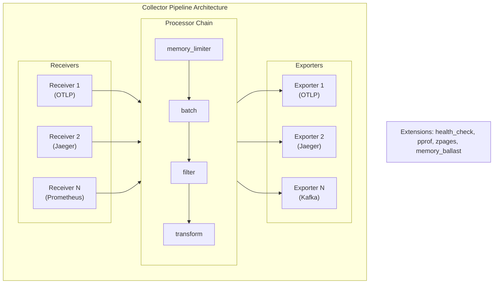
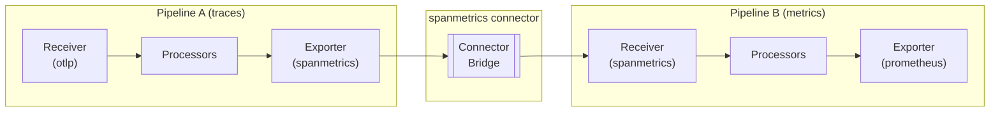

# OpenTelemetry Collector Pipelines Deep Dive: Architecture and Configuration

[Nawaz Dhandala](https://github.com/nicksocial129) - December 17, 2025

**Tags:** OpenTelemetry, Collector, Pipelines, Configuration, Architecture, Processors, Receivers, Exporters

**Description:** Master OpenTelemetry Collector pipelines with this deep dive into receivers, processors, exporters, and connectors. Learn advanced configuration patterns and best practices.

---

> The OpenTelemetry Collector is the Swiss Army knife of observability. Understanding its pipeline architecture unlocks powerful data processing capabilities.

The OpenTelemetry Collector processes telemetry data through configurable pipelines. This guide provides an in-depth look at pipeline components, configuration patterns, and advanced use cases.

## Table of Contents

1. [Pipeline Architecture](#1-pipeline-architecture)
2. [Receivers Deep Dive](#2-receivers-deep-dive)
3. [Processors Deep Dive](#3-processors-deep-dive)
4. [Exporters Deep Dive](#4-exporters-deep-dive)
5. [Connectors and Multi-Pipeline](#5-connectors-and-multi-pipeline)
6. [Advanced Configuration Patterns](#6-advanced-configuration-patterns)
7. [Custom Components](#7-custom-components)
8. [Debugging and Troubleshooting](#8-debugging-and-troubleshooting)

## 1. Pipeline Architecture

### Pipeline Components



### Basic Configuration Structure

```yaml
# Complete collector configuration structure
receivers:
  # Data ingestion components
  otlp:
    protocols:
      grpc:
        endpoint: 0.0.0.0:4317
      http:
        endpoint: 0.0.0.0:4318

processors:
  # Data processing components
  batch:
    timeout: 1s
    send_batch_size: 1024

exporters:
  # Data export components
  otlphttp:
    endpoint: https://backend.example.com

extensions:
  # Auxiliary components
  health_check:
    endpoint: 0.0.0.0:13133

connectors:
  # Pipeline-to-pipeline bridges
  spanmetrics:
    dimensions:
      - name: service.name

service:
  extensions: [health_check]
  pipelines:
    traces:
      receivers: [otlp]
      processors: [batch]
      exporters: [otlphttp]
    metrics:
      receivers: [otlp, spanmetrics]
      processors: [batch]
      exporters: [otlphttp]
```

### Data Flow Types

| Signal | Description | Common Use Cases |
|--------|-------------|------------------|
| Traces | Distributed request flows | Request tracing, latency analysis |
| Metrics | Numerical measurements | Performance monitoring, alerting |
| Logs | Timestamped records | Debugging, audit trails |
| Profiles | Performance snapshots | CPU/memory profiling |

## 2. Receivers Deep Dive

### OTLP Receiver Configuration

```yaml
receivers:
  otlp:
    protocols:
      grpc:
        endpoint: 0.0.0.0:4317
        max_recv_msg_size_mib: 4
        max_concurrent_streams: 100
        read_buffer_size: 524288
        write_buffer_size: 524288
        keepalive:
          server_parameters:
            max_connection_idle: 11s
            max_connection_age: 60s
            max_connection_age_grace: 5s
            time: 10s
            timeout: 2s
          enforcement_policy:
            min_time: 5s
            permit_without_stream: true
        tls:
          cert_file: /certs/server.crt
          key_file: /certs/server.key
          client_ca_file: /certs/ca.crt
        auth:
          authenticator: oidc

      http:
        endpoint: 0.0.0.0:4318
        cors:
          allowed_origins:
            - https://*.example.com
          allowed_headers:
            - Content-Type
            - Authorization
          max_age: 600
        tls:
          cert_file: /certs/server.crt
          key_file: /certs/server.key
```

### Multi-Protocol Receivers

```yaml
receivers:
  # Accept Jaeger format
  jaeger:
    protocols:
      grpc:
        endpoint: 0.0.0.0:14250
      thrift_http:
        endpoint: 0.0.0.0:14268
      thrift_compact:
        endpoint: 0.0.0.0:6831
      thrift_binary:
        endpoint: 0.0.0.0:6832

  # Accept Zipkin format
  zipkin:
    endpoint: 0.0.0.0:9411

  # Prometheus scraping
  prometheus:
    config:
      scrape_configs:
        - job_name: 'kubernetes-pods'
          kubernetes_sd_configs:
            - role: pod
          relabel_configs:
            - source_labels: [__meta_kubernetes_pod_annotation_prometheus_io_scrape]
              action: keep
              regex: true
            - source_labels: [__meta_kubernetes_pod_annotation_prometheus_io_path]
              action: replace
              target_label: __metrics_path__
              regex: (.+)

  # Host metrics
  hostmetrics:
    collection_interval: 30s
    scrapers:
      cpu:
      memory:
      disk:
      network:
      filesystem:
      load:
      paging:
      processes:

  # Kafka consumer
  kafka:
    protocol_version: 2.0.0
    brokers:
      - kafka-1:9092
      - kafka-2:9092
    topic: telemetry
    group_id: otel-collector
    encoding: otlp_proto
    initial_offset: latest

  # File log receiver
  filelog:
    include:
      - /var/log/app/*.log
    start_at: end
    operators:
      - type: regex_parser
        regex: '^(?P<timestamp>\d{4}-\d{2}-\d{2} \d{2}:\d{2}:\d{2}) (?P<level>\w+) (?P<message>.*)$'
        timestamp:
          parse_from: attributes.timestamp
          layout: '%Y-%m-%d %H:%M:%S'
```

### Receiver Authentication

```yaml
extensions:
  # Bearer token authentication
  bearertokenauth:
    token: ${env:COLLECTOR_AUTH_TOKEN}

  # OIDC authentication
  oidc:
    issuer_url: https://auth.example.com
    audience: otel-collector
    username_claim: preferred_username

  # Basic authentication
  basicauth/server:
    htpasswd:
      inline: |
        admin:$apr1$xxx$yyy
        readonly:$apr1$aaa$bbb

receivers:
  otlp:
    protocols:
      grpc:
        endpoint: 0.0.0.0:4317
        auth:
          authenticator: oidc
      http:
        endpoint: 0.0.0.0:4318
        auth:
          authenticator: bearertokenauth
```

## 3. Processors Deep Dive

### Processor Ordering (Critical)

```yaml
# Recommended processor order
processors:
  # 1. Memory protection (FIRST)
  memory_limiter:
    check_interval: 1s
    limit_mib: 1500
    spike_limit_mib: 500

  # 2. Sampling (reduce volume early)
  probabilistic_sampler:
    sampling_percentage: 10

  # 3. Filtering (remove unwanted data)
  filter:
    traces:
      span:
        - 'name == "health-check"'

  # 4. Resource processing
  resource:
    attributes:
      - key: environment
        action: upsert
        value: production

  # 5. Attribute processing
  attributes:
    actions:
      - key: http.request.header.authorization
        action: delete

  # 6. Transform (complex modifications)
  transform:
    trace_statements:
      - context: span
        statements:
          - set(status.code, 1) where attributes["error"] == true

  # 7. Batching (LAST before export)
  batch:
    timeout: 1s
    send_batch_size: 1024
```

### Batch Processor Tuning

```yaml
processors:
  # High-throughput configuration
  batch/high-throughput:
    timeout: 2s
    send_batch_size: 2048
    send_batch_max_size: 4096

  # Low-latency configuration
  batch/low-latency:
    timeout: 100ms
    send_batch_size: 128
    send_batch_max_size: 256

  # Memory-constrained configuration
  batch/memory-limited:
    timeout: 5s
    send_batch_size: 512
    send_batch_max_size: 512
```

### Filter Processor

```yaml
processors:
  # Trace filtering
  filter/traces:
    error_mode: ignore
    traces:
      span:
        # Drop health checks
        - 'name == "GET /health"'
        - 'name == "GET /ready"'
        # Drop internal spans
        - 'attributes["internal"] == true'
        # Drop short spans
        - 'duration < 1ms'
      spanevent:
        # Drop debug events
        - 'name == "debug"'

  # Metric filtering
  filter/metrics:
    metrics:
      # Include only specific metrics
      include:
        match_type: regexp
        metric_names:
          - ^http\..*
          - ^db\..*
          - ^custom\..*
      # Exclude internal metrics
      exclude:
        match_type: strict
        metric_names:
          - internal.metric

  # Log filtering
  filter/logs:
    logs:
      # Drop debug logs in production
      exclude:
        match_type: strict
        severity_texts:
          - DEBUG
          - TRACE
```

### Transform Processor

```yaml
processors:
  transform:
    error_mode: ignore

    # Trace transformations
    trace_statements:
      - context: resource
        statements:
          # Add deployment info
          - set(attributes["deployment.environment"], "production")
          - set(attributes["k8s.cluster.name"], "main-cluster")

      - context: span
        statements:
          # Normalize HTTP status
          - set(attributes["http.response.status_code"],
              attributes["http.status_code"])
            where attributes["http.status_code"] != nil

          # Set error status based on HTTP code
          - set(status.code, 2)
            where attributes["http.response.status_code"] >= 500

          # Truncate long attributes
          - truncate_all(attributes, 256)

          # Extract from span name
          - replace_pattern(name, "GET /api/users/([0-9]+)", "GET /api/users/{id}")

    # Metric transformations
    metric_statements:
      - context: metric
        statements:
          # Rename metrics
          - set(name, "http.server.request.duration")
            where name == "http_server_duration"

      - context: datapoint
        statements:
          # Add labels
          - set(attributes["region"], "us-east-1")

    # Log transformations
    log_statements:
      - context: log
        statements:
          # Parse JSON body
          - merge_maps(attributes, ParseJSON(body), "upsert")
            where IsMatch(body, "^\\{.*\\}$")

          # Set severity from level attribute
          - set(severity_number, 9)
            where attributes["level"] == "INFO"
```

### Tail Sampling Processor

```yaml
processors:
  tail_sampling:
    decision_wait: 30s
    num_traces: 100000
    expected_new_traces_per_sec: 10000

    policies:
      # Always sample errors
      - name: errors-policy
        type: status_code
        status_code:
          status_codes:
            - ERROR

      # Sample slow traces
      - name: latency-policy
        type: latency
        latency:
          threshold_ms: 500

      # Sample by attribute
      - name: high-priority
        type: string_attribute
        string_attribute:
          key: priority
          values:
            - high
            - critical

      # Composite policy
      - name: composite-policy
        type: composite
        composite:
          max_total_spans_per_second: 1000
          policy_order: [errors-policy, latency-policy, probabilistic]
          composite_sub_policy:
            - name: errors-policy
              type: status_code
              status_code:
                status_codes: [ERROR]
            - name: latency-policy
              type: latency
              latency:
                threshold_ms: 500
            - name: probabilistic
              type: probabilistic
              probabilistic:
                sampling_percentage: 10
          rate_allocation:
            - policy: errors-policy
              percent: 50
            - policy: latency-policy
              percent: 30
            - policy: probabilistic
              percent: 20

      # Probabilistic fallback
      - name: probabilistic-policy
        type: probabilistic
        probabilistic:
          sampling_percentage: 5
```

### Resource Detection Processor

```yaml
processors:
  resourcedetection:
    detectors:
      # Environment variables
      - env

      # System info
      - system

      # Docker metadata
      - docker

      # Kubernetes metadata
      - k8s_node

      # Cloud providers
      - gcp
      - ec2
      - azure

    # Timeout for detection
    timeout: 5s

    # Override existing attributes
    override: false

    # System detector config
    system:
      hostname_sources:
        - os
        - dns
      resource_attributes:
        host.name:
          enabled: true
        host.id:
          enabled: true
        os.type:
          enabled: true

    # EC2 detector config
    ec2:
      resource_attributes:
        cloud.provider:
          enabled: true
        cloud.region:
          enabled: true
        cloud.availability_zone:
          enabled: true
        host.id:
          enabled: true
        host.type:
          enabled: true
```

### K8s Attributes Processor

```yaml
processors:
  k8sattributes:
    auth_type: serviceAccount
    passthrough: false

    # Extract pod metadata
    extract:
      metadata:
        - k8s.pod.name
        - k8s.pod.uid
        - k8s.deployment.name
        - k8s.namespace.name
        - k8s.node.name
        - k8s.pod.start_time

      labels:
        - tag_name: app
          key: app.kubernetes.io/name
        - tag_name: version
          key: app.kubernetes.io/version

      annotations:
        - tag_name: owner
          key: owner

    # Filter pods
    filter:
      namespace: my-namespace
      labels:
        - key: app
          value: my-app

    # Association rules
    pod_association:
      - sources:
          - from: resource_attribute
            name: k8s.pod.ip
      - sources:
          - from: connection
```

## 4. Exporters Deep Dive

### OTLP Exporter Configuration

```yaml
exporters:
  # gRPC exporter
  otlp/grpc:
    endpoint: collector.example.com:4317
    tls:
      cert_file: /certs/client.crt
      key_file: /certs/client.key
      ca_file: /certs/ca.crt
    compression: zstd
    headers:
      Authorization: "Bearer ${env:API_TOKEN}"
      X-Custom-Header: "value"
    timeout: 30s
    retry_on_failure:
      enabled: true
      initial_interval: 5s
      max_interval: 30s
      max_elapsed_time: 300s
    sending_queue:
      enabled: true
      num_consumers: 10
      queue_size: 5000
      storage: file_storage

  # HTTP exporter
  otlphttp:
    endpoint: https://collector.example.com
    tls:
      insecure: false
      insecure_skip_verify: false
    compression: gzip
    encoding: proto  # or json
    headers:
      X-Scope-OrgID: "tenant1"
    timeout: 30s
    read_buffer_size: 0
    write_buffer_size: 524288

  # Multiple backends
  otlphttp/backend1:
    endpoint: https://backend1.example.com
    headers:
      Authorization: "Bearer ${env:BACKEND1_TOKEN}"

  otlphttp/backend2:
    endpoint: https://backend2.example.com
    headers:
      Authorization: "Bearer ${env:BACKEND2_TOKEN}"
```

### Vendor-Specific Exporters

```yaml
exporters:
  # Prometheus Remote Write
  prometheusremotewrite:
    endpoint: https://prometheus.example.com/api/v1/write
    tls:
      ca_file: /certs/ca.crt
    headers:
      X-Scope-OrgID: tenant1
    namespace: otel
    external_labels:
      cluster: production

  # Kafka exporter
  kafka:
    protocol_version: 2.0.0
    brokers:
      - kafka-1:9092
      - kafka-2:9092
    topic: telemetry
    encoding: otlp_proto
    partition_traces_by_id: true
    producer:
      max_message_bytes: 1000000
      required_acks: 1
      compression: snappy

  # Elasticsearch exporter
  elasticsearch:
    endpoints:
      - https://es-1.example.com:9200
      - https://es-2.example.com:9200
    index: otel-traces
    pipeline: otel-pipeline
    user: elastic
    password: ${env:ES_PASSWORD}
    tls:
      ca_file: /certs/es-ca.crt
    discover:
      on_start: true

  # Loki exporter (for logs)
  loki:
    endpoint: https://loki.example.com/loki/api/v1/push
    tenant_id: tenant1
    labels:
      attributes:
        service.name: service
        service.namespace: namespace
      resource:
        k8s.namespace.name: namespace

  # File exporter (debugging)
  file:
    path: /var/log/otel/traces.json
    rotation:
      max_megabytes: 100
      max_days: 7
      max_backups: 5
```

### Load Balancing Exporter

```yaml
exporters:
  loadbalancing:
    protocol:
      otlp:
        timeout: 1s
        tls:
          insecure: true

    resolver:
      dns:
        hostname: otel-gateway.observability.svc.cluster.local
        port: 4317

    routing_key: traceID  # or service

  # With static endpoints
  loadbalancing/static:
    protocol:
      otlp:
        timeout: 1s
    resolver:
      static:
        hostnames:
          - gateway-1:4317
          - gateway-2:4317
          - gateway-3:4317

  # With Kubernetes service discovery
  loadbalancing/k8s:
    protocol:
      otlp:
        timeout: 1s
    resolver:
      k8s:
        service: otel-gateway
        ports:
          - 4317
```

## 5. Connectors and Multi-Pipeline

### Connector Architecture



### Span Metrics Connector

```yaml
connectors:
  spanmetrics:
    # Histogram configuration
    histogram:
      explicit:
        buckets:
          - 1ms
          - 5ms
          - 10ms
          - 25ms
          - 50ms
          - 100ms
          - 250ms
          - 500ms
          - 1s
          - 5s

    # Dimensions to include
    dimensions:
      - name: service.name
      - name: http.method
      - name: http.status_code
      - name: http.route
        default: unknown

    # Exclude dimensions
    dimensions_cache_size: 1000

    # Metric names
    namespace: traces.spanmetrics

    # Exemplars
    exemplars:
      enabled: true

service:
  pipelines:
    traces:
      receivers: [otlp]
      processors: [batch]
      exporters: [otlphttp, spanmetrics]  # Export to connector

    metrics:
      receivers: [spanmetrics]  # Receive from connector
      processors: [batch]
      exporters: [prometheusremotewrite]
```

### Count Connector

```yaml
connectors:
  count:
    # Count spans
    spans:
      span.count:
        description: Total span count
      span.count.error:
        description: Error span count
        conditions:
          - status.code == 2

    # Count span events
    spanevents:
      exception.count:
        description: Exception count
        conditions:
          - name == "exception"

    # Count data points
    datapoints:
      metric.point.count:
        description: Total metric data points

    # Count log records
    logs:
      log.count:
        description: Total log count
      log.error.count:
        description: Error log count
        conditions:
          - severity_number >= 17

service:
  pipelines:
    traces:
      receivers: [otlp]
      exporters: [otlphttp, count]

    metrics/counts:
      receivers: [count]
      exporters: [prometheus]
```

### Forward Connector

```yaml
connectors:
  # Simple forwarding between pipelines
  forward/traces:

service:
  pipelines:
    # Ingest and process traces
    traces/ingest:
      receivers: [otlp, jaeger, zipkin]
      processors: [memory_limiter, batch]
      exporters: [forward/traces]

    # Route processed traces
    traces/export:
      receivers: [forward/traces]
      processors: [routing]
      exporters: [otlphttp/primary, otlphttp/backup]
```

### Multi-Tenant Pipeline

```yaml
receivers:
  otlp:
    protocols:
      grpc:
        endpoint: 0.0.0.0:4317

processors:
  # Extract tenant from attributes
  routing:
    from_attribute: tenant.id
    default_exporters: [otlphttp/default]
    table:
      - value: tenant-a
        exporters: [otlphttp/tenant-a]
      - value: tenant-b
        exporters: [otlphttp/tenant-b]
      - value: tenant-c
        exporters: [otlphttp/tenant-c]

exporters:
  otlphttp/default:
    endpoint: https://default.backend.com
  otlphttp/tenant-a:
    endpoint: https://tenant-a.backend.com
  otlphttp/tenant-b:
    endpoint: https://tenant-b.backend.com
  otlphttp/tenant-c:
    endpoint: https://tenant-c.backend.com

service:
  pipelines:
    traces:
      receivers: [otlp]
      processors: [memory_limiter, routing]
      exporters: [otlphttp/default, otlphttp/tenant-a, otlphttp/tenant-b, otlphttp/tenant-c]
```

## 6. Advanced Configuration Patterns

### Environment Variable Substitution

```yaml
# Using environment variables
receivers:
  otlp:
    protocols:
      grpc:
        endpoint: ${env:OTLP_GRPC_ENDPOINT:-0.0.0.0:4317}

exporters:
  otlphttp:
    endpoint: ${env:BACKEND_ENDPOINT}
    headers:
      Authorization: "Bearer ${env:API_TOKEN}"

processors:
  resource:
    attributes:
      - key: deployment.environment
        value: ${env:ENVIRONMENT:-development}
        action: upsert
```

### Configuration File Splitting

```yaml
# main-config.yaml
receivers: ${file:./receivers.yaml}
processors: ${file:./processors.yaml}
exporters: ${file:./exporters.yaml}

service:
  pipelines:
    traces:
      receivers: [otlp]
      processors: [memory_limiter, batch]
      exporters: [otlphttp]
```

```yaml
# receivers.yaml
otlp:
  protocols:
    grpc:
      endpoint: 0.0.0.0:4317
    http:
      endpoint: 0.0.0.0:4318
```

### Pipeline Fanout Pattern

```yaml
# Send same data to multiple destinations
service:
  pipelines:
    traces:
      receivers: [otlp]
      processors: [batch]
      exporters:
        - otlphttp/primary    # Primary backend
        - otlphttp/backup     # Backup backend
        - kafka               # Archive to Kafka
        - file                # Local file for debugging
```

### Pipeline Aggregation Pattern

```yaml
# Aggregate data from multiple sources
receivers:
  otlp:                  # From OTel SDKs
  jaeger:                # From legacy Jaeger
  zipkin:                # From legacy Zipkin

service:
  pipelines:
    traces:
      receivers: [otlp, jaeger, zipkin]  # Aggregate all
      processors: [batch]
      exporters: [otlphttp]              # Single destination
```

### Conditional Processing

```yaml
processors:
  # Filter based on conditions
  filter/errors:
    error_mode: propagate
    traces:
      span:
        - 'status.code != 2'  # Keep only errors

  # Different batch settings per type
  batch/errors:
    timeout: 100ms           # Fast for errors
    send_batch_size: 50

  batch/normal:
    timeout: 2s              # Batch more for normal
    send_batch_size: 1000

service:
  pipelines:
    traces/errors:
      receivers: [otlp]
      processors: [filter/errors, batch/errors]
      exporters: [otlphttp/alerts]

    traces/normal:
      receivers: [otlp]
      processors: [batch/normal]
      exporters: [otlphttp/storage]
```

## 7. Custom Components

### Building Custom Processor

```go
// Go: Custom processor implementation
package myprocessor

import (
    "context"

    "go.opentelemetry.io/collector/component"
    "go.opentelemetry.io/collector/consumer"
    "go.opentelemetry.io/collector/pdata/ptrace"
    "go.opentelemetry.io/collector/processor"
)

type Config struct {
    // Custom configuration fields
    AddTimestamp bool   `mapstructure:"add_timestamp"`
    CustomField  string `mapstructure:"custom_field"`
}

type myProcessor struct {
    config       *Config
    nextConsumer consumer.Traces
    logger       *zap.Logger
}

func NewFactory() processor.Factory {
    return processor.NewFactory(
        "myprocessor",
        createDefaultConfig,
        processor.WithTraces(createTracesProcessor, component.StabilityLevelDevelopment),
    )
}

func createDefaultConfig() component.Config {
    return &Config{
        AddTimestamp: true,
        CustomField:  "default",
    }
}

func createTracesProcessor(
    ctx context.Context,
    set processor.CreateSettings,
    cfg component.Config,
    nextConsumer consumer.Traces,
) (processor.Traces, error) {
    pCfg := cfg.(*Config)
    return &myProcessor{
        config:       pCfg,
        nextConsumer: nextConsumer,
        logger:       set.Logger,
    }, nil
}

func (p *myProcessor) ConsumeTraces(ctx context.Context, td ptrace.Traces) error {
    // Process traces
    for i := 0; i < td.ResourceSpans().Len(); i++ {
        rs := td.ResourceSpans().At(i)
        for j := 0; j < rs.ScopeSpans().Len(); j++ {
            ss := rs.ScopeSpans().At(j)
            for k := 0; k < ss.Spans().Len(); k++ {
                span := ss.Spans().At(k)

                // Add custom attribute
                span.Attributes().PutStr("custom.field", p.config.CustomField)

                // Add processing timestamp
                if p.config.AddTimestamp {
                    span.Attributes().PutInt("processed.at", time.Now().UnixNano())
                }
            }
        }
    }

    // Pass to next consumer
    return p.nextConsumer.ConsumeTraces(ctx, td)
}

func (p *myProcessor) Capabilities() consumer.Capabilities {
    return consumer.Capabilities{MutatesData: true}
}

func (p *myProcessor) Start(ctx context.Context, host component.Host) error {
    return nil
}

func (p *myProcessor) Shutdown(ctx context.Context) error {
    return nil
}
```

### Building Custom Receiver

```go
// Go: Custom receiver implementation
package myreceiver

import (
    "context"
    "net/http"

    "go.opentelemetry.io/collector/component"
    "go.opentelemetry.io/collector/consumer"
    "go.opentelemetry.io/collector/pdata/ptrace"
    "go.opentelemetry.io/collector/receiver"
)

type Config struct {
    Endpoint string `mapstructure:"endpoint"`
}

type myReceiver struct {
    config   *Config
    consumer consumer.Traces
    server   *http.Server
    logger   *zap.Logger
}

func NewFactory() receiver.Factory {
    return receiver.NewFactory(
        "myreceiver",
        createDefaultConfig,
        receiver.WithTraces(createTracesReceiver, component.StabilityLevelDevelopment),
    )
}

func createTracesReceiver(
    ctx context.Context,
    set receiver.CreateSettings,
    cfg component.Config,
    consumer consumer.Traces,
) (receiver.Traces, error) {
    rCfg := cfg.(*Config)
    return &myReceiver{
        config:   rCfg,
        consumer: consumer,
        logger:   set.Logger,
    }, nil
}

func (r *myReceiver) Start(ctx context.Context, host component.Host) error {
    mux := http.NewServeMux()
    mux.HandleFunc("/traces", r.handleTraces)

    r.server = &http.Server{
        Addr:    r.config.Endpoint,
        Handler: mux,
    }

    go func() {
        if err := r.server.ListenAndServe(); err != http.ErrServerClosed {
            r.logger.Error("Server error", zap.Error(err))
        }
    }()

    return nil
}

func (r *myReceiver) handleTraces(w http.ResponseWriter, req *http.Request) {
    // Parse incoming data
    // Convert to ptrace.Traces
    // Pass to consumer

    td := ptrace.NewTraces()
    // ... populate traces ...

    if err := r.consumer.ConsumeTraces(req.Context(), td); err != nil {
        http.Error(w, err.Error(), http.StatusInternalServerError)
        return
    }

    w.WriteHeader(http.StatusOK)
}

func (r *myReceiver) Shutdown(ctx context.Context) error {
    return r.server.Shutdown(ctx)
}
```

## 8. Debugging and Troubleshooting

### Debug Exporter

```yaml
exporters:
  # Log all telemetry to console
  debug:
    verbosity: detailed
    sampling_initial: 5
    sampling_thereafter: 200

service:
  pipelines:
    traces:
      receivers: [otlp]
      processors: [batch]
      exporters: [otlphttp, debug]  # Add debug exporter
```

### Logging Configuration

```yaml
service:
  telemetry:
    logs:
      level: debug  # debug, info, warn, error
      encoding: json
      output_paths:
        - stderr
        - /var/log/otel/collector.log
      error_output_paths:
        - stderr

    metrics:
      level: detailed
      address: 0.0.0.0:8888
```

### Internal Metrics

```promql
# Key metrics to monitor

# Receiver metrics
otelcol_receiver_accepted_spans
otelcol_receiver_refused_spans

# Processor metrics
otelcol_processor_batch_batch_send_size
otelcol_processor_batch_timeout_trigger_send

# Exporter metrics
otelcol_exporter_sent_spans
otelcol_exporter_send_failed_spans
otelcol_exporter_queue_size
otelcol_exporter_queue_capacity

# Memory metrics
otelcol_process_memory_rss
otelcol_processor_memory_limiter_decision
```

### zPages for Live Debugging

```yaml
extensions:
  zpages:
    endpoint: localhost:55679

service:
  extensions: [zpages]
```

Access endpoints:
- `http://localhost:55679/debug/servicez` - Service info
- `http://localhost:55679/debug/pipelinez` - Pipeline info
- `http://localhost:55679/debug/extensionz` - Extension info
- `http://localhost:55679/debug/tracez` - Recent traces

### Common Issues and Solutions

| Issue | Cause | Solution |
|-------|-------|----------|
| Spans dropped | Memory limit hit | Increase limit or add sampling |
| Export failures | Backend unreachable | Check endpoint, add retry config |
| High latency | Large batches | Reduce batch size/timeout |
| Missing attributes | Filter too aggressive | Review filter rules |
| Out of order | Clock skew | Add time synchronization |

## Summary

OpenTelemetry Collector pipelines provide powerful, flexible data processing:

- **Receivers**: Ingest from multiple protocols and sources
- **Processors**: Transform, filter, sample, and enrich data
- **Exporters**: Send to any backend with retry and queuing
- **Connectors**: Bridge pipelines and generate derived data
- **Extensions**: Add health checks, authentication, debugging

Master these components to build efficient, reliable observability pipelines.

## Build Better Pipelines with OneUptime

OneUptime provides native OpenTelemetry support with optimized ingestion pipelines. Connect your collectors and start monitoring in minutes.

[Start Free Trial](https://oneuptime.com/signup) - OpenTelemetry-native observability.

## See Also

- [OpenTelemetry Collector Deployment](/blog/opentelemetry-collector-deployment)
- [High-Throughput Collector Configuration](/blog/opentelemetry-high-throughput-systems)
- [Collector Security Best Practices](/blog/opentelemetry-security-considerations)
