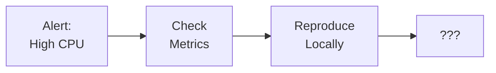
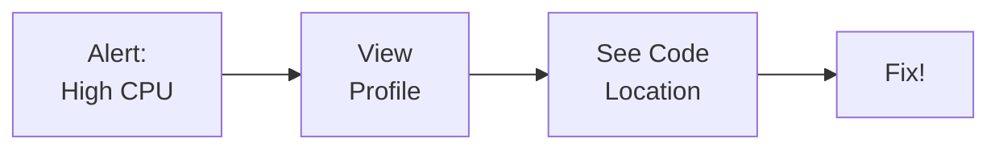
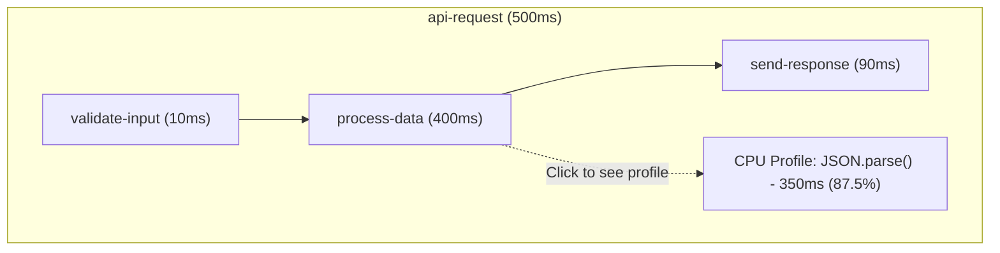
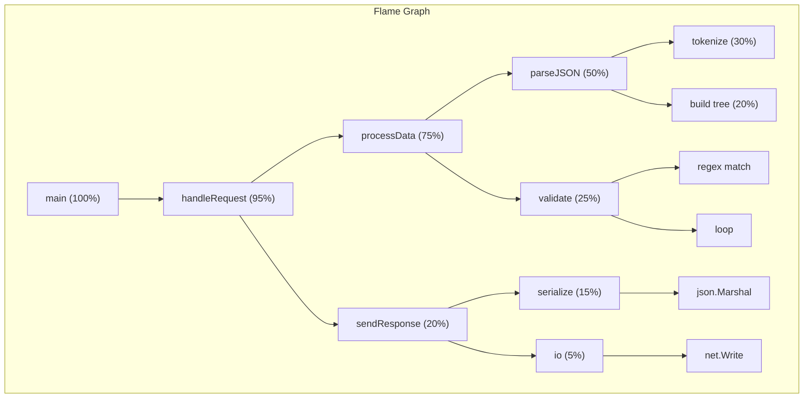

# Continuous Profiling with OpenTelemetry: Linking Profiles to Traces

[Nawaz Dhandala](https://github.com/nicksocial129) - December 17, 2025

**Tags:** OpenTelemetry, Continuous Profiling, Performance, CPU Profiling, Memory Profiling, Observability

**Description:** Learn how to implement continuous profiling with OpenTelemetry, correlate profiles with traces, and identify performance bottlenecks at the code level.

---

> Traces tell you WHERE time is spent in your distributed system. Profiles tell you WHY. Combining them gives you complete performance visibility from service interactions down to individual lines of code.

Continuous profiling is the fourth pillar of observability, complementing traces, metrics, and logs. OpenTelemetry is adding native profiling support, enabling correlation between profiles and traces for unprecedented debugging capabilities.

## Table of Contents

1. [Understanding Continuous Profiling](#1-understanding-continuous-profiling)
2. [Profile Types and Use Cases](#2-profile-types-and-use-cases)
3. [Setting Up Profiling Collection](#3-setting-up-profiling-collection)
4. [Correlating Profiles with Traces](#4-correlating-profiles-with-traces)
5. [Language-Specific Implementation](#5-language-specific-implementation)
6. [Profiling in Production](#6-profiling-in-production)
7. [Analyzing Profile Data](#7-analyzing-profile-data)
8. [Best Practices](#8-best-practices)

## 1. Understanding Continuous Profiling

### What is Continuous Profiling?

Continuous profiling samples your application's resource usage over time, showing exactly where CPU, memory, and other resources are consumed at the code level.

**Traditional Debugging Flow:**



**With Continuous Profiling:**



### The Four Pillars of Observability

| Pillar | Question Answered | Example |
|--------|-------------------|---------|
| Metrics | What is happening? | CPU at 80% |
| Logs | What events occurred? | Error at line 42 |
| Traces | Where was time spent? | 200ms in payment service |
| Profiles | Why was time spent? | 150ms in JSON.parse() |

### Profile vs Trace Correlation

**Trace View:**



**Profile View (for process-data span):**

| Function | Time | Percentage |
|----------|------|------------|
| **JSON.parse** | 350ms | 87.5% |
| ↳ parse_object | 200ms | 50.0% |
| &nbsp;&nbsp;↳ parse_string | 180ms | 45.0% |
| ↳ parse_array | 150ms | 37.5% |
| **validateSchema** | 40ms | 10.0% |
| **transform** | 10ms | 2.5% |

## 2. Profile Types and Use Cases

### CPU Profiling

Samples where CPU time is spent:

```go
// High CPU scenario - what's consuming cycles?
func processRequest(data []byte) Result {
    // CPU profile shows this function takes 80% of CPU
    parsed := parseComplexJSON(data)     // 60% - inefficient parser
    validated := validateSchema(parsed)   // 15% - regex heavy
    return transform(validated)           // 5%  - expected
}

// After profiling, optimize the hot path
func processRequestOptimized(data []byte) Result {
    // Use streaming parser, precompiled regex
    parsed := streamParse(data)          // Now 20%
    validated := fastValidate(parsed)    // Now 5%
    return transform(validated)          // Still 5%
}
```

### Memory (Heap) Profiling

Shows memory allocation patterns:

```javascript
// Memory profile reveals allocation hotspot
function processLargeDataset(items) {
  // Profile shows: 500MB allocated here
  const results = items.map((item) => {
    return {
      ...item, // Spreads entire object
      processed: true,
      timestamp: new Date().toISOString(), // String allocation
      metadata: JSON.parse(JSON.stringify(item.metadata)), // Deep clone!
    };
  });
  return results;
}

// Optimized based on profile data
function processLargeDatasetOptimized(items) {
  // Profile shows: 50MB allocated (10x reduction)
  const timestamp = new Date().toISOString(); // Reuse
  return items.map((item) => ({
    id: item.id, // Only needed fields
    processed: true,
    timestamp,
    metadataId: item.metadata?.id, // Reference, not clone
  }));
}
```

### Profile Types Overview

| Type | What It Shows | Use When |
|------|--------------|----------|
| CPU | Where CPU cycles are spent | High CPU usage |
| Heap | Memory allocation patterns | Memory leaks, high memory |
| Goroutine/Thread | Active threads/goroutines | Concurrency issues |
| Block | Where blocking occurs | Lock contention |
| Mutex | Lock contention | Deadlocks, slow locks |
| Off-CPU | Time waiting (I/O, locks) | Latency issues |
| Wall Clock | Real elapsed time | End-to-end latency |

## 3. Setting Up Profiling Collection

### Using Pyroscope with OpenTelemetry

```yaml
# docker-compose.yaml
version: '3.8'

services:
  pyroscope:
    image: grafana/pyroscope:latest
    ports:
      - "4040:4040"
    command:
      - "server"

  otel-collector:
    image: otel/opentelemetry-collector-contrib:latest
    command: ["--config=/etc/otel-collector-config.yaml"]
    volumes:
      - ./otel-collector-config.yaml:/etc/otel-collector-config.yaml
    ports:
      - "4317:4317"
      - "4318:4318"

  app:
    build: .
    environment:
      OTEL_EXPORTER_OTLP_ENDPOINT: http://otel-collector:4317
      PYROSCOPE_SERVER_ADDRESS: http://pyroscope:4040
```

### Collector Configuration for Profiles

```yaml
# otel-collector-config.yaml
receivers:
  otlp:
    protocols:
      grpc:
        endpoint: 0.0.0.0:4317
      http:
        endpoint: 0.0.0.0:4318

  # Experimental: OTLP profiles receiver
  otlp/profiles:
    protocols:
      grpc:
        endpoint: 0.0.0.0:4327

processors:
  batch:
    timeout: 1s

  # Add trace context to profiles
  resource:
    attributes:
    - key: service.name
      from_attribute: service.name
      action: upsert

exporters:
  otlphttp/traces:
    endpoint: https://otlp.oneuptime.com
    headers:
      x-oneuptime-token: ${ONEUPTIME_TOKEN}

  otlphttp/pyroscope:
    endpoint: http://pyroscope:4040

service:
  pipelines:
    traces:
      receivers: [otlp]
      processors: [batch, resource]
      exporters: [otlphttp/traces]

    profiles:
      receivers: [otlp/profiles]
      processors: [batch]
      exporters: [otlphttp/pyroscope]
```

## 4. Correlating Profiles with Traces

### Adding Trace Context to Profiles

```go
// profile-trace-correlation.go
package main

import (
    "context"
    "runtime/pprof"

    "go.opentelemetry.io/otel"
    "go.opentelemetry.io/otel/trace"
    "github.com/grafana/pyroscope-go"
)

var tracer = otel.Tracer("profile-example")

func main() {
    // Initialize Pyroscope with OTel integration
    pyroscope.Start(pyroscope.Config{
        ApplicationName: "my-service",
        ServerAddress:   "http://pyroscope:4040",
        ProfileTypes: []pyroscope.ProfileType{
            pyroscope.ProfileCPU,
            pyroscope.ProfileAllocObjects,
            pyroscope.ProfileAllocSpace,
            pyroscope.ProfileInuseObjects,
            pyroscope.ProfileInuseSpace,
        },
        // Enable trace correlation
        Tags: map[string]string{
            "service": "my-service",
        },
    })
}

func handleRequest(ctx context.Context) {
    ctx, span := tracer.Start(ctx, "handle-request")
    defer span.End()

    // Tag profile samples with trace context
    spanCtx := trace.SpanContextFromContext(ctx)
    pyroscope.TagWrapper(ctx, pyroscope.Labels(
        "trace_id", spanCtx.TraceID().String(),
        "span_id", spanCtx.SpanID().String(),
    ), func(c context.Context) {
        // This code's profile will be tagged with trace context
        processData(c)
    })
}

func processData(ctx context.Context) {
    ctx, span := tracer.Start(ctx, "process-data")
    defer span.End()

    // Expensive operation - profile will show this
    for i := 0; i < 1000000; i++ {
        _ = computeHash(i)
    }
}
```

### JavaScript/Node.js Profile Correlation

```javascript
// profile-trace-correlation.js
const Pyroscope = require('@pyroscope/nodejs');
const { trace, context } = require('@opentelemetry/api');

const tracer = trace.getTracer('profile-example');

// Initialize Pyroscope
Pyroscope.init({
  serverAddress: 'http://pyroscope:4040',
  appName: 'my-node-service',
  tags: {
    env: process.env.NODE_ENV,
  },
});

Pyroscope.start();

async function handleRequest(req, res) {
  const span = tracer.startSpan('handle-request');
  const ctx = trace.setSpan(context.active(), span);

  try {
    await context.with(ctx, async () => {
      // Add trace context to profile labels
      const spanContext = span.spanContext();

      Pyroscope.wrapWithLabels(
        {
          trace_id: spanContext.traceId,
          span_id: spanContext.spanId,
          endpoint: req.path,
        },
        async () => {
          await processRequest(req);
        }
      );
    });
  } finally {
    span.end();
  }
}

async function processRequest(req) {
  const span = tracer.startSpan('process-request');

  try {
    // Profile will capture this hot path
    const data = await fetchData();
    const result = transformData(data); // CPU intensive
    return result;
  } finally {
    span.end();
  }
}
```

### Python Profile Correlation

```python
# profile_trace_correlation.py
import pyroscope
from opentelemetry import trace
from opentelemetry.trace import SpanContext

tracer = trace.get_tracer("profile-example")

# Initialize Pyroscope
pyroscope.configure(
    application_name="my-python-service",
    server_address="http://pyroscope:4040",
    tags={
        "env": "production",
    }
)

def handle_request(request):
    with tracer.start_as_current_span("handle-request") as span:
        span_context = span.get_span_context()

        # Tag profiles with trace context
        with pyroscope.tag_wrapper({
            "trace_id": format(span_context.trace_id, '032x'),
            "span_id": format(span_context.span_id, '016x'),
            "endpoint": request.path,
        }):
            return process_request(request)

def process_request(request):
    with tracer.start_as_current_span("process-request"):
        data = fetch_data()

        # CPU intensive - profile will capture this
        result = transform_data(data)

        return result

def transform_data(data):
    with tracer.start_as_current_span("transform-data"):
        # Profile shows: 80% of CPU here
        processed = []
        for item in data:
            processed.append(complex_calculation(item))
        return processed
```

## 5. Language-Specific Implementation

### Go Profiling

```go
// go-profiling.go
package main

import (
    "net/http"
    _ "net/http/pprof" // Enable pprof endpoints
    "runtime"
    "runtime/pprof"
    "os"
    "time"

    "github.com/grafana/pyroscope-go"
    "go.opentelemetry.io/otel"
)

func main() {
    // Enable pprof HTTP endpoints
    go func() {
        http.ListenAndServe("localhost:6060", nil)
    }()

    // Configure Pyroscope for continuous profiling
    pyroscope.Start(pyroscope.Config{
        ApplicationName: "go-service",
        ServerAddress:   os.Getenv("PYROSCOPE_SERVER_ADDRESS"),
        Logger:          pyroscope.StandardLogger,
        ProfileTypes: []pyroscope.ProfileType{
            pyroscope.ProfileCPU,
            pyroscope.ProfileAllocObjects,
            pyroscope.ProfileAllocSpace,
            pyroscope.ProfileInuseObjects,
            pyroscope.ProfileInuseSpace,
            pyroscope.ProfileGoroutines,
            pyroscope.ProfileMutexCount,
            pyroscope.ProfileMutexDuration,
            pyroscope.ProfileBlockCount,
            pyroscope.ProfileBlockDuration,
        },
    })

    // Your application code
    startServer()
}

// Manual profiling for specific operations
func profiledOperation(ctx context.Context) {
    // CPU profile for this specific operation
    f, _ := os.Create("cpu.prof")
    pprof.StartCPUProfile(f)
    defer pprof.StopCPUProfile()

    // Your operation
    expensiveCalculation()

    // Memory profile
    mf, _ := os.Create("mem.prof")
    pprof.WriteHeapProfile(mf)
    mf.Close()
}

// Runtime statistics
func collectRuntimeStats() {
    var stats runtime.MemStats
    runtime.ReadMemStats(&stats)

    span := trace.SpanFromContext(ctx)
    span.SetAttributes(
        attribute.Int64("runtime.heap_alloc", int64(stats.HeapAlloc)),
        attribute.Int64("runtime.heap_objects", int64(stats.HeapObjects)),
        attribute.Int64("runtime.goroutines", int64(runtime.NumGoroutine())),
    )
}
```

### Java Profiling with async-profiler

```java
// JavaProfiling.java
import one.profiler.AsyncProfiler;
import one.profiler.Events;
import io.opentelemetry.api.trace.Span;
import io.opentelemetry.api.trace.Tracer;
import io.opentelemetry.context.Scope;

public class ProfiledService {
    private static final Tracer tracer = GlobalOpenTelemetry.getTracer("profiled-service");
    private static final AsyncProfiler profiler = AsyncProfiler.getInstance();

    public void handleRequest(Request request) {
        Span span = tracer.spanBuilder("handle-request").startSpan();

        try (Scope scope = span.makeCurrent()) {
            // Start profiling for this request
            String profileId = startRequestProfile(span);

            try {
                processRequest(request);
            } finally {
                // Stop and export profile
                stopRequestProfile(profileId, span);
            }
        } finally {
            span.end();
        }
    }

    private String startRequestProfile(Span span) {
        String traceId = span.getSpanContext().getTraceId();
        String profileFile = "/tmp/profile-" + traceId + ".jfr";

        // Start async-profiler
        profiler.execute("start,event=cpu,file=" + profileFile);

        return profileFile;
    }

    private void stopRequestProfile(String profileFile, Span span) {
        profiler.execute("stop");

        // Add profile reference to span
        span.setAttribute("profile.file", profileFile);
        span.setAttribute("profile.type", "cpu");

        // Upload profile to Pyroscope
        uploadProfile(profileFile, span.getSpanContext());
    }

    private void uploadProfile(String file, SpanContext ctx) {
        // Upload to Pyroscope with trace context labels
        PyroscopeClient.upload(
            file,
            Map.of(
                "trace_id", ctx.getTraceId(),
                "span_id", ctx.getSpanId()
            )
        );
    }
}
```

### Rust Profiling

```rust
// rust-profiling.rs
use pprof::ProfilerGuard;
use opentelemetry::trace::{Tracer, Span};
use pyroscope::PyroscopeAgent;
use pyroscope_pprofrs::pprof_backend;

fn main() {
    // Initialize Pyroscope agent
    let agent = PyroscopeAgent::builder("http://pyroscope:4040", "rust-service")
        .backend(pprof_backend(PprofConfig::new().sample_rate(100)))
        .tags(&[("env", "production")])
        .build()
        .unwrap();

    agent.start().unwrap();

    // Your application
    start_server();

    agent.stop().unwrap();
}

fn handle_request(request: Request) {
    let tracer = opentelemetry::global::tracer("rust-service");

    tracer.in_span("handle-request", |cx| {
        let span = cx.span();
        let span_context = span.span_context();

        // Tag profile with trace context
        pyroscope::tag_wrapper(
            &[
                ("trace_id", span_context.trace_id().to_string()),
                ("span_id", span_context.span_id().to_string()),
            ],
            || {
                process_request(request)
            }
        )
    })
}

fn process_request(request: Request) -> Response {
    let tracer = opentelemetry::global::tracer("rust-service");

    tracer.in_span("process-request", |_cx| {
        // CPU intensive work - profiler captures this
        let data = fetch_data();
        transform_data(data)
    })
}
```

## 6. Profiling in Production

### Sampling Strategies

```yaml
# Production profiling configuration
profiling:
  # CPU profiling
  cpu:
    enabled: true
    sample_rate: 100  # samples per second
    # Lower in production, higher for debugging

  # Memory profiling
  memory:
    enabled: true
    sample_rate: 512KB  # Every 512KB allocated

  # Selective profiling based on conditions
  conditional:
    # Profile slow requests
    slow_request_threshold: 1s
    # Profile high-CPU requests
    cpu_threshold_percent: 80
    # Profile error responses
    profile_errors: true
```

### Dynamic Profiling Control

```go
// dynamic-profiling.go
package main

import (
    "sync/atomic"
    "time"

    "github.com/grafana/pyroscope-go"
)

var profilingEnabled int32 = 1

// Control profiling via API
func enableProfiling() {
    atomic.StoreInt32(&profilingEnabled, 1)
    pyroscope.Start(config)
}

func disableProfiling() {
    atomic.StoreInt32(&profilingEnabled, 0)
    pyroscope.Stop()
}

// Check before expensive profiling operations
func shouldProfile() bool {
    return atomic.LoadInt32(&profilingEnabled) == 1
}

// HTTP endpoint to control profiling
func profilingHandler(w http.ResponseWriter, r *http.Request) {
    switch r.Method {
    case "POST":
        enableProfiling()
        w.Write([]byte("Profiling enabled"))
    case "DELETE":
        disableProfiling()
        w.Write([]byte("Profiling disabled"))
    case "GET":
        enabled := atomic.LoadInt32(&profilingEnabled) == 1
        json.NewEncoder(w).Encode(map[string]bool{"enabled": enabled})
    }
}
```

### Resource-Aware Profiling

```go
// resource-aware-profiling.go
package main

import (
    "runtime"
    "time"
)

type AdaptiveProfiler struct {
    baseRate      int
    maxRate       int
    cpuThreshold  float64
    memThreshold  uint64
    currentRate   int
}

func (p *AdaptiveProfiler) adjustSampleRate() {
    var stats runtime.MemStats
    runtime.ReadMemStats(&stats)

    cpuUsage := getCPUUsage()

    // Reduce profiling under high load
    if cpuUsage > p.cpuThreshold || stats.HeapAlloc > p.memThreshold {
        p.currentRate = p.baseRate / 2
    } else {
        p.currentRate = p.baseRate
    }

    // Never exceed max rate
    if p.currentRate > p.maxRate {
        p.currentRate = p.maxRate
    }

    pyroscope.SetSampleRate(p.currentRate)
}

func (p *AdaptiveProfiler) start() {
    go func() {
        ticker := time.NewTicker(10 * time.Second)
        for range ticker.C {
            p.adjustSampleRate()
        }
    }()
}
```

## 7. Analyzing Profile Data

### Flame Graph Analysis



**Reading the flame graph:**
- Width = time spent (or memory allocated)
- Top = leaf functions (actual work)
- Bottom = root/entry points
- Colors = different packages/modules

### Common Patterns to Look For

| Pattern | What It Means | Action |
|---------|--------------|--------|
| Wide bars at top | Single function using most time | Optimize that function |
| Deep stacks | Long call chains | Consider refactoring |
| Repeated patterns | Same code called many times | Cache or batch |
| GC-related bars | Memory pressure | Reduce allocations |
| Lock-related bars | Contention | Reduce lock scope |

### Differential Analysis

```bash
# Compare profiles before and after optimization
pyroscope diff \
  --baseline "my-service{commit=abc123}" \
  --comparison "my-service{commit=def456}" \
  --time-range "1h"
```

## 8. Best Practices

### Production Profiling Checklist

| Practice | Description | Priority |
|----------|-------------|----------|
| Low overhead | Keep sample rate reasonable | Critical |
| Correlation | Link profiles to traces | High |
| Conditional | Profile based on criteria | High |
| Retention | Configure appropriate retention | Medium |
| Alerting | Alert on profile anomalies | Medium |
| Security | Sanitize sensitive data | High |

### Overhead Management

```yaml
# Low-overhead production configuration
profiling:
  cpu:
    sample_rate: 100  # 100Hz is usually safe
    # 1000Hz for detailed analysis (higher overhead)

  memory:
    sample_rate: 1MB  # Sample every 1MB
    # 512KB for more detail

  # Limit profile size
  max_stack_depth: 64
  max_profile_size: 10MB

  # Upload batching
  upload_interval: 10s

  # Drop profiles under high load
  load_shedding:
    enabled: true
    cpu_threshold: 90%
```

### Security Considerations

```go
// Sanitize profile data
func sanitizeProfile(profile *pprof.Profile) {
    // Remove sensitive function names
    sensitivePatterns := []string{
        "password",
        "secret",
        "credential",
        "token",
    }

    for _, loc := range profile.Location {
        for _, line := range loc.Line {
            funcName := line.Function.Name
            for _, pattern := range sensitivePatterns {
                if strings.Contains(strings.ToLower(funcName), pattern) {
                    line.Function.Name = "[REDACTED]"
                }
            }
        }
    }
}
```

## Summary

Continuous profiling with OpenTelemetry provides:

- **Code-level visibility**: See exactly where resources are consumed
- **Trace correlation**: Link profiles to specific requests
- **Production debugging**: Debug performance issues without reproducing locally
- **Optimization guidance**: Know exactly what to optimize
- **Historical analysis**: Compare before/after deployments

Combined with traces, metrics, and logs, continuous profiling completes your observability picture.

## Profile Your Applications with OneUptime

OneUptime integrates with continuous profiling tools, allowing you to correlate profiles with traces and drill down from slow requests to exact code locations.

[Start Free Trial](https://oneuptime.com/signup) - Complete observability including profiling.

## See Also

- [Performance Optimization with OpenTelemetry](/blog/opentelemetry-performance)
- [Distributed Tracing Deep Dive](/blog/distributed-tracing-spans)
- [Memory Leak Detection](/blog/memory-leak-detection)
