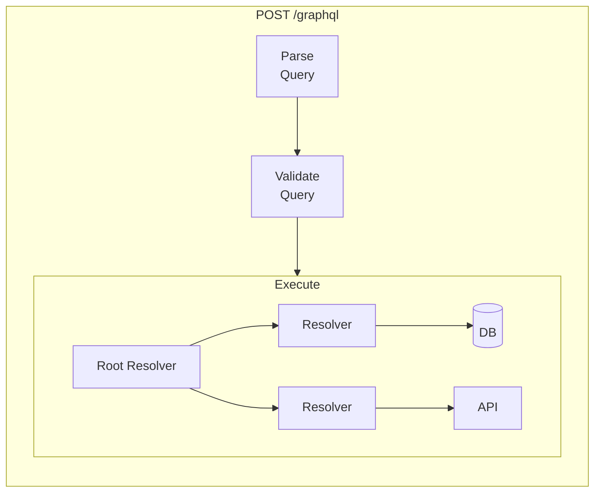

# OpenTelemetry for GraphQL APIs: Complete Instrumentation Guide

[Nawaz Dhandala](https://github.com/nicksocial129) - December 17, 2025

**Tags:** OpenTelemetry, GraphQL, Apollo, Distributed Tracing, API Observability, Performance

**Description:** Learn how to instrument GraphQL APIs with OpenTelemetry, including resolver tracing, query complexity monitoring, and N+1 detection across Apollo Server, Yoga, and other implementations.

---

> GraphQL's flexibility is both its strength and its observability challenge. A single query can trigger dozens of resolver calls across multiple data sources. OpenTelemetry brings visibility to this complexity.

GraphQL APIs require specialized instrumentation because their dynamic nature makes traditional endpoint-based monitoring insufficient. This guide shows you how to achieve complete observability for GraphQL APIs using OpenTelemetry.

## Table of Contents

1. [GraphQL Observability Challenges](#1-graphql-observability-challenges)
2. [Apollo Server Instrumentation](#2-apollo-server-instrumentation)
3. [GraphQL Yoga Instrumentation](#3-graphql-yoga-instrumentation)
4. [Resolver-Level Tracing](#4-resolver-level-tracing)
5. [Query Complexity Monitoring](#5-query-complexity-monitoring)
6. [N+1 Query Detection](#6-n1-query-detection)
7. [Error Tracking and Classification](#7-error-tracking-and-classification)
8. [Production Best Practices](#8-production-best-practices)

## 1. GraphQL Observability Challenges

### Why GraphQL is Different

| Challenge | REST API | GraphQL |
|-----------|----------|---------|
| Endpoint cardinality | Fixed endpoints | Single endpoint, infinite queries |
| Request identification | URL path | Query operation name |
| Performance attribution | Per endpoint | Per resolver |
| Error location | Response status | Partial errors in response |
| Data fetching patterns | Predictable | Dynamic, query-dependent |

### What You Need to Monitor



## 2. Apollo Server Instrumentation

### Basic Setup with Apollo Server 4

```typescript
// apollo-server-tracing.ts
import { ApolloServer } from '@apollo/server';
import { expressMiddleware } from '@apollo/server/express4';
import express from 'express';
import { trace, context, SpanKind, SpanStatusCode } from '@opentelemetry/api';
import { GraphQLInstrumentation } from '@opentelemetry/instrumentation-graphql';
import { registerInstrumentations } from '@opentelemetry/instrumentation';

// Register GraphQL instrumentation
registerInstrumentations({
  instrumentations: [
    new GraphQLInstrumentation({
      depth: 2,
      mergeItems: true,
      allowValues: true,
    }),
  ],
});

const tracer = trace.getTracer('apollo-server');

// Custom Apollo plugin for enhanced tracing
const tracingPlugin = {
  async requestDidStart({ request, contextValue }) {
    const operationName = request.operationName || 'anonymous';
    const query = request.query;

    const span = tracer.startSpan(`graphql.${operationName}`, {
      kind: SpanKind.SERVER,
      attributes: {
        'graphql.operation.name': operationName,
        'graphql.operation.type': getOperationType(query),
        'graphql.document': query?.substring(0, 500), // Truncate long queries
      },
    });

    const ctx = trace.setSpan(context.active(), span);

    return {
      async parsingDidStart() {
        const parseSpan = tracer.startSpan('graphql.parse', {}, ctx);
        return async (err) => {
          if (err) {
            parseSpan.setStatus({ code: SpanStatusCode.ERROR, message: err.message });
            parseSpan.recordException(err);
          }
          parseSpan.end();
        };
      },

      async validationDidStart() {
        const validateSpan = tracer.startSpan('graphql.validate', {}, ctx);
        return async (errors) => {
          if (errors?.length > 0) {
            validateSpan.setStatus({ code: SpanStatusCode.ERROR });
            validateSpan.setAttribute('graphql.validation.error_count', errors.length);
          }
          validateSpan.end();
        };
      },

      async executionDidStart() {
        const executeSpan = tracer.startSpan('graphql.execute', {}, ctx);

        return {
          async executionDidEnd() {
            executeSpan.end();
          },

          willResolveField({ info }) {
            const fieldPath = `${info.parentType.name}.${info.fieldName}`;
            const resolverSpan = tracer.startSpan(`graphql.resolve.${fieldPath}`, {}, ctx);

            resolverSpan.setAttribute('graphql.field.name', info.fieldName);
            resolverSpan.setAttribute('graphql.field.type', info.returnType.toString());
            resolverSpan.setAttribute('graphql.field.path', info.path.key);

            return (error, result) => {
              if (error) {
                resolverSpan.setStatus({ code: SpanStatusCode.ERROR, message: error.message });
                resolverSpan.recordException(error);
              }
              resolverSpan.end();
            };
          },
        };
      },

      async willSendResponse({ response }) {
        if (response.body.kind === 'single') {
          const { errors, data } = response.body.singleResult;

          if (errors?.length > 0) {
            span.setStatus({ code: SpanStatusCode.ERROR });
            span.setAttribute('graphql.error_count', errors.length);
            errors.forEach((err, i) => {
              span.setAttribute(`graphql.error.${i}.message`, err.message);
              span.setAttribute(`graphql.error.${i}.path`, err.path?.join('.') || '');
            });
          } else {
            span.setStatus({ code: SpanStatusCode.OK });
          }
        }

        span.end();
      },
    };
  },
};

// Create Apollo Server with plugin
const server = new ApolloServer({
  typeDefs,
  resolvers,
  plugins: [tracingPlugin],
});

function getOperationType(query?: string): string {
  if (!query) return 'unknown';
  if (query.trim().startsWith('mutation')) return 'mutation';
  if (query.trim().startsWith('subscription')) return 'subscription';
  return 'query';
}
```

### Apollo Federation Gateway Tracing

```typescript
// federation-gateway-tracing.ts
import { ApolloGateway, RemoteGraphQLDataSource } from '@apollo/gateway';
import { trace, context, propagation } from '@opentelemetry/api';

const tracer = trace.getTracer('apollo-gateway');

class TracedDataSource extends RemoteGraphQLDataSource {
  willSendRequest({ request, context: ctx }) {
    const span = trace.getActiveSpan();

    if (span) {
      // Propagate trace context to subgraphs
      propagation.inject(context.active(), request.http.headers, {
        set: (carrier, key, value) => carrier.set(key, value),
      });

      span.setAttribute('federation.subgraph', this.name);
    }
  }

  async process(options) {
    const span = tracer.startSpan(`federation.subgraph.${this.name}`, {
      attributes: {
        'federation.subgraph.name': this.name,
        'federation.subgraph.url': this.url,
      },
    });

    try {
      const result = await super.process(options);
      span.setStatus({ code: 0 });
      return result;
    } catch (error) {
      span.setStatus({ code: 2, message: error.message });
      span.recordException(error);
      throw error;
    } finally {
      span.end();
    }
  }
}

const gateway = new ApolloGateway({
  supergraphSdl,
  buildService({ name, url }) {
    const source = new TracedDataSource({ url });
    source.name = name;
    return source;
  },
});
```

## 3. GraphQL Yoga Instrumentation

### Basic Setup

```typescript
// yoga-tracing.ts
import { createYoga, createSchema } from 'graphql-yoga';
import { useOpenTelemetry } from '@graphql-yoga/plugin-opentelemetry';
import { createServer } from 'http';

const yoga = createYoga({
  schema: createSchema({
    typeDefs,
    resolvers,
  }),
  plugins: [
    useOpenTelemetry({
      // Configuration options
      variables: true,
      result: true,
    }),
  ],
});

const server = createServer(yoga);
server.listen(4000);
```

### Custom Yoga Plugin with Enhanced Tracing

```typescript
// yoga-custom-plugin.ts
import { Plugin } from 'graphql-yoga';
import { trace, context, SpanKind, SpanStatusCode } from '@opentelemetry/api';

const tracer = trace.getTracer('graphql-yoga');

export function useEnhancedTracing(): Plugin {
  return {
    onRequest({ request }) {
      const span = tracer.startSpan('graphql.request', {
        kind: SpanKind.SERVER,
        attributes: {
          'http.method': request.method,
          'http.url': request.url,
        },
      });

      return {
        onRequestParse() {
          return {
            onRequestParseDone({ requestParserResult }) {
              if (requestParserResult.type === 'single') {
                span.setAttribute(
                  'graphql.operation.name',
                  requestParserResult.operationName || 'anonymous'
                );
              }
            },
          };
        },
      };
    },

    onExecute({ args }) {
      const operationName = args.operationName || 'anonymous';

      const executeSpan = tracer.startSpan(`graphql.execute.${operationName}`, {
        attributes: {
          'graphql.operation.name': operationName,
        },
      });

      return {
        onExecuteDone({ result }) {
          if ('errors' in result && result.errors) {
            executeSpan.setStatus({ code: SpanStatusCode.ERROR });
            executeSpan.setAttribute('graphql.error_count', result.errors.length);
          }
          executeSpan.end();
        },
      };
    },

    onSubscribe({ args }) {
      const span = tracer.startSpan('graphql.subscribe', {
        attributes: {
          'graphql.operation.name': args.operationName || 'anonymous',
          'graphql.operation.type': 'subscription',
        },
      });

      return {
        onSubscribeResult() {
          span.end();
        },
        onSubscribeError({ error }) {
          span.setStatus({ code: SpanStatusCode.ERROR, message: error.message });
          span.recordException(error);
          span.end();
        },
      };
    },
  };
}
```

## 4. Resolver-Level Tracing

### Automatic Resolver Wrapping

```typescript
// resolver-tracing.ts
import { trace, context, SpanStatusCode } from '@opentelemetry/api';
import { GraphQLFieldResolver, GraphQLResolveInfo } from 'graphql';

const tracer = trace.getTracer('graphql-resolvers');

type ResolverFunction = GraphQLFieldResolver<any, any, any>;

function wrapResolver(resolver: ResolverFunction, fieldName: string): ResolverFunction {
  return async (parent, args, ctx, info: GraphQLResolveInfo) => {
    const path = buildPath(info.path);
    const spanName = `resolve.${info.parentType.name}.${fieldName}`;

    const span = tracer.startSpan(spanName, {
      attributes: {
        'graphql.field.name': fieldName,
        'graphql.field.path': path,
        'graphql.field.type': info.returnType.toString(),
        'graphql.parent.type': info.parentType.name,
      },
    });

    // Add arguments (be careful with sensitive data)
    if (Object.keys(args).length > 0) {
      span.setAttribute('graphql.field.args', JSON.stringify(sanitizeArgs(args)));
    }

    try {
      const result = await context.with(
        trace.setSpan(context.active(), span),
        () => resolver(parent, args, ctx, info)
      );

      span.setStatus({ code: SpanStatusCode.OK });
      return result;
    } catch (error) {
      span.setStatus({ code: SpanStatusCode.ERROR, message: (error as Error).message });
      span.recordException(error as Error);
      throw error;
    } finally {
      span.end();
    }
  };
}

function buildPath(path: any): string {
  const parts: string[] = [];
  let current = path;

  while (current) {
    parts.unshift(current.key.toString());
    current = current.prev;
  }

  return parts.join('.');
}

function sanitizeArgs(args: Record<string, any>): Record<string, any> {
  const sensitiveKeys = ['password', 'token', 'secret', 'creditCard'];
  const sanitized: Record<string, any> = {};

  for (const [key, value] of Object.entries(args)) {
    if (sensitiveKeys.some((k) => key.toLowerCase().includes(k))) {
      sanitized[key] = '[REDACTED]';
    } else {
      sanitized[key] = value;
    }
  }

  return sanitized;
}

// Apply to all resolvers
function instrumentResolvers(resolvers: any): any {
  const instrumented: any = {};

  for (const [typeName, typeResolvers] of Object.entries(resolvers)) {
    instrumented[typeName] = {};

    for (const [fieldName, resolver] of Object.entries(typeResolvers as any)) {
      if (typeof resolver === 'function') {
        instrumented[typeName][fieldName] = wrapResolver(resolver, fieldName);
      } else if (typeof resolver === 'object' && resolver.resolve) {
        instrumented[typeName][fieldName] = {
          ...resolver,
          resolve: wrapResolver(resolver.resolve, fieldName),
        };
      } else {
        instrumented[typeName][fieldName] = resolver;
      }
    }
  }

  return instrumented;
}
```

### DataLoader Integration

```typescript
// dataloader-tracing.ts
import DataLoader from 'dataloader';
import { trace, context } from '@opentelemetry/api';

const tracer = trace.getTracer('dataloader');

function createTracedDataLoader<K, V>(
  name: string,
  batchFn: (keys: readonly K[]) => Promise<(V | Error)[]>,
  options?: DataLoader.Options<K, V>
): DataLoader<K, V> {
  const tracedBatchFn = async (keys: readonly K[]): Promise<(V | Error)[]> => {
    const span = tracer.startSpan(`dataloader.batch.${name}`, {
      attributes: {
        'dataloader.name': name,
        'dataloader.batch_size': keys.length,
        'dataloader.keys': JSON.stringify(keys.slice(0, 10)), // First 10 keys
      },
    });

    try {
      const results = await batchFn(keys);

      const errorCount = results.filter((r) => r instanceof Error).length;
      span.setAttribute('dataloader.success_count', keys.length - errorCount);
      span.setAttribute('dataloader.error_count', errorCount);

      return results;
    } catch (error) {
      span.recordException(error as Error);
      throw error;
    } finally {
      span.end();
    }
  };

  return new DataLoader(tracedBatchFn, options);
}

// Usage in context
export function createContext() {
  return {
    loaders: {
      users: createTracedDataLoader('users', async (userIds) => {
        const users = await db.users.findByIds(userIds);
        return userIds.map((id) => users.find((u) => u.id === id) || new Error('Not found'));
      }),

      products: createTracedDataLoader('products', async (productIds) => {
        const products = await db.products.findByIds(productIds);
        return productIds.map((id) => products.find((p) => p.id === id) || new Error('Not found'));
      }),
    },
  };
}
```

## 5. Query Complexity Monitoring

### Tracking Query Complexity

```typescript
// complexity-tracking.ts
import { trace } from '@opentelemetry/api';
import {
  getComplexity,
  simpleEstimator,
  fieldExtensionsEstimator,
} from 'graphql-query-complexity';
import { GraphQLSchema, DocumentNode } from 'graphql';

const tracer = trace.getTracer('graphql-complexity');

interface ComplexityResult {
  complexity: number;
  maxDepth: number;
  fieldCount: number;
}

export function analyzeQueryComplexity(
  schema: GraphQLSchema,
  document: DocumentNode,
  variables: Record<string, any>
): ComplexityResult {
  const span = tracer.startSpan('graphql.complexity.analyze');

  try {
    const complexity = getComplexity({
      schema,
      query: document,
      variables,
      estimators: [
        fieldExtensionsEstimator(),
        simpleEstimator({ defaultComplexity: 1 }),
      ],
    });

    const analysis = analyzeDepthAndFields(document);

    span.setAttribute('graphql.complexity.score', complexity);
    span.setAttribute('graphql.complexity.max_depth', analysis.maxDepth);
    span.setAttribute('graphql.complexity.field_count', analysis.fieldCount);

    return {
      complexity,
      maxDepth: analysis.maxDepth,
      fieldCount: analysis.fieldCount,
    };
  } finally {
    span.end();
  }
}

function analyzeDepthAndFields(document: DocumentNode): { maxDepth: number; fieldCount: number } {
  let maxDepth = 0;
  let fieldCount = 0;

  function visit(node: any, depth: number = 0) {
    if (node.kind === 'Field') {
      fieldCount++;
      maxDepth = Math.max(maxDepth, depth);
    }

    if (node.selectionSet) {
      for (const selection of node.selectionSet.selections) {
        visit(selection, depth + 1);
      }
    }
  }

  for (const definition of document.definitions) {
    if (definition.kind === 'OperationDefinition') {
      visit(definition, 0);
    }
  }

  return { maxDepth, fieldCount };
}

// Apollo plugin for complexity tracking
export const complexityPlugin = {
  async requestDidStart({ request }) {
    return {
      async didResolveOperation({ document, operationName }) {
        const result = analyzeQueryComplexity(schema, document, request.variables || {});

        const span = trace.getActiveSpan();
        if (span) {
          span.setAttribute('graphql.complexity', result.complexity);
          span.setAttribute('graphql.depth', result.maxDepth);
          span.setAttribute('graphql.field_count', result.fieldCount);
        }

        // Reject overly complex queries
        if (result.complexity > 1000) {
          throw new Error(`Query complexity ${result.complexity} exceeds maximum allowed (1000)`);
        }
      },
    };
  },
};
```

### Complexity Metrics

```typescript
// complexity-metrics.ts
import { metrics } from '@opentelemetry/api';

const meter = metrics.getMeter('graphql-complexity');

const complexityHistogram = meter.createHistogram('graphql.query.complexity', {
  description: 'GraphQL query complexity scores',
  unit: 'score',
});

const depthHistogram = meter.createHistogram('graphql.query.depth', {
  description: 'GraphQL query depth',
  unit: 'levels',
});

const fieldCountHistogram = meter.createHistogram('graphql.query.field_count', {
  description: 'Number of fields in GraphQL queries',
  unit: 'fields',
});

const rejectedQueries = meter.createCounter('graphql.query.rejected', {
  description: 'Queries rejected due to complexity',
});

export function recordComplexityMetrics(
  operationName: string,
  complexity: number,
  depth: number,
  fieldCount: number,
  rejected: boolean = false
) {
  const attributes = {
    'graphql.operation.name': operationName,
  };

  complexityHistogram.record(complexity, attributes);
  depthHistogram.record(depth, attributes);
  fieldCountHistogram.record(fieldCount, attributes);

  if (rejected) {
    rejectedQueries.add(1, attributes);
  }
}
```

## 6. N+1 Query Detection

### Detecting N+1 Patterns

```typescript
// n-plus-one-detection.ts
import { trace, context } from '@opentelemetry/api';

const tracer = trace.getTracer('graphql-n-plus-one');

interface QueryPattern {
  query: string;
  count: number;
  timestamps: number[];
}

class NPlusOneDetector {
  private patterns: Map<string, QueryPattern> = new Map();
  private windowMs: number = 100; // Detection window

  recordQuery(query: string, table: string) {
    const key = `${table}:${this.normalizeQuery(query)}`;
    const now = Date.now();

    const pattern = this.patterns.get(key) || {
      query,
      count: 0,
      timestamps: [],
    };

    // Remove old timestamps
    pattern.timestamps = pattern.timestamps.filter((t) => now - t < this.windowMs);
    pattern.timestamps.push(now);
    pattern.count = pattern.timestamps.length;

    this.patterns.set(key, pattern);

    // Check for N+1
    if (pattern.count > 3) {
      this.reportNPlusOne(table, query, pattern.count);
    }
  }

  private normalizeQuery(query: string): string {
    // Normalize query by removing specific values
    return query
      .replace(/= \d+/g, '= ?')
      .replace(/= '[^']*'/g, "= '?'")
      .replace(/IN \([^)]+\)/g, 'IN (?)');
  }

  private reportNPlusOne(table: string, query: string, count: number) {
    const span = tracer.startSpan('graphql.n_plus_one.detected', {
      attributes: {
        'db.table': table,
        'db.query_pattern': this.normalizeQuery(query),
        'n_plus_one.query_count': count,
        'n_plus_one.severity': count > 10 ? 'high' : 'medium',
      },
    });

    span.addEvent('n+1 query pattern detected', {
      message: `Detected ${count} similar queries to ${table} in rapid succession`,
      suggestion: 'Consider using DataLoader or batch queries',
    });

    span.end();
  }

  reset() {
    this.patterns.clear();
  }
}

// Integrate with database instrumentation
export const nPlusOneDetector = new NPlusOneDetector();

// Wrap your database client
export function wrapDatabaseClient(client: any) {
  const originalQuery = client.query.bind(client);

  client.query = async (sql: string, params?: any[]) => {
    const table = extractTableName(sql);
    nPlusOneDetector.recordQuery(sql, table);

    return originalQuery(sql, params);
  };

  return client;
}

function extractTableName(sql: string): string {
  const match = sql.match(/FROM\s+(\w+)/i);
  return match ? match[1] : 'unknown';
}
```

### N+1 Prevention with DataLoader

```typescript
// dataloader-prevention.ts
import DataLoader from 'dataloader';
import { trace } from '@opentelemetry/api';

const tracer = trace.getTracer('dataloader');

// Bad: N+1 resolver
const badResolvers = {
  Query: {
    users: () => db.users.findAll(),
  },
  User: {
    // This causes N+1 - one query per user
    posts: (user) => db.posts.findByUserId(user.id),
  },
};

// Good: DataLoader resolver
const goodResolvers = {
  Query: {
    users: () => db.users.findAll(),
  },
  User: {
    posts: (user, args, context) => {
      return context.loaders.postsByUser.load(user.id);
    },
  },
};

// DataLoader batches multiple loads into single query
function createPostsByUserLoader() {
  return new DataLoader(async (userIds: readonly string[]) => {
    const span = tracer.startSpan('dataloader.batch.postsByUser', {
      attributes: {
        'dataloader.batch_size': userIds.length,
      },
    });

    try {
      // Single query for all users
      const posts = await db.posts.findByUserIds([...userIds]);

      // Group by userId
      const postsByUser = new Map<string, any[]>();
      for (const post of posts) {
        const userPosts = postsByUser.get(post.userId) || [];
        userPosts.push(post);
        postsByUser.set(post.userId, userPosts);
      }

      return userIds.map((id) => postsByUser.get(id) || []);
    } finally {
      span.end();
    }
  });
}
```

## 7. Error Tracking and Classification

### Error Classification Plugin

```typescript
// error-classification.ts
import { trace, SpanStatusCode } from '@opentelemetry/api';
import { GraphQLError } from 'graphql';

const tracer = trace.getTracer('graphql-errors');

interface ClassifiedError {
  type: 'validation' | 'authorization' | 'not_found' | 'internal' | 'user_input';
  severity: 'low' | 'medium' | 'high' | 'critical';
  retryable: boolean;
}

function classifyError(error: GraphQLError): ClassifiedError {
  const message = error.message.toLowerCase();
  const code = error.extensions?.code;

  // Classification based on error codes
  if (code === 'GRAPHQL_VALIDATION_FAILED') {
    return { type: 'validation', severity: 'low', retryable: false };
  }

  if (code === 'UNAUTHENTICATED' || code === 'FORBIDDEN') {
    return { type: 'authorization', severity: 'medium', retryable: false };
  }

  if (code === 'NOT_FOUND' || message.includes('not found')) {
    return { type: 'not_found', severity: 'low', retryable: false };
  }

  if (code === 'BAD_USER_INPUT' || message.includes('invalid')) {
    return { type: 'user_input', severity: 'low', retryable: false };
  }

  // Internal errors
  return { type: 'internal', severity: 'high', retryable: true };
}

export const errorTrackingPlugin = {
  async requestDidStart() {
    return {
      async didEncounterErrors({ errors, operation }) {
        const operationName = operation?.name?.value || 'anonymous';

        for (const error of errors) {
          const classification = classifyError(error);

          const span = tracer.startSpan('graphql.error', {
            attributes: {
              'graphql.operation.name': operationName,
              'error.type': classification.type,
              'error.severity': classification.severity,
              'error.retryable': classification.retryable,
              'error.message': error.message,
              'error.path': error.path?.join('.') || '',
              'error.code': (error.extensions?.code as string) || 'UNKNOWN',
            },
          });

          span.setStatus({
            code: SpanStatusCode.ERROR,
            message: error.message,
          });

          // Add locations if available
          if (error.locations?.length) {
            span.setAttribute(
              'error.locations',
              JSON.stringify(error.locations)
            );
          }

          // Add stack trace for internal errors
          if (classification.type === 'internal' && error.originalError?.stack) {
            span.setAttribute('error.stack', error.originalError.stack);
          }

          span.end();
        }
      },
    };
  },
};
```

### Error Metrics

```typescript
// error-metrics.ts
import { metrics } from '@opentelemetry/api';

const meter = metrics.getMeter('graphql-errors');

const errorCounter = meter.createCounter('graphql.errors', {
  description: 'GraphQL error count by type',
});

const errorsByOperation = meter.createCounter('graphql.errors.by_operation', {
  description: 'GraphQL errors by operation',
});

export function recordError(
  operationName: string,
  errorType: string,
  errorCode: string
) {
  errorCounter.add(1, {
    'error.type': errorType,
    'error.code': errorCode,
  });

  errorsByOperation.add(1, {
    'graphql.operation.name': operationName,
    'error.type': errorType,
  });
}
```

## 8. Production Best Practices

### Sampling Strategy for GraphQL

```typescript
// graphql-sampling.ts
import { ParentBasedSampler, TraceIdRatioBasedSampler, Sampler, SamplingResult, SamplingDecision } from '@opentelemetry/sdk-trace-base';

class GraphQLSampler implements Sampler {
  private baseSampler: TraceIdRatioBasedSampler;

  constructor(ratio: number) {
    this.baseSampler = new TraceIdRatioBasedSampler(ratio);
  }

  shouldSample(ctx, traceId, spanName, spanKind, attributes, links): SamplingResult {
    // Always sample mutations
    if (attributes['graphql.operation.type'] === 'mutation') {
      return { decision: SamplingDecision.RECORD_AND_SAMPLED };
    }

    // Always sample errors
    if (attributes['graphql.has_errors'] === true) {
      return { decision: SamplingDecision.RECORD_AND_SAMPLED };
    }

    // Always sample complex queries
    if ((attributes['graphql.complexity'] as number) > 100) {
      return { decision: SamplingDecision.RECORD_AND_SAMPLED };
    }

    // Rate-based sampling for everything else
    return this.baseSampler.shouldSample(ctx, traceId, spanName, spanKind, attributes, links);
  }

  toString() {
    return 'GraphQLSampler';
  }
}
```

### Production Checklist

| Practice | Description | Priority |
|----------|-------------|----------|
| Operation naming | Use meaningful operation names | Critical |
| Complexity limits | Reject overly complex queries | High |
| Error classification | Categorize errors appropriately | High |
| N+1 detection | Monitor for N+1 patterns | High |
| DataLoader usage | Batch database queries | High |
| Query logging | Log query patterns (not data) | Medium |
| Depth limiting | Limit query depth | Medium |
| Rate limiting | Per-operation rate limits | Medium |

### Collector Configuration

```yaml
# otel-collector-graphql.yaml
processors:
  # Extract GraphQL-specific attributes
  attributes:
    actions:
    - key: graphql.operation.name
      action: extract
      pattern: ^graphql\.(?P<operation>.+)$
      from: name

  # Filter out introspection queries
  filter:
    spans:
      exclude:
        match_type: strict
        attributes:
        - key: graphql.operation.name
          value: IntrospectionQuery

  # Group traces by operation
  groupbytrace:
    wait_duration: 5s

exporters:
  otlphttp:
    endpoint: https://otlp.oneuptime.com

service:
  pipelines:
    traces:
      receivers: [otlp]
      processors: [attributes, filter, groupbytrace, batch]
      exporters: [otlphttp]
```

## Summary

GraphQL instrumentation with OpenTelemetry provides:

- **Operation visibility**: Track queries, mutations, and subscriptions
- **Resolver-level tracing**: See individual field resolution times
- **Complexity monitoring**: Detect and prevent expensive queries
- **N+1 detection**: Find and fix inefficient data loading
- **Error classification**: Categorize and track errors effectively

Proper GraphQL instrumentation transforms the flexibility of GraphQL from an observability challenge into a well-understood, debuggable system.

## Monitor Your GraphQL APIs with OneUptime

OneUptime provides specialized support for GraphQL observability, including operation-based dashboards, resolver performance tracking, and complexity analysis.

[Start Free Trial](https://oneuptime.com/signup) - Complete GraphQL observability.

## See Also

- [API Tracing Best Practices](/blog/opentelemetry-best-practices)
- [Database Query Optimization](/blog/opentelemetry-database-tracing)
- [Performance Monitoring Guide](/blog/opentelemetry-performance-monitoring)
