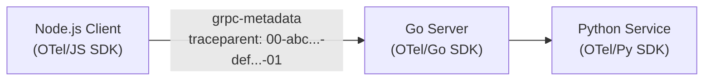

# gRPC Tracing with OpenTelemetry: Complete Instrumentation Guide

Author: [nawazdhandala](https://www.github.com/nawazdhandala)

Tags: OpenTelemetry, gRPC, Tracing, Observability, Microservices, Protocol Buffers

Description: A comprehensive guide to instrumenting gRPC services with OpenTelemetry- unary calls, streaming, interceptors, and metadata propagation for distributed tracing across polyglot microservices.

---

> gRPC is the backbone of modern microservices. OpenTelemetry gRPC instrumentation provides automatic context propagation, latency tracking, and error visibility across your entire service mesh.

This guide covers instrumenting gRPC services with OpenTelemetry in Node.js, Go, Python, and Java, including unary calls, streaming patterns, and custom interceptors.

---

## Table of Contents

1. Why gRPC Tracing Matters
2. Semantic Conventions for gRPC
3. Node.js gRPC Instrumentation
4. Go gRPC Instrumentation
5. Python gRPC Instrumentation
6. Java gRPC Instrumentation
7. Context Propagation via Metadata
8. Streaming RPCs
9. Error Handling and Status Codes
10. Custom Interceptors
11. Performance Considerations
12. Best Practices

---

## 1. Why gRPC Tracing Matters

### gRPC observability challenges

| Challenge | Without Tracing | With OpenTelemetry |
|-----------|-----------------|---------------------|
| Service dependencies | Unknown | Full call graph |
| Latency attribution | Guesswork | Per-service breakdown |
| Error propagation | Lost in logs | Connected traces |
| Streaming health | Invisible | Message-level visibility |
| Protocol overhead | Unmeasured | Serialization timing |

### What gRPC spans capture

| Property | Value |
|----------|-------|
| **Span** | /UserService/GetUser |
| **Kind** | SERVER (receiving service) |
| **Duration** | 45ms |
| **Attributes** | |
| rpc.system | grpc |
| rpc.service | UserService |
| rpc.method | GetUser |
| rpc.grpc.status_code | 0 (OK) |
| server.address | users.svc:50051 |
| net.peer.address | 10.0.0.5 |
| **Events** | message (type=RECEIVED, id=1) |

---

## 2. Semantic Conventions for gRPC

### Standard attributes

| Attribute | Type | Description | Example |
|-----------|------|-------------|---------|
| `rpc.system` | string | Always "grpc" | `grpc` |
| `rpc.service` | string | Service name | `UserService` |
| `rpc.method` | string | Method name | `GetUser` |
| `rpc.grpc.status_code` | int | gRPC status code | `0` (OK) |
| `server.address` | string | Server host | `users.svc` |
| `server.port` | int | Server port | `50051` |

### gRPC status codes

| Code | Name | Description |
|------|------|-------------|
| 0 | OK | Success |
| 1 | CANCELLED | Operation cancelled |
| 2 | UNKNOWN | Unknown error |
| 3 | INVALID_ARGUMENT | Bad request |
| 4 | DEADLINE_EXCEEDED | Timeout |
| 5 | NOT_FOUND | Resource not found |
| 13 | INTERNAL | Internal server error |
| 14 | UNAVAILABLE | Service unavailable |

---

## 3. Node.js gRPC Instrumentation

### Setup

```bash
npm install @opentelemetry/instrumentation-grpc
npm install @grpc/grpc-js @grpc/proto-loader
```

### Auto-instrumentation

```typescript
// telemetry.ts
import { NodeSDK } from '@opentelemetry/sdk-node';
import { GrpcInstrumentation } from '@opentelemetry/instrumentation-grpc';
import { OTLPTraceExporter } from '@opentelemetry/exporter-otlp-http';

const sdk = new NodeSDK({
  traceExporter: new OTLPTraceExporter({
    url: process.env.OTEL_EXPORTER_OTLP_ENDPOINT + '/v1/traces',
  }),
  instrumentations: [
    new GrpcInstrumentation({
      // Capture metadata as attributes
      metadataToSpanAttributes: {
        client: {
          requestMetadata: ['x-request-id', 'x-user-id'],
          responseMetadata: ['x-trace-id'],
        },
        server: {
          requestMetadata: ['x-request-id', 'x-user-id'],
          responseMetadata: ['x-trace-id'],
        },
      },
    }),
  ],
});

sdk.start();
```

### gRPC Server

```typescript
// server.ts
import './telemetry'; // Initialize first
import * as grpc from '@grpc/grpc-js';
import * as protoLoader from '@grpc/proto-loader';
import { trace, SpanStatusCode } from '@opentelemetry/api';

const tracer = trace.getTracer('grpc-server');

// Load proto
const packageDefinition = protoLoader.loadSync('user.proto');
const proto = grpc.loadPackageDefinition(packageDefinition) as any;

// Service implementation
const userService = {
  async getUser(
    call: grpc.ServerUnaryCall<any, any>,
    callback: grpc.sendUnaryData<any>
  ) {
    // Span is automatically created by instrumentation
    const span = trace.getActiveSpan();

    // Add business attributes
    span?.setAttributes({
      'user.id': call.request.userId,
      'request.source': call.metadata.get('x-source')[0] || 'unknown',
    });

    try {
      const user = await findUser(call.request.userId);

      if (!user) {
        span?.setStatus({ code: SpanStatusCode.ERROR, message: 'User not found' });
        callback({
          code: grpc.status.NOT_FOUND,
          message: 'User not found',
        }, null);
        return;
      }

      span?.setAttribute('user.found', true);
      callback(null, user);
    } catch (error: any) {
      span?.recordException(error);
      span?.setStatus({ code: SpanStatusCode.ERROR, message: error.message });
      callback({
        code: grpc.status.INTERNAL,
        message: error.message,
      }, null);
    }
  },

  async listUsers(call: grpc.ServerWritableStream<any, any>) {
    const span = trace.getActiveSpan();
    span?.setAttribute('request.page_size', call.request.pageSize);

    try {
      const users = await getAllUsers(call.request.pageSize);
      span?.setAttribute('response.count', users.length);

      for (const user of users) {
        call.write(user);
      }
      call.end();
    } catch (error: any) {
      span?.recordException(error);
      call.destroy(error);
    }
  },
};

// Create server
const server = new grpc.Server();
server.addService(proto.UserService.service, userService);
server.bindAsync('0.0.0.0:50051', grpc.ServerCredentials.createInsecure(), () => {
  console.log('gRPC server running on port 50051');
});
```

### gRPC Client

```typescript
// client.ts
import './telemetry';
import * as grpc from '@grpc/grpc-js';
import * as protoLoader from '@grpc/proto-loader';
import { trace, context, propagation } from '@opentelemetry/api';

const tracer = trace.getTracer('grpc-client');

const packageDefinition = protoLoader.loadSync('user.proto');
const proto = grpc.loadPackageDefinition(packageDefinition) as any;

const client = new proto.UserService(
  'localhost:50051',
  grpc.credentials.createInsecure()
);

async function getUser(userId: string): Promise<User> {
  return tracer.startActiveSpan('user.fetch', async (span) => {
    span.setAttribute('user.id', userId);

    // Create metadata with trace context
    const metadata = new grpc.Metadata();
    metadata.set('x-request-id', generateRequestId());

    return new Promise((resolve, reject) => {
      client.getUser({ userId }, metadata, (error: any, response: any) => {
        if (error) {
          span.recordException(error);
          span.setAttribute('rpc.grpc.status_code', error.code);
          span.end();
          reject(error);
        } else {
          span.setAttribute('user.found', true);
          span.end();
          resolve(response);
        }
      });
    });
  });
}
```

---

## 4. Go gRPC Instrumentation

### Setup

```bash
go get go.opentelemetry.io/contrib/instrumentation/google.golang.org/grpc/otelgrpc
```

### Server instrumentation

```go
package main

import (
    "context"
    "log"
    "net"

    "google.golang.org/grpc"
    "go.opentelemetry.io/contrib/instrumentation/google.golang.org/grpc/otelgrpc"
    "go.opentelemetry.io/otel"
    "go.opentelemetry.io/otel/attribute"
    "go.opentelemetry.io/otel/codes"
    "go.opentelemetry.io/otel/trace"

    pb "myapp/proto"
)

var tracer = otel.Tracer("grpc-server")

type userServer struct {
    pb.UnimplementedUserServiceServer
}

func (s *userServer) GetUser(ctx context.Context, req *pb.GetUserRequest) (*pb.User, error) {
    // Get span from context (created by otelgrpc)
    span := trace.SpanFromContext(ctx)
    span.SetAttributes(
        attribute.String("user.id", req.UserId),
    )

    user, err := findUser(ctx, req.UserId)
    if err != nil {
        span.RecordError(err)
        span.SetStatus(codes.Error, err.Error())
        return nil, err
    }

    if user == nil {
        span.SetStatus(codes.Error, "user not found")
        return nil, status.Error(codes.NotFound, "user not found")
    }

    span.SetAttributes(attribute.Bool("user.found", true))
    return user, nil
}

func main() {
    // Setup OpenTelemetry (see previous guides)
    setupTelemetry()

    lis, err := net.Listen("tcp", ":50051")
    if err != nil {
        log.Fatalf("failed to listen: %v", err)
    }

    // Create server with OpenTelemetry interceptors
    server := grpc.NewServer(
        grpc.StatsHandler(otelgrpc.NewServerHandler()),
    )

    pb.RegisterUserServiceServer(server, &userServer{})

    log.Println("gRPC server listening on :50051")
    server.Serve(lis)
}
```

### Client instrumentation

```go
package main

import (
    "context"
    "log"
    "time"

    "google.golang.org/grpc"
    "google.golang.org/grpc/credentials/insecure"
    "go.opentelemetry.io/contrib/instrumentation/google.golang.org/grpc/otelgrpc"
    "go.opentelemetry.io/otel"
    "go.opentelemetry.io/otel/attribute"

    pb "myapp/proto"
)

var tracer = otel.Tracer("grpc-client")

func main() {
    setupTelemetry()

    // Create connection with OpenTelemetry handler
    conn, err := grpc.NewClient("localhost:50051",
        grpc.WithTransportCredentials(insecure.NewCredentials()),
        grpc.WithStatsHandler(otelgrpc.NewClientHandler()),
    )
    if err != nil {
        log.Fatalf("failed to connect: %v", err)
    }
    defer conn.Close()

    client := pb.NewUserServiceClient(conn)

    // Make traced call
    ctx, span := tracer.Start(context.Background(), "fetch-user-workflow")
    defer span.End()

    ctx, cancel := context.WithTimeout(ctx, 5*time.Second)
    defer cancel()

    resp, err := client.GetUser(ctx, &pb.GetUserRequest{UserId: "123"})
    if err != nil {
        span.RecordError(err)
        log.Fatalf("GetUser failed: %v", err)
    }

    span.SetAttributes(attribute.String("response.user.name", resp.Name))
    log.Printf("User: %+v", resp)
}
```

---

## 5. Python gRPC Instrumentation

### Setup

```bash
pip install opentelemetry-instrumentation-grpc grpcio grpcio-tools
```

### Server instrumentation

```python
# server.py
from concurrent import futures
import grpc
from opentelemetry import trace
from opentelemetry.instrumentation.grpc import GrpcInstrumentorServer
from opentelemetry.trace import Status, StatusCode

import user_pb2
import user_pb2_grpc

# Instrument gRPC server
GrpcInstrumentorServer().instrument()

tracer = trace.get_tracer(__name__)

class UserServicer(user_pb2_grpc.UserServiceServicer):
    def GetUser(self, request, context):
        # Get current span (created by instrumentation)
        span = trace.get_current_span()
        span.set_attributes({
            'user.id': request.user_id,
        })

        try:
            user = find_user(request.user_id)
            if not user:
                span.set_status(Status(StatusCode.ERROR, 'User not found'))
                context.set_code(grpc.StatusCode.NOT_FOUND)
                context.set_details('User not found')
                return user_pb2.User()

            span.set_attribute('user.found', True)
            return user_pb2.User(
                id=user['id'],
                name=user['name'],
                email=user['email']
            )
        except Exception as e:
            span.record_exception(e)
            span.set_status(Status(StatusCode.ERROR, str(e)))
            context.set_code(grpc.StatusCode.INTERNAL)
            context.set_details(str(e))
            return user_pb2.User()


def serve():
    server = grpc.server(futures.ThreadPoolExecutor(max_workers=10))
    user_pb2_grpc.add_UserServiceServicer_to_server(UserServicer(), server)
    server.add_insecure_port('[::]:50051')
    server.start()
    print('gRPC server running on port 50051')
    server.wait_for_termination()


if __name__ == '__main__':
    serve()
```

### Client instrumentation

```python
# client.py
import grpc
from opentelemetry import trace
from opentelemetry.instrumentation.grpc import GrpcInstrumentorClient

import user_pb2
import user_pb2_grpc

# Instrument gRPC client
GrpcInstrumentorClient().instrument()

tracer = trace.get_tracer(__name__)

def get_user(user_id: str):
    with tracer.start_as_current_span('fetch-user') as span:
        span.set_attribute('user.id', user_id)

        with grpc.insecure_channel('localhost:50051') as channel:
            stub = user_pb2_grpc.UserServiceStub(channel)

            try:
                response = stub.GetUser(user_pb2.GetUserRequest(user_id=user_id))
                span.set_attribute('user.name', response.name)
                return response
            except grpc.RpcError as e:
                span.record_exception(e)
                span.set_attribute('rpc.grpc.status_code', e.code().value[0])
                raise


if __name__ == '__main__':
    user = get_user('123')
    print(f'User: {user}')
```

---

## 6. Java gRPC Instrumentation

### Using Java Agent

```bash
# Automatic instrumentation with Java agent
java -javaagent:opentelemetry-javaagent.jar \
     -Dotel.service.name=grpc-service \
     -Dotel.exporter.otlp.endpoint=https://oneuptime.com/otlp \
     -jar myapp.jar
```

### Manual instrumentation

```java
// GrpcServer.java
import io.grpc.Server;
import io.grpc.ServerBuilder;
import io.opentelemetry.api.GlobalOpenTelemetry;
import io.opentelemetry.api.trace.Span;
import io.opentelemetry.api.trace.StatusCode;
import io.opentelemetry.api.trace.Tracer;
import io.opentelemetry.instrumentation.grpc.v1_6.GrpcTelemetry;

public class GrpcServer {
    private static final Tracer tracer = GlobalOpenTelemetry.getTracer("grpc-server");

    public static void main(String[] args) throws Exception {
        GrpcTelemetry grpcTelemetry = GrpcTelemetry.create(GlobalOpenTelemetry.get());

        Server server = ServerBuilder.forPort(50051)
            .addService(grpcTelemetry.newServerInterceptor().intercept(new UserServiceImpl()))
            .build()
            .start();

        System.out.println("Server started on port 50051");
        server.awaitTermination();
    }
}

// UserServiceImpl.java
public class UserServiceImpl extends UserServiceGrpc.UserServiceImplBase {
    private static final Tracer tracer = GlobalOpenTelemetry.getTracer("user-service");

    @Override
    public void getUser(GetUserRequest request, StreamObserver<User> responseObserver) {
        Span span = Span.current();
        span.setAttribute("user.id", request.getUserId());

        try {
            User user = findUser(request.getUserId());
            if (user == null) {
                span.setStatus(StatusCode.ERROR, "User not found");
                responseObserver.onError(
                    Status.NOT_FOUND.withDescription("User not found").asRuntimeException()
                );
                return;
            }

            span.setAttribute("user.found", true);
            responseObserver.onNext(user);
            responseObserver.onCompleted();
        } catch (Exception e) {
            span.recordException(e);
            span.setStatus(StatusCode.ERROR, e.getMessage());
            responseObserver.onError(
                Status.INTERNAL.withDescription(e.getMessage()).asRuntimeException()
            );
        }
    }
}
```

---

## 7. Context Propagation via Metadata

### Automatic propagation

OpenTelemetry gRPC instrumentation automatically:
1. Injects trace context into outgoing metadata (client)
2. Extracts trace context from incoming metadata (server)

### Manual metadata handling

```typescript
// Node.js - Adding custom metadata
import { propagation, context } from '@opentelemetry/api';
import * as grpc from '@grpc/grpc-js';

function createMetadataWithContext(): grpc.Metadata {
  const metadata = new grpc.Metadata();

  // Inject trace context
  propagation.inject(context.active(), metadata, {
    set: (carrier, key, value) => carrier.set(key, value),
  });

  // Add custom metadata
  metadata.set('x-request-id', generateRequestId());
  metadata.set('x-user-id', getCurrentUserId());

  return metadata;
}

// Server - extracting context
function extractContextFromMetadata(metadata: grpc.Metadata): Context {
  return propagation.extract(context.active(), metadata, {
    get: (carrier, key) => {
      const values = carrier.get(key);
      return values.length > 0 ? String(values[0]) : undefined;
    },
    keys: (carrier) => carrier.keys(),
  });
}
```

### Cross-language propagation



All services see the same trace ID: `abc...`

---

## 8. Streaming RPCs

### Server streaming

```typescript
// Node.js server streaming
const userService = {
  async listUsers(call: grpc.ServerWritableStream<ListUsersRequest, User>) {
    const span = trace.getActiveSpan();
    span?.setAttribute('request.page_size', call.request.pageSize);

    let messageCount = 0;

    try {
      const users = await getAllUsers(call.request.pageSize);

      for (const user of users) {
        // Add event for each message
        span?.addEvent('message.sent', {
          'message.id': ++messageCount,
          'user.id': user.id,
        });

        call.write(user);
      }

      span?.setAttribute('stream.messages_sent', messageCount);
      call.end();
    } catch (error: any) {
      span?.recordException(error);
      call.destroy(error);
    }
  },
};
```

### Client streaming

```typescript
// Node.js client streaming
async function uploadUsers(users: User[]): Promise<UploadResult> {
  return tracer.startActiveSpan('upload.users', async (span) => {
    span.setAttribute('upload.count', users.length);

    return new Promise((resolve, reject) => {
      const call = client.uploadUsers((error, response) => {
        if (error) {
          span.recordException(error);
          span.end();
          reject(error);
        } else {
          span.setAttribute('upload.success_count', response.successCount);
          span.end();
          resolve(response);
        }
      });

      let messageCount = 0;
      for (const user of users) {
        span.addEvent('message.sent', { 'message.id': ++messageCount });
        call.write(user);
      }

      call.end();
    });
  });
}
```

### Bidirectional streaming

```typescript
// Chat service with bidirectional streaming
const chatService = {
  chat(call: grpc.ServerDuplexStream<ChatMessage, ChatMessage>) {
    const span = trace.getActiveSpan();
    let receivedCount = 0;
    let sentCount = 0;

    call.on('data', (message: ChatMessage) => {
      span?.addEvent('message.received', {
        'message.id': ++receivedCount,
        'message.type': message.type,
      });

      // Echo or broadcast
      const response = processMessage(message);
      span?.addEvent('message.sent', { 'message.id': ++sentCount });
      call.write(response);
    });

    call.on('end', () => {
      span?.setAttributes({
        'stream.messages_received': receivedCount,
        'stream.messages_sent': sentCount,
      });
      call.end();
    });

    call.on('error', (error) => {
      span?.recordException(error);
    });
  },
};
```

---

## 9. Error Handling and Status Codes

### Mapping errors to spans

```typescript
import * as grpc from '@grpc/grpc-js';
import { SpanStatusCode } from '@opentelemetry/api';

function mapGrpcStatusToSpan(span: Span, error: grpc.ServiceError) {
  span.setAttribute('rpc.grpc.status_code', error.code);

  // Map gRPC status to OpenTelemetry status
  const errorCodes = [
    grpc.status.CANCELLED,
    grpc.status.UNKNOWN,
    grpc.status.INVALID_ARGUMENT,
    grpc.status.DEADLINE_EXCEEDED,
    grpc.status.NOT_FOUND,
    grpc.status.ALREADY_EXISTS,
    grpc.status.PERMISSION_DENIED,
    grpc.status.RESOURCE_EXHAUSTED,
    grpc.status.FAILED_PRECONDITION,
    grpc.status.ABORTED,
    grpc.status.OUT_OF_RANGE,
    grpc.status.UNIMPLEMENTED,
    grpc.status.INTERNAL,
    grpc.status.UNAVAILABLE,
    grpc.status.DATA_LOSS,
    grpc.status.UNAUTHENTICATED,
  ];

  if (errorCodes.includes(error.code)) {
    span.setStatus({
      code: SpanStatusCode.ERROR,
      message: error.details || grpc.status[error.code],
    });
  }

  span.recordException({
    name: `gRPC ${grpc.status[error.code]}`,
    message: error.details || error.message,
  });
}
```

### Retries and deadlines

```typescript
async function getWithRetry(userId: string): Promise<User> {
  const maxRetries = 3;
  let lastError: Error | null = null;

  return tracer.startActiveSpan('user.fetch.with_retry', async (span) => {
    span.setAttribute('retry.max_attempts', maxRetries);

    for (let attempt = 1; attempt <= maxRetries; attempt++) {
      try {
        span.addEvent('retry.attempt', { 'attempt.number': attempt });

        const metadata = new grpc.Metadata();
        const deadline = new Date(Date.now() + 5000); // 5s timeout

        const user = await new Promise<User>((resolve, reject) => {
          client.getUser({ userId }, metadata, { deadline }, (err, resp) => {
            if (err) reject(err);
            else resolve(resp);
          });
        });

        span.setAttribute('retry.successful_attempt', attempt);
        span.end();
        return user;

      } catch (error: any) {
        lastError = error;
        span.addEvent('retry.failed', {
          'attempt.number': attempt,
          'error.code': error.code,
          'error.message': error.message,
        });

        // Don't retry on non-retryable errors
        if (![grpc.status.UNAVAILABLE, grpc.status.DEADLINE_EXCEEDED].includes(error.code)) {
          break;
        }

        // Exponential backoff
        await sleep(Math.pow(2, attempt) * 100);
      }
    }

    span.recordException(lastError!);
    span.setStatus({ code: SpanStatusCode.ERROR, message: lastError!.message });
    span.end();
    throw lastError;
  });
}
```

---

## 10. Custom Interceptors

### Logging interceptor with tracing

```typescript
// Node.js custom interceptor
import * as grpc from '@grpc/grpc-js';
import { trace, context, propagation } from '@opentelemetry/api';

const tracer = trace.getTracer('grpc-interceptor');

function loggingInterceptor(
  options: grpc.CallOptions,
  nextCall: (options: grpc.CallOptions) => grpc.InterceptingCall
): grpc.InterceptingCall {
  return new grpc.InterceptingCall(nextCall(options), {
    start: (metadata, listener, next) => {
      const span = trace.getActiveSpan();
      span?.addEvent('interceptor.start', {
        'metadata.keys': metadata.keys().join(','),
      });

      next(metadata, {
        onReceiveMetadata: (metadata, next) => {
          span?.addEvent('interceptor.response_metadata');
          next(metadata);
        },
        onReceiveMessage: (message, next) => {
          span?.addEvent('interceptor.response_message');
          next(message);
        },
        onReceiveStatus: (status, next) => {
          span?.addEvent('interceptor.status', {
            'status.code': status.code,
          });
          next(status);
        },
      });
    },
    sendMessage: (message, next) => {
      const span = trace.getActiveSpan();
      span?.addEvent('interceptor.send_message');
      next(message);
    },
  });
}

// Use interceptor
const client = new proto.UserService(
  'localhost:50051',
  grpc.credentials.createInsecure(),
  { interceptors: [loggingInterceptor] }
);
```

### Go interceptor

```go
func loggingUnaryInterceptor(
    ctx context.Context,
    req interface{},
    info *grpc.UnaryServerInfo,
    handler grpc.UnaryHandler,
) (interface{}, error) {
    span := trace.SpanFromContext(ctx)
    span.AddEvent("interceptor.start", trace.WithAttributes(
        attribute.String("method", info.FullMethod),
    ))

    start := time.Now()
    resp, err := handler(ctx, req)
    duration := time.Since(start)

    span.AddEvent("interceptor.complete", trace.WithAttributes(
        attribute.Int64("duration_ms", duration.Milliseconds()),
    ))

    if err != nil {
        span.RecordError(err)
    }

    return resp, err
}

// Use interceptor
server := grpc.NewServer(
    grpc.ChainUnaryInterceptor(
        otelgrpc.UnaryServerInterceptor(),
        loggingUnaryInterceptor,
    ),
)
```

---

## 11. Performance Considerations

### Instrumentation overhead

| Aspect | Overhead | Mitigation |
|--------|----------|------------|
| Span creation | ~1μs | Negligible |
| Metadata injection | ~0.5μs | Negligible |
| Attribute setting | ~0.1μs per attr | Limit attributes |
| Export batching | Background | Use async export |

### Sampling for high-throughput

```typescript
import { ParentBasedSampler, TraceIdRatioBasedSampler } from '@opentelemetry/sdk-trace-base';

const sdk = new NodeSDK({
  sampler: new ParentBasedSampler({
    root: new TraceIdRatioBasedSampler(0.1), // 10% of new traces
  }),
});
```

### Reducing span data

```typescript
new GrpcInstrumentation({
  // Don't capture large messages
  ignoreGrpcMethods: [
    /BulkUpload/, // Skip bulk operations
    /HealthCheck/, // Skip health checks
  ],
});
```

---

## 12. Best Practices

### gRPC tracing checklist

| Practice | Why |
|----------|-----|
| Use auto-instrumentation | Consistent spans, less code |
| Set business attributes | Correlate with domain |
| Handle all status codes | Complete error visibility |
| Track streaming message counts | Understand throughput |
| Propagate via metadata | Cross-service traces |
| Sample appropriately | Balance visibility vs cost |

### Span naming

```
// Standard naming: /{package}.{service}/{method}
/myapp.UserService/GetUser
/myapp.OrderService/CreateOrder
/myapp.ChatService/Chat (streaming)
```

### Essential attributes

```typescript
span.setAttributes({
  // Always
  'rpc.system': 'grpc',
  'rpc.service': 'UserService',
  'rpc.method': 'GetUser',
  'rpc.grpc.status_code': 0,

  // Recommended
  'server.address': 'users.svc',
  'server.port': 50051,

  // Business context
  'user.id': request.userId,
  'request.source': 'mobile-app',
});
```

---

## Summary

| Language | Instrumentation |
|----------|-----------------|
| Node.js | `@opentelemetry/instrumentation-grpc` |
| Go | `otelgrpc.NewServerHandler()` / `otelgrpc.NewClientHandler()` |
| Python | `GrpcInstrumentorServer()` / `GrpcInstrumentorClient()` |
| Java | Java Agent or `GrpcTelemetry.create()` |

gRPC instrumentation provides automatic context propagation across your service mesh. Use auto-instrumentation, add business attributes, and handle streaming patterns appropriately.

---

*Ready to trace your gRPC services? Send telemetry to [OneUptime](https://oneuptime.com) and visualize your service mesh.*

---

### See Also

- [What are Traces and Spans in OpenTelemetry](/blog/post/2025-08-27-traces-and-spans-in-opentelemetry/)
- [OpenTelemetry for Go Services](/blog/post/2025-12-17-opentelemetry-go-instrumentation/)
- [OpenTelemetry Semantic Conventions](/blog/post/2025-12-17-opentelemetry-semantic-conventions/)
