# OpenTelemetry in High-Throughput Systems: Scaling to Millions of Spans

[Nawaz Dhandala](https://github.com/nicksocial129) - December 17, 2025

**Tags:** OpenTelemetry, High-Throughput, Scaling, Performance, Architecture, Sampling

**Description:** Learn how to implement OpenTelemetry in high-throughput systems processing millions of requests. Covers sampling strategies, collector scaling, backpressure handling, and architecture patterns.

---

> When your system handles millions of requests per second, every microsecond of instrumentation overhead matters. OpenTelemetry can scale with proper architecture.

High-throughput systems present unique challenges for observability. This guide covers proven patterns and configurations for implementing OpenTelemetry at scale without impacting application performance.

## Table of Contents

1. [Challenges at Scale](#1-challenges-at-scale)
2. [Sampling Strategies](#2-sampling-strategies)
3. [Collector Architecture](#3-collector-architecture)
4. [SDK Optimization](#4-sdk-optimization)
5. [Backpressure Handling](#5-backpressure-handling)
6. [Storage and Querying](#6-storage-and-querying)
7. [Real-World Architectures](#7-real-world-architectures)
8. [Monitoring the Pipeline](#8-monitoring-the-pipeline)

## 1. Challenges at Scale

### The Scale Problem

**Scenario: 1 Million Requests/Second**

| Metric | Without Optimization | With Smart Sampling (1%) |
|--------|---------------------|-------------------------|
| Spans | 1,000,000/sec | 10,000/sec |
| Data volume | 500 MB/sec (1.8 TB/hour) | 5 MB/sec (18 GB/hour) |
| Network bandwidth | 4 Gbps | 40 Mbps |
| Storage (7 days) | 302 TB | 3 TB |

> **100x reduction while maintaining observability**

### Key Constraints

| Constraint | Challenge | Solution Area |
|------------|-----------|---------------|
| CPU overhead | Span creation impacts latency | SDK optimization |
| Memory pressure | Buffering spans consumes RAM | Backpressure |
| Network bandwidth | Export volume overwhelming | Sampling |
| Storage costs | Petabytes of data | Retention policies |
| Query latency | Finding needles in haystacks | Intelligent sampling |

### When to Apply These Patterns

- Request rates > 10,000/second
- Latency SLOs < 10ms
- Cost constraints on telemetry infrastructure
- Distributed systems with >50 services

## 2. Sampling Strategies

### Multi-Tier Sampling Architecture


### Priority-Based Sampling

```go
// Go: Priority-based sampler for high-throughput
package sampler

import (
    "context"
    "hash/fnv"
    "sync/atomic"
    "time"

    "go.opentelemetry.io/otel/sdk/trace"
    oteltrace "go.opentelemetry.io/otel/trace"
)

type PrioritySampler struct {
    baseRate        float64
    errorRate       float64
    slowThreshold   time.Duration
    currentRate     atomic.Value
    rateCalculator  *AdaptiveRateCalculator
}

type SamplingPriority int

const (
    PriorityDrop    SamplingPriority = 0
    PriorityLow     SamplingPriority = 1
    PriorityNormal  SamplingPriority = 2
    PriorityHigh    SamplingPriority = 3
    PriorityCritical SamplingPriority = 4
)

func NewPrioritySampler(baseRate float64) *PrioritySampler {
    s := &PrioritySampler{
        baseRate:      baseRate,
        errorRate:     1.0,  // 100% of errors
        slowThreshold: 500 * time.Millisecond,
    }
    s.currentRate.Store(baseRate)
    s.rateCalculator = NewAdaptiveRateCalculator(baseRate)
    return s
}

func (s *PrioritySampler) ShouldSample(params trace.SamplingParameters) trace.SamplingResult {
    priority := s.calculatePriority(params)

    var shouldSample bool
    switch priority {
    case PriorityCritical:
        shouldSample = true
    case PriorityHigh:
        shouldSample = s.probabilisticSample(params.TraceID, 0.5)
    case PriorityNormal:
        rate := s.currentRate.Load().(float64)
        shouldSample = s.probabilisticSample(params.TraceID, rate)
    case PriorityLow:
        rate := s.currentRate.Load().(float64)
        shouldSample = s.probabilisticSample(params.TraceID, rate*0.1)
    default:
        shouldSample = false
    }

    if shouldSample {
        return trace.SamplingResult{
            Decision:   trace.RecordAndSample,
            Tracestate: params.ParentContext.TraceState(),
        }
    }

    return trace.SamplingResult{
        Decision:   trace.Drop,
        Tracestate: params.ParentContext.TraceState(),
    }
}

func (s *PrioritySampler) calculatePriority(params trace.SamplingParameters) SamplingPriority {
    // Check for explicit priority attribute
    for _, attr := range params.Attributes {
        if attr.Key == "sampling.priority" {
            return SamplingPriority(attr.Value.AsInt64())
        }
    }

    // Check span kind and name for priority hints
    spanName := params.Name

    // Critical: Payment, authentication operations
    if containsAny(spanName, []string{"payment", "auth", "checkout"}) {
        return PriorityCritical
    }

    // High: User-facing operations
    if containsAny(spanName, []string{"api", "graphql", "rest"}) {
        return PriorityHigh
    }

    // Low: Internal operations
    if containsAny(spanName, []string{"cache", "health", "metrics"}) {
        return PriorityLow
    }

    return PriorityNormal
}

func (s *PrioritySampler) probabilisticSample(traceID oteltrace.TraceID, rate float64) bool {
    h := fnv.New64a()
    h.Write(traceID[:])
    hash := h.Sum64()

    threshold := uint64(rate * float64(^uint64(0)))
    return hash < threshold
}

// Adaptive rate adjustment based on throughput
type AdaptiveRateCalculator struct {
    targetSpansPerSecond int64
    windowSize          time.Duration
    spanCount           atomic.Int64
    lastAdjustment      atomic.Value
    currentRate         atomic.Value
}

func (c *AdaptiveRateCalculator) RecordSpan() {
    c.spanCount.Add(1)
}

func (c *AdaptiveRateCalculator) GetCurrentRate() float64 {
    return c.currentRate.Load().(float64)
}

func (c *AdaptiveRateCalculator) adjust() {
    count := c.spanCount.Swap(0)
    currentRate := c.currentRate.Load().(float64)

    // Calculate actual spans per second
    actualRate := float64(count) / c.windowSize.Seconds()

    // Adjust rate to meet target
    if actualRate > float64(c.targetSpansPerSecond)*1.1 {
        // Too many spans, reduce rate
        newRate := currentRate * 0.9
        if newRate < 0.001 {
            newRate = 0.001
        }
        c.currentRate.Store(newRate)
    } else if actualRate < float64(c.targetSpansPerSecond)*0.9 {
        // Too few spans, increase rate
        newRate := currentRate * 1.1
        if newRate > 1.0 {
            newRate = 1.0
        }
        c.currentRate.Store(newRate)
    }
}
```

### Consistent Sampling Across Services

```python
# Python: Consistent trace-based sampling
from opentelemetry.sdk.trace.sampling import Sampler, SamplingResult, Decision
from opentelemetry.trace import SpanKind
import hashlib

class ConsistentTraceSampler(Sampler):
    """
    Ensures consistent sampling decisions across all services
    in a distributed trace based on trace ID.
    """

    def __init__(self, rate: float):
        self.rate = rate
        self.threshold = int(rate * (2**64 - 1))

    def should_sample(
        self,
        parent_context,
        trace_id: int,
        name: str,
        kind: SpanKind = None,
        attributes=None,
        links=None,
    ) -> SamplingResult:

        # Use trace ID for consistent decision
        trace_id_bytes = trace_id.to_bytes(16, 'big')
        hash_value = int(hashlib.sha256(trace_id_bytes).hexdigest()[:16], 16)

        if hash_value < self.threshold:
            return SamplingResult(
                Decision.RECORD_AND_SAMPLE,
                attributes,
            )

        return SamplingResult(Decision.DROP)

    def get_description(self) -> str:
        return f"ConsistentTraceSampler(rate={self.rate})"


class RateLimitingSampler(Sampler):
    """
    Rate-limiting sampler that caps spans per second.
    """

    def __init__(self, max_spans_per_second: int):
        self.max_spans = max_spans_per_second
        self.token_bucket = TokenBucket(max_spans_per_second)

    def should_sample(
        self,
        parent_context,
        trace_id: int,
        name: str,
        kind: SpanKind = None,
        attributes=None,
        links=None,
    ) -> SamplingResult:

        # Always sample if parent is sampled (consistent decision)
        if parent_context and parent_context.trace_flags.sampled:
            return SamplingResult(Decision.RECORD_AND_SAMPLE, attributes)

        # Rate limit new traces
        if self.token_bucket.acquire():
            return SamplingResult(Decision.RECORD_AND_SAMPLE, attributes)

        return SamplingResult(Decision.DROP)


class TokenBucket:
    """Token bucket for rate limiting."""

    def __init__(self, rate: float, capacity: float = None):
        self.rate = rate
        self.capacity = capacity or rate * 2
        self.tokens = self.capacity
        self.last_update = time.monotonic()
        self.lock = threading.Lock()

    def acquire(self) -> bool:
        with self.lock:
            now = time.monotonic()
            elapsed = now - self.last_update
            self.tokens = min(self.capacity, self.tokens + elapsed * self.rate)
            self.last_update = now

            if self.tokens >= 1:
                self.tokens -= 1
                return True
            return False
```

## 3. Collector Architecture

### Scalable Collector Deployment


### Agent Configuration (Per-Node)

```yaml
# otel-agent-config.yaml - Lightweight per-node collector
receivers:
  otlp:
    protocols:
      grpc:
        endpoint: 0.0.0.0:4317
        max_recv_msg_size_mib: 4
        max_concurrent_streams: 50

processors:
  # First-stage head sampling
  probabilistic_sampler:
    sampling_percentage: 20

  # Minimal batching for quick forwarding
  batch:
    timeout: 200ms
    send_batch_size: 256
    send_batch_max_size: 512

  # Memory protection
  memory_limiter:
    check_interval: 100ms
    limit_mib: 400
    spike_limit_mib: 100

exporters:
  otlp/gateway:
    endpoint: otel-gateway.observability:4317
    tls:
      insecure: true
    compression: zstd
    sending_queue:
      enabled: true
      num_consumers: 4
      queue_size: 1000
    retry_on_failure:
      enabled: true
      initial_interval: 1s
      max_interval: 10s

service:
  pipelines:
    traces:
      receivers: [otlp]
      processors: [memory_limiter, probabilistic_sampler, batch]
      exporters: [otlp/gateway]

  telemetry:
    logs:
      level: warn
    metrics:
      address: 0.0.0.0:8888
```

### Gateway Configuration (Centralized)

```yaml
# otel-gateway-config.yaml - High-capacity gateway collector
receivers:
  otlp:
    protocols:
      grpc:
        endpoint: 0.0.0.0:4317
        max_recv_msg_size_mib: 16
        max_concurrent_streams: 200
        keepalive:
          server_parameters:
            max_connection_age: 60s
            max_connection_age_grace: 10s

extensions:
  memory_ballast:
    size_mib: 1365  # ~1/3 of 4GB limit

processors:
  memory_limiter:
    check_interval: 500ms
    limit_mib: 3000
    spike_limit_mib: 800

  # Tail-based sampling for intelligent decisions
  tail_sampling:
    decision_wait: 30s
    num_traces: 200000
    expected_new_traces_per_sec: 50000
    policies:
      # Keep all errors
      - name: error-policy
        type: status_code
        status_code:
          status_codes: [ERROR]

      # Keep slow traces
      - name: latency-policy
        type: latency
        latency:
          threshold_ms: 500

      # Keep traces with specific attributes
      - name: important-policy
        type: string_attribute
        string_attribute:
          key: priority
          values: [high, critical]

      # Sample rest probabilistically
      - name: probabilistic-policy
        type: probabilistic
        probabilistic:
          sampling_percentage: 5

  batch:
    timeout: 2s
    send_batch_size: 2048
    send_batch_max_size: 4096

exporters:
  otlphttp:
    endpoint: https://backend.example.com
    compression: zstd
    sending_queue:
      enabled: true
      num_consumers: 20
      queue_size: 10000
    retry_on_failure:
      enabled: true
      initial_interval: 5s
      max_interval: 60s
      max_elapsed_time: 300s

service:
  extensions: [memory_ballast, health_check]
  pipelines:
    traces:
      receivers: [otlp]
      processors: [memory_limiter, tail_sampling, batch]
      exporters: [otlphttp]
```

### Kubernetes Deployment

```yaml
# DaemonSet for agents
apiVersion: apps/v1
kind: DaemonSet
metadata:
  name: otel-agent
  namespace: observability
spec:
  selector:
    matchLabels:
      app: otel-agent
  template:
    spec:
      containers:
        - name: agent
          image: otel/opentelemetry-collector:latest
          resources:
            limits:
              memory: 512Mi
              cpu: 500m
            requests:
              memory: 256Mi
              cpu: 100m
          ports:
            - containerPort: 4317
              hostPort: 4317
          volumeMounts:
            - name: config
              mountPath: /etc/otelcol
---
# Deployment for gateway (with HPA)
apiVersion: apps/v1
kind: Deployment
metadata:
  name: otel-gateway
  namespace: observability
spec:
  replicas: 3
  template:
    spec:
      affinity:
        podAntiAffinity:
          preferredDuringSchedulingIgnoredDuringExecution:
            - weight: 100
              podAffinityTerm:
                topologyKey: kubernetes.io/hostname
      containers:
        - name: gateway
          image: otel/opentelemetry-collector:latest
          resources:
            limits:
              memory: 4Gi
              cpu: 2000m
            requests:
              memory: 2Gi
              cpu: 1000m
---
apiVersion: autoscaling/v2
kind: HorizontalPodAutoscaler
metadata:
  name: otel-gateway-hpa
spec:
  scaleTargetRef:
    apiVersion: apps/v1
    kind: Deployment
    name: otel-gateway
  minReplicas: 3
  maxReplicas: 20
  metrics:
    - type: Resource
      resource:
        name: cpu
        target:
          type: Utilization
          averageUtilization: 70
    - type: Resource
      resource:
        name: memory
        target:
          type: Utilization
          averageUtilization: 75
```

## 4. SDK Optimization

### High-Performance Go SDK

```go
// Go: Optimized SDK configuration for high throughput
package tracing

import (
    "context"
    "runtime"

    "go.opentelemetry.io/otel"
    "go.opentelemetry.io/otel/attribute"
    "go.opentelemetry.io/otel/exporters/otlp/otlptrace/otlptracegrpc"
    "go.opentelemetry.io/otel/sdk/resource"
    "go.opentelemetry.io/otel/sdk/trace"
)

func InitHighThroughputTracer(ctx context.Context) (*trace.TracerProvider, error) {
    // Create exporter with optimized settings
    exporter, err := otlptracegrpc.New(ctx,
        otlptracegrpc.WithEndpoint("localhost:4317"),
        otlptracegrpc.WithInsecure(),
        otlptracegrpc.WithCompressor("gzip"),
    )
    if err != nil {
        return nil, err
    }

    // Resource with minimal attributes
    res, _ := resource.Merge(
        resource.Default(),
        resource.NewWithAttributes(
            "",
            attribute.String("service.name", "high-throughput-service"),
            attribute.String("service.version", "1.0.0"),
        ),
    )

    // Configure batch processor for high throughput
    bsp := trace.NewBatchSpanProcessor(exporter,
        // Larger batches reduce export overhead
        trace.WithMaxExportBatchSize(2048),
        // Larger queue prevents drops
        trace.WithMaxQueueSize(10000),
        // Balance latency vs efficiency
        trace.WithBatchTimeout(2*time.Second),
        // Export when batch is full
        trace.WithExportTimeout(30*time.Second),
    )

    // Create provider with optimized settings
    tp := trace.NewTracerProvider(
        trace.WithBatcher(exporter,
            trace.WithMaxExportBatchSize(2048),
            trace.WithMaxQueueSize(10000),
        ),
        trace.WithResource(res),
        trace.WithSampler(NewPrioritySampler(0.1)), // 10% base rate
        trace.WithSpanLimits(trace.SpanLimits{
            AttributeCountLimit:         32,
            EventCountLimit:             4,
            LinkCountLimit:              4,
            AttributePerEventCountLimit: 8,
            AttributePerLinkCountLimit:  8,
        }),
    )

    otel.SetTracerProvider(tp)
    return tp, nil
}

// Pre-allocated attribute sets for common operations
var (
    HTTPGetAttrs = []attribute.KeyValue{
        attribute.String("http.method", "GET"),
    }
    HTTPPostAttrs = []attribute.KeyValue{
        attribute.String("http.method", "POST"),
    }
)

// Optimized span creation
func CreateOptimizedSpan(ctx context.Context, tracer trace.Tracer, name string, attrs []attribute.KeyValue) (context.Context, trace.Span) {
    return tracer.Start(ctx, name,
        trace.WithAttributes(attrs...),
        trace.WithSpanKind(trace.SpanKindServer),
    )
}
```

### High-Performance Java SDK

```java
// Java: High-throughput SDK configuration
package com.example.tracing;

import io.opentelemetry.api.GlobalOpenTelemetry;
import io.opentelemetry.api.trace.Tracer;
import io.opentelemetry.exporter.otlp.trace.OtlpGrpcSpanExporter;
import io.opentelemetry.sdk.OpenTelemetrySdk;
import io.opentelemetry.sdk.trace.SdkTracerProvider;
import io.opentelemetry.sdk.trace.SpanLimits;
import io.opentelemetry.sdk.trace.export.BatchSpanProcessor;
import io.opentelemetry.sdk.trace.samplers.Sampler;

import java.time.Duration;
import java.util.concurrent.Executors;

public class HighThroughputTracing {

    public static SdkTracerProvider initTracer() {
        // Optimized exporter
        OtlpGrpcSpanExporter exporter = OtlpGrpcSpanExporter.builder()
            .setEndpoint("http://localhost:4317")
            .setCompression("gzip")
            .setTimeout(Duration.ofSeconds(30))
            .build();

        // High-capacity batch processor
        BatchSpanProcessor processor = BatchSpanProcessor.builder(exporter)
            .setMaxExportBatchSize(2048)
            .setMaxQueueSize(10000)
            .setScheduleDelay(Duration.ofSeconds(2))
            .setExporterTimeout(Duration.ofSeconds(30))
            .build();

        // Strict span limits
        SpanLimits spanLimits = SpanLimits.builder()
            .setMaxNumberOfAttributes(32)
            .setMaxNumberOfEvents(4)
            .setMaxNumberOfLinks(4)
            .setMaxAttributeValueLength(256)
            .build();

        return SdkTracerProvider.builder()
            .addSpanProcessor(processor)
            .setSampler(Sampler.traceIdRatioBased(0.1))
            .setSpanLimits(spanLimits)
            .build();
    }

    // Object pool for attribute arrays
    private static final ObjectPool<AttributeBuilder> attributePool =
        new ObjectPool<>(() -> new AttributeBuilder(), 1000);

    public static void traceWithPooledAttributes(Tracer tracer, String operation) {
        AttributeBuilder builder = attributePool.acquire();
        try {
            builder.reset()
                .add("operation", operation)
                .add("timestamp", System.currentTimeMillis());

            Span span = tracer.spanBuilder(operation)
                .setAllAttributes(builder.build())
                .startSpan();

            try (Scope scope = span.makeCurrent()) {
                // Business logic
            } finally {
                span.end();
            }
        } finally {
            attributePool.release(builder);
        }
    }
}
```

## 5. Backpressure Handling

### Graceful Degradation

```go
// Go: Backpressure-aware span processor
package backpressure

import (
    "context"
    "sync"
    "sync/atomic"
    "time"

    "go.opentelemetry.io/otel/sdk/trace"
)

type BackpressureProcessor struct {
    next           trace.SpanProcessor
    queueSize      int64
    maxQueueSize   int64
    dropRate       atomic.Value
    metrics        *ProcessorMetrics
    mu             sync.RWMutex
}

type ProcessorMetrics struct {
    SpansReceived  atomic.Int64
    SpansDropped   atomic.Int64
    SpansExported  atomic.Int64
    CurrentBacklog atomic.Int64
}

func NewBackpressureProcessor(next trace.SpanProcessor, maxQueue int64) *BackpressureProcessor {
    bp := &BackpressureProcessor{
        next:         next,
        maxQueueSize: maxQueue,
        metrics:      &ProcessorMetrics{},
    }
    bp.dropRate.Store(float64(0))

    // Start monitoring goroutine
    go bp.monitorBackpressure()

    return bp
}

func (bp *BackpressureProcessor) OnEnd(s trace.ReadOnlySpan) {
    bp.metrics.SpansReceived.Add(1)

    // Check if we should drop due to backpressure
    dropRate := bp.dropRate.Load().(float64)
    if dropRate > 0 && shouldDrop(dropRate) {
        bp.metrics.SpansDropped.Add(1)
        return
    }

    // Check queue capacity
    currentQueue := atomic.LoadInt64(&bp.queueSize)
    if currentQueue >= bp.maxQueueSize {
        bp.metrics.SpansDropped.Add(1)
        return
    }

    // Forward to next processor
    atomic.AddInt64(&bp.queueSize, 1)
    bp.next.OnEnd(s)
    atomic.AddInt64(&bp.queueSize, -1)
    bp.metrics.SpansExported.Add(1)
}

func (bp *BackpressureProcessor) monitorBackpressure() {
    ticker := time.NewTicker(100 * time.Millisecond)
    defer ticker.Stop()

    for range ticker.C {
        currentQueue := atomic.LoadInt64(&bp.queueSize)
        utilization := float64(currentQueue) / float64(bp.maxQueueSize)

        // Calculate drop rate based on queue utilization
        var newDropRate float64
        switch {
        case utilization > 0.95:
            newDropRate = 0.9  // Drop 90%
        case utilization > 0.9:
            newDropRate = 0.7  // Drop 70%
        case utilization > 0.8:
            newDropRate = 0.5  // Drop 50%
        case utilization > 0.7:
            newDropRate = 0.3  // Drop 30%
        case utilization > 0.6:
            newDropRate = 0.1  // Drop 10%
        default:
            newDropRate = 0    // No dropping
        }

        bp.dropRate.Store(newDropRate)
        bp.metrics.CurrentBacklog.Store(currentQueue)
    }
}

func shouldDrop(rate float64) bool {
    return rand.Float64() < rate
}

func (bp *BackpressureProcessor) Shutdown(ctx context.Context) error {
    return bp.next.Shutdown(ctx)
}
```

### Circuit Breaker Pattern

```typescript
// TypeScript: Circuit breaker for telemetry export
import { SpanProcessor, ReadableSpan, Span } from '@opentelemetry/sdk-trace-base';

enum CircuitState {
  CLOSED,
  OPEN,
  HALF_OPEN,
}

class CircuitBreakerProcessor implements SpanProcessor {
  private state: CircuitState = CircuitState.CLOSED;
  private failureCount = 0;
  private successCount = 0;
  private lastFailureTime = 0;

  private readonly failureThreshold = 5;
  private readonly successThreshold = 3;
  private readonly timeout = 30000; // 30 seconds

  private readonly inner: SpanProcessor;
  private readonly fallback: SpanProcessor;

  constructor(inner: SpanProcessor, fallback: SpanProcessor) {
    this.inner = inner;
    this.fallback = fallback;
  }

  onStart(span: Span): void {
    this.getActiveProcessor().onStart(span);
  }

  onEnd(span: ReadableSpan): void {
    this.updateState();
    this.getActiveProcessor().onEnd(span);
  }

  private getActiveProcessor(): SpanProcessor {
    switch (this.state) {
      case CircuitState.OPEN:
        return this.fallback;
      case CircuitState.HALF_OPEN:
        return this.inner; // Try the real processor
      case CircuitState.CLOSED:
      default:
        return this.inner;
    }
  }

  private updateState(): void {
    const now = Date.now();

    switch (this.state) {
      case CircuitState.CLOSED:
        // Stays closed unless failures exceed threshold
        break;

      case CircuitState.OPEN:
        // Check if timeout has passed
        if (now - this.lastFailureTime > this.timeout) {
          this.state = CircuitState.HALF_OPEN;
          this.successCount = 0;
        }
        break;

      case CircuitState.HALF_OPEN:
        // Move to closed if enough successes
        if (this.successCount >= this.successThreshold) {
          this.state = CircuitState.CLOSED;
          this.failureCount = 0;
        }
        break;
    }
  }

  recordFailure(): void {
    this.failureCount++;
    this.lastFailureTime = Date.now();

    if (this.failureCount >= this.failureThreshold) {
      this.state = CircuitState.OPEN;
    }
  }

  recordSuccess(): void {
    if (this.state === CircuitState.HALF_OPEN) {
      this.successCount++;
    }
    this.failureCount = 0;
  }

  async forceFlush(): Promise<void> {
    await this.inner.forceFlush();
    await this.fallback.forceFlush();
  }

  async shutdown(): Promise<void> {
    await this.inner.shutdown();
    await this.fallback.shutdown();
  }
}
```

## 6. Storage and Querying

### Storage Tier Strategy

```mermaid
flowchart TB
    subgraph Hot["Hot Tier (Last 24 hours) - Cost: $$$"]
        H1[Full-resolution data]
        H2[Fast queries < 1s]
        H3[In-memory indexes]
        H4[SSD storage]
    end

    subgraph Warm["Warm Tier (1-7 days) - Cost: $$"]
        W1[Sampled data 10-50%]
        W2[Medium queries < 10s]
        W3[Disk-based indexes]
        W4[HDD storage]
    end

    subgraph Cold["Cold Tier (7-30 days) - Cost: $"]
        C1[Highly sampled 1-5%]
        C2[Slow queries < 1m]
        C3[Minimal indexes]
        C4[Object storage S3]
    end

    subgraph Archive["Archive (30+ days) - Cost: ¢"]
        A1[Aggregated metrics only]
        A2[Compliance/audit purposes]
        A3[Glacier/deep archive]
    end

    Hot --> Warm --> Cold --> Archive
```



### Collector Routing for Tiered Storage

```yaml
# Collector: Route to different backends based on criteria
processors:
  routing:
    from_attribute: sampling.tier
    default_exporters: [otlp/hot]
    table:
      - value: cold
        exporters: [otlp/cold]
      - value: archive
        exporters: [otlp/archive]

  # Add tier attribute based on sampling result
  transform:
    trace_statements:
      - context: span
        statements:
          - set(attributes["sampling.tier"], "hot") where attributes["error"] == true
          - set(attributes["sampling.tier"], "hot") where attributes["latency"] > 500
          - set(attributes["sampling.tier"], "cold") where attributes["sampling.tier"] == nil

exporters:
  otlp/hot:
    endpoint: https://hot-storage.example.com:4317
    compression: zstd

  otlp/cold:
    endpoint: https://cold-storage.example.com:4317
    compression: zstd

  otlp/archive:
    endpoint: https://s3-exporter.example.com:4317
    compression: zstd
```

## 7. Real-World Architectures

### E-Commerce Platform (500K RPS)

```yaml
# Architecture for 500K requests/second e-commerce platform
# Total daily traces: ~43 billion
# Sampled to: ~430 million (1%)
# Storage: ~20TB/day compressed

components:
  sdk:
    sampling_rate: 0.1  # 10% head sampling
    batch_size: 1024
    queue_size: 5000

  agent:
    per_node: true
    resources:
      memory: 512Mi
      cpu: 500m
    sampling: 0.5  # Additional 50% reduction

  gateway:
    replicas: 10
    resources:
      memory: 8Gi
      cpu: 4
    tail_sampling:
      error_rate: 1.0
      latency_threshold: 200ms
      base_rate: 0.1

  storage:
    hot:
      retention: 24h
      technology: elasticsearch
    warm:
      retention: 7d
      technology: clickhouse
    cold:
      retention: 30d
      technology: s3

effective_sampling:
  errors: 100%      # All errors captured
  slow_requests: 50% # P99+ latency
  normal: 0.5%      # Background rate
```

### Financial Trading Platform (1M TPS)

```yaml
# Architecture for 1M transactions/second trading platform
# Ultra-low latency requirements (<1ms instrumentation overhead)

components:
  sdk:
    # Minimal overhead configuration
    sampling_rate: 0.01  # 1% head sampling
    batch_size: 4096
    async_export: true
    span_limits:
      attributes: 16
      events: 2
      links: 2

  # Skip agent layer for latency
  direct_export:
    endpoint: gateway-lb.internal
    protocol: grpc
    compression: none  # Trade bandwidth for CPU

  gateway:
    replicas: 20
    memory: 16Gi
    tail_sampling:
      # Focus on anomalies
      error_rate: 1.0
      latency_p99_rate: 1.0
      base_rate: 0.001

  storage:
    # High-performance time-series
    primary: questdb
    retention: 4h  # Short hot window
    archive: parquet_on_s3
```

## 8. Monitoring the Pipeline

### Pipeline Health Metrics

```yaml
# Prometheus alerts for high-throughput pipeline
groups:
  - name: otel-pipeline-health
    rules:
      - alert: HighDropRate
        expr: |
          rate(otelcol_processor_dropped_spans[5m]) /
          rate(otelcol_receiver_accepted_spans[5m]) > 0.05
        for: 5m
        labels:
          severity: warning
        annotations:
          summary: "Dropping more than 5% of spans"

      - alert: ExportBacklog
        expr: otelcol_exporter_queue_size > 8000
        for: 2m
        labels:
          severity: warning
        annotations:
          summary: "Export queue building up"

      - alert: MemoryPressure
        expr: |
          otelcol_process_memory_rss /
          otelcol_memory_limiter_limit_mib * 1024 * 1024 > 0.85
        for: 1m
        labels:
          severity: critical
        annotations:
          summary: "Collector memory usage critical"

      - alert: SamplingRateTooLow
        expr: |
          rate(otelcol_processor_tail_sampling_sampled_spans[5m]) /
          rate(otelcol_processor_tail_sampling_total_spans[5m]) < 0.001
        for: 10m
        labels:
          severity: info
        annotations:
          summary: "Effective sampling rate below 0.1%"
```

### Grafana Dashboard Queries

```promql
# Key metrics for high-throughput monitoring

# Throughput
sum(rate(otelcol_receiver_accepted_spans[5m])) by (receiver)

# Drop rate
sum(rate(otelcol_processor_dropped_spans[5m])) /
sum(rate(otelcol_receiver_accepted_spans[5m]))

# Export latency
histogram_quantile(0.99,
  rate(otelcol_exporter_send_latency_bucket[5m])
)

# Queue utilization
otelcol_exporter_queue_size / otelcol_exporter_queue_capacity

# Memory efficiency
rate(otelcol_exporter_sent_spans[5m]) /
(otelcol_process_memory_rss / 1024 / 1024)
```

## Summary

Implementing OpenTelemetry in high-throughput systems requires:

- **Multi-tier sampling**: Combine head and tail sampling
- **Scalable architecture**: Agent + Gateway collector pattern
- **SDK optimization**: Batch processing, span limits, pooling
- **Backpressure handling**: Graceful degradation under load
- **Tiered storage**: Hot/warm/cold data management
- **Pipeline monitoring**: Track health and efficiency

With proper architecture, OpenTelemetry can scale to millions of spans per second while maintaining observability quality.

## Scale Your Observability with OneUptime

OneUptime is built for high-throughput environments with intelligent sampling, efficient storage, and cost-effective retention. Native OpenTelemetry support that scales with your needs.

[Start Free Trial](https://oneuptime.com/signup) - High-throughput observability.

## See Also

- [OpenTelemetry Performance Impact](/blog/opentelemetry-performance-impact)
- [OpenTelemetry Sampling Strategies](/blog/opentelemetry-sampling-strategies)
- [Collector Pipelines Deep Dive](/blog/opentelemetry-collector-pipelines)
