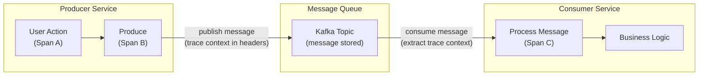

# Message Queue Tracing with OpenTelemetry: Kafka, RabbitMQ, and SQS

[Nawaz Dhandala](https://github.com/nicksocial129) - December 17, 2025

**Tags:** OpenTelemetry, Message Queues, Kafka, RabbitMQ, SQS, Distributed Tracing, Event-Driven

**Description:** Implement distributed tracing for message queues and event-driven architectures using OpenTelemetry, covering Kafka, RabbitMQ, AWS SQS, and more.

---

> In event-driven architectures, a single user action can trigger dozens of asynchronous processes across multiple services. Without proper tracing, understanding the flow of these events becomes nearly impossible.

Message queues decouple services but create observability challenges. OpenTelemetry provides standardized instrumentation for tracing messages across Kafka, RabbitMQ, SQS, and other messaging systems, giving you visibility into your entire event-driven architecture.

## Table of Contents

1. [Challenges of Message Queue Observability](#1-challenges-of-message-queue-observability)
2. [Context Propagation in Messaging](#2-context-propagation-in-messaging)
3. [Apache Kafka Instrumentation](#3-apache-kafka-instrumentation)
4. [RabbitMQ Instrumentation](#4-rabbitmq-instrumentation)
5. [AWS SQS Instrumentation](#5-aws-sqs-instrumentation)
6. [Span Links for Batch Processing](#6-span-links-for-batch-processing)
7. [Dead Letter Queue Tracing](#7-dead-letter-queue-tracing)
8. [Production Best Practices](#8-production-best-practices)

## 1. Challenges of Message Queue Observability

### Why Message Queues Are Hard to Trace

| Challenge | Description | Solution |
|-----------|-------------|----------|
| Asynchronous processing | Producer and consumer run independently | Context propagation via headers |
| Batch consumption | Multiple messages processed together | Span links instead of parent-child |
| Delayed processing | Messages may wait in queue | Capture queue time as attribute |
| Retries and DLQs | Failed messages follow different paths | Trace through retry logic |
| Fan-out patterns | One message triggers multiple consumers | Multiple child spans or links |

### Message Flow Visualization



**Trace:** `[Span A] -> [Span B] -> [Span C] -> [Business Logic]`

## 2. Context Propagation in Messaging

### How Context Flows Through Messages

```typescript
// context-propagation.ts
import { context, propagation, trace, SpanKind } from '@opentelemetry/api';

const tracer = trace.getTracer('messaging');

// Producer: Inject context into message headers
function produceMessage(topic: string, payload: any) {
  const span = tracer.startSpan('send', {
    kind: SpanKind.PRODUCER,
    attributes: {
      'messaging.system': 'kafka',
      'messaging.destination': topic,
      'messaging.destination_kind': 'topic',
    },
  });

  // Create headers object for context
  const headers: Record<string, string> = {};

  // Inject current context into headers
  context.with(trace.setSpan(context.active(), span), () => {
    propagation.inject(context.active(), headers);
  });

  // Send message with headers
  sendToKafka(topic, payload, headers);

  span.end();
}

// Consumer: Extract context from message headers
function consumeMessage(message: { headers: Record<string, string>; payload: any }) {
  // Extract context from message headers
  const extractedContext = propagation.extract(context.active(), message.headers);

  // Create consumer span with extracted context as parent
  const span = tracer.startSpan(
    'receive',
    {
      kind: SpanKind.CONSUMER,
      attributes: {
        'messaging.system': 'kafka',
        'messaging.operation': 'receive',
      },
    },
    extractedContext
  );

  context.with(trace.setSpan(extractedContext, span), () => {
    // Process message
    processMessage(message.payload);
  });

  span.end();
}
```

### Semantic Conventions for Messaging

| Attribute | Description | Example |
|-----------|-------------|---------|
| `messaging.system` | Messaging system identifier | kafka, rabbitmq, sqs |
| `messaging.destination` | Queue or topic name | orders-topic |
| `messaging.destination_kind` | Type of destination | queue, topic |
| `messaging.operation` | Operation type | send, receive, process |
| `messaging.message_id` | Unique message identifier | uuid |
| `messaging.conversation_id` | Correlation ID | order-123 |
| `messaging.message_payload_size_bytes` | Size of payload | 1024 |

## 3. Apache Kafka Instrumentation

### Node.js with KafkaJS

```typescript
// kafka-tracing.ts
import { Kafka, Producer, Consumer, EachMessagePayload } from 'kafkajs';
import { trace, context, propagation, SpanKind, SpanStatusCode } from '@opentelemetry/api';

const tracer = trace.getTracer('kafka-service');

const kafka = new Kafka({
  clientId: 'my-app',
  brokers: ['localhost:9092'],
});

// Instrumented Producer
class TracedKafkaProducer {
  private producer: Producer;

  constructor() {
    this.producer = kafka.producer();
  }

  async connect() {
    await this.producer.connect();
  }

  async send(topic: string, messages: Array<{ key?: string; value: string }>) {
    const span = tracer.startSpan(`kafka.produce ${topic}`, {
      kind: SpanKind.PRODUCER,
      attributes: {
        'messaging.system': 'kafka',
        'messaging.destination': topic,
        'messaging.destination_kind': 'topic',
        'messaging.kafka.client_id': 'my-app',
      },
    });

    try {
      const tracedMessages = messages.map((msg) => {
        const headers: Record<string, string> = {};

        // Inject trace context into message headers
        context.with(trace.setSpan(context.active(), span), () => {
          propagation.inject(context.active(), headers);
        });

        return {
          ...msg,
          headers,
        };
      });

      const result = await this.producer.send({
        topic,
        messages: tracedMessages,
      });

      span.setAttribute('messaging.kafka.partition', result[0].partition);
      span.setStatus({ code: SpanStatusCode.OK });

      return result;
    } catch (error) {
      span.setStatus({ code: SpanStatusCode.ERROR, message: (error as Error).message });
      span.recordException(error as Error);
      throw error;
    } finally {
      span.end();
    }
  }
}

// Instrumented Consumer
class TracedKafkaConsumer {
  private consumer: Consumer;

  constructor(groupId: string) {
    this.consumer = kafka.consumer({ groupId });
  }

  async connect() {
    await this.consumer.connect();
  }

  async subscribe(topic: string) {
    await this.consumer.subscribe({ topic, fromBeginning: false });
  }

  async run(handler: (payload: EachMessagePayload) => Promise<void>) {
    await this.consumer.run({
      eachMessage: async (payload) => {
        const { topic, partition, message } = payload;

        // Extract context from message headers
        const headers: Record<string, string> = {};
        if (message.headers) {
          for (const [key, value] of Object.entries(message.headers)) {
            if (value) {
              headers[key] = value.toString();
            }
          }
        }

        const extractedContext = propagation.extract(context.active(), headers);

        const span = tracer.startSpan(
          `kafka.consume ${topic}`,
          {
            kind: SpanKind.CONSUMER,
            attributes: {
              'messaging.system': 'kafka',
              'messaging.destination': topic,
              'messaging.destination_kind': 'topic',
              'messaging.operation': 'receive',
              'messaging.kafka.partition': partition,
              'messaging.kafka.offset': message.offset,
              'messaging.kafka.consumer_group': this.consumer.groupId,
              'messaging.message_payload_size_bytes': message.value?.length || 0,
            },
          },
          extractedContext
        );

        try {
          await context.with(trace.setSpan(extractedContext, span), async () => {
            await handler(payload);
          });
          span.setStatus({ code: SpanStatusCode.OK });
        } catch (error) {
          span.setStatus({ code: SpanStatusCode.ERROR, message: (error as Error).message });
          span.recordException(error as Error);
          throw error;
        } finally {
          span.end();
        }
      },
    });
  }
}
```

### Java with Spring Kafka

```java
// KafkaTracingConfig.java
import io.opentelemetry.api.GlobalOpenTelemetry;
import io.opentelemetry.api.trace.Span;
import io.opentelemetry.api.trace.SpanKind;
import io.opentelemetry.api.trace.Tracer;
import io.opentelemetry.context.Context;
import io.opentelemetry.context.propagation.TextMapGetter;
import io.opentelemetry.context.propagation.TextMapSetter;
import org.apache.kafka.clients.consumer.ConsumerRecord;
import org.apache.kafka.clients.producer.ProducerRecord;
import org.apache.kafka.common.header.Headers;
import org.springframework.kafka.core.KafkaTemplate;
import org.springframework.kafka.listener.MessageListener;
import org.springframework.stereotype.Component;

@Component
public class TracedKafkaTemplate<K, V> {

    private final KafkaTemplate<K, V> kafkaTemplate;
    private final Tracer tracer;

    public TracedKafkaTemplate(KafkaTemplate<K, V> kafkaTemplate) {
        this.kafkaTemplate = kafkaTemplate;
        this.tracer = GlobalOpenTelemetry.getTracer("kafka-producer");
    }

    public void send(String topic, V message) {
        Span span = tracer.spanBuilder("kafka.produce " + topic)
            .setSpanKind(SpanKind.PRODUCER)
            .setAttribute("messaging.system", "kafka")
            .setAttribute("messaging.destination", topic)
            .setAttribute("messaging.destination_kind", "topic")
            .startSpan();

        try (var scope = span.makeCurrent()) {
            ProducerRecord<K, V> record = new ProducerRecord<>(topic, message);

            // Inject context into headers
            GlobalOpenTelemetry.getPropagators()
                .getTextMapPropagator()
                .inject(Context.current(), record.headers(), HeadersSetter.INSTANCE);

            kafkaTemplate.send(record);
            span.setStatus(io.opentelemetry.api.trace.StatusCode.OK);
        } catch (Exception e) {
            span.setStatus(io.opentelemetry.api.trace.StatusCode.ERROR, e.getMessage());
            span.recordException(e);
            throw e;
        } finally {
            span.end();
        }
    }

    // Header setter for context propagation
    private static class HeadersSetter implements TextMapSetter<Headers> {
        static final HeadersSetter INSTANCE = new HeadersSetter();

        @Override
        public void set(Headers carrier, String key, String value) {
            carrier.add(key, value.getBytes());
        }
    }
}

// TracedKafkaListener.java
@Component
public class TracedKafkaListener {

    private final Tracer tracer = GlobalOpenTelemetry.getTracer("kafka-consumer");

    @KafkaListener(topics = "orders", groupId = "order-processor")
    public void handleOrder(ConsumerRecord<String, String> record) {
        // Extract context from headers
        Context extractedContext = GlobalOpenTelemetry.getPropagators()
            .getTextMapPropagator()
            .extract(Context.current(), record.headers(), HeadersGetter.INSTANCE);

        Span span = tracer.spanBuilder("kafka.consume orders")
            .setSpanKind(SpanKind.CONSUMER)
            .setParent(extractedContext)
            .setAttribute("messaging.system", "kafka")
            .setAttribute("messaging.destination", "orders")
            .setAttribute("messaging.operation", "receive")
            .setAttribute("messaging.kafka.partition", record.partition())
            .setAttribute("messaging.kafka.offset", record.offset())
            .startSpan();

        try (var scope = span.makeCurrent()) {
            processOrder(record.value());
            span.setStatus(io.opentelemetry.api.trace.StatusCode.OK);
        } catch (Exception e) {
            span.setStatus(io.opentelemetry.api.trace.StatusCode.ERROR, e.getMessage());
            span.recordException(e);
            throw e;
        } finally {
            span.end();
        }
    }

    private static class HeadersGetter implements TextMapGetter<Headers> {
        static final HeadersGetter INSTANCE = new HeadersGetter();

        @Override
        public Iterable<String> keys(Headers carrier) {
            return () -> StreamSupport.stream(carrier.spliterator(), false)
                .map(h -> h.key())
                .iterator();
        }

        @Override
        public String get(Headers carrier, String key) {
            var header = carrier.lastHeader(key);
            return header != null ? new String(header.value()) : null;
        }
    }
}
```

### Go with Sarama

```go
// kafka_tracing.go
package main

import (
    "context"

    "github.com/Shopify/sarama"
    "go.opentelemetry.io/otel"
    "go.opentelemetry.io/otel/attribute"
    "go.opentelemetry.io/otel/codes"
    "go.opentelemetry.io/otel/propagation"
    semconv "go.opentelemetry.io/otel/semconv/v1.21.0"
    "go.opentelemetry.io/otel/trace"
)

var tracer = otel.Tracer("kafka-service")

// HeaderCarrier implements propagation.TextMapCarrier for Kafka headers
type HeaderCarrier []sarama.RecordHeader

func (c *HeaderCarrier) Get(key string) string {
    for _, h := range *c {
        if string(h.Key) == key {
            return string(h.Value)
        }
    }
    return ""
}

func (c *HeaderCarrier) Set(key, value string) {
    *c = append(*c, sarama.RecordHeader{
        Key:   []byte(key),
        Value: []byte(value),
    })
}

func (c *HeaderCarrier) Keys() []string {
    keys := make([]string, len(*c))
    for i, h := range *c {
        keys[i] = string(h.Key)
    }
    return keys
}

// TracedProducer wraps sarama.SyncProducer with tracing
type TracedProducer struct {
    producer sarama.SyncProducer
}

func (p *TracedProducer) SendMessage(ctx context.Context, topic string, value []byte) error {
    ctx, span := tracer.Start(ctx, "kafka.produce "+topic,
        trace.WithSpanKind(trace.SpanKindProducer),
        trace.WithAttributes(
            semconv.MessagingSystemKey.String("kafka"),
            semconv.MessagingDestinationName(topic),
            semconv.MessagingDestinationKindTopic,
        ),
    )
    defer span.End()

    // Inject context into headers
    headers := &HeaderCarrier{}
    otel.GetTextMapPropagator().Inject(ctx, headers)

    msg := &sarama.ProducerMessage{
        Topic:   topic,
        Value:   sarama.ByteEncoder(value),
        Headers: *headers,
    }

    partition, offset, err := p.producer.SendMessage(msg)
    if err != nil {
        span.SetStatus(codes.Error, err.Error())
        span.RecordError(err)
        return err
    }

    span.SetAttributes(
        attribute.Int64("messaging.kafka.partition", int64(partition)),
        attribute.Int64("messaging.kafka.offset", offset),
    )
    span.SetStatus(codes.Ok, "")

    return nil
}

// TracedConsumerHandler implements sarama.ConsumerGroupHandler with tracing
type TracedConsumerHandler struct {
    handler func(context.Context, *sarama.ConsumerMessage) error
}

func (h *TracedConsumerHandler) ConsumeClaim(session sarama.ConsumerGroupSession, claim sarama.ConsumerGroupClaim) error {
    for msg := range claim.Messages() {
        // Extract context from headers
        carrier := HeaderCarrier(msg.Headers)
        ctx := otel.GetTextMapPropagator().Extract(context.Background(), &carrier)

        ctx, span := tracer.Start(ctx, "kafka.consume "+msg.Topic,
            trace.WithSpanKind(trace.SpanKindConsumer),
            trace.WithAttributes(
                semconv.MessagingSystemKey.String("kafka"),
                semconv.MessagingDestinationName(msg.Topic),
                semconv.MessagingOperationReceive,
                attribute.Int64("messaging.kafka.partition", int64(msg.Partition)),
                attribute.Int64("messaging.kafka.offset", msg.Offset),
            ),
        )

        err := h.handler(ctx, msg)
        if err != nil {
            span.SetStatus(codes.Error, err.Error())
            span.RecordError(err)
        } else {
            span.SetStatus(codes.Ok, "")
            session.MarkMessage(msg, "")
        }

        span.End()
    }
    return nil
}
```

## 4. RabbitMQ Instrumentation

### Node.js with amqplib

```typescript
// rabbitmq-tracing.ts
import amqp, { Channel, Connection, ConsumeMessage } from 'amqplib';
import { trace, context, propagation, SpanKind, SpanStatusCode } from '@opentelemetry/api';

const tracer = trace.getTracer('rabbitmq-service');

class TracedRabbitMQ {
  private connection!: Connection;
  private channel!: Channel;

  async connect(url: string) {
    this.connection = await amqp.connect(url);
    this.channel = await this.connection.createChannel();
  }

  async publish(exchange: string, routingKey: string, content: Buffer, options: any = {}) {
    const span = tracer.startSpan(`rabbitmq.publish ${exchange}`, {
      kind: SpanKind.PRODUCER,
      attributes: {
        'messaging.system': 'rabbitmq',
        'messaging.destination': exchange,
        'messaging.destination_kind': 'exchange',
        'messaging.rabbitmq.routing_key': routingKey,
        'messaging.message_payload_size_bytes': content.length,
      },
    });

    try {
      // Inject context into message headers
      const headers: Record<string, string> = { ...options.headers };
      context.with(trace.setSpan(context.active(), span), () => {
        propagation.inject(context.active(), headers);
      });

      this.channel.publish(exchange, routingKey, content, {
        ...options,
        headers,
      });

      span.setStatus({ code: SpanStatusCode.OK });
    } catch (error) {
      span.setStatus({ code: SpanStatusCode.ERROR, message: (error as Error).message });
      span.recordException(error as Error);
      throw error;
    } finally {
      span.end();
    }
  }

  async sendToQueue(queue: string, content: Buffer, options: any = {}) {
    const span = tracer.startSpan(`rabbitmq.send ${queue}`, {
      kind: SpanKind.PRODUCER,
      attributes: {
        'messaging.system': 'rabbitmq',
        'messaging.destination': queue,
        'messaging.destination_kind': 'queue',
        'messaging.message_payload_size_bytes': content.length,
      },
    });

    try {
      const headers: Record<string, string> = { ...options.headers };
      context.with(trace.setSpan(context.active(), span), () => {
        propagation.inject(context.active(), headers);
      });

      this.channel.sendToQueue(queue, content, {
        ...options,
        headers,
      });

      span.setStatus({ code: SpanStatusCode.OK });
    } catch (error) {
      span.setStatus({ code: SpanStatusCode.ERROR, message: (error as Error).message });
      span.recordException(error as Error);
      throw error;
    } finally {
      span.end();
    }
  }

  async consume(queue: string, handler: (msg: ConsumeMessage | null) => Promise<void>) {
    await this.channel.consume(queue, async (msg) => {
      if (!msg) return;

      // Extract context from message headers
      const headers: Record<string, string> = {};
      if (msg.properties.headers) {
        for (const [key, value] of Object.entries(msg.properties.headers)) {
          if (typeof value === 'string') {
            headers[key] = value;
          } else if (Buffer.isBuffer(value)) {
            headers[key] = value.toString();
          }
        }
      }

      const extractedContext = propagation.extract(context.active(), headers);

      const span = tracer.startSpan(
        `rabbitmq.consume ${queue}`,
        {
          kind: SpanKind.CONSUMER,
          attributes: {
            'messaging.system': 'rabbitmq',
            'messaging.destination': queue,
            'messaging.destination_kind': 'queue',
            'messaging.operation': 'receive',
            'messaging.message_payload_size_bytes': msg.content.length,
            'messaging.rabbitmq.delivery_tag': msg.fields.deliveryTag,
          },
        },
        extractedContext
      );

      try {
        await context.with(trace.setSpan(extractedContext, span), async () => {
          await handler(msg);
        });

        this.channel.ack(msg);
        span.setStatus({ code: SpanStatusCode.OK });
      } catch (error) {
        this.channel.nack(msg, false, true);
        span.setStatus({ code: SpanStatusCode.ERROR, message: (error as Error).message });
        span.recordException(error as Error);
      } finally {
        span.end();
      }
    });
  }
}
```

### Python with Pika

```python
# rabbitmq_tracing.py
import pika
import json
from opentelemetry import trace, context
from opentelemetry.propagate import inject, extract
from opentelemetry.trace import SpanKind, StatusCode

tracer = trace.get_tracer("rabbitmq-service")


class TracedRabbitMQ:
    def __init__(self, host: str = "localhost"):
        self.connection = pika.BlockingConnection(
            pika.ConnectionParameters(host=host)
        )
        self.channel = self.connection.channel()

    def publish(self, exchange: str, routing_key: str, body: dict):
        """Publish message with trace context."""
        with tracer.start_as_current_span(
            f"rabbitmq.publish {exchange}",
            kind=SpanKind.PRODUCER,
            attributes={
                "messaging.system": "rabbitmq",
                "messaging.destination": exchange,
                "messaging.destination_kind": "exchange",
                "messaging.rabbitmq.routing_key": routing_key,
            },
        ) as span:
            # Inject context into headers
            headers = {}
            inject(headers)

            try:
                self.channel.basic_publish(
                    exchange=exchange,
                    routing_key=routing_key,
                    body=json.dumps(body),
                    properties=pika.BasicProperties(
                        headers=headers,
                        delivery_mode=2,  # Persistent
                    ),
                )
                span.set_status(StatusCode.OK)
            except Exception as e:
                span.set_status(StatusCode.ERROR, str(e))
                span.record_exception(e)
                raise

    def send_to_queue(self, queue: str, body: dict):
        """Send message directly to queue with trace context."""
        with tracer.start_as_current_span(
            f"rabbitmq.send {queue}",
            kind=SpanKind.PRODUCER,
            attributes={
                "messaging.system": "rabbitmq",
                "messaging.destination": queue,
                "messaging.destination_kind": "queue",
            },
        ) as span:
            headers = {}
            inject(headers)

            try:
                self.channel.basic_publish(
                    exchange="",
                    routing_key=queue,
                    body=json.dumps(body),
                    properties=pika.BasicProperties(
                        headers=headers,
                        delivery_mode=2,
                    ),
                )
                span.set_status(StatusCode.OK)
            except Exception as e:
                span.set_status(StatusCode.ERROR, str(e))
                span.record_exception(e)
                raise

    def consume(self, queue: str, callback):
        """Consume messages with trace context extraction."""
        def traced_callback(ch, method, properties, body):
            # Extract context from headers
            headers = properties.headers or {}
            ctx = extract(headers)

            with tracer.start_as_current_span(
                f"rabbitmq.consume {queue}",
                context=ctx,
                kind=SpanKind.CONSUMER,
                attributes={
                    "messaging.system": "rabbitmq",
                    "messaging.destination": queue,
                    "messaging.destination_kind": "queue",
                    "messaging.operation": "receive",
                    "messaging.rabbitmq.delivery_tag": method.delivery_tag,
                },
            ) as span:
                try:
                    callback(json.loads(body))
                    ch.basic_ack(delivery_tag=method.delivery_tag)
                    span.set_status(StatusCode.OK)
                except Exception as e:
                    ch.basic_nack(delivery_tag=method.delivery_tag, requeue=True)
                    span.set_status(StatusCode.ERROR, str(e))
                    span.record_exception(e)

        self.channel.basic_consume(queue=queue, on_message_callback=traced_callback)
        self.channel.start_consuming()
```

## 5. AWS SQS Instrumentation

### Node.js with AWS SDK v3

```typescript
// sqs-tracing.ts
import {
  SQSClient,
  SendMessageCommand,
  ReceiveMessageCommand,
  DeleteMessageCommand,
  Message,
} from '@aws-sdk/client-sqs';
import { trace, context, propagation, SpanKind, SpanStatusCode } from '@opentelemetry/api';

const tracer = trace.getTracer('sqs-service');
const sqsClient = new SQSClient({ region: 'us-east-1' });

interface TracedMessage {
  body: any;
  attributes?: Record<string, string>;
}

async function sendMessage(queueUrl: string, message: TracedMessage) {
  const span = tracer.startSpan(`sqs.send ${getQueueName(queueUrl)}`, {
    kind: SpanKind.PRODUCER,
    attributes: {
      'messaging.system': 'aws_sqs',
      'messaging.destination': queueUrl,
      'messaging.destination_kind': 'queue',
      'messaging.url': queueUrl,
    },
  });

  try {
    // Inject context into message attributes
    const messageAttributes: Record<string, { DataType: string; StringValue: string }> = {};

    context.with(trace.setSpan(context.active(), span), () => {
      const carrier: Record<string, string> = {};
      propagation.inject(context.active(), carrier);

      for (const [key, value] of Object.entries(carrier)) {
        messageAttributes[key] = {
          DataType: 'String',
          StringValue: value,
        };
      }
    });

    const command = new SendMessageCommand({
      QueueUrl: queueUrl,
      MessageBody: JSON.stringify(message.body),
      MessageAttributes: messageAttributes,
    });

    const result = await sqsClient.send(command);

    span.setAttribute('messaging.message_id', result.MessageId || '');
    span.setStatus({ code: SpanStatusCode.OK });

    return result;
  } catch (error) {
    span.setStatus({ code: SpanStatusCode.ERROR, message: (error as Error).message });
    span.recordException(error as Error);
    throw error;
  } finally {
    span.end();
  }
}

async function receiveMessages(queueUrl: string, maxMessages: number = 10) {
  const command = new ReceiveMessageCommand({
    QueueUrl: queueUrl,
    MaxNumberOfMessages: maxMessages,
    MessageAttributeNames: ['All'],
    WaitTimeSeconds: 20,
  });

  const result = await sqsClient.send(command);
  return result.Messages || [];
}

async function processMessage(queueUrl: string, message: Message, handler: (body: any) => Promise<void>) {
  // Extract context from message attributes
  const carrier: Record<string, string> = {};
  if (message.MessageAttributes) {
    for (const [key, attr] of Object.entries(message.MessageAttributes)) {
      if (attr.StringValue) {
        carrier[key] = attr.StringValue;
      }
    }
  }

  const extractedContext = propagation.extract(context.active(), carrier);

  const span = tracer.startSpan(
    `sqs.process ${getQueueName(queueUrl)}`,
    {
      kind: SpanKind.CONSUMER,
      attributes: {
        'messaging.system': 'aws_sqs',
        'messaging.destination': queueUrl,
        'messaging.destination_kind': 'queue',
        'messaging.operation': 'process',
        'messaging.message_id': message.MessageId || '',
      },
    },
    extractedContext
  );

  try {
    await context.with(trace.setSpan(extractedContext, span), async () => {
      const body = JSON.parse(message.Body || '{}');
      await handler(body);
    });

    // Delete message after successful processing
    await sqsClient.send(
      new DeleteMessageCommand({
        QueueUrl: queueUrl,
        ReceiptHandle: message.ReceiptHandle!,
      })
    );

    span.setStatus({ code: SpanStatusCode.OK });
  } catch (error) {
    span.setStatus({ code: SpanStatusCode.ERROR, message: (error as Error).message });
    span.recordException(error as Error);
    throw error;
  } finally {
    span.end();
  }
}

function getQueueName(queueUrl: string): string {
  return queueUrl.split('/').pop() || 'unknown';
}

// Consumer loop
async function startConsumer(queueUrl: string, handler: (body: any) => Promise<void>) {
  while (true) {
    try {
      const messages = await receiveMessages(queueUrl);

      for (const message of messages) {
        await processMessage(queueUrl, message, handler);
      }
    } catch (error) {
      console.error('Error processing messages:', error);
      await new Promise((resolve) => setTimeout(resolve, 5000));
    }
  }
}
```

### Python with Boto3

```python
# sqs_tracing.py
import boto3
import json
from opentelemetry import trace, context
from opentelemetry.propagate import inject, extract
from opentelemetry.trace import SpanKind, StatusCode

tracer = trace.get_tracer("sqs-service")
sqs = boto3.client("sqs")


def send_message(queue_url: str, body: dict) -> dict:
    """Send message to SQS with trace context."""
    queue_name = queue_url.split("/")[-1]

    with tracer.start_as_current_span(
        f"sqs.send {queue_name}",
        kind=SpanKind.PRODUCER,
        attributes={
            "messaging.system": "aws_sqs",
            "messaging.destination": queue_url,
            "messaging.destination_kind": "queue",
        },
    ) as span:
        # Inject context into message attributes
        carrier = {}
        inject(carrier)

        message_attributes = {
            key: {"DataType": "String", "StringValue": value}
            for key, value in carrier.items()
        }

        try:
            response = sqs.send_message(
                QueueUrl=queue_url,
                MessageBody=json.dumps(body),
                MessageAttributes=message_attributes,
            )

            span.set_attribute("messaging.message_id", response["MessageId"])
            span.set_status(StatusCode.OK)
            return response

        except Exception as e:
            span.set_status(StatusCode.ERROR, str(e))
            span.record_exception(e)
            raise


def receive_messages(queue_url: str, max_messages: int = 10) -> list:
    """Receive messages from SQS."""
    response = sqs.receive_message(
        QueueUrl=queue_url,
        MaxNumberOfMessages=max_messages,
        MessageAttributeNames=["All"],
        WaitTimeSeconds=20,
    )
    return response.get("Messages", [])


def process_message(queue_url: str, message: dict, handler):
    """Process SQS message with trace context extraction."""
    queue_name = queue_url.split("/")[-1]

    # Extract context from message attributes
    carrier = {}
    if "MessageAttributes" in message:
        for key, attr in message["MessageAttributes"].items():
            if "StringValue" in attr:
                carrier[key] = attr["StringValue"]

    ctx = extract(carrier)

    with tracer.start_as_current_span(
        f"sqs.process {queue_name}",
        context=ctx,
        kind=SpanKind.CONSUMER,
        attributes={
            "messaging.system": "aws_sqs",
            "messaging.destination": queue_url,
            "messaging.destination_kind": "queue",
            "messaging.operation": "process",
            "messaging.message_id": message.get("MessageId", ""),
        },
    ) as span:
        try:
            body = json.loads(message["Body"])
            handler(body)

            # Delete message after successful processing
            sqs.delete_message(
                QueueUrl=queue_url,
                ReceiptHandle=message["ReceiptHandle"],
            )

            span.set_status(StatusCode.OK)

        except Exception as e:
            span.set_status(StatusCode.ERROR, str(e))
            span.record_exception(e)
            raise
```

## 6. Span Links for Batch Processing

When processing multiple messages together, use span links instead of parent-child relationships.

### Batch Consumer with Span Links

```typescript
// batch-consumer.ts
import { trace, context, propagation, SpanKind, Link } from '@opentelemetry/api';

const tracer = trace.getTracer('batch-processor');

interface BatchMessage {
  id: string;
  body: any;
  headers: Record<string, string>;
}

async function processBatch(messages: BatchMessage[]) {
  // Collect span links from all messages
  const links: Link[] = messages.map((msg) => {
    const extractedContext = propagation.extract(context.active(), msg.headers);
    const spanContext = trace.getSpanContext(extractedContext);

    return {
      context: spanContext!,
      attributes: {
        'messaging.message_id': msg.id,
      },
    };
  }).filter((link) => link.context);

  // Create batch processing span with links to all source messages
  const span = tracer.startSpan('process-batch', {
    kind: SpanKind.CONSUMER,
    links,
    attributes: {
      'messaging.batch_size': messages.length,
      'messaging.operation': 'process',
    },
  });

  try {
    await context.with(trace.setSpan(context.active(), span), async () => {
      // Process all messages in batch
      for (const msg of messages) {
        await processIndividualMessage(msg);
      }
    });
  } finally {
    span.end();
  }
}

async function processIndividualMessage(msg: BatchMessage) {
  const span = tracer.startSpan(`process-message ${msg.id}`, {
    attributes: {
      'messaging.message_id': msg.id,
    },
  });

  try {
    // Process message
    await doWork(msg.body);
  } finally {
    span.end();
  }
}
```

### Fan-Out Pattern with Links

```typescript
// fan-out.ts
async function fanOutMessage(sourceMessage: any, sourceHeaders: Record<string, string>) {
  // Extract source context
  const sourceContext = propagation.extract(context.active(), sourceHeaders);
  const sourceSpanContext = trace.getSpanContext(sourceContext);

  // Create multiple consumers, each linked to source
  const destinations = ['processor-a', 'processor-b', 'processor-c'];

  const spans = destinations.map((dest) => {
    return tracer.startSpan(`fan-out ${dest}`, {
      kind: SpanKind.PRODUCER,
      links: sourceSpanContext
        ? [{ context: sourceSpanContext, attributes: { 'link.type': 'fan-out-source' } }]
        : [],
      attributes: {
        'messaging.destination': dest,
      },
    });
  });

  // Send to all destinations
  await Promise.all(
    destinations.map((dest, i) => {
      const headers: Record<string, string> = {};
      context.with(trace.setSpan(context.active(), spans[i]), () => {
        propagation.inject(context.active(), headers);
      });

      return sendToQueue(dest, sourceMessage, headers);
    })
  );

  spans.forEach((span) => span.end());
}
```

## 7. Dead Letter Queue Tracing

### DLQ Processing with Full Context

```typescript
// dlq-tracing.ts
import { trace, context, propagation, SpanKind, SpanStatusCode } from '@opentelemetry/api';

const tracer = trace.getTracer('dlq-processor');

interface DLQMessage {
  originalMessage: any;
  originalHeaders: Record<string, string>;
  error: string;
  retryCount: number;
  originalQueue: string;
  dlqTimestamp: string;
}

async function processDLQMessage(message: DLQMessage) {
  // Extract original trace context
  const originalContext = propagation.extract(context.active(), message.originalHeaders);

  const span = tracer.startSpan('dlq.process', {
    kind: SpanKind.CONSUMER,
    links: [
      {
        context: trace.getSpanContext(originalContext)!,
        attributes: {
          'link.type': 'original-message',
          'original.queue': message.originalQueue,
        },
      },
    ],
    attributes: {
      'messaging.system': 'dlq',
      'messaging.destination': 'dead-letter-queue',
      'dlq.original_queue': message.originalQueue,
      'dlq.retry_count': message.retryCount,
      'dlq.error': message.error,
      'dlq.timestamp': message.dlqTimestamp,
    },
  });

  try {
    // Attempt to reprocess or handle the failed message
    if (message.retryCount < 3) {
      await retryMessage(message);
      span.setAttribute('dlq.action', 'retry');
    } else {
      await moveToArchive(message);
      span.setAttribute('dlq.action', 'archive');
    }

    span.setStatus({ code: SpanStatusCode.OK });
  } catch (error) {
    span.setStatus({ code: SpanStatusCode.ERROR, message: (error as Error).message });
    span.recordException(error as Error);
    throw error;
  } finally {
    span.end();
  }
}

async function sendToDLQ(
  originalMessage: any,
  originalHeaders: Record<string, string>,
  error: Error,
  originalQueue: string,
  retryCount: number
) {
  const span = tracer.startSpan('dlq.send', {
    kind: SpanKind.PRODUCER,
    attributes: {
      'messaging.system': 'dlq',
      'messaging.destination': 'dead-letter-queue',
      'dlq.original_queue': originalQueue,
      'dlq.error': error.message,
      'dlq.retry_count': retryCount,
    },
  });

  try {
    const dlqMessage: DLQMessage = {
      originalMessage,
      originalHeaders,
      error: error.message,
      retryCount,
      originalQueue,
      dlqTimestamp: new Date().toISOString(),
    };

    await publishToDLQ(dlqMessage);
    span.setStatus({ code: SpanStatusCode.OK });
  } finally {
    span.end();
  }
}
```

## 8. Production Best Practices

### Message Queue Tracing Checklist

| Practice | Description | Priority |
|----------|-------------|----------|
| Always propagate context | Include trace headers in every message | Critical |
| Use semantic conventions | Standard attribute names for consistency | High |
| Handle batch processing | Use span links for batched messages | High |
| Trace DLQ flow | Maintain visibility into failed messages | High |
| Add queue time metrics | Track time spent waiting in queue | Medium |
| Sample appropriately | Balance visibility with overhead | Medium |

### Collector Configuration for Message Queues

```yaml
# otel-collector-mq.yaml
receivers:
  otlp:
    protocols:
      grpc:
        endpoint: 0.0.0.0:4317

processors:
  batch:
    timeout: 1s

  # Enrich messaging spans
  attributes:
    actions:
    - key: messaging.queue_time_ms
      action: upsert
      from_context: queue_time

  # Filter noisy spans
  filter:
    spans:
      exclude:
        match_type: regexp
        attributes:
        - key: messaging.destination
          value: ".*-health-check.*"

  # Group by message type
  groupbytrace:
    wait_duration: 10s

exporters:
  otlphttp:
    endpoint: https://otlp.oneuptime.com
    headers:
      x-oneuptime-token: "${ONEUPTIME_TOKEN}"

service:
  pipelines:
    traces:
      receivers: [otlp]
      processors: [batch, attributes, filter, groupbytrace]
      exporters: [otlphttp]
```

### Monitoring Message Queue Health

```typescript
// queue-metrics.ts
import { metrics } from '@opentelemetry/api';

const meter = metrics.getMeter('queue-metrics');

const messageCounter = meter.createCounter('messaging.messages', {
  description: 'Number of messages processed',
});

const queueTimeHistogram = meter.createHistogram('messaging.queue_time', {
  description: 'Time messages spend in queue',
  unit: 'ms',
});

const processingTimeHistogram = meter.createHistogram('messaging.processing_time', {
  description: 'Time to process messages',
  unit: 'ms',
});

function recordMessageMetrics(
  queue: string,
  operation: 'sent' | 'received' | 'processed',
  queueTimeMs?: number,
  processingTimeMs?: number
) {
  messageCounter.add(1, {
    'messaging.destination': queue,
    'messaging.operation': operation,
  });

  if (queueTimeMs !== undefined) {
    queueTimeHistogram.record(queueTimeMs, {
      'messaging.destination': queue,
    });
  }

  if (processingTimeMs !== undefined) {
    processingTimeHistogram.record(processingTimeMs, {
      'messaging.destination': queue,
    });
  }
}
```

## Summary

Message queue tracing with OpenTelemetry provides:

- **End-to-end visibility**: Track messages from producer through consumer
- **Context propagation**: Maintain trace context across queue boundaries
- **Batch support**: Use span links for batch processing scenarios
- **DLQ tracing**: Full visibility into failed message handling
- **Multi-system support**: Consistent instrumentation for Kafka, RabbitMQ, SQS

Proper message queue instrumentation is essential for understanding event-driven architectures and debugging asynchronous workflows.

## Trace Your Message Queues with OneUptime

OneUptime provides comprehensive support for message queue tracing. Visualize your event-driven architectures, track message flow across services, and debug async workflows with ease.

[Start Free Trial](https://oneuptime.com/signup) - Complete message queue observability.

## See Also

- [Span Links vs Parent-Child Relationships](/blog/opentelemetry-span-links)
- [OpenTelemetry for Microservices](/blog/opentelemetry-microservices)
- [Distributed Tracing Best Practices](/blog/opentelemetry-best-practices)
